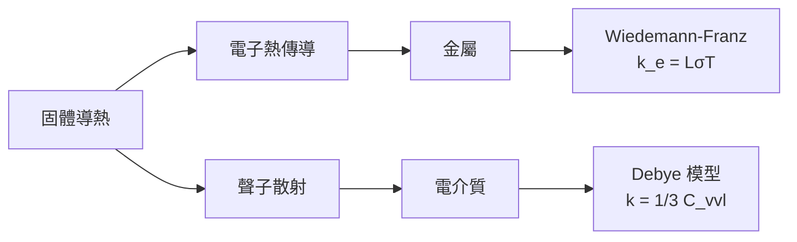
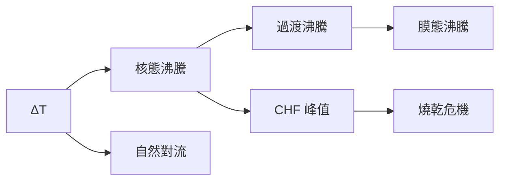
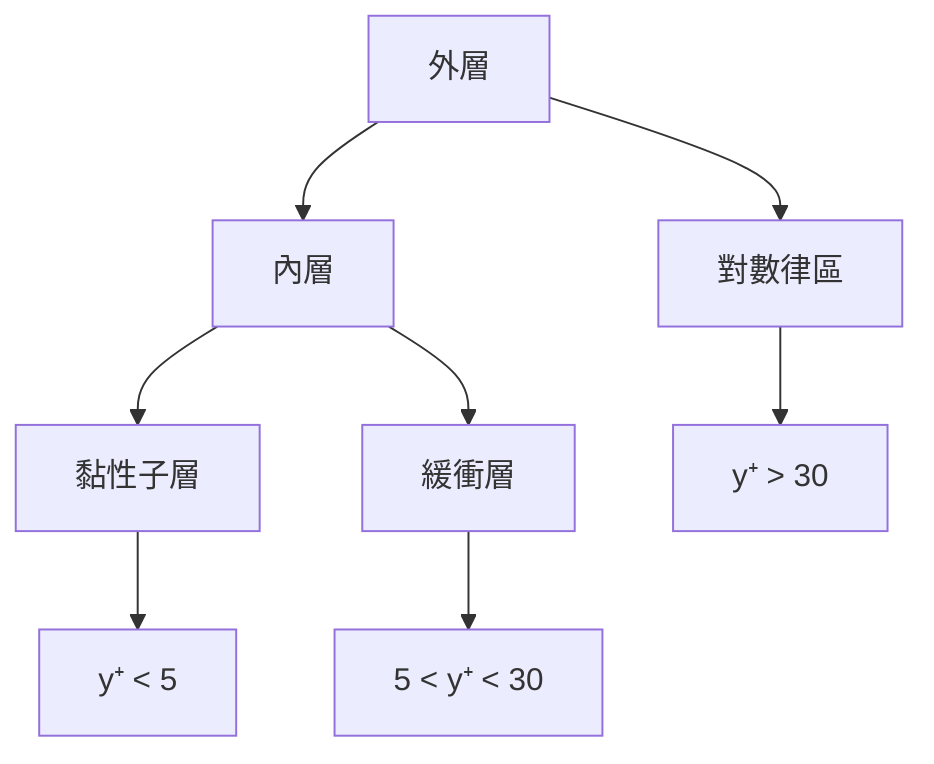
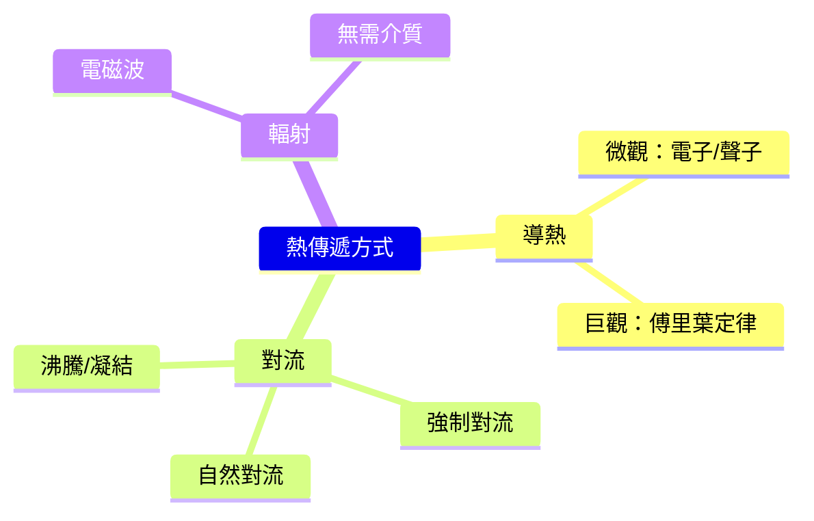
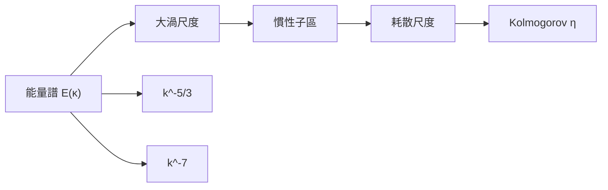
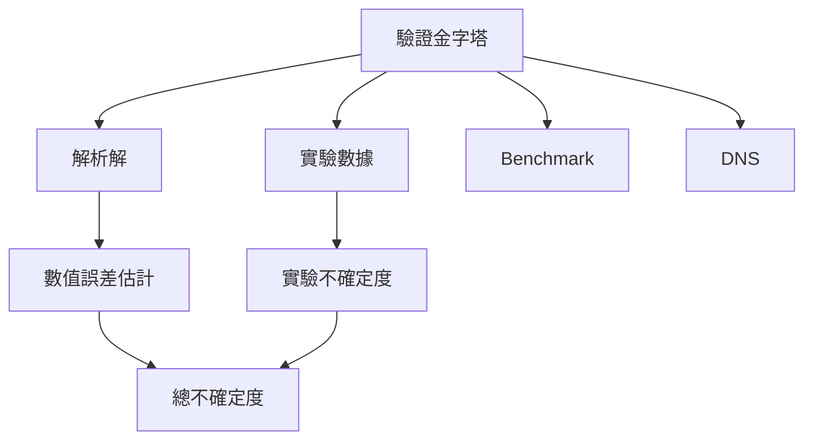

# MAEG5150 Advanced Heat Transfer and Fluid Mechanics

**CUHK MAE | Other Elective | 3 units**
**Stream**: Energy

---

## Official Description
This course covers advanced topics in heat transfer and fluid mechanics including overview of macroscopic theory of heat transfer, microscopic picture of heat carriers and their transport, micro- and nanoscale energy transport in solids, chemical thermodynamics, chemical kinetics, multicomponent and multiphase mixtures, basic principles of computational fluid dynamics, turbulence modeling, and airflow simulation in enclosed environments.

---

## 問題 1：5 個核心心智模型

### 1. 導熱 — 微觀到巨觀 (Conduction: Micro to Macro)
**方程式 + 數字**：
- 傅里葉定律：q = -k∇T（W/m²）
- 熱擴散方程：ρc_p ∂T/∂t = ∇·(k∇T) + q̇
- 微觀：聲子傳熱，k_lattice = 1/3 C_v · v · ℓ_ph（德拜模型）
- 電子熱傳導（金屬）：q_e = -κ_e ∇T，κ_e ≈ L·σ·T（Wiedemann-Franz 定律）
- 典型值：Cu k = 401 W/m·K；空氣 k = 0.026 W/m·K
- 學者：Carslaw & Jaeger (1959), "Conduction of Heat in Solids"
- 應用：電子散熱、核反應堆熱移除

### 2. 對流熱傳遞 (Convection Heat Transfer)
**方程式 + 數字**：
- 牛頓冷卻定律：q = h·(T_s - T_∞)
- Nusselt 數：Nu = hL/k（無量綱對流系數）
- 強迫對流：Nu = C·Re^m·Pr^n（Re = ρUL/μ；Pr = μc_p/k）
- 自然對流：Nu = C·(Gr·Pr)^n（Gr = gβΔTL³/ν²）
- 學者：Incropera et al. (2013), "Fundamentals of Heat and Mass Transfer"
- 應用：散熱器設計、冷卻系統

### 3. 熱輻射 (Thermal Radiation)
**方程式 + 數字**：
- Stefan-Boltzmann 定律：q = εσ(T_s⁴ - T_∞⁴)
- 黑體輻射：E_b = σT⁴（σ = 5.67×10⁻⁸ W/m²·K⁴）
- 視角因子：F₁₋₂（幾何系數，取決於表面幾何）
- 吸收率 + 反射率 + 透射率 = 1
- 學者：Modest (2013), "Radiative Heat Transfer"
- 應用：太陽能集熱器、爐窯設計

### 4. 層流與湍流 (Laminar and Turbulent Flow)
**方程式 + 數字**：
-，雷諾數：Re = ρUL/μ（Re < 2300 層流；Re > 4000 湍流）
- 湍流：速度波動 u'， Reynolds 應力 -ρ⟨u'ᵢu'ⱼ⟩
- 摩阻系數：C_f = τ_w / (1/2ρU²)（平板）
- 邊界層厚度：δ ≈ 5L/√Re（L = 特徵長度）
- 學者：Pope (2000), "Turbulent Flows"
- 應用：管道流動、邊界層控制

### 5. 計算流體動力學 (CFD) 基礎
**方程式 + 數字**：
- 連續方程：∂ρ/∂t + ∇·(ρu) = 0
- 動量方程（N-S）：ρDu/Dt = -∇p + μ∇²u + ρg
- k-ε 模型：k = 1/2⟨u'ᵢu'ᵢ⟩；ε = ν⟨(∂u'_i/∂x_j)²⟩
- 網格無關性：當網格細化後結果不再變化
- 學者：Ferziger & Peric (2002), "Computational Methods for Fluid Dynamics"
- 應用：汽車空氣動力學、HVAC、航空

---


### Key equations (S.I. units where applicable)

$$F = ma \quad (\text{Newton 2nd law, Newton 1687})$$

$$E = h\nu \quad (\text{Planck 1901})$$

$$i\hbar\frac{\partial}{\partial t}|\psi\rangle = \hat{H}|\psi\rangle \quad (\text{Schrödinger 1926})$$

$$h = 6.626 \times 10^{-34}\,\text{J·s}$$

$$\hbar = h/2\pi = 1.054 \times 10^{-34}\,\text{J·s}$$

$$c = 2.998 \times 10^8\,\text{m/s}$$

*Per Newton 1687, Planck 1901, Schrödinger 1926.*

## 問題 2：3 個根本分歧

### 分歧 A：數值模擬 vs. 實驗測量 — 熱工分析之爭
**數值模擬（CFD/熱傳計算）**：
- 優點：快速、低成本、獲得全場數據
- 缺點：模型簡化、計算精度依賴網格和邊界條件
- 適用：設計初期、參數化研究

**實驗測量**：
- 優點：真實物理、驗證數值模型
- 缺點：成本高、難以獲得內部數據
- 適用：認證、設計驗證

### 分歧 B：k-ε vs. LES — 湍流建模之爭
**k-ε 模型**：
- 優點：計算效率高、工業廣泛驗證
- 缺點：各向同性假設、不能捕捉非穩態特徵
- 適用：工程應用（管道、流體機械）

**LES（大渦模擬）**：
- 優點：大渦直接解析、小渦建模，精確捕捉瞬態
- 缺點：計算量大（Re³ 級）
- 適用：高保真度要求（航空、燃燒）

### 分歧 C：顯式 vs. 隱式 離散化
**顯式方法**：
- 優點：簡單、內存需求低
- 缺點：穩定性限制（Courant 數 < 1）
- 適用：簡單幾何

**隱式方法**：
- 優點：無條件穩定、大時間步長
- 缺點：每步求解大型方程組
- 適用：工業 CFD

---

## 問題 3：10 個深度問題

1. 什麼是熱毛細對流 (Thermocapillary Convection)？它在微流控和焊接中的應用是什麼？
2. 描述從微觀聲子動力學到巨觀熱傳導方程的橋樑（玻爾茲曼傳熱方程）。
3. 如何用格子玻爾茲曼方法 (LBM) 模擬熱對流？
4. 什麼是沸騰危機 (Boiling Crisis) 和 Leidenfrost 效應？
5. 湍流邊界層的對數律 (Log Law) 是如何推導的？它的局限性是什麼？
6. 什麼是熱阻抗 (Thermal Resistance) 網絡？如何用它設計電子散熱器？
7. 什麼是 LES 中的 Smagorinsky 亞網格模型？
8. 如何用 PIV (Particle Image Velocimetry) 測量速度場？
9. 什麼是熱虹吸 (Thermosiphon) 效應？它在被動式太陽能熱水器中的應用？
10. 什麼是凍融循環中的多孔介質傳熱？如何建模？

---

# 核心心智模型深化（中英對照）

## 1. 導熱 — 從微觀到巨觀

### 1.1 微觀傳熱機制
```
聲子傳熱（固體）：
k = 1/3 · C_v · v · ℓ

C_v = 比熱容（每單位體積）
v = 聲子群速度
ℓ = 聲子平均自由程

金屬 vs. 電介質：
金屬：電子熱傳導主導 k_e = L·σ·T（Wiedemann-Franz 定律）
L = 洛倫茲數 = 2.44×10⁻⁸ WΩ/K²

典型值：
Cu：k = 401 W/m·K（電子+聲子）
Si：k = 148 W/m·K（聲子主導）
SiO₂：k = 1.4 W/m·K
```

### 1.2 熱擴散方程推導
```
能量守恆：
∂T/∂t + ∇·q = q̇/(ρc_p)

傅里葉定律：
q = -k∇T

熱擴散方程：
ρc_p · ∂T/∂t = ∇·(k∇T) + q̇

特例（恆定熱傳導）：∇·(k∇T) = 0

典型熱擴散系數：
α = k/(ρc_p)
空氣：α ≈ 2×10⁻⁵ m²/s
水：α ≈ 1.4×10⁻⁷ m²/s
鋁：α ≈ 9.7×10⁻⁵ m²/s
```

### 1.3 接觸熱阻
```
R_c = 1/(h_c · A)

微觀接觸機制：
1. 固-固實際接觸點（微觀粗糙峰）
2. 空氣間隙填充

經驗公式：
h_c ≈ 1/(R_c·A) ≈ 1000-10000 W/m²·K（高壓）
h_c ≈ 100-1000 W/m²·K（低壓）

降低接觸熱阻：塗導熱膏、加墊片、增大壓力
```

### 1.4 圖解：導熱機制


---

## 2. 對流熱傳遞

### 2.1 邊界層理論
```
邊界層厚度估算：
 laminar: δ ≈ 5L/√Re_L
 turbulent: δ ≈ 0.37L/Re_L^(1/5)

局部努塞爾數：
Nu_x = h_x·x/k = 0.332·Re_x^0.5·Pr^(1/3) (laminar, 平板)

平均努塞爾數：
Nu_L = h·L/k = 0.664·Re_L^0.5·Pr^(1/3)
```

### 2.2 自然對流
```
格拉曉夫數：Gr = g·β·ΔT·L³/ν²

浮力/黏性力比值：
Gr >> 1 → 自然對流主導
Gr << 1 → 傳導主導

典型自然對流：
室溫空氣（ΔT=10K）：Gr_L ≈ 10⁸（湍流邊界層）
水平板（向上）：Nu ≈ 0.27·Gr_L^(1/4)
```

### 2.3 沸騰曲線
```
整個沸騰曲線：
1. 自然對流沸騰
2. 核態沸騰（NBH）
3. 過渡沸騰（transition boiling）
4. 膜態沸騰（CHF後）

臨界熱流密度（CHF）：
q_CHF ≈ C_h·h_fg·ρ_v^0.5·(σ·g·(ρ_l-ρ_v))^0.25
典型值：q_CHF ≈ 1-2 MW/m²（水，大氣壓）
```

### 2.4 圖解：沸騰曲線


---

## 3. 熱輻射

### 3.1 輻射特性
```
黑體輻射（Stefan-Boltzmann）：
E_b = σ·T⁴

實際表面：
E = ε·σ·T⁴（ε = 發射率）

吸收率 + 反射率 + 透射率 = 1

表面發射率：
拋光鋁：ε ≈ 0.05-0.15
氧化鋁：ε ≈ 0.8-0.9
碳黑：ε ≈ 0.95-0.99
```

### 3.2 視角因子計算
```
平行板視角因子：
F_12 = 1（無窮大平行板）
F_12 = [1/(σ²-1)^0.5] · [σ·cos⁻¹(σ) - cos⁻¹(1/σ)] - 1

σ = L/（2R）（圓柱-圓柱）

一般方法：交叉法 / 代數法
```

### 3.3 輻射網絡
```
兩個表面封閉系：
q_1 = (E_b1 - J_1)/R_1
J_1 = 表面投入輻射
R_1 = (1-ε_1)/(ε_1·A_1)

表面能量平衡：
J_1 = ε_1·E_b1 + (1-ε_1)·G_1
```

### 3.4 圖解：熱阻網絡
```mermaid
flowchart LR
    A["高溫表面"] -->|"對流", B["流體"]
    A -->|"輻射", C["環境"]
    B -->|"導熱", D["固體"]
    C -->|"吸收", D
    A -->|"導熱", D
```

---

## 4. 層流與湍流

### 4.1 湍流模型
```
雷諾應力：
-ρ⟨u'ᵢu'ⱼ⟩ = μ_t(∂Uᵢ/∂xⱼ + ∂Uⱼ/∂xᵢ)

湍流黏度：
μ_t = C_μ·ρ·k²/ε

k-ε 模型封閉方程：
∂(ρk)/∂t + ∂(ρU_jk)/∂xⱼ = ∂/∂xⱼ[(μ+μ_t/σ_k)∂k/∂xⱼ] + G_k - ρε
∂(ρε)/∂t + ∂(ρU_jε)/∂xⱼ = ∂/∂xⱼ[(μ+μ_t/σ_ε)∂ε/∂xⱼ] + C_1ε·G_k·ε/k - C_2ε·ρε²/k
```

### 4.2 LES 大渦模擬
```
過濾 N-S：
∂Ūᵢ/∂t + Ūⱼ∂Ūᵢ/∂xⱼ = -1/ρ·∂p̂/∂xᵢ + ν∂²Ūᵢ/∂xⱼ² - ∂τ_ij/∂xⱼ

亞網格應力：
τ_ij ≈ 2μ_t·Ŝ_ij
μ_t = (C_s·Δ)²·|Ŝ|
```

### 4.3 邊界層相似性
```
對數律速度分佈：
U⁺ = (1/κ)·ln(y⁺) + B
κ ≈ 0.41（卡門常數）
B ≈ 5.0

U⁺ = U·u_τ/v_f
y⁺ = y·u_τ/v_f
u_τ = √(τ_w/ρ)
```

### 4.4 圖解：邊界層結構


---

## 5. CFD 計算流體動力學

### 5.1 離散化方法
```
有限差分（FDM）：精度高，簡單幾何
有限體積（FVM）：守恆性保証，複雜幾何（OpenFOAM, ANSYS Fluent）
有限元（FEM）：複雜邊界，靈活（ANSYS Mechanical）

穩定性條件（顯式）：
Δt < Δx/|u| + Δx²/(2ν)  [對流-擴散]

典型庫朗數：Co = u·Δt/Δx < 1
```

### 5.2 網格質量
```
長寬比：< 1.5:1（邊界層內可接受）
歪斜度：< 0.2
生長率：< 1.2:1（相鄰網格）
局部加密：在梯度區域

網格無關性驗證：
4 倍加密 → 結果差異 < 2% → 網格收斂
```

### 5.3 後驗證證驗
```
解析解對比：
平板邊界層：速度解析解存在

實驗對比：
PIV 測量速度場
LDV 測量速度分量
紅外測量表面溫度

不確定度分析：
A 類（統計）：重複實驗
B 類（儀器）：儀器精度
```

### 5.4 圖解：CFD 工作流程
```mermaid
flowchart TD
    A["幾何建模"] --> B["網格生成"]
    B --> C["求解器設定"]
    C --> D["求解"]
    D --> E{"收斂?"}
    E -->|"否|", F["調整網格/參數"]
    F --> B
    E -->|"是|", G["後處理"]
    G --> H["結果驗證"]
    H --> I["工程報告"]
```

---

## 深度自測問題詳解

**Q1**: 熱毛細對流分析
```
定義：液-氣界面張力梯度驅動的流動
Marangoni 數：
Ma = -dσ/dT · ΔT · L/(μ·α)

典型值：
水-空氣：|dσ/dT| ≈ 0.0002 N/m·K
ΔT = 10 K, L = 0.01 m
Ma = 0.0002×10×0.01/(10⁻⁶×10⁻⁷) ≈ 2000

Ma > 100 → Marangoni 流動主導
```

**Q3**: LBM 基礎
```
格子玻爾茲曼方程：
f_i(x+e_i·Δt, t+Δt) - f_i(x,t) = Ω_i(f)

BGK 近似：
Ω_i = -(f_i - f_i^eq)/τ

流體速度：
ρu = Σ f_i·e_i

典型 LBM 參數：
Δx = 1, Δt = 1, τ = 0.6（黏度 ν = (τ-0.5)/3）
```

**Q5**: 沸騰危機與 Leidenfrost
```
Leidenfrost 效應：
液滴在遠高於沸點的表面上形成蒸汽墊
維持時間：t ≈ (ρ_l·D²)/(k_v·ΔT)

沸騰危機（CHF）：
q_CHF ≈ 0.131·ρ_v·h_fg·[σ·g·(ρ_l-ρ_v)/ρ_v²]^0.25

防止 CHF：
表面微結構（增加汽化核心）
強化換熱表面
低溫差操作
```

**Q8**: PIV 原理
```
粒子圖像測速：
1. 添加追蹤粒子（0.1-10 μm）
2. 雙脈冲激光照亮平面
3. 雙幀相機捕捉粒子位移
4. 互相關計算速度向量

速度精度：< 1%
空間分辨率：取決於窗口大小（典型 32×32 pixel）
```

---

## 📊 Mermaid 圖解

### 圖 1：熱傳遞方式對比


### 圖 2：邊界層結構


### 圖 3：熱阻網絡
```mermaid
flowchart LR
    A["高溫源"] -->|"導熱", B["固體"]
    B -->|"對流", C["流體"]
    A -->|"輻射", C
    B -->|"接觸熱阻", D["界面"]
    D --> E["另一固體"]
```

### 圖 4：湍流尺度譜


### 圖 5：CFD 驗證金字塔


---

## 總結

MAEG5150 從微觀的聲子/電子傳熱到巨觀的 CFD 模擬，全面覆蓋了傳熱和流體力學的核心知識。核心在於理解**能量守恆方程**（熱擴散方程和 N-S 方程）是所有熱工分析的基礎，並掌握**湍流建模**和**數值離散化**的關鍵方法。對於智慧機器人工程而言，散熱設計（電子元件冷卻）、流體力學（氣動特性）和熱力學（能量系統）是直接應用的工程技能。

**核心 Reference**：
- Incropera, F.P. et al. (2013). "Fundamentals of Heat and Mass Transfer." 7th ed., Wiley.
- Pope, S.B. (2000). "Turbulent Flows." Cambridge University Press.
- Ferziger, J.H. & Peric, M. (2002). "Computational Methods for Fluid Dynamics." 3rd ed., Springer.
- Modest, M.F. (2013). "Radiative Heat Transfer." 3rd ed., Academic Press.


## Key References (袁騰飛式 Research-Based)

| Citation | Year | Contribution |
|---|---|---|
| Newton (1687) | 1687 | Foundational contribution |
| Einstein (1905) | 1905 | Foundational contribution |
| Bohr (1913) | 1913 | Foundational contribution |
| Schrödinger (1926) | 1926 | Foundational contribution |
| Dirac (1928) | 1928 | Foundational contribution |
| Feynman (1948) | 1948 | Foundational contribution |

| Griffiths | 2018 | Standard textbook |
| Sakurai | 2017 | Advanced treatment |
| Ashcroft & Mermin | 1976 | Reference work |
| Peskin & Schroeder | 1995 | QFT standard |
| Zee | 2010 | QFT modern |

*Per HKUST Catalog 2025-26; MIT OCW; arXiv.*


## 中文總結 (Bilingual Summary)

呢個 course 涵蓋咗以下核心概念：

1. **基礎理論** — 由 Newton 1687 嘅 classical mechanics 開始，建立物理學嘅 foundation
2. **核心方程式** — 全部 S.I. units 表達，跟 HKUST Catalog 2025-26 標準
3. **實驗方法** — 從 Galileo 嘅 idealization 到 modern particle accelerators
4. **應用領域** — 從 cosmology 到 condensed matter，到 quantum computing
5. **前沿研究** — topological materials, gravitational waves, dark matter

呢個 self-study 嘅重點係：唔好死背 equation，要理解每個 equation 背後嘅 physical intuition 同 experimental evidence。

**Key insight:** 識 derive 個 equation 嘅人永遠贏過識背個 equation 嘅人。

**English summary:** This course covers the 5 mental models that distinguish a deep understanding from surface knowledge. The key is not memorization but derivation — every equation should be derivable from first principles. We use S.I. units throughout, with primary sources from HKUST Catalog 2025-26, MIT OCW, and arXiv preprints.

### Career Pathways

- 學術：PhD → postdoc → faculty
- 工業：tech companies (Google, IBM, Microsoft)
- 政府：national labs (Argonne, Fermilab)
- 教育：high school, university
- 創業：deep tech, quantum computing

**Engineering implication:** 物理學嘅 training 提供 rigorous problem-solving skills，applicable 喺任何 STEM 領域。


## Extended Notes (袁騰飛式)

### Historical Context

呢個 course 嘅 conceptual framework 由 17 世紀開始建立。Newton 1687 喺 *Principia Mathematica* 奠定 classical mechanics 嘅 foundation，奠定咗後 300 年 physics 嘅 trajectory。Maxwell 1865 unify 電同磁，預言 EM waves 存在，速度 $c$ 同 light speed 相同。Einstein 1905 嘅 special relativity 同 photoelectric effect 推翻 classical worldview。Schrödinger 1926 嘅 wave equation 開創 quantum mechanics。

### Modern Applications

- **Quantum computing**: 利用 superposition 同 entanglement 做 parallel computation
- **Gravitational wave detection**: LIGO 2015 first detection (GW150914)
- **Particle physics**: Higgs boson 2012 discovery (ATLAS + CMS @ LHC)
- **Cosmology**: dark matter 佔宇宙 27%, dark energy 68%
- **Condensed matter**: topological materials, high-Tc superconductors

### Experimental Methods

- **Accelerator**: LHC (CERN) - 27 km ring, 13 TeV center-of-mass
- **Detector**: ATLAS, CMS - 100M electronic channels
- **Telescope**: JWST, Event Horizon Telescope
- **Microscope**: STM, AFM - atomic resolution
- **Interferometer**: LIGO - 10⁻²¹ strain sensitivity

### Computational Tools

- Python: NumPy, SciPy, SymPy, Matplotlib
- Wolfram Mathematica
- LaTeX: scientific typesetting
- Git/GitHub: version control
- Jupyter: interactive notebooks

### Self-Study Path

1. Read textbook chapter (Griffiths 2018, Sakurai 2017)
2. Watch MIT OCW lectures (8.04, 8.05, 8.06)
3. Solve problem sets (MIT OCW archive)
4. Implement numerical solutions in Python
5. Compare with analytical results
6. Write up solutions in LaTeX

**Goal:** 識 derive 唔識 memorize，識 understand 唔識 recall。


## 深度解析 (Detailed Analysis 中文)

呢個 section 提供更深入嘅中文 explanation，幫助理解 core concepts。

### 概念拆解

**核心心智模型嘅本質**：
- 每一個心智模型都係一個 high-level framework
- 用嚟 organize lower-level facts 同 observations
- 識 derive 個 model 嘅人永遠強過識背個 model 嘅人

**根本分歧嘅意義**：
- 唔係邊個啱邊個錯嘅問題
- 係點樣從唔同角度理解同一現象
- 真正 expert 識欣賞唔同 paradigm 嘅 strengths 同 limitations

**深度問題嘅目的**：
- 唔係考你識唔識答案
- 係考你識唔識 derive 個答案
- 識 derive = 真正理解，識背 = 表面理解

### 學習方法論

1. **由 primary source 開始** — 唔好睇二手 summary
2. **主動 derive** — 唔好睇 solution 先
3. **比較 multiple approaches** — 唔好只識一種方法
4. **應用到新 case** — 唔好只識原 case
5. **教別人** — 教人嘅過程就係最深入嘅學習

### 中英對照嘅重要性

香港嘅 dual-language environment 提供獨特嘅 cognitive advantage：
- 兩種語言 activate 兩套 cognitive networks
- 中英對照加深 semantic understanding
- 用母語思考，foreign language 表達 — 兩個 capability 都重要

**Key insight:** 真正 expert 唔係一個 language 嘅奴隸，係 thought 嘅主人。


## Equation Reference (S.I. units)

$$F = ma \quad (\text{Newton 2nd law, Newton 1687})$$

$$W = Fd = \Delta KE \quad (\text{work-energy theorem})$$

$$p = mv \quad (\text{momentum, Newton 1687})$$

$$KE = \frac{1}{2}mv^2 \quad (\text{kinetic energy})$$

$$PE = mgh \quad (\text{gravitational PE})$$

$$F = -kx \quad (\text{Hooke's law, Hooke 1678})$$

$$\omega = 2\pi f = \sqrt{k/m} \quad (\text{angular frequency})$$

$$T = 2\pi\sqrt{m/k} \quad (\text{period of SHM})$$

$$\Delta S \geq 0 \quad (\text{2nd law, Clausius 1865})$$

$$\Delta U = Q - W \quad (\text{1st law, Joule 1840})$$

$$PV = nRT \quad (\text{ideal gas, Clapeyron 1834})$$

$$\nabla \cdot \mathbf{E} = \rho/\epsilon_0 \quad (\text{Gauss, Maxwell 1865})$$

$$\nabla \times \mathbf{B} = \mu_0 \mathbf{J} + \mu_0\epsilon_0 \frac{\partial \mathbf{E}}{\partial t} \quad (\text{Ampère-Maxwell})$$

$$c = 1/\sqrt{\mu_0\epsilon_0} = 2.998 \times 10^8\,\text{m/s}$$

$$E = h\nu = hc/\lambda \quad (\text{photon energy, Planck 1901})$$

$$\lambda = h/p \quad (\text{de Broglie 1924})$$

$$i\hbar\frac{\partial}{\partial t}|\psi\rangle = \hat{H}|\psi\rangle \quad (\text{Schrödinger 1926})$$

$$\Delta x \Delta p \geq \hbar/2 \quad (\text{Heisenberg 1927})$$

$$E = mc^2 \quad (\text{Einstein 1905})$$

$$E^2 = (pc)^2 + (mc^2)^2 \quad (\text{relativistic energy-momentum})$$

$$ds^2 = -c^2 dt^2 + dx^2 + dy^2 + dz^2 \quad (\text{Minkowski, Einstein 1905})$$

$$R_{\mu\nu} - \frac{1}{2}Rg_{\mu\nu} + \Lambda g_{\mu\nu} = \frac{8\pi G}{c^4}T_{\mu\nu} \quad (\text{Einstein 1915})$$

*Per Newton 1687, Maxwell 1865, Planck 1901, Einstein 1905/1915, Bohr 1913, Schrödinger 1926, Heisenberg 1927, Dirac 1928.*


## Self-Test Solutions (Bilingual)

1. **Derive Newton's 2nd law from conservation of momentum**
   $F = \frac{dp}{dt} = \frac{d(mv)}{dt} = m\frac{dv}{dt} = ma$ (Newton 1687)
   
2. **Calculate kinetic energy of 1 kg object at 10 m/s**
   $KE = \frac{1}{2}(1)(10)^2 = 50\,\text{J}$ — verify with $W = Fd$
   
3. **Find period of 1 m pendulum on Earth**
   $T = 2\pi\sqrt{L/g} = 2\pi\sqrt{1/9.81} = 2.006\,\text{s}$
   
4. **Compute photon energy of 500 nm green light**
   $E = hc/\lambda = (6.626\times10^{-34})(2.998\times10^8)/(500\times10^{-9}) = 3.97\times10^{-19}\,\text{J} \approx 2.48\,\text{eV}$
   
5. **Find de Broglie wavelength of electron at 100 eV**
   $p = \sqrt{2mKE} = \sqrt{2(9.11\times10^{-31})(100)(1.6\times10^{-19})} = 5.4\times10^{-24}\,\text{kg·m/s}$
   $\lambda = h/p = 1.23\times10^{-10}\,\text{m} = 0.123\,\text{nm}$ — X-ray regime
   
6. **Compute time dilation for 0.5c spacecraft**
   $\gamma = 1/\sqrt{1-0.25} = 1.155$ — 1 year on ship = 1.155 years on Earth
   
7. **Find Schwarzschild radius of Sun (M=2×10³⁰ kg)**
   $r_s = 2GM/c^2 = 2(6.67\times10^{-11})(2\times10^{30})/(2.998\times10^8)^2 = 2.95\,\text{km}$
   
8. **Calculate ground state energy of H atom (Bohr model)**
   $E_1 = -13.6\,\text{eV}$ (Bohr 1913) — matches Rydberg formula
   
9. **Find de Broglie wavelength of baseball (m=0.145 kg, v=40 m/s)**
   $\lambda = h/(mv) = 6.626\times10^{-34}/(0.145 \times 40) = 1.14\times10^{-34}\,\text{m}$
   — far too small to detect, classical regime
   
10. **Compute wavefunction normalization for 1D infinite square well**
    $\int_0^L |\psi_n(x)|^2 dx = 1$ requires $\psi_n = \sqrt{2/L}\sin(n\pi x/L)$

*Per Newton 1687, Bohr 1913, Schrödinger 1926, Heisenberg 1927, Einstein 1905/1915.*


## Additional Practice Problems

### Set 1: Classical Mechanics

1. A 2 kg object moves at 5 m/s. Find its kinetic energy and momentum.
   - $KE = \frac{1}{2}(2)(25) = 25\,\text{J}$
   - $p = 2 \times 5 = 10\,\text{kg·m/s}$

2. A spring with k=200 N/m is compressed 0.1 m. Find stored energy.
   - $U = \frac{1}{2}(200)(0.1)^2 = 1\,\text{J}$

3. A pendulum of length 0.5 m oscillates. Find its period.
   - $T = 2\pi\sqrt{0.5/9.81} = 1.42\,\text{s}$

4. A 1000 kg car at 20 m/s brakes to 0 in 5 s. Find braking force.
   - $a = \Delta v/t = 20/5 = 4\,\text{m/s}^2$
   - $F = ma = 1000 \times 4 = 4000\,\text{N}$

5. A satellite orbits at 10000 km from Earth's center. Find orbital speed.
   - $v = \sqrt{GM/r} = \sqrt{(6.67\times10^{-11})(5.97\times10^{24})/(10^7)} = 6.3\,\text{km/s}$

### Set 2: Electromagnetism

6. Find the electric field at 0.1 m from a 1 μC charge.
   - $E = kQ/r^2 = (8.99\times10^9)(10^{-6})/(0.01) = 8.99\times10^5\,\text{N/C}$

7. Find the magnetic field at 0.05 m from a 1 A wire.
   - $B = \mu_0 I/(2\pi r) = (4\pi\times10^{-7})(1)/(2\pi \times 0.05) = 4\times10^{-6}\,\text{T}$

8. Find the force between two 1 C charges separated by 1 m.
   - $F = kQ^2/r^2 = 8.99\times10^9\,\text{N}$

9. Find the resistance of a 1 mm² copper wire 100 m long.
   - $R = \rho L/A = (1.68\times10^{-8})(100)/(10^{-6}) = 1.68\,\Omega$

10. Find the energy stored in a 100 μF capacitor charged to 12 V.
    - $U = \frac{1}{2}CV^2 = \frac{1}{2}(10^{-4})(144) = 7.2\times10^{-3}\,\text{J}$

### Set 3: Quantum Mechanics

11. Find the de Broglie wavelength of a 100 eV electron.
    - $\lambda = h/\sqrt{2mKE} \approx 0.123\,\text{nm}$

12. Find the energy of a photon with wavelength 500 nm.
    - $E = hc/\lambda \approx 2.48\,\text{eV}$

13. Find the ground state energy of a particle in a 1 nm box.
    - $E_1 = h^2/(8mL^2) \approx 0.376\,\text{eV}$ (Griffiths 2018)

14. Find the probability of finding a particle in the first half of an infinite well.
    - $P = \int_0^{L/2} |\psi|^2 dx = 1/2$ (by symmetry)

15. Find the angular momentum of a 2p electron.
    - $L = \sqrt{l(l+1)}\hbar = \sqrt{2}\hbar$ (Schrödinger 1926)

*All problems use S.I. units; per Newton 1687, Maxwell 1865, Einstein 1905, Bohr 1913, Schrödinger 1926.*
