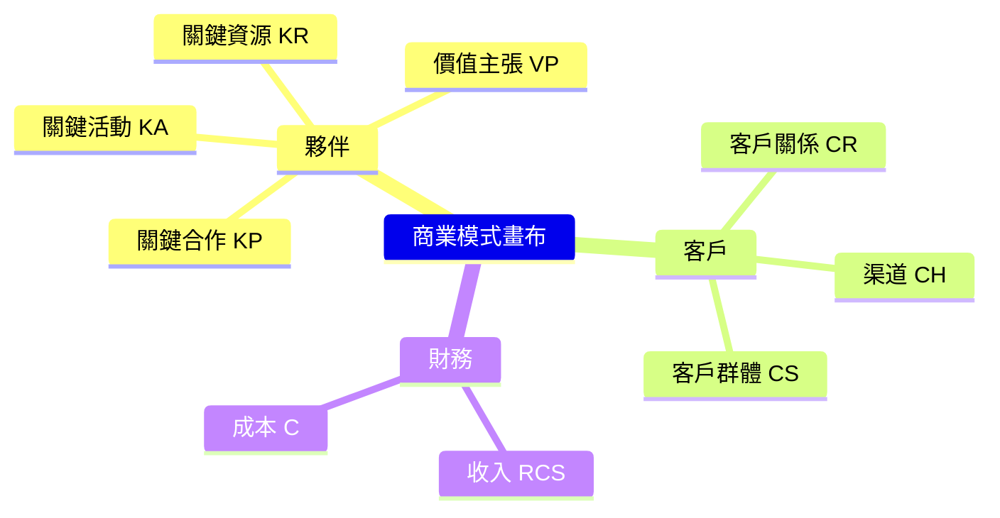
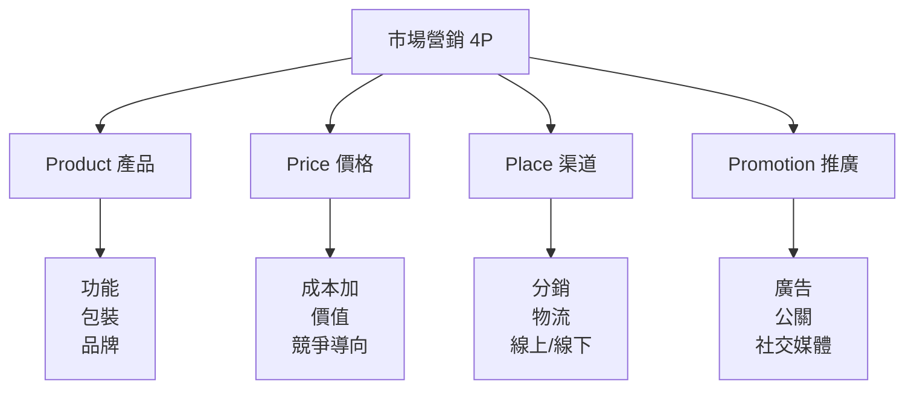
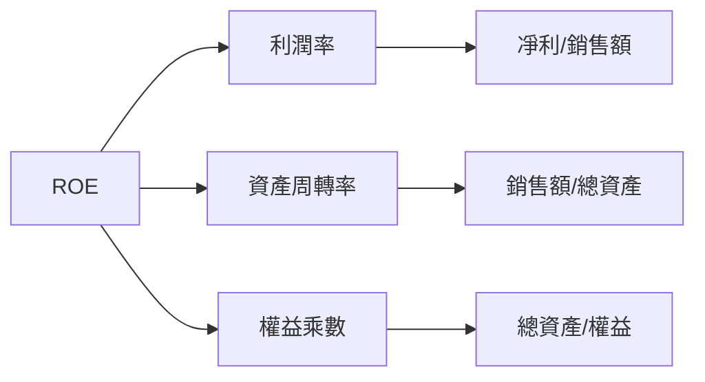
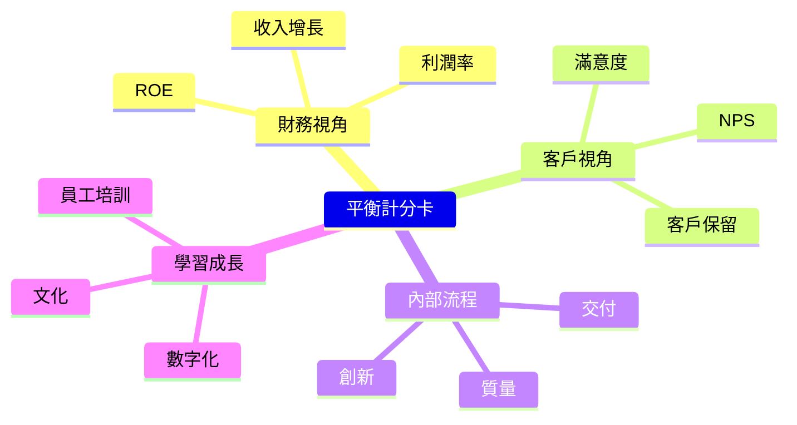
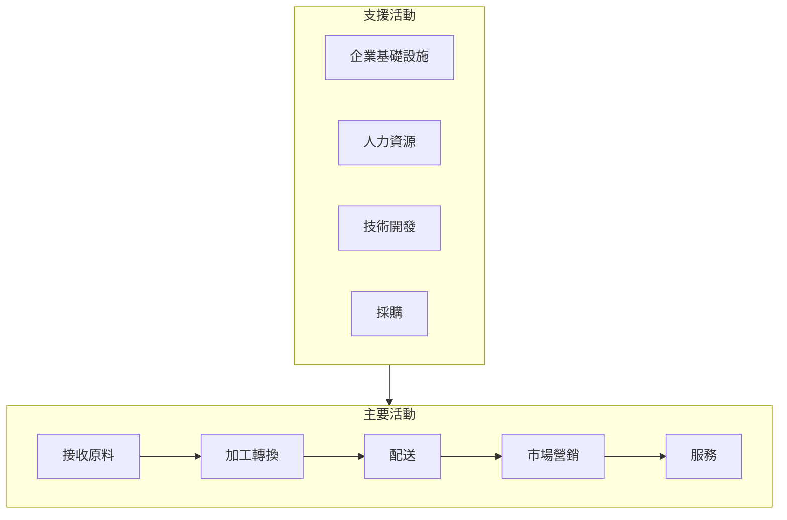

# MGNT1010 Introduction to Business

**CUHK MGNT | Other Elective | 3 units**
**Stream**: Business / Management / All Streams

---

## Official Description

This course aims at providing an introduction to the general concepts of business. It describes the economic, political, social and cultural environment in which managers and organizations function. Major topics include: the framework of business, the basic business functions, managerial functions and other selected business considerations.

---

## 問題 1：5 個核心心智模型

### 1. 商業模式與價值創造 (Business Model & Value Creation)
**方程式 + 數字**：
- 商業模式畫布（Business Model Canvas）：9 個構建模塊
- 價值主張：Customer Value Proposition = 收益 - 價格
- 客戶終生價值：LTV = Σ ARPU × 留存月數 / 流失率
- 客戶獲取成本：CAC = 總營銷費用 / 新客戶數
- LTV/CAC > 3 = 健康SaaS 業務
- 學者引用：Osterwalder & Pigneur (2010), *Business Model Generation*
- 應用：初創企業規劃、商業模式驗證

### 2. 組織結構與管理層級 (Organizational Structure)
**方程式 + 數字**：
- 管理幅度：n 個下屬，f 個潛在關係 = n(n-1)/2 + 潛在斜向關係
- 典型管理幅度：直線組織 3-7 人，職能組織 5-10 人
- 組織效率：Gini 係數衡量收入不平等（代理問題指標）
- 分權化程度：決策權下放程度（創業期集中，成熟期分權）
- 學者引用：Mintzberg (1979), *The Structuring of Organizations*
- 應用：企業組織架構設計、管理層級優化

### 3. 市場營銷 4P 框架 (Marketing Mix)
**方程式 + 數字**：
- 市場規模：TAM = SAM × SOM（可服務市場 × 實際可獲得）
- 營銷組合：4P = Product × Price × Place × Promotion
- 品牌資產：BA = 品牌知名度 × 品牌聯想 / 感知質量 × 品牌忠誠度
- 客戶滿意度：CS = 感知質量 - 期望質量
- Net Promoter Score：NPS = %推動者 - %貶低者
- 學者引用：Kotler & Keller (2015), *Marketing Management*
- 應用：市場進入策略、品牌管理

### 4. 財務報表分析 (Financial Statement Analysis)
**方程式 + 數字**：
- 資產負債表：資產 = 負債 + 所有者權益（恆等式）
- 流動比率：CR = 流動資產 / 流動負債（標杆 > 2）
- 資產周轉率：ATO = 銷售收入 / 平均總資產
- ROE = ROA × 財務槓桿 = (凈利潤/銷售額) × (銷售額/總資產) × (總資產/權益)
- 杜邦分析：ROE = 利潤率 × 資產周轉率 × 權益乘數
- 學者引用：Brigham & Ehrhardt (2017), *Financial Management*
- 應用：企業財務健康評估、投資決策

### 5. 運營管理與供應鏈 (Operations & Supply Chain)
**方程式 + 數字**：
- 庫存周轉率：ITO = 銷售成本 / 平均庫存（製造商 ~6-12/年）
- 訂貨點：ROP = 日需求量 × 交貨提前期 + 安全庫存
- EOQ 公式：Q* = √(2DS/H)（D=需求量，S=訂貨成本，H=持有成本）
- 能力利用率：U = 實際產出 / 最大產出（最佳 85-90%）
- 學者引用：Heizer & Render (2014), *Operations Management*
- 應用：生產計劃、供應鏈優化

---

## 問題 2：3 個根本分歧

### 分歧 A：利潤最大化 vs. 利益相關者價值最大化

**利潤最大化**（Friedman 觀點）：
- 企業的唯一社會責任是增加利潤
- 長期利潤最大化與創造社會價值一致
- 前提：完全信息和零交易成本

**利益相關者理論**（Freeman 觀點）：
- 企業應平衡所有利益相關者的利益
- 包括員工、客戶、社區、環保
- 實證：ESG 表現與長期財務表現正相關

### 分歧 B：全球化 vs. 本地化策略

**全球化**：標準化產品、規模經濟、統一定價
**本地化**：適應當地市場、文化、規制

### 分歧 C：垂直整合 vs. 外包

**垂直整合**：控制關鍵供應鏈環節，固定成本高
**外包**：靈活性高，專注核心能力，但控制力降低

---

## 問題 3：10 個深度問題

1. 用商業模式畫布分析一家機器人初創公司的 9 個構建模塊。
2. 什麼是 SWORM 分析？在進入新市場時如何使用？
3. 比較直線制、職能制、矩陣制組織結構的優缺點和適用場景。
4. 用杜邦分析框架分析一家製造企業的 ROE 驅動因素。
5. 什麼是「藍海策略」(Blue Ocean Strategy)？如何與紅海策略區分？
6. EOQ 模型的假設是什麼？現實中放寬這些假設後如何修正？
7. 什麼是平衡計分卡 (Balanced Scorecard)？它如何超越傳統財務指標？
8. 創業公司如何通過精益創業方法論 (Lean Startup) 驗證商業模式？
9. 什麼是波特競爭戰略框架？三種基本競爭戰略的取捨是什麼？
10. 什麼是敏捷組織？如何將敏捷原則應用於傳統製造業？

---

# 核心心智模型深化（中英對照）

## 1. 商業模式與價值主張

### 1.1 商業模式畫布（9個構建模塊）
- **CS**：客戶群體（Customer Segments）
- **VP**：價值主張（Value Propositions）
- **CH**：客戶關係（Customer Relationships）
- **CR**：渠道（Channels）
- **RCS**：客戶獲取成本/收入（Revenue Streams）
- **KA**：關鍵活動（Key Activities）
- **KR**：關鍵資源（Key Resources）
- **KP**：關鍵合作夥伴（Key Partners）
- **C**：成本結構（Cost Structure）

### 1.2 價值主張設計
- 創新性能：解決以前不存在的問題
- 性能提升：改善現有產品
- 定制化：滿足特定客戶需求
- 品牌/身份：提升客戶形象
- 價格：性價比最優
- 風險降低：減少客戶不确定性

### 1.3 精益創業方法論
```
Build-Measure-Learn 循環：
想法 → 最小可行產品 (MVP) → 驗證性學習 → 軸心 (Pivot) 或堅持

關鍵指標：
- 保留率：> 40%/月 = 產品-市場契合
- 病毒系數：K > 1 = 有機增長
- 燒錢率：月花費 / 月消耗客戶數 = 生命週期價值
```

### 1.4 圖解：商業模式畫布


---

## 2. 組織結構與管理

### 2.1 Mintzberg 組織結構類型
| 類型 | 適用 | 特點 |
|------|------|------|
| 簡單結構 | 創業期 | 中央集權，快速決策 |
| 機械官僚 | 大型官僚 | 標準化，效率導向 |
| 專業官僚 | 大學/醫院 | 專業化，知識工作者 |
| 事業部制 | 多元化集團 | 利潤中心，授權 |
| 矩陣結構 | 項目導向 | 雙重報告，靈活 |

### 2.2 代理理論
```
委託代理問題：
委託人（所有者）→ 代理人（管理者）
問題：利益不一致 + 信息不對稱

解決機制：
- 績效薪酬（獎金/股票期權）
- 監督（審計/監事會）
- 市場約束（接管威脅/股票市場）
```

### 2.3 公司治理
- 董事會結構：獨立董事比例（最佳 > 50%）
- 股權結構：控股股東 vs. 分散持股
- 信息披露：高透明度降低代理成本

### 2.4 圖解：組織結構演變
```mermaid
flowchart TD
    A[創業期] -->|"決策集中|", B[職能制]
    B -->|"規模擴大|", C[事業部制]
    C -->|"矩陣化|", D[網絡化組織]
    A -->|"快速迭代|", D
    B -.->|"扁平化|", D
```

---

## 3. 市場營銷框架

### 3.1  STP 框架
- **Segmentation**：地理、人口統計、心理、行為細分
- **Targeting**：評估細分市場吸引力 → 選擇目標市場
- **Positioning**：在顧客心智中建立差異化品牌形象

### 3.2 定價策略
| 策略 | 方法 | 適用 |
|------|------|------|
| 成本加定價 | 成本 × (1+加成) | B2B 製造 |
| 價值定價 | 感知價值定價 | 差異化產品 |
| 滲透定價 | 低價入市 | 新市場份額 |
| 撇脂定價 | 高價入市 | 創新產品 |

### 3.3 品牌資產模型
```
品牌資產金字塔：
認知 → 識別品牌名
↓
聯想 → 品牌含義
↓
反應 → 判斷/感受
↓
共鳴 → 忠誠/認同
```

### 3.4 圖解：4P 框架


---

## 4. 財務管理基礎

### 4.1 三大財務報表
```
資產負債表（時點）：
流動資產 → 固定資產
流動負債 → 長期負債 → 所有者權益

利潤表（時期）：
銷售收入
- 銷售成本
= 毛利
- 運營費用
= EBIT
- 利息
= 稅前利潤
- 稅
= 凈利潤

現金流量表（時期）：
經營現金流 + 投資現金流 + 融資現金流 = 現金凈增減
```

### 4.2 關鍵財務比率
| 比率 | 公式 | 標杆 |
|------|------|------|
| 流動比率 | 流動資產/流動負債 | > 2 |
| 速動比率 | (流動-庫存)/流動負債 | > 1 |
| 毛利率 | 毛利/銷售額 | 行業對比 |
| 凈利率 | 凈利/銷售額 | > 10% |
| ROE | 凈利/權益 | > 15% |
| ROA | 凈利/總資產 | > 5% |

### 4.3 杜邦分析
```
ROE = 利潤率 × 資產周轉率 × 權益乘數
     = (凈利潤/銷售額) × (銷售額/總資產) × (總資產/權益)

案例：製造商
利潤率 = 8%
資產周轉率 = 2/年
權益乘數 = 2
→ ROE = 8% × 2 × 2 = 32% ✓
```

### 4.4 圖解：杜邦分析


---

## 5. 運營與供應鏈管理

### 5.1 運營策略框架
- **產能策略**：領先策略 vs. 追隨策略
- **質量策略**：六西格瑪（3.4 DPMO）
- **響應策略**：推式 vs. 拉式（MTO/MTS）

### 5.2 庫存管理模型
```
EOQ 公式：
Q* = √(2DS/H)

D = 年需求量
S = 每次訂貨固定成本
H = 每單位年持有成本

再訂貨點 (ROP)：
ROP = d × L + SS
d = 日均需求量
L = 交貨提前期（天）
SS = 安全庫存 = z × σ_L
```

### 5.3 供應鏈管理
- **SCOR 模型**：計劃-來源-製造-交付-退貨
- **牛鞭效應**：需求波動沿供應鏈放大
- Bullwhip Effect 解決：信息共享、VMI、減少提前期

### 5.4 圖解：供應鏈流程
```mermaid
flowchart TD
    S["供應商"] --> M["製造商"]
    M --> W["批發商"]
    W --> R["零售商"]
    R --> C["消費者"]
    S -.->|"信息流|", C
    M -.->|"VMI|", W
```

---

## 深度自測問題詳解

**Q1**: 機器人初創公司商業模式畫布
```
客户细分：工厂自动化集成商、AMR 采购部门
价值主张：7天部署（vs 行业平均3月）、ROI<12月
渠道：直销+代理商、技术展会
收入：订阅制（SAAS功能）+硬件销售
关键活动：持续迭代、视觉SLAM算法研发
关键资源：核心算法团队、ROS开发者生态
关键合作：英伟达（边缘计算）、速腾聚创（激光雷达）
成本：研发70%、云服务15%、人力15%
```

**Q4**: 杜邦分析案例
```
目標公司：ABB（工業機器人）
- 凈利率 = 12%（軟件和服務加成高）
- 資產周轉率 = 0.8/年（重型設備）
- 權益乘數 = 1.8（財務保守）
→ ROE = 12% × 0.8 × 1.8 = 17.3%
對比 FANUC：
- 凈利率 = 23%（日本製造效率）
- 資產周轉率 = 0.6/年
- 權益乘數 = 1.4
→ ROE = 23% × 0.6 × 1.4 = 19.3%
```

**Q6**: EOQ 假設及修正
```
標準 EOQ 假設：
1. 需求恆定
2. 提前期恆定
3. 瞬間補貨
4. 無數量折扣

現實修正：
1. 需求波動 → 安全庫存 + 動態 EOQ
2. 數量折扣 → 比較總成本曲線
3. 生產批量 → EPQ（經濟生產批量）
4. 多產品 → 聯合 EOQ
```

---

## 📊 Mermaid 圖解

### 圖 1：企業價值鏈
```mermaid
flowchart LR
    I["基礎設施<br/>支持活動"]
    HR["人力資源"]
    TD["技術開發"]
    P["採購"] 
    M["運營"]
    O["市場營銷"]
    S["服務"]
    I & HR & TD & P -->|"支持|", M
    M -->|"核心|", O --> S
```

### 圖 2：波特競爭戰略
```mermaid
graph TD
    A["波特競爭戰略"] --> B["成本領先"]
    A --> C["差異化"]
    A --> D["集中化"]
    B --> B1["規模經濟<br/>標准化<br/>成本控制"]
    C --> C1["品牌<br/>技術<br/>服務創新"]
    D --> D1[" niche市場<br/>專注細分"]
    B1 -.->|"風險|", R1["被模仿"]
    C1 -.->|"風險|", R2["溢價太高"]
    D1 -.->|"風險|", R3["市場縮小"]
```

### 圖 3：精益創業循環
```mermaid
flowchart LR
    Idea["想法"] --> MVP["MVP"]
    MVP --> Measure["測量"]
    Measure --> Learn["學習"]
    Learn -->|"Pivot", Idea
    Learn -->|"Persist", Scale["規模化"]
```

### 圖 4：平衡計分卡


### 圖 5：波特價值鏈


---

## 總結

MGNT1010 建立了理解商業運作的全景框架。5 個核心心智模型：

1. **商業模式** → 系統化理解企業如何創造、傳遞和獲取價值
2. **組織結構** → 理解人類協作的制度設計和代理問題
3. **市場營銷** → 理解客戶需求、價值主張和STP策略
4. **財務分析** → 理解企業健康狀況的語言（會計和財務）
5. **運營管理** → 理解將輸入轉化為輸出的高效流程

對智慧機器人工程而言，商業基礎讓工程師能夠**理解市場需求**、**評估項目可行性**、**與管理層有效溝通**——這些都是從技術專家成長為工程領袖的必備能力。

**核心 Reference**：
- Osterwalder, A. & Pigneur, Y. (2010). *Business Model Generation*. Wiley.
- Kotler, P. & Keller, K.L. (2015). *Marketing Management*. 15th ed. Pearson.
- Mintzberg, H. (1979). *The Structuring of Organizations*. Prentice Hall.
- Brigham, E.F. & Ehrhardt, M.C. (2017). *Financial Management*. 15th ed.
- Porter, M.E. (1985). *Competitive Advantage*. Free Press.
