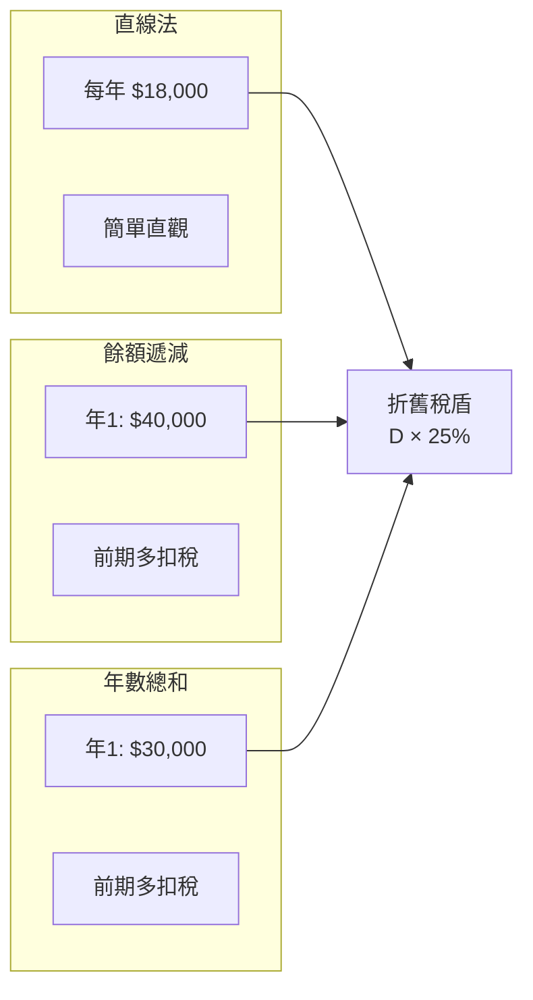

# SEEM2440 Engineering Economics

**CUHK SEEM | Other Elective | 3 units**
**Stream**: Business / Engineering Management

---

## Official Description

Principles of engineering economy. Value and cost; cash flows. Economic analysis of alternatives, technological, social and human factors. Models involving allocation and scheduling of resources. Analytical techniques for evaluating industrial projects. Relationship between economics of technical choice and industrial productivity. Basic financial accounting concepts; accounting cycle; financial statements.

**Instructor**: Prof. Gabriel Fung | SEEM CUHK
**Course Code**: SEEM2440 / ESTR2500

---

## 問題 1：5 個核心心智模型

### 1. 資金時間價值 (Time Value of Money)
**方程式 + 數字**：
- 現值：PV = FV / (1+i)^n
- 未來值：FV = PV × (1+i)^n
- 年金現值：P = A × [(1+i)^n - 1] / [i(1+i)^n]
- 年金未來值：F = A × [(1+i)^n - 1] / i
- 連續複利：FV = PV × e^(in)
- 學者引用：Blank & Tarquin (2018), *Engineering Economy*；Sullivan et al. (2020)
- 應用：工程項目評估、投資決策、設備更新分析

### 2. 凈現值法 (Net Present Value, NPV)
**方程式 + 數字**：
- NPV = -I₀ + Σ[C_t / (1+i)^t]（C_t = 第 t 期凈現金流）
- MARR（最低吸引力回報率）：項目可行 if NPV > 0
- 現值指數：PI = ΣC_t/(1+i)^t / I₀ > 1 → 可行
- 敏感性分析：關鍵變量 ±10% → NPV 變化幅度
- 學者引用：Park (2019), *Fundamentals of Engineering Economics*
- 應用：工廠自動化投資、生產線升級、設備購置

### 3. 內部回報率 (Internal Rate of Return, IRR)
**方程式 + 數字**：
- IRR：NPV = 0 時的折現率 i*
- 判斷準則：IRR > MARR → 項目可行
- 多個 IRR：當現金流符號多次變化時可能出現多個 IRR
- 外部回報率 (ERR)：考慮再投資收益率 = MARR
- 學者引用：Newnan et al. (2020), *Engineering Economic Analysis*
- 應用：項目排序、資本預算決策

### 4. 折舊與稅務分析 (Depreciation and Taxes)
**方程式 + 數字**：
- 直線折舊：D_t = (B - S) / N（B = 原值，S = 殘值，N = 壽命）
- 餘額遞減折舊：D_t = B × d（d = 折舊率，如雙倍餘額 2/N）
- 課稅收入 = 收入 - 運營成本 - 折舊
- 課稅 = max(0, 課稅收入) × 稅率
- 折舊稅盾：折舊 × 稅率 = 現金流節省
- 學者引用：Blank & Tarquin (2018) Ch.7-8
- 應用：資產折舊規劃、稅務優化

### 5. 敏感性分析與風險評估 (Sensitivity Analysis)
**方程式 + 數字**：
- 現值敏感性：S_PV = ΔPV / Δx（變量 x 單位變化對 PV 的影響）
- 盈虧平衡點：NPV = 0 時的臨界變量值
- 蒙特卡洛模擬：N = 10,000 次模擬，概率分佈驅動
- 期望值 E[NPV] = Σ P_i × NPV_i
- 學者引用：Sullivan et al. (2020) Ch.13
- 應用：項目風險識別、決策樹分析

---

## 問題 2：3 個根本分歧

### 分歧 A：NPV vs. IRR — 項目評估哪個更優？

**NPV 優先派**（學術主流）：
- NPV 直接衡量價值創造，單位貨幣
- IRR 可能對項目規模不敏感；多 IRR 問題
- 適用於互斥項目，IRR 可能給出錯誤排序

**IRR 優先派**（實務慣例）：
- IRR 直觀（百分比形式），易於溝通
- 允許與資金成本直接比較
- 風險調整 IRR（Risk-Adjusted IRR）

### 分歧 B：直線折舊 vs. 加速折舊

**直線法**：每年相同金額，簡單直觀
**加速法（餘額遞減/年數總和）**：前期多扣稅，貨幣時間價值有利
**MACRS**：美國稅法標準，GDP 平減調整

### 分歧 C：含稅分析 vs. 不含稅分析

**不含稅**：快速估算，忽略稅務影響
**含稅分析**：更真實的項目經濟評估，考慮折舊稅盾

---

## 問題 3：10 個深度問題

1. 一個工程項目投資 $100,000，預期每年產生 $30,000 的凈現金流，為期 5 年，MARR = 12%。計算 NPV 和 IRR，判斷項目是否可行。

2. 兩台機床 A 和 B 互斥，壽命不同。用等值年度成本 (EAC) 方法選擇最優方案。

3. 什麼是最小吸引力回報率 (MARR)？如何根據機會成本和風險溢價確定？

4. 用敏感性分析評估一個光伏電站項目的經濟可行性，分析電價、利率、建設成本三個關鍵變量。

5. 什麼是盈虧平衡分析？如何用圖解法和解析法求取？

6. 比較直線折舊、雙倍餘額遞減、年數總和折舊三種方法的稅務效果。

7. 一個機器人自動化項目，初期投資 $500,000，每年節省人工成本 $120,000，運營成本 $20,000/年，殘值 $50,000，壽命 7 年，稅率 25%，MARR = 15%。用含稅現金流分析計算 NPV。

8. 什麼是重置分析 (Replacement Analysis)？何時需要進行設備重置決策？

9. 用決策樹分析一個 R&D 項目：成功概率 0.4，收益 $2M；失敗概率 0.6，收益 $0；研發成本 $500,000。

10. 通貨膨脹如何影響工程經濟分析？什麼是名義利率和實際利率的關係？

---

# 核心心智模型深化（中英對照）

## 1. 資金時間價值 — 貨幣的時間維度

### 1.1 現金流時間線
```
t=0 ──→ t=1 ──→ t=2 ──→ ... ──→ t=n
|        |        |              |
-I₀     C₁       C₂             Cₙ+殘值

圖解：
|<---- 建設期 ---->|<---- 運營期 ---->|
0    1    2    3    4    5    6    7  (年)
|______________________________|
           現金流圖
```

### 1.2 複利因子表
```
現值因子：(P/F, i, n) = 1/(1+i)^n
未來值因子：(F/P, i, n) = (1+i)^n
年金現值因子：(P/A, i, n) = [(1+i)^n - 1]/[i(1+i)^n]
年金未來值因子：(F/A, i, n) = [(1+i)^n - 1]/i
資本回收因子：(A/P, i, n) = [i(1+i)^n]/[(1+i)^n - 1]

實例 i=10%, n=5：
(P/F,10%,5) = 0.6209
(P/A,10%,5) = 3.7908
```

### 1.3 等值年度成本 (EAC)
```
EAC = NPV / (P/A, i, n)

兩台設備壽命不同時：
EAC_A = PW_A / (P/A, i, n_A)
EAC_B = PW_B / (P/A, i, n_B)
選擇 EAC 最低的方案
```

### 1.4 實際利率與名義利率
```
名義利率 r_nom，通貨膨脹率 f：
實際利率 i_real = (1 + r_nom)/(1 + f) - 1
≈ r_nom - f （近似）

例：名目利率 12%，通貨膨脹 5%：
i_real = 1.12/1.05 - 1 = 6.67%
```

### 1.5 圖解：現金流時間線

```mermaid
gantt
    title 工程項目現金流
    dateFormat X
    axisFormat %s年
    
    section 建設
    初始投資: done, 0, -100
    設備購置: done, 0, -50
    
    section 運營
    收入: done, 1, 40
    收入: done, 2, 50
    收入: done, 3, 60
    收入: done, 4, 55
    收入: done, 5, 50
    
    section 終了
    殘值: done, 5, 20
```


---

## 2. NPV 與 IRR 方法論

### 2.1 NPV 詳細計算
```
項目數據：
I₀ = $100,000
年現金流：C₁=30,000, C₂=30,000, C₃=30,000, C₄=30,000, C₅=30,000
MARR = 12%
壽命 = 5年

NPV 計算：
NPV = -100,000 + 30,000 × (P/A, 12%, 5)
     = -100,000 + 30,000 × 3.6048
     = -100,000 + 108,144
     = +$8,144 > 0 → 可行 ✓
```

### 2.2 IRR 求解
```
NPV = 0 → -100,000 + 30,000 × (P/A, i*, 5) = 0
(P/A, i*, 5) = 100,000/30,000 = 3.333

插值法：
(P/A, 15%, 5) = 3.3522
(P/A, 14%, 5) = 3.4331

i* ≈ 14.5% （IRR ≈ 14.5%）
IRR = 14.5% > MARR = 12% → 可行 ✓
```

### 2.3 互斥項目選擇
```
項目 A：B₀ = -100, NPV = +10, IRR = 18%
項目 B：B₀ = -200, NPV = +20, IRR = 15%

NPV 法：選擇 B（NPV 更高）
IRR 法：選擇 A（IRR 更高）
→ 矛盾！NPV 法更可靠（A 和 B 規模不同）

增量分析：
ΔA→B：額外投資 100，額外 NPV = 10
增量 IRR = 10% < MARR = 12%
→ 不值得額外投資 → 選擇 A
```

### 2.4 圖解：NPV vs. 折現率
```mermaid
graph LR
    A["折現率 i"] -->|"NPV(i)函數|", B["NPV"]
    B --> C["NPV > 0"]
    B --> D["NPV = 0<br/>IRR"]
    B --> E["NPV < 0"]
    C -.->|"可行|", F["接受項目"]
    D --> G["IRR = 14.5%"]
    E -.->|"不可行|", H["拒絕項目"]
```

---

## 3. 折舊與稅務分析

### 3.1 三種折舊方法比較
```
原值 B = $100,000，殘值 S = $10,000，壽命 N = 5年

直線法：
D = (100,000 - 10,000)/5 = $18,000/年

雙倍餘額遞減（d = 2/5 = 40%）：
年1：D = 100,000 × 0.4 = 40,000
年2：D = (100,000-40,000) × 0.4 = 24,000
年3：D = (100,000-64,000) × 0.4 = 14,400
...（切換直線法）

年數總和：分母 = 1+2+3+4+5 = 15
年1：D = (90,000) × 5/15 = 30,000
年2：D = 90,000 × 4/15 = 24,000
...
```

### 3.2 含稅現金流分析
```
典型含稅現金流表：
年份：0     1     2     3     4     5
收入：  -    100   100   100   100   100
成本：  -    -60   -60   -60   -60   -60
折舊：  -    -18   -18   -18   -18   -18
─────────────────────────────
課稅收入：  22    22    22    22    22
稅（25%）：-5.5 -5.5 -5.5 -5.5 -5.5
─────────────────────────────
稅後現金流：-I₀  94.5  94.5  94.5  94.5  94.5+殘值
```

### 3.3 折舊稅盾
```
年折舊 = $18,000
稅率 = 25%
折舊稅盾 = $18,000 × 25% = $4,500/年

相當於每年節省 $4,500 的稅款
5年總節省 = $22,500

NPV(稅盾) = 4,500 × (P/A, i, n)
           = 4,500 × 3.7908 = $17,059
```

### 3.4 圖解：折舊方法比較


---

## 4. 敏感性分析與風險評估

### 4.1 單變量敏感性分析
```
基準案例：
建設成本 = $500,000
年運營節省 = $120,000
壽命 = 7年，MARR = 15%

基準 NPV = $12,400

變量變化 ±20% 時 NPV：
| 變量        | -20%  | 基準  | +20%  |
|-------------|--------|--------|--------|
| 建設成本    | +$87,400 | +$12,400 | -$62,600 |
| 年運營節省  | -$74,800 | +$12,400 | +$99,600 |
| MARR        | +$42,100 | +$12,400 | -$10,800 |
| 壽命        | -$5,000  | +$12,400 | +$28,000 |

結論：年運營節省最敏感 → 需深入驗證成本節省假設
```

### 4.2 盈虧平衡分析
```
盈虧平衡點：
固定成本 F，單位邊際貢獻 CM = P - VC

盈虧平衡量：BEP = F / CM

例：
自動化設備投資 $200,000
每件產品邊際貢獻 $50
固定成本（含投資折舊）= $200,000/年 + $50,000/年 = $250,000/年
BEP = 250,000 / 50 = 5,000 件/年

需 ≥ 5,000 件/年 才能盈利
```

### 4.3 決策樹分析
```
R&D 項目決策樹：
                    [決策節點]
                    /       \
              研發          不研發
               |              |
          [概率節點]        (0)
         /    \
      成功    失敗
     0.4      0.6
       |        |
    $2,000,000  $0

期望值 = 0.4 × 2,000,000 + 0.6 × 0 - 500,000 = $300,000
EVSI（期望價值）= $300,000 > 0 → 值得投資
```

### 4.4 圖解：敏感性分析雷達圖
```mermaid
radarChart
    title 項目敏感性
    axisLabel 變量重要性
    "年節省":0.95
    "建設成本":0.72
    "殘值":0.25
    "MARR":0.18
    "壽命":0.32
```

---

## 5. 設備重置與更新決策

### 5.1 重置分析框架
```
何時需要重置：
1. 現有設備運營成本持續上升
2. 設備故障頻率增加，維修成本過高
3. 新設備技術大幅領先
4. 產能不足需擴展

分析步驟：
1. 計算現有設備的等值年度成本 (EAC_defender)
2. 計算新設備的等值年度成本 (EAC_challenger)
3. 若 EAC_challenger < EAC_defender → 重置
```

### 5.2 邊際運營成本分析
```
現有設備：
年度運營成本每年增加 $8,000
預計第3年運營成本 = $50,000 + 3×$8,000 = $74,000

新設備替換：
年度運營成本 = $30,000（固定）
新設備 EAC = $30,000 + $200,000/(P/A,15%,10) = $62,500

第3年重置：
現有設備 EAC = $74,000 > $62,500 → 提前重置有利
```

### 5.3 圖解：設備重置時機
```mermaid
flowchart LR
    A["現有設備<br/>EAC_def"] --> B{年運營成本<br/>上升}
    B --> C["新設備<br/>EAC_chal"]
    B --> D["維修成本<br/>急劇上升"]
    C --> E{EAC_chal <<br/> EAC_def?}
    D --> E
    E -->|"是|", F["立即重置"]
    E -->|"否|", G["延遲重置<br/>持續監控"]
```

---

## 深度自測問題詳解

**Q1**: NPV 和 IRR 計算
```
I₀ = 100,000
A = 30,000/年, n = 5年, MARR = 12%

NPV = -100,000 + 30,000 × (P/A, 12%, 5)
     = -100,000 + 30,000 × 3.6048
     = -100,000 + 108,144
     = +$8,144 > 0 → 可行 ✓

IRR: (P/A, i*, 5) = 100,000/30,000 = 3.333
     i* ≈ 14.5% > 12% → 可行 ✓
```

**Q7**: 含稅自動化項目分析
```
I₀ = $500,000
年節省人工 = $120,000
運營成本 = $20,000/年
殘值 = $50,000, n = 7年, i = 15%, 稅率 25%

直線折舊：D = (500,000-50,000)/7 = $64,286/年

含稅年現金流：
收入節省：$120,000
- 運營成本：$20,000
- 折舊：$64,286
────────────────
課稅收入：$35,714
× 稅率 25%：$8,929
────────────────
稅後凈利：$26,785

含稅年現金流 = $120,000 - $20,000 - $8,929 = $91,071

NPV = -500,000 + 91,071×(P/A,15%,7) + 50,000/(1.15)^7
     = -500,000 + 91,071×4.160 + 50,000×0.376
     = -500,000 + 378,855 + 18,800
     = -$102,345 < 0 ❌

結論：項目不可行！需重新評估假設或降低 MARR 期望
```

**Q10**: 名義與實際利率
```
i_real = (1 + r_nom)/(1 + f) - 1

例：銀行定期存款
名目利率 r_nom = 5%/年
通貨膨脹率 f = 3%/年
實際利率 i_real = 1.05/1.03 - 1 = 1.94%/年

實質購買力：
今天存入 $1,000
1年後名目價值 = $1,050
實際購買力 = $1,050/1.03 = $1,019.4
實際增長 = 1.94% ✓
```

---

## 📊 Mermaid 圖解

### 圖 1：工程經濟決策框架
```mermaid
flowchart TD
    A[工程經濟決策] --> B["定義問題"]
    B --> C["識別現金流"]
    C --> D["選擇分析方法"]
    D --> E{NPV>0?}
    E -->|"IRR>MARR|", F["PI>1"]
    F --> G["敏感性分析"]
    G --> H["風險評估"]
    H --> I["最終決策"]
```

### 圖 2：NPV 曲線與 IRR
```mermaid
graph LR
    A["i=0%"] -->|"NPV最大|", B1["NPV=$50,000"]
    A --> B2["i=12%"]
    B2 --> B3["NPV=$8,144"]
    A --> B4["i=14.5%"]
    B4 --> B5["NPV=$0<br/>IRR"]
    A --> B6["i=20%"]
    B6 --> B7["NPV<0"]
```

### 圖 3：盈虧平衡圖
```mermaid
graph LR
    A["收入線 R=P×Q"] -->|"向上傾斜|", E["盈虧平衡點<br/>BEP"]
    B["總成本線 C=F+VC×Q"] -->|"向上傾斜|", E
    E --> F["Q* = F/CM"]
    F --> G["Q<Q* → 虧損"]
    F --> H["Q>Q* → 盈利"]
```

### 圖 4：折舊稅盾價值
```mermaid
flowchart LR
    A["折舊 D"] --> B["× 稅率 t"]
    B --> C["稅盾 = D×t"]
    C --> D["PV(稅盾)"]
    D --> E["NPV 增加"]
    A -.->|"D越大<br/>稅盾越大|", F["加速折舊<br/>更優"]
```

### 圖 5：設備重置決策樹
```mermaid
flowchart TD
    A["現有設備<br/>EAC_def"] --> B["新設備<br/>EAC_chal"]
    B --> C{EAC_chal <<br/> EAC_def?}
    C -->|"是|", D["立即重置<br/>節省成本"]
    C -->|"否|", E["保留<br/>持續監控"]
    E --> F["監控點<br/>每6個月"]
    F --> B
```

---

## 總結

SEEM2440 工程經濟學建立了量化評估工程項目和技術決策的嚴謹框架。5 個核心心智模型：

1. **資金時間價值** → 理解貨幣的時間維度，一切分析的基礎
2. **NPV 方法** → 直接衡量價值創造的標準方法
3. **IRR 方法** → 實務慣例，但需注意其局限性
4. **含稅現金流分析** → 最真實的項目經濟評估
5. **敏感性分析** → 識別關鍵風險，提高決策質量

對智慧機器人工程而言，工程經濟學是**技術可行性與商業可行性之間的橋樑**。每個機器人項目都需要回答：這個投資是否值得？不同方案哪個最優？什麼時候應該升級設備？這些問題的答案直接決定了技術方案的命運。

**核心 Reference**：
- Blank, L. & Tarquin, A. (2018). *Engineering Economy*. 8th ed. McGraw-Hill.
- Park, C.S. (2019). *Fundamentals of Engineering Economics*. 4th ed. Pearson.
- Newnan, D.G. et al. (2020). *Engineering Economic Analysis*. 14th ed. Oxford.
- Sullivan, W.G. et al. (2020). *Engineering Economy*. 17th ed. Pearson.
