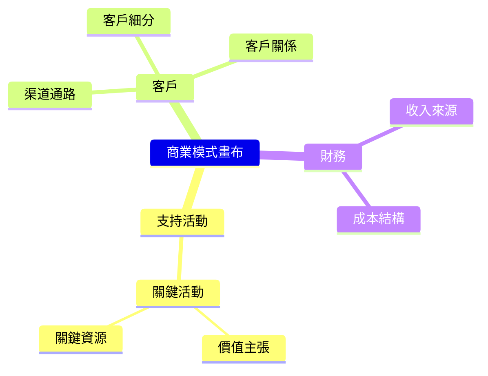
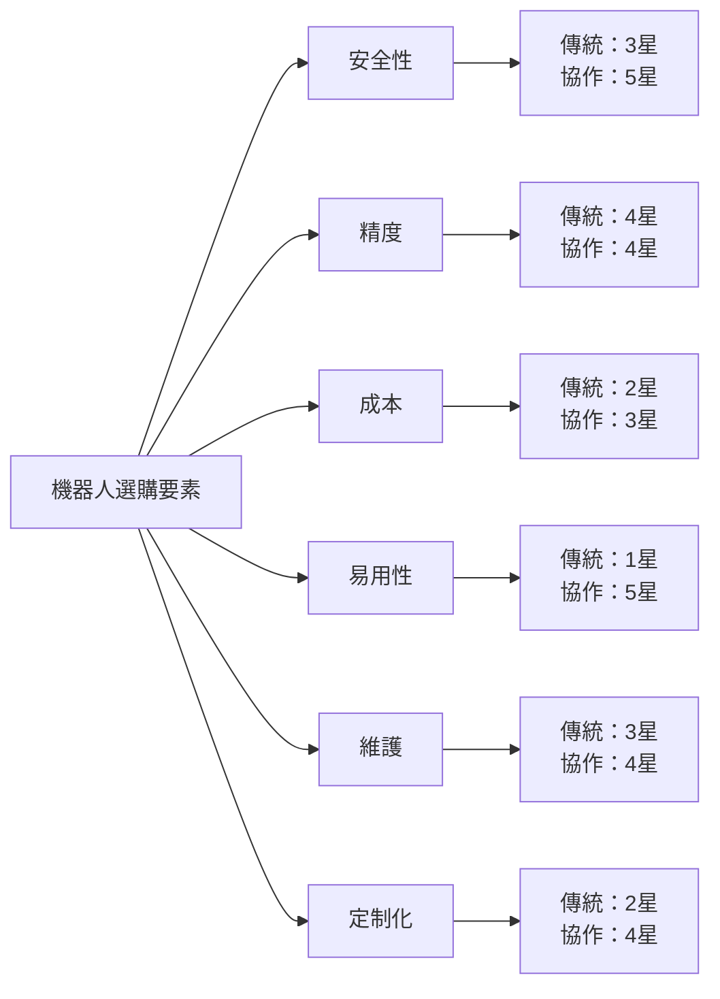
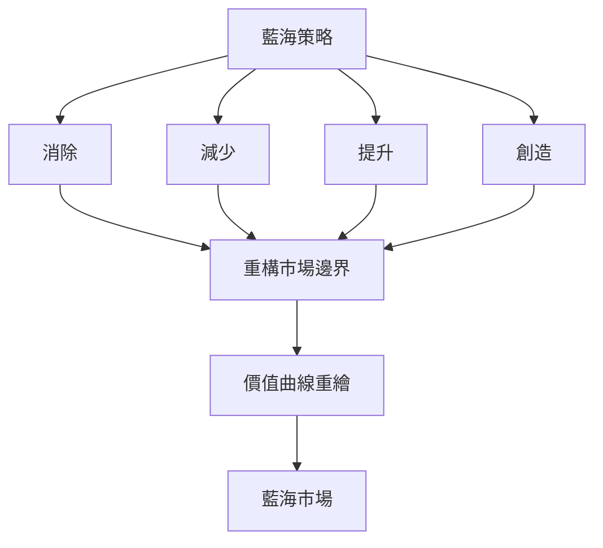

# SEEM3450 Engineering Innovation and Entrepreneurship

**CUHK SEEM | Other Elective | 3 units**
**Stream**: Business / Engineering Management / Innovation Stream

---

## Official Description

Factors that drive continuous creative product innovation. Study of processes of creating, assessing and pursuing product opportunities. Evaluation of new product ideas and risk assessment of commercialization. Product development strategies in industrial marketing. Understanding the behaviour of buyer. Formulation and implementation of innovative marketing strategy and business plan.

**Instructor**: Prof. Kam-Fai Wong (CUHK SEEM)
**Assessment**: Business Plan (40%) + Presentation (10%) + Startup Proposal (10%) + Final Exam (40%)

---

## 問題 1：5 個核心心智模型

### 1. 創新過程框架 (Innovation Process Framework)
**方程式 + 數字**：
- 漏斗模型：創意數量 n₀ → 概念篩選 20% → 原型開发 30% → 市場發布 10%
- 精益創業循環：Build-Measure-Learn（每次迭代 ~2-4 週）
- AARRR 漏斗：Acquisition → Activation → Retention → Referral → Revenue
- 產品-市場契合 (Product-Market Fit)：40% 用戶顯示「若無法使用會非常失望」
- 學者引用：Blank (2013), *The Lean Startup*；Christensen (1997), *The Innovator's Dilemma*
- 應用：初創企業驗證、商業模式迭代

### 2. 商業模式創新 (Business Model Innovation)
**方程式 + 數字**：
- 商業模式畫布：9 個構建模塊（Osterwalder & Pigneur, 2010）
- 商業模式創新回報：比產品創新高 6.7 倍（MIT Sloan 研究）
- 價值主張 Canvas：Jobs-to-be-Done（功能/情感/社會）
- 訂閱制 LTV：CAC 比 = 3:1 為健康 SaaS
- 學者引用：Johnson et al. (2008), *Reinventing Your Business Model*
- 應用：機器人服務化（RaaS）、硬件訂閱

### 3. 創業財務與估值 (Startup Finance & Valuation)
**方程式 + 數字**：
- 商業計劃財務預測：收入 = 客戶數 × ARPU
- 現金燃燒率：$ Burn = 月固定成本 + 變動成本
- 盈虧平衡：Break-even 月份 = 固定成本 / (ARPU - 變動成本/用戶)
- 稀釋估值：Pre-money = Post-money - 本輪融資額
- 學者引用：Sahlman (1997), *How to Write a Great Business Plan*
- 應用：機器人創業財務規劃、種子輪籌款

### 4. 藍海策略 (Blue Ocean Strategy)
**方程式 + 數字**：
- 消除-減少-提升-創造 (ERIA) 框架
- 價值曲線：6 個競爭要素的顧客價值評分
- 藍海指數：(差異化 + 低成本) > 0 = 藍海機會
- 買方效用地圖：6 個維度評估購買障礙
- 學者引用：Kim & Mauborgne (2005), *Blue Ocean Strategy*
- 應用：機器人新興市場創造

### 5. 市場營銷與客戶獲取 (Marketing & Customer Acquisition)
**方程式 + 數字**：
- TAM-SAM-SOM 市場規模模型
- 病毒係數：K = 傳染率 / 流失率，K > 1 = 有機增長
- NPS 分數：%推動者 - %貶低者（NPS > 50 = 優秀）
- 轉化率漏斗：展示 → 點擊 → 註冊 → 付費 → 留存
- 學者引用：Kotler & Keller (2015), *Marketing Management*
- 應用：B2B 機器人銷售、渠道策略

---

## 問題 2：3 個根本分歧

### 分歧 A：精益創業 vs. 傳統商業計劃

**精益創業**：
- 快速驗證、迭代學習
- 缺點：不適合資本密集型硬件創業
- 適用：軟件/SaaS、平台型創業

**傳統商業計劃**：
- 完整規劃、系統論證
- 缺點：環境變化快，計劃很快就過時
- 適用：銀行借貸、大企業內部創業

### 分歧 B：顛覆式創新 vs. 藍海策略

**顛覆式創新**（Christensen）：
- 從低端或邊緣市場切入，逐步改進，最終取代主流
- 代表：iRobot 從軍用 → 消費級掃地機器人

**藍海策略**：
- 創造全新市場，而非在現有市場競爭
- 代表：Nintendo Wii（家庭體感遊戲）

### 分歧 C：內部創業 vs. 獨立創業

**內部創業（企業內部創新）**：
- 資源豐富，但文化和激勵機制可能受限
- 典型：Google 20% 時間、蘋果內部孵化

**獨立創業**：
- 速度和靈活性高，但資源有限
- 典型：初創科技公司

---

## 問題 3：10 個深度問題

1. 用精益創業方法論設計一個 AMR（自主移動機器人）租賃服務的驗證計劃，包括假設驗證和關鍵指標。

2. 什麼是「一次性創新」（大爆炸）和「持續創新」（持續改進）的平衡？如何避免創新者困境？

3. 用商業模式畫布分析一家工業機器人即服務（RaaS）公司的 9 個構建模塊。

4. 如何用波特競爭力量框架分析一個協作機器人 (Cobot) 市場的吸引力？

5. 什麼是商業計劃中的「電梯推銷」(Elevator Pitch)？如何用 60 秒說清楚一個機器人創業構想？

6. 藍海策略中的「ERIA 框架」如何應用於一個醫療康復機器人的市場創造？

7. 初創企業的估值方法有哪些？從天使輪到 A 輪的估值倍數如何計算？

8. 什麼是「顛覆式創新曲線」？一家老牌工業機器人公司如何應對顛覆式挑戰者？

9. 設計一個機器人創業團隊的激勵機制（薪酬結構 + 股權分配 + 退出機制）。

10. 如何用創業畫布（Startup Canvas）評估一個物流分揀機器人項目的執行風險？

---

# 核心心智模型深化（中英對照）

## 1. 創新驅動因素與漏斗管理

### 1.1 創新漏斗
```
創意生成 (n₀)
  ↓ 篩選 (~20%)
概念驗證 (MVP)
  ↓ 原型測試 (~30%)
Beta 測試
  ↓ 商業化
產品發布 (P/M)
  ↓ 規模化
市場擴張
```

### 1.2 持續創新 vs 顛覆式創新
| 維度 | 持續創新 | 顛覆式創新 |
|------|---------|-----------|
| 方向 | 改善現有性能 | 進入邊緣市場 |
| 起點 | 現有主流客戶 | 非客戶/邊緣客戶 |
| 初期性能 | 略低於主流 | 遠低於主流 |
| 最終性能 | 超越主流 | 完全超越主流 |
| 風險 | 低 | 高 |

### 1.3 創新者困境
- 現有企業的成功悖論：良好的管理導致忽視顛覆式技術
- 主流客戶需求引導 R&D 資源流向增量創新
- 案例：數碼相機（柯達）、智能手機（諾基亞）

### 1.4 圖解：創新漏斗
```mermaid
flowchart TD
    A["創意生成<br/>100 個想法"] --> B["初步篩選<br/>20 個"]
    B --> C["概念驗證<br/>6 個 MVP"]
    C --> D["原型開發<br/>2 個原型"]
    D --> E["市場發布<br/>1 個產品"]
    E --> F["規模化<br/>市場擴張"]
    A -.->|"90% 淘汰率|", B
    B -.->|"70% 淘汰率|", C
    C -.->|"66% 淘汰率|", D
    D -.->|"50% 淘汰率|", E
```

---

## 2. 商業模式設計與驗證

### 2.1 精益創業方法論
```
想法 → 假設 → MVP → 驗證性學習 → 軸心 (Pivot) / 堅持 (Persevere)

軸心類型：
- Zoom pivot（顧客群）
- 客戶需求軸心
- 解決方案軸心
- 渠道軸心
- 價格軸心
```

### 2.2 商業模式畫布
| 構建模塊 | 機器人 SaaS 示例 |
|---------|----------------|
| CS | 工廠自動化經理 |
| VP | 零前期投資，月費 $5K |
| CH | 直銷 + 系統集成商 |
| RCS | 月訂閱 + 交易費 |
| KA | 持續演算法優化 |
| KR | ROS 開發團隊 |
| KP | 硬體OEM廠商 |
| C | 雲服務 20%、人力 50% |
| R | 客戶留存率 |

### 2.3 增長引擎
```
黏性引擎：
- 留住現有客戶
- 指標：客戶留存率、流失率
- 策略：升級、交叉銷售

病毒引擎：
- 現有客戶引進新客戶
- 指標：K-factor = 傳染率
- 策略：推薦獎金、生態系統

付費引擎：
- 客户付費支持增長
- 指標：LTV > CAC
- 策略：提升 ARPU、降低 CAC
```

### 2.4 圖解：商業模式畫布


---

## 3. 藍海策略與市場創造

### 3.1 藍海與紅海對比
| 維度 | 紅海 | 藍海 |
|------|------|------|
| 市場 | 已知，擁擠 | 未知，待開創 |
|競爭|擊敗對手|避免競爭|
|需求|挖掘既有需求|創造新需求|
|價值與成本|價值-成本權衡|差異化+低成本|
|策略|差異化或成本領先|差異化+低成本|

### 3.2 ERIA 框架
```
Eliminate（消除）：哪些被認為理所當然的因素應該被消除？
Reduce（減少）：哪些因素應該降至標準以下？
Increase（提升）：哪些因素應該提升至標準以上？
Create（創造）：哪些從未提供過的因素應該被創造？
```

### 3.3 機器人藍海案例：達芬奇手術系統
```
Eliminate：外科醫生的操作失誤
Reduce：手術時間、住院費用
Increase：精準度、3D 視覺
Create：遠程手術、微創傷口

結果：創造了一個價值 $50B+ 的手術機器人市場
```

### 3.4 圖解：價值曲線比較


---

## 4. 創業財務與估值

### 4.1 商業計劃財務預測
```
收入預測模型：
第1年：100 個客戶 × $5,000/年 = $500,000
第2年：(100+80) × $5,000 = $900,000
第3年：(180+150) × $5,000 = $1,650,000
流失率假設：20%/年

成本結構：
- 人力成本：60%
- 雲服務：20%
- 營銷：15%
- 其他：5%
```

### 4.2 估值方法
```
風險投資法：
估值 = 上輪估值 × 增長倍數

天使輪：$2-5M（稀釋 15-30%）
種子輪：$5-15M（稀釋 20-30%）
A 輪：$15-50M（稀釋 20-30%）
B 輪：$50-200M（稀釋 15-25%）

里程碑估值：
估值 = 團隊實力 × 技術壁壘 × 市場規模
```

### 4.3 現金流管理
```
Runway（月）= 銀行存款 / 月燃燒率

例：存款 $2M，月燃燒 $150K
Runway = 2,000,000 / 150,000 = 13 個月

目標：始終保持 > 18 個月的 Runway
（在不利情況下仍有緩冲）
```

### 4.4 圖解：AARRR 漏斗
```mermaid
flowchart TD
    A["Acquisition<br/>獲取"]
    A --> B["Activation<br/>激活"]
    B --> C["Retention<br/>留存"]
    C --> D["Referral<br/>推薦"]
    D --> E["Revenue<br/>收入"]
    A -->|"轉化 10%|", B
    B -->|"轉化 30%|", C
    C -->|"轉化 40%|", D
    D -->|"轉化 20%|", E
```

---

## 5. 商業計劃書寫作與電梯推銷

### 5.1 商業計劃結構
1. 執行摘要（1 頁）
2. 問題與痛點（1 頁）
3. 解決方案與價值主張（1-2 頁）
4. 市場分析 (TAM/SAM/SOM)（1 頁）
5. 商業模式（1 頁）
6. 競爭分析（1 頁）
7. 團隊（1 頁）
8. 財務預測（2 頁）
9. 融資需求與用途（1 頁）

### 5.2 電梯推銷模板
```
[30秒版本]
「我們正在為[目標客戶]提供[價值主張]，
通過[獨特方式]解決[核心問題]，
相比現有方案，我們[關鍵差異化]，
目前已完成[里程碑]，尋求[$X] 資金。」
```

### 5.3 工業營銷策略
- 解決方案銷售（而非產品銷售）
- 技術規格 + ROI 計算
- Pilot 項目 → 擴展談判
- 渠道：直銷 + 系統集成商 + 經銷商

### 5.4 圖解：創業階段與里程碑
```mermaid
flowchart LR
    A["想法"] --> B["MVP"]
    B --> C["Product-Market Fit"]
    C --> D["早期增長"]
    D --> E["規模化"]
    B -->|"1-3月|", C
    C -->|"6-12月|", D
    D -->|"12-24月|", E
    A -.->|"資金: 天使<br/>$100K|", A
    B -.->|"資金: 種子<br/>$500K|", B
    C -.->|"資金: A輪<br/>$3M|", C
    D -.->|"資金: B輪<br/>$15M|", D
```

---

## 深度自測問題詳解

**Q1**: AMR 租賃服務驗證計劃
```
假設驗證：
1. 工廠經理有閒置機器人利用率問題
2. 願意為「按用量付費」模式付費
3. 技術可行性（AMR 室內導航）

驗證方法：
1. Landing Page + 電話預訂（虛擬報名）
2. 單一城市 Pilot（1-3 個工廠）
3. 關鍵指標：付費意願、留存率、NPS

最小可行解決方案：
- 基本 AMR + 雲管理平台
- 每月 $3,000 基礎費 + $200/小時使用費
```

**Q3**: RaaS 商業模式畫布
```
CS：電子製造商 (EMS)、3PL 倉庫
VP：零前期資本，月度 OPEX，產量提升 30%
CH：行業展會、系統集成商、口碑
RCS：月租 + 交易費 + 維護服務費
KA：AMR 調度算法、持續升級、報表分析
KR：ROS 開發團隊、客戶成功團隊
KP：硬體合作廠商（愛urobot、MiR）
C：硬體折舊 30%、雲服務 20%、人力 40%
```

**Q6**: 康復機器人 ERIA 分析
```
消除：長時間住院康復
減少：每次康復治療時間
提升：治療頻次（家庭可進行）、個性化程度
創造：AI 驅動的個性化康復方案、遊戲化訓練

價值主張：「在家中像玩遊戲一樣完成康復訓練」
```

---

## 📊 Mermaid 圖解

### 圖 1：創新者困境與應對
```mermaid
flowchart LR
    A["主流企業<br/>持續創新"] --> B["滿足主流客戶"]
    B --> C["忽視顛覆式技術"]
    C --> D["顛覆者進入"]
    D --> E["市場份額流失"]
    A -.->|"應對|", F["設立獨立部門<br/>專注顛覆式創新"]
    F --> G["收購顛覆式初創"]
    G --> H["保持創新能力"]
```

### 圖 2：藍海策略框架


### 圖 3：精益創業循環
```mermaid
flowchart LR
    I["想法"] --> M["測量"]
    M --> L["學習"]
    L -->|"軸心", I
    L -->|"堅持", S["規模化"]
    I -->|"MVP", M
```

### 圖 4：創業階段估值
```mermaid
graph TB
    A["創業階段"] --> B["Pre-seed"]
    A --> C["Seed"]
    A --> D["A輪"]
    A --> E["B輪"]
    B --> B1["想法驗證"]
    C --> C1["PMF驗證"]
    D --> D1["早期規模化"]
    E --> E1["快速增長"]
    B1 -->|"$100K", B2["稀釋20%"]
    C1 -->|"$1-2M", C2["稀釋25%"]
    D1 -->|"$5-15M", D2["稀釋30%"]
    E1 -->|"$20M+", E2["稀釋25%"]
```

### 圖 5：波特競爭力量分析
```mermaid
flowchart TD
    A["行業吸引力"] --> B["現有競爭者"]
    A --> C["新進入者"]
    A --> D["替代品"]
    A --> E["供應商"]
    A --> F["買方"]
    B -.->|"機器人：<br/>整合並購加劇", B1
    C -.->|"顛覆式威脅<br/>服務化模式", C1
    D -.->|"人工+傳統設備", D1
    E -.->|"晶片+傳感器<br/>少數供應商", E1
    F -.->|"大客戶<br/>談判能力強", F1
```

---

## 總結

SEEM3450 工程創新與創業將創新理論與商業實踐緊密結合。5 個核心心智模型：

1. **創新過程框架** → 從創意到規模化的系統方法
2. **商業模式創新** → 比產品創新更有力的價值創造方式
3. **創業財務** → 理解現金流、估值和增長引擎
4. **藍海策略** → 創造新市場而非在現有市場競爭
5. **市場營銷** → 從客戶獲取到留存的全漏斗管理

對智慧機器人工程而言，這門課讓工程師能夠**將技術轉化為商業價值**——無論是內部創業（將研究產業化）還是獨立創業（機器人創業公司），都需要將工程技術與商業模式結合的能力。

**核心 Reference**：
- Blank, S. (2013). *The Lean Startup*. Crown Business.
- Christensen, C.M. (1997). *The Innovator's Dilemma*. Harvard Business Review Press.
- Kim, W.C. & Mauborgne, R. (2005). *Blue Ocean Strategy*. Harvard Business Review Press.
- Osterwalder, A. & Pigneur, Y. (2010). *Business Model Generation*. Wiley.
- Kotler, P. & Keller, K.L. (2015). *Marketing Management*. 15th ed. Pearson.
