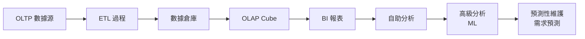
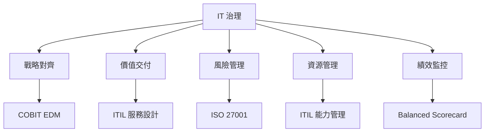
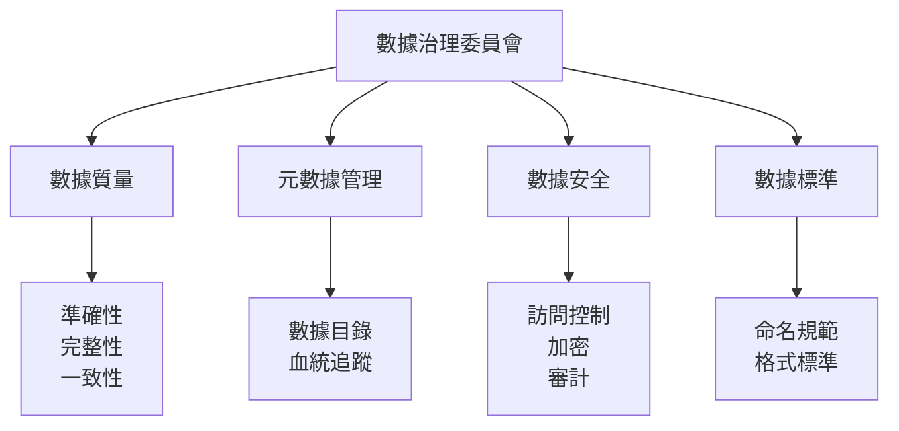

# SEEM3490 Information Systems Management

**CUHK SEEM | Other Elective | 3 units**
**Stream**: Business / Information Systems / Engineering Management

---

## Official Description

In-depth discussion of the challenges, techniques and technologies associated with the management of IT in a competitive environment. The linkage of IT to business strategy and business process re-engineering. Type of information systems: MIS, DSS, TPS. Development process. Information system planning. Systems project management and control. IT acquisition, budgeting and deployment. Performance evaluation and auditing. Operations management. Privacy and security.

**Instructor**: Prof. Gabriel Fung (CUHK SEEM)
**Assessment**: Assignments (10%) + Project + Report (40%) + Final Exam (50%)

---

## 問題 1：5 個核心心智模型

### 1. 信息系統架構與層次 (IS Architecture & Levels)
**方程式 + 數字**：
- 戰略層 (ESS/DSS)：高層決策支持，結構化程度低
- 管理層 (MIS)：中期計劃控制，結構化程度中
- 操作層 (TPS)：日常交易處理，結構化程度高
- 企業系統架構 (EA)：TOGAF / Zachman Framework
- 數據層次：DBMS → ODS → Data Warehouse → Data Lake
- 學者引用：Laudon & Laudon (2022), *Management Information Systems*
- 應用：ERP 系統選擇、數據架構規劃

### 2. 企業資源計劃 (ERP Systems)
**方程式 + 數字**：
- ERP 模塊：FI（財務）、CO（控制）、MM（物料）、PP（生產）、SD（銷售）
- 實施成本：大型 ERP ~$10-100M；中型 ~$1-10M
- 實施時間：12-24 個月（標准化），失敗率 ~50-70%
- 成功因素：高管支持 > 項目管理 > 業務流程重設計
- 學者引用：Davenport (1998), *Putting the Enterprise into the Enterprise System*
- 應用：製造業ERP、機器人系統集成、供應鏈管理

### 3. 數據管理與商業智能 (Data Management & BI)
**方程式 + 數字**：
- OLTP vs. OLAP：事務處理 vs. 分析處理
- 數據倉庫事實表：粒度 = 交易級 / 日快照 / 月快照
- KPI：平均訂單價值、客戶終生價值、庫存周轉率
- 機器學習預測：準確率 = TP/(TP+FP)，F1 = 2PR/(P+R)
- 學者引用：Kimball & Ross (2013), *The Data Warehouse Toolkit*
- 應用：製造預測性維護、供應鏈優化、需求預測

### 4. 網絡安全與隱私 (Cybersecurity & Privacy)
**方程式 + 數字**：
- CIA 三元組：Confidentiality（機密性）+ Integrity（完整性）+ Availability（可用性）
- 攻擊成本：平均數據洩露代價 $4.45M（2023 IBM）
- 加密：AES-256（對稱），RSA-2048（公鑰）
- 合規要求：GDPR（歐洲）、PDPO（香港）、網絡安全法（中國）
- 學者引用：Stamp (2022), *Information Security*
- 應用：保護機器人控制系統、IoT 安全

### 5. 項目管理與 IT 治理 (IT Project Management)
**方程式 + 數字**：
- 敏捷估時：Story Point = 複雜度 + 工作量 + 不確定性
- 燃盡圖：Burn-down = 剩餘工作 / 時間
- IT 投資回報率：ROI = (收益 - 成本) / 成本 × 100%
- IT 治理框架：COBIT 5（Align, Plan, Build, Run, Monitor）
- 學者引用：PMI (2021), *PMBOK Guide*；ITIL 4
- 應用：敏捷開發團隊、機器人軟件項目交付

---

## 問題 2：3 個根本分歧

### 分歧 A：自建 vs. 外包 vs. SaaS

**自建 (In-house)**：
- 完全控制，定制化，但成本高、人才難招
- 適用：核心競爭優勢系統

**外包 (Outsourcing)**：
- 成本可預測，專注核心能力，但失去控制權
- 適用：標準化、非關鍵系統

**SaaS**：
- 即開即用，成本低，但數據安全、合規風險
- 適用：CRM、HR、協作工具

### 分歧 B：敏捷 vs. 瀑布式開發

**瀑布式 (Waterfall)**：
- 線性順序：需求 → 設計 → 實現 → 測試 → 部署
- 適用：需求穩定、規制合規項目（FDA 認證醫療設備）

**敏捷 (Agile)**：
- 迭代增量：Sprint 2-4週，生產部署持續
- 適用：需求不確定、快速變化的軟件項目

### 分歧 C：數據湖 vs. 數據倉庫

**數據湖**：
- 原始數據存儲，無 schema-on-read
- 適用：多樣化數據源、機器學習

**數據倉庫**：
- 結構化數據，schema-on-write
- 適用：商業智能、報表分析

---

## 問題 3：10 個深度問題

1. 比較 TPS、MIS、DSS、ESS 四種信息系統的特點、功能和典型應用。
2. 什麼是 ERP 實施的關鍵成功因素？為什麼大型 ERP 項目的失敗率如此之高？
3. 設計一個工廠物聯網（IIoT）平台架構，包括數據採集、邊緣計算、雲端分析。
4. 如何用商業智能系統分析機器人生產線的 OEE（設備綜合效率）？
5. 什麼是網絡攻擊的 Kill Chain 模型？企業如何建立多層防御體系？
6. 比較 ITIL 和 COBIT 兩種 IT 治理框架的適用場景。
7. 如何設計一個敏捷開發團隊的 Scrum 流程？Scrum Master 的角色是什麼？
8. 什麼是零信任架構 (Zero Trust Architecture)？它如何應用於工業控制系統？
9. 比較傳統項目管理與敏捷項目管理的適用範圍和局限性。
10. 如何建立一個企業級數據治理框架（數據質量、元數據、數據安全）？

---

# 核心心智模型深化（中英對照）

## 1. 信息系統分類與架構

### 1.1 信息系統層次結構
```
戰略層（高層管理）
  ESS：Executive Support System（執行支持系統）
  DSS：Decision Support System（決策支持系統）

管理層（中層管理）
  MIS：Management Information System（管理信息系統）
  KMS：Knowledge Management System（知識管理系統）

操作層（一線管理）
  TPS：Transaction Processing System（交易處理系統）
  OAS：Office Automation System（辦公自動化系統）
```

### 1.2 信息系統架構框架
```
TOGAF 架構開發方法（ADM）：
1. Preliminary（準備階段）
2. 架構願景（Vision）
3. 業務架構（Business Architecture）
4. IT 架構（Data / Application / Technology）
5. 機會與解決方案
6. 遷移規劃
7. 治理
8. 變更管理
```

### 1.3 企業數據架構
```
操作系統（OLTP）
    ↓ ETL
操作數據存儲（ODS）
    ↓
數據倉庫（Data Warehouse）
    ↓
數據集市（Data Mart）
    ↓
商業智能（BI）
    ↓
高級分析（Advanced Analytics / ML）
```

### 1.4 圖解：信息系統金字塔
```mermaid
flowchart TD
    A["戰略層 ESS/DSS"] --> B["管理層 MIS/KMS"]
    B --> C["操作層 TPS/OAS"]
    C --> D["知識層 KMS"]
    A -->|"非結構化<br/>報告", A1["高層決策"]
    B -->|"定期報告", B1["中期計劃"]
    C -->|"日常交易", C1["業務運營"]
    A1 -.->|"支持", B1 -.->|"控制", C1
```

---

## 2. ERP 企業資源計劃

### 2.1 SAP ERP 核心模塊
```
FI（Finance）：總賬、應收、應付、固定資產
CO（Controlling）：成本中心、利潤中心、內部訂單
MM（Materials Management）：採購、庫存、發票校驗
PP（Production Planning）：主生產計劃、物料需求計劃
SD（Sales & Distribution）：銷售訂單、裝運、計費
QM（Quality Management）：質量計劃、檢驗、通知
PM（Plant Maintenance）：預防性維護、工單
```

### 2.2 ERP 實施方法論
```
ASAP（SAP 實施方法）：
1. 項目準備（Project Preparation）
2. 業務藍圖（Blueprint）
3. 實現（Realization）
4. 最後準備（Final Preparation）
5. 投產與支持（Go-Live & Support）

最佳實踐：
- 業務流程映射（BPR before ERP）
- 數據清洗和遷移
- 全員培訓（Change Management）
```

### 2.3 ERP 與機器人系統集成
```
ERP ↔ MES ↔ PCS 三層架構：
ERP（計劃層）：
  - 生產計劃、訂單管理、庫存管理
  - 對接：物料需求計劃 → MES

MES（執行層）：
  - 生產調度、質量管理、設備管理
  - 對接：工藝指令 → 機器人控制系統

PCS（控制層）：
  - PLC / CNC / 機器人控制器
  - 對接：實際生產數據 → MES
```

### 2.4 圖解：ERP 集成架構
```mermaid
flowchart TD
    A["ERP SAP<br/>計劃層"] --> B["MES<br/>執行層"]
    B --> C["PCS/機器人<br/>控制層"]
    C -->|"實時數據", B
    B -->|"生產數據", A
    A -->|"物料需求", B
    B -->|"設備指令", C
    A -->|"財務/HR", HR["HR系統"]
    A -->|"客戶訂單", CRM["CRM"]
```

---

## 3. 數據管理與商業智能

### 3.1 數據倉庫設計
```
事實表設計（Star Schema）：
fact_production：
- surrogate key
- date_key（日期維度 FK）
- product_key（產品維度 FK）
- machine_key（機器維度 FK）
- quantity_produced
- cycle_time
- defect_count

維度表：
dim_product：product_id, name, category, cost
dim_machine：machine_id, type, location, install_date
dim_date：date, day_of_week, month, quarter
```

### 3.2 KPI 框架示例
```
製造 KPI：
- OEE = 可用率 × 表現率 × 質量率
- OTD = 及時交付訂單 / 總訂單數
- DIO = 平均庫存 / 每日銷售成本
- DSO = 應收賬款 / 每日銷售額
- WIP = 在製品庫存

機器人 KPI：
- 利用率 = 實際運行時間 / 可用時間
- MTTF = 平均無故障時間
- MTBF = 平均故障間隔
- MTTR = 平均維修時間
```

### 3.3 機器學習在製造中的應用
```
預測性維護：
輸入：振動傳感器、溫度、電流、運行時間
模型：Random Forest / LSTM
輸出：剩餘使用壽命（RUL）預測
指標：準確率 > 85%，召回率 > 90%

質量預測：
輸入：過程參數（溫度、壓力、速度）
模型：XGBoost / Neural Network
輸出：缺陷概率
指標：AUC > 0.9
```

### 3.4 圖解：BI 系統架構


---

## 4. 網絡安全與隱私保護

### 4.1 CIA 三元組與風險管理
```
機密性（Confidentiality）：
- 數據加密（AES-256）
- 訪問控制（RBAC / ABAC）
- MFA 多因素認證

完整性（Integrity）：
- 數據校驗（哈希）
- 數字簽名
- 審計日誌

可用性（Availability）：
- 冗餘架構
- 災難恢復
- DDoS 緩解
```

### 4.2 零信任架構 (Zero Trust)
```
傳統：城堡-護城河（信任內網）
零信任：「永不信任，始終驗證」

核心原則：
1. 驗證每個用戶
2. 設備清單
3. 微分段網絡
4. 特權訪問管理（PAM）
5. 持續監控
```

### 4.3 數據隱私合規
```
GDPR（歐洲）：
- 數據主體權利（訪問、刪除、可攜帶）
- 數據處理合法性基礎（同意、合法利益）
- 違規罰款：最高 €20M 或 4% 年營業額

PDPO（香港個人資料）：
- 6 項保障資料原則（DP1-DP6）
- 數據泄露通知：72 小時內通知私隱專員
```

### 4.4 圖解：Kill Chain 防御
```mermaid
flowchart LR
    A["Reconnaissance<br/>偵察"] --> B["Weaponization<br/>武器化"]
    B --> C["Delivery<br/>傳播"]
    C --> D["Exploitation<br/>利用"]
    D --> E["Installation<br/>安裝"]
    E --> F["C2<br/>命令控制"]
    F --> G["Actions<br/>目標達成"]
    A -.->|"威脅情報|", AI["SIEM"]
    B -.->|"沙箱|", AI
    C -.->|"郵件過濾|", AI
    D -.->|"終端檢測|", AI
    E -.->|"行為分析|", AI
    F -.->|"網絡分段|", AI
    G -.->|"隔離遏制|", AI
```

---

## 5. IT 治理與項目管理

### 5.1 COBIT 5 框架
```
COBIT 5 目標級聯：
1. 從高管到IT的企業目標
2. IT相關目標（39個IT目標）
3. IT治理和管理目標（17個）

治理 vs. 管理：
- 治理（EDM）：確保 IT 與企業目標一致
- 管理（APO/BAI/DSS/MEA）：規劃、構建、運行、監控
```

### 5.2 敏捷 Scrum 流程
```
Scrum 角色：
- Product Owner：管理 Product Backlog
- Scrum Master：保護團隊，消除障礙
- 開發團隊：自組織，跨功能

Sprint 流程：
1. Sprint Planning（2-4小時）
2. Daily Standup（15分鐘）
3. Sprint Review（Sprint 末）
4. Sprint Retrospective（Sprint 末）

估算：Story Point = Fibonacci（1,2,3,5,8,13,21）
速度：Velocity = 團隊每 Sprint 完成的 Story Points
```

### 5.3 IT 投資評估
```
TCO（總擁有成本）：
TCO = 初始成本 + 運營成本 × 年數 + 維護成本 + 退役成本

ROI 計算：
ROI = (年度收益 - IT成本) / IT成本 × 100%

NPV 方法：
NPV = Σ (收益_t - 成本_t) / (1+i)^t

實例（ERP系統）：
年度收益 = $500,000（庫存減少+效率提升）
年度成本 = $200,000（運營+維護）
i = 12%，5年NPV = $500,000×3.605 - $2,000,000 = -$197,500 ❌
```

### 5.4 圖解：IT 治理框架


---

## 深度自測問題詳解

**Q1**: 四種信息系統比較
```
| 系統 | 層次 | 頻率 | 結構化 | 用戶 |
|------|------|------|--------|------|
| TPS  | 操作層 | 持續 | 高     | 操作員 |
| MIS  | 管理層 | 定期 | 中     | 主管 |
| DSS  | 戰略層 | 按需 | 低     | 分析師 |
| ESS  | 戰略層 | 按需 | 低     | 高管 |
```

**Q3**: 工廠 IIoT 平台架構
```
分層架構：
感測層：
- 振動傳感器（軸承監測）
- 溫度/電流監測
- 機器視覺（質量檢測）

邊緣層（Edge Computing）：
- 實時報警（<10ms）
- 邊緣 ML 推理
- 協議轉換（OPC-UA / MQTT）

平台層（Cloud）：
- 時序數據庫（InfluxDB）
- 數據湖存儲
- 大數據分析

應用層：
- 數據可視化（Grafana）
- 預測性維護
- 生產優化
```

**Q5**: Kill Chain 防御
```
 Lockheed Martin Kill Chain：
1. Reconnaissance → 信息收集（防禦：威脅情報）
2. Weaponization → 準備攻擊工具（防禦：沙箱分析）
3. Delivery → 傳播（防禦：郵件/網頁過濾）
4. Exploitation → 利用漏洞（防禦：補丁管理、EDR）
5. Installation → 安裝後門（防禦：應用白名單）
6. C2 → 命令控制（防禦：網絡分段、NDR）
7. Actions → 達成目標（防禦：隔離遏制、數據備份）
```

---

## 📊 Mermaid 圖解

### 圖 1：信息系統架構演變
```mermaid
flowchart LR
    A["單體應用"] --> B["客戶端-服務器"]
    B --> C["SOA 架構"]
    C --> D["微服務架構"]
    D --> E["雲原生"]
    A -.->|"獨立<br/>難擴展", A1
    B -.->|"共享 DB<br/>瓶頸", B1
    C -.->|"ESB<br/>複雜", C1
    D -.->|"服務發現<br/>容器化", D1
```

### 圖 2：數據治理框架


### 圖 3：Scrum Sprint 流程

```mermaid
gantt
    title Sprint 2 週期
    dateFormat X
    axisFormat %s天
    
    section Planning
    Sprint Planning: done, 0, 2
    
    section Development
    Development: done, 2, 12
    
    section Daily
    Daily Standup: done, 2, 12
    
    section Review
    Sprint Review: done, 12, 13
    Retrospective: done, 13, 14
```


### 圖 4：零信任架構
```mermaid
flowchart TD
    A["用戶設備"] -->|"驗證|", B["身份提供者<br/>IdP"]
    B -->|"授權|", C["策略引擎<br/>ZTA"]
    C -->|"微分段|", D["應用微服務"]
    C -->|"微分段|", E["數據服務"]
    C -->|"微分段|", F["監控服務"]
    D & E & F -->|"持續監控|", C
    A -.->|"設備信任評估|", C
```

### 圖 5：ERP-MES-PCS 三層集成
```mermaid
flowchart TD
    ERP["ERP<br/>計劃層"] -->|"MPS/MRP", MES["MES<br/>執行層"]
    MES -->|"指令/工藝", PCS["PCS<br/>控制層"]
    PCS -->|"實時數據", MES
    MES -->|"生產報告", ERP
    MES -->|"質量數據", QMS["QMS"]
    PCS -->|"設備狀態", EMS["EMS"]
```

---

## 總結

SEEM3490 信息系統管理覆蓋了企業 IT 管理從戰略到運營的完整框架。5 個核心心智模型：

1. **IS 架構層次** → 理解不同層次信息系統的功能定位
2. **ERP 系統** → 企業核心業務系統的實施和管理
3. **數據管理** → 從數據倉庫到商業智能的完整數據價值鏈
4. **網絡安全** → CIA 三元組和零信任架構
5. **IT 治理** → COBIT/ITIL 框架和敏捷項目管理

對智慧機器人工程而言，信息系統知識對**工廠數字化轉型**（ERP-MES-PCS 集成）、**預測性維護**（數據分析和 ML）、**網絡安全**（ICS 安全）和**項目交付**（敏捷開發）都有直接的工程應用價值。

**核心 Reference**：
- Laudon, K.C. & Laudon, J.P. (2022). *Management Information Systems*. 17th ed. Pearson.
- Davenport, T.H. (1998). "Putting the Enterprise into the Enterprise System." Harvard Business Review.
- Kimball, R. & Ross, M. (2013). *The Data Warehouse Toolkit*. 3rd ed. Wiley.
- Stamp, M. (2022). *Information Security: Principles and Practices*. 3rd ed. Wiley.
- ISACA (2019). *COBIT 5*. ISACA.
- PMI (2021). *A Guide to the Project Management Body of Knowledge (PMBOK)*. 7th ed.
