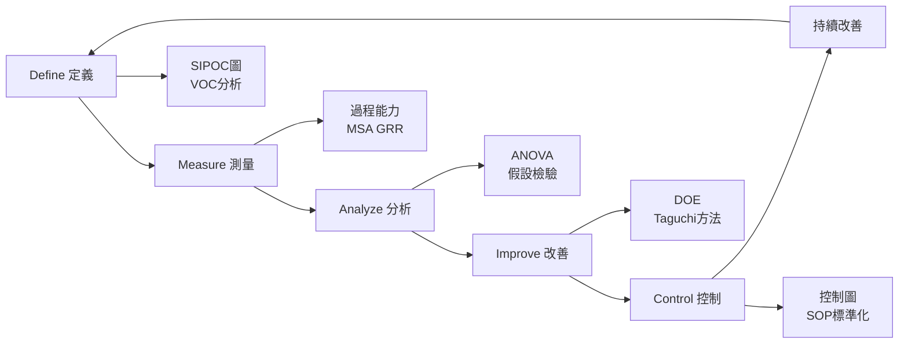
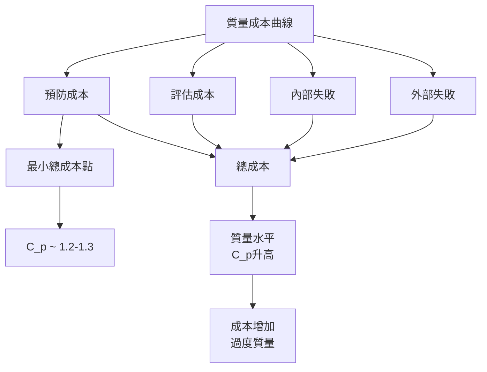
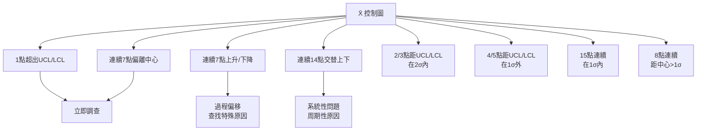
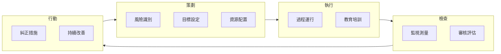
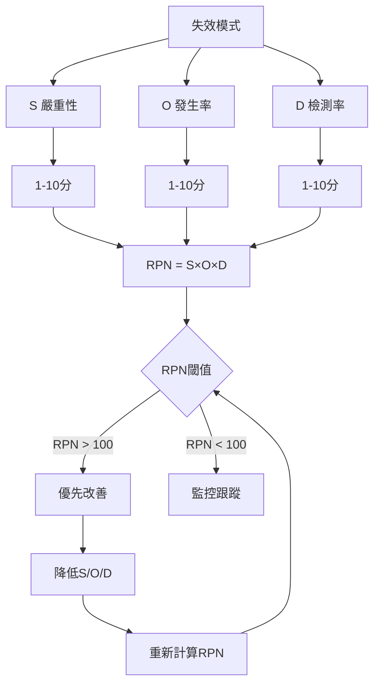

# SEEM3500 Quality Control and Management

**CUHK MAE | Major Elective | 3 units**
**Stream**: Design and Manufacturing / Business

---

## Official Description
This course introduces the fundamental concepts and techniques of quality control and management in engineering and manufacturing systems. Topics include quality management philosophies (Deming, Juran, Crosby), statistical process control (SPC), control charts (X̄, R, p, c charts), process capability analysis (Cpk, Ppk), acceptance sampling, quality management systems (ISO 9000), Six Sigma methodology, and lean manufacturing. Applications in robotics and automation systems are emphasized.

---

## 問題 1：5 個核心心智模型

### 1. 統計過程控制 (SPC) 與控制圖
**方程式 + 數字**：
- X̄ 控制圖：UCL = μ + 3σ/√n，CL = μ，LCL = μ - 3σ/√n
- R 控制圖：UCL = D₄·R̄，LCL = D₃·R̄（D₄ = 2.114, D₃ = 0，n=5）
- 抽樣頻率：每 1-2 小時抽取 3-5 個樣本
- 失控判斷：連續 7 點上升/下降、連續 8 點在單側、1 點超出 UCL/LCL
- 學者：Walter A. Shewhart (1931), "Economic Control of Quality"
- 應用：機器人焊接質量監控、装配尺寸統計

### 2. 過程能力分析 (Process Capability)
**方程式 + 數字**：
- C_p = (USL - LSL) / 6σ（雙側能力）
- C_pk = min[(USL - μ)/3σ, (μ - LSL)/3σ]（偏心修正）
- P_p = (USL - LSL) / 6s（短期能力 vs. 長期）
- 合格標準：C_pk ≥ 1.33（σ = 6σ 水平）；C_pk ≥ 1.67（航空航天）
- 學者：Kane (1986), "Process Capability Indices"
- 應用：加工精度評估、裝配公差設計

### 3. 六西格瑪 (Six Sigma) DMAIC 方法論
**方程式 + 數字**：
- Sigma 等級：σ = 1 → 68.3% 合格率；σ = 6 → 99.99966%（3.4 DPMO）
- DPMO = Defects Per Million Opportunities
- 過程西格瑪：Z_bench = (USL - μ)/σ 或 (μ - LSL)/σ
- 改善幅度：DMAIC 典型改善 50-80%
- 學者：Bill Smith (Motorola, 1986) — Six Sigma 創始人
- 應用：半導體製造、製藥、機器人装配

### 4. 抽樣檢驗 (Acceptance Sampling)
**方程式 + 數字**：
- OC 曲線：P(接受) vs. p_defect（批不合格率）
- AQL (Acceptable Quality Level)：可接受的最差質量（通常 0.1-2.5%）
- LTPD (Lot Tolerance Percent Defective)：消費者風險點（通常 5-10%）
- α = 生產者風險（誤拒好批）≈ 0.05；β = 消費者風險（誤收壞批）≈ 0.10
- 學者：Harold Dodge & Harry Romig (1940s, Bell Labs)
- 應用：來料檢驗、成品抽檢

### 5. ISO 9001 質量管理體系
**方程式 + 數字**：
- PDCA 循環（戴明環）：Plan-Do-Check-Act
- 持續改善：Kaizen 目標每年改善 1-5%
- 魚骨圖（ Ishikawa）：人、機、料、法、環、測六大類
- 學者：W. Edwards Deming (1950s)，Kaoru Ishikawa (1950s)
- 應用：ISO 13485 醫療器械、IATF 16949 汽車

---

## 問題 2：3 個根本分歧

### 分歧 A：預防 vs. 檢測 — 質量成本之爭
**預防優先派（Deming/Juran）**：
- 思想：質量是免費的，浪費才是成本（Cost of Poor Quality = COQ）
- COQ = 預防成本 + 評估成本 + 內部失敗成本 + 外部失敗成本
- 目標：最大化預防成本（理想佔總成本 1%），最小化失敗成本
- 代表：Deming 14 點、W. Edwards Deming Award

**檢測優先派**：
- 思想：缺陷不可能完全消除，全檢或高抽樣率是必要保障
- 適用：安全關鍵件（飛機制動系統、醫療器械）
- 代表：FDA、航空公司維修

**引用**：Juran, J.M. (1986). "The Quality Trilogy." Quality Progress.

### 分歧 B：六西格瑪 vs. 精益製造 (Lean vs. Six Sigma)
**精益製造（Lean）**：
- 核心：消除浪費（Muda），價值流分析
- 工具：5S、價值流圖 (VSM)、看板 (Kanban)
- 指標：TT (Takt Time)、C/O (Changeover Time)
- 代表公司：Toyota Production System

**六西格瑪（Six Sigma）**：
- 核心：減少變異，DMAIC 數據驅動
- 工具：DOE、FMEA、假設檢驗、回歸分析
- 指標：DPMO、西格瑪水平
- 代表公司：GE、Caterpillar

**引用**：George, M.L. (2003). "Lean Six Sigma." McGraw-Hill.

### 分歧 C：過程能力 vs. 過程性能
**C_p/C_pk（過程能力）**：
- 假設：過程穩定（僅普通原因變異）
- 數據：短期數據（組內變異）
- 用途：過程設計評估、過程改善目標設定

**P_p/P_pk（過程性能）**：
- 假設：過程可能有特殊原因變異
- 數據：長期數據（總變異）
- 用途：客戶報告、過程性能驗證
- 分歧核心：過程穩定性 vs. 數據完整性

---

## 問題 3：10 個深度問題

1. 當 C_p = 1.0 而 C_pk = 0.8 時，過程偏心量是多少？如何改善？
2. 什麼情況下抽樣檢驗比 100% 全檢更有效？OC 曲線如何解讀？
3. 控制圖的八大判異準則（Western Electric Rules）在實際應用中的靈敏度如何權衡？
4. 如何計算一個包含多個零件的機器人裝配過程的整體過程能力？
5. DOE（實驗設計）中的因子設計和 Taguchi 方法的適用場景是什麼？
6. FMEA（失效模式與效應分析）如何在機器人製造過程中應用？RPN 如何計算？
7. 六西格瑪中「改善」階段如何確定改善量？如何避免過度改善？
8. ISO 9001:2015 的風險思維要求與傳統過程方法的區別是什麼？
9. 過程控制圖中「均值偏移」和「標準差增大」兩種失控模式如何區分和處理？
10. 質量機能展開 (QFD) 如何將客戶需求轉化為工程規格？

---

# 核心心智模型深化（中英對照）

## 1. 統計過程控制 — 數據驅動的質量監控

### 1.1 控制圖的統計原理
- 過程處於受控狀態：μ 和 σ 穩定，服從正態分佈 N(μ, σ²)
- UCL/LCL = μ ± 3σ：99.73% 置信區間（三西格瑪原則）
- 預期失控率：α = 0.0027（~2700 PPM）

### 1.2 過程均值偏移檢測
- 移動均值圖 (X̄ chart)：放大偏移檢測能力
- 累積和圖 (CUSUM chart)：比 X̄ chart 更早發現偏移
- CUSUM 統計量：C_i = Σ(X_i - k)（k = 目標值偏移）

### 1.3 不良品率監控
**p chart（不合格率）**：
- CL = p̄（平均不合格率）
- UCL = p̄ + 3√(p̄(1-p̄)/n)
- LCL = max(0, p̄ - 3√(p̄(1-p̄)/n))

**c chart（缺陷數）**：
- CL = c̄（平均缺陷數）
- UCL = c̄ + 3√c̄
- LCL = max(0, c̄ - 3√c̄)

### 1.4 EWMA 控制圖
- 權重遞減：z_i = λ·X_i + (1-λ)·z_{i-1}（λ = 0.05-0.25）
- 對小偏移靈敏度高（λ 小 → EWMA 歷史數據權重大）
- 檢測能力：可發現 σ/2 到 σ 級偏移

### 1.5 多變量控制圖
- Hotelling T²：檢測多個相關變量同時偏移
- T² = (X-μ)ᵀ Σ⁻¹ (X-μ)
- UCL = (p(n-1)(n+p))/(n(n-p-1)) × F_{α,p,n-p-1}

---

## 2. 過程能力分析 — 量化過程滿足規格的能力

### 2.1 C_p 和 C_pk 的關係
C_pk = C_p × (1 - k)，k = |μ - μ_target| / (USL-LSL)/2

- C_p = 1.33, C_pk = 0.8 → k = (1.33-0.8)/1.33 = 0.40
- 偏心量：|μ - μ_target| = k × (USL-LSL)/2

### 2.2 Sigma 等級與 DPMO 換算
| Sigma 等級 | 合格率 | DPMO |
|-----------|--------|------|
| 1σ | 68.27% | 317,300 |
| 2σ | 95.45% | 45,500 |
| 3σ | 99.73% | 2,700 |
| 4σ | 99.9937% | 63 |
| 5σ | 99.99994% | 0.57 |
| 6σ | 99.99966% | 3.4 |

### 2.3 非正態數據的能力分析
- 數據轉換：Box-Cox 轉換 (λ) 或 Johnson 轉換
- 分位數法：C_p = (USL_p99.865 - LSL_p0.135)/(6×σ_p)
- 估計：使用正態分佈的百分位數而非平均值和標準差

### 2.4 過程能力與成本
- 質量成本 = (預防成本 + 評估成本) + (內部失敗 + 外部失敗)
- 最佳 C_p ≈ 1.2-1.3（C_pk > 1.67 時改善成本 > 收益）
- 目標：使 COQ 最小化（通常 5-15% 銷售額）

### 2.5 機器人装配的過程能力
- 螺栓擰緊力矩：C_p ≥ 1.67（安全關鍵）
- PCB 焊點：IPC Class 3 標準，C_p ≥ 1.33
- 軸承配合：C_p ≥ 1.0（間隙配合）

---

## 3. 六西格瑪 DMAIC — 數據驅動的改善方法論

### 3.1 Define（定義）階段
- VOC（客戶心聲）：訪談、焦點小組、市場調研
- SIPOC 圖：Supplier → Input → Process → Output → Customer
- 關鍵質量特性 (CTQ)：從 VOC 到工程規格

### 3.2 Measure（測量）階段
- 測量系統分析 (MSA)：GR&R < 10%（可接受）
- 過程能力基線：C_p、C_pk 現狀
- 數據收集計劃：抽樣策略、測量方法

### 3.3 Analyze（分析）階段
- 假設檢驗：t-test, ANOVA, Chi-square
- 回歸分析：Y = β₀ + β₁X + ε
- 顯著性水平：α = 0.05（拒絕虛假假設的風險）

### 3.4 Improve（改善）階段
- DOE 設計：2^k 因子設計、部分因子設計
- Taguchi 方法：L9, L18 正交表，信噪比 (S/N ratio)
- 改善效果驗證：配對 t-test 確認改善顯著性

### 3.5 Control（控制）階段
- 控制計劃：SOP、控製圖、響應計劃
- 控制圖選擇：根據數據類型和過程特性
- 標準化：將改善成果固化為標準作業

---

## 4. 質量工具箱 — 從魚骨圖到價值流圖

### 4.1 魚骨圖（因果圖/Ishikawa）
- 六大類：人 (Man)、機器 (Machine)、材料 (Material)、方法 (Method)、測量 (Measurement)、環境 (Environment)
- 繪製：問題在魚頭，主因在中骨，細因在小骨
- 優先排序：帕累托分析（80/20 法則）

### 4.2 帕累托分析
- 原則：少數關鍵原因造成大部分缺陷
- 圖：柱狀圖（頻數）+ 折線圖（累積%）
- 行動：聚焦前 20% 原因（消除 80% 缺陷）

### 4.3 FMEA（失效模式與效應分析）
**RPN = S × O × D**：
- Severity (S)：1-10（影響嚴重性）
- Occurrence (O)：1-10（發生頻率）
- Detection (D)：1-10（檢測難度）
- 行動閾值：RPN > 100 需改善

### 4.4 價值流圖 (Value Stream Map)
- 符號：加工站 □、庫存 △、物流 →、信息流 ⇢
- 計算：增值時間 vs. 非增值時間
- 目標：消除非增值時間（搬運、等待、庫存）

### 4.5 5S 現場管理
- Sort（整理）：清除不需要的物品
- Set in Order（整頓）：30 秒內找到所需物品
- Shine（清掃）：保持工作區域清潔
- Standardize（標準化）：固化前3S
- Sustain（素養）：持續改善文化

---

## 5. 質量管理系統 — ISO 9001 與行業標準

### 5.1 ISO 9001:2015 核心要求
- 組織環境：理解內外部環境和相關方需求
- 領導作用：高層承諾和質量方針
- 策劃：風險和機遇評估（基於 Annex SL）
- 支持：資源、能力、意識、溝通、文件化信息
- 運行策劃和控制：OPRP、CCP
- 性能評價：監視、測量、分析和評價
- 持續改善：糾正措施、持續改善

### 5.2 過程方法 vs. 風險思維
- 過程方法：PDCA + 過程輸入/輸出/資源
- 風險思維：主動識別風險並實施措施（預防而非僅僅糾正）
- 風險評估工具：FMEA、S.W.O.T.、PEST

### 5.3 行業特定標準
- ISO 13485：醫療器械質量管理
- IATF 16949：汽車供應鏈
- AS9100：航空航天
- ISO/TS 15066：協作機器人安全

### 5.4 審核類型
- 第一方審核（內部審核）：自我改進
- 第二方審核（客戶審核）：供應商評估
- 第三方審核（認證機構）：ISO 9001 認證

### 5.5 持續改善工具
- PDCA 循環：Plan-Do-Check-Act
- Kaizen：日常小幅改善
- 精益價值流：消除 Muda（浪費）
- 六西格瑪 DMAIC：數據驅動的大幅改善

---

## 深度自測問題詳解

**Q1**: 機器人焊接過程（USL = 2.0 mm, LSL = 0.5 mm），測量 25 個樣本，X̄ = 1.3 mm，s = 0.2 mm。計算 C_p 和 C_pk。
**解答**：C_p = (2.0-0.5)/(6×0.2) = 1.5/1.2 = 1.25；C_pk_left = (1.3-0.5)/(3×0.2) = 0.8/0.6 = 1.33；C_pk_right = (2.0-1.3)/(3×0.2) = 0.7/0.6 = 1.17；C_pk = min(1.33, 1.17) = 1.17

**Q2**: 比較 Shewhart 控制圖和 EWMA 控制圖對小偏移的檢測能力。
**解答**：Shewhart X̄ chart 對 σ 級偏移最靈敏；EWMA（λ=0.1）對 0.5σ 偏移的檢出概率 > 50%（vs. Shewhart ~20%）；CUSUM 對 1σ 偏移檢出時間約 Shewhart 的一半

**Q3**: 描述一個使用 DOE 優化機器人噴漆厚度參數的實驗設計。
**解答**：因子：噴漆壓力（A）、噴射距離（B）、固化溫度（C）；2³ 全因子設計（8 個處理組合）；響應：塗層厚度（μm）；分析：ANOVA 確定顯著因子，主效應圖和交互作用圖

**Q4**: 什麼是測量系統分析中的 GR&R？如何計算可接受性標準？
**解答**：GR&R = Gauge Repeatability and Reproducibility；%GR&R = (σ_GR&R / σ_process) × 100%；可接受標準：< 10%（優秀），10-30%（可接受需改善），> 30%（不可接受）；σ_GR&R = √(σ_repeatability² + σ_reproducibility²)

**Q5**: 機器人減速器齒輪装配中，齒輪側隙 C_n = 0.05-0.15 mm，使用 Cpk 評估過程能力。
**解答**：LSL = 0.05 mm，USL = 0.15 mm；目標值 = 0.10 mm；測量數據：X̄ = 0.095 mm，σ = 0.015 mm；C_p = 0.1/(6×0.015) = 1.11；C_pk = min[(0.15-0.095)/(3×0.015), (0.095-0.05)/(3×0.015)] = min[1.22, 1.0] = 1.0

**Q6**: 使用魚骨圖分析機器人重複定位精度不良的原因。
**解答**：魚頭：重複定位精度不良；六類原因：(1) 人：培訓不足、操作不規範；(2) 機器：馬達磨損、減速器backlash；(3) 材料：潤滑油變質；(4) 方法：校準程序不當；(5) 測量：CMM 精度不足；(6) 環境：溫度波動影響精度

**Q7**: 什麼是防錯 (Poka-Yoke)？在機器人装配中如何應用？
**解答**：防錯：設計過程和產品使其不可能犯錯；應用：限位開關防止錯誤安裝方向、傳感器確認零件到位、視覺系統確認型號、RFID 確認物料正確性

**Q8**: ISO 9001:2015 的 PDCA 和 ISO 22000 的 HACCP 食品安全計劃有何異同？
**解答**：相同：都強調過程方法、預防為主、持續改善；差異：ISO 9001 通用（任何行業），HACCP 專注食品安全（7 原理）；HACCP 有明確的 CCP（關鍵控制點）識別步驟

**Q9**: 六西格瑪改善項目中，如何計算 ROI（投資回報率）？
**解答**：ROI = (年度節省成本 - 項目成本) / 項目成本 × 100%；年度節省 = (改善前缺陷成本 - 改善後缺陷成本) × 年產量；典型六西格瑪項目 ROI = 200-500%

**Q10**: 過程控制中 Type I 和 Type II 錯誤的實際意義是什麼？
**解答**：Type I（α錯誤）：過程正常但判為失控 → 虛假報警、過度調整；Type II（β錯誤）：過程失控但判為正常 → 缺陷流出、客户投诉；平衡：σ=3 對應 α=0.0027，β 取決於偏移量

---

## 5 個 Mermaid 圖解

### 圖 1：DMAIC 流程與工具

### 圖 2：質量成本曲線

### 圖 3：控制圖判異準則

### 圖 4：ISO 9001 過程方法

### 圖 5：FMEA 風險優先數計算

---

## 總結

SEEM3500 建立了從統計方法（SPC、過程能力）到管理哲學（ISO 9001、六西格瑪）的完整質量管理框架。核心在於理解**過程變異**的可控與特殊原因區分，並掌握**數據驅動**的質量改善方法。對於智慧機器人工程而言，裝配質量控制（減速器精度、軸承配合）、焊接質量監控和醫療器械合規性（ISO 13485）都是直接應用場景，同時也是智慧工廠和工業 4.0 實施的基礎管理能力。

**核心 Reference**：
- Montgomery, D.C. (2019). "Introduction to Statistical Quality Control." 8th ed., Wiley.
- George, M.L. (2003). "Lean Six Sigma." McGraw-Hill.
- ISO 9001:2015. "Quality Management Systems — Requirements."
- Ishikawa, K. (1985). "What is Total Quality Control?" Prentice Hall.
- Juran, J.M. & Gryna, F.M. (1993). "Quality Planning and Analysis." 3rd ed., McGraw-Hill.
