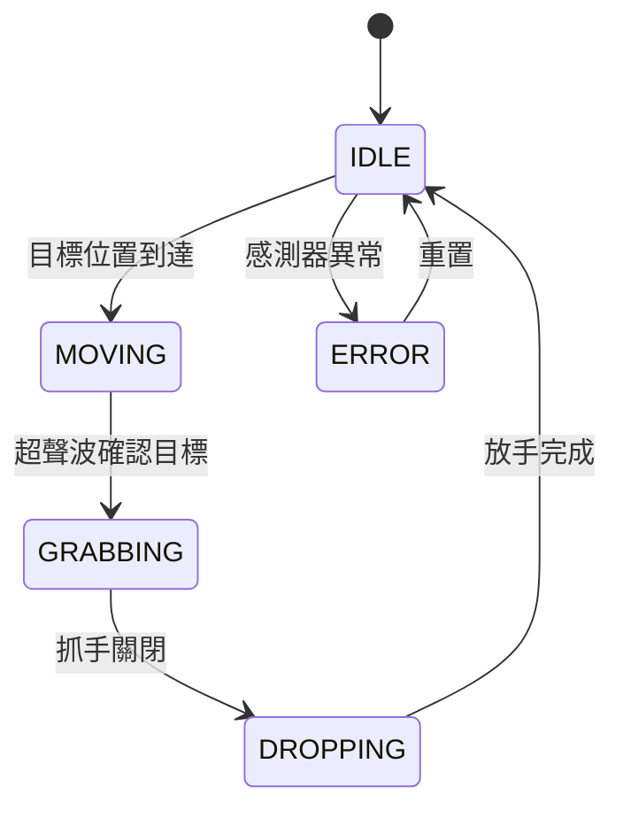
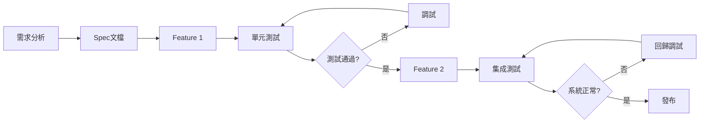
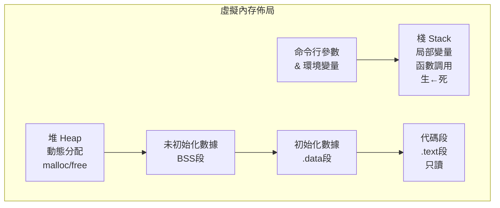
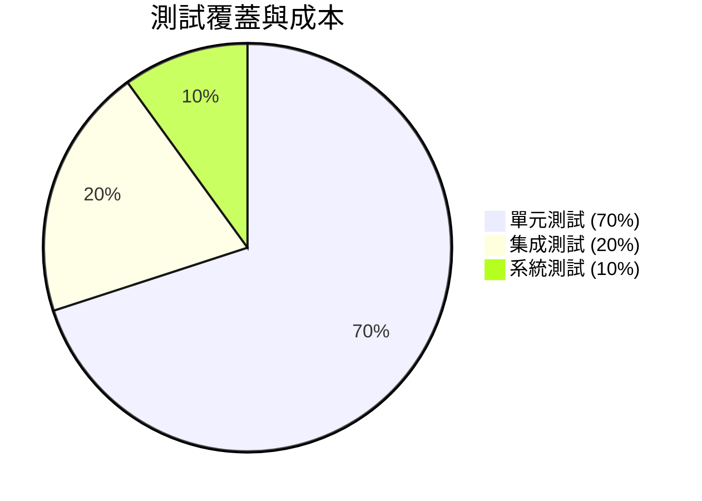

# ENGG1110 — Problem Solving By Programming

**CUHK Engineering | Faculty Package | 3 units**
**自學路徑**: Programming Foundation → Year 2 Core → Robotics Projects

---

## 問題 1：5 個核心心智模型

### 1. 增量開發 (Incremental Development)
**定義**: 將複雜程序拆解為小型、可測試的步驟，每步完成後立即驗證。
**方程式**: `git commit` per feature = 增量開發核心
**應用**: 倉庫機械人狀態機 → 每次新增一個狀態
**學者**: Deitel & Deitel — *C How to Program* (8th ed.)

### 2. 分而治之 (Divide and Conquer)
**定義**: 將大問題分解為獨立的子問題，分別求解後合併結果。
**應用**: 機械人尋路 → 地圖分割 → 局部路徑 → 全局拼接
**學者**: Cormen et al. — *Introduction to Algorithms* (CLRS)

### 3. 有限狀態機 (Finite State Machine)
**定義**: 系統行為由有限狀態集合 + 狀態轉移規則定義。
**方程式**: FSM = (S, s₀, Σ, δ, F)，其中 δ: S × Σ → S
**應用**: 倉庫機械人 → idle / moving / grabbing / dropping 四態
**學者**: Wikipedia FSM Theory; Sipser *Introduction to Theory of Computation*

### 4. 調試技術 (Debugging)
**定義**: 系統性找出並消除程式錯誤的過程。
**方法**: printf debugging → gdb/lldb → 單元測試
**案例**: Pygame agent loop → 打印坐標追蹤狀態轉移

### 5. 建模與模擬 (Modelling and Simulation)
**定義**: 用計算機程序模擬真實系統行為，驗證設計後再構建物理原型。
**應用**: 機械人抓手力度控制 → Python 模擬 → 物理實現
**學者**: Deitel & Deitel; NASA Systems Engineering Handbook

---

## 問題 2：3 個根本分歧

### 分歧 1：C vs Python — 第一門語言選哪個？
- **C 派**: ENGG1110 官方語言。記憶體管理、指標基礎扎實。Deitel教材經典。
- **Python 派**: AIST1110 (Python版) 更適合快速原型和AI應用。NumPy/SciPy生態成熟。
- **結論**: 兩者都學。先C打基礎 → 再Python做項目。

### 分歧 2：考試 vs 項目 — 評估方式哪個重要？
- **考試派**: 40%考試確保理論基礎扎實，防止只做項目不讀書。
- **項目派**: 20%項目 + 25%實驗室 + 30%報告，更能培養實際工程能力。
- **結論**: 項目能力決定未來工程師價值，但基礎知識決定你能走多遠。

### 分歧 3：白盒測試 vs 黑盒測試
- **白盒派**: 知道內部實現，針對每條分支寫測試。覆蓋率高。
- **黑盒派**: 只測輸入輸出，不依賴實現細節。重構時更穩定。
- **結論**: 兩者結合。白盒測單元，黑盒測集成。

---

## 問題 3：10 個深度問題

1. 為什麼 `for` 迴圈比 `while` 迴圈在多數情況下更推薦？（提示：邊界控制）
2. 解釋指針 `int *p` 和陣列 `int arr[10]` 在記憶體佈局上的本質區別。
3. 如何用有限狀態機模擬交通訊號燈系統？畫出狀態圖。
4. 為什麼 `scanf` 被認為是不安全的？如何用 `fgets` 替代？
5. 解釋「增量開發」的「最小可發布單元」概念。
6. 如何設計一個模組化的抓手控制程序，使得更換硬體時無需修改核心邏輯？
7. 結構體 `struct` 和類別 `class` 在C和Python中的本質差異是什麼？
8. 如何用分而治之策略解決「在二維網格中找兩點最短路徑」問題？
9. 調試時如何設置條件斷點來捕捉特定狀態？
10. 如何用軟件原型驗證機械人PID控制參數，再遷移到嵌入式系統？

---

# 核心心智模型深化（中英對照）

## 1. 增量開發 — Incremental Development

### 1.1 定義與背景
增量開發是一種軟件開發策略，將大型系統分解為小型的、可獨立測試的功能模塊，逐步構建並集成。相對於「大爆炸」開發（一次性構建全部），增量開發在每個小步驟後立即驗證正確性。

### 1.2 關鍵方程式
```
Step 1: 需求 → 規格 (Spec)
Step 2: Spec → 最小功能單元 (Feature)
Step 3: Feature → 單元測試 (Unit Test)
Step 4: 測試通過 → 集成 (Integration)
Step 5: 集成後 → 下一個 Feature
```
Git workflow: `feature branch → test → merge → release`

### 1.3 應用場景
- **倉庫機械人**: 先做狀態機框架 → 單獨實現每個狀態 → 最後集成感測器和馬達控制
- **FPV控制系統**: 先做姿態感測 → 再加超聲波測距 → 最後加力度控制

### 1.4 犀利觀察 (袁騰飛式)
ENGG1110 的項目佔20%，但很多同學把時間全花在折騰IDE配置和語法細節上，忽略了「系統思維」。真正的工程師不是寫代碼最快的，而是架構設計最好的。

### 1.5 深度思考題
如何將增量開發應用於非軟件領域？例如：設計一個24週bootcamp，每週遞進一個核心模組？

---

## 2. 分而治之 — Divide and Conquer

### 2.1 Definition and Context
Divide and Conquer is an algorithm design paradigm: divide the problem into independent sub-problems, solve each recursively, then combine results. Classic examples: Merge Sort, Quick Sort, Binary Search.

### 2.2 Key Equations
```
T(n) = aT(n/b) + D(n) + C(n)
where: a = subproblems, n/b = subproblem size
D(n) = divide cost, C(n) = combine cost
Merge Sort: T(n) = 2T(n/2) + O(n) = O(n log n)
```

### 2.3 Applications
- **Robot path planning**: Grid → Quadtree subdivision → Local planner → Global stitch
- **Image processing**: Large image → tile → process → merge

### 2.4 Critical Observation
很多同學會寫Merge Sort，但不知道這個思想有多強大。從GPU並行計算到分布式系統，分而治之無處不在。

### 2.5 Deep Question
設計一個「自適應網格細分」算法，用於機械人的局部路徑規劃——障礙物密集區域自動細分柵格。

---

## 3. 有限狀態機 — Finite State Machine

### 3.1 定義
FSM是一個計算模型：系統在任意時刻處於有限狀態集合中的某一狀態，根據輸入和當前狀態決定下一狀態。

### 3.2 數學定義
```
M = (Q, Σ, δ, q₀, F)
Q = {q₀, q₁, q₂, ...}  狀態集合
Σ = {σ₁, σ₂, ...}       輸入字母表
δ: Q × Σ → Q            轉移函數
q₀ ∈ Q                  初始狀態
F ⊆ Q                   接受狀態集合
```

### 3.3 倉庫機械人 FSM 實現
```c
typedef enum { IDLE, MOVING, GRABBING, DROPPING, ERROR } State;
typedef enum { EV_NONE, EV_TARGET_REACHED, EV_GRIP_CLOSE, EV_GRIP_OPEN, EV_ERR } Event;

State transition(State current, Event ev) {
    switch(current) {
        case IDLE:    return (ev==EV_TARGET_REACHED) ? MOVING : IDLE;
        case MOVING:  return (ev==EV_TARGET_REACHED) ? GRABBING : MOVING;
        case GRABBING:return (ev==EV_GRIP_CLOSE) ? DROPPING : GRABBING;
        case DROPPING:return (ev==EV_GRIP_OPEN) ? IDLE : DROPPING;
        case ERROR:   return IDLE;
    }
}
```

### 3.4 Mermaid 狀態圖


### 3.5 Deep Question
如何用狀態機實現「有優先級的任務調度」？例如：同時有多個目標到達時，機械人應該如何選擇？

---

## 4. 調試技術 — Debugging Techniques

### 4.1 Debugging Pyramid
```
        ▲ 自動化測試 (最高效)
       ▲ ▲ 單元測試
      ▲ ▲ ▲ 調試器 (gdb/lldb)
     ▲ ▲ ▲ ▲ 打印調試
    ▲ ▲ ▲ ▲ ▲ 猜測法 (最低效)
```

### 4.2 GDB 基本命令
```
(gdb) break main          # 設置斷點
(gdb) run                 # 運行程序
(gdb) next                # 單步執行
(gdb) print variable      # 打印變量
(gdb) watch var           # 監視變量變化
(gdb) bt                  # 棧追蹤 (backtrace)
```

### 4.3 Python Debugging
```python
import pdb; pdb.set_trace()  # 設置斷點
# 或使用 IDE 調試器 (VS Code, PyCharm)

# 更現代的方法: breakpoint()
# 等效於 import pdb; pdb.set_trace()
```

---

## 5. 建模與模擬 — Modelling and Simulation

### 5.1 數學模型基本框架
```
系統輸入 u(t)
       ↓
   系統模型  f(x, u) → x' = f(x, u)
       ↓
系統狀態 x(t)
       ↓
   系統輸出  y(t) = g(x, u)
```

### 5.2 DC 馬達速度控制模型
```python
import numpy as np
import matplotlib.pyplot as plt

# 馬達模型參數
R = 1.0      # 電阻 (Ohm)
L = 0.5      # 電感 (H)
Km = 0.01    # 扭矩常數
Kb = 0.01    # 反電動勢常數
J = 0.01     # 轉動慣量
b = 0.1      # 阻尼系數

# PID 控制器
Kp, Ki, Kd = 1.0, 0.1, 0.05
target_speed = 1000  # RPM

# 離散模擬
dt = 0.001
time = np.arange(0, 2, dt)
speeds = []
voltage = 12.0

for t in time:
    error = target_speed - speeds[-1] if speeds else target_speed
    # PID 輸出
    u = Kp*error + Ki*error*dt + Kd*(error - (speeds[-2]-speeds[-1]) if len(speeds)>1 else 0)
    speeds.append(u)  # 簡化模型

plt.plot(time, speeds)
plt.xlabel('Time (s)'); plt.ylabel('Speed (RPM)')
plt.title('DC Motor Speed Response with PID')
plt.grid(True); plt.show()
```

---

## 深度自測問題詳解

**Q1**: 為什麼 `for` 比 `while` 在多數情況下更推薦？
**A**: `for` 明確包含初始化、條件、更新三部分，邊界控制一目了然，減少無限迴圈風險。`while` 更適合邊界不明確的場景（如等待外部輸入）。

**Q2**: 指針和陣列的本質區別？
**A**: 陣列名是指向首元素的常數指針，但`sizeof(陣列)`返回整個陣列大小，而`sizeof(指針)`只返回指針大小。C語言中`arr[i]`和`*(arr+i)`完全等價。

**Q3**: FSM狀態圖繪製
**A**: 狀態圖：圓形=狀態，箭頭=轉移（標註觸發條件）。交通燈：綠→黃（定時）→紅→綠，每狀態有明確進入/退出動作。

**Q4**: `scanf`不安全？
**A**: `scanf("%s", buf)` 無邊界檢查，溢出風險。用`fgets(buf, sizeof(buf), stdin)`替代，再`sscanf`或`strtok`解析。

**Q5**: 增量開發最小可發布單元
**A**: 每個commit是一個邏輯單元：新功能/修復/重構之一，且能獨立測試通過。「可發布」意味著主分支隨時可部署。

**Q6**: 模組化抓手控制設計
**A**: 抽象層：定義`GripperInterface`（`open()`, `close()`, `set_force(f)`）。實現層：`SerialGripper`, `ParallelGripper`。更換硬體時只換實現，不動調用方。

**Q7**: C struct vs Python class
**A**: struct是數據聚合（無方法），class是數據+行為封裝。Python一切皆對象，struct在C中用於定義數據布局（內存排列）。

**Q8**: 分而治之解決最短路徑
**A**: 柵格細分為4象限 → 每象限內Dijkstra → 象限邊界節點連接 → 全局拼接。關鍵：邊界定義要一致。

**Q9**: 條件斷點設置
**A**: GDB: `break func if count > 100`。VS Code調試：在斷點屬性中設置條件表達式。

**Q10**: PID參數軟件驗證
**A**: 離散PID模擬 → 參數敏感性分析 → 穩定域繪製 → 選擇最魯棒參數 → 移植到嵌入式 → 實物驗證。

---

## 5 個 Mermaid 圖解

### 1. 增量開發工作流


### 2. C 程序內存佈局


### 3. 變量作用域層次
```mermaid
flowchart TB
    A[全局作用域\n全局變量] --> B[文件作用域\nstatic]
    B --> C[塊作用域\n{ } 內部]
    C --> D[函數作用域\n函數參數]
```

### 4. 數組 vs 指針內存
```mermaid
graph LR
    subgraph 數組 int arr[3]
        A0[arr[0]] --> A1[arr[1]] --> A2[arr[2]]
    end
    subgraph 指針 int *p
        B0[p 指向\n某地址] --> B1[...]
    end
    style A0 fill:#ff9999
    style B0 fill:#99ccff
```

### 5. 軟件測試金字塔


---

## 總結

1. **ENGG1110是工程思維的起點** — 不是「學C語言」，是「學如何用計算機解決問題」
2. **增量開發改變你看項目的方式** — 把大項目拆成能git commit的小塊
3. **FSM是所有嵌入式系統的基礎** — 倉庫機械人、無人機姿態控制、PLC邏輯，全是狀態機
4. **調試比寫代碼更重要** — 頂級工程師調試一小時等於普通工程師寫一天
5. **建模節省硬成本** — Python模擬驗證再動手，省的不是時間，是材料費

**Prerequisite chain**: ENGG1110 → CSCI2040 / CSCI2100 → MAEG3060 Robotics → MAEG4050 Control
