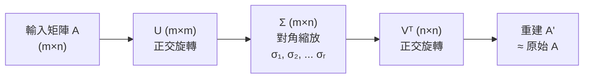
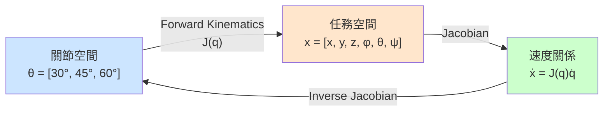
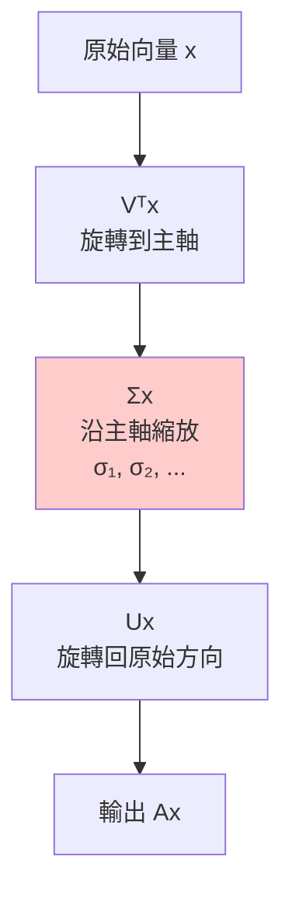
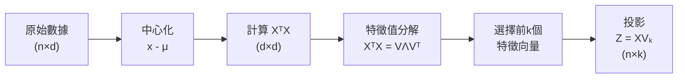
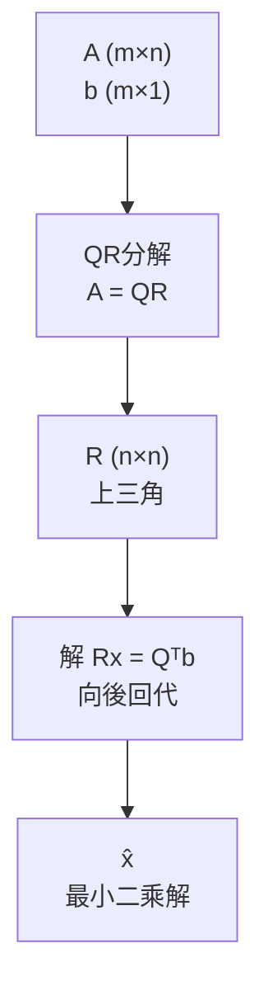
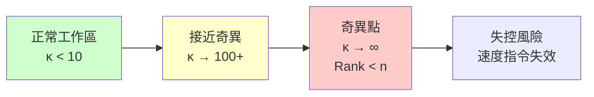

# ENGG1120 — Linear Algebra for Engineers

**CUHK Engineering | Faculty Package | 3 units**
**自學路徑**: Linear Algebra → Robotics Kinematics → Computer Vision → ML

---

## 問題 1：5 個核心心智模型

### 1. 向量空間 (Vector Space)
**定義**: 滿足加法和標量乘法封閉性的元素集合。機械人關節角度、末端執行器位置全是向量。
**方程式**: $\vec{v} \in \mathbb{R}^n$，加法封閉 $\vec{u}+\vec{v} \in \mathbb{R}^n$，標量乘封閉 $c\vec{v} \in \mathbb{R}^n$
**學者**: Gilbert Strang — *Introduction to Linear Algebra*

### 2. 矩陣是線性變換 (Matrix as Linear Transformation)
**定義**: $A \in \mathbb{R}^{m \times n}$ 將 $\mathbb{R}^n$ 中的向量映射到 $\mathbb{R}^m$。
**方程式**: $\vec{y} = A\vec{x}$，其中 $y_i = \sum_j a_{ij}x_j$
**應用**: 機械人坐標變換 — 基底變換、旋轉、縮放全是矩陣乘法

### 3. 特徵值與特徵向量 (Eigenvalues and Eigenvectors)
**定義**: $A\vec{v} = \lambda\vec{v}$，$\vec{v}$ 方向不變，$\lambda$ 標記縮放因子。
**方程式**: $\det(A - \lambda I) = 0$
**應用**: 主成分分析(PCA)、電路諧振頻率、穩定性分析
**學者**: Strang; Horn & Johnson *Matrix Analysis*

### 4. 奇異值分解 (SVD)
**定義**: $A = U\Sigma V^T$，將任意矩陣分解為旋轉+縮放+旋轉。
**方程式**: $A = \sum_{i=1}^{r} \sigma_i \vec{u}_i \vec{v}_i^T$
**應用**: 圖像壓縮、降噪、推薦系統、Google PageRank
**學者**: Golub & Van Loan — *Matrix Computations*

### 5. 最小二乘法 (Least Squares)
**定義**: 求解 $A\vec{x} \approx \vec{b}$ 的最佳近似解。
**方程式**: $\hat{\vec{x}} = (A^TA)^{-1}A^T\vec{b}$（正規方程）
**應用**: 傳感器校準、曲線擬合、軌跡預測
**學者**: Lawson & Hanson — *Solving Least Squares Problems*

---

## 問題 2：3 個根本分歧

### 分歧 1：行視角 vs 列視角 — 看矩陣乘法哪個更自然？
- **列視角派**: $A\vec{x}$ 是「列的線性組合」，几何直观：向量被矩陣「拉伸+旋轉」。
- **行視角派**: $A\vec{x}$ 是「行與向量點積」，計算直觀：每行產生一個輸出分量。
- **結論**: 列視角在幾何和機械人學中更常用；行視角在理解LU分解時更自然。

### 分歧 2：直接求逆 vs 迭代求解
- **直接求逆派**: $\hat{x} = (A^TA)^{-1}A^Tb$。公式優美，適合小問題。
- **迭代求解派**: QR分解、LU分解、Jacobi迭代。更數值穩定，大型系統效率更高。
- **結論**: 實用中傾向迭代方法；直接求逆只用於教學演示。

### 分歧 3：符號計算 vs 數值計算
- **符號計算**: SymPy, Mathematica。精確結果，適合推導證明。
- **數值計算**: NumPy, MATLAB。實際工程問題，效率高。
- **結論**: 學習階段用符號理解本質；項目中用數值處理實際數據。

---

## 問題 3：10 個深度問題

1. 為什麼機械人的正向運動學 $T = R_x(\alpha)R_z(\theta)R_z(d)$ 不能交換順序？（提示：矩陣乘法不可交換）
2. 解釋「行列式為零」的幾何意義。什麼情況下行列式趨近於零會造成數值問題？
3. 如何用SVD理解PCA？SVD的$\Sigma$對角線值代表什麼？
4. 為什麼最小二乘法的正規方程 $(A^TA)^{-1}$ 在 $A^TA$ 病態時不穩定？如何用奇異值截斷解決？
5. 解釋「條件數」(condition number) 的物理意義。機械人奇異點與條件數有何關係？
6. 如何用QR分解實現Gram-Schmidt正交化？為什麼Q比A的列更適合作為基底？
7. 解釋「秩」(rank) 的物理意義。為什麼機械人控制系統要求Jacobian矩陣滿秩？
8. 如何用奇異值分解壓縮一張機械人視覺圖像（保留95%能量需要多少個奇異值）？
9. 證明：若 $A$ 對稱，則 $A$ 的特徵值為實數。
10. 設計一個用於超聲波傳感器融合的卡爾曼濾波器，並說明狀態轉移矩陣和觀測矩陣的選取依據。

---

# 核心心智模型深化（中英對照）

## 1. 向量空間 — Vector Space

### 1.1 Definition and Context
向量空間是線性代數的核心概念。機械人的工作空間（可達位置集合）、關節空間（全角度範圍）都是向量空間。

### 1.2 Key Equations
$$\mathbb{R}^n = \{[x_1, x_2, ..., x_n]^T : x_i \in \mathbb{R}\}$$
向量加法：$\vec{u} + \vec{v} = [u_1+v_1, ..., u_n+v_n]^T$
標量乘法：$c\vec{v} = [cu_1, ..., cu_n]^T$

### 1.3 Engineering Applications
- **關節空間**: $\vec{q} = [\theta_1, \theta_2, ..., \theta_n]^T$ — 每個關節的角度向量
- **任務空間**: $\vec{x} = [x, y, z, \phi, \theta, \psi]^T$ — 末端執行器位置+姿態
- **驅動空間**: $\vec{\tau} = [\tau_1, ..., \tau_n]^T$ — 每個馬達的扭矩

### 1.4 Critical Observation
Strang在MIT 18.06課堂上說：「線性代數的本質是：世界是線性的，或者可以近似線性，或者可以在局部線性化。」機械人控制理論幾乎全部建立在線性代數之上。

### 1.5 Deep Question
機械人的工作空間邊界由奇異點定義。如何用向量空間理論找到從關節空間到任務空間的滿秩映射區域？

---

## 2. 矩陣是線性變換 — Matrix as Linear Transformation

### 2.1 定義與背景
$A\vec{x}$ 不是「矩陣乘向量」，而是「對向量施加線性變換」。旋轉、反射、縮放、剪切、投影——全是矩陣。

### 2.2 機械人中的典型變換
```python
import numpy as np

# 2D 旋轉矩陣 (繞原點旋轉 θ)
def rot2d(theta):
    c, s = np.cos(theta), np.sin(theta)
    return np.array([[c, -s], [s, c]])

# 3D 旋轉: Z-Y-X Euler 角
def rot3d_euler(alpha, beta, gamma):
    Ra = np.array([[np.cos(alpha), -np.sin(alpha), 0],
                   [np.sin(alpha),  np.cos(alpha), 0],
                   [0, 0, 1]])
    Rb = np.array([[np.cos(beta),  0, np.sin(beta)],
                   [0, 1, 0],
                   [-np.sin(beta), 0, np.cos(beta)]])
    Rc = np.array([[1, 0, 0],
                   [0, np.cos(gamma), -np.sin(gamma)],
                   [0, np.sin(gamma),  np.cos(gamma)]])
    return Ra @ Rb @ Rc  # 右乘先執行
```

### 2.3 逆運動學: 牛頓-拉夫森法
```python
def inverse_kinematics(target_x, q_init, max_iter=100, tol=1e-6):
    """牛頓-拉夫森迭代求逆運動學"""
    q = q_init.copy()
    for _ in range(max_iter):
        J = jacobian(q)  # Jacobian 矩陣
        f = forward_kinematics(q) - target_x  # 誤差
        if np.linalg.norm(f) < tol:
            break
        # Δq = J⁺ Δx (pseudo-inverse)
        delta_q = np.linalg.lstsq(J, -f, rcond=None)[0]
        q = q + delta_q
    return q
```

### 2.4 犀利觀察
機械人學中「雅可比矩陣」$J(q)$ 就是一個線性變換——它將關節速度映射為任務空間速度。所以逆運動學問題歸結為「求解線性方程組」，只不過矩陣隨關節角度變化。

### 2.5 Deep Question
當 Jacobian 接近奇異（行列式趨近零）時，逆運動學會爆發震盪。如何用Damped Least Squares（阻尼最小二乘）避免奇異點？

---

## 3. 特徵值與特徵向量 — Eigenvalues and Eigenvectors

### 3.1 定義
$A\vec{v} = \lambda\vec{v}$ — 矩陣 $A$ 作用在 $\vec{v}$ 上，只改變大小（$\lambda$倍），不改變方向。

### 3.2 計算方法
```python
import numpy as np
A = np.array([[4, 2],
              [1, 3]])
eigenvalues, eigenvectors = np.linalg.eig(A)
print(f"特徵值: {eigenvalues}")
print(f"特徵向量:\n{eigenvectors}")
# 驗證: A @ v = λv
for i in range(len(eigenvalues)):
    assert np.allclose(A @ eigenvectors[:, i], eigenvalues[i] * eigenvectors[:, i])
```

### 3.3 機械人穩定性分析
對於狀態空間模型 $\dot{x} = Ax$，系統穩定當且僅當所有特徵值的實部為負（系統矩陣$A$是Hurwitz矩陣）。

### 3.4 PCA中的應用
```python
from sklearn.decomposition import PCA
import numpy as np

# 假設 X 是 n_samples × n_features 數據矩陣
pca = PCA(n_components=0.95)  # 保留95%方差
X_reduced = pca.fit_transform(X)
print(f"需要 {pca.n_components_} 個主成分")
print(f"解釋方差比: {pca.explained_variance_ratio_}")
```

### 3.5 Deep Question
電腦視覺中，SIFT特徵的尺度空間極值檢測本質上是LoG(Laplacian of Gaussian)濾波器響應的特徵值問題。如何用這個理論理解尺度不變性？

---

## 4. 奇異值分解 — SVD

### 4.1 定義
對於任意 $A \in \mathbb{R}^{m \times n}$，存在正交矩陣 $U \in \mathbb{R}^{m \times m}$，$V \in \mathbb{R}^{n \times n}$，以及對角矩陣 $\Sigma \in \mathbb{R}^{m \times n}$，使得：
$$A = U\Sigma V^T$$
其中 $\Sigma = \text{diag}(\sigma_1, ..., \sigma_r)$，$\sigma_1 \geq \sigma_2 \geq ... \geq \sigma_r > 0$

### 4.2 圖像壓縮代碼
```python
import numpy as np, matplotlib.pyplot as plt

def svd_compress(image, k):
    """保留前k個奇異值"""
    U, s, Vt = np.linalg.svd(image, full_matrices=False)
    reconstructed = U[:, :k] @ np.diag(s[:k]) @ Vt[:k, :]
    compression_ratio = (k * (1 + image.shape[0] + image.shape[1])) / (image.shape[0] * image.shape[1])
    return reconstructed, compression_ratio

# 測試
img = plt.imread('robot_vision.png')
gray = np.mean(img, axis=2)
for k in [5, 20, 50, 100]:
    recon, ratio = svd_compress(gray, k)
    print(f"k={k}: 壓縮比={ratio:.2%}, 重建誤差={np.linalg.norm(gray-recon):.2f}")
```

### 4.3 Mermaid: SVD幾何意義


---

## 5. 最小二乘法 — Least Squares

### 5.1 問題定義
對於超定方程組 $A\vec{x} = \vec{b}$（$m > n$，無精確解），找 $\vec{x}$ 使 $\|A\vec{x} - \vec{b}\|_2$ 最小。

### 5.2 正規方程 (Normal Equations)
$$\hat{\vec{x}} = (A^TA)^{-1}A^T\vec{b}$$
幾何意義：$\hat{\vec{x}}$ 使得殘差向量 $\vec{r} = \vec{b} - A\hat{\vec{x}}$ 與 $A$ 的列空間正交。

### 5.3 QR分解求解（數值更穩定）
```python
import numpy as np

def least_squares(A, b):
    """QR分解求解最小二乘"""
    Q, R = np.linalg.qr(A, mode='economic')
    # Rx = Q^T b
    c = Q.T @ b
    n = R.shape[1]
    # 向後回代
    x = np.zeros(n)
    for i in range(n-1, -1, -1):
        x[i] = (c[i] - R[i, i+1:] @ x[i+1:]) / R[i, i]
    return x

# 驗證
np.random.seed(42)
A = np.random.randn(100, 5)
x_true = np.random.randn(5)
b = A @ x_true + 0.1 * np.random.randn(100)
x_hat = least_squares(A, b)
print(f"估計誤差: {np.linalg.norm(x_hat - x_true):.4f}")
```

---

## 深度自測問題詳解

**Q1**: 矩陣乘法不可交換？
**A**: $AB \neq BA$ 一般不成立。幾何上：先旋轉後平移 ≠ 先平移後旋轉。機械人學中這導致不同的旋轉順序會產生不同的最終姿態。

**Q2**: 行列式為零的幾何意義？
**A**: 二維：面積變為零（平行四邊形壓扁）。三維：體積變為零（平行六面體扁平）。矩陣將輸入空間壓縮到低維子空間，丟失信息，不可逆。

**Q3**: SVD與PCA的關係？
**A**: PCA通過對 $X^TX$ 做特徵值分解；SVD直接分解 $X$。$V$ 的列是 $XX^T$ 的特徵向量（即PCA的主成分），$\Sigma$ 的對角線是對應的奇異值（$\sqrt{\text{特徵值}}$）。

**Q4**: 病態矩陣如何處理？
**A**: Tikhonov正則化：$\hat{x} = (A^TA + \alpha I)^{-1}A^Tb$，或奇異值截斷（只保留$\sigma_i > \epsilon$）。兩者都能抑制噪聲放大。

**Q5**: 條件數的物理意義？
**A**: $\kappa(A) = \sigma_{\max}/\sigma_{\min}$。條件數大意味著輸入的微小擾動會導致輸出的巨大變化。機械人奇異點附近$\sigma_{\min} \to 0$，$\kappa \to \infty$，控制失效。

**Q6**: Gram-Schmidt vs QR分解？
**A**: 經典Gram-Schmidt對舍入誤差敏感（正交性退化）；改良Gram-Schmidt或Householder反射更穩定。NumPy的`np.linalg.qr`默認使用改良版本。

**Q7**: 秩與機械人控制的關係？
**A**: Jacobian矩陣滿秩（rank = min(m,n)）時，末端執行器可以在對應方向上運動。奇異點時rank退化，某些方向失去可控性。

**Q8**: SVD圖像壓縮實驗設計？
**A**: 計算$\sum_{i=1}^{k}\sigma_i^2 / \sum_{i=1}^{r}\sigma_i^2 \geq 0.95$找最小$k$。典型：保留前20-30個奇異值即可還原95%能量。

**Q9**: 對稱矩陣特徵值為實數證明（概要）？
**A**: 若$A = A^T$，設$A\vec{v} = \lambda\vec{v}$，取共軛轉置 $\bar{\vec{v}}^T A \vec{v} = \bar{\lambda}\vec{v}^T\vec{v}$，但左邊等於 $\lambda \vec{v}^T\vec{v}$，故 $\lambda = \bar{\lambda}$，即實數。

**Q10**: 卡爾曼濾波器設計（概要）？
**A**: 狀態 $\vec{x}_k = F\vec{x}_{k-1} + B\vec{u}_k + \vec{w}_k$（$F$=狀態轉移矩陣）；觀測 $\vec{z}_k = H\vec{x}_k + \vec{v}_k$（$H$=觀測矩陣）。卡爾曼增益 $K_k = P_k^- H^T (HP_k^- H^T + R)^{-1}$ 融合預測與觀測。

---

## 5 個 Mermaid 圖解

### 1. 線性代數在地圖變換中的角色


### 2. SVD 幾何分解


### 3. PCA降維流程


### 4. QR分解求解流程


### 5. 機械人奇異點與條件數


---

## 總結

1. **線性代數是機械人學的數學語言** — 從關節到末端的映射，全靠矩陣
2. **SVD是最強的矩陣分解** — 穩定、普適、壓縮、擬合全部搞定
3. **特徵值分析控制系統穩定性** — 所有現代控制理論建立在特徵值基礎上
4. **數值穩定性比理論優美更重要** — 實際項目中病態矩陣比理想矩陣常見得多
5. **學線性代數最好的方式是做機械人項目** — 每個方程都能在地圖變換中找到對應

**Prerequisite chain**: ENGG1120 → MAEG3050 Control → MAEG3060 Robotics → ENGG5403 Linear Systems
