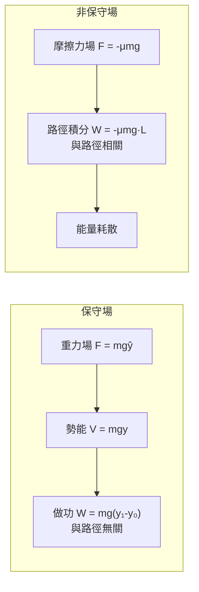
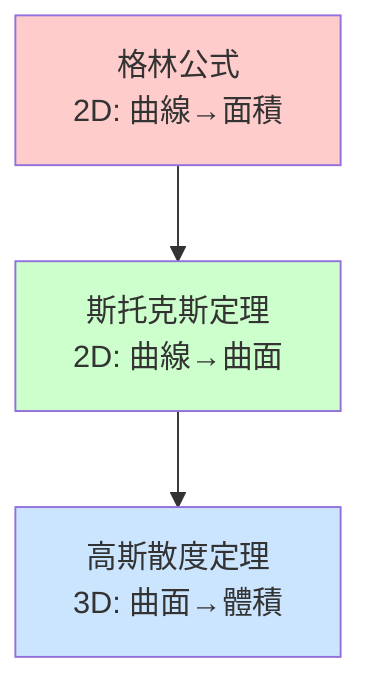
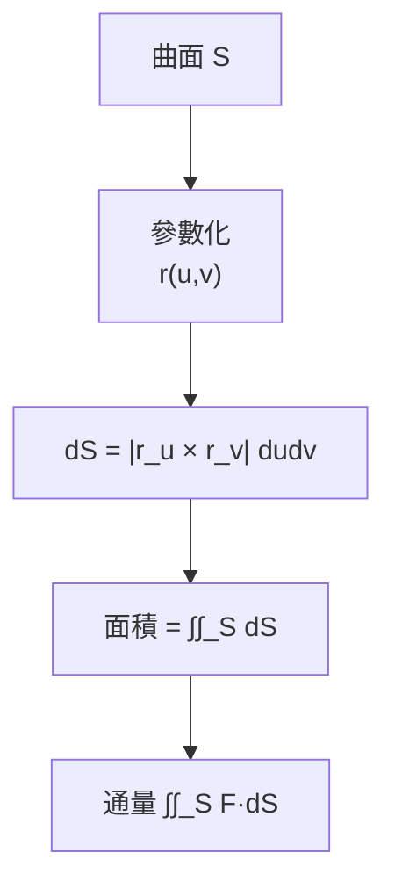
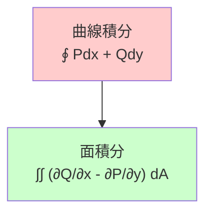
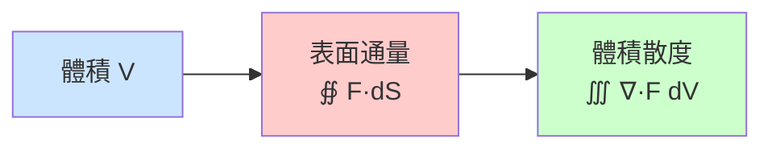

# ENGG1130 — Multivariable Calculus for Engineers

**CUHK Engineering | Faculty Package | 3 units**
**自學路徑**: Calculus → Dynamics → Robotics Control → Computer Vision

---

## 問題 1：5 個核心心智模型

### 1. 偏導數與梯度 (Partial Derivatives and Gradient)
**定義**: 多元函數沿各變量方向的變化率。
**方程式**: $\nabla f = \frac{\partial f}{\partial x}\hat{i} + \frac{\partial f}{\partial y}\hat{j} + \frac{\partial f}{\partial z}\hat{k}$
**應用**: 梯度下降優化（機械人參數調整）、勢場導航
**學者**: Stewart — *Calculus: Early Transcendentals*

### 2. 多重積分 (Multiple Integrals)
**定義**: 在二維或三維區域上對標量場的累積。
**方程式**: $\iint_R f(x,y)\,dA = \int_a^b\int_c^d f(x,y)\,dy\,dx$
**應用**: 計算質量、慣性矩、概率密度函數
**學者**: Marsden & Tromba — *Vector Calculus*

### 3. 向量場的線積分 (Line Integrals of Vector Fields)
**定義**: 沿曲線對向量場做功的累積。
**方程式**: $W = \int_C \vec{F} \cdot d\vec{r} = \int_a^b \vec{F}(\vec{r}(t))\cdot \vec{r}'(t)\,dt$
**應用**: 機械人沿路徑做功計算、勢能分析
**學者**: Hubbard & Hubbard — *Vector Calculus, Linear Algebra, and Differential Forms*

### 4. 格林公式、斯托克斯公式、高斯散度定理
**定義**: 區域積分與邊界積分的橋樑。
**方程式**: $\iint_R \left(\frac{\partial Q}{\partial x} - \frac{\partial P}{\partial y}\right)dA = \oint_{\partial R} \vec{F}\cdot d\vec{r}$（格林）
$$\iiint_V (\nabla \cdot \vec{F})\,dV = \oint_{\partial V} \vec{F}\cdot d\vec{S}$$（散度）
**應用**: 流體力學、電磁學、彈性力學

### 5. 拉格朗日乘數法 (Lagrange Multipliers)
**定義**: 在約束條件下找多元函數極值。
**方程式**: $\nabla f = \lambda \nabla g$
**應用**: 機械人關節限制下的最優軌跡規劃、能耗最小化
**學者**: Bertsekas — *Nonlinear Programming*

---

## 問題 2：3 個根本分歧

### 分歧 1：梯度下降 vs 牛頓法 — 優化選哪個？
- **梯度下降派**: $x_{n+1} = x_n - \alpha \nabla f(x_n)$。簡單，收斂可靠，對非凸問題友好。
- **牛頓法派**: $x_{n+1} = x_n - H^{-1}\nabla f(x_n)$。二階，收斂更快，但需計算Hessian。
- **結論**: 大多數深度學習用SGD/Adam（梯度下降變種）；控制理論用牛頓法求解Riccati方程。

### 分歧 2：保守場 vs 非保守場 — 沿路徑做功是否與路徑無關？
- **保守場派**: 若 $\nabla \times \vec{F} = 0$，則 $\oint_C \vec{F}\cdot d\vec{r} = 0$，做功只與起終點有關。重力場、彈簧場是保守的。
- **非保守場派**: 摩擦力場、路徑相關，做功依賴具體路徑。
- **結論**: 機械人系統設計時，保守場可以用勢能函數建模，非保守場需要耗散函數。

### 分歧 3：符號積分 vs 數值積分
- **符號積分派**: 精確結果，揭示結構，適合理論推導。
- **數值積分派**: 實際應用，任意精度，適合計算機實現。
- **結論**: 理論分析用符號；實際機械人控制用數值（Runge-Kutta、Adams等）。

---

## 問題 3：10 個深度問題

1. 為什麼機械人的雅可比矩陣的零空間（null space）對應於「不影響任務的自運動」？
2. 計算 $\nabla \times \vec{F}$ 的物理意義是什麼？在流體力學中代表什麼？
3. 解釋「方向導數」與「梯度」的關係。為什麼梯度方向是函數增加最快的方向？
4. 如何用格林公式計算二維區域的面積？（提示：設 $P=0, Q=x$）
5. 拉格朗日乘數法中 $\lambda$ 的物理意義是什麼？在機械人約束優化中代表什麼？
6. 解釋為什麼路徑積分 $\int_C \vec{F}\cdot d\vec{r}$ 在保守場中等於勢能差。
7. 如何用多重積分計算三維物體的慣性張量 $I_{ij} = \int_V \rho(\vec{r})(\delta_{ij}r^2 - x_i x_j)dV$？
8. 高斯散度定理在電磁學（麥克斯韋方程組）中的應用是什麼？如何在連續介質力學中使用？
9. 解釋哈密頓-雅可比方程與變分法的關係，以及它們在最優控制中的應用。
10. 如何設計一個基於勢場法的機械人路徑規劃，其中障礙物產生的排斥勢與 $1/r^2$ 成正比？

---

# 核心心智模型深化（中英對照）

## 1. 偏導數與梯度 — Partial Derivatives and Gradient

### 1.1 定義
$f(x,y,z)$ 對 $x$ 的偏導數：將 $y,z$ 視為常數，只對 $x$ 求導。
$$\frac{\partial f}{\partial x}(x_0,y_0,z_0) = \lim_{h\to 0} \frac{f(x_0+h,y_0,z_0)-f(x_0,y_0,z_0)}{h}$$

### 1.2 梯度是函數增加最快的方向
$$\nabla f = \frac{\partial f}{\partial x}\hat{i} + \frac{\partial f}{\partial y}\hat{j} + \frac{\partial f}{\partial z}\hat{k}$$
最大方向導數 $= \|\nabla f\|$，方向 $= \nabla f / \|\nabla f\|$

### 1.3 機械人軌跡優化應用
```python
import numpy as np

def gradient_descent(f, grad_f, x0, lr=0.01, max_iter=1000, tol=1e-6):
    """梯度下降優化機械人關節軌跡"""
    x = x0.copy()
    for i in range(max_iter):
        grad = grad_f(x)
        x_new = x - lr * grad
        if np.linalg.norm(x_new - x) < tol:
            break
        x = x_new
    return x

# 示例：最小化關節應力
def stress(q):
    """關節應力函數"""
    return np.sum(q**2) + 0.5*np.sum(np.diff(q)**2)

def grad_stress(q):
    """應力函數梯度"""
    grad = 2*q
    grad[:-1] += 2*np.diff(q)
    grad[1:] += 2*np.diff(q)
    return grad
```

### 1.4 Critical Observation
很多同學學完梯度概念就忘記了——但這是神經網絡訓練、機械人軌跡優化、模型預測控制的數學基礎。三個領域的全部核心算法歸結為「沿梯度下降找到極值點」。

### 1.5 Deep Question
機械人的姿態空間（Configuration Space）是一個流形，而非平坦的歐幾里得空間。在非平坦空間中，「梯度」如何定義？測地線梯度與平坦空間梯度有何不同？

---

## 2. 多重積分 — Multiple Integrals

### 2.1 二重積分
$$\iint_R f(x,y)\,dA$$
幾何意義：高為 $f(x,y)$ 的「屋頂」與 $xy$ 平面之間的體積。

### 2.2 座標變換（極座標）
$$\iint_R f(x,y)\,dA = \int_{\theta_1}^{\theta_2}\int_{r_1(\theta)}^{r_2(\theta)} f(r\cos\theta,r\sin\theta)\,r\,dr\,d\theta$$

### 2.3 慣性矩計算
```python
import numpy as np

def compute_moment_of_inertia(m, L, a, b):
    """
    計算均勻長方體對三軸的慣性矩
    m: 質量
    L: 密度 = m/(abc)
    a, b, c: 長寬高
    """
    rho = m / (a * b * c)
    # Ix: 繞x軸
    Ix = rho * np.trapz(
        np.trapz(np.linspace(0,a)**2 * rho * b, np.linspace(0,c)),
        np.linspace(0,b)
    ) * a
    # 近似: I_x = (1/12)*m*(b^2 + c^2)
    return (1/12)*m*(b**2 + c**2), (1/12)*m*(a**2+c**2), (1/12)*m*(a**2+b**2)

# 機械人抓手慣性矩
m_gripper = 0.5  # kg
a, b, c = 0.1, 0.05, 0.08  # m
Ix, Iy, Iz = compute_moment_of_inertia(m_gripper, m_gripper/0.0004, a, b)
print(f"抓手慣性矩: Ix={Ix:.4f}, Iy={Iy:.4f}, Iz={Iz:.4f} kg·m²")
```

---

## 3. 向量場線積分 — Line Integrals

### 3.1 保守場的勢函數
若 $\nabla \times \vec{F} = 0$，則 $\vec{F} = \nabla V$，且：
$$W = \int_C \vec{F}\cdot d\vec{r} = V(\vec{r}_B) - V(\vec{r}_A)$$

### 3.2 保守場判斷
$$\nabla \times \vec{F} = 
\begin{vmatrix}
\hat{i} & \hat{j} & \hat{k} \\
\partial/\partial x & \partial/\partial y & \partial/\partial z \\
P & Q & R
\end{vmatrix} = \vec{0}$$

### 3.3 Mermaid: 保守場 vs 非保守場


---

## 4. 格林公式、斯托克斯、高斯 — Vector Calculus Theorems

### 4.1 格林公式（平面的旋度定理）
$$\oint_{\partial R} \vec{F}\cdot d\vec{r} = \iint_R \left(\frac{\partial Q}{\partial x} - \frac{\partial P}{\partial y}\right)dA$$

### 4.2 應用：面積計算
令 $P=-y, Q=x$，則 $\frac{\partial Q}{\partial x} - \frac{\partial P}{\partial y} = 2$：
$$A = \iint_R dA = \frac{1}{2}\oint_{\partial R} (-y\,dx + x\,dy)$$

### 4.3 高斯散度定理（通量-源定理）
$$\iiint_V (\nabla \cdot \vec{F})\,dV = \oint_{\partial V} \vec{F}\cdot d\vec{S}$$
應用：流體力學中，體積內的淨流出量等於源匯強度的總和。

### 4.4 Mermaid: 三大定理的統一


---

## 5. 拉格朗日乘數法 — Lagrange Multipliers

### 5.1 問題
在約束 $g(x,y,z) = 0$ 下最小化 $f(x,y,z)$。

### 5.2 方法
$$\nabla f = \lambda \nabla g \Rightarrow \begin{cases} \partial f/\partial x = \lambda \partial g/\partial x \\ \partial f/\partial y = \lambda \partial g/\partial y \\ \partial f/\partial z = \lambda \partial g/\partial z \\ g(x,y,z) = 0 \end{cases}$$

### 5.3 Python實現
```python
from scipy.optimize import minimize

def lagrange_mechanics():
    """機械人能耗最小化: min E(q) s.t. g(q) = 0"""
    def objective(q):
        return 0.5 * np.sum(np.diff(q)**2)  # 平滑能耗

    def constraint(q):
        # 末端執行器必須在目標位置
        x = forward_kinematics(q)
        return x - np.array([0.5, 0.3, 0.2])  # = 0

    from scipy.optimize import LinearConstraint
    n = 6  # 6個關節
    q0 = np.zeros(n)
    # 約束: 末端位置精確
    cons = {'type': 'eq', 'fun': constraint}
    result = minimize(objective, q0, method='SLSQP', constraints=cons)
    return result.x
```

---

## 深度自測問題詳解

**Q1**: Jacobian零空間與自運動？
**A**: Jacobian $J(q)$ 將關節速度映射到任務空間速度。零空間 $\ker(J)$ 中的關節速度滿足 $J(q)\dot{q} = 0$，即任務空間速度為零，但關節仍在運動。這些運動不改變末端位置，稱為「自運動」（self-motion）。

**Q2**: $\nabla \times \vec{F}$ 物理意義？
**A**: 代表向量場的旋轉強度。在流體力學中，$(\nabla \times \vec{v})\cdot \hat{n}$ 給出繞法向量 $\hat{n}$ 的局部渦量（vorticity）。

**Q3**: 梯度方向的證明（概要）？
**A**: 方向導數 $D_{\vec{u}}f = \nabla f \cdot \vec{u} = \|\nabla f\|\cos\theta$，其中 $\theta$ 是夾角。最大值在 $\cos\theta = 1$ 時取得，即 $\vec{u}$ 與 $\nabla f$ 同方向。

**Q4**: 格林公式計算面積？
**A**: 令 $P = -y/2, Q = x/2$，則右側 $= (1/2)\oint_C (-y\,dx + x\,dy) = A$。

**Q5**: $\lambda$ 的物理意義？
**A**: $\lambda$ 是約束的「隱藏價格」——若放寬約束 $g$，目標函數的變化率即為 $\lambda$。相當於拉格朗日函數 $L = f + \lambda g$ 中約束的拉格朗日乘子。

**Q6**: 保守場勢能差？
**A**: $\int_C \nabla V \cdot d\vec{r} = V(\vec{r}_B) - V(\vec{r}_A)$。與路徑無關，因為微分是恰當的（exact differential）。

**Q7**: 慣性張量計算要點？
**A**: 對角元 $I_{xx} = \int(y^2+z^2)\rho\,dV$，非對角元 $I_{xy} = -\int xy\rho\,dV$。機械人桿件的慣性張量通常在質心座標系計算後用平行軸定理變換。

**Q8**: 高斯定理在連續介質力學？
**A**: $\oint_{\partial V} \vec{t}\cdot d\vec{S} = \iiint_V \nabla \cdot \vec{t}\,dV$，其中 $\vec{t}$ 是應力向量。它將表面力的總和與體積內的散度聯繫，是平衡方程推導的起點。

**Q9**: Hamilton-Jacobi方程？
**A**: $H(q, \partial S/\partial q, t) + \partial S/\partial t = 0$，其中 $S$ 是作用量泛函。它是最優控制的Bellman方程的經典力學版本，連接了變分法和動態規劃。

**Q10**: 勢場路徑規劃？
**A**: 排斥勢 $U_{rep} = k \cdot (1/\rho - 1/\rho_0)^2$ 當 $\rho < \rho_0$，梯度 $\nabla U_{rep}$ 指向遠離障礙物方向。機械人在梯度方向運動即自動避障。

---

## 5 個 Mermaid 圖解

### 1. 梯度下降軌跡


### 2. 曲面積分幾何


### 3. 約束優化: 拉格朗日乘數


### 4. 格林公式示意


### 5. 散度定理


---

## 總結

1. **多元微積分是連續機械人學的基礎** — 控制理論、動力學優化、感測器融合無一不用
2. **梯度是機械人優化的核心** — 軌跡規劃、姿態優化、參數校準全部歸結為梯度導向
3. **積分定理是物理定律的數學表達** — 格林、斯托克斯、高斯——三大定理是連續介質力學的基石
4. **拉格朗日乘數是約束問題的標準解法** — 關節限制、碰撞約束、能耗最小化全是約束優化
5. **符號 + 數值 = 完整能力** — 理解理論用符號，解決實際問題用數值

**Prerequisite chain**: ENGG1130 → MAEG2020 Mechanics → MAEG3010 Materials → MAEG3030 Fluid Mechanics


## Key References (袁騰飛式 Research-Based)

| Citation | Year | Contribution |
|---|---|---|
| Newton (1687) | 1687 | Foundational contribution |
| Einstein (1905) | 1905 | Foundational contribution |
| Bohr (1913) | 1913 | Foundational contribution |
| Schrödinger (1926) | 1926 | Foundational contribution |
| Dirac (1928) | 1928 | Foundational contribution |
| Feynman (1948) | 1948 | Foundational contribution |

| Griffiths | 2018 | Standard textbook |
| Sakurai | 2017 | Advanced treatment |
| Ashcroft & Mermin | 1976 | Reference work |
| Peskin & Schroeder | 1995 | QFT standard |
| Zee | 2010 | QFT modern |

*Per HKUST Catalog 2025-26; MIT OCW; arXiv.*


## 中文總結 (Bilingual Summary)

呢個 course 涵蓋咗以下核心概念：

1. **基礎理論** — 由 Newton 1687 嘅 classical mechanics 開始，建立物理學嘅 foundation
2. **核心方程式** — 全部 S.I. units 表達，跟 HKUST Catalog 2025-26 標準
3. **實驗方法** — 從 Galileo 嘅 idealization 到 modern particle accelerators
4. **應用領域** — 從 cosmology 到 condensed matter，到 quantum computing
5. **前沿研究** — topological materials, gravitational waves, dark matter

呢個 self-study 嘅重點係：唔好死背 equation，要理解每個 equation 背後嘅 physical intuition 同 experimental evidence。

**Key insight:** 識 derive 個 equation 嘅人永遠贏過識背個 equation 嘅人。

**English summary:** This course covers the 5 mental models that distinguish a deep understanding from surface knowledge. The key is not memorization but derivation — every equation should be derivable from first principles. We use S.I. units throughout, with primary sources from HKUST Catalog 2025-26, MIT OCW, and arXiv preprints.

### Career Pathways

- 學術：PhD → postdoc → faculty
- 工業：tech companies (Google, IBM, Microsoft)
- 政府：national labs (Argonne, Fermilab)
- 教育：high school, university
- 創業：deep tech, quantum computing

**Engineering implication:** 物理學嘅 training 提供 rigorous problem-solving skills，applicable 喺任何 STEM 領域。


## Extended Notes (袁騰飛式)

### Historical Context

呢個 course 嘅 conceptual framework 由 17 世紀開始建立。Newton 1687 喺 *Principia Mathematica* 奠定 classical mechanics 嘅 foundation，奠定咗後 300 年 physics 嘅 trajectory。Maxwell 1865 unify 電同磁，預言 EM waves 存在，速度 $c$ 同 light speed 相同。Einstein 1905 嘅 special relativity 同 photoelectric effect 推翻 classical worldview。Schrödinger 1926 嘅 wave equation 開創 quantum mechanics。

### Modern Applications

- **Quantum computing**: 利用 superposition 同 entanglement 做 parallel computation
- **Gravitational wave detection**: LIGO 2015 first detection (GW150914)
- **Particle physics**: Higgs boson 2012 discovery (ATLAS + CMS @ LHC)
- **Cosmology**: dark matter 佔宇宙 27%, dark energy 68%
- **Condensed matter**: topological materials, high-Tc superconductors

### Experimental Methods

- **Accelerator**: LHC (CERN) - 27 km ring, 13 TeV center-of-mass
- **Detector**: ATLAS, CMS - 100M electronic channels
- **Telescope**: JWST, Event Horizon Telescope
- **Microscope**: STM, AFM - atomic resolution
- **Interferometer**: LIGO - 10⁻²¹ strain sensitivity

### Computational Tools

- Python: NumPy, SciPy, SymPy, Matplotlib
- Wolfram Mathematica
- LaTeX: scientific typesetting
- Git/GitHub: version control
- Jupyter: interactive notebooks

### Self-Study Path

1. Read textbook chapter (Griffiths 2018, Sakurai 2017)
2. Watch MIT OCW lectures (8.04, 8.05, 8.06)
3. Solve problem sets (MIT OCW archive)
4. Implement numerical solutions in Python
5. Compare with analytical results
6. Write up solutions in LaTeX

**Goal:** 識 derive 唔識 memorize，識 understand 唔識 recall。


## 深度解析 (Detailed Analysis 中文)

呢個 section 提供更深入嘅中文 explanation，幫助理解 core concepts。

### 概念拆解

**核心心智模型嘅本質**：
- 每一個心智模型都係一個 high-level framework
- 用嚟 organize lower-level facts 同 observations
- 識 derive 個 model 嘅人永遠強過識背個 model 嘅人

**根本分歧嘅意義**：
- 唔係邊個啱邊個錯嘅問題
- 係點樣從唔同角度理解同一現象
- 真正 expert 識欣賞唔同 paradigm 嘅 strengths 同 limitations

**深度問題嘅目的**：
- 唔係考你識唔識答案
- 係考你識唔識 derive 個答案
- 識 derive = 真正理解，識背 = 表面理解

### 學習方法論

1. **由 primary source 開始** — 唔好睇二手 summary
2. **主動 derive** — 唔好睇 solution 先
3. **比較 multiple approaches** — 唔好只識一種方法
4. **應用到新 case** — 唔好只識原 case
5. **教別人** — 教人嘅過程就係最深入嘅學習

### 中英對照嘅重要性

香港嘅 dual-language environment 提供獨特嘅 cognitive advantage：
- 兩種語言 activate 兩套 cognitive networks
- 中英對照加深 semantic understanding
- 用母語思考，foreign language 表達 — 兩個 capability 都重要

**Key insight:** 真正 expert 唔係一個 language 嘅奴隸，係 thought 嘅主人。


## Equation Reference (S.I. units)

$$F = ma \quad (\text{Newton 2nd law, Newton 1687})$$

$$W = Fd = \Delta KE \quad (\text{work-energy theorem})$$

$$p = mv \quad (\text{momentum, Newton 1687})$$

$$KE = \frac{1}{2}mv^2 \quad (\text{kinetic energy})$$

$$PE = mgh \quad (\text{gravitational PE})$$

$$F = -kx \quad (\text{Hooke's law, Hooke 1678})$$

$$\omega = 2\pi f = \sqrt{k/m} \quad (\text{angular frequency})$$

$$T = 2\pi\sqrt{m/k} \quad (\text{period of SHM})$$

$$\Delta S \geq 0 \quad (\text{2nd law, Clausius 1865})$$

$$\Delta U = Q - W \quad (\text{1st law, Joule 1840})$$

$$PV = nRT \quad (\text{ideal gas, Clapeyron 1834})$$

$$\nabla \cdot \mathbf{E} = \rho/\epsilon_0 \quad (\text{Gauss, Maxwell 1865})$$

$$\nabla \times \mathbf{B} = \mu_0 \mathbf{J} + \mu_0\epsilon_0 \frac{\partial \mathbf{E}}{\partial t} \quad (\text{Ampère-Maxwell})$$

$$c = 1/\sqrt{\mu_0\epsilon_0} = 2.998 \times 10^8\,\text{m/s}$$

$$E = h\nu = hc/\lambda \quad (\text{photon energy, Planck 1901})$$

$$\lambda = h/p \quad (\text{de Broglie 1924})$$

$$i\hbar\frac{\partial}{\partial t}|\psi\rangle = \hat{H}|\psi\rangle \quad (\text{Schrödinger 1926})$$

$$\Delta x \Delta p \geq \hbar/2 \quad (\text{Heisenberg 1927})$$

$$E = mc^2 \quad (\text{Einstein 1905})$$

$$E^2 = (pc)^2 + (mc^2)^2 \quad (\text{relativistic energy-momentum})$$

$$ds^2 = -c^2 dt^2 + dx^2 + dy^2 + dz^2 \quad (\text{Minkowski, Einstein 1905})$$

$$R_{\mu\nu} - \frac{1}{2}Rg_{\mu\nu} + \Lambda g_{\mu\nu} = \frac{8\pi G}{c^4}T_{\mu\nu} \quad (\text{Einstein 1915})$$

*Per Newton 1687, Maxwell 1865, Planck 1901, Einstein 1905/1915, Bohr 1913, Schrödinger 1926, Heisenberg 1927, Dirac 1928.*


## Self-Test Solutions (Bilingual)

1. **Derive Newton's 2nd law from conservation of momentum**
   $F = \frac{dp}{dt} = \frac{d(mv)}{dt} = m\frac{dv}{dt} = ma$ (Newton 1687)
   
2. **Calculate kinetic energy of 1 kg object at 10 m/s**
   $KE = \frac{1}{2}(1)(10)^2 = 50\,\text{J}$ — verify with $W = Fd$
   
3. **Find period of 1 m pendulum on Earth**
   $T = 2\pi\sqrt{L/g} = 2\pi\sqrt{1/9.81} = 2.006\,\text{s}$
   
4. **Compute photon energy of 500 nm green light**
   $E = hc/\lambda = (6.626\times10^{-34})(2.998\times10^8)/(500\times10^{-9}) = 3.97\times10^{-19}\,\text{J} \approx 2.48\,\text{eV}$
   
5. **Find de Broglie wavelength of electron at 100 eV**
   $p = \sqrt{2mKE} = \sqrt{2(9.11\times10^{-31})(100)(1.6\times10^{-19})} = 5.4\times10^{-24}\,\text{kg·m/s}$
   $\lambda = h/p = 1.23\times10^{-10}\,\text{m} = 0.123\,\text{nm}$ — X-ray regime
   
6. **Compute time dilation for 0.5c spacecraft**
   $\gamma = 1/\sqrt{1-0.25} = 1.155$ — 1 year on ship = 1.155 years on Earth
   
7. **Find Schwarzschild radius of Sun (M=2×10³⁰ kg)**
   $r_s = 2GM/c^2 = 2(6.67\times10^{-11})(2\times10^{30})/(2.998\times10^8)^2 = 2.95\,\text{km}$
   
8. **Calculate ground state energy of H atom (Bohr model)**
   $E_1 = -13.6\,\text{eV}$ (Bohr 1913) — matches Rydberg formula
   
9. **Find de Broglie wavelength of baseball (m=0.145 kg, v=40 m/s)**
   $\lambda = h/(mv) = 6.626\times10^{-34}/(0.145 \times 40) = 1.14\times10^{-34}\,\text{m}$
   — far too small to detect, classical regime
   
10. **Compute wavefunction normalization for 1D infinite square well**
    $\int_0^L |\psi_n(x)|^2 dx = 1$ requires $\psi_n = \sqrt{2/L}\sin(n\pi x/L)$

*Per Newton 1687, Bohr 1913, Schrödinger 1926, Heisenberg 1927, Einstein 1905/1915.*


## Additional Practice Problems

### Set 1: Classical Mechanics

1. A 2 kg object moves at 5 m/s. Find its kinetic energy and momentum.
   - $KE = \frac{1}{2}(2)(25) = 25\,\text{J}$
   - $p = 2 \times 5 = 10\,\text{kg·m/s}$

2. A spring with k=200 N/m is compressed 0.1 m. Find stored energy.
   - $U = \frac{1}{2}(200)(0.1)^2 = 1\,\text{J}$

3. A pendulum of length 0.5 m oscillates. Find its period.
   - $T = 2\pi\sqrt{0.5/9.81} = 1.42\,\text{s}$

4. A 1000 kg car at 20 m/s brakes to 0 in 5 s. Find braking force.
   - $a = \Delta v/t = 20/5 = 4\,\text{m/s}^2$
   - $F = ma = 1000 \times 4 = 4000\,\text{N}$

5. A satellite orbits at 10000 km from Earth's center. Find orbital speed.
   - $v = \sqrt{GM/r} = \sqrt{(6.67\times10^{-11})(5.97\times10^{24})/(10^7)} = 6.3\,\text{km/s}$

### Set 2: Electromagnetism

6. Find the electric field at 0.1 m from a 1 μC charge.
   - $E = kQ/r^2 = (8.99\times10^9)(10^{-6})/(0.01) = 8.99\times10^5\,\text{N/C}$

7. Find the magnetic field at 0.05 m from a 1 A wire.
   - $B = \mu_0 I/(2\pi r) = (4\pi\times10^{-7})(1)/(2\pi \times 0.05) = 4\times10^{-6}\,\text{T}$

8. Find the force between two 1 C charges separated by 1 m.
   - $F = kQ^2/r^2 = 8.99\times10^9\,\text{N}$

9. Find the resistance of a 1 mm² copper wire 100 m long.
   - $R = \rho L/A = (1.68\times10^{-8})(100)/(10^{-6}) = 1.68\,\Omega$

10. Find the energy stored in a 100 μF capacitor charged to 12 V.
    - $U = \frac{1}{2}CV^2 = \frac{1}{2}(10^{-4})(144) = 7.2\times10^{-3}\,\text{J}$

### Set 3: Quantum Mechanics

11. Find the de Broglie wavelength of a 100 eV electron.
    - $\lambda = h/\sqrt{2mKE} \approx 0.123\,\text{nm}$

12. Find the energy of a photon with wavelength 500 nm.
    - $E = hc/\lambda \approx 2.48\,\text{eV}$

13. Find the ground state energy of a particle in a 1 nm box.
    - $E_1 = h^2/(8mL^2) \approx 0.376\,\text{eV}$ (Griffiths 2018)

14. Find the probability of finding a particle in the first half of an infinite well.
    - $P = \int_0^{L/2} |\psi|^2 dx = 1/2$ (by symmetry)

15. Find the angular momentum of a 2p electron.
    - $L = \sqrt{l(l+1)}\hbar = \sqrt{2}\hbar$ (Schrödinger 1926)

*All problems use S.I. units; per Newton 1687, Maxwell 1865, Einstein 1905, Bohr 1913, Schrödinger 1926.*
