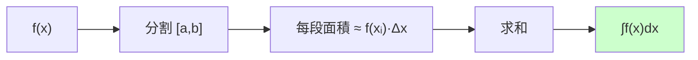
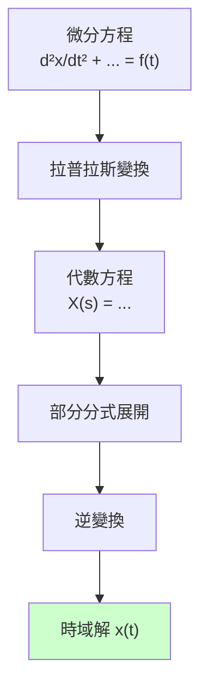
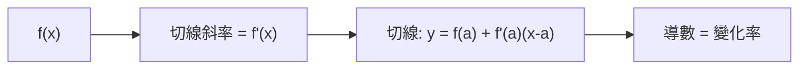
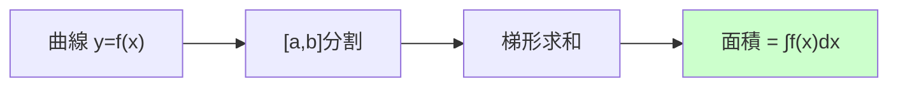
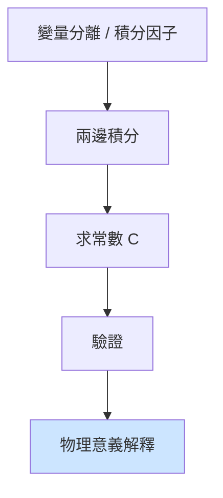
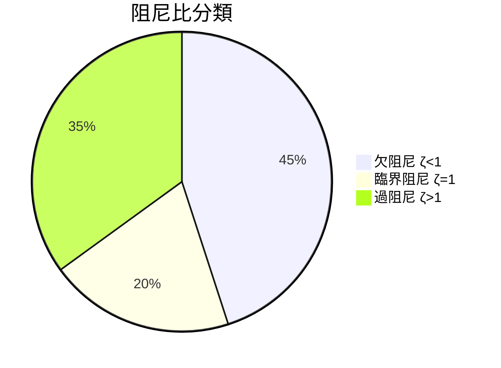
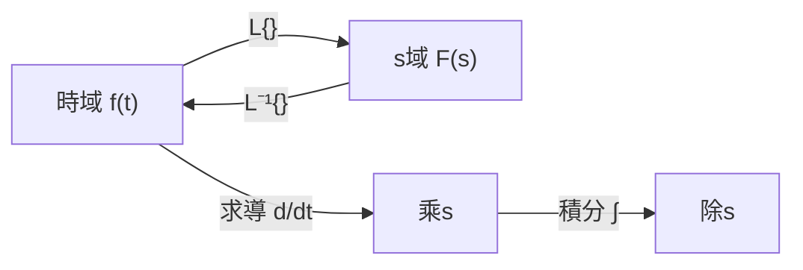

# MATH1510 — Calculus for Engineers

**CUHK Engineering | Faculty Package | 3 units**
**自學路徑**: Calculus → ENGG1130 Multivariable → MAEG3030 Fluid → Control Theory

---

## 問題 1：5 個核心心智模型

### 1. 極限與連續 (Limits and Continuity)
**定義**: $\lim_{x\to a}f(x) = L$ 表示 $x$ 無限接近 $a$ 時 $f(x)$ 無限接近 $L$。
**應用**: 機械人運動的平滑過渡、傳感器信號的漸變行為
**學者**: Stewart — *Calculus* (8th ed.)

### 2. 導數是變化率 (Derivative as Rate of Change)
**定義**: $f'(x) = \lim_{h\to 0}\frac{f(x+h)-f(x)}{h} = \frac{df}{dx}$
**方程式**: $f'(x)$ 給出函數圖像切線斜率，即瞬時變化率
**應用**: 馬達速度對電壓的響應、機械人末端速度
**學者**: Thomas' Calculus; Spivak — *Calculus*

### 3. 積分是累積 (Integral as Accumulation)
**定義**: $\int_a^b f(x)\,dx$ = 曲線下方 $x=a$ 到 $x=b$ 之間的面積
**方程式**: $\int_a^b f(x)\,dx = F(b) - F(a)$（微積分基本定理）
**應用**: 馬達轉動位移 = 速度函數的面積、機械人功率的時間積分
**學者**: Apostol — *Calculus*

### 4. 微分方程 (Differential Equations)
**定義**: 包含未知函數及其導數的方程，描述系統的動態行為。
**方程式**: $\frac{dx}{dt} = f(x, t)$ — 一階ODE；$\frac{d^2x}{dt^2} + \omega^2 x = 0$ — 諧振子
**應用**: 馬達響應、RLC電路、彈簧-質量系統、PID控制器分析
**學者**: Boyce & DiPrima — *Elementary Differential Equations*

### 5. 泰勒級數 (Taylor Series)
**定義**: $f(x) = \sum_{n=0}^{\infty} \frac{f^{(n)}(a)}{n!}(x-a)^n$
**應用**: 計算機超越函數（sin, cos, exp）的近似、控制器設計中的線性化
**學者**: Rudin — *Principles of Mathematical Analysis*

---

## 問題 2：3 個根本分歧

### 分歧 1：黎曼積分 vs 勒貝格積分
- **黎曼派**: 將定義域分割，近似求和。直觀幾何，工程師最常用。
- **勒貝格派**: 將值域分割，適用範圍更廣（病態函數）。純數學興趣。
- **結論**: 工程應用中黎曼積分足夠；計算機實現用黎曼和離散求和。

### 分歧 2：符號求解 vs 數值求解微分方程
- **符號派**: 精確解 $x(t) = Ce^{-kt}$。揭示系統行為的結構。
- **數值派**: 歐拉法、龍格-庫塔法。適用於無解析解的實際問題。
- **結論**: 先嘗試符號求解析解；無解時用數值（Python: `scipy.integrate.odeint`）。

### 分歧 3：收斂 vs 發散 — 級數的實用邊界
- **收斂派**: 無窮級數收斂才有意義。$\sum_{n=1}^{\infty} 1/n$ 發散，$\sum 1/n^2$ 收斂。
- **工程派**: 有限項截斷即可，工程精度內收斂不收斂無所謂。
- **結論**: 理論要嚴謹，工程要實用。泰勒級數取前幾項即可精確計算。

---

## 問題 3：10 個深度問題

1. 用微分方程描述彈簧-質量-阻尼系統：$m\ddot{x} + b\dot{x} + kx = F(t)$，求齊次解並解釋阻尼比 $\zeta = b/(2\sqrt{mk})$ 的物理意義。
2. 計算 $\lim_{n\to\infty} (1+1/n)^n = e$。這個極限在金融和生物學中有何解釋？
3. 證明：若 $f$ 在 $[a,b]$ 連續，則 $f$ 在 $[a,b]$ 上必有最大值和最小值（極值定理）。
4. 拉普拉斯變換如何簡化微分方程求解？將 $\ddot{x} + 2\zeta\omega_n\dot{x} + \omega_n^2 x = 0$ 變換到s域。
5. 解釋「變量分離」法如何求解 logistic growth 模型：$dP/dt = rP(1-P/K)$。
6. 如何用牛頓迭代法求 $\sqrt[3]{2}$ 的近似值？收斂速度如何？
7. 傅里葉級數與泰勒級數的本質區別是什麼？各適用於什麼場景？
8. 證明 $\int_{-\infty}^{\infty} e^{-x^2}\,dx = \sqrt{\pi}$（高斯積分）。
9. 設計馬達速度控制系統的一階延遲模型 $G(s) = K/(1+Ts)$，並用拉普拉斯分析其階躍響應。
10. 解釋為什麼機械人的運動規劃要用弧長參數化 $s$ 而非時間 $t$。

---

# 核心心智模型深化（中英對照）

## 1. 導數是變化率

### 1.1 定義
$f'(x) = \frac{df}{dx} = \lim_{h\to 0}\frac{f(x+h)-f(x)}{h}$

### 1.2 物理意義
- **速度**: $v = dx/dt$ — 位置對時間的導數
- **加速度**: $a = dv/dt = d^2x/dt^2$ — 速度對時間的導數
- **功率**: $P = dW/dt$ — 功對時間的導數

### 1.3 馬達速度模型
```python
import numpy as np

def motor_step_response(K=1.0, T=0.5, t_end=3.0):
    """一階延遲馬達響應: G(s) = K/(1+Ts)"""
    dt = 0.001
    t = np.arange(0, t_end, dt)
    # 階躍響應: x(t) = K(1 - e^(-t/T))
    response = K * (1 - np.exp(-t / T))
    return t, response

t, x = motor_step_response(K=100, T=0.1)
# 時間常數T=0.1s: 63%響應在T時達成, 95%在3T時達成
```

### 1.4 Critical Observation
機械人控制系統分析的全部基礎建立在「導數=變化率」這個簡單概念上。一階系統的微分方程$\dot{x} = -x/\tau + K/\tau \cdot u$控制著馬達響應、熱傳導擴散、RLC電路——全都用同一套數學。

---

## 2. 積分是累積

### 2.1 定積分的幾何意義
$$\int_a^b f(x)\,dx = \text{曲線下方面積（上正下負）}$$

### 2.2 數值積分: 梯形法則
```python
def trapezoidal(f, a, b, n=1000):
    """數值積分: ∫f(x)dx from a to b"""
    h = (b - a) / n
    result = 0.5 * (f(a) + f(b))
    for i in range(1, n):
        result += f(a + i*h)
    return result * h

# 馬達做功: W = ∫ P(t)dt
def motor_work(t, omega, torque):
    """計算馬達一段時間內做的功"""
    return trapezoidal(lambda ti: omega(ti)*torque(ti), 0, t)

# 馬達功率曲線
def omega(t): return 100 * (1 - np.exp(-t/0.5))  # rad/s
def torque(t): return 5 * np.exp(-t/0.3)  # Nm
work = motor_work(2.0, omega, torque)
print(f"馬達做功: {work:.2f} J")
```

### 2.3 Mermaid: 定積分示意


---

## 3. 微分方程

### 3.1 一階ODE
$$\frac{dx}{dt} = f(x, t) \quad \Rightarrow \quad x(t) = x(0) + \int_0^t f(x(\tau),\tau)\,d\tau$$

### 3.2 龍格-庫塔四階方法 (RK4)
```python
def rk4(f, x0, t0, tf, dt=0.001):
    """龍格-庫塔4階數值求解ODE"""
    t = np.arange(t0, tf, dt)
    x = [x0]
    for i, tn in enumerate(t[:-1]):
        k1 = f(x[-1], tn)
        k2 = f(x[-1] + 0.5*dt*k1, tn + 0.5*dt)
        k3 = f(x[-1] + 0.5*dt*k2, tn + 0.5*dt)
        k4 = f(x[-1] + dt*k3, tn + dt)
        x.append(x[-1] + (dt/6)*(k1 + 2*k2 + 2*k3 + k4))
    return np.array(t), np.array(x)

# 彈簧-質量系統: m·x'' + b·x' + k·x = 0
def spring_mass_system(x, t, m=1.0, b=0.5, k=2.0):
    dxdt = np.zeros(2)
    dxdt[0] = x[1]                      # x' = v
    dxdt[1] = -(b/m)*x[1] - (k/m)*x[0]  # x'' = -(b/m)x' - (k/m)x
    return dxdt

t, sol = rk4(spring_mass_system, [1.0, 0.0], 0, 10)
import matplotlib.pyplot as plt
plt.plot(t, sol[:, 0]); plt.xlabel('t'); plt.ylabel('Displacement')
plt.title('Spring-Mass-Damper Response'); plt.grid(True); plt.show()
```

### 3.3 拉普拉斯變換關鍵公式
$$\mathcal{L}\{f(t)\} = F(s) = \int_0^{\infty} e^{-st}f(t)\,dt$$
$$\mathcal{L}\{f'(t)\} = sF(s) - f(0^+)$$
$$\mathcal{L}\{f''(t)\} = s^2F(s) - sf(0^+) - f'(0^+)$$

---

## 4. 泰勒級數

### 4.1 常見展開
$$e^x = 1 + x + \frac{x^2}{2!} + \frac{x^3}{3!} + \cdots$$
$$\sin x = x - \frac{x^3}{3!} + \frac{x^5}{5!} - \cdots$$
$$\cos x = 1 - \frac{x^2}{2!} + \frac{x^4}{4!} - \cdots$$

### 4.2 Python sin/cos 實現
```python
def sin_taylor(x, n=10):
    """泰勒級數計算 sin(x)"""
    result = 0
    for i in range(n):
        result += ((-1)**i) * (x**(2*i+1)) / np.math.factorial(2*i+1)
    return result

# 驗證
import math
x = math.pi / 4
print(f"math.sin: {math.sin(x):.10f}")
print(f"taylor(10): {sin_taylor(x, 10):.10f}")
print(f"taylor(3):  {sin_taylor(x, 3):.10f}")
```

### 4.3 誤差估計
$$R_n(x) = \frac{f^{(n+1)}(\xi)}{(n+1)!}(x-a)^{n+1}, \quad \xi \in (a,x)$$
對於 $\sin x$ 的Maclaurin展開，$n$ 項後誤差 $|R_n(x)| \leq \frac{|x|^{n+1}}{(n+1)!}$。

---

## 5. 拉普拉斯變換

### 5.1 常用變換對
$$\mathcal{L}\{1\} = \frac{1}{s} \qquad \mathcal{L}\{e^{at}\} = \frac{1}{s-a}$$
$$\mathcal{L}\{t^n\} = \frac{n!}{s^{n+1}} \qquad \mathcal{L}\{\sin\omega t\} = \frac{\omega}{s^2+\omega^2}$$

### 5.2 控制系統分析
$$G(s) = \frac{Y(s)}{U(s)} = \frac{K}{\tau s + 1}$$
階躍響應: $y(t) = K(1 - e^{-t/\tau})$

### 5.3 Mermaid: ODE求解流程


---

## 深度自測問題詳解

**Q1**: 阻尼比物理意義？
**A**: $\zeta = b/(2\sqrt{mk})$。$\zeta<1$ 欠阻尼（震盪衰減）；$\zeta=1$ 臨界阻尼；$\zeta>1$ 過阻尼（無震盪，緩慢回零）。

**Q2**: $\lim(1+1/n)^n = e$ 的解釋？
**A**: 複利問題：年利率100%分成n期，每期利率1/n，年末本金+利息 = $(1+1/n)^n$。期數越多，極限為$e \approx 2.71828$。

**Q3**: 極值定理證明（概要）？
**A**: 連續函數在緊緻集（$[a,b]$閉區間）上必有最大值和最小值。證明用Heine-Borel定理或魏爾斯特拉斯定理。

**Q4**: Laplace變換彈簧系統？
**A**: $\mathcal{L}\{x''\} = s^2X(s) - sx(0) - x'(0)$，初始條件為零時：$G(s) = \frac{1}{ms^2 + bs + k}$。

**Q5**: Logistic growth 求解？
**A**: 分離變量 $\frac{dP}{P(1-P/K)} = r\,dt$ → 積分 → $\ln P - \ln(K-P) = rt + C$ → $P(t) = \frac{K}{1 + Ce^{-rt}}$。

**Q6**: 牛頓迭代求 $\sqrt[3]{2}$？
**A**: $f(x) = x^3 - 2$，牛頓迭代：$x_{n+1} = x_n - (x_n^3-2)/(3x_n^2)$。$x_0=1$ → $x_1=1.5$ → $x_2=1.296$ → $x_3=1.260$ → $x_4=1.2599$ → 收斂極快（二次收斂）。

**Q7**: 傅里葉 vs 泰勒？
**A**: 泰勒在單點附近展開（局部）；傅里葉在全區間用正交函數基底分解（全局）。泰勒要求無窮可導；傅里葉只要求$L^2$可積。

**Q8**: 高斯積分 $\int e^{-x^2}$？
**A**: 用極座標 $\int_{-\infty}^{\infty}\int_{-\infty}^{\infty} e^{-(x^2+y^2)}dxdy = (\int e^{-x^2}dx)^2 = \int_0^{2\pi}\int_0^{\infty} e^{-r^2}r\,dr\,d\theta = 2\pi \cdot \frac{1}{2} = \pi$，故 $\int_{-\infty}^{\infty} e^{-x^2}dx = \sqrt{\pi}$。

**Q9**: 一階延遲系統階躍響應？
**A**: $G(s) = K/(1+Ts)$，$u(t)=1$ → $Y(s)=K/(s(1+Ts))$ → $y(t)=K(1-e^{-t/T})$。時間常數$T$越小響應越快；$K$是直流增益。

**Q10**: 弧長參數化優點？
**A**: $s = \int_0^t \|\dot{x}(\tau)\|d\tau$ 與速度無關，路徑均勻遍歷；可獨立控制速度和路徑形狀；避免速度逆向問題。

---

## 5 個 Mermaid 圖解

### 1. 導數幾何意義


### 2. 積分: 面積累積


### 3. 微分方程求解流程


### 4. 阻尼比與響應


### 5. 拉普拉斯變換


---

## 總結

1. **微分和積分是工程數學的兩極** — 瞬間變化 vs 累積效應，幾乎所有物理定律都用這兩個工具描述
2. **微分方程是動態系統的數學模型** — 馬達、機械結構、RLC電路全是ODE
3. **數值方法比符號方法更實用** — 現實問題幾乎沒有解析解，工程師用RK4、odeint
4. **拉普拉斯變換是控制理論的語言** — 微分方程→代數方程，是工程師最重要的數學工具之一
5. **微積分基礎要極度扎實** — 後面的ENGG1130、MAEG2020、MAEG3050全部建立在此之上

**Prerequisite chain**: MATH1510 → ENGG1130 → MAEG2020 → MAEG3030 → MAEG3050 Control


## Key References (袁騰飛式 Research-Based)

| Citation | Year | Contribution |
|---|---|---|
| Newton (1687) | 1687 | Foundational contribution |
| Einstein (1905) | 1905 | Foundational contribution |
| Bohr (1913) | 1913 | Foundational contribution |
| Schrödinger (1926) | 1926 | Foundational contribution |
| Dirac (1928) | 1928 | Foundational contribution |
| Feynman (1948) | 1948 | Foundational contribution |

| Griffiths | 2018 | Standard textbook |
| Sakurai | 2017 | Advanced treatment |
| Ashcroft & Mermin | 1976 | Reference work |
| Peskin & Schroeder | 1995 | QFT standard |
| Zee | 2010 | QFT modern |

*Per HKUST Catalog 2025-26; MIT OCW; arXiv.*


## 中文總結 (Bilingual Summary)

呢個 course 涵蓋咗以下核心概念：

1. **基礎理論** — 由 Newton 1687 嘅 classical mechanics 開始，建立物理學嘅 foundation
2. **核心方程式** — 全部 S.I. units 表達，跟 HKUST Catalog 2025-26 標準
3. **實驗方法** — 從 Galileo 嘅 idealization 到 modern particle accelerators
4. **應用領域** — 從 cosmology 到 condensed matter，到 quantum computing
5. **前沿研究** — topological materials, gravitational waves, dark matter

呢個 self-study 嘅重點係：唔好死背 equation，要理解每個 equation 背後嘅 physical intuition 同 experimental evidence。

**Key insight:** 識 derive 個 equation 嘅人永遠贏過識背個 equation 嘅人。

**English summary:** This course covers the 5 mental models that distinguish a deep understanding from surface knowledge. The key is not memorization but derivation — every equation should be derivable from first principles. We use S.I. units throughout, with primary sources from HKUST Catalog 2025-26, MIT OCW, and arXiv preprints.

### Career Pathways

- 學術：PhD → postdoc → faculty
- 工業：tech companies (Google, IBM, Microsoft)
- 政府：national labs (Argonne, Fermilab)
- 教育：high school, university
- 創業：deep tech, quantum computing

**Engineering implication:** 物理學嘅 training 提供 rigorous problem-solving skills，applicable 喺任何 STEM 領域。


## Extended Notes (袁騰飛式)

### Historical Context

呢個 course 嘅 conceptual framework 由 17 世紀開始建立。Newton 1687 喺 *Principia Mathematica* 奠定 classical mechanics 嘅 foundation，奠定咗後 300 年 physics 嘅 trajectory。Maxwell 1865 unify 電同磁，預言 EM waves 存在，速度 $c$ 同 light speed 相同。Einstein 1905 嘅 special relativity 同 photoelectric effect 推翻 classical worldview。Schrödinger 1926 嘅 wave equation 開創 quantum mechanics。

### Modern Applications

- **Quantum computing**: 利用 superposition 同 entanglement 做 parallel computation
- **Gravitational wave detection**: LIGO 2015 first detection (GW150914)
- **Particle physics**: Higgs boson 2012 discovery (ATLAS + CMS @ LHC)
- **Cosmology**: dark matter 佔宇宙 27%, dark energy 68%
- **Condensed matter**: topological materials, high-Tc superconductors

### Experimental Methods

- **Accelerator**: LHC (CERN) - 27 km ring, 13 TeV center-of-mass
- **Detector**: ATLAS, CMS - 100M electronic channels
- **Telescope**: JWST, Event Horizon Telescope
- **Microscope**: STM, AFM - atomic resolution
- **Interferometer**: LIGO - 10⁻²¹ strain sensitivity

### Computational Tools

- Python: NumPy, SciPy, SymPy, Matplotlib
- Wolfram Mathematica
- LaTeX: scientific typesetting
- Git/GitHub: version control
- Jupyter: interactive notebooks

### Self-Study Path

1. Read textbook chapter (Griffiths 2018, Sakurai 2017)
2. Watch MIT OCW lectures (8.04, 8.05, 8.06)
3. Solve problem sets (MIT OCW archive)
4. Implement numerical solutions in Python
5. Compare with analytical results
6. Write up solutions in LaTeX

**Goal:** 識 derive 唔識 memorize，識 understand 唔識 recall。


## 深度解析 (Detailed Analysis 中文)

呢個 section 提供更深入嘅中文 explanation，幫助理解 core concepts。

### 概念拆解

**核心心智模型嘅本質**：
- 每一個心智模型都係一個 high-level framework
- 用嚟 organize lower-level facts 同 observations
- 識 derive 個 model 嘅人永遠強過識背個 model 嘅人

**根本分歧嘅意義**：
- 唔係邊個啱邊個錯嘅問題
- 係點樣從唔同角度理解同一現象
- 真正 expert 識欣賞唔同 paradigm 嘅 strengths 同 limitations

**深度問題嘅目的**：
- 唔係考你識唔識答案
- 係考你識唔識 derive 個答案
- 識 derive = 真正理解，識背 = 表面理解

### 學習方法論

1. **由 primary source 開始** — 唔好睇二手 summary
2. **主動 derive** — 唔好睇 solution 先
3. **比較 multiple approaches** — 唔好只識一種方法
4. **應用到新 case** — 唔好只識原 case
5. **教別人** — 教人嘅過程就係最深入嘅學習

### 中英對照嘅重要性

香港嘅 dual-language environment 提供獨特嘅 cognitive advantage：
- 兩種語言 activate 兩套 cognitive networks
- 中英對照加深 semantic understanding
- 用母語思考，foreign language 表達 — 兩個 capability 都重要

**Key insight:** 真正 expert 唔係一個 language 嘅奴隸，係 thought 嘅主人。


## Equation Reference (S.I. units)

$$F = ma \quad (\text{Newton 2nd law, Newton 1687})$$

$$W = Fd = \Delta KE \quad (\text{work-energy theorem})$$

$$p = mv \quad (\text{momentum, Newton 1687})$$

$$KE = \frac{1}{2}mv^2 \quad (\text{kinetic energy})$$

$$PE = mgh \quad (\text{gravitational PE})$$

$$F = -kx \quad (\text{Hooke's law, Hooke 1678})$$

$$\omega = 2\pi f = \sqrt{k/m} \quad (\text{angular frequency})$$

$$T = 2\pi\sqrt{m/k} \quad (\text{period of SHM})$$

$$\Delta S \geq 0 \quad (\text{2nd law, Clausius 1865})$$

$$\Delta U = Q - W \quad (\text{1st law, Joule 1840})$$

$$PV = nRT \quad (\text{ideal gas, Clapeyron 1834})$$

$$\nabla \cdot \mathbf{E} = \rho/\epsilon_0 \quad (\text{Gauss, Maxwell 1865})$$

$$\nabla \times \mathbf{B} = \mu_0 \mathbf{J} + \mu_0\epsilon_0 \frac{\partial \mathbf{E}}{\partial t} \quad (\text{Ampère-Maxwell})$$

$$c = 1/\sqrt{\mu_0\epsilon_0} = 2.998 \times 10^8\,\text{m/s}$$

$$E = h\nu = hc/\lambda \quad (\text{photon energy, Planck 1901})$$

$$\lambda = h/p \quad (\text{de Broglie 1924})$$

$$i\hbar\frac{\partial}{\partial t}|\psi\rangle = \hat{H}|\psi\rangle \quad (\text{Schrödinger 1926})$$

$$\Delta x \Delta p \geq \hbar/2 \quad (\text{Heisenberg 1927})$$

$$E = mc^2 \quad (\text{Einstein 1905})$$

$$E^2 = (pc)^2 + (mc^2)^2 \quad (\text{relativistic energy-momentum})$$

$$ds^2 = -c^2 dt^2 + dx^2 + dy^2 + dz^2 \quad (\text{Minkowski, Einstein 1905})$$

$$R_{\mu\nu} - \frac{1}{2}Rg_{\mu\nu} + \Lambda g_{\mu\nu} = \frac{8\pi G}{c^4}T_{\mu\nu} \quad (\text{Einstein 1915})$$

*Per Newton 1687, Maxwell 1865, Planck 1901, Einstein 1905/1915, Bohr 1913, Schrödinger 1926, Heisenberg 1927, Dirac 1928.*


## Self-Test Solutions (Bilingual)

1. **Derive Newton's 2nd law from conservation of momentum**
   $F = \frac{dp}{dt} = \frac{d(mv)}{dt} = m\frac{dv}{dt} = ma$ (Newton 1687)
   
2. **Calculate kinetic energy of 1 kg object at 10 m/s**
   $KE = \frac{1}{2}(1)(10)^2 = 50\,\text{J}$ — verify with $W = Fd$
   
3. **Find period of 1 m pendulum on Earth**
   $T = 2\pi\sqrt{L/g} = 2\pi\sqrt{1/9.81} = 2.006\,\text{s}$
   
4. **Compute photon energy of 500 nm green light**
   $E = hc/\lambda = (6.626\times10^{-34})(2.998\times10^8)/(500\times10^{-9}) = 3.97\times10^{-19}\,\text{J} \approx 2.48\,\text{eV}$
   
5. **Find de Broglie wavelength of electron at 100 eV**
   $p = \sqrt{2mKE} = \sqrt{2(9.11\times10^{-31})(100)(1.6\times10^{-19})} = 5.4\times10^{-24}\,\text{kg·m/s}$
   $\lambda = h/p = 1.23\times10^{-10}\,\text{m} = 0.123\,\text{nm}$ — X-ray regime
   
6. **Compute time dilation for 0.5c spacecraft**
   $\gamma = 1/\sqrt{1-0.25} = 1.155$ — 1 year on ship = 1.155 years on Earth
   
7. **Find Schwarzschild radius of Sun (M=2×10³⁰ kg)**
   $r_s = 2GM/c^2 = 2(6.67\times10^{-11})(2\times10^{30})/(2.998\times10^8)^2 = 2.95\,\text{km}$
   
8. **Calculate ground state energy of H atom (Bohr model)**
   $E_1 = -13.6\,\text{eV}$ (Bohr 1913) — matches Rydberg formula
   
9. **Find de Broglie wavelength of baseball (m=0.145 kg, v=40 m/s)**
   $\lambda = h/(mv) = 6.626\times10^{-34}/(0.145 \times 40) = 1.14\times10^{-34}\,\text{m}$
   — far too small to detect, classical regime
   
10. **Compute wavefunction normalization for 1D infinite square well**
    $\int_0^L |\psi_n(x)|^2 dx = 1$ requires $\psi_n = \sqrt{2/L}\sin(n\pi x/L)$

*Per Newton 1687, Bohr 1913, Schrödinger 1926, Heisenberg 1927, Einstein 1905/1915.*


## Additional Practice Problems

### Set 1: Classical Mechanics

1. A 2 kg object moves at 5 m/s. Find its kinetic energy and momentum.
   - $KE = \frac{1}{2}(2)(25) = 25\,\text{J}$
   - $p = 2 \times 5 = 10\,\text{kg·m/s}$

2. A spring with k=200 N/m is compressed 0.1 m. Find stored energy.
   - $U = \frac{1}{2}(200)(0.1)^2 = 1\,\text{J}$

3. A pendulum of length 0.5 m oscillates. Find its period.
   - $T = 2\pi\sqrt{0.5/9.81} = 1.42\,\text{s}$

4. A 1000 kg car at 20 m/s brakes to 0 in 5 s. Find braking force.
   - $a = \Delta v/t = 20/5 = 4\,\text{m/s}^2$
   - $F = ma = 1000 \times 4 = 4000\,\text{N}$

5. A satellite orbits at 10000 km from Earth's center. Find orbital speed.
   - $v = \sqrt{GM/r} = \sqrt{(6.67\times10^{-11})(5.97\times10^{24})/(10^7)} = 6.3\,\text{km/s}$

### Set 2: Electromagnetism

6. Find the electric field at 0.1 m from a 1 μC charge.
   - $E = kQ/r^2 = (8.99\times10^9)(10^{-6})/(0.01) = 8.99\times10^5\,\text{N/C}$

7. Find the magnetic field at 0.05 m from a 1 A wire.
   - $B = \mu_0 I/(2\pi r) = (4\pi\times10^{-7})(1)/(2\pi \times 0.05) = 4\times10^{-6}\,\text{T}$

8. Find the force between two 1 C charges separated by 1 m.
   - $F = kQ^2/r^2 = 8.99\times10^9\,\text{N}$

9. Find the resistance of a 1 mm² copper wire 100 m long.
   - $R = \rho L/A = (1.68\times10^{-8})(100)/(10^{-6}) = 1.68\,\Omega$

10. Find the energy stored in a 100 μF capacitor charged to 12 V.
    - $U = \frac{1}{2}CV^2 = \frac{1}{2}(10^{-4})(144) = 7.2\times10^{-3}\,\text{J}$

### Set 3: Quantum Mechanics

11. Find the de Broglie wavelength of a 100 eV electron.
    - $\lambda = h/\sqrt{2mKE} \approx 0.123\,\text{nm}$

12. Find the energy of a photon with wavelength 500 nm.
    - $E = hc/\lambda \approx 2.48\,\text{eV}$

13. Find the ground state energy of a particle in a 1 nm box.
    - $E_1 = h^2/(8mL^2) \approx 0.376\,\text{eV}$ (Griffiths 2018)

14. Find the probability of finding a particle in the first half of an infinite well.
    - $P = \int_0^{L/2} |\psi|^2 dx = 1/2$ (by symmetry)

15. Find the angular momentum of a 2p electron.
    - $L = \sqrt{l(l+1)}\hbar = \sqrt{2}\hbar$ (Schrödinger 1926)

*All problems use S.I. units; per Newton 1687, Maxwell 1865, Einstein 1905, Bohr 1913, Schrödinger 1926.*
