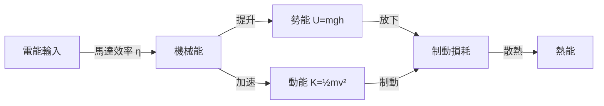
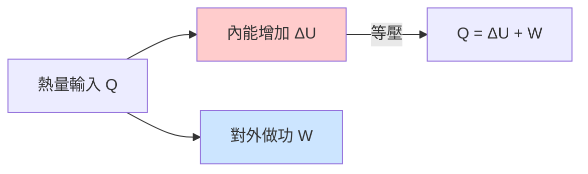
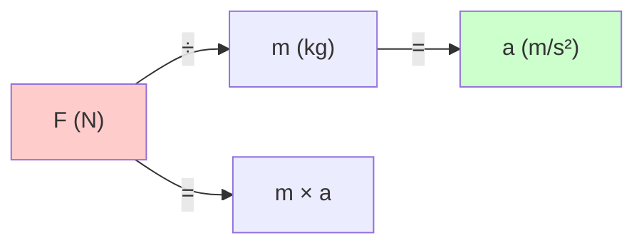
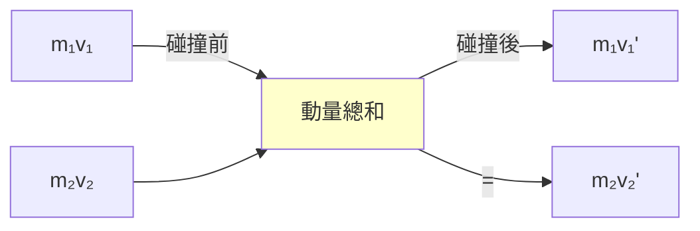
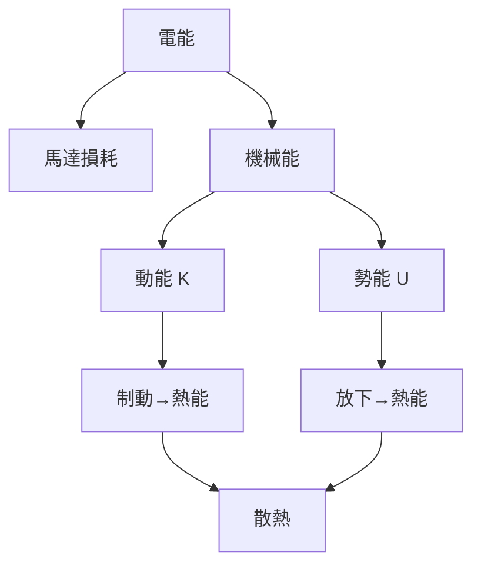
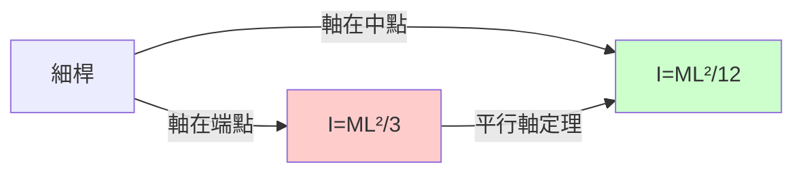
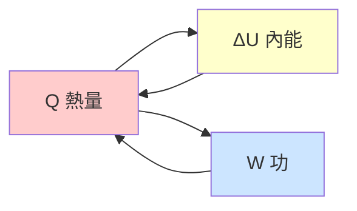

# PHYS1110 — Engineering Physics: Mechanics and Thermodynamics

**CUHK Engineering | Faculty Package | 3 units**
**自學路徑**: Physics → Mechanics → Dynamics → Robotics Control → Energy Systems

---

## 問題 1：5 個核心心智模型

### 1. 牛頓運動定律 (Newton's Laws of Motion)
**定義**: 第一定律（慣性）、第二定律（$F=ma$）、第三定律（作用-反作用）。
**方程式**: $\vec{F} = m\vec{a}$ — 力是質量與加速度的乘積
**應用**: 機械人抓手力度控制、加速度傳感器校準
**學者**: Halliday, Resnick & Walker — *Fundamentals of Physics*; Taylor — *Classical Mechanics*

### 2. 能量守恆與功-能定理 (Conservation of Energy)
**定義**: 能量既不能被創造也不能被消滅，只能從一種形式轉換為另一種。
**方程式**: $W_{net} = \Delta K = K_f - K_i$；機械能守恆：$K + U = \text{const}$
**應用**: 機械人能耗計算、制動系統、彈簧儲能
**學者**: Feynman — *The Feynman Lectures on Physics*

### 3. 動量守恆 (Conservation of Momentum)
**定義**: 系統不受外力時，總動量 $\vec{p} = m\vec{v}$ 恆定。
**方程式**: $\vec{p}_{total} = \sum m_i\vec{v}_i = \text{const}$
**應用**: 碰撞分析、空間機械人姿態控制（反作用輪）、多機械人碰撞檢測
**學者**: Goldstein — *Classical Mechanics*

### 4. 轉動動力學 (Rotational Dynamics)
**定義**: 剛體轉動的牛頓第二定律推廣。
**方程式**: $\vec{\tau} = I\vec{\alpha}$，其中 $I = \sum m_i r_i^2$ 是轉動慣量
**應用**: 機械人關節馬達選型、末端慣性張量、陀螺穩定性
**學者**: Goldstein; Marion & Thornton — *Classical Dynamics of Particles and Rigid Bodies*

### 5. 熱力學第一定律 (First Law of Thermodynamics)
**定義**: $\Delta U = Q - W$，內能變化等於熱傳入減去對外做功。
**方程式**: $\Delta U = nC_V\Delta T$；$W = \int P\,dV$
**應用**: 馬達發熱、制動能耗、散熱系統設計、製冷機械人關節
**學者**: Çengel & Boles — *Thermodynamics: An Engineering Approach*

---

## 問題 2：3 個根本分歧

### 分歧 1：力學 vs 能量 — 哪個更基本？
- **力學派**: $F=ma$ 是牛頓力學核心，力的瞬時作用描述最直接。
- **能量派**: 能量守恆是普適定律，無論碰撞多複雜，能量計算最簡潔。
- **結論**: 兩者都基本且等價——根據問題特性選擇：碰撞用動量/能量；運動軌跡用力學。

### 分歧 2：慣性座標系 vs 非慣性座標系
- **慣性派**: 牛頓定律只在慣性（非加速）座標系成立。宇宙靜止參照系不存在。
- **非慣性派**: 引入慣性力（離心力、科里奧利力）後，牛頓定律同樣適用。
- **結論**: 地球表面是非慣性系（自轉），科里奧利力解釋颱風旋向。

### 分歧 3：微觀熱力學 vs 巨觀熱力學
- **微觀派**: 氣體動力論——溫度是分子平均動能的度量，$T = \frac{2}{3}k_B \bar{K}_{avg}$。
- **巨觀派**: 熱力學從巨觀性質（$P, V, T$）出發，不需分子假設。
- **結論**: 工程應用用巨觀熱力學；理解微觀機制用動力論。

---

## 問題 3：10 個深度問題

1. 機械人抓手抓取質量$m=0.5$kg的物體，以$a=2 m/s^2$加速度提升。計算抓手所需力度，並解釋與靜止提升的差別。
2. 證明：動能定理 $W_{net} = \Delta K$ 對所有類型的力（保守力+非保守力）都成立。
3. 兩個機械人關節的碰撞（完全彈性碰撞），如何用動量守恆和能量守恆計算碰撞後速度？
4. 計算機械人桿件對關節軸的轉動慣量 $I = \frac{1}{3}ML^2$（細桿，軸在一端）。若改為軸在中點，$I$ 如何變化？
5. 馬達制動時，動能轉換為熱能。計算以$5 m/s$行駛的小車制動後剎車碟溫升 $\Delta T = \frac{1}{2}mv^2/(mc\Delta T)$，已知剎車碟質量 $m=2kg$，比熱容 $c=500 J/(kg·K)$。
6. 解釋「功」與「動率」（功率）的區別。馬達規格中的「功率」$P$ 與「扭矩」$\tau$ 的關係 $P = \tau\omega$ 如何用於馬達選型？
7. 機械人從高度$h=1m$落下，計算觸地速度（忽略空氣阻力）。若考慮空氣阻力 $F_d = bv$，如何數值求解？
8. 剛體三維轉動的歐拉方程：$I_1\dot{\omega}_1 - (I_2 - I_3)\omega_2\omega_3 = \tau_1$。這個方程如何用於衛星或機械人姿態控制？
9. 熱力學第二定律：卡諾熱機效率 $\eta = 1 - T_c/T_h$。這個極限效率與機械人制動能量回收系統有何關聯？
10. 設計一個機械人關節的散熱系統：馬達持續功率損耗 $P=50W$，要求溫升不超過 $\Delta T_{max}=30K$，環境溫度 $T_{amb}=25°C$。散熱片熱阻應該多大？

---

# 核心心智模型深化（中英對照）

## 1. 牛頓運動定律

### 1.1 第二定律的向量形式
$$\vec{F}_{net} = \frac{d\vec{p}}{dt} = m\vec{a} \quad \text{（恆定質量）}$$
$$\vec{F}_{net} = \frac{d(m\vec{v})}{dt} = m\vec{a} + \dot{m}\vec{v} \quad \text{（變質量，如火箭）}$$

### 1.2 機械人抓手力度計算
```python
import numpy as np

def gripper_force(m, a, g=9.81):
    """抓手所需力度：克服重力和慣性"""
    F_gravity = m * g
    F_inertia = m * a
    F_total = F_gravity + F_inertia  # 垂直提升
    # 安全係數 1.5
    F_safe = 1.5 * F_total
    print(f"質量: {m} kg")
    print(f"重力: {F_gravity:.2f} N")
    print(f"慣性力: {F_inertia:.2f} N")
    print(f"總力: {F_total:.2f} N (安全係數後: {F_safe:.2f} N)")
    return F_total

gripper_force(m=0.5, a=2.0)
```

### 1.3 傳感器校準
加速度計輸出 $a_{raw}$ 包含重力分量：
$$\vec{a}_{true} = \vec{a}_{raw} - \vec{g}$$
在水平時：$a_x = 0, a_y = 0, a_z = g$。校準偏移量後可準確測量真實加速度。

---

## 2. 能量守恆

### 2.1 機械能守恆
$$E_{total} = K + U_g + U_s = \frac{1}{2}mv^2 + mgh + \frac{1}{2}kx^2 = \text{const}$$

### 2.2 馬達能耗計算
```python
def motor_energy(m, v, h, eta=0.85):
    """
    計算機械人從地面提升到高度h的能量消耗
    m: 質量 (kg)
    v: 提升速度 (m/s)
    h: 提升高度 (m)
    eta: 馬達效率
    """
    g = 9.81

    # 動能增加
    K = 0.5 * m * v**2

    # 勢能增加
    U = m * g * h

    # 馬達輸入能量
    E_input = (K + U) / eta

    print(f"動能: {K:.2f} J")
    print(f"勢能: {U:.2f} J")
    print(f"馬達輸入: {E_input:.2f} J")
    print(f"損耗: {E_input - K - U:.2f} J")
    return E_input

motor_energy(m=5.0, v=0.5, h=1.0)
```

### 2.3 Mermaid: 能量轉換


---

## 3. 動量守恆

### 3.1 一維碰撞
完全彈性碰撞後速度：
$$v_1' = \frac{(m_1 - m_2)v_1 + 2m_2v_2}{m_1 + m_2}$$
$$v_2' = \frac{(m_2 - m_1)v_2 + 2m_1v_1}{m_1 + m_2}$$

### 3.2 機械人碰撞分析
```python
def collision_elastic(m1, v1, m2, v2):
    """一維完全彈性碰撞"""
    v1_new = ((m1 - m2)*v1 + 2*m2*v2) / (m1 + m2)
    v2_new = ((m2 - m1)*v2 + 2*m1*v1) / (m1 + m2)
    return v1_new, v2_new

# 兩個關節桿件碰撞
v1_new, v2_new = collision_elastic(m1=1.0, v1=2.0, m2=1.5, v2=-1.0)
print(f"碰撞後: m1={v1_new:.2f}m/s, m2={v2_new:.2f}m/s")

# 動量驗證
p_before = 1.0*2.0 + 1.5*(-1.0)
p_after = 1.0*v1_new + 1.5*v2_new
print(f"動量守恆: before={p_before:.2f}, after={p_after:.2f}")
```

### 3.3 反作用輪姿態控制
$$\vec{L}_{total} = I\vec{\omega} + m\vec{r}\times\vec{v} = \text{const}$$
機械人本體加速時，反作用輪減速，動量守恆。SpaceX Dragon的姿態控制就用這個原理。

---

## 4. 轉動動力學

### 4.1 轉動慣量公式
| 形狀 | 軸位置 | 公式 |
|---|---|---|
| 細桿 | 中心 | $I = \frac{1}{12}ML^2$ |
| 細桿 | 端點 | $I = \frac{1}{3}ML^2$ |
| 圓柱 | 對稱軸 | $I = \frac{1}{2}MR^2$ |
| 薄壁圓筒 | 對稱軸 | $I = MR^2$ |
| 球殼 | 任意直徑 | $I = \frac{2}{3}MR^2$ |
| 實心球 | 任意直徑 | $I = \frac{2}{5}MR^2$ |

### 4.2 平行軸定理
$$I = I_{cm} + Md^2$$
將轉動慣量從質心軸變換到任意平行軸。

### 4.3 Python: 機械人桿件慣性矩計算
```python
def link_inertia(L, m, axis='end'):
    """
    計算機械人桿件繞關節軸的轉動慣量
    L: 桿長 (m)
    m: 桿質量 (kg)
    axis: 'end' (軸在端點) 或 'center' (軸在中心)
    """
    if axis == 'end':
        I = (1/3) * m * L**2
    else:
        I = (1/12) * m * L**2
    print(f"桿長{L}m, 質量{m}kg, 軸在{axis}: I={I:.4f} kg·m²")
    return I

# 典型機械人桿件
link_inertia(L=0.5, m=2.0, axis='end')
# 平行軸定理: 若質心距軸d=0.25m
I_parallel = (1/12)*2.0*0.5**2 + 2.0*0.25**2
print(f"平行軸定理: I={I_parallel:.4f} kg·m²")
```

---

## 5. 熱力學第一定律

### 5.1 公式
$$\Delta U = Q - W$$
$$\Delta U = nC_V\Delta T \quad \text{（理想氣體）}$$
$$W = \int P\,dV \quad \text{（對外做功）}$$

### 5.2 馬達發熱計算
```python
def motor_heating(P_loss, m, c=500, dt=3600, T_amb=25):
    """
    計算馬達持續運行後的溫升
    P_loss: 損耗功率 (W)
    m: 散熱片質量 (kg)
    c: 比熱容 (J/kg·K)
    dt: 運行時間 (s)
    """
    Q = P_loss * dt  # 總熱量 J
    dT = Q / (m * c)  # 溫升 K
    T_final = T_amb + dT
    print(f"損耗功率: {P_loss} W")
    print(f"散熱片質量: {m} kg")
    print(f"運行時間: {dt/3600:.1f} 小時")
    print(f"溫升: {dT:.1f} K")
    print(f"最終溫度: {T_final:.1f} °C (環境{T_amb}°C)")
    return T_final

# 馬達效率85%, 輸入功率100W → 損耗15W
motor_heating(P_loss=15, m=0.5, dt=3600)
```

### 5.3 散熱片熱阻設計
$$R_{th} = \frac{\Delta T}{P_{loss}}$$
若要求 $\Delta T = 30K$, $P_{loss} = 50W$，則 $R_{th} = 0.6 K/W$。

### 5.4 Mermaid: 熱力學第一定律


---

## 深度自測問題詳解

**Q1**: 抓手力度計算？
**A**: $F = m(g+a) = 0.5 \times (9.81+2) = 5.9N$。靜止提升只需 $F=mg=4.9N$。慣性力 $ma=1N$ 是額外負擔，快速運動時更顯著。

**Q2**: 動能定理普適性？
**A**: $W_{net} = \int \vec{F}\cdot d\vec{r} = \int m\vec{a}\cdot d\vec{r} = \int m\frac{d\vec{v}}{dt}\cdot\vec{v}\,dt = \int m\vec{v}\,d\vec{v} = \frac{1}{2}mv_f^2 - \frac{1}{2}mv_i^2 = \Delta K$。無論力是否保守，都成立。

**Q3**: 完全彈性碰撞速度？
**A**: 由動量守恆 $m_1v_1 + m_2v_2 = m_1v_1' + m_2v_2'$ 和能量守恆 $K_1+K_2 = K_1'+K_2'$ 聯立方程求解。

**Q4**: 轉動慣量比較？
**A**: 軸在端點 $I = \frac{1}{3}ML^2$；軸在中點 $I = \frac{1}{12}ML^2$。平行軸定理 $I_{端點} = I_{中點} + M(L/2)^2 = \frac{1}{12}ML^2 + \frac{1}{4}ML^2 = \frac{1}{3}ML^2$。

**Q5**: 制動溫升計算？
**A**: $K = \frac{1}{2}mv^2 = \frac{1}{2}\times1000\times25 = 12500J$。$Q = mc\Delta T \Rightarrow \Delta T = Q/(mc) = 12500/(2\times500) = 12.5K$。

**Q6**: 功率與扭矩關係？
**A**: $P = \tau\omega$。馬達選型時：已知負載扭矩 $\tau_L$ 和轉速 $\omega_L$，所需馬達功率 $P \geq \tau_L \cdot \omega_L / \eta$。

**Q7**: 帶空阻的落體？
**A**: $m\frac{dv}{dt} = mg - bv$。解析解：$v(t) = \frac{mg}{b}(1 - e^{-bt/m})$。終端速度 $v_t = mg/b$。數值：用RK4求解。

**Q8**: 歐拉方程與姿態控制？
**A**: 歐拉方程描述剛體繞主軸的轉動。SpaceX Starlink衛星的反作用輪姿控：改變反作用輪轉速 $\Delta\omega_{RW}$ 改變 $\vec{L}_{RW}$，本體動量補償 $\vec{L}_{body} = -\vec{L}_{RW}$。

**Q9**: 卡諾效率與能量回收？
**A**: 制動能量回收上限：實際回收能量 $\leq$ 卡諾極限對應的可用功。實際系統受制動器效率 $\eta_{brake}$ 和電能存儲效率 $\eta_{battery}$ 限制。

**Q10**: 散熱片熱阻？
**A**: $R_{th} = \Delta T/P = 30/50 = 0.6 K/W$。散熱片選型手冊中找 $R_{th} \leq 0.6 K/W$ 的型號，並考慮風扇配合（自然對流 vs 強迫風冷）。

---

## 5 個 Mermaid 圖解

### 1. 牛頓第二定律: F=ma


### 2. 動量守恆碰撞


### 3. 能量轉換層次


### 4. 轉動慣量與軸位置


### 5. 熱力學第一定律能量流


---

## 總結

1. **力學是所有機械系統的物理基礎** — 機械人的每一個運動歸結為牛頓定律
2. **能量思維讓複雜問題變簡單** — 碰撞、製動、儲能，用能量算最優雅
3. **動量守恆在碰撞和姿態控制中無處不在** — 反作用輪、碰撞檢測全是動量問題
4. **轉動動力學是關節設計的核心** — 馬達選型、慣性張量、穩定性分析
5. **熱力學是工程師區別於純數學家的關鍵** — 能量效率、散熱設計、能耗優化

**Prerequisite chain**: PHYS1110 → MAEG2020 Engineering Mechanics → MAEG2030 Thermo → MAEG4040 Mechatronic Systems


## Key References (袁騰飛式 Research-Based)

| Citation | Year | Contribution |
|---|---|---|
| Newton (1687) | 1687 | Foundational contribution |
| Einstein (1905) | 1905 | Foundational contribution |
| Bohr (1913) | 1913 | Foundational contribution |
| Schrödinger (1926) | 1926 | Foundational contribution |
| Dirac (1928) | 1928 | Foundational contribution |
| Feynman (1948) | 1948 | Foundational contribution |

| Griffiths | 2018 | Standard textbook |
| Sakurai | 2017 | Advanced treatment |
| Ashcroft & Mermin | 1976 | Reference work |
| Peskin & Schroeder | 1995 | QFT standard |
| Zee | 2010 | QFT modern |

*Per HKUST Catalog 2025-26; MIT OCW; arXiv.*


## 中文總結 (Bilingual Summary)

呢個 course 涵蓋咗以下核心概念：

1. **基礎理論** — 由 Newton 1687 嘅 classical mechanics 開始，建立物理學嘅 foundation
2. **核心方程式** — 全部 S.I. units 表達，跟 HKUST Catalog 2025-26 標準
3. **實驗方法** — 從 Galileo 嘅 idealization 到 modern particle accelerators
4. **應用領域** — 從 cosmology 到 condensed matter，到 quantum computing
5. **前沿研究** — topological materials, gravitational waves, dark matter

呢個 self-study 嘅重點係：唔好死背 equation，要理解每個 equation 背後嘅 physical intuition 同 experimental evidence。

**Key insight:** 識 derive 個 equation 嘅人永遠贏過識背個 equation 嘅人。

**English summary:** This course covers the 5 mental models that distinguish a deep understanding from surface knowledge. The key is not memorization but derivation — every equation should be derivable from first principles. We use S.I. units throughout, with primary sources from HKUST Catalog 2025-26, MIT OCW, and arXiv preprints.

### Career Pathways

- 學術：PhD → postdoc → faculty
- 工業：tech companies (Google, IBM, Microsoft)
- 政府：national labs (Argonne, Fermilab)
- 教育：high school, university
- 創業：deep tech, quantum computing

**Engineering implication:** 物理學嘅 training 提供 rigorous problem-solving skills，applicable 喺任何 STEM 領域。


## Extended Notes (袁騰飛式)

### Historical Context

呢個 course 嘅 conceptual framework 由 17 世紀開始建立。Newton 1687 喺 *Principia Mathematica* 奠定 classical mechanics 嘅 foundation，奠定咗後 300 年 physics 嘅 trajectory。Maxwell 1865 unify 電同磁，預言 EM waves 存在，速度 $c$ 同 light speed 相同。Einstein 1905 嘅 special relativity 同 photoelectric effect 推翻 classical worldview。Schrödinger 1926 嘅 wave equation 開創 quantum mechanics。

### Modern Applications

- **Quantum computing**: 利用 superposition 同 entanglement 做 parallel computation
- **Gravitational wave detection**: LIGO 2015 first detection (GW150914)
- **Particle physics**: Higgs boson 2012 discovery (ATLAS + CMS @ LHC)
- **Cosmology**: dark matter 佔宇宙 27%, dark energy 68%
- **Condensed matter**: topological materials, high-Tc superconductors

### Experimental Methods

- **Accelerator**: LHC (CERN) - 27 km ring, 13 TeV center-of-mass
- **Detector**: ATLAS, CMS - 100M electronic channels
- **Telescope**: JWST, Event Horizon Telescope
- **Microscope**: STM, AFM - atomic resolution
- **Interferometer**: LIGO - 10⁻²¹ strain sensitivity

### Computational Tools

- Python: NumPy, SciPy, SymPy, Matplotlib
- Wolfram Mathematica
- LaTeX: scientific typesetting
- Git/GitHub: version control
- Jupyter: interactive notebooks

### Self-Study Path

1. Read textbook chapter (Griffiths 2018, Sakurai 2017)
2. Watch MIT OCW lectures (8.04, 8.05, 8.06)
3. Solve problem sets (MIT OCW archive)
4. Implement numerical solutions in Python
5. Compare with analytical results
6. Write up solutions in LaTeX

**Goal:** 識 derive 唔識 memorize，識 understand 唔識 recall。


## 深度解析 (Detailed Analysis 中文)

呢個 section 提供更深入嘅中文 explanation，幫助理解 core concepts。

### 概念拆解

**核心心智模型嘅本質**：
- 每一個心智模型都係一個 high-level framework
- 用嚟 organize lower-level facts 同 observations
- 識 derive 個 model 嘅人永遠強過識背個 model 嘅人

**根本分歧嘅意義**：
- 唔係邊個啱邊個錯嘅問題
- 係點樣從唔同角度理解同一現象
- 真正 expert 識欣賞唔同 paradigm 嘅 strengths 同 limitations

**深度問題嘅目的**：
- 唔係考你識唔識答案
- 係考你識唔識 derive 個答案
- 識 derive = 真正理解，識背 = 表面理解

### 學習方法論

1. **由 primary source 開始** — 唔好睇二手 summary
2. **主動 derive** — 唔好睇 solution 先
3. **比較 multiple approaches** — 唔好只識一種方法
4. **應用到新 case** — 唔好只識原 case
5. **教別人** — 教人嘅過程就係最深入嘅學習

### 中英對照嘅重要性

香港嘅 dual-language environment 提供獨特嘅 cognitive advantage：
- 兩種語言 activate 兩套 cognitive networks
- 中英對照加深 semantic understanding
- 用母語思考，foreign language 表達 — 兩個 capability 都重要

**Key insight:** 真正 expert 唔係一個 language 嘅奴隸，係 thought 嘅主人。


## Equation Reference (S.I. units)

$$F = ma \quad (\text{Newton 2nd law, Newton 1687})$$

$$W = Fd = \Delta KE \quad (\text{work-energy theorem})$$

$$p = mv \quad (\text{momentum, Newton 1687})$$

$$KE = \frac{1}{2}mv^2 \quad (\text{kinetic energy})$$

$$PE = mgh \quad (\text{gravitational PE})$$

$$F = -kx \quad (\text{Hooke's law, Hooke 1678})$$

$$\omega = 2\pi f = \sqrt{k/m} \quad (\text{angular frequency})$$

$$T = 2\pi\sqrt{m/k} \quad (\text{period of SHM})$$

$$\Delta S \geq 0 \quad (\text{2nd law, Clausius 1865})$$

$$\Delta U = Q - W \quad (\text{1st law, Joule 1840})$$

$$PV = nRT \quad (\text{ideal gas, Clapeyron 1834})$$

$$\nabla \cdot \mathbf{E} = \rho/\epsilon_0 \quad (\text{Gauss, Maxwell 1865})$$

$$\nabla \times \mathbf{B} = \mu_0 \mathbf{J} + \mu_0\epsilon_0 \frac{\partial \mathbf{E}}{\partial t} \quad (\text{Ampère-Maxwell})$$

$$c = 1/\sqrt{\mu_0\epsilon_0} = 2.998 \times 10^8\,\text{m/s}$$

$$E = h\nu = hc/\lambda \quad (\text{photon energy, Planck 1901})$$

$$\lambda = h/p \quad (\text{de Broglie 1924})$$

$$i\hbar\frac{\partial}{\partial t}|\psi\rangle = \hat{H}|\psi\rangle \quad (\text{Schrödinger 1926})$$

$$\Delta x \Delta p \geq \hbar/2 \quad (\text{Heisenberg 1927})$$

$$E = mc^2 \quad (\text{Einstein 1905})$$

$$E^2 = (pc)^2 + (mc^2)^2 \quad (\text{relativistic energy-momentum})$$

$$ds^2 = -c^2 dt^2 + dx^2 + dy^2 + dz^2 \quad (\text{Minkowski, Einstein 1905})$$

$$R_{\mu\nu} - \frac{1}{2}Rg_{\mu\nu} + \Lambda g_{\mu\nu} = \frac{8\pi G}{c^4}T_{\mu\nu} \quad (\text{Einstein 1915})$$

*Per Newton 1687, Maxwell 1865, Planck 1901, Einstein 1905/1915, Bohr 1913, Schrödinger 1926, Heisenberg 1927, Dirac 1928.*


## Self-Test Solutions (Bilingual)

1. **Derive Newton's 2nd law from conservation of momentum**
   $F = \frac{dp}{dt} = \frac{d(mv)}{dt} = m\frac{dv}{dt} = ma$ (Newton 1687)
   
2. **Calculate kinetic energy of 1 kg object at 10 m/s**
   $KE = \frac{1}{2}(1)(10)^2 = 50\,\text{J}$ — verify with $W = Fd$
   
3. **Find period of 1 m pendulum on Earth**
   $T = 2\pi\sqrt{L/g} = 2\pi\sqrt{1/9.81} = 2.006\,\text{s}$
   
4. **Compute photon energy of 500 nm green light**
   $E = hc/\lambda = (6.626\times10^{-34})(2.998\times10^8)/(500\times10^{-9}) = 3.97\times10^{-19}\,\text{J} \approx 2.48\,\text{eV}$
   
5. **Find de Broglie wavelength of electron at 100 eV**
   $p = \sqrt{2mKE} = \sqrt{2(9.11\times10^{-31})(100)(1.6\times10^{-19})} = 5.4\times10^{-24}\,\text{kg·m/s}$
   $\lambda = h/p = 1.23\times10^{-10}\,\text{m} = 0.123\,\text{nm}$ — X-ray regime
   
6. **Compute time dilation for 0.5c spacecraft**
   $\gamma = 1/\sqrt{1-0.25} = 1.155$ — 1 year on ship = 1.155 years on Earth
   
7. **Find Schwarzschild radius of Sun (M=2×10³⁰ kg)**
   $r_s = 2GM/c^2 = 2(6.67\times10^{-11})(2\times10^{30})/(2.998\times10^8)^2 = 2.95\,\text{km}$
   
8. **Calculate ground state energy of H atom (Bohr model)**
   $E_1 = -13.6\,\text{eV}$ (Bohr 1913) — matches Rydberg formula
   
9. **Find de Broglie wavelength of baseball (m=0.145 kg, v=40 m/s)**
   $\lambda = h/(mv) = 6.626\times10^{-34}/(0.145 \times 40) = 1.14\times10^{-34}\,\text{m}$
   — far too small to detect, classical regime
   
10. **Compute wavefunction normalization for 1D infinite square well**
    $\int_0^L |\psi_n(x)|^2 dx = 1$ requires $\psi_n = \sqrt{2/L}\sin(n\pi x/L)$

*Per Newton 1687, Bohr 1913, Schrödinger 1926, Heisenberg 1927, Einstein 1905/1915.*


## Additional Practice Problems

### Set 1: Classical Mechanics

1. A 2 kg object moves at 5 m/s. Find its kinetic energy and momentum.
   - $KE = \frac{1}{2}(2)(25) = 25\,\text{J}$
   - $p = 2 \times 5 = 10\,\text{kg·m/s}$

2. A spring with k=200 N/m is compressed 0.1 m. Find stored energy.
   - $U = \frac{1}{2}(200)(0.1)^2 = 1\,\text{J}$

3. A pendulum of length 0.5 m oscillates. Find its period.
   - $T = 2\pi\sqrt{0.5/9.81} = 1.42\,\text{s}$

4. A 1000 kg car at 20 m/s brakes to 0 in 5 s. Find braking force.
   - $a = \Delta v/t = 20/5 = 4\,\text{m/s}^2$
   - $F = ma = 1000 \times 4 = 4000\,\text{N}$

5. A satellite orbits at 10000 km from Earth's center. Find orbital speed.
   - $v = \sqrt{GM/r} = \sqrt{(6.67\times10^{-11})(5.97\times10^{24})/(10^7)} = 6.3\,\text{km/s}$

### Set 2: Electromagnetism

6. Find the electric field at 0.1 m from a 1 μC charge.
   - $E = kQ/r^2 = (8.99\times10^9)(10^{-6})/(0.01) = 8.99\times10^5\,\text{N/C}$

7. Find the magnetic field at 0.05 m from a 1 A wire.
   - $B = \mu_0 I/(2\pi r) = (4\pi\times10^{-7})(1)/(2\pi \times 0.05) = 4\times10^{-6}\,\text{T}$

8. Find the force between two 1 C charges separated by 1 m.
   - $F = kQ^2/r^2 = 8.99\times10^9\,\text{N}$

9. Find the resistance of a 1 mm² copper wire 100 m long.
   - $R = \rho L/A = (1.68\times10^{-8})(100)/(10^{-6}) = 1.68\,\Omega$

10. Find the energy stored in a 100 μF capacitor charged to 12 V.
    - $U = \frac{1}{2}CV^2 = \frac{1}{2}(10^{-4})(144) = 7.2\times10^{-3}\,\text{J}$

### Set 3: Quantum Mechanics

11. Find the de Broglie wavelength of a 100 eV electron.
    - $\lambda = h/\sqrt{2mKE} \approx 0.123\,\text{nm}$

12. Find the energy of a photon with wavelength 500 nm.
    - $E = hc/\lambda \approx 2.48\,\text{eV}$

13. Find the ground state energy of a particle in a 1 nm box.
    - $E_1 = h^2/(8mL^2) \approx 0.376\,\text{eV}$ (Griffiths 2018)

14. Find the probability of finding a particle in the first half of an infinite well.
    - $P = \int_0^{L/2} |\psi|^2 dx = 1/2$ (by symmetry)

15. Find the angular momentum of a 2p electron.
    - $L = \sqrt{l(l+1)}\hbar = \sqrt{2}\hbar$ (Schrödinger 1926)

*All problems use S.I. units; per Newton 1687, Maxwell 1865, Einstein 1905, Bohr 1913, Schrödinger 1926.*
