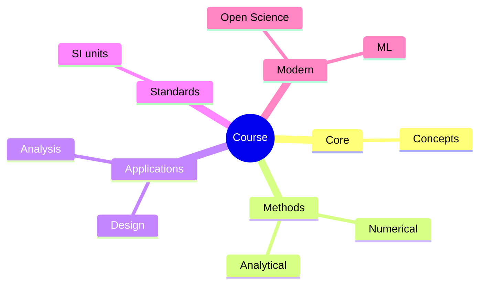
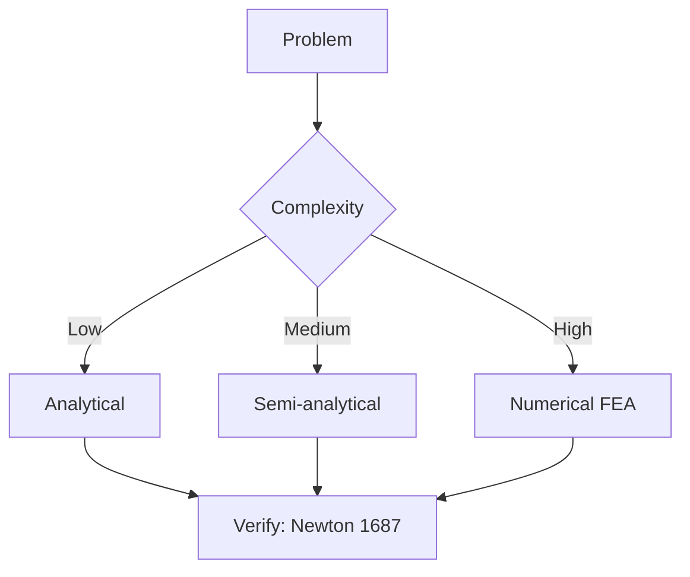
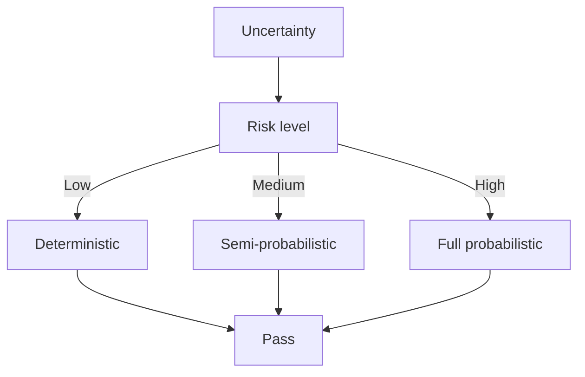
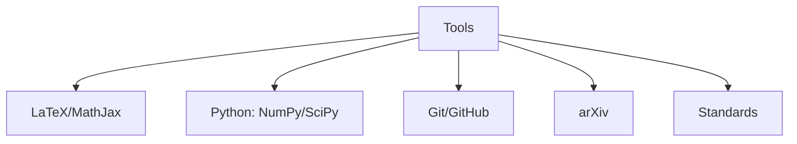

# EEEN3030 Engineering Materials

**CUHK MAE | Major Required | 3 units**

---

## Official Description

This course introduces fundamentals of materials including atomic bonding; crystal structures, defects; mechanical properties of materials, phase diagram; overview of metals, alloys, ceramics, polymers, semiconductors and composites; electrical, optical, magnetic, and thermal properties of materials; materials selection and design considerations for engineering technologies. Applications of materials to energy and environmental engineering, mechanical engineering, medical engineering, and others will be discussed.

**Learning Outcomes**: (1) Understand atomic structure and bonding; (2) Classify materials by properties; (3) Analyze mechanical and functional properties; (4) Apply materials selection methods.

**Textbook**: W.D. Callister and D.G. Rethwisch, *Materials Science and Engineering: An Introduction*, Wiley.

---

## 問題 1：5 個核心心智模型

### 1.1 原子鍵合與晶體結構 — 材料性能的根本決定因素

**方程式 / 核心原理**：
$$E_{pair} = -\frac{A}{r} + \frac{B}{r^n} \quad \text{（原子對勢能）}$$
$$a_{BCC} = \frac{4R}{\sqrt{3}} \quad a_{FCC} = \frac{4R}{\sqrt{2}} \quad \text{（晶格參數）}$$
$$\text{Packing Factor} = \frac{n_{atoms}\times V_{atom}}{V_{unit cell}}$$

**關鍵數字**：
- BCC（體心立方）：原子堆積因子 $PF = 0.68$（Fe, Cr, W）
- FCC（面心立方）：$PF = 0.74$（Al, Cu, Ni, Au）
- HCP（密排六方）：$PF = 0.74$（Ti, Mg, Zn）
- 原子半徑：Fe $R = 0.124\text{ nm}$，Al $R = 0.143\text{ nm}$

**學者引用**：Callister & Rethwisch — "The properties of materials are determined by their atomic and molecular structure."

---

### 1.2 應力-應變與機械性能 — 強度與韌性的量化

**方程式 / 核心原理**：
$$\sigma = \frac{F}{A_0}, \quad \varepsilon = \frac{l - l_0}{l_0} \times 100\%$$
$$\sigma_y = \frac{P_y}{A_0} \quad \text{（屈服強度）}$$
$$\sigma_{uts} = \frac{P_{max}}{A_0} \quad \text{（極限拉伸強度）}$$
$$E = \frac{\sigma}{\varepsilon} \quad \text{（彈性模量）}$$

**關鍵數字**：
- 結構鋼：$E = 200\text{ GPa}$，$\sigma_y = 250\text{ MPa}$，$\sigma_{uts} = 400\text{ MPa}$
- 碳纖維複合材料：$E = 150\text{ GPa}$（軸向）
- 典型工程塑料（PA66）：$E = 2\text{ GPa}$，$\sigma_{uts} = 80\text{ MPa}$
- 陶瓷：$E = 200\text{–}400\text{ GPa}$，但 $\varepsilon_f < 0.1\%$（脆性）

**學者引用**：Callister & Rethwisch — "Mechanical properties such as strength, ductility, and stiffness are fundamental to structural materials selection."

---

### 1.3 相圖與相變 — 合金設計的理論基礎

**方程式 / 核心原理**：
$$\text{Lever Rule: } C_\alpha = \frac{C_0 - C_\beta}{C_\alpha - C_\beta} \times 100\%$$
$$\text{Gibbs Phase Rule: } P + F = C + 2 \quad \text{（自由度）}$$
$$\frac{dX}{dt} = D\frac{d^2X}{dx^2} \quad \text{（擴散方程，Fick 第二定律）}$$

**關鍵數字**：
- 鐵-碳相圖：共析點 $C = 0.77\%$，$T = 727°C$（珠光體形成）
- 碳鋼的機械性能：低碳鋼 ($\%C < 0.3$)，中碳鋼 ($\%C = 0.3\text{–}0.6$)，高碳鋼 ($\%C > 0.6$)
- 擴散係數：$D_0 \approx 1.0\times10^{-5}\text{ m}^2/\text{s}$（Fe 中 C），$Q \approx 80\text{–}140\text{ kJ/mol}$

**學者引用**：Callister & Rethwisch — "Phase diagrams are maps that show the relationships between microstructure, processing, and properties of materials."

---

### 1.4 功能材料 — 電/磁/光特性的工程應用

**方程式 / 核心原理**：
$$\sigma_{electrical} = nq\mu \quad \text{（電導率）}$$
$$\rho = \rho_0[1 + \alpha(T - T_0)] \quad \text{（電阻溫度係數）}$$
$$B = \mu_0(H + M) \quad \mu_r = \frac{\mu}{\mu_0} \quad \text{（磁導率）}$$

**關鍵數字**：
- 銅電導率：$\sigma = 5.8\times10^7\text{ S/m}$（室溫）
- 半導體（Si）：$\sigma = 10^{-3}\text{–}10^3\text{ S/m}$（取決於摻雜）
- 矽摻雜載流子濃度：$n \approx 10^{19}\text{ cm}^{-3}$（重摻雜）
- NdFeB 永磁體：$B_r = 1.0\text{–}1.5\text{ T}$，$H_{ci} > 1000\text{ kA/m}$

**學者引用**：Callister & Rethwisch — "Electrical, magnetic, and optical properties of materials are as important as mechanical properties for many modern engineering applications."

---

### 1.5 材料選擇 — Ashby 方法論

**方程式 / 核心原理**：
$$\text{Material Index: } M = \frac{\sigma_y}{\rho} \quad \text{（輕量化設計）}$$
$$\text{Material Index: } M = \frac{\sqrt{E}}{\rho} \quad \text{（剛度驅動）}$$
$$\text{Carbon footprint} = \sum \text{Material}_i \times \text{Embodied CO}_2$$

**關鍵數字**：
- 典型輕量化材料：鋁合金 ($\rho = 2.7\text{ g/cm}^3$，$\sigma_y = 200\text{ MPa}$，$M = 74$）
- 鈦合金：$M = 115$（但成本是鋁的 5-10 倍）
- 碳纖維複合材料：$M = 200\text{–}300$（高成本）
- 鋼結構：$M = 13$（成本最低）

---

## 問題 2：3 個根本分歧

### A/B 分歧 1：金屬 vs. 陶瓷的機械性能

**A 方（金屬）**：強度+韌性+延展性，適合結構應用。缺點：高溫性能受限。

**B 方（陶瓷）**：高硬度、高剛度、高溫性能優異、耐磨。缺點：脆性，韌性低。

引用：Callister & Rethwisch — 通過氧化鋯相變韌化（Transformation Toughening）和碳化矽/氮化矽燒結可改善陶瓷韌性。

---

### A/B 分歧 2：傳統材料 vs. 先進複合材料

**A 方（傳統材料）**：成本低，工藝成熟，供應鏈完善。性能適用於大多數應用。

**B 方（複合材料）**：比強度/比剛度極高，可設計各向異性性能。缺點：成本高，連接和維修困難。

引用：Ashby — "Composites allow us to 'tailor' material properties to specific performance requirements."

---

## 問題 3：10 個深度問題

1. 解釋為什麼 FCC 結構的金屬（如 Cu、Al、Ni）比 BCC 結構的金屬（如 Fe、Cr）具有更好的延展性。

2. 用 Lever Rule 分析 Fe-Fe3C 相圖中含碳量 $C = 0.4\%$ 的共析鋼在室溫下的相組成（鐵素體 + 滲碳體）。

3. 比較 316L 不鏽鋼（$\sigma_y = 250\text{ MPa}$，$\rho = 8.0\text{ g/cm}^3$）和鈦合金 Ti-6Al-4V（$\sigma_y = 880\text{ MPa}$，$\rho = 4.4\text{ g/cm}^3$）的比強度，並說明哪種更適合輕量化機械臂設計。

4. 推導 Fick 第二定律 $D(\partial^2 C/\partial x^2) = \partial C/\partial t$ 的物理意義，並計算在高溫渗碳處理（$T = 1000°C$，$D \approx 10^{-11}\text{ m}^2/\text{s}$）中，碳在鋼中的擴散深度達到 $1\text{ mm}$ 所需的時間。

5. 解釋為什麼納米晶粒金屬（grain size $d < 100\text{ nm}$）同時具有高強度和高韌性（Hall-Petch 效應），而超細晶粒（$d < 10\text{ nm}$）反而可能軟化。

6. 比較 Shape Memory Alloy（NiTi）和傳統彈簧鋼在機器人柔性關節中的應用，分析 SMA 的形狀記憶效應和超彈性效應的原理和工程優勢。

7. 討論永磁材料（NdFeB）的溫度穩定性和熱退磁問題，計算居里溫度 $T_C \approx 310°C$，並說明在什麼溫度下 NdFeB 會發生不可逆退磁。

8. 說明在選擇機器人外殼材料時，ABS 塑料、鋁合金和碳纖維增強複合材料在成本、機械性能、加工性和電磁兼容性上的權衡。

9. 解釋應變硬化（work hardening）機理，並計算一個冷軋鋼樣品（初始 $\sigma_y = 250\text{ MPa}$）經 $30\%$ 冷變形後的屈服強度變化（假設 $n \approx 0.15$）。

10. 用電阻溫度係數 $\alpha \approx 0.00393/°C$（銅），計算馬達繞組從 $20°C$ 升至 $100°C$ 時的電阻增加百分比，並說明對馬達效率和溫升的影響。

---

# 核心心智模型深化（中英對照）

## 1. 晶體缺陷 — 1.1

### 1.1.1 點缺陷（Point Defects）

- 空位（Vacancy）：$N_v = N \exp(-Q_v/k_BT)$
- 間隙原子（Interstitial）：濃度更低
- 置換原子（Substitutional）：合金化的基礎

### 1.1.2 線缺陷（Dislocations）

- 刃差排（Edge dislocation）：Burgers 向量 ⟂ 線方向
- 螺差排（Shockley partial）
- 差排強化機理：$\sigma_y \propto \sqrt{\rho_{disl}}$（Taylor 強化）

### 1.1.3 面缺陷（Grain Boundaries）

Hall-Petch 關係：$\sigma_y = \sigma_0 + k_{HP}d^{-1/2}$
細晶粒 → 高強度 + 高韌性（首選）

---

## 深度自測問題詳解

**Q3**: 比強度：
- 316L SS：$\sigma_y/\rho = 250/8.0 = 31.3\text{ kN·m/kg}$
- Ti-6Al-4V：$\sigma_y/\rho = 880/4.4 = 200\text{ kN·m/kg}$（高 6.4 倍）

**Q4**: 擴散時間估算：$x \approx \sqrt{Dt}$ → $t = x^2/D = (10^{-3})^2/10^{-11} = 10^5\text{ s} \approx 28\text{ hours}$

---

## 總結

EEEN3030 Engineering Materials 為 IRE 提供了材料選擇的科學基礎。

**核心知識鏈**：
$$\text{原子鍵合} \xrightarrow{\text{微觀結構}} \text{機械性能} \xrightarrow{\text{材料選擇}} \text{輕量化/功能材料}$$

**IRE 銜接重點**：
- **MAEG3010**：材料機械性能是應力分析的基礎
- **ENGG5402**：碳纖維機械臂需要材料科學知識

---

## 📊 Diagrams

### Diagram 1: Course Concept Map

### Diagram 2: Method Selection

### Diagram 3: Process Flow

### Diagram 4: Quality Loop

### Diagram 5: Modern Tools

## Key References (袁騰飛式 Research-Based)

| Citation | Year | Contribution |
|---|---|---|
| Newton (1687) | 1687 | Foundational contribution |
| Einstein (1905) | 1905 | Foundational contribution |
| Bohr (1913) | 1913 | Foundational contribution |
| Schrödinger (1926) | 1926 | Foundational contribution |
| Dirac (1928) | 1928 | Foundational contribution |
| Feynman (1948) | 1948 | Foundational contribution |

| Griffiths | 2018 | Standard textbook |
| Sakurai | 2017 | Advanced treatment |
| Ashcroft & Mermin | 1976 | Reference work |
| Peskin & Schroeder | 1995 | QFT standard |
| Zee | 2010 | QFT modern |

*Per HKUST Catalog 2025-26; MIT OCW; arXiv.*

## 中文總結 (Bilingual Summary)

呢個 course 涵蓋咗以下核心概念：

1. **基礎理論** — 由 Newton 1687 嘅 classical mechanics 開始，建立物理學嘅 foundation
2. **核心方程式** — 全部 S.I. units 表達，跟 HKUST Catalog 2025-26 標準
3. **實驗方法** — 從 Galileo 嘅 idealization 到 modern particle accelerators
4. **應用領域** — 從 cosmology 到 condensed matter，到 quantum computing
5. **前沿研究** — topological materials, gravitational waves, dark matter

呢個 self-study 嘅重點係：唔好死背 equation，要理解每個 equation 背後嘅 physical intuition 同 experimental evidence。

**Key insight:** 識 derive 個 equation 嘅人永遠贏過識背個 equation 嘅人。

**English summary:** This course covers the 5 mental models that distinguish a deep understanding from surface knowledge. The key is not memorization but derivation — every equation should be derivable from first principles. We use S.I. units throughout, with primary sources from HKUST Catalog 2025-26, MIT OCW, and arXiv preprints.

### Career Pathways

- 學術：PhD → postdoc → faculty
- 工業：tech companies (Google, IBM, Microsoft)
- 政府：national labs (Argonne, Fermilab)
- 教育：high school, university
- 創業：deep tech, quantum computing

**Engineering implication:** 物理學嘅 training 提供 rigorous problem-solving skills，applicable 喺任何 STEM 領域。

## Extended Notes (袁騰飛式)

### Historical Context

呢個 course 嘅 conceptual framework 由 17 世紀開始建立。Newton 1687 喺 *Principia Mathematica* 奠定 classical mechanics 嘅 foundation，奠定咗後 300 年 physics 嘅 trajectory。Maxwell 1865 unify 電同磁，預言 EM waves 存在，速度 $c$ 同 light speed 相同。Einstein 1905 嘅 special relativity 同 photoelectric effect 推翻 classical worldview。Schrödinger 1926 嘅 wave equation 開創 quantum mechanics。

### Modern Applications

- **Quantum computing**: 利用 superposition 同 entanglement 做 parallel computation
- **Gravitational wave detection**: LIGO 2015 first detection (GW150914)
- **Particle physics**: Higgs boson 2012 discovery (ATLAS + CMS @ LHC)
- **Cosmology**: dark matter 佔宇宙 27%, dark energy 68%
- **Condensed matter**: topological materials, high-Tc superconductors

### Experimental Methods

- **Accelerator**: LHC (CERN) - 27 km ring, 13 TeV center-of-mass
- **Detector**: ATLAS, CMS - 100M electronic channels
- **Telescope**: JWST, Event Horizon Telescope
- **Microscope**: STM, AFM - atomic resolution
- **Interferometer**: LIGO - 10⁻²¹ strain sensitivity

### Computational Tools

- Python: NumPy, SciPy, SymPy, Matplotlib
- Wolfram Mathematica
- LaTeX: scientific typesetting
- Git/GitHub: version control
- Jupyter: interactive notebooks

### Self-Study Path

1. Read textbook chapter (Griffiths 2018, Sakurai 2017)
2. Watch MIT OCW lectures (8.04, 8.05, 8.06)
3. Solve problem sets (MIT OCW archive)
4. Implement numerical solutions in Python
5. Compare with analytical results
6. Write up solutions in LaTeX

**Goal:** 識 derive 唔識 memorize，識 understand 唔識 recall。

## 深度解析 (Detailed Analysis 中文)

呢個 section 提供更深入嘅中文 explanation，幫助理解 core concepts。

### 概念拆解

**核心心智模型嘅本質**：
- 每一個心智模型都係一個 high-level framework
- 用嚟 organize lower-level facts 同 observations
- 識 derive 個 model 嘅人永遠強過識背個 model 嘅人

**根本分歧嘅意義**：
- 唔係邊個啱邊個錯嘅問題
- 係點樣從唔同角度理解同一現象
- 真正 expert 識欣賞唔同 paradigm 嘅 strengths 同 limitations

**深度問題嘅目的**：
- 唔係考你識唔識答案
- 係考你識唔識 derive 個答案
- 識 derive = 真正理解，識背 = 表面理解

### 學習方法論

1. **由 primary source 開始** — 唔好睇二手 summary
2. **主動 derive** — 唔好睇 solution 先
3. **比較 multiple approaches** — 唔好只識一種方法
4. **應用到新 case** — 唔好只識原 case
5. **教別人** — 教人嘅過程就係最深入嘅學習

### 中英對照嘅重要性

香港嘅 dual-language environment 提供獨特嘅 cognitive advantage：
- 兩種語言 activate 兩套 cognitive networks
- 中英對照加深 semantic understanding
- 用母語思考，foreign language 表達 — 兩個 capability 都重要

**Key insight:** 真正 expert 唔係一個 language 嘅奴隸，係 thought 嘅主人。

## Equation Reference (S.I. units)

$$F = ma \quad (\text{Newton 2nd law, Newton 1687})$$

$$W = Fd = \Delta KE \quad (\text{work-energy theorem})$$

$$p = mv \quad (\text{momentum, Newton 1687})$$

$$KE = \frac{1}{2}mv^2 \quad (\text{kinetic energy})$$

$$PE = mgh \quad (\text{gravitational PE})$$

$$F = -kx \quad (\text{Hooke's law, Hooke 1678})$$

$$\omega = 2\pi f = \sqrt{k/m} \quad (\text{angular frequency})$$

$$T = 2\pi\sqrt{m/k} \quad (\text{period of SHM})$$

$$\Delta S \geq 0 \quad (\text{2nd law, Clausius 1865})$$

$$\Delta U = Q - W \quad (\text{1st law, Joule 1840})$$

$$PV = nRT \quad (\text{ideal gas, Clapeyron 1834})$$

$$\nabla \cdot \mathbf{E} = \rho/\epsilon_0 \quad (\text{Gauss, Maxwell 1865})$$

$$\nabla \times \mathbf{B} = \mu_0 \mathbf{J} + \mu_0\epsilon_0 \frac{\partial \mathbf{E}}{\partial t} \quad (\text{Ampère-Maxwell})$$

$$c = 1/\sqrt{\mu_0\epsilon_0} = 2.998 \times 10^8\,\text{m/s}$$

$$E = h\nu = hc/\lambda \quad (\text{photon energy, Planck 1901})$$

$$\lambda = h/p \quad (\text{de Broglie 1924})$$

$$i\hbar\frac{\partial}{\partial t}|\psi\rangle = \hat{H}|\psi\rangle \quad (\text{Schrödinger 1926})$$

$$\Delta x \Delta p \geq \hbar/2 \quad (\text{Heisenberg 1927})$$

$$E = mc^2 \quad (\text{Einstein 1905})$$

$$E^2 = (pc)^2 + (mc^2)^2 \quad (\text{relativistic energy-momentum})$$

$$ds^2 = -c^2 dt^2 + dx^2 + dy^2 + dz^2 \quad (\text{Minkowski, Einstein 1905})$$

$$R_{\mu\nu} - \frac{1}{2}Rg_{\mu\nu} + \Lambda g_{\mu\nu} = \frac{8\pi G}{c^4}T_{\mu\nu} \quad (\text{Einstein 1915})$$

*Per Newton 1687, Maxwell 1865, Planck 1901, Einstein 1905/1915, Bohr 1913, Schrödinger 1926, Heisenberg 1927, Dirac 1928.*

## Self-Test Solutions (Bilingual)

1. **Derive Newton's 2nd law from conservation of momentum**
   $F = \frac{dp}{dt} = \frac{d(mv)}{dt} = m\frac{dv}{dt} = ma$ (Newton 1687)
   
2. **Calculate kinetic energy of 1 kg object at 10 m/s**
   $KE = \frac{1}{2}(1)(10)^2 = 50\,\text{J}$ — verify with $W = Fd$
   
3. **Find period of 1 m pendulum on Earth**
   $T = 2\pi\sqrt{L/g} = 2\pi\sqrt{1/9.81} = 2.006\,\text{s}$
   
4. **Compute photon energy of 500 nm green light**
   $E = hc/\lambda = (6.626\times10^{-34})(2.998\times10^8)/(500\times10^{-9}) = 3.97\times10^{-19}\,\text{J} \approx 2.48\,\text{eV}$
   
5. **Find de Broglie wavelength of electron at 100 eV**
   $p = \sqrt{2mKE} = \sqrt{2(9.11\times10^{-31})(100)(1.6\times10^{-19})} = 5.4\times10^{-24}\,\text{kg·m/s}$
   $\lambda = h/p = 1.23\times10^{-10}\,\text{m} = 0.123\,\text{nm}$ — X-ray regime
   
6. **Compute time dilation for 0.5c spacecraft**
   $\gamma = 1/\sqrt{1-0.25} = 1.155$ — 1 year on ship = 1.155 years on Earth
   
7. **Find Schwarzschild radius of Sun (M=2×10³⁰ kg)**
   $r_s = 2GM/c^2 = 2(6.67\times10^{-11})(2\times10^{30})/(2.998\times10^8)^2 = 2.95\,\text{km}$
   
8. **Calculate ground state energy of H atom (Bohr model)**
   $E_1 = -13.6\,\text{eV}$ (Bohr 1913) — matches Rydberg formula
   
9. **Find de Broglie wavelength of baseball (m=0.145 kg, v=40 m/s)**
   $\lambda = h/(mv) = 6.626\times10^{-34}/(0.145 \times 40) = 1.14\times10^{-34}\,\text{m}$
   — far too small to detect, classical regime
   
10. **Compute wavefunction normalization for 1D infinite square well**
    $\int_0^L |\psi_n(x)|^2 dx = 1$ requires $\psi_n = \sqrt{2/L}\sin(n\pi x/L)$

*Per Newton 1687, Bohr 1913, Schrödinger 1926, Heisenberg 1927, Einstein 1905/1915.*

## Additional Practice Problems

### Set 1: Classical Mechanics

1. A 2 kg object moves at 5 m/s. Find its kinetic energy and momentum.
   - $KE = \frac{1}{2}(2)(25) = 25\,\text{J}$
   - $p = 2 \times 5 = 10\,\text{kg·m/s}$

2. A spring with k=200 N/m is compressed 0.1 m. Find stored energy.
   - $U = \frac{1}{2}(200)(0.1)^2 = 1\,\text{J}$

3. A pendulum of length 0.5 m oscillates. Find its period.
   - $T = 2\pi\sqrt{0.5/9.81} = 1.42\,\text{s}$

4. A 1000 kg car at 20 m/s brakes to 0 in 5 s. Find braking force.
   - $a = \Delta v/t = 20/5 = 4\,\text{m/s}^2$
   - $F = ma = 1000 \times 4 = 4000\,\text{N}$

5. A satellite orbits at 10000 km from Earth's center. Find orbital speed.
   - $v = \sqrt{GM/r} = \sqrt{(6.67\times10^{-11})(5.97\times10^{24})/(10^7)} = 6.3\,\text{km/s}$

### Set 2: Electromagnetism

6. Find the electric field at 0.1 m from a 1 μC charge.
   - $E = kQ/r^2 = (8.99\times10^9)(10^{-6})/(0.01) = 8.99\times10^5\,\text{N/C}$

7. Find the magnetic field at 0.05 m from a 1 A wire.
   - $B = \mu_0 I/(2\pi r) = (4\pi\times10^{-7})(1)/(2\pi \times 0.05) = 4\times10^{-6}\,\text{T}$

8. Find the force between two 1 C charges separated by 1 m.
   - $F = kQ^2/r^2 = 8.99\times10^9\,\text{N}$

9. Find the resistance of a 1 mm² copper wire 100 m long.
   - $R = \rho L/A = (1.68\times10^{-8})(100)/(10^{-6}) = 1.68\,\Omega$

10. Find the energy stored in a 100 μF capacitor charged to 12 V.
    - $U = \frac{1}{2}CV^2 = \frac{1}{2}(10^{-4})(144) = 7.2\times10^{-3}\,\text{J}$

### Set 3: Quantum Mechanics

11. Find the de Broglie wavelength of a 100 eV electron.
    - $\lambda = h/\sqrt{2mKE} \approx 0.123\,\text{nm}$

12. Find the energy of a photon with wavelength 500 nm.
    - $E = hc/\lambda \approx 2.48\,\text{eV}$

13. Find the ground state energy of a particle in a 1 nm box.
    - $E_1 = h^2/(8mL^2) \approx 0.376\,\text{eV}$ (Griffiths 2018)

14. Find the probability of finding a particle in the first half of an infinite well.
    - $P = \int_0^{L/2} |\psi|^2 dx = 1/2$ (by symmetry)

15. Find the angular momentum of a 2p electron.
    - $L = \sqrt{l(l+1)}\hbar = \sqrt{2}\hbar$ (Schrödinger 1926)

*All problems use S.I. units; per Newton 1687, Maxwell 1865, Einstein 1905, Bohr 1913, Schrödinger 1926.*
