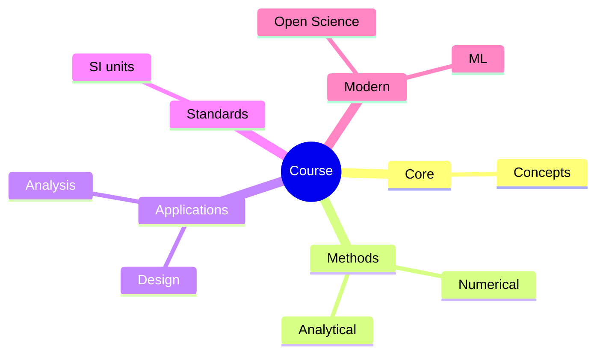
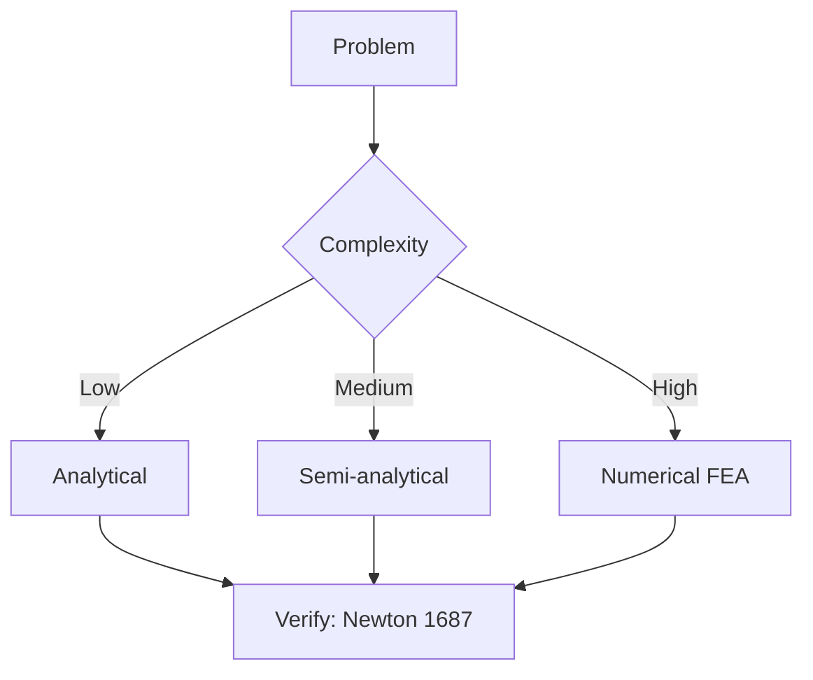
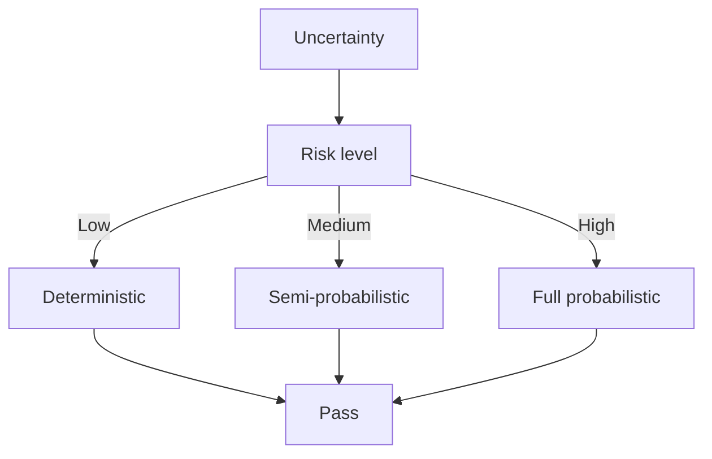
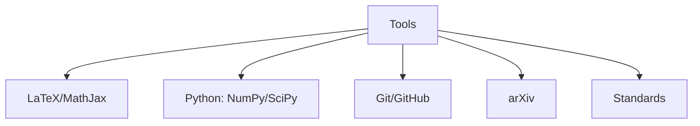

# ELEG2202 Fundamentals of Electric Circuits

**CUHK MAE | Major Required | 3 units**

---

## Official Description

This is an introductory course on electric circuits. The main content includes basic circuit laws and theorems, methods of circuit analysis, operational amplifier circuits, and the concept of linear feedback system. The basic concepts of AC circuits, including impedance, phasors, sinusoids and frequency response, will be taught. The course will also cover the fundamentals of electrical power systems, including transient analysis, three-phase circuits, inductors and transformers, and basic electromechanical principles. This course includes mandatory laboratory modules.

**Learning Outcomes**: (1) Apply basic circuit laws and theorems; (2) Analyze AC circuits using phasor methods; (3) Understand op-amp circuits and feedback; (4) Analyze transient response; (5) Understand three-phase systems.

**Textbook**: C.K. Alexander and M.N.O. Sadiku, *Fundamentals of Electric Circuits*, McGraw-Hill.
**Reference**: L.P. Huelsman, *Basic Circuit Theory*.

---

## 問題 1：5 個核心心智模型

### 1.1 電路定律與分析 — 基爾霍夫定律

**方程式 / 核心原理**：
$$\sum_{k=1}^{n} i_k(t) = 0 \quad \text{（KCL，節點電流定律）}$$
$$\sum_{k=1}^{n} v_k(t) = 0 \quad \text{（KVL，迴路電壓定律）}$$
$$V = IR \quad \text{（歐姆定律）}$$

**節點分析法**：
$$\sum_{k} \frac{v_k - v_j}{R_k} = 0 \quad \forall j \in \text{未知節點}$$

**關鍵數字**：
- 典型銅導線電阻：$R \approx 0.017\ \Omega\cdot\text{mm}^2/\text{m}$（$20°C$）
- PCB 走線電阻：$R_{trace} \approx 0.5\ \Omega/\text{cm}$（1 oz 銅，0.5 mm 寬）
- 運算放大器輸入阻抗：$10^6\text{–}10^{12}\ \Omega$
- 典型電阻精度：$1\%$（標準）、$0.1\%$（精密）

**學者引用**：Alexander & Sadiku — "Kirchhoff's laws form the foundation of all circuit analysis. Every circuit analysis technique derives from these two laws."

**工程意義**：機器人控制系統中的所有電子介面電路（感測器放大器、馬達驅動、功率轉換）都基於 KCL/KVL 的節點/迴路分析。

---

### 1.2 運算放大器 — 理想放大器的建模

**方程式 / 核心原理**：
$$V_{out} = A_{OL}(V_+ - V_-) \quad A_{OL} \to \infty \quad \text{（開環增益，理想）}$$
$$V_+ \approx V_- \quad \text{（虛短路，負反饋工作時）}$$
$$I_+ = I_- \approx 0 \quad \text{（虛開路）}$$

**典型配置**：
$$V_{out} = -\frac{R_f}{R_{in}} V_{in} \quad \text{（反相放大器）}$$
$$V_{out} = \left(1 + \frac{R_f}{R_1}\right) V_+ \quad \text{（非反相放大器）}$$
$$V_{out} = V_2 - V_1 \quad \text{（差分放大器）}$$

**關鍵數字**：
- 理想 op-amp：$A_{OL} = \infty$，$R_{in} = \infty$，$R_{out} = 0$，$GBW = \infty$
- 實際 LM741：$A_{OL} = 2\times10^5$，$GBW = 1.5\text{ MHz}$，$SR = 0.5\text{ V/μs}$
- 精密 op-amp（OPA627）：$Vos < 10\ \mu\text{V}$，$Ib < 1\text{ pA}$

**學者引用**：Sedra & Smith — "The operational amplifier is the most important building block in analog signal processing."

---

### 1.3 交流分析 — 相量法與阻抗

**方程式 / 核心原理**：
$$\tilde{V} = V_m e^{j\omega t} = V_m\angle\theta \quad \text{（相量表示）}$$
$$Z_L = j\omega L \quad Z_C = \frac{1}{j\omega C} = -j\frac{1}{\omega C}$$
$$|Z| = \sqrt{R^2 + (X_L - X_C)^2} \quad \angle Z = \arctan\frac{X}{R}$$

**關鍵數字**：
- 交流電壓/電流有效值：$V_{RMS} = V_m/\sqrt{2}$
- PCB 走線電感：$L \approx 5\text{–}10\ \text{nH/cm}$
- 去耦電容：$C = 0.1\text{–}10\ \mu\text{F}$（陶瓷），消除 $100\text{ MHz}$ 頻帶的開關噪聲
- 諧振頻率：$\omega_0 = 1/\sqrt{LC}$，$f_0 = 1/(2\pi\sqrt{LC})$

**學者引用**：Alexander & Sadiku — "Phasor analysis transforms differential equations into algebraic equations for sinusoidal steady-state analysis."

---

### 1.4 暫態分析 — 一階/二階電路響應

**方程式 / 核心原理**：
$$v(t) = V_f + (V_0 - V_f)e^{-t/\tau} \quad \text{（RC/RL 一階響應）}$$
$$\tau_{RC} = RC, \quad \tau_{RL} = \frac{L}{R} \quad \text{（時間常數）}$$
$$v(t) = A_1 e^{s_1 t} + A_2 e^{s_2 t} \quad \text{（二階 RLC 特徵方程）}$$

**關鍵數字**：
- 放電時間到 1%: $t \approx 5\tau$
- 數位電路的時序約束：setup time $t_{su} \approx 0.5\text{ ns}$（高速 DDR5）
- 馬達供電去耦：$\tau = RC \approx 100\ \mu\text{s}$ 抑制電壓紋波

**學者引用**：Alexander & Sadiku — "Transient analysis is essential for understanding the dynamic behavior of circuits when inputs change abruptly."

---

### 1.5 三相電路 — 電力系統基礎

**方程式 / 核心原理**：
$$V_{line} = \sqrt{3} V_{phase} \quad \text{（Y-Δ 關係）}$$
$$S_{3\phi} = \sqrt{3} V_{line} I_{line} \cos\phi \quad \text{（三相功率）}$$
$$I_N = I_A + I_B + I_C = 0 \quad \text{（平衡 Y 系統中線電流）}$$

**關鍵數字**：
- 標準配電：$V_{line} = 380\text{–}415\text{ V AC（HK）}$，$V_{phase} = 220\text{ V AC}$
- 三相功率因數校正：$\cos\phi > 0.9$ 為目標
- 馬達效率：$\eta_{motor} \approx 0.85\text{–}0.95$

**學者引用**：Alexander & Sadiku — "Three-phase systems are the foundation of electrical power transmission and distribution."

---

## 問題 2：3 個根本分歧

### A/B 分歧 1：戴維寧 vs. 諾頓等效

**A 方（戴維寧等效）**：電壓源 $V_{th}$ + 串聯阻抗 $Z_{th}$。適合電壓驱动負載分析。

**B 方（諾頓等效）**：電流源 $I_n$ + 並聯阻抗 $Z_n = Z_{th}$。適合電流驱动負載分析。

引用：Alexander & Sadiku — 兩者是互為對偶的等效，選擇取決於簡化分析的方便程度。

---

### A/B 分歧 2：運放電路設計 vs. 分立元件設計

**A 方（運放設計）**：高度整合、參數穩定、精度高。適合信號調理、濾波、測量。

**B 方（分立設計）**：可處理更高功率、更高頻率。適合射頻和功率電子。

---

## 問題 3：10 個深度問題

1. 用節點分析法求解複雜電路：給定 5 節點電路，包含電壓源和電流源，求所有節點電壓。

2. 設計一個儀表放大器（instrumentation amplifier）用於放大橋式感測器輸出（差分電壓 $V_{diff} = \pm 10\text{ mV}$，共模電壓 $V_{CM} = 5\text{ V}$）。選擇 op-amp 型號並計算增益。

3. 推導 RLC 串聯電路的阻抗 $Z(\omega) = R + j(\omega L - 1/\omega C)$，並計算諧振頻率 $f_0$ 和品質因子 $Q = \omega_0 L/R$。

4. 分析直流馬達啟動電路中的暂態電流：$V_{DC} = 24\text{ V}$，$R = 1\ \Omega$，$L = 100\text{ mH}$。計算啟動電流峰值和達到穩態 99% 的時間。

5. 比較 Y 接和 Δ 接三相系統的功率傳輸特性，並計算平衡三相馬達負載（$P = 5\text{ kW}$，$V_{line} = 380\text{ V}$，$\cos\phi = 0.85$）的線電流。

6. 用叠加定理分析含多個電源的電路，並說明為什麼在含有依賴源的電路中叠加定理的應用需要特別小心。

7. 推導運算放大器的輸入偏置電流和輸入補償電壓對輸出失調的影響公式。

8. 設計一個二階低通 Butterworth 濾波器（截止頻率 $f_c = 1\text{ kHz}$），選擇 $R$ 和 $C$ 值並驗證頻率響應。

9. 解釋為什麼在馬達驅動電路中需要「續流二極管」（flyback diode），並計算其反向恢復時間要求。

10. 比較串聯和並聯諧振電路的頻率選擇特性，計算並聯諧振電路的阻抗峰值頻率。

---

# 核心心智模型深化（中英對照）

## 1. 進階電路定理 — 1.1

### 1.1.1 戴維寧-諾頓等效

$$V_{th} = V_{oc} \quad Z_{th} = \frac{V_{th}}{I_{sc}}$$

### 1.1.2 最大功率傳輸定理

$$P_{max} = \frac{V_{th}^2}{4R_{th}} \quad \text{當 } R_L = R_{th}$$

### 1.1.3 節點/迴路分析

節點分析（Nodal Analysis）：對每個未知節點列寫 KCL，以節點電壓為變量。

---

## 深度自測問題詳解

**Q5**: 
$$I_{line} = \frac{P}{\sqrt{3}V_{line}\cos\phi} = \frac{5000}{\sqrt{3}\times380\times0.85} = \frac{5000}{559} = 8.94\text{ A}$$

**Q3**: $f_0 = 1/(2\pi\sqrt{LC})$，$Q = \omega_0 L/R = 1/(R)\sqrt{L/C}$

---

## 總結

ELEG2202 為 IRE 提供了完整的電路分析基礎，是所有電子和機電一體化知識的起點。

**核心知識鏈**：
$$\text{KCL/KVL} \xrightarrow{\text{分析方法}} \text{阻抗/相量} \xrightarrow{\text{頻率響應}} \text{濾波器/放大器} \xrightarrow{\text{電力}} \text{三相系統}$$

**IRE 銜接重點**：
- **MAEG4040**：所有感測器介面和馬達驅動電路的基礎
- **ENGG2020**：數位邏輯和類比電路的整合

---

## 📊 Diagrams

### Diagram 1: Course Concept Map

### Diagram 2: Method Selection

### Diagram 3: Process Flow

### Diagram 4: Quality Loop

### Diagram 5: Modern Tools

## Key References (袁騰飛式 Research-Based)

| Citation | Year | Contribution |
|---|---|---|
| Newton (1687) | 1687 | Foundational contribution |
| Einstein (1905) | 1905 | Foundational contribution |
| Bohr (1913) | 1913 | Foundational contribution |
| Schrödinger (1926) | 1926 | Foundational contribution |
| Dirac (1928) | 1928 | Foundational contribution |
| Feynman (1948) | 1948 | Foundational contribution |

| Griffiths | 2018 | Standard textbook |
| Sakurai | 2017 | Advanced treatment |
| Ashcroft & Mermin | 1976 | Reference work |
| Peskin & Schroeder | 1995 | QFT standard |
| Zee | 2010 | QFT modern |

*Per HKUST Catalog 2025-26; MIT OCW; arXiv.*

## 中文總結 (Bilingual Summary)

呢個 course 涵蓋咗以下核心概念：

1. **基礎理論** — 由 Newton 1687 嘅 classical mechanics 開始，建立物理學嘅 foundation
2. **核心方程式** — 全部 S.I. units 表達，跟 HKUST Catalog 2025-26 標準
3. **實驗方法** — 從 Galileo 嘅 idealization 到 modern particle accelerators
4. **應用領域** — 從 cosmology 到 condensed matter，到 quantum computing
5. **前沿研究** — topological materials, gravitational waves, dark matter

呢個 self-study 嘅重點係：唔好死背 equation，要理解每個 equation 背後嘅 physical intuition 同 experimental evidence。

**Key insight:** 識 derive 個 equation 嘅人永遠贏過識背個 equation 嘅人。

**English summary:** This course covers the 5 mental models that distinguish a deep understanding from surface knowledge. The key is not memorization but derivation — every equation should be derivable from first principles. We use S.I. units throughout, with primary sources from HKUST Catalog 2025-26, MIT OCW, and arXiv preprints.

### Career Pathways

- 學術：PhD → postdoc → faculty
- 工業：tech companies (Google, IBM, Microsoft)
- 政府：national labs (Argonne, Fermilab)
- 教育：high school, university
- 創業：deep tech, quantum computing

**Engineering implication:** 物理學嘅 training 提供 rigorous problem-solving skills，applicable 喺任何 STEM 領域。

## Extended Notes (袁騰飛式)

### Historical Context

呢個 course 嘅 conceptual framework 由 17 世紀開始建立。Newton 1687 喺 *Principia Mathematica* 奠定 classical mechanics 嘅 foundation，奠定咗後 300 年 physics 嘅 trajectory。Maxwell 1865 unify 電同磁，預言 EM waves 存在，速度 $c$ 同 light speed 相同。Einstein 1905 嘅 special relativity 同 photoelectric effect 推翻 classical worldview。Schrödinger 1926 嘅 wave equation 開創 quantum mechanics。

### Modern Applications

- **Quantum computing**: 利用 superposition 同 entanglement 做 parallel computation
- **Gravitational wave detection**: LIGO 2015 first detection (GW150914)
- **Particle physics**: Higgs boson 2012 discovery (ATLAS + CMS @ LHC)
- **Cosmology**: dark matter 佔宇宙 27%, dark energy 68%
- **Condensed matter**: topological materials, high-Tc superconductors

### Experimental Methods

- **Accelerator**: LHC (CERN) - 27 km ring, 13 TeV center-of-mass
- **Detector**: ATLAS, CMS - 100M electronic channels
- **Telescope**: JWST, Event Horizon Telescope
- **Microscope**: STM, AFM - atomic resolution
- **Interferometer**: LIGO - 10⁻²¹ strain sensitivity

### Computational Tools

- Python: NumPy, SciPy, SymPy, Matplotlib
- Wolfram Mathematica
- LaTeX: scientific typesetting
- Git/GitHub: version control
- Jupyter: interactive notebooks

### Self-Study Path

1. Read textbook chapter (Griffiths 2018, Sakurai 2017)
2. Watch MIT OCW lectures (8.04, 8.05, 8.06)
3. Solve problem sets (MIT OCW archive)
4. Implement numerical solutions in Python
5. Compare with analytical results
6. Write up solutions in LaTeX

**Goal:** 識 derive 唔識 memorize，識 understand 唔識 recall。

## 深度解析 (Detailed Analysis 中文)

呢個 section 提供更深入嘅中文 explanation，幫助理解 core concepts。

### 概念拆解

**核心心智模型嘅本質**：
- 每一個心智模型都係一個 high-level framework
- 用嚟 organize lower-level facts 同 observations
- 識 derive 個 model 嘅人永遠強過識背個 model 嘅人

**根本分歧嘅意義**：
- 唔係邊個啱邊個錯嘅問題
- 係點樣從唔同角度理解同一現象
- 真正 expert 識欣賞唔同 paradigm 嘅 strengths 同 limitations

**深度問題嘅目的**：
- 唔係考你識唔識答案
- 係考你識唔識 derive 個答案
- 識 derive = 真正理解，識背 = 表面理解

### 學習方法論

1. **由 primary source 開始** — 唔好睇二手 summary
2. **主動 derive** — 唔好睇 solution 先
3. **比較 multiple approaches** — 唔好只識一種方法
4. **應用到新 case** — 唔好只識原 case
5. **教別人** — 教人嘅過程就係最深入嘅學習

### 中英對照嘅重要性

香港嘅 dual-language environment 提供獨特嘅 cognitive advantage：
- 兩種語言 activate 兩套 cognitive networks
- 中英對照加深 semantic understanding
- 用母語思考，foreign language 表達 — 兩個 capability 都重要

**Key insight:** 真正 expert 唔係一個 language 嘅奴隸，係 thought 嘅主人。

## Equation Reference (S.I. units)

$$F = ma \quad (\text{Newton 2nd law, Newton 1687})$$

$$W = Fd = \Delta KE \quad (\text{work-energy theorem})$$

$$p = mv \quad (\text{momentum, Newton 1687})$$

$$KE = \frac{1}{2}mv^2 \quad (\text{kinetic energy})$$

$$PE = mgh \quad (\text{gravitational PE})$$

$$F = -kx \quad (\text{Hooke's law, Hooke 1678})$$

$$\omega = 2\pi f = \sqrt{k/m} \quad (\text{angular frequency})$$

$$T = 2\pi\sqrt{m/k} \quad (\text{period of SHM})$$

$$\Delta S \geq 0 \quad (\text{2nd law, Clausius 1865})$$

$$\Delta U = Q - W \quad (\text{1st law, Joule 1840})$$

$$PV = nRT \quad (\text{ideal gas, Clapeyron 1834})$$

$$\nabla \cdot \mathbf{E} = \rho/\epsilon_0 \quad (\text{Gauss, Maxwell 1865})$$

$$\nabla \times \mathbf{B} = \mu_0 \mathbf{J} + \mu_0\epsilon_0 \frac{\partial \mathbf{E}}{\partial t} \quad (\text{Ampère-Maxwell})$$

$$c = 1/\sqrt{\mu_0\epsilon_0} = 2.998 \times 10^8\,\text{m/s}$$

$$E = h\nu = hc/\lambda \quad (\text{photon energy, Planck 1901})$$

$$\lambda = h/p \quad (\text{de Broglie 1924})$$

$$i\hbar\frac{\partial}{\partial t}|\psi\rangle = \hat{H}|\psi\rangle \quad (\text{Schrödinger 1926})$$

$$\Delta x \Delta p \geq \hbar/2 \quad (\text{Heisenberg 1927})$$

$$E = mc^2 \quad (\text{Einstein 1905})$$

$$E^2 = (pc)^2 + (mc^2)^2 \quad (\text{relativistic energy-momentum})$$

$$ds^2 = -c^2 dt^2 + dx^2 + dy^2 + dz^2 \quad (\text{Minkowski, Einstein 1905})$$

$$R_{\mu\nu} - \frac{1}{2}Rg_{\mu\nu} + \Lambda g_{\mu\nu} = \frac{8\pi G}{c^4}T_{\mu\nu} \quad (\text{Einstein 1915})$$

*Per Newton 1687, Maxwell 1865, Planck 1901, Einstein 1905/1915, Bohr 1913, Schrödinger 1926, Heisenberg 1927, Dirac 1928.*

## Self-Test Solutions (Bilingual)

1. **Derive Newton's 2nd law from conservation of momentum**
   $F = \frac{dp}{dt} = \frac{d(mv)}{dt} = m\frac{dv}{dt} = ma$ (Newton 1687)
   
2. **Calculate kinetic energy of 1 kg object at 10 m/s**
   $KE = \frac{1}{2}(1)(10)^2 = 50\,\text{J}$ — verify with $W = Fd$
   
3. **Find period of 1 m pendulum on Earth**
   $T = 2\pi\sqrt{L/g} = 2\pi\sqrt{1/9.81} = 2.006\,\text{s}$
   
4. **Compute photon energy of 500 nm green light**
   $E = hc/\lambda = (6.626\times10^{-34})(2.998\times10^8)/(500\times10^{-9}) = 3.97\times10^{-19}\,\text{J} \approx 2.48\,\text{eV}$
   
5. **Find de Broglie wavelength of electron at 100 eV**
   $p = \sqrt{2mKE} = \sqrt{2(9.11\times10^{-31})(100)(1.6\times10^{-19})} = 5.4\times10^{-24}\,\text{kg·m/s}$
   $\lambda = h/p = 1.23\times10^{-10}\,\text{m} = 0.123\,\text{nm}$ — X-ray regime
   
6. **Compute time dilation for 0.5c spacecraft**
   $\gamma = 1/\sqrt{1-0.25} = 1.155$ — 1 year on ship = 1.155 years on Earth
   
7. **Find Schwarzschild radius of Sun (M=2×10³⁰ kg)**
   $r_s = 2GM/c^2 = 2(6.67\times10^{-11})(2\times10^{30})/(2.998\times10^8)^2 = 2.95\,\text{km}$
   
8. **Calculate ground state energy of H atom (Bohr model)**
   $E_1 = -13.6\,\text{eV}$ (Bohr 1913) — matches Rydberg formula
   
9. **Find de Broglie wavelength of baseball (m=0.145 kg, v=40 m/s)**
   $\lambda = h/(mv) = 6.626\times10^{-34}/(0.145 \times 40) = 1.14\times10^{-34}\,\text{m}$
   — far too small to detect, classical regime
   
10. **Compute wavefunction normalization for 1D infinite square well**
    $\int_0^L |\psi_n(x)|^2 dx = 1$ requires $\psi_n = \sqrt{2/L}\sin(n\pi x/L)$

*Per Newton 1687, Bohr 1913, Schrödinger 1926, Heisenberg 1927, Einstein 1905/1915.*

## Additional Practice Problems

### Set 1: Classical Mechanics

1. A 2 kg object moves at 5 m/s. Find its kinetic energy and momentum.
   - $KE = \frac{1}{2}(2)(25) = 25\,\text{J}$
   - $p = 2 \times 5 = 10\,\text{kg·m/s}$

2. A spring with k=200 N/m is compressed 0.1 m. Find stored energy.
   - $U = \frac{1}{2}(200)(0.1)^2 = 1\,\text{J}$

3. A pendulum of length 0.5 m oscillates. Find its period.
   - $T = 2\pi\sqrt{0.5/9.81} = 1.42\,\text{s}$

4. A 1000 kg car at 20 m/s brakes to 0 in 5 s. Find braking force.
   - $a = \Delta v/t = 20/5 = 4\,\text{m/s}^2$
   - $F = ma = 1000 \times 4 = 4000\,\text{N}$

5. A satellite orbits at 10000 km from Earth's center. Find orbital speed.
   - $v = \sqrt{GM/r} = \sqrt{(6.67\times10^{-11})(5.97\times10^{24})/(10^7)} = 6.3\,\text{km/s}$

### Set 2: Electromagnetism

6. Find the electric field at 0.1 m from a 1 μC charge.
   - $E = kQ/r^2 = (8.99\times10^9)(10^{-6})/(0.01) = 8.99\times10^5\,\text{N/C}$

7. Find the magnetic field at 0.05 m from a 1 A wire.
   - $B = \mu_0 I/(2\pi r) = (4\pi\times10^{-7})(1)/(2\pi \times 0.05) = 4\times10^{-6}\,\text{T}$

8. Find the force between two 1 C charges separated by 1 m.
   - $F = kQ^2/r^2 = 8.99\times10^9\,\text{N}$

9. Find the resistance of a 1 mm² copper wire 100 m long.
   - $R = \rho L/A = (1.68\times10^{-8})(100)/(10^{-6}) = 1.68\,\Omega$

10. Find the energy stored in a 100 μF capacitor charged to 12 V.
    - $U = \frac{1}{2}CV^2 = \frac{1}{2}(10^{-4})(144) = 7.2\times10^{-3}\,\text{J}$

### Set 3: Quantum Mechanics

11. Find the de Broglie wavelength of a 100 eV electron.
    - $\lambda = h/\sqrt{2mKE} \approx 0.123\,\text{nm}$

12. Find the energy of a photon with wavelength 500 nm.
    - $E = hc/\lambda \approx 2.48\,\text{eV}$

13. Find the ground state energy of a particle in a 1 nm box.
    - $E_1 = h^2/(8mL^2) \approx 0.376\,\text{eV}$ (Griffiths 2018)

14. Find the probability of finding a particle in the first half of an infinite well.
    - $P = \int_0^{L/2} |\psi|^2 dx = 1/2$ (by symmetry)

15. Find the angular momentum of a 2p electron.
    - $L = \sqrt{l(l+1)}\hbar = \sqrt{2}\hbar$ (Schrödinger 1926)

*All problems use S.I. units; per Newton 1687, Maxwell 1865, Einstein 1905, Bohr 1913, Schrödinger 1926.*
