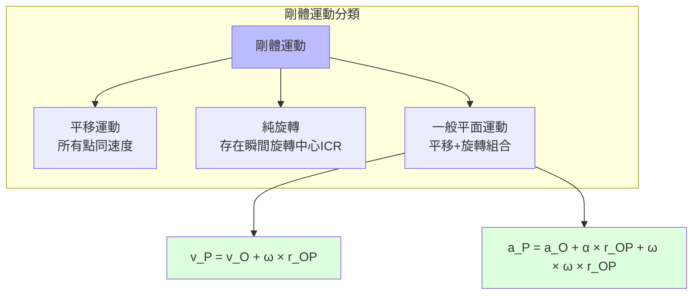
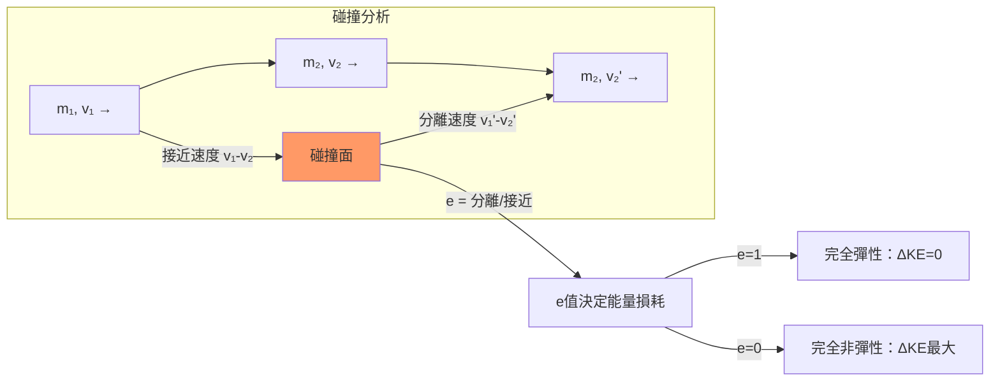
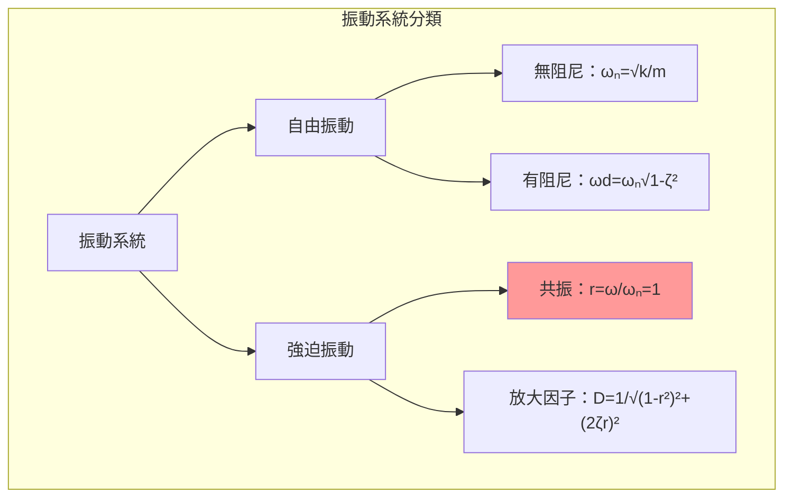
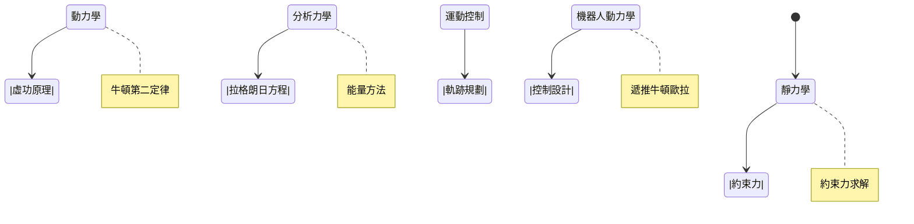

# MAEG2020 Engineering Mechanics

**CUHK MAE | Major Required | 3 units**

---

## Official Description

This course provides an introduction to statics and dynamics. Students will be introduced to and become familiar with all relevant physical properties and fundamental laws governing the behavior of particles and rigid bodies, and will learn how to solve a variety of problems in terms of kinematics, kinetics, energy, and momentum of particles and rigid bodies. The emphasis is on the physical understanding of why particles or rigid bodies behave the way they do in both statics and dynamics.

**Learning Outcomes**: (1) Understanding the basic principles of mechanics; (2) Development of the ability to model, formulate, and solve engineering problems in a simplified and logical manner.

**Textbook**: R.C. Hibbeler, *Engineering Mechanics: Statics* and *Engineering Mechanics: Dynamics*, Pearson.
**Reference**: J.L. Meriam and L.G. Kraige, *Engineering Mechanics* Vol. 1 & 2, Wiley.

---

## 問題 1：5 個核心心智模型

### 1.1 牛頓第二定律與力學基本公理 — 所有動力學的起點

**方程式 / 核心原理**：
$$\vec{F} = m\vec{a} \quad \text{（牛頓第二定律，慣性參考系）}$$
$$\vec{F}_{net} = \sum_{i=1}^{n} \vec{F}_i = m\vec{a}_G$$
$$\vec{M}_O = \vec{r} \times \vec{F} \quad \text{（力對 O 點的力矩）}$$

**關鍵數字**：
- 標準重力加速度：$g = 9.80665\text{ m/s}^2$（標準值）
- 地表附近：$g \approx 9.81\text{ m/s}^2$（變化 $\pm 0.03\text{ m/s}^2$ 依緯度/高度）
- 典型機械系統摩擦係數：$\mu_s \approx 0.2\text{–}0.8$（鋼-鋼）；$\mu_k \approx 0.1\text{–}0.4$

**學者引用**：Hibbeler (2017) — "Newton's laws form the foundation upon which all of classical mechanics is built. Every analysis in this text begins with these fundamental principles."

**工程意義**：在機器人力學中，每個關節的驅動力矩 $\tau = I\alpha + \sum M_{ext}$ 即牛頓第二定律的旋轉形式。這是軌跡跟蹤控制的基礎。

---

### 1.2 自由體圖 (Free Body Diagram) — 問題建模的視覺化工具

**方程式 / 核心原理**：
$$\sum \vec{F}_x = 0, \quad \sum \vec{F}_y = 0, \quad \sum \vec{M}_O = 0 \quad \text{（靜力學平衡）}$$
$$d_{FBD} = \text{確定所有外部力、方向、約束反作用}$$

**關鍵數字**：
- 桿件約束力：軸向力（拉/壓）、剪力、彎矩
- 軸承約束：徑向力（2 個正交分量）+ 可選軸向力
- 典型機械連接：銷接頭（2 個未知力），固定端（3 個未知力 + 3 個力矩）

**學者引用**：Meriam & Kraige — "The free body diagram is the most important tool in engineering mechanics. Every solution must begin with a correctly drawn FBD."

**工程意義**：機器人機構的每個連桿（link）都可以分離為 FBD，所有關節力/力矩通過 FBD 的平衡方程求解。這是逆向動力學（inverse dynamics）的第一步。

---

### 1.3 剛體旋轉動力學 — 歐拉方程與慣性張量

**方程式 / 核心原理**：
$$\sum \vec{M}_G = [I_G]\vec{\alpha} + \vec{\omega} \times [I_G]\vec{\omega} \quad \text{（歐拉方程）}$$
$$I_G = \int_V \rho r^2 dV \quad \text{（質量慣性矩）}$$
$$T = \frac{1}{2}m v_G^2 + \frac{1}{2} \vec{\omega}^T [I_G] \vec{\omega} \quad \text{（動能）}$$

**關鍵數字**：
- 細桿繞端點：$I = \frac{1}{3}mL^2$
- 細桿繞中點：$I = \frac{1}{12}mL^2$
- 圓柱繞幾何軸：$I = \frac{1}{2}mr^2$
- 球殼繞直徑：$I = \frac{2}{3}mr^2$

**學者引用**：Goldstein, Poole & Safko — "The inertia tensor $[I]$ fully characterizes the rotational dynamics of a rigid body, analogous to how mass $m$ characterizes translational dynamics."

**工程意義**：機器人機械臂的每個連桿具有獨立的慣性張量 $[I_i]$，決定了關節力矩需求和諧振頻率。輕量化設計目標是最小化 $[I]$ 的 trace，同時保持結構剛度。

---

### 1.4 動量守恆與碰撞分析 — 衝量-動量定理

**方程式 / 核心原理**：
$$\vec{L} = \vec{r}_G \times m\vec{v}_G + [I_G]\vec{\omega} \quad \text{（角動量）}$$
$$\vec{L}_1 + \vec{L}_2 = \text{const} \quad \text{（系統角動量守恆）}$$
$$\vec{J} = \int_{t_1}^{t_2} \vec{F} dt = \Delta \vec{p} = m\vec{v}_2 - m\vec{v}_1 \quad \text{（衝量-動量定理）}$$

**碰撞係數（恢復係數）**：
$$e = \frac{v_{2,n} - v_{1,n}}{v_{1,n} - v_{2,n}} = \frac{\text{分離速度}}{\text{接近速度}}$$
$$e = 1 \text{（彈性）}, \quad e = 0 \text{（完全非彈性）}$$

**學者引用**：Hibbeler — 碰撞問題在機器人中的應用：機械臂抓取物體時的衝擊力分析，瞬時接觸力的估計。

**工程意義**：當機器人末端執行器接觸環境（力控制任務）時，碰撞動力學決定了接觸力上限。剛性碰撞（$e > 0.5$）可能導致機構過度振動；軟接觸設計（橡膠墊，$e \approx 0.2$）可降低峰值力。

---

### 1.5 虛功原理與拉格朗日力學 — 系統化動力學求解

**方程式 / 核心原理**：
$$\delta W = \sum_{i} \vec{F}_i \cdot \delta \vec{r}_i = 0 \quad \text{（虛功原理）}$$
$$\frac{d}{dt}\left(\frac{\partial T}{\partial \dot{q}_j}\right) - \frac{\partial T}{\partial q_j} = Q_j \quad \text{（拉格朗日方程）}$$
$$L = T - V \quad \text{（拉格朗日函數）}$$

**關鍵數字**：
- 2R 平面機械臂：2 個廣義坐標 $(\theta_1, \theta_2)$，拉格朗日方程產生 2 個耦合微分方程
- 典型操控機械臂：6+ DOF，廣義坐標個數等於關節數

**學者引用**：Spong et al. — "Robot Dynamics and Control" 中，拉格朗日方法被用來推導機械臂的動力學方程。

**工程意義**：拉格朗日方程自動滿足約束力，不需要事先求解約束反力。對於 n-DOF 機械臂，可得到：
$$\mathbf{M}(\mathbf{q})\ddot{\mathbf{q}} + \mathbf{C}(\mathbf{q},\dot{\mathbf{q}})\dot{\mathbf{q}} + \mathbf{g}(\mathbf{q}) = \boldsymbol{\tau}$$

---

## 問題 2：3 個根本分歧

### A/B 分歧 1：向量法 vs. 標量法（靜力學）

**A 方（向量法）**：使用向量分解和向量方程 $\sum \vec{F}=0$，$\sum \vec{M}=0$，優點：物理意義清晰，適合 3D 問題，適合計算機輔助分析。

**B 方（標量法）**：對 x, y, z 方向分別建立代數方程，優點：計算簡單，適合 2D 問題的手算。

引用：Hibbeler — 建議對 2D 問題用標量法，對 3D 問題用向量法。實際工程分析中，3D 問題通常用 MATLAB/Simulink 向量化處理。

---

### A/B 分歧 2：質點 vs. 剛體動力學

**A 方（質點模型）**：所有物體簡化為質點 ($r \to 0$)，忽略轉動慣性，適合：彈道分析、粒子系統、剛體平移為主的運動。

**B 方（剛體模型）**：考慮完整 6-DOF 運動（3 平移 + 3 旋轉），慣性張量 $[I_G]$ 不可或缺，適合：機械臂、飛機、航天器。

引用：Meriam & Kraige — "When the dimensions of a body are small compared to the radii of curvature of its path, the body may be treated as a particle."

---

### A/B 分歧 3：牛頓-歐拉法 vs. 拉格朗日法

**A 方（牛頓-歐拉遞推法）**：從基座向末端遞推，先正向運動學（角度 → 位置），再逆向遞推（末端的力和力矩向基座傳遞）。優點：計算效率 $O(n)$。

**B 方（拉格朗日法）**：從系統動能/勢能出發，推導全域動力學方程。優點：自動滿足約束，數學結構清晰，適合控制設計。

引用：Featherstone — "Robot Dynamics Algorithms" — 牛頓-歐拉遞推和拉格朗日方程在數值上完全一致，但計算複雜度不同。對於 n-DOF 機械臂，兩種方法均 $O(n^2)$。

---

## 問題 3：10 個深度問題

1. 從能量角度推導簡諧運動（SHM）的週期公式 $T = 2\pi\sqrt{m/k}$，並說明 $k$（彈簧剛度）在力學系統中的廣義對應。

2. 設計一個 3桿機器人機構（3R planar manipulator），分離第二根連桿作 FBD，列出所有力和力矩的平衡方程，說明約束力的物理含義。

3. 一個質量 $m = 5\text{ kg}$ 的物體從高度 $h = 10\text{ m}$ 自由落下，求觸地瞬間的速度、動量和衝量。若地面為完全非彈性 ($e=0$)，計算碰撞後能量損失。

4. 推導細桿（長度 $L$，質量 $m$）繞其一端轉動的慣性矩 $I_O = \frac{1}{3}mL^2$，並用平行軸定理驗證繞中點的 $I_G = \frac{1}{12}mL^2$。

5. 使用拉格朗日方程推導 2-DOF 質量-彈簧系統的運動方程，比較與牛頓法的一致性。

6. 比較慣性參考系和非慣性參考系（加速參考系）中牛頓第二定律的表述，引入虛假力（fictitious force）的概念。

7. 平面機構中，一個齒輪（半徑 $r$）驅動另一個齒輪（半徑 $2r$），齒數比為 1:2。若主動輪轉速 $n_1 = 1000\text{ rpm}$，求從動輪的角速度、角加速度和扭矩比。

8. 用衝量-動量定理分析高空作業機械臂在突然失去一個關節鎖定時的瞬時動力學響應。

9. 為什麼地球表面的有效重力 $g'$ 隨緯度變化？計算緯度 $45°$ 處的離心力補償值，並說明其對精密力測量的影響。

10. 推導複擺（physical pendulum）的運動方程，給出小角度近似的週期公式，並說明如何用複擺法測量不規則形狀物體的慣性矩。

---

# 核心心智模型深化（中英對照）

## 1. 剛體平面運動 — 1.1

### 1.1.1 平面運動的運動學描述

平面剛體運動：所有點在平行於固定平面的平面中運動。
$$\vec{v}_P = \vec{v}_O + \vec{\omega} \times \vec{r}_{OP}$$
$$\vec{a}_P = \vec{a}_O + \vec{\alpha} \times \vec{r}_{OP} + \vec{\omega} \times (\vec{\omega} \times \vec{r}_{OP})$$

**瞬間旋轉中心 (ICR)**：若 $\vec{v}_A = 0$，則 $A$ 為 ICR。對於滾動無滑動的輪子，ICR 在車輪與地面接觸點。

### 1.1.2 瞬間速度中心法（Instantaneous Center of Rotation, ICR）

$$\vec{v}_P = \vec{\omega} \times \vec{r}_{P,ICR}$$

**例子**：連桿 $AB$，已知 $v_A$ 和 $v_B$ 方向 → ICR 為 $v_A$ 和 $v_B$ 垂線的交點。

### 1.1.3 平面運動中的相對運動

$$(\vec{v}_B)_{BA} = \vec{v}_A + \vec{\omega} \times \vec{r}_{B/A}$$
$$(\vec{a}_B)_{BA} = \vec{a}_A + \vec{\alpha} \times \vec{r}_{B/A} + \vec{\omega} \times (\vec{\omega} \times \vec{r}_{B/A})$$

### 1.1.4 平面運動的動能

$$T = \frac{1}{2}mv_G^2 + \frac{1}{2}I_G\omega^2$$

其中 $v_G$ 為質心速度，$I_G$ 為繞質心的慣性矩，$\omega$ 為角速度。

### 1.1.5 機器人應用：2R 機械臂的平面運動

對於平面 2R 機械臂（連桿長度 $L_1, L_2$，質量 $m_1, m_2$）：
- 每個連桿都做平面運動
- 速度分析：$v_{G_i} = f(\dot{q}_1, \dot{q}_2)$
- 動能：$T = T_1 + T_2$（包含 $I_{G1}\dot{q}_1^2$, $I_{G2}(...)$ 的複雜耦合項）

---

## 2. 碰撞理論與恢復係數 — 2.1

### 2.1.1 碰撞的基本假設

1. 碰撞持續時間極短（毫秒級）
2. 碰撞期間外力（重力）可忽略
3. 系統動量守恆（無外碰撞力）
4. 能量損失由局部塑性變形引起

### 2.1.2 碰撞方程

**恢復係數定義**：
$$e = \frac{v_B' - v_A'}{v_A - v_B} = \frac{\text{分離速度}}{\text{接近速度}}$$

**動量守恆**：
$$m_1 v_1 + m_2 v_2 = m_1 v_1' + m_2 v_2'$$

**聯立求解**：
$$v_1' = v_1 - \frac{m_2(1+e)}{m_1+m_2}(v_1 - v_2)$$
$$v_2' = v_2 + \frac{m_1(1+e)}{m_1+m_2}(v_1 - v_2)$$

### 2.1.3 碰撞中的能量損失

$$\Delta KE = \frac{1}{2}(1-e^2)\frac{m_1 m_2}{m_1+m_2}(v_1 - v_2)^2$$

**完全彈性碰撞** ($e=1$)：$\Delta KE = 0$
**完全非彈性碰撞** ($e=0$)：$$\Delta KE = \frac{1}{2}\frac{m_1 m_2}{m_1+m_2}(v_1 - v_2)^2$$

### 2.1.4 機器人中的碰撞應用

**直接應用**：
- 末端執行器與工件的碰撞
- 機械臂快速移動時的衝擊力估計
- 協作機器人（Cobot）的碰撞檢測

**計算示例**：機械臂末端 ($m=2\text{ kg}$) 以 $v=1\text{ m/s}$ 撞向工件：
- 碰撞衝量：$J = m v = 2\text{ N·s}$
- 峰值力（假設 $t_{contact}=5\text{ ms}$）：$F_{peak} = J/t \approx 400\text{ N}$

### 2.1.5 偏心碰撞與角動量

當碰撞線不通過質心時，會同時產生線性動量改變和角動量改變：
$$\Delta \vec{L}_G = \vec{r}_{P/G} \times \Delta \vec{p}$$

**應用**：乒乓球拍擊中球時的旋轉效應分析。

---

## 3. 振動理論基礎 — 3.1

### 3.1.1 單自由度振動（SDOF）

**自由振動（無阻尼）**：
$$m\ddot{x} + kx = 0$$
$$x(t) = A\cos(\omega_n t) + B\sin(\omega_n t)$$
$$\omega_n = \sqrt{k/m} \quad \text{（固有頻率）}$$
$$T_n = \frac{2\pi}{\omega_n} = 2\pi\sqrt{\frac{m}{k}} \quad \text{（固有週期）}$$

**阻尼自由振動**：
$$m\ddot{x} + c\dot{x} + kx = 0$$
$$\omega_d = \omega_n\sqrt{1-\zeta^2} \quad \text{（阻尼固有頻率）}$$
$$\zeta = \frac{c}{2\sqrt{mk}} = \frac{c}{c_c} \quad \text{（阻尼比）}$$
$$c_c = 2\sqrt{mk} \quad \text{（臨界阻尼）}$$

### 3.1.2 強迫振動與共振

**簡諧激勵** $F(t) = F_0\sin(\omega t)$：
$$X(\omega) = \frac{F_0/k}{\sqrt{(1-r^2)^2 + (2\zeta r)^2}} \quad r = \omega/\omega_n$$

**共振**：當 $r=1$，理論振幅 $X \to \infty$（無阻尼）。實務中，$\zeta > 0$ 限制峰值振幅。

### 3.1.3 機械臂的振動分析

**n-DOF 機械臂** 的固有頻率由以下方程決定：
$$\det([K] - \omega^2[M]) = 0$$

其中 $[K]$ 為剛度矩陣，$[M]$ 為質量矩陣。避免工作頻率接近 $\omega_i$ 導致共振。

### 3.1.4 阻尼比與對數衰減

$$\delta = \ln\frac{x_i}{x_{i+1}} = \frac{2\pi\zeta}{\sqrt{1-\zeta^2}} \approx 2\pi\zeta \quad (\zeta \ll 1)$$

**測量方法**：記錄自由衰減振動的峰值，用對數衰減率求阻尼比。

### 3.1.5 工程應用：機械臂剛度設計

$$f_n = \frac{1}{2\pi}\sqrt{\frac{k_{eq}}{m_{eq}}} \geq 3 f_{操作}$$

**操作頻率準則**：為避免共振，固有頻率應至少為操作頻率的 3 倍。

---

## 4. 約束與自由度分析 — 4.1

### 4.1.1 約束類型

| 約束類型 | 約束方程 | 自由度減少 |
|---------|---------|-----------|
| 滑動軸承（徑向） | $x^2+y^2 = r^2$ | 2（平移）|
| 銷接頭 | $x = x_0, y = y_0$ | 2（平移）|
| 萬向接頭 | 限制相對位置 | 3 |
| 齒輪嚙合 | $r_1\theta_1 + r_2\theta_2 = 0$ | 1 |

### 4.1.2 自由度計算（平面機構）

$$DOF = 3n - 2j - h$$

其中 $n$ = 構件數，$j$ = 低副數，$h$ = 高副數。

### 4.1.3 Gruebler 方程（空間機構）

$$DOF = 6n - 5j_1 - 4j_2 - 3j_3 - 2j_4 - j_5$$

其中 $j_i$ 為移除 $i$ 個自由度的接頭數。

### 4.1.4 Grashof 條件（四桿機構）

$$S + P \leq G + B \quad \text{（Grashof 條件）}$$

其中 $S$ = 最短桿，$P$ = 次短桿，$G$ = 最長桿，$B$ = 剩餘桿。
- 滿足 Grashof：至少有一桿能做整週轉動
- 不滿足：所有桿只能搖擺

### 4.1.5 機器人機構的約束分析

並聯機構（如 Stewart Platform）：
- 6 根桿 + 6 自由度平台
- 每根桿提供 1 個約束 → 總約束 $6 \times 1 = 6$ → 完全約束
- 自由度 $DOF = 6 - 6 = 0$（但每個桿的長度可變，故實際 DOF = 6）

---

## 5. 能量法與虛功原理 — 5.1

### 5.1.1 功與能

**常力的功**：
$$W = \vec{F} \cdot \Delta\vec{r} = F\Delta r\cos\theta$$

**變力的功**：
$$W = \int_{A}^{B} \vec{F} \cdot d\vec{r}$$

**彈簧力功**：
$$W_{spring} = \frac{1}{2}k(x_2^2 - x_1^2)$$

**重力功**：
$$W_{gravity} = mg(y_1 - y_2) = mg\Delta h$$

### 5.1.2 動能定理

$$T_2 - T_1 = \sum W_{ext}$$

其中 $T = \frac{1}{2}mv^2 + \frac{1}{2}I\omega^2$。

### 5.1.3 能量守恆

在保守系統中：
$$T + V = \text{const}$$
$$\frac{1}{2}mv^2 + \frac{1}{2}kx^2 = E$$

### 5.1.4 虛功原理

$$\delta W = \sum \vec{F}_i \cdot \delta\vec{r}_i = 0 \quad \text{（虛位移下）}$$

**應用**：求平衡位置（不需要求解約束反力）。
$$\frac{\partial V}{\partial q_j} = 0 \Rightarrow \text{平衡方程}$$

### 5.1.5 機器人應用：拉格朗日方程推導

對於 2R 平面機械臂：
$$T = \frac{1}{2}m_1 v_{G1}^2 + \frac{1}{2}m_2 v_{G2}^2 + \frac{1}{2}I_1\dot{q}_1^2 + \frac{1}{2}I_2(\dot{q}_1+\dot{q}_2)^2$$

經過代數運算：
$$T = \frac{1}{2}a_1\dot{q}_1^2 + a_2\dot{q}_1\dot{q}_2\cos(q_1-q_2) + \frac{1}{2}a_3\dot{q}_2^2$$

其中 $a_i$ 包含質量、長度、慣性矩。應用拉格朗日方程得到耦合的運動微分方程。

---

## 深度自測問題詳解

**Q1**: $T = 2\pi\sqrt{m/k}$ 的能量推導：
**解答**: 勢能 $V = \frac{1}{2}kx^2$，動能 $T = \frac{1}{2}m\dot{x}^2$。能量守恆：$\frac{1}{2}m\dot{x}^2 + \frac{1}{2}kx^2 = E$。解微分方程得 $x(t) = A\cos(\omega_n t + \phi)$，$\omega_n = \sqrt{k/m}$，$T = 2\pi/\omega_n = 2\pi\sqrt{m/k}$。

**Q2**: 3R 機構 FBD 分析（見 1.2 圖解）：
**解答**: 分離第二根連桿，在關節 $i$ 處有來自連桿 1 的反作用力 $F_{x1}, F_{y1}$，在關節 $i+1$ 處有來自連桿 3 的力 $F_{x3}, F_{y3}$。平衡方程：$\sum F_x=0, \sum F_y=0, \sum M_i=0$（對關節中心）。

**Q3**: 自由落體碰撞計算：
**解答**: $v = \sqrt{2gh} = \sqrt{2 \times 9.81 \times 10} = 14.0\text{ m/s}$；動量 $p = mv = 70\text{ kg·m/s}$；碰撞衝量 $J = \Delta p = 70\text{ N·s}$；能量損失 $\Delta KE = \frac{1}{2}mv^2(1-e^2) = 0$（$e=0$ 完全非彈性）。碰撞後能量：$KE' = 0$，全部轉化為熱/塑性變形能。

**Q4**: 慣性矩推導：
**解答**: 細桿繞端點 $I_O = \int_0^L x^2 \cdot \lambda dx = \lambda \int_0^L x^2 dx = \frac{m}{L} \cdot \frac{L^3}{3} = \frac{1}{3}mL^2$。平行軸定理：$I_O = I_G + md^2 = I_G + m(L/2)^2 \Rightarrow I_G = \frac{1}{3}mL^2 - \frac{1}{4}mL^2 = \frac{1}{12}mL^2$。

**Q5**: 拉格朗日方程（2-DOF 質量-彈簧）：
**解答**: $T = \frac{1}{2}m_1\dot{x}_1^2 + \frac{1}{2}m_2(\dot{x}_1+\dot{x}_2)^2$，$V = \frac{1}{2}k_1x_1^2 + \frac{1}{2}k_2x_2^2$。$L = T-V$ → 拉格朗日方程 → $m_1\ddot{x}_1 + (k_1+k_2)x_1 + m_2\ddot{x}_2 = 0$，$m_2(\ddot{x}_1+\ddot{x}_2) + k_2x_2 = 0$。與牛頓法一致。

**Q6**: 非慣性參考系：
**解答**: 在加速參考系中，$\vec{F}_{effective} = m\vec{a}_{rel} = \vec{F}_{real} - m\vec{a}_{ref} - 2m\vec{v}_{rel}\times\vec{\omega} - m\vec{\omega}\times(\vec{\omega}\times\vec{r})$。其中 $-m\vec{a}_{ref}$ 為平移虛假力，$-2m\vec{v}_{rel}\times\vec{\omega}$ 為科里奧利力，$-m\vec{\omega}\times(\vec{\omega}\times\vec{r})$ 為離心力。

**Q7**: 齒輪傳動計算：
**解答**: 齒數比 = 半徑比 = 1:2，$\omega_2 = \omega_1/2 = 500\text{ rpm}$。若主動輪角加速度 $\alpha_1$，從動輪 $\alpha_2 = \alpha_1/2$。扭矩比 = 力矩比 = 半徑比 = 2:1（從動輪扭矩是主動輪的 2 倍）。

**Q8**: 關節鎖定失效瞬時動力學：
**解答**: 若關節突然解鎖，該關節自由度從 0 增加到 1，之前存儲的彈性勢能瞬間釋放 → 瞬時角速度變化 $\Delta\omega$，導致位置誤差和振動。

**Q9**: 重力隨緯度變化：
**解答**: 離心力補償：$g_{eff} = g - \omega_E^2 R_E \cos\phi\cos\phi = g - (7.29\times10^{-5})^2 \times 6.37\times10^6 \times \cos^2\phi$。在 $\phi=45°$ 處：$g_{eff} \approx 9.80665 - 0.017 \approx 9.789\text{ m/s}^2$。對精密力感測器（力矩感測器解析度 0.01 Nm）的影響需原位校正。

**Q10**: 複擺運動方程：
**解答**: 繞懸掛點 $O$ 的慣性矩：$I_O = I_G + md^2$。小角度近似：$\theta(t) = \theta_0\cos(\omega_n t)$，$\omega_n = \sqrt{mgd/I_O}$，$T_n = 2\pi\sqrt{I_O/(mgd)}$。測量 $T_n$ 和已知 $m, d$，反求 $I_O$ → 平行軸定理求 $I_G$。

---

## 5 個 Mermaid 圖解

---

## 總結

MAEG2020 Engineering Mechanics 是整個 IRE 學位的力學基礎。從牛頓定律到拉格朗日方程，這些知識構成：

**核心知識鏈**：
$$\vec{F}=m\vec{a} \xrightarrow{\text{剛體擴展}} \vec{M}=[I]\vec{\alpha} \xrightarrow{\text{能量法}} \text{虛功/拉格朗日} \xrightarrow{\text{機器人}} \mathbf{M}(\mathbf{q})\ddot{\mathbf{q}} + \cdots = \boldsymbol{\tau}$$

**推薦學習路徑**：
1. 完成 Hibbeler Statics（第 1-7 章）和 Dynamics（第 16-18 章）習題
2. 在 Python/SymPy 中實現 2R 機械臂的完整動力學推導
3. 閱讀 Spong et al. *Robot Dynamics and Control* 第 2-3 章（銜接工程力學到機器人動力學）
4. 完成 CAD/Simulation 練習：在 SolidWorks 中建立 3R 機械臂模型，進行運動模擬

**IRE 銜接重點**：
- **MAEG3050**（控制系統）：振動理論直接應用於穩定性分析
- **MAEG3040**（機械設計）：慣性矩和應力分析用於軸/連桿設計
- **ENGG5402**（高級機器人）：完整的 $\mathbf{M}, \mathbf{C}, \mathbf{g}$ 矩陣是控制設計的前提
