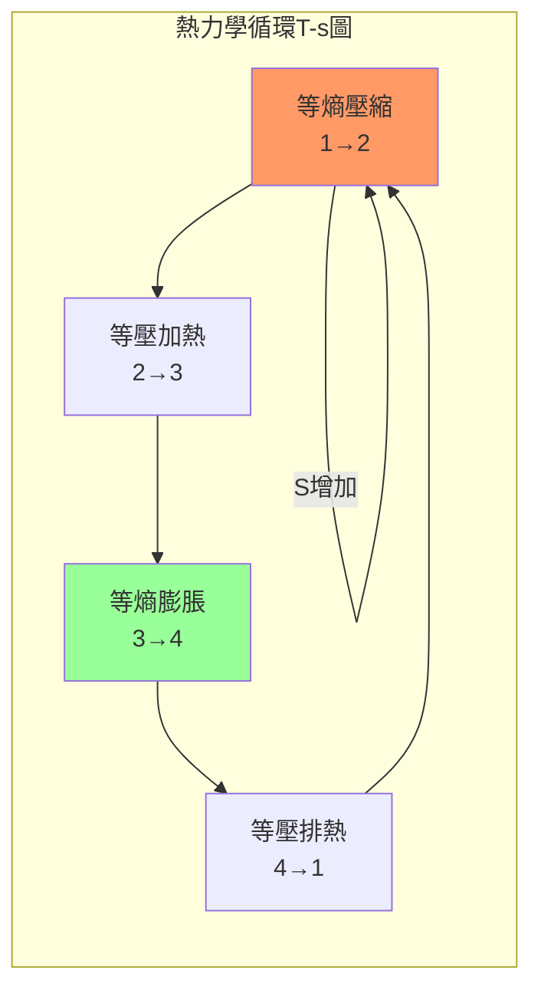
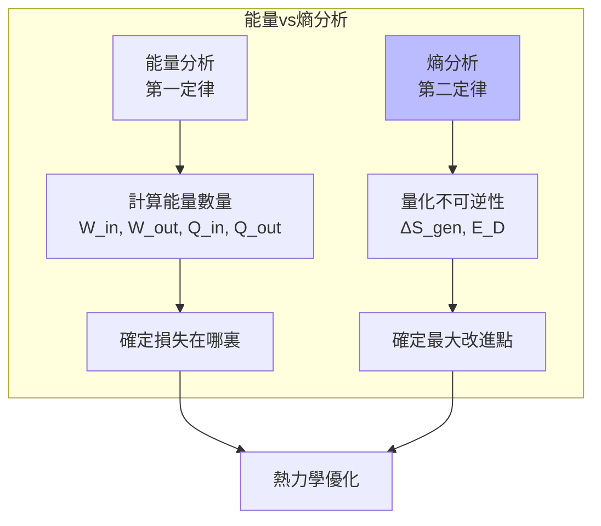
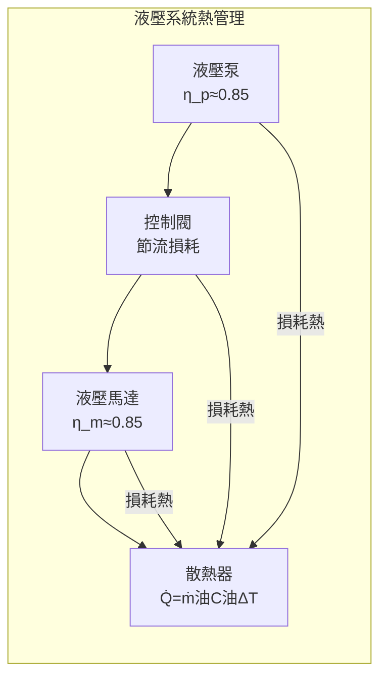
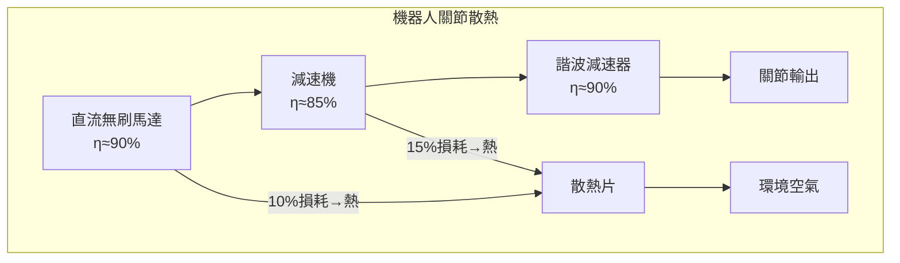
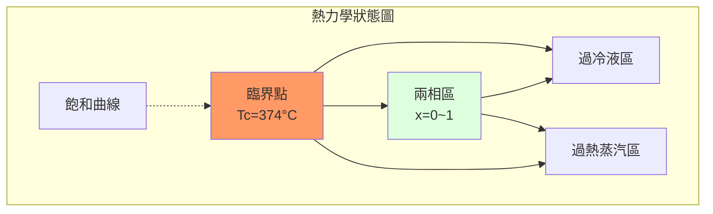

# MAEG2030 Thermodynamics

**CUHK MAE | Major Required | 3 units**

---

## Official Description

This course will cover fundamental topics in thermodynamics including basic concepts, heat and work, pure substance, ideal gas, first law and second law of thermodynamics, entropy, gas and vapor power cycles, and refrigeration cycles.

**Learning Outcomes**: (1) Understand the fundamental principles of thermodynamics; (2) Apply thermodynamic analysis to engineering systems; (3) Analyze energy conversion cycles.

**Textbook**: Y.A. Çengel and M.A. Boles, *Thermodynamics: An Engineering Approach*, McGraw-Hill.
**Reference**: M.J. Moran et al., *Principles of Engineering Thermodynamics*, Wiley.

---

## 問題 1：5 個核心心智模型

### 1.1 熱力學第一定律 — 能量守恆的普適表達

**方程式 / 核心原理**：
$$Q - W = \Delta U \quad \text{（封閉系統能量平衡）}$$
$$dU = \delta Q - \delta W = TdS - pdV \quad \text{（微分形式）}$$
$$\dot{Q}_{net} - \dot{W}_{net} = \frac{dE_{cv}}{dt} \quad \text{（控制體 steady-state）}$$

**關鍵數字**：
- 理想氣體內能：$u = c_v T$（空氣：$c_v = 0.718\text{ kJ/(kg·K)}$）
- 理想氣體焓：$h = c_p T$（空氣：$c_p = 1.005\text{ kJ/(kg·K)}$）
- 空氣比熱比：$\gamma = c_p/c_v = 1.4$

**學者引用**：Çengel & Boles — "The first law is the law of conservation of energy. It states that energy can be neither created nor destroyed during a process; it can only change forms."

**工程意義**：在任何熱力學系統中，輸入能量（燃料熱值）= 輸出功 + 損失熱。內燃機的效率 $\eta = W_{net}/Q_{in}$ 由第一定律決定。

---

### 1.2 熱力學第二定律 — 方向性與效率上限

**方程式 / 核心原理**：
$$\oint \frac{\delta Q}{T} \leq 0 \quad \text{（克勞修斯不等式）}$$
$$dS = \frac{\delta Q_{rev}}{T} + dS_{gen} \quad dS_{gen} \geq 0 \quad \text{（熵增原理）}$$
$$\eta_{Carnot} = 1 - \frac{T_L}{T_H} \quad \text{（卡諾循環效率）}$$

**關鍵數字**：
- 卡諾效率（室溫 $T_L=298\text{ K}$, 高溫 $T_H=600\text{ K}$）：$\eta = 1 - 298/600 = 50.3\%$
- 實際內燃機：$\eta \approx 25\text{–}35\%$（受不可逆損耗限制）
- 燃氣渦輪：$\eta \approx 30\text{–}40\%$

**學者引用**：Çengel & Boles — "The second law asserts that energy has quality as well as quantity. The first law deals with the quantity; the second law deals with the quality."

**工程意義**：卡諾效率給出了任何熱機的最大理論效率上限。這意味著不可能有永動機（$\eta=100\%$）。在機器人系統中，散熱設計必須滿足第二定律約束。

---

### 1.3 熵 (Entropy) — 不可逆性的量化度量

**方程式 / 核心原理**：
$$S_2 - S_1 = \int_1^2 \left(\frac{\delta Q}{T}\right)_{rev} + \Delta S_{gen}$$
$$\Delta S_{univ} = \Delta S_{sys} + \Delta S_{surr} \geq 0 \quad \text{（宇宙熵增原理）}$$
$$s(T,p) - s(T_{ref}, p_{ref}) = c_p \ln\frac{T}{T_{ref}} - R \ln\frac{p}{p_{ref}} \quad \text{（理想氣體）}$$

**關鍵數字**：
- 理想氣體熵變：$\Delta s = c_p \ln(T_2/T_1) - R \ln(p_2/p_1)$
- 實際壓縮過程（不可逆）：$s_{out} > s_{in}$，需額外輸入功克服不可逆性
- 可逆等溫壓縮：$\Delta s_{sys} = -Q/T$，但 $\Delta s_{surr} = +Q/T$，總和為零

**學者引用**：Moran et al. — "Entropy is the property that measures the extent of irreversibility."

---

### 1.4 理想氣體與實際氣體 — 狀態方程的建模

**方程式 / 核心原理**：
$$pv = RT \quad \text{（理想氣體狀態方程）}$$
$$pv = ZRT \quad \text{（壓縮因子，實際氣體）}$$
$$Z = 1 + \frac{P_r}{T_r} \left[0.083 + \frac{0.422}{T_r^{1.6}}\right] \quad \text{（Benedict-Webb-Rubin 簡化）}$$

**關鍵數字**：
- 通用氣體常數：$R = 8.314\text{ J/(mol·K)}$
- 空氣分子量：$M = 28.97\text{ g/mol}$ → $R_{air} = 287\text{ J/(kg·K)}$
- 臨界點（空氣）：$T_c = 132.5\text{ K}$，$p_c = 3.77\text{ MPa}$（實際氣體效應在 $T > 1.5T_c$ 可忽略）

**學者引用**：Çengel & Boles — 理想氣體模型在 $T > 1.5T_c$ 和 $p < 0.1p_c$ 時誤差不超過 1%。

---

### 1.5 動力循環分析 — 卡諾、布雷頓、朗肯循環

**方程式 / 核心原理**：
**布雷頓循環（燃氣渦輪）**：
$$\eta_{th} = \frac{W_{net}}{Q_{in}} = \frac{(h_3-h_4)-(h_2-h_1)}{(h_3-h_2)}$$

**朗肯循環（蒸汽動力）**：
$$\eta_{rankine} = \frac{(h_3-h_4)-(h_1-h_4)}{h_3-h_2}$$

**關鍵數字**：
- 超臨界朗肯循環（$p_3 > 22.1\text{ MPa}$）：效率 $\eta \approx 40\%$
- 再熱朗肯循環：效率提升 2-4%
- 燃氣渦輪進口溫度 $T_3 = 1500\text{ K}$（超級合金 limits）

**學者引用**：Çengel & Boles — 朗肯循環是全世界發電廠的基礎，佔全球發電量約 80%。

---

## 問題 2：3 個根本分歧

### A/B 分歧 1：可逆過程 vs. 實際不可逆過程

**A 方（可逆過程）**：理想化極限，$dS_{gen}=0$，系統與環境無熵交換。作為理論效率上限的分析工具。

**B 方（實際過程）**：摩擦、熱傳導（有溫差）、節流、混合——所有實際過程都是不可逆的，$dS_{gen}>0$。

引用：Çengel & Boles — "All actual processes are irreversible. Reversible processes are hypothetical models that serve as benchmarks."

---

### A/B 分歧 2：內燃機 vs. 外燃機

**A 方（內燃機）**：燃料在氣缸內燃燒（汽油機、柴油機）。優點：高功率密度；缺點：受材料溫度限制。

**B 方（外燃機）**：燃料在外部燃燒（蒸汽輪機、斯特林引擎）。優點：可使用多种燃料、高溫燃燒；缺點：體積大、響應慢。

引用：Moran et al. — 蒸汽動力循環（外燃）在大型發電廠中仍是主流，因為可以使用核能或太陽能熱。

---

### A/B 分歧 3：能量 vs. 熵分析

**A 方（能量分析，第一定律）**：關注能量數量，計算輸入/輸出功率。確定各部分的能量損耗。

**B 方（熵分析，第二定律）**：關注能量質量，量化不可逆性，識別最大熵產生位置（最大潛在改進點）。

引用：Bejan — "Entropy generation minimization (EGM) is a method that uses entropy generation as the objective function to minimize irreversibility in thermal systems."

---

## 問題 3：10 個深度問題

1. 推導卡諾循環的熱效率 $\eta_{Carnot} = 1 - T_L/T_H$。若高溫熱源溫度從 600K 升至 1200K，理論效率從多少提升到多少？

2. 一個剛性容器（容積 $V = 0.5\text{ m}^3$）包含 $m = 2\text{ kg}$ 的空氣（視為理想氣體），初始狀態 $T_1 = 300\text{ K}$，$p_1 = 150\text{ kPa}$。求初始比容、初始壓力，並驗證是否為理想氣體假設合理。

3. 解釋熵增原理 $\Delta S_{univ} \geq 0$ 在以下過程中的含義：（a）兩物體接觸熱傳導；（b）自由膨脹；（c）混合兩種理想氣體。

4. 計算理想布雷頓循環（燃氣渦輪）的理論效率，給定 $T_1=300\text{ K}$，$T_2=600\text{ K}$（壓縮後），$T_3=1500\text{ K}$（燃燒後），$T_4=800\text{ K}$（膨脹後）。假設 $c_p = 1.005\text{ kJ/(kg·K)}$。

5. 推導理想氣體熵變公式 $\Delta s = c_p \ln(T_2/T_1) - R \ln(p_2/p_1)$，並用 $T$-$s$ 圖說明其幾何意義。

6. 比較朗肯循環和卡諾循環在 $T$-$s$ 圖上的差異，說明為什麼實際電廠採用朗肯循環而非卡諾循環。

7. 一台壓縮機將空氣從 $p_1 = 100\text{ kPa}$，$T_1 = 300\text{ K}$ 壓縮到 $p_2 = 800\text{ kPa}$。計算（a）等溫壓縮功；（b）絕熱壓縮功（假設 $\gamma = 1.4$）；（c）說明兩者差異的物理原因。

8. 什麼是可用能（Exergy）和不可用能？推導封閉系統的可用能表達式 $X = (U - U_0) + p_0(V - V_0) - T_0(S - S_0)$。

9. 討論熱泵和製冷循環的效能係數（COP）如何受第二定律限制。給出典型住宅熱泵的 COP 範圍和理論極限。

10. 在機器人系統中，電動馬達的效率（通常 80-95%）和液壓系統的效率（通常 60-80%）如何用熱力學第一定律和第二定律解釋？

---

# 核心心智模型深化（中英對照）

## 1. 能量系統建模 — 1.1

### 1.1.1 控制體 vs. 封閉系統

**封閉系統（控制質量）**：無質量穿越邊界，能量方程：
$$Q - W = \Delta U = m(u_2 - u_1)$$

**控制體（開放系統）**：有質量流進流出，能量方程：
$$\dot{Q} - \dot{W} = \dot{m}(h_2 + \frac{V_2^2}{2} + gz_2) - \dot{m}(h_1 + \frac{V_1^2}{2} + gz_1)$$

### 1.1.2 熱力學狀態與過程

**狀態**：系統宏觀性質的完整描述。狀態公理：對簡單可壓縮系統，需要 2 個獨立強度性質確定狀態。

**過程**：系統從一個狀態到另一個狀態的變化路徑。等壓、等溫、等容、等熵、絕熱——每個過程在 $p$-$v$，$T$-$s$，$h$-$s$ 圖上有特定幾何表示。

### 1.1.3 $T$-$s$ 圖的幾何意義

$$Tds = du + pdv \quad \Rightarrow \quad ds = \frac{du}{T} + \frac{p}{T}dv$$

$T$-$s$ 圖上：
- 曲線下面積 = 熱量 $q = \int Tds$
- 等壓線斜率 $(\partial T/\partial s)_p = T/c_p$
- 不可逆過程顯示為從高溫到低溫的"階梯"（熵增）

### 1.1.4 水蒸氣狀態分析

**飽和液/蒸汽線**：在臨界點 ($T_c = 374°C$, $p_c = 22.06\text{ MPa}$) 匯合。
- 過冷液區：$T < T_{sat}(p)$
- 兩相區：濕蒸汽 $x$ = 乾度
- 過熱蒸汽區：$T > T_{sat}(p)$

### 1.1.5 機器人液壓系統熱力學

液壓馬達功率損耗轉化為熱：
$$\dot{Q}_{loss} = \dot{W}_{in} - \dot{W}_{out} = \dot{W}_{in}(1 - \eta_{motor})$$

典型液壓油工作溫度：$T_{max} \approx 60\text{–}80°C$，超過後粘度急劇下降，密封件老化加速。

---

## 2. 熵與不可逆性 — 2.1

### 2.1.1 熵的微觀詮釋

$$S = k_B \ln \Omega \quad \text{（玻爾茲曼關係）}$$

其中 $\Omega$ 為微觀狀態數，$k_B = 1.381\times10^{-23}\text{ J/K}$ 為玻爾茲曼常數。

**例子**：混合兩種氣體後的熵增：$\Delta S = N_A k_B \ln(V_A/V_{initial}) + N_B k_B \ln(V_B/V_{initial}) > 0$

### 2.1.2 熵增原理與可用能損耗

$$\Delta S_{gen} = \Delta S_{univ} = \Delta S_{sys} + \Delta S_{surr} \geq 0$$

**可用能損耗（可用能破壞）**：
$$\dot{E}_{D} = T_0 \dot{S}_{gen}$$

其中 $T_0$ 為環境溫度。

### 2.1.3 不可逆性量化

**壓縮機不可逆性**：等溫壓縮功（最小輸入功）與實際壓縮功之差：
$$I = W_{actual} - W_{rev} = W_{actual} - W_{isothermal} \geq 0$$

### 2.1.4 等效可用能效率（Exergy Efficiency）

$$\eta_{exergy} = \frac{\text{獲得的可用能}}{\text{投入的可用能}} = 1 - \frac{E_D}{E_{in}}$$

不同於能量效率（總是小於 1），可用能效率直接量化"質量損失"。

### 2.1.5 工程中的熵管理

| 過程 | 主要不可逆源 | 可用能損耗典型值 |
|------|------------|----------------|
| 燃燒 | 化學反應不可逆 | 20-30% |
| 熱傳導（有溫差）| 有限溫差熱傳 | 取決於 $\Delta T$ |
| 節流 | 不可逆膨脹 | 5-15% |
| 摩擦 | 機械能→熱 | 1-5% |

---

## 3. 氣體動力循環 — 3.1

### 3.1.1 布雷頓循環（Jet/Gas Turbine）

**4 個過程**：
1→2：絕熱壓縮（壓縮機）
2→3：等壓加熱（燃燒室）
3→4：絕熱膨脹（渦輪）
4→1：等壓排熱（大氣）

**功率輸出**：
$$\dot{W}_{net} = \dot{m}[(h_3-h_4)-(h_2-h_1)]$$

### 3.1.2 回熱式布雷頓循環

在 4→1 排熱過程中，通過回熱器（regenerator）將部分熱量傳遞給壓縮後的空氣（2→3），減少燃料需求。

**回熱度** $\epsilon = (h_3 - h_2)/(h_4 - h_2)$，典型值 $\epsilon \approx 0.8$

### 3.1.3 壓縮比與效率關係

對於理想布雷頓（等熵壓縮/膨脹）：
$$\eta_{th} = 1 - \frac{T_1}{T_2} = 1 - r_p^{(\gamma-1)/\gamma}$$

其中 $r_p = p_2/p_1$ 為壓力比。$r_p$ 越大，效率越高，但 $T_3$ 受材料限制。

### 3.1.4 燃氣渦輪性能參數

- 渦輪進口溫度 (TIT)：$1300\text{–}1500°C$（超合金 limits）
- 壓縮比：$10:1$ 到 $30:1$
- 功率重量比：$3\text{–}6\text{ kW/kg}$（航空發動機）
- 地面燃氣渦輪效率：$30\text{–}42\%$（簡單循環），$45\text{–}60\%$（聯合循環）

### 3.1.5 應用：協作機器人液壓系統

電液伺服系統中，油液發熱主要來自：
1. 閥口節流損耗：$\Delta p \cdot Q$ → 熱
2. 液壓馬達/泵的容積損耗
3. 管路摩擦損耗

散熱器設計需處理 $\dot{Q}_{max} = C_{oil} \dot{m}_{oil} \Delta T_{oil,max}$

---

## 深度自測問題詳解

**Q1 卡諾循環推導**：卡諾循環由兩個等溫過程（$T_H$, $T_L$）和兩個絕熱過程組成。等溫膨脹吸熱 $Q_H = T_H\Delta S$，等溫壓縮排熱 $Q_L = T_L\Delta S$，淨功 $W_{net} = Q_H - Q_L = (T_H - T_L)\Delta S$，效率 $\eta = W_{net}/Q_H = 1 - T_L/T_H$。$T_H=600K$: $\eta=1-298/600=50.3\%$；$T_H=1200K$: $\eta=1-298/1200=75.2\%$。

**Q2 理想氣體狀態驗證**：$v = R_{air}T/p = 287\times300/150000 = 0.574\text{ m}^3/\text{kg}$，$V = 0.5/1 = 0.25\text{ m}^3/\text{kg}$（差異來自 $m=2\text{ kg}$）。理想氣體假設合理：空氣 $T_c=132.5K$，$T_1=300K > 1.5T_c$，接近理想氣體。

**Q3 熵增分析**：
- (a) 熱傳導：$\Delta S_{univ} = \frac{Q}{T_L} - \frac{Q}{T_H} > 0$（$T_L < T_H$ 物體）
- (b) 自由膨脹：$\Delta S = mR\ln(V_2/V_1) > 0$，$Q=0, W=0$，$\Delta U=0$，$\Delta S_{univ}>0$
- (c) 氣體混合：$\Delta S = m_1R_1\ln(V_{1,f}/V_{1,i}) + m_2R_2\ln(V_{2,f}/V_{2,i}) > 0$

**Q4 布雷頓循環**：$\eta = 1 - [(h_4-h_1)/(h_3-h_2)]$。先求狀態（假設等熵）：$T_2/T_1 = (p_2/p_1)^{(\gamma-1)/\gamma}$。若 $r_p=10$，$T_2 = 300\times10^{0.286}=579K$，$h_2-h_1 = c_p(T_2-T_1)=1.005\times279=280\text{ kJ/kg}$。再求 $T_4$（等熵膨脹）：$T_4/T_3 = (p_4/p_3)^{(\gamma-1)/\gamma} = 1/r_p^{0.286}$，$T_4=1500/10^{0.286}=777K$，$h_3-h_4=c_p(1500-777)=727\text{ kJ/kg}$。$\eta = 1-280/727 \approx 61.5\%$（理想值；實際約 35-40%）。

**Q5 理想氣體熵變推導**：由基本方程 $Tds = du + pdv = c_v dT + pdv$，$pdv = Rdv/v$，積分：$s_2-s_1 = c_v\ln(T_2/T_1) + R\ln(v_2/v_1) = c_p\ln(T_2/T_1) - R\ln(p_2/p_1)$。

**Q6 朗肯 vs. 卡諾**：卡諾需要等溫蒸發（在水沸點，$T=const$），但實際中難以實現汽液兩相中等溫換熱。朗肯循環用泵取代卡諾的等溫壓縮（泵功極小），用鍋爐取代等溫蒸發（燃料燃燒換熱），犧牲一些效率但大幅簡化工程實現。

**Q7 壓縮功計算**：
- 等溫：$W_{isothermal} = p_1 V_1 \ln(p_1/p_2) = 100\times V_1 \ln 8 = 207.9\text{ kJ/kg}$
- 絕熱（等熵）：$W_{adiabatic} = \frac{\gamma}{\gamma-1}p_1V_1\left[1-(p_2/p_1)^{(\gamma-1)/\gamma}\right] = \frac{1.4}{0.4}\times 100\times[1-8^{-0.286}] = 287.4\text{ kJ/kg}$
- 差異：$79.5\text{ kJ/kg}$（不可逆功）

**Q8 可用能推導**：封閉系統相對於環境狀態 $(T_0, p_0)$ 的最大可用功：$X = (U-U_0) + p_0(V-V_0) - T_0(S-S_0)$。

**Q9 熱泵 COP**：$\text{COP}_{HP} = Q_L/W_{in} = T_L/(T_H-T_L)$（理想）；$\text{COP}_{refrigerator} = Q_L/W_{in} = T_L/(T_H-T_L)$（相同）。典型熱泵 COP = 2-4（環境溫度 $T_L \approx 280K$，室內 $T_H \approx 300K$，理想 COP $\approx 14$，實際 2-4）。

**Q10 馬達/液壓熱力學**：電馬達效率 $\eta_e = 0.80\text{–}0.95$，損耗 $5\text{–}20\%$ 轉化為熱（主要來自銅損 $I^2R$ 和鐵損）。液壓系統：泵效率 $\eta_p \approx 0.85$，馬達效率 $\eta_m \approx 0.85$，閥口損耗 $\eta_v \approx 0.7$（部分負荷時），總效率 $\eta_{total} = \eta_p \times \eta_m \times \eta_v \approx 50\%$，一半以上功率轉化為熱。

---

## 5 個 Mermaid 圖解

---

## 總結

MAEG2030 Thermodynamics 為 IRE 提供了熱能轉換的科學基礎。雖然機器人系統主要是機電系統，但熱力學知識在以下方面必不可少：

**核心知識鏈**：
$$\text{能量守恆（第一定律）} \xrightarrow{\text{方向性}} \text{熵增原理（第二定律）} \xrightarrow{\text{循環分析}} \text{功率機械設計}$$

**推薦學習路徑**：
1. 完成 Çengel & Boles 第 1-9 章習題（覆蓋第一、第二定律及應用）
2. 在 Python 中實現布雷頓/朗肯循環模擬
3. 閱讀 Çengel & Boles 第 10-12 章（氣體動力循環、蒸汽動力循環）
4. 研究機器人液壓系統散熱設計案例

**IRE 銜接重點**：
- **MAEG4030**（熱傳學）：熱傳遞是熱力學的第二類約束（不可逆性的具體形式）
- **MAEG4040**（機電一體化）：液壓系統的熱管理是關鍵設計約束
- **機器人關節熱設計**：馬達和電子元件的熱管理直接影響性能
