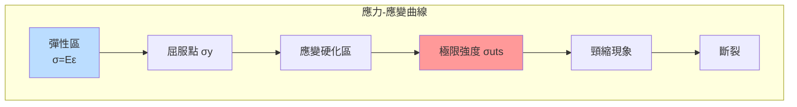
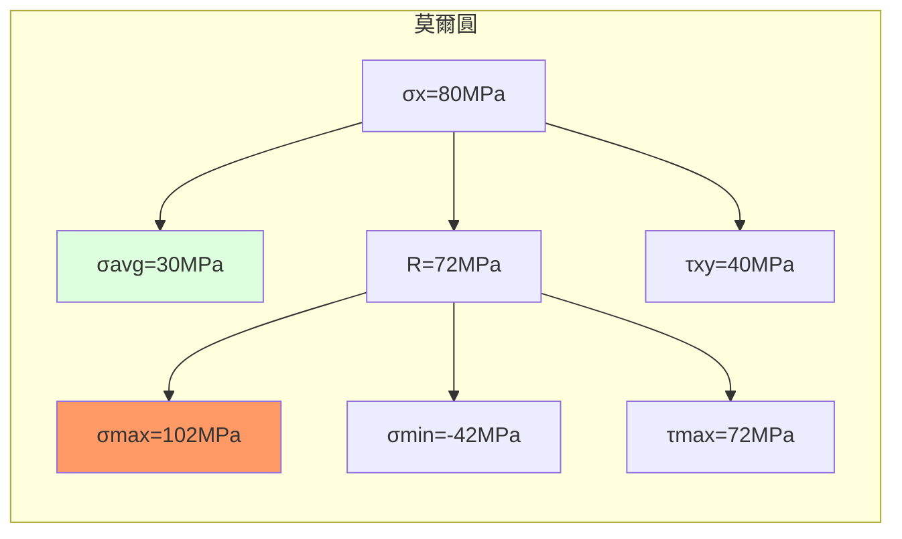
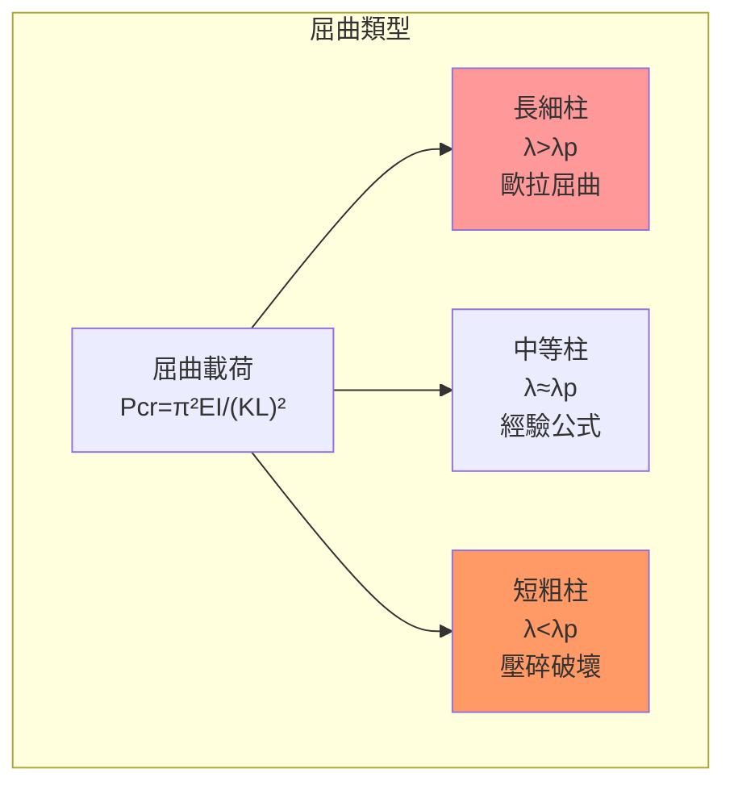
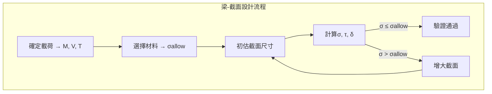
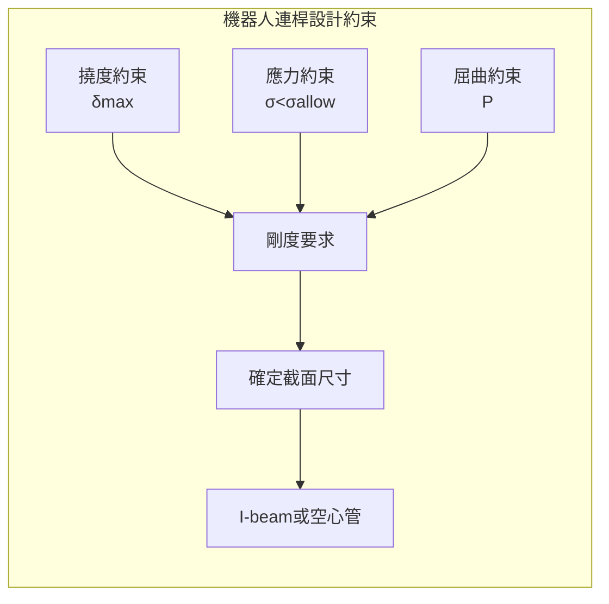

# MAEG3010 Mechanics of Materials

**CUHK MAE | Major Required | 3 units**

---

## Official Description

This course is a study of mechanics of materials. It covers the following topics: linear elasticity, stress and strain, stress-strain relations, loading and deformation, statically indeterminate problems, torsion, shear forces and bending moments, stresses in beams, deflection of beams, stresses in thin-walled pressure vessels, column and buckling.

**Learning Outcomes**: (1) Understand the fundamental concepts of material properties; (2) Understand how to extend equilibrium analysis to deformable bodies; (3) Analyze and interpret experimental results; (4) Solve mechanics of materials problems; (5) Evaluate the mechanical properties of materials.

**Textbook**: Ferdinand P. Beer, E. Russell Johnston, John T. DeWolf, *Mechanics of Materials* 7th Edition in SI Units, McGraw Hill.
**Reference**: James M. Gere, *Mechanics of Materials*, 5th Edition, Brooks/Cole.

---

## 問題 1：5 個核心心智模型

### 1.1 應力-應變關係 — 彈性本構方程

**方程式 / 核心原理**：
$$\sigma = E \varepsilon \quad \text{（胡克定律，一維）}$$
$$\varepsilon_x = \frac{1}{E}[\sigma_x - \nu(\sigma_y + \sigma_z)] \quad \text{（廣義胡克定律）}$$
$$\tau = G \gamma \quad G = \frac{E}{2(1+\nu)} \quad \text{（剪切胡克定律）}$$

**關鍵數字**：
- 結構鋼：$E = 200\text{ GPa}$，$\nu = 0.3$，$\sigma_y = 250\text{ MPa}$
- 鋁合金：$E = 70\text{ GPa}$，$\nu = 0.33$
- 鈦合金：$E = 110\text{ GPa}$，$\sigma_y = 880\text{ MPa}$
- 碳纖維複合材料：$E_1 = 150\text{ GPa}$，$E_2 = 10\text{ GPa}$（各向異性）

**學者引用**：Gere & Timoshenko — "The relationship between stress and strain for most engineering materials under uniaxial loading is linear for stresses below the proportional limit."

**工程意義**：機器人連桿在受力時的變形分析是軌跡精度的關鍵約束。連桿撓度 $\delta = FL^3/(3EI)$ 直接影響末端位置誤差。

---

### 1.2 梁的彎曲理論 — 彎曲應力與撓度

**方程式 / 核心原理**：
$$\sigma_x = -\frac{M_y}{I_z}z = -\frac{M}{S} \quad \text{（彎曲應力）}$$
$$S = \frac{I_z}{c} \quad \text{（截面模數）}$$
$$\frac{d^2v}{dx^2} = \frac{M(x)}{EI} \quad \text{（彎曲撓度微分方程）}$$

**關鍵數字**：
- 矩形截面：$I_{rect} = bh^3/12$，$S = bh^2/6$
- 圓形截面：$I_{circ} = \pi d^4/64$，$S = \pi d^3/32$
- 標準 I 型鋼（I-beam）：$I$ 高，$S$ 高，重量低
- 薄壁管：$I_{tube} = \pi(d_o^4 - d_i^4)/64$

**學者引用**：Beer, Johnston & DeWolf — "The flexure formula is valid only when the cross-section is symmetric about a plane through the neutral axis and when plane sections remain plane."

**工程意義**：機械臂連桿作為梁構件，其彎曲應力決定了截面尺寸設計。最大撓度約束（通常 $L/300$ 到 $L/1000$）決定了剛度要求。

---

### 1.3 扭轉理論 — 圓軸的扭矩傳遞

**方程式 / 核心原理**：
$$\tau_{max} = \frac{T \cdot c}{J} = \frac{T}{Z_t} \quad \text{（圓軸扭轉應力）}$$
$$J = \frac{\pi c^4}{2} \quad \text{（實心圓軸極慣性矩）}$$
$$\phi = \frac{TL}{GJ} = \frac{TL}{kG} \quad \text{（扭轉角）}$$

**關鍵數字**：
- 空心圓軸 $J = \pi(c_o^4 - c_i^4)/2$
- 軸最大剪切應力：$\tau_{allow} = 0.58\sigma_{allow}$（鋼）
- 典型扭轉角限制：$\phi_{max} \approx 0.3°$/m（精密傳動）

**學者引用**：Gere & Timoshenko — 扭轉方程適用於圓截面桿，對於非圓截面桿（矩形、箱形）則需要 warping torsion theory。

**工程意義**：機械臂關節軸（hollow shaft）傳遞扭矩，空心設計比實心軸重量輕 $50\%$ 但保持相同扭矩承載能力（外徑相同時）。

---

### 1.4 應力轉換與莫爾圓 — 任意方向的主應力

**方程式 / 核心原理**：
$$\sigma_{x'} = \frac{\sigma_x+\sigma_y}{2} + \frac{\sigma_x-\sigma_y}{2}\cos 2\theta + \tau_{xy}\sin 2\theta$$
$$\tau_{max} = \sqrt{\left(\frac{\sigma_x-\sigma_y}{2}\right)^2 + \tau_{xy}^2}$$

**莫爾圓**：
$$(\sigma - \sigma_{avg})^2 + \tau^2 = R^2 \quad R = \sqrt{\left(\frac{\sigma_x-\sigma_y}{2}\right)^2 + \tau_{xy}^2}$$

**關鍵數字**：
- 最大正應力：$\sigma_{max} = \sigma_{avg} + R$（主應力）
- 最大剪切應力：$\tau_{max} = R$（位於 $45°$ 偏轉方向）
- 莫爾-庫倫準則：$\sigma_1 - \sigma_3 \leq \sigma_{allow}$（脆性材料）

**學者引用**：Beer et al. — "The Mohr's circle provides a graphical representation of the stress transformation equations and is an extremely powerful visualization tool."

---

### 1.5 屈曲理論 — 壓桿穩定性

**方程式 / 核心原理**：
$$P_{cr} = \frac{\pi^2 EI}{(KL)^2} \quad \text{（歐拉屈曲載荷）}$$
$$\sigma_{cr} = \frac{P_{cr}}{A} = \frac{\pi^2 E}{(KL/r)^2} \quad \text{（歐拉屈曲應力）}$$
$$\lambda = \frac{KL}{r} \quad \text{（柔度比）}$$

**關鍵數字**：
- 長細比界限：$\lambda_p = \pi\sqrt{2E/\sigma_y}$（塑性与弹性屈曲分界）
- 鋼結構鋼：$\lambda_p \approx 90$；鋁：$\lambda_p \approx 60$
- 安全係數：$n = 1.5\text{–}3.0$（壓桿設計）
- 機器人關節軸：需避免屈曲，$P_{applied} < P_{cr}/n$

**學者引用**：Gere & Timoshenko — "Buckling is a mode of failure that is often sudden and catastrophic, and it must be considered in the design of slender compression members."

---

## 問題 2：3 個根本分歧

### A/B 分歧 1：彈性設計 vs. 塑性設計

**A 方（彈性設計）**：材料使用不超過屈服強度，安全係數基於 $\sigma_{allow} = \sigma_y/n$。保守、簡單、傳統。

**B 方（塑性設計）**：允許截面部分進入塑性，利用材料後屈服強化提高承載能力。節省材料 10-20%，但需要更複雜分析。

引用：Beer et al. — 塑性設計只適用於有足夠旋轉能力的韌性材料（如結構鋼），不適用於脆性材料（如鑄鐵）。

---

### A/B 分歧 2：彎曲為主 vs. 扭轉為主的軸設計

**A 方（彎曲設計控制）**：當徑向載荷為主時，最大撓度和彎曲應力決定軸徑。需要抗彎剛度 $EI$ 最大化。

**B 方（扭轉設計控制）**：當扭矩為主時，最大剪切應力和扭轉角決定軸徑。需要極慣性矩 $J$ 最大化。

引用：Shigley — 實際軸通常同時承受彎曲和扭轉，需用 Modified Mohr's Theory 或 von Mises 準則估算當量應力。

---

### A/B 分分歧 3：應力集中 vs. 應力均勻分佈假設

**A 方（應力集中不可忽略）**：在孔洞、凹槽、截面突變處，峰值應力 $\sigma_{max} = k_t \sigma_{nom}$，需用有限元或理論係數計算。

**B 方（小尺度幾何簡化）**：在初步分析和手算中，假設應力均勻分佈，以獲得合理估計。

引用：Peterson's Stress Concentration Factors — 典型幾何的 $k_t$ 值表（孔洞 $k_t = 3$，肩軸 $k_t = 2\text{–}2.5$）。

---

## 問題 3：10 個深度問題

1. 一根懸臂梁（長度 $L=1\text{ m}$，矩形截面 $b \times h = 20\text{ mm} \times 40\text{ mm}$，$E=200\text{ GPa}$）承受端部集中力 $F=500\text{ N}$。計算最大撓度、最大彎曲應力、並驗證是否低於 $\sigma_{allow}=150\text{ MPa}$。

2. 比較實心圓軸和空心圓軸（外徑相同 $d_o = 50\text{ mm}$，空心內徑 $d_i = 30\text{ mm}$）的扭矩承載能力和重量比，說明空心軸的優越性。

3. 用莫爾圓方法求 $\sigma_x = 80\text{ MPa}$，$\sigma_y = -20\text{ MPa}$，$\tau_{xy} = 40\text{ MPa}$ 時的主應力和最大剪切應力。

4. 一根細長柱（$L=2\text{ m}$，$I = 8.0\times10^{-6}\text{ m}^4$，$E = 200\text{ GPa}$，兩端鉸支 $K=1$）。計算歐拉屈曲載荷和安全係數（設計載荷 $P = 50\text{ kN}$，安全係數 $n=2$）。

5. 解釋聖維南原理（Saint-Venant's Principle）在應力分析中的意義，並說明它如何允許我們在遠離載荷施加點的區域使用簡化應力分佈假設。

6. 推導彎曲撓度微分方程 $d^2v/dx^2 = M(x)/(EI)$，並用疊加原理計算懸臂梁承受均佈載荷 $w$ 和端部集中力 $F$ 時的最大撓度。

7. 用 von Mises 屈服準則 $\sigma_{eq} = \sqrt{\sigma_x^2 + 3\tau_{xy}^2 - \sigma_x\sigma_y} = \sigma_y$ 分析彎曲+扭轉組合應力狀態，給出設計軸徑的公式。

8. 比較三點彎曲測試和四点彎曲測試在測定材料彎曲強度上的差異，並解釋為什麼四点彎曲能更準確測量彎曲強度。

9. 說明薄壁圓筒壓力容器（內徑 $r$，壁厚 $t \ll r$）的周向應力 $\sigma_\theta = pr/t$ 和軸向應力 $\sigma_z = pr/(2t)$ 是如何從平衡方程推導出來的。

10. 一根階梯軸（小端直徑 $d_1 = 20\text{ mm}$，大端直徑 $d_2 = 30\text{ mm}$，過渡半徑 $r = 5\text{ mm}$），承受扭矩 $T = 200\text{ N·m}$。用截面法和應力集中估算最大應力。

---

# 核心心智模型深化（中英對照）

## 1. 應力分析基礎 — 1.1

### 1.1.1 應力張量

二維應力狀態：
$$\boldsymbol{\sigma} = \begin{bmatrix} \sigma_x & \tau_{xy} \\ \tau_{xy} & \sigma_y \end{bmatrix}$$

三維應力張量：$3\times3$ 對稱矩陣，6 個獨立分量。坐標變換服從張量變換定律。

### 1.1.2 應變張量

$$\varepsilon_x = \frac{\partial u}{\partial x}, \quad \varepsilon_y = \frac{\partial v}{\partial y}, \quad \gamma_{xy} = \frac{\partial u}{\partial y} + \frac{\partial v}{\partial x}$$

體積應變：$\varepsilon_{vol} = \varepsilon_x + \varepsilon_y + \varepsilon_z = \Delta V/V$

### 1.1.3 應力-應變曲線

$$\sigma\text{-}E\text{ 線性區} \xrightarrow{E = \sigma/\varepsilon} \sigma_y \text{ 屈服點} \xrightarrow{\text{應變硬化}} \sigma_{uts} \text{ 極限強度} \xrightarrow{\text{頸縮}} \text{斷裂}$$

韌性材料（鋼）：$\varepsilon_{f} \approx 0.15\text{–}0.25$；脆性材料（陶瓷）：$\varepsilon_f \approx 0.001$

### 1.1.4 熱應力

$$\sigma_{thermal} = E\alpha\Delta T \quad \text{（約束熱膨脹產生的應力）}$$

機器人應用：焊接結構的焊接殘餘應力、冷卻不均勻導致的熱應力。

### 1.1.5 組合載荷

軸向 + 彎曲 + 扭轉的組合：
$$\sigma_{max} = \frac{P}{A} + \frac{M}{S} \quad \text{（正應力疊加）}$$
$$\tau_{max} = \frac{T}{Z_t} \quad \text{（剪切應力）}$$
$$\sigma_{vonMises} = \sqrt{\sigma_{max}^2 + 3\tau_{max}^2}$$

---

## 2. 梁理論 — 2.1

### 2.1.1 梁的基本類型

| 支撐類型 | 反作用力 | 彎矩約束 |
|---------|---------|---------|
| 簡支梁（Pin-Pin）| 2 個力 | 無固定端 |
| 懸臂梁（Fixed-Free）| 3（2 力+1 力矩）| 固定端 |
| 固定-固定梁 | 3+3（兩端各3）| 超靜定 |
| 疊梁（Continuous）| 多跨超靜定 | 需變形協調 |

### 2.1.2 剪力和彎矩圖（Shear-Moment Diagram）

$$\frac{dV}{dx} = -w(x) \quad \frac{dM}{dx} = V(x)$$
$$V(x) = \int -w(x)dx + C_1 \quad M(x) = \int V(x)dx + C_2$$

最大撓度位置：$d^2v/dx^2 = 0 \Rightarrow M(x)=0$（彎矩為零點）

### 2.1.3 疊加原理

當材料和結構保持線彈性（小變形假設）時，多個載荷同時作用的效應等於各單獨作用的代數和。
- 撓度可疊加
- 應力可疊加
- 內力可疊加

### 2.1.4 截面幾何性質

**平行軸定理**：
$$I_z = I_{c} + Ad^2$$

其中 $I_c$ 為過質心軸的慣性矩，$A$ 為面積，$d$ 為兩軸距離。

**組合截面**：由多個簡單形狀組成，先求質心位置，再算各部分對質心軸的 $I$。

### 2.1.5 撓度方程求解方法

1. **直接積分法**：積分 $EI d^4v/dx^4 = w(x)$ 四次，代入邊界條件
2. **力矩面積法**：用於快速估算
3. **共軛梁法**：將撓度問題轉化為彎矩問題
4. **能量法（卡氏定理）**：$\delta_i = \partial U/\partial F_i$

---

## 深度自測問題詳解

**Q1**: 懸臂梁計算：
- 最大彎矩：$M_{max} = FL = 500 \times 1 = 500\text{ N·m}$
- 截面模數：$S = bh^2/6 = 0.02 \times 0.04^2/6 = 5.33\times10^{-6}\text{ m}^3$
- 最大彎曲應力：$\sigma_{max} = M_{max}/S = 500/(5.33\times10^{-6}) = 93.8\text{ MPa} < 150\text{ MPa}$ ✓
- 最大撓度：$\delta_{max} = FL^3/(3EI) = 500\times1^3/(3\times200\times10^9\times b h^3/12) = 500\times1^3/(3\times200\times10^9\times 2.13\times10^{-7}) = 3.9\text{ mm}$

**Q2**: 空心 vs. 實心軸比較：
- 實心 $J_s = \pi d^4/32 = 6.14\times10^{-7}\text{ m}^4$（$d=50\text{ mm}$）
- 空心 $J_h = \pi(50^4-30^4)/32 = 5.03\times10^{-7}\text{ m}^4$（空心扭矩容量為實心的 82%）
- 重量比：$W_h/W_s = (d_o^2 - d_i^2)/d_o^2 = (2500-900)/2500 = 0.64$（空心軸輕 36%）
- 效率比：$J/\text{weight}$ 比實心高 $(5.03/0.64)/(6.14/1) = 1.28$（扭矩/重量比提高 28%）

**Q3**: 莫爾圓計算：
- $\sigma_{avg} = (80-20)/2 = 30\text{ MPa}$
- $R = \sqrt{((80-(-20))/2)^2 + 40^2} = \sqrt{60^2+40^2} = 72.1\text{ MPa}$
- $\sigma_{max} = 30 + 72.1 = 102.1\text{ MPa}$，$\sigma_{min} = 30 - 72.1 = -42.1\text{ MPa}$
- $\tau_{max} = 72.1\text{ MPa}$（主剪切應力）

**Q4**: 歐拉屈曲：
- 柔度比：$\lambda = KL/r = 1\times2000/r$（需先算 $r = \sqrt{I/A}$，若圓軸直徑 $d$，$r = d/4$）
- 假設 $d=60\text{ mm}$：$I=6.36\times10^{-7}\text{ m}^4$，$A=2.83\times10^{-3}\text{ m}^2$，$r=0.015\text{ m}$
- $\lambda = 2000/0.015 = 133,333$，$P_{cr} = \pi^2 \times 200\times10^9 \times 6.36\times10^{-7} / 2000^2 = 314\text{ kN}$
- 安全係數 $n = 314/50 = 6.28 > 2$ ✓

**Q5**: 聖維南原理：位於載荷點局部區域外的應力分佈，與實際載荷分佈無關，只與合力相等。這使我們可以在遠端使用簡化假設（如壓力分佈）。

**Q6**: 撓度方程：
- 疊加：$\delta_{max} = \delta_{point} + \delta_{uniform} = \frac{FL^3}{3EI} + \frac{wL^4}{8EI}$

**Q7**: von Mises 設計公式：
$$\sigma_{eq} = \sqrt{\sigma_b^2 + 3\tau_t^2} \leq \frac{\sigma_y}{n}$$

其中 $\sigma_b = 32M/(\pi d^3)$，$\tau_t = 16T/(\pi d^3)$ → 
$$d \geq \left[\frac{32n}{\pi\sigma_y}\sqrt{M^2+0.75T^2}\right]^{1/3}$$

**Q8**: 四點 vs. 三點彎曲：四点彎曲在兩加載點之間的彎矩恆定（無剪切干擾），能更準確測量彎曲強度。三點彎曲在加載點處同時有剪切和彎曲。

**Q9**: 薄壁壓力容器推導：
- 周向：平衡 $2(\sigma_\theta t L) = p(2r L)$ → $\sigma_\theta = pr/t$
- 軸向：端蓋平衡 $\sigma_z(\pi D t) = p(\pi D^2/4)$ → $\sigma_z = pr/(2t)$

**Q10**: 應力集中：查 Peterson's 表，肩軸過渡 $r/d = 5/20 = 0.25$，$k_t \approx 1.8$ → $\tau_{max} = k_t \times T/Z_t = 1.8 \times 200\times1000/(\pi\times20^3/16) = 1.8 \times 318\text{ MPa} \approx 572\text{ MPa}$（需與 $\tau_{allow}$ 比較）

---

## 5 個 Mermaid 圖解

---

## 總結

MAEG3010 Mechanics of Materials 是連桿/軸/關節強度分析的理論基礎。

**核心知識鏈**：
$$\sigma = F/A, \ \varepsilon = \delta/L \xrightarrow{\text{本構}} \ \sigma = E\varepsilon \xrightarrow{\text{截面}} \ \sigma = M y/I \xrightarrow{\text{穩定性}} \ P_{cr} = \pi^2EI/(KL)^2$$

**推薦學習路徑**：
1. 完成 Beer et al. 第 1-7 章習題（重點：軸向、扭轉、彎曲）
2. 用 Python/FEA（如 FreeCAD + CalculiX）驗證手算結果
3. 閱讀 Shigley's Mechanical Engineering Design 第 3-7 章（銜接到 MAEG3040 機械設計）

**IRE 銜接重點**：
- **MAEG3040**：機械設計中軸、連桿、軸承的設計方法
- **MAEG4040**：機電一體化中驅動器和結構的應力分析
- **ENGG5402**：輕量化機械臂設計需要完整的應力+屈曲+振動分析
