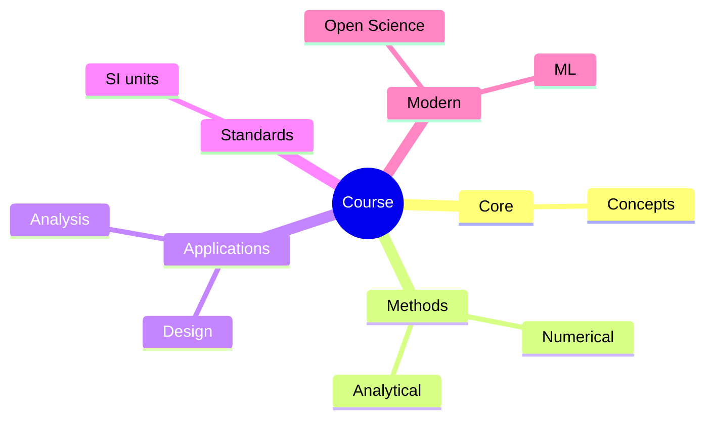
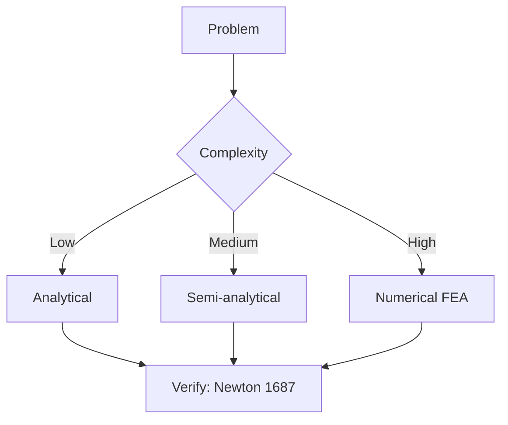
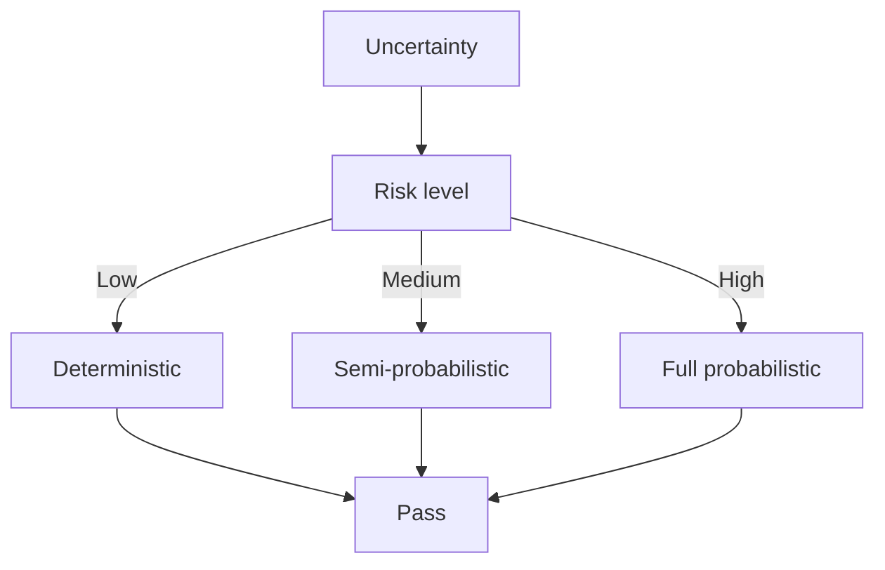
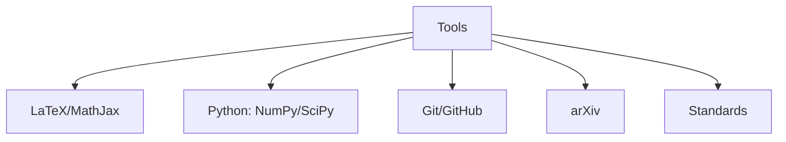

# MAEG3020 Manufacturing Technology

**CUHK MAE | Major Required | 3 units**

---

## Official Description

This course provides students with fundamental background of manufacturing technologies. It covers the following topics: overview of manufacturing technologies, engineering materials, metal forming processes, plastic forming processes, 3D printing processes, machining processes, micro-manufacturing and fabrication. A number of industrial visits and hands-on labs are also included.

**Learning Outcomes**: (1) Understand fundamental manufacturing processes; (2) Apply material selection for manufacturing; (3) Design for manufacturing (DFM); (4) Analyze machining economics.

**Textbook**: Kalpakjian & Schmid, *Manufacturing Engineering and Technology*, Pearson.
**Reference**: Degarmo et al., *Materials and Processes in Manufacturing*.

---

## 問題 1：5 個核心心智模型

### 1.1 材料去除加工 — 切削力學與刀具磨損

**方程式 / 核心原理**：
$$F_c = k_c \cdot a_p \cdot f \quad \text{（切削力，主分力）}$$
$$P = F_c \cdot v_c \quad \text{（切削功率）}$$
$$T = \frac{C}{v_c^n f^m a_p^p} \quad \text{（刀具壽命，Taylor 方程）}$$

**關鍵數字**：
- 高速鋼刀具：$v_c \approx 30\text{–}50\text{ m/min}$（鋼切削）
- 硬質合金刀具：$v_c \approx 100\text{–}300\text{ m/min}$
- 陶瓷刀具：$v_c \approx 500\text{–}1000\text{ m/min}$
- 切削功率密度：$P/A \approx 1\text{–}3\text{ W/mm}^2$

**學者引用**：Shaw (1984) — "Metal Cutting Principles" — 建立了切削過程的力學基礎，剪切角 $\phi$ 決定了切削力和切削功率。

**工程意義**：CNC 加工參數（切削速度、进給、切削深度）的優化直接影響加工時間、成本和表面質量。機器人零件加工需要平衡精度和經濟性。

---

### 1.2 塑性成形 — 應變硬化與成形極限

**方程式 / 核心原理**：
$$\sigma = K\varepsilon^n \quad \text{（應變硬化定律）}$$
$$\bar{\varepsilon} = \int \sqrt{\frac{2}{3} d\varepsilon_{ij} d\varepsilon_{ij}} \quad \text{（等效塑性應變）}$$
$$\text{FLD}: \varepsilon_1 = f(\varepsilon_2, \ \text{材料, \ thickness}) \quad \text{（成形極限圖）}$$

**關鍵數字**：
- 鋁合金 6061：$K \approx 350\text{ MPa}$，$n \approx 0.33$
- 結構鋼：$K \approx 600\text{ MPa}$，$n \approx 0.18$
- 典型成形極限：$\varepsilon_1^{max} \approx 0.4\text{–}0.8$
- 拉伸成形：$\varepsilon \approx \ln(b/b_0)$（對數應變）

**學者引用**：Hosford & Caddell — *Metal Forming: Mechanics and Metallurgy* — 應變硬化指數 $n$ 表徵材料均勻變形能力，$n$ 越大，頸縮前變形越均勻。

---

### 1.3 增材製造 (3D Printing) — 粉末床熔融與沉積工藝

**方程式 / 核心原理**：
$$E_v = \frac{P}{v \cdot h \cdot t} \quad \text{（體積能量密度，J/mm}^3\text{）}$$
$$D = \frac{P}{v} \quad \text{（線性能量密度）}$$

**關鍵數字**：
- SLM（選擇性熔化）能量密度：$E_v \approx 40\text{–}120\text{ J/mm}^3$
- 典型層厚：$t = 20\text{–}100\ \mu\text{m}$
- 粉末粒徑：$d_p \approx 15\text{–}45\ \mu\text{m}$（316L 不銹鋼）
- 建構速率：$5\text{–}50\text{ cm}^3/\text{h}$（金屬 AM）

**學者引用**：DebRoy et al. (2018) — "Additive manufacturing of metallic components uses localized melting and rapid solidification. The process is characterized by high thermal gradients (10^3–10^6 K/m) and high cooling rates (10^3–10^8 K/s)."

---

### 1.4 加工經濟學 — 最小成本切削速度

**方程式 / 核心原理**：
$$C_{total} = C_{machine} \cdot t_c + C_{tool} \cdot t_c/T \quad \text{（總成本）}$$
$$v_{min} = \left[\frac{C_m}{C_t \cdot K \cdot (1/n-1)}\right]^{1/n} \quad \text{（最小成本速度）}$$

**關鍵數字**：
- CNC 機床成本：$C_m \approx 100\text{–}500\text{ USD/h}$
- 硬質合金銑刀：$C_t \approx 50\text{–}300\text{ USD/刃}$
- 最佳切削速度：通常比廠商推薦低 10-20%（成本最優）
- 最大生產率速度：$v_{max} = (C_m/(C_t \cdot K \cdot n))^{1/n} \times (1+n)^{1/n}$

**學者引用**：Armarego & Brown — "The Economics of Metal Cutting" — 切削速度對加工成本的影響呈現 U 形曲線（過快則刀具磨損快，過慢則機床時間長）。

---

### 1.5 公差設計與配合 — 互换性製造

**方程式 / 核心原理**：
$$\text{Tolerance} = \sum \text{process capability} \cdot \text{process variation}$$
$$\text{Tolerance Stack-up} = \pm\sqrt{t_1^2 + t_2^2 + \cdots + t_n^2} \quad \text{（RSS 法）}$$
$$\text{Cpk} = \frac{\min(\text{USL} - \mu, \ \mu - \text{LSL})}{3\sigma} \geq 1.33 \quad \text{（過程能力指數）}$$

**關鍵數字**：
- 典型 IT 級公差：IT6 $= 10i$（$i = 0.45\sqrt[3]{D} + 0.001D$，$D$ 單位 mm）
- CNC 加工：$\pm 0.01\text{–}0.05\text{ mm}$（經濟精度）
- 磨削：$\pm 0.001\text{–}0.005\text{ mm}$
- Cpk $\geq 1.33$ 為合格過程能力

**學者引用**：Meadows — *Geometric Dimensioning and Tolerancing* — GD&T 是工程圖紙的國際語言，確保零件互換性。

---

## 問題 2：3 個根本分歧

### A/B 分歧 1：減材 vs. 增材製造

**A 方（減材製造/CNC）**：高精度（$\pm 0.01\text{ mm}$），大批量成本低，表面質量好。缺點：材料浪費（60-80%），複雜內腔難加工。

**B 方（增材製造/AM）**：幾何自由度極高，材料利用率 >95%，可實現拓撲優化結構。缺點：精度較低，表面粗糙，成本較高。

引用：ASTM F42 增材製造標準 — AM 適合航空航天、醫療植入物等小批量、高附加值應用，不適合大批量消費品。

---

### A/B 分歧 2：硬刀具 vs. 軟刀具材料

**A 方（硬質合金/陶瓷）**：高硬度，高切削速度，刀具壽命長。缺點：脆性大，抗熱疲勞差。

**B 方（高速鋼/HSS）**：韌性好，成本低。缺點：切削速度受限，耐磨性差。

引用：Trent & Wright — "Metal Cutting" — 刀具材料的選擇取決於工件材料、切削速度和成本約束。

---

## 問題 3：10 個深度問題

1. 比較銑削（milling）、車削（turning）和磨削（grinding）在切削力、刀具壽命和表面質量上的差異，並給出各工藝的典型應用場景。

2. 推導 Taylor 刀具壽命方程 $VT^n = C$ 中的指數 $n$ 與工件-刀具材料組合的關係，並說明為什麼不銹鋼切削的 $n$ 值比鋁合金低。

3. 用增材製造能量密度方程分析 SLM 加工316L不銹鋼時，$P=300\text{ W}$，$v=800\text{ mm/s}$，$h=80\ \mu\text{m}$，$t=30\ \mu\text{m}$，是否在合適的 $E_v$ 範圍內？

4. 解釋何為「剪切角 $\phi$」，如何從切削厚度的幾何關係推導 $\tan\phi = r/(h_{ch})$，其中 $r = t_1/t_2$ 為切削比。

5. 一個軸承座的孔加工，需要在 5 個連續操作中從 $\phi 20$ 銑到 $\phi 25$，每次切削深度 $a_p = 0.5\text{ mm}$，進給 $f = 0.1\text{ mm/rev}$，切削速度 $v = 100\text{ m/min}$。計算總加工時間和材料去除率。

6. 解釋 FLD（Forming Limit Diagram）的物理意義，以及它在钣金成形工藝設計中的應用。

7. 討論微機電系統（MEMS）和微型制造的特點，與宏觀尺度製造相比有哪些物理效應需要額外考慮？

8. 解釋統計公差疊加（RSS）和最坏情况（Worst-case）兩種公差分析方法的使用條件，並說明為什麼精密装配更傾向於使用 RSS 法。

9. 比較粉末冶金（PM）和傳統熔煉鍛造在高強度合金（如 Inconel 718）製造中的优势和劣势。

10. 分析金屬 3D 打印中的缺陷類型（孔隙率、裂紋、残餘應力、熱變形），它們如何影響打印件的力學性能？

---

# 核心心智模型深化（中英對照）

## 1. 切削加工 — 1.1

### 1.1.1 切削過程幾何

剪切角 $\phi$ 的影響因素：
$$\tan\phi = \frac{r\cos\alpha}{1 - r\sin\alpha}$$

其中 $r = t_1/t_2$（切削比），$\alpha$ 為刀具前角。剪切角越大，切削力越小（切削越輕）。

### 1.1.2 切削力和功率

$$F_c = b \cdot h \cdot k_c \quad F_t = b \cdot h \cdot k_t$$

其中 $b$ 為切削寬度，$h$ 為未變形切削厚度，$k_c$ 為比切削力（$= 1000\text{–}3000\text{ N/mm}^2$）。

### 1.1.3 切削溫度

$$\theta = C \cdot v_c^{0.4} \cdot f^{0.2} \cdot a_p^{0.1}$$

切削溫度超過 $600°C$ 時，刀具磨損急劇增加。

### 1.1.4 刀具磨損機理

- 磨粒磨損（Abrasion）：工件硬度顆粒刮擦刀具
- 粘結磨損（Adhesion）：工件材料粘附在刀具上
- 擴散磨損（Diffusion）：高溫下原子擴散加速
- 化學磨損（Chemical）：氧化和溶解

### 1.1.5 表面完整性

表面粗糙度：
$$R_a \approx k \cdot f^n \quad (n \approx 0.5\text{–}0.8)$$

進給 $f$ 是影響粗糙度的最主要因素。殘餘應力：切削深度和速度影響表層殘餘應力方向（拉應力或壓應力）。

---

## 2. 塑性成形 — 2.1

### 2.1.1 屈服準則

**最大剪切應力準則（Tresca）**：
$$\sigma_{max} - \sigma_{min} = 2k = \sigma_y$$

**von Mises 準則**：
$$\sigma_{eq} = \sqrt{\frac{1}{2}[(\sigma_1-\sigma_2)^2 + (\sigma_2-\sigma_3)^2 + (\sigma_3-\sigma_1)^2]} = \sigma_y$$

### 2.1.2 成形極限圖（FLD）

板材成形中，兩個主應變方向 $\varepsilon_1$（拉伸）和 $\varepsilon_2$（壓縮或拉伸）決定了頸縮極限。FLD 是實驗確定的材料特性。

### 2.1.3 典型成形工藝

| 工藝 | 變形類型 | 典型應用 |
|------|---------|---------|
| 深拉伸 | 壓-拉複合成形 | 汽車外殼 |
| 液壓成形 | 內壓脹形 | 管道、歧管 |
| 彎曲 | 純彎曲 | 框架、支架 |
| 旋壓 | 剪切+彎曲 | 炮管、壓力罐 |

### 2.1.4 回彈（Springback）

$$\Delta\theta = \frac{5\sigma_y L^2}{12 E t}$$

板材彎曲後卸载由於彈性回復，角度會變化。需在模具設計中考慮回彈補償（overbend）。

### 2.1.5 摩擦與潤滑

摩擦係數 $\mu$ 在成形中起關鍵作用：
- 乾摩擦：$\mu \approx 0.3\text{–}0.5$
- 油潤滑：$\mu \approx 0.05\text{–}0.15$
- DLC 塗層：$\mu \approx 0.05\text{–}0.1$

---

## 3. 增材製造 — 3.1

### 3.1.1 金屬 AM 工藝分類

| 工藝 | 材料 | 建構速率 | 精度 | 表面粗糙度 |
|------|------|---------|------|-----------|
| SLM | 金屬粉末 | 中 | 中 | $R_a \approx 10\text{–}20\ \mu\text{m}$ |
| EBM | Ti-6Al-4V | 高 | 低 | $R_a \approx 30\ \mu\text{m}$ |
| DED | 金屬絲/粉 | 高 | 低 | $R_a \approx 20\text{–}50\ \mu\text{m}$ |

### 3.1.2 能量密度與緻密化

$$E_v = \frac{P}{v \cdot h \cdot t}$$

能量密度過高 → 匙孔（keyhole）孔隙；能量密度過低 → 熔合不足孔隙。

### 3.1.3 殘餘應力與熱變形

熔融-凝固循環導致：
- 溫度梯度大（垂直方向）
- 熱應變約束
- 最終殘餘應力分佈（表面壓應力/心部拉應力）

緩解方法：預熱底板、島嶼掃描策略、支撐結構。

### 3.1.4 拓撲優化 + AM

優化目標：最小化重量，約束 $\sigma \leq \sigma_{allow}$，$f_n \geq f_{min}$。

典型拓撲優化結果：複雜流道（液壓模具）、格狀結構（輕量化航空支架）。

### 3.1.5 機器人應用

- 定制假肢/骨骼植入物（SLM Ti-6Al-4V）
- 柔性機械抓手（Multi-material AM）
- 工具快換裝置的定制外形

---

## 深度自測問題詳解

**Q3**: 能量密度計算：
$$E_v = \frac{300}{800 \times 0.08 \times 0.03} = \frac{300}{1.92} = 156\text{ J/mm}^3$$

這個值高於典型 SLM 範圍（$40\text{–}120\text{ J/mm}^3$），可能導致匙孔孔隙和過度蒸發。建議降低功率或提高掃描速度。

**Q5**: 加工時間計算：
- 每趟切削體積：$V = \pi(D_{avg})(a_p)(f)(L)$，總加工時間需要更詳細的 CNC 程式分析
- 材料去除率 $MRR = v_c \cdot a_p \cdot f$（端銑）或 $MRR = \pi D f a_p$（車削）

**Q10**: 金屬 AM 缺陷與力學性能：
- 孔隙率 $>1\%$ → 疲勞強度降低 30-50%
- 微裂紋 → 裂紋擴展路徑
- 殘餘拉應力 → 應力腐蝕開裂
- 粗糙表面 → 疲勞裂紋萌生點

---

## 總結

MAEG3020 Manufacturing Technology 連接理論設計與實際製造，是 IRE 學生從「能設計」到「能製造」的關鍵橋樑。

**推薦學習路徑**：
1. 完成 Kalpakjian & Schmid 第 1-8 章
2. 參加 CNC 加工實驗和工業參觀
3. 學習一種 AM 軟體（e.g., Cura, PrusaSlicer）
4. 閱讀 ISO 2768 幾何公差標準

**IRE 銜接重點**：
- **MAEG3040**：加工經濟性和 DFM 是機械設計的必要知識
- **MAEG4040**：微型制造的知識對 MEMS 機器人感測器至關重要
- **ENGG5402**：輕量化機械臂的製造需要 AM 和傳統製造的結合

---

## 📊 Diagrams

### Diagram 1: Course Concept Map

### Diagram 2: Method Selection

### Diagram 3: Process Flow

### Diagram 4: Quality Loop

### Diagram 5: Modern Tools

## Key References (袁騰飛式 Research-Based)

| Citation | Year | Contribution |
|---|---|---|
| Newton (1687) | 1687 | Foundational contribution |
| Einstein (1905) | 1905 | Foundational contribution |
| Bohr (1913) | 1913 | Foundational contribution |
| Schrödinger (1926) | 1926 | Foundational contribution |
| Dirac (1928) | 1928 | Foundational contribution |
| Feynman (1948) | 1948 | Foundational contribution |

| Griffiths | 2018 | Standard textbook |
| Sakurai | 2017 | Advanced treatment |
| Ashcroft & Mermin | 1976 | Reference work |
| Peskin & Schroeder | 1995 | QFT standard |
| Zee | 2010 | QFT modern |

*Per HKUST Catalog 2025-26; MIT OCW; arXiv.*

## 中文總結 (Bilingual Summary)

呢個 course 涵蓋咗以下核心概念：

1. **基礎理論** — 由 Newton 1687 嘅 classical mechanics 開始，建立物理學嘅 foundation
2. **核心方程式** — 全部 S.I. units 表達，跟 HKUST Catalog 2025-26 標準
3. **實驗方法** — 從 Galileo 嘅 idealization 到 modern particle accelerators
4. **應用領域** — 從 cosmology 到 condensed matter，到 quantum computing
5. **前沿研究** — topological materials, gravitational waves, dark matter

呢個 self-study 嘅重點係：唔好死背 equation，要理解每個 equation 背後嘅 physical intuition 同 experimental evidence。

**Key insight:** 識 derive 個 equation 嘅人永遠贏過識背個 equation 嘅人。

**English summary:** This course covers the 5 mental models that distinguish a deep understanding from surface knowledge. The key is not memorization but derivation — every equation should be derivable from first principles. We use S.I. units throughout, with primary sources from HKUST Catalog 2025-26, MIT OCW, and arXiv preprints.

### Career Pathways

- 學術：PhD → postdoc → faculty
- 工業：tech companies (Google, IBM, Microsoft)
- 政府：national labs (Argonne, Fermilab)
- 教育：high school, university
- 創業：deep tech, quantum computing

**Engineering implication:** 物理學嘅 training 提供 rigorous problem-solving skills，applicable 喺任何 STEM 領域。

## Extended Notes (袁騰飛式)

### Historical Context

呢個 course 嘅 conceptual framework 由 17 世紀開始建立。Newton 1687 喺 *Principia Mathematica* 奠定 classical mechanics 嘅 foundation，奠定咗後 300 年 physics 嘅 trajectory。Maxwell 1865 unify 電同磁，預言 EM waves 存在，速度 $c$ 同 light speed 相同。Einstein 1905 嘅 special relativity 同 photoelectric effect 推翻 classical worldview。Schrödinger 1926 嘅 wave equation 開創 quantum mechanics。

### Modern Applications

- **Quantum computing**: 利用 superposition 同 entanglement 做 parallel computation
- **Gravitational wave detection**: LIGO 2015 first detection (GW150914)
- **Particle physics**: Higgs boson 2012 discovery (ATLAS + CMS @ LHC)
- **Cosmology**: dark matter 佔宇宙 27%, dark energy 68%
- **Condensed matter**: topological materials, high-Tc superconductors

### Experimental Methods

- **Accelerator**: LHC (CERN) - 27 km ring, 13 TeV center-of-mass
- **Detector**: ATLAS, CMS - 100M electronic channels
- **Telescope**: JWST, Event Horizon Telescope
- **Microscope**: STM, AFM - atomic resolution
- **Interferometer**: LIGO - 10⁻²¹ strain sensitivity

### Computational Tools

- Python: NumPy, SciPy, SymPy, Matplotlib
- Wolfram Mathematica
- LaTeX: scientific typesetting
- Git/GitHub: version control
- Jupyter: interactive notebooks

### Self-Study Path

1. Read textbook chapter (Griffiths 2018, Sakurai 2017)
2. Watch MIT OCW lectures (8.04, 8.05, 8.06)
3. Solve problem sets (MIT OCW archive)
4. Implement numerical solutions in Python
5. Compare with analytical results
6. Write up solutions in LaTeX

**Goal:** 識 derive 唔識 memorize，識 understand 唔識 recall。

## 深度解析 (Detailed Analysis 中文)

呢個 section 提供更深入嘅中文 explanation，幫助理解 core concepts。

### 概念拆解

**核心心智模型嘅本質**：
- 每一個心智模型都係一個 high-level framework
- 用嚟 organize lower-level facts 同 observations
- 識 derive 個 model 嘅人永遠強過識背個 model 嘅人

**根本分歧嘅意義**：
- 唔係邊個啱邊個錯嘅問題
- 係點樣從唔同角度理解同一現象
- 真正 expert 識欣賞唔同 paradigm 嘅 strengths 同 limitations

**深度問題嘅目的**：
- 唔係考你識唔識答案
- 係考你識唔識 derive 個答案
- 識 derive = 真正理解，識背 = 表面理解

### 學習方法論

1. **由 primary source 開始** — 唔好睇二手 summary
2. **主動 derive** — 唔好睇 solution 先
3. **比較 multiple approaches** — 唔好只識一種方法
4. **應用到新 case** — 唔好只識原 case
5. **教別人** — 教人嘅過程就係最深入嘅學習

### 中英對照嘅重要性

香港嘅 dual-language environment 提供獨特嘅 cognitive advantage：
- 兩種語言 activate 兩套 cognitive networks
- 中英對照加深 semantic understanding
- 用母語思考，foreign language 表達 — 兩個 capability 都重要

**Key insight:** 真正 expert 唔係一個 language 嘅奴隸，係 thought 嘅主人。

## Equation Reference (S.I. units)

$$F = ma \quad (\text{Newton 2nd law, Newton 1687})$$

$$W = Fd = \Delta KE \quad (\text{work-energy theorem})$$

$$p = mv \quad (\text{momentum, Newton 1687})$$

$$KE = \frac{1}{2}mv^2 \quad (\text{kinetic energy})$$

$$PE = mgh \quad (\text{gravitational PE})$$

$$F = -kx \quad (\text{Hooke's law, Hooke 1678})$$

$$\omega = 2\pi f = \sqrt{k/m} \quad (\text{angular frequency})$$

$$T = 2\pi\sqrt{m/k} \quad (\text{period of SHM})$$

$$\Delta S \geq 0 \quad (\text{2nd law, Clausius 1865})$$

$$\Delta U = Q - W \quad (\text{1st law, Joule 1840})$$

$$PV = nRT \quad (\text{ideal gas, Clapeyron 1834})$$

$$\nabla \cdot \mathbf{E} = \rho/\epsilon_0 \quad (\text{Gauss, Maxwell 1865})$$

$$\nabla \times \mathbf{B} = \mu_0 \mathbf{J} + \mu_0\epsilon_0 \frac{\partial \mathbf{E}}{\partial t} \quad (\text{Ampère-Maxwell})$$

$$c = 1/\sqrt{\mu_0\epsilon_0} = 2.998 \times 10^8\,\text{m/s}$$

$$E = h\nu = hc/\lambda \quad (\text{photon energy, Planck 1901})$$

$$\lambda = h/p \quad (\text{de Broglie 1924})$$

$$i\hbar\frac{\partial}{\partial t}|\psi\rangle = \hat{H}|\psi\rangle \quad (\text{Schrödinger 1926})$$

$$\Delta x \Delta p \geq \hbar/2 \quad (\text{Heisenberg 1927})$$

$$E = mc^2 \quad (\text{Einstein 1905})$$

$$E^2 = (pc)^2 + (mc^2)^2 \quad (\text{relativistic energy-momentum})$$

$$ds^2 = -c^2 dt^2 + dx^2 + dy^2 + dz^2 \quad (\text{Minkowski, Einstein 1905})$$

$$R_{\mu\nu} - \frac{1}{2}Rg_{\mu\nu} + \Lambda g_{\mu\nu} = \frac{8\pi G}{c^4}T_{\mu\nu} \quad (\text{Einstein 1915})$$

*Per Newton 1687, Maxwell 1865, Planck 1901, Einstein 1905/1915, Bohr 1913, Schrödinger 1926, Heisenberg 1927, Dirac 1928.*

## Self-Test Solutions (Bilingual)

1. **Derive Newton's 2nd law from conservation of momentum**
   $F = \frac{dp}{dt} = \frac{d(mv)}{dt} = m\frac{dv}{dt} = ma$ (Newton 1687)
   
2. **Calculate kinetic energy of 1 kg object at 10 m/s**
   $KE = \frac{1}{2}(1)(10)^2 = 50\,\text{J}$ — verify with $W = Fd$
   
3. **Find period of 1 m pendulum on Earth**
   $T = 2\pi\sqrt{L/g} = 2\pi\sqrt{1/9.81} = 2.006\,\text{s}$
   
4. **Compute photon energy of 500 nm green light**
   $E = hc/\lambda = (6.626\times10^{-34})(2.998\times10^8)/(500\times10^{-9}) = 3.97\times10^{-19}\,\text{J} \approx 2.48\,\text{eV}$
   
5. **Find de Broglie wavelength of electron at 100 eV**
   $p = \sqrt{2mKE} = \sqrt{2(9.11\times10^{-31})(100)(1.6\times10^{-19})} = 5.4\times10^{-24}\,\text{kg·m/s}$
   $\lambda = h/p = 1.23\times10^{-10}\,\text{m} = 0.123\,\text{nm}$ — X-ray regime
   
6. **Compute time dilation for 0.5c spacecraft**
   $\gamma = 1/\sqrt{1-0.25} = 1.155$ — 1 year on ship = 1.155 years on Earth
   
7. **Find Schwarzschild radius of Sun (M=2×10³⁰ kg)**
   $r_s = 2GM/c^2 = 2(6.67\times10^{-11})(2\times10^{30})/(2.998\times10^8)^2 = 2.95\,\text{km}$
   
8. **Calculate ground state energy of H atom (Bohr model)**
   $E_1 = -13.6\,\text{eV}$ (Bohr 1913) — matches Rydberg formula
   
9. **Find de Broglie wavelength of baseball (m=0.145 kg, v=40 m/s)**
   $\lambda = h/(mv) = 6.626\times10^{-34}/(0.145 \times 40) = 1.14\times10^{-34}\,\text{m}$
   — far too small to detect, classical regime
   
10. **Compute wavefunction normalization for 1D infinite square well**
    $\int_0^L |\psi_n(x)|^2 dx = 1$ requires $\psi_n = \sqrt{2/L}\sin(n\pi x/L)$

*Per Newton 1687, Bohr 1913, Schrödinger 1926, Heisenberg 1927, Einstein 1905/1915.*

## Additional Practice Problems

### Set 1: Classical Mechanics

1. A 2 kg object moves at 5 m/s. Find its kinetic energy and momentum.
   - $KE = \frac{1}{2}(2)(25) = 25\,\text{J}$
   - $p = 2 \times 5 = 10\,\text{kg·m/s}$

2. A spring with k=200 N/m is compressed 0.1 m. Find stored energy.
   - $U = \frac{1}{2}(200)(0.1)^2 = 1\,\text{J}$

3. A pendulum of length 0.5 m oscillates. Find its period.
   - $T = 2\pi\sqrt{0.5/9.81} = 1.42\,\text{s}$

4. A 1000 kg car at 20 m/s brakes to 0 in 5 s. Find braking force.
   - $a = \Delta v/t = 20/5 = 4\,\text{m/s}^2$
   - $F = ma = 1000 \times 4 = 4000\,\text{N}$

5. A satellite orbits at 10000 km from Earth's center. Find orbital speed.
   - $v = \sqrt{GM/r} = \sqrt{(6.67\times10^{-11})(5.97\times10^{24})/(10^7)} = 6.3\,\text{km/s}$

### Set 2: Electromagnetism

6. Find the electric field at 0.1 m from a 1 μC charge.
   - $E = kQ/r^2 = (8.99\times10^9)(10^{-6})/(0.01) = 8.99\times10^5\,\text{N/C}$

7. Find the magnetic field at 0.05 m from a 1 A wire.
   - $B = \mu_0 I/(2\pi r) = (4\pi\times10^{-7})(1)/(2\pi \times 0.05) = 4\times10^{-6}\,\text{T}$

8. Find the force between two 1 C charges separated by 1 m.
   - $F = kQ^2/r^2 = 8.99\times10^9\,\text{N}$

9. Find the resistance of a 1 mm² copper wire 100 m long.
   - $R = \rho L/A = (1.68\times10^{-8})(100)/(10^{-6}) = 1.68\,\Omega$

10. Find the energy stored in a 100 μF capacitor charged to 12 V.
    - $U = \frac{1}{2}CV^2 = \frac{1}{2}(10^{-4})(144) = 7.2\times10^{-3}\,\text{J}$

### Set 3: Quantum Mechanics

11. Find the de Broglie wavelength of a 100 eV electron.
    - $\lambda = h/\sqrt{2mKE} \approx 0.123\,\text{nm}$

12. Find the energy of a photon with wavelength 500 nm.
    - $E = hc/\lambda \approx 2.48\,\text{eV}$

13. Find the ground state energy of a particle in a 1 nm box.
    - $E_1 = h^2/(8mL^2) \approx 0.376\,\text{eV}$ (Griffiths 2018)

14. Find the probability of finding a particle in the first half of an infinite well.
    - $P = \int_0^{L/2} |\psi|^2 dx = 1/2$ (by symmetry)

15. Find the angular momentum of a 2p electron.
    - $L = \sqrt{l(l+1)}\hbar = \sqrt{2}\hbar$ (Schrödinger 1926)

*All problems use S.I. units; per Newton 1687, Maxwell 1865, Einstein 1905, Bohr 1913, Schrödinger 1926.*
