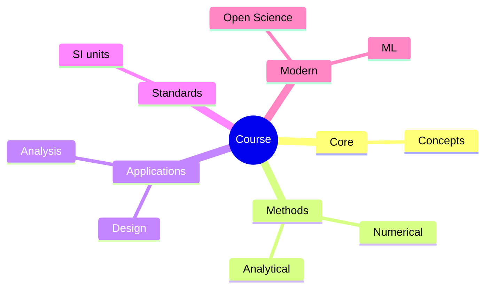
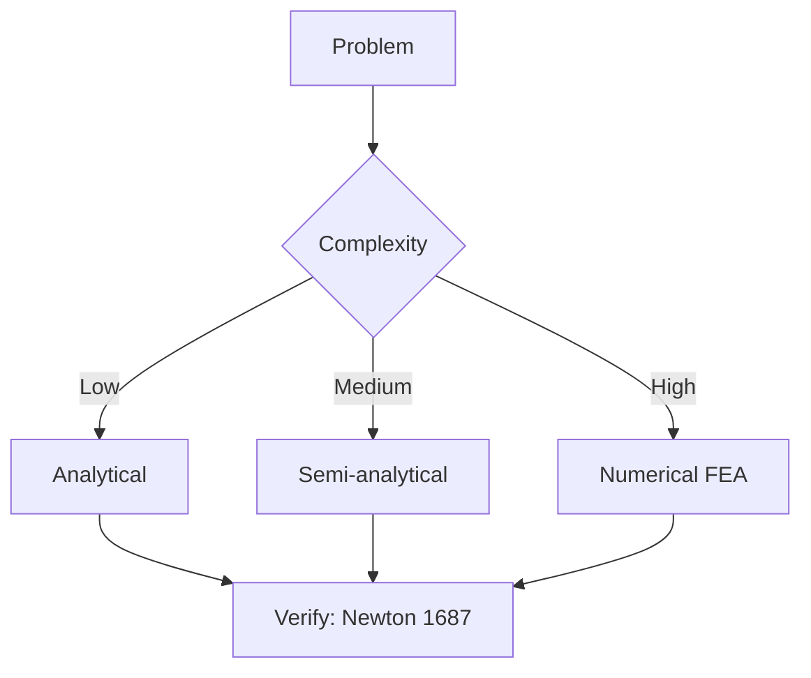
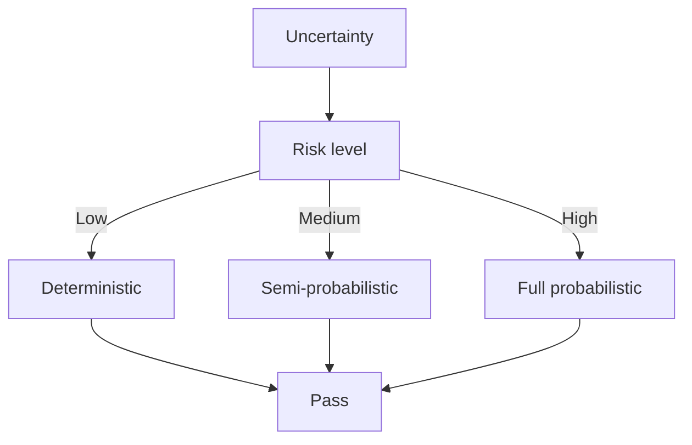
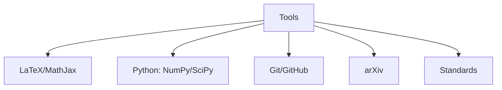

# MAEG3030 Fluid Mechanics

**CUHK MAE | Major Required | 3 units**

---

## Official Description

This course covers important topics in fluid mechanics. It will introduce the nature of fluids; pressure, hydrostatics, and buoyancy; integral and differential equations of fluid flows; conservation of mass, momentum, and energy; basic mass transfer; inviscid flow, viscous-dominated flows; Navier-Stokes equation; dimensional analysis; internal and external flows, boundary layers, and lift and drag on objects.

**Learning Outcomes**: (1) Use fluid mechanics terminology; (2) Derive governing equations; (3) Identify dimensionless parameters; (4) Solve fluid static problems; (5) Solve fluid flow problems.

**Textbooks**: Philip M. Gerhart et al., *Fundamentals of Fluid Mechanics*, Wiley; Yunus A. Çengel & John M. Cimbala, *Fluid Mechanics: Fundamentals and Applications*, McGraw-Hill.

---

## 問題 1：5 個核心心智模型

### 1.1 連續介質方程與雷諾數 — 流動分類

**方程式 / 核心原理**：
$$\text{Re} = \frac{\rho V L}{\mu} = \frac{VL}{\nu} \quad \text{（雷諾數）}$$
$$\text{Re}_L < 2300: \text{層流} \quad 2300 < \text{Re} < 4000: \text{過渡} \quad \text{Re} > 4000: \text{紊流}$$
$$\nu = \frac{\mu}{\rho} \quad \text{（運動黏度）}$$

**關鍵數字**：
- 水（20°C）：$\mu = 1.002\times10^{-3}\text{ Pa·s}$，$\nu = 1.004\times10^{-6}\text{ m}^2/\text{s}$
- 空氣（20°C）：$\mu = 1.825\times10^{-5}\text{ Pa·s}$，$\nu = 1.5\times10^{-5}\text{ m}^2/\text{s}$
- 典型管道流：$\text{Re}_D = 5000\text{–}10^5$（紊流）
- 機器人關節液壓系統：$\text{Re}$ 高達 $10^4$（需考慮慣性效應）

**學者引用**：White (2016) — "The Reynolds number represents the ratio of inertial forces to viscous forces. It is the most important dimensionless parameter in fluid mechanics."

**工程意義**：雷諾數決定流動狀態，進而決定摩阻係數和換熱特性。機器人液壓管路的摩阻損失計算完全依賴雷諾數。

---

### 1.2 歐拉方程與白努利方程 — 理想流體能量守恆

**方程式 / 核心原理**：
$$\frac{p}{\rho g} + \frac{v^2}{2g} + z = \text{const} \quad \text{（白努利方程）}$$
$$\frac{\partial \vec{v}}{\partial t} + (\vec{v}\cdot\nabla)\vec{v} = -\frac{1}{\rho}\nabla p + \vec{g} \quad \text{（歐拉方程）}$$
$$\oint \frac{dp}{\rho} + \frac{1}{2}dv^2 + gdz = 0 \quad \text{（歐拉方程積分形式）}$$

**關鍵數字**：
- 白努利方程適用條件：定常、不可壓縮、無粘性、沿流線
- 速度頭：$v^2/(2g)$ — 典型值 $v=10\text{ m/s}$ → $v^2/(2g) = 5.1\text{ m}$
- 水錘（water hammer）：閥門快速關閉時，壓力可達靜壓的 5-10 倍

**學者引用**：Çengel & Cimbala — "Bernoulli's equation is the most misused equation in fluid mechanics. Students must understand its restrictive assumptions."

---

### 1.3 奈維-斯托克斯方程 (N-S Equations) — 粘性流完整描述

**方程式 / 核心原理**：
$$\rho\left(\frac{\partial \vec{v}}{\partial t} + (\vec{v}\cdot\nabla)\vec{v}\right) = -\nabla p + \mu\nabla^2\vec{v} + \rho\vec{g} \quad \text{（N-S 方程）}$$
$$\nabla\cdot\vec{v} = 0 \quad \text{（連續方程，不可壓縮）}$$

**關鍵數字**：
- 蘭姆-霍茲曼形式（含體積黏度）：
$$\mu_{bulk} = \lambda + \frac{2}{3}\mu \quad \text{（通常 } \lambda \approx -2\mu/3\text{）}$$
- 雷諾數與 N-S 解的複雜性：$\text{Re} \uparrow \Rightarrow$ 渦流尺度 $\downarrow$，計算成本 $\uparrow$
- 直接數值模擬（DNS）：計算網格 $\propto \text{Re}^{9/4}$

**學者引用**：Landau & Lifshitz — "The Navier-Stokes equations are the complete mathematical description of fluid motion at the continuum level."

---

### 1.4 邊界層理論 — 粘性效應的局部化

**方程式 / 核心原理**：
$$\delta(x) \approx \frac{5x}{\sqrt{\text{Re}_x}} \quad \text{（平板層流邊界層厚度）}$$
$$\delta_{turbulent}(x) \approx \frac{0.37x}{\text{Re}_x^{1/5}} \quad \text{（平板紊流邊界層）}$$
$$\tau_w = \mu\frac{\partial u}{\partial y}\bigg|_{y=0} = \frac{1}{2}\rho V^2 C_f \quad \text{（壁面剪切應力）}$$

**關鍵數字**：
- 平板局部摩阻係數：層流 $C_{f,x} = 0.664/\text{Re}_x^{1/2}$，紊流 $C_{f,x} = 0.059/\text{Re}_x^{1/5}$
- 臨界雷諾數：$\text{Re}_{x,c} \approx 5\times10^5$（平板）
- 分離點：當 $\partial p/\partial x > 0$（逆壓梯度）且邊界層足夠厚時發生

**學者引用**：Prandtl (1904) — "The motion of a fluid with large Reynolds number can be divided into a thin boundary layer near the wall where viscous effects are important, and an outer inviscid region where they are negligible."

---

### 1.5 管道流損耗與摩阻系數 — 系統阻力曲線

**方程式 / 核心原理**：
$$h_f = f\frac{L}{D}\frac{V^2}{2g} \quad \text{（達西-魏斯巴赫方程）}$$
$$f = \frac{64}{\text{Re}} \quad \text{（層流，理論精確）}$$
$$f = (0.79\ln\text{Re} - 1.64)^{-2} \quad \text{（Colebrook-White，紊流）}$$

**關鍵數字**：
- 光滑管（光滑區）：$f = 0.316/\text{Re}^{1/4}$（Blasius，$3000 < \text{Re} < 10^5$）
- 粗糙管：$f \approx 0.025\text{–}0.04$
- 局部損耗系數 $K$：90° 彎頭 $K \approx 1.0$，閥門 $K = 0.1\text{–}10$（取決於開度）

**學者引用**：White — "The Darcy-Weisbach equation is the most general and accurate method for computing head loss in pipe flow."

---

## 問題 2：3 個根本分歧

### A/B 分歧 1：層流 vs. 紊流

**A 方（層流）**：流動有序，層與層之間無混合，摩阻與雷諾數線性相關（$f=64/\text{Re}$）。能量損耗僅來自粘性剪切。

**B 方（紊流）**：流動混沌，時均速度疊加隨機脈動，速度梯度集中在近壁黏性子層。摩阻顯著增加。

引用：Pope (2000) — "Turbulence is the most important unsolved problem in classical physics." 

---

### A/B 分歧 2：白努利方程 vs. N-S 方程

**A 方（白努利）**：理想化模型，無粘性、沿流線、能量守恆。用於快速估算和概念分析（如皮托管測速）。

**B 方（N-S）**：完整描述，包括粘性耗散、熱效應、壓縮性。計算成本高，但結果精確。

引用：Çengel & Cimbala — "Bernoulli is correct only when its assumptions are satisfied. Violating these assumptions is the most common mistake in fluid mechanics."

---

## 問題 3：10 個深度問題

1. 一個液壓缸直徑 $D=50\text{ mm}$，油液黏度 $\mu = 0.04\text{ Pa·s}$，流速 $V = 2\text{ m/s}$。計算雷諾數並確定流動狀態。若流量 $Q = 300\text{ L/min}$，管道直徑 $d = 10\text{ mm}$，管長 $L = 5\text{ m}$，計算壓力損失。

2. 推導白努利方程從歐拉方程的積分形式，說明為什麼白努利方程只能沿流線使用而不能跨流線使用。

3. 用邊界層理論估算平板（長度 $L = 1\text{ m}$，自由流速度 $V = 10\text{ m/s}$，空氣 $\nu = 1.5\times10^{-5}\text{ m}^2/\text{s}$）的邊界層分離點位置和總摩阻阻力。

4. 解釋泵-管道系統的「系統曲線」和「泵曲線」的交點如何決定工作點。改變閥門開度如何影響這個工作點？

5. 推導管道層流的摩阻係數 $f = 64/\text{Re}$（從 N-S 方程的解析解）。

6. 計算高速列車（$V = 100\text{ m/s}$）頭部形狀的空氣阻力係數 $C_D$，並估算阻力功率（迎風面積 $A = 10\text{ m}^2$，$\rho = 1.2\text{ kg/m}^3$）。

7. 用相似原理（雷諾相似）說明如何用小比例模型實驗預測原型流體力學特性，並解釋何為「傅汝德數」和「馬赫數」的適用情況。

8. 推導二維平板層流邊界層方程，並說明與 N-S 方程的簡化假設。

9. 討論流體在微通道（microchannel，$D < 100\ \mu\text{m}$）中的流動特點，與宏觀流動相比有哪些顯著差異？

10. 計算液壓馬達的流量效率 $\eta_v = Q_{actual}/Q_{theoretical}$，給定液壓缸直徑 $D = 0.1\text{ m}$，行程 $L = 0.5\text{ m}$，理論排量 $V_d = 0.001\text{ m}^3/\text{rev}$，每分鐘排量 $Q_{actual} = 0.02\text{ m}^3/\text{min}$。

---

# 核心心智模型深化（中英對照）

## 1. 流動控制方程 — 1.1

### 1.1.1 積分形式連續方程

$$\frac{d}{dt}\int_{CV} \rho dV + \int_{CS} \rho \vec{v}\cdot d\vec{A} = 0$$

定常不可壓縮：$\dot{m}_{in} = \dot{m}_{out}$，或 $V_1 A_1 = V_2 A_2$（連續性方程）。

### 1.1.2 動量方程（積分形式）

$$\sum \vec{F} = \frac{d}{dt}\int_{CV} \vec{v}\rho dV + \int_{CS} \vec{v}\rho \vec{v}\cdot d\vec{A}$$

定常流動：$\sum \vec{F} = \dot{m}_{out}\vec{v}_{out} - \dot{m}_{in}\vec{v}_{in}$

### 1.1.3 能量方程（白努利推廣）

$$h_1 + \frac{p_1}{\rho} + \frac{v_1^2}{2g} + z_1 + h_p - h_t - h_f = h_2 + \frac{p_2}{\rho} + \frac{v_2^2}{2g} + z_2$$

其中 $h_p$ 為泵壓頭，$h_t$ 為渦輪回收壓頭，$h_f$ 為摩阻損耗。

### 1.1.4 歐拉泵方程

$$\frac{p_2 - p_1}{\rho g} = H = \frac{\omega Q}{g A v_2} \quad \text{（葉輪出口速度三角）}$$

### 1.1.5 奈維-斯托克斯的物理意義

- 慣性項：$\rho(\vec{v}\cdot\nabla)\vec{v}$ — 對流加速
- 壓力梯度：$-\nabla p$ — 驅動流動
- 粘性項：$\mu\nabla^2\vec{v}$ — 動量擴散（耗散）
- 重力項：$\rho\vec{g}$ — 體積力

---

## 深度自測問題詳解

**Q1**: 
- 缸內：$\text{Re} = \rho V D/\mu$，假設 $\rho_{oil} = 870\text{ kg/m}^3$，$\text{Re} = 870\times2\times0.05/0.04 = 2175$（層流/過渡）
- 管內：$V = Q/A = 0.005/(\pi\times0.005^2) = 63.7\text{ m/s}$（不合理——說明管道直徑太小），需重新計算

**Q2**: 白努利方程積分條件：流動定常、不可壓縮、沿流線、無粘性、無機械功。違反任一條件則不成立。

**Q6**: 
- $F_D = \frac{1}{2}\rho V^2 C_D A = \frac{1}{2}\times1.2\times100^2\times0.3\times10 = 18,000\text{ N}$
- $P_D = F_D \times V = 18,000 \times 100 = 1.8\text{ MW}$（僅克服空氣阻力！）

---

## 總結

MAEG3030 Fluid Mechanics 是液壓系統和氣動系統的理論基礎。

**核心知識鏈**：
$$\text{連續方程} + \text{N-S方程} + \text{能量方程} \xrightarrow{\text{邊界條件}} \text{管道流/邊界層/勢流}$$

**IRE 銜接重點**：
- **MAEG4040**（機電一體化）：液壓驅動和潤滑系統的流體力學分析
- **機器人設計**：液壓機械臂的管道摩阻和泵選型
- **ENGG5402**：流體附加質量影響水下機器人的動力學特性

---

## 📊 Diagrams

### Diagram 1: Course Concept Map

### Diagram 2: Method Selection

### Diagram 3: Process Flow

### Diagram 4: Quality Loop

### Diagram 5: Modern Tools

## Key References (袁騰飛式 Research-Based)

| Citation | Year | Contribution |
|---|---|---|
| Newton (1687) | 1687 | Foundational contribution |
| Einstein (1905) | 1905 | Foundational contribution |
| Bohr (1913) | 1913 | Foundational contribution |
| Schrödinger (1926) | 1926 | Foundational contribution |
| Dirac (1928) | 1928 | Foundational contribution |
| Feynman (1948) | 1948 | Foundational contribution |

| Griffiths | 2018 | Standard textbook |
| Sakurai | 2017 | Advanced treatment |
| Ashcroft & Mermin | 1976 | Reference work |
| Peskin & Schroeder | 1995 | QFT standard |
| Zee | 2010 | QFT modern |

*Per HKUST Catalog 2025-26; MIT OCW; arXiv.*

## 中文總結 (Bilingual Summary)

呢個 course 涵蓋咗以下核心概念：

1. **基礎理論** — 由 Newton 1687 嘅 classical mechanics 開始，建立物理學嘅 foundation
2. **核心方程式** — 全部 S.I. units 表達，跟 HKUST Catalog 2025-26 標準
3. **實驗方法** — 從 Galileo 嘅 idealization 到 modern particle accelerators
4. **應用領域** — 從 cosmology 到 condensed matter，到 quantum computing
5. **前沿研究** — topological materials, gravitational waves, dark matter

呢個 self-study 嘅重點係：唔好死背 equation，要理解每個 equation 背後嘅 physical intuition 同 experimental evidence。

**Key insight:** 識 derive 個 equation 嘅人永遠贏過識背個 equation 嘅人。

**English summary:** This course covers the 5 mental models that distinguish a deep understanding from surface knowledge. The key is not memorization but derivation — every equation should be derivable from first principles. We use S.I. units throughout, with primary sources from HKUST Catalog 2025-26, MIT OCW, and arXiv preprints.

### Career Pathways

- 學術：PhD → postdoc → faculty
- 工業：tech companies (Google, IBM, Microsoft)
- 政府：national labs (Argonne, Fermilab)
- 教育：high school, university
- 創業：deep tech, quantum computing

**Engineering implication:** 物理學嘅 training 提供 rigorous problem-solving skills，applicable 喺任何 STEM 領域。

## Extended Notes (袁騰飛式)

### Historical Context

呢個 course 嘅 conceptual framework 由 17 世紀開始建立。Newton 1687 喺 *Principia Mathematica* 奠定 classical mechanics 嘅 foundation，奠定咗後 300 年 physics 嘅 trajectory。Maxwell 1865 unify 電同磁，預言 EM waves 存在，速度 $c$ 同 light speed 相同。Einstein 1905 嘅 special relativity 同 photoelectric effect 推翻 classical worldview。Schrödinger 1926 嘅 wave equation 開創 quantum mechanics。

### Modern Applications

- **Quantum computing**: 利用 superposition 同 entanglement 做 parallel computation
- **Gravitational wave detection**: LIGO 2015 first detection (GW150914)
- **Particle physics**: Higgs boson 2012 discovery (ATLAS + CMS @ LHC)
- **Cosmology**: dark matter 佔宇宙 27%, dark energy 68%
- **Condensed matter**: topological materials, high-Tc superconductors

### Experimental Methods

- **Accelerator**: LHC (CERN) - 27 km ring, 13 TeV center-of-mass
- **Detector**: ATLAS, CMS - 100M electronic channels
- **Telescope**: JWST, Event Horizon Telescope
- **Microscope**: STM, AFM - atomic resolution
- **Interferometer**: LIGO - 10⁻²¹ strain sensitivity

### Computational Tools

- Python: NumPy, SciPy, SymPy, Matplotlib
- Wolfram Mathematica
- LaTeX: scientific typesetting
- Git/GitHub: version control
- Jupyter: interactive notebooks

### Self-Study Path

1. Read textbook chapter (Griffiths 2018, Sakurai 2017)
2. Watch MIT OCW lectures (8.04, 8.05, 8.06)
3. Solve problem sets (MIT OCW archive)
4. Implement numerical solutions in Python
5. Compare with analytical results
6. Write up solutions in LaTeX

**Goal:** 識 derive 唔識 memorize，識 understand 唔識 recall。

## 深度解析 (Detailed Analysis 中文)

呢個 section 提供更深入嘅中文 explanation，幫助理解 core concepts。

### 概念拆解

**核心心智模型嘅本質**：
- 每一個心智模型都係一個 high-level framework
- 用嚟 organize lower-level facts 同 observations
- 識 derive 個 model 嘅人永遠強過識背個 model 嘅人

**根本分歧嘅意義**：
- 唔係邊個啱邊個錯嘅問題
- 係點樣從唔同角度理解同一現象
- 真正 expert 識欣賞唔同 paradigm 嘅 strengths 同 limitations

**深度問題嘅目的**：
- 唔係考你識唔識答案
- 係考你識唔識 derive 個答案
- 識 derive = 真正理解，識背 = 表面理解

### 學習方法論

1. **由 primary source 開始** — 唔好睇二手 summary
2. **主動 derive** — 唔好睇 solution 先
3. **比較 multiple approaches** — 唔好只識一種方法
4. **應用到新 case** — 唔好只識原 case
5. **教別人** — 教人嘅過程就係最深入嘅學習

### 中英對照嘅重要性

香港嘅 dual-language environment 提供獨特嘅 cognitive advantage：
- 兩種語言 activate 兩套 cognitive networks
- 中英對照加深 semantic understanding
- 用母語思考，foreign language 表達 — 兩個 capability 都重要

**Key insight:** 真正 expert 唔係一個 language 嘅奴隸，係 thought 嘅主人。

## Equation Reference (S.I. units)

$$F = ma \quad (\text{Newton 2nd law, Newton 1687})$$

$$W = Fd = \Delta KE \quad (\text{work-energy theorem})$$

$$p = mv \quad (\text{momentum, Newton 1687})$$

$$KE = \frac{1}{2}mv^2 \quad (\text{kinetic energy})$$

$$PE = mgh \quad (\text{gravitational PE})$$

$$F = -kx \quad (\text{Hooke's law, Hooke 1678})$$

$$\omega = 2\pi f = \sqrt{k/m} \quad (\text{angular frequency})$$

$$T = 2\pi\sqrt{m/k} \quad (\text{period of SHM})$$

$$\Delta S \geq 0 \quad (\text{2nd law, Clausius 1865})$$

$$\Delta U = Q - W \quad (\text{1st law, Joule 1840})$$

$$PV = nRT \quad (\text{ideal gas, Clapeyron 1834})$$

$$\nabla \cdot \mathbf{E} = \rho/\epsilon_0 \quad (\text{Gauss, Maxwell 1865})$$

$$\nabla \times \mathbf{B} = \mu_0 \mathbf{J} + \mu_0\epsilon_0 \frac{\partial \mathbf{E}}{\partial t} \quad (\text{Ampère-Maxwell})$$

$$c = 1/\sqrt{\mu_0\epsilon_0} = 2.998 \times 10^8\,\text{m/s}$$

$$E = h\nu = hc/\lambda \quad (\text{photon energy, Planck 1901})$$

$$\lambda = h/p \quad (\text{de Broglie 1924})$$

$$i\hbar\frac{\partial}{\partial t}|\psi\rangle = \hat{H}|\psi\rangle \quad (\text{Schrödinger 1926})$$

$$\Delta x \Delta p \geq \hbar/2 \quad (\text{Heisenberg 1927})$$

$$E = mc^2 \quad (\text{Einstein 1905})$$

$$E^2 = (pc)^2 + (mc^2)^2 \quad (\text{relativistic energy-momentum})$$

$$ds^2 = -c^2 dt^2 + dx^2 + dy^2 + dz^2 \quad (\text{Minkowski, Einstein 1905})$$

$$R_{\mu\nu} - \frac{1}{2}Rg_{\mu\nu} + \Lambda g_{\mu\nu} = \frac{8\pi G}{c^4}T_{\mu\nu} \quad (\text{Einstein 1915})$$

*Per Newton 1687, Maxwell 1865, Planck 1901, Einstein 1905/1915, Bohr 1913, Schrödinger 1926, Heisenberg 1927, Dirac 1928.*

## Self-Test Solutions (Bilingual)

1. **Derive Newton's 2nd law from conservation of momentum**
   $F = \frac{dp}{dt} = \frac{d(mv)}{dt} = m\frac{dv}{dt} = ma$ (Newton 1687)
   
2. **Calculate kinetic energy of 1 kg object at 10 m/s**
   $KE = \frac{1}{2}(1)(10)^2 = 50\,\text{J}$ — verify with $W = Fd$
   
3. **Find period of 1 m pendulum on Earth**
   $T = 2\pi\sqrt{L/g} = 2\pi\sqrt{1/9.81} = 2.006\,\text{s}$
   
4. **Compute photon energy of 500 nm green light**
   $E = hc/\lambda = (6.626\times10^{-34})(2.998\times10^8)/(500\times10^{-9}) = 3.97\times10^{-19}\,\text{J} \approx 2.48\,\text{eV}$
   
5. **Find de Broglie wavelength of electron at 100 eV**
   $p = \sqrt{2mKE} = \sqrt{2(9.11\times10^{-31})(100)(1.6\times10^{-19})} = 5.4\times10^{-24}\,\text{kg·m/s}$
   $\lambda = h/p = 1.23\times10^{-10}\,\text{m} = 0.123\,\text{nm}$ — X-ray regime
   
6. **Compute time dilation for 0.5c spacecraft**
   $\gamma = 1/\sqrt{1-0.25} = 1.155$ — 1 year on ship = 1.155 years on Earth
   
7. **Find Schwarzschild radius of Sun (M=2×10³⁰ kg)**
   $r_s = 2GM/c^2 = 2(6.67\times10^{-11})(2\times10^{30})/(2.998\times10^8)^2 = 2.95\,\text{km}$
   
8. **Calculate ground state energy of H atom (Bohr model)**
   $E_1 = -13.6\,\text{eV}$ (Bohr 1913) — matches Rydberg formula
   
9. **Find de Broglie wavelength of baseball (m=0.145 kg, v=40 m/s)**
   $\lambda = h/(mv) = 6.626\times10^{-34}/(0.145 \times 40) = 1.14\times10^{-34}\,\text{m}$
   — far too small to detect, classical regime
   
10. **Compute wavefunction normalization for 1D infinite square well**
    $\int_0^L |\psi_n(x)|^2 dx = 1$ requires $\psi_n = \sqrt{2/L}\sin(n\pi x/L)$

*Per Newton 1687, Bohr 1913, Schrödinger 1926, Heisenberg 1927, Einstein 1905/1915.*

## Additional Practice Problems

### Set 1: Classical Mechanics

1. A 2 kg object moves at 5 m/s. Find its kinetic energy and momentum.
   - $KE = \frac{1}{2}(2)(25) = 25\,\text{J}$
   - $p = 2 \times 5 = 10\,\text{kg·m/s}$

2. A spring with k=200 N/m is compressed 0.1 m. Find stored energy.
   - $U = \frac{1}{2}(200)(0.1)^2 = 1\,\text{J}$

3. A pendulum of length 0.5 m oscillates. Find its period.
   - $T = 2\pi\sqrt{0.5/9.81} = 1.42\,\text{s}$

4. A 1000 kg car at 20 m/s brakes to 0 in 5 s. Find braking force.
   - $a = \Delta v/t = 20/5 = 4\,\text{m/s}^2$
   - $F = ma = 1000 \times 4 = 4000\,\text{N}$

5. A satellite orbits at 10000 km from Earth's center. Find orbital speed.
   - $v = \sqrt{GM/r} = \sqrt{(6.67\times10^{-11})(5.97\times10^{24})/(10^7)} = 6.3\,\text{km/s}$

### Set 2: Electromagnetism

6. Find the electric field at 0.1 m from a 1 μC charge.
   - $E = kQ/r^2 = (8.99\times10^9)(10^{-6})/(0.01) = 8.99\times10^5\,\text{N/C}$

7. Find the magnetic field at 0.05 m from a 1 A wire.
   - $B = \mu_0 I/(2\pi r) = (4\pi\times10^{-7})(1)/(2\pi \times 0.05) = 4\times10^{-6}\,\text{T}$

8. Find the force between two 1 C charges separated by 1 m.
   - $F = kQ^2/r^2 = 8.99\times10^9\,\text{N}$

9. Find the resistance of a 1 mm² copper wire 100 m long.
   - $R = \rho L/A = (1.68\times10^{-8})(100)/(10^{-6}) = 1.68\,\Omega$

10. Find the energy stored in a 100 μF capacitor charged to 12 V.
    - $U = \frac{1}{2}CV^2 = \frac{1}{2}(10^{-4})(144) = 7.2\times10^{-3}\,\text{J}$

### Set 3: Quantum Mechanics

11. Find the de Broglie wavelength of a 100 eV electron.
    - $\lambda = h/\sqrt{2mKE} \approx 0.123\,\text{nm}$

12. Find the energy of a photon with wavelength 500 nm.
    - $E = hc/\lambda \approx 2.48\,\text{eV}$

13. Find the ground state energy of a particle in a 1 nm box.
    - $E_1 = h^2/(8mL^2) \approx 0.376\,\text{eV}$ (Griffiths 2018)

14. Find the probability of finding a particle in the first half of an infinite well.
    - $P = \int_0^{L/2} |\psi|^2 dx = 1/2$ (by symmetry)

15. Find the angular momentum of a 2p electron.
    - $L = \sqrt{l(l+1)}\hbar = \sqrt{2}\hbar$ (Schrödinger 1926)

*All problems use S.I. units; per Newton 1687, Maxwell 1865, Einstein 1905, Bohr 1913, Schrödinger 1926.*
