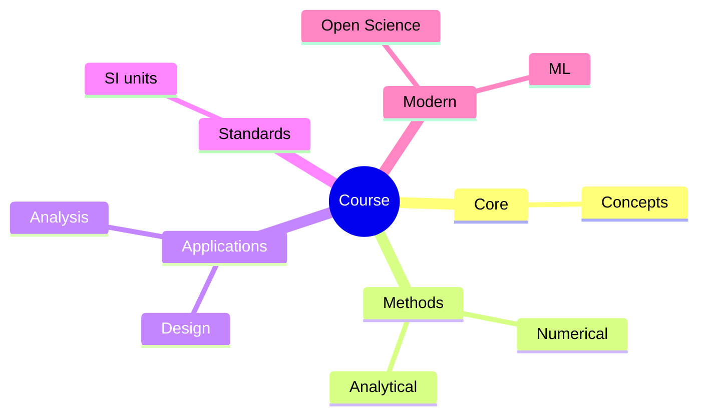
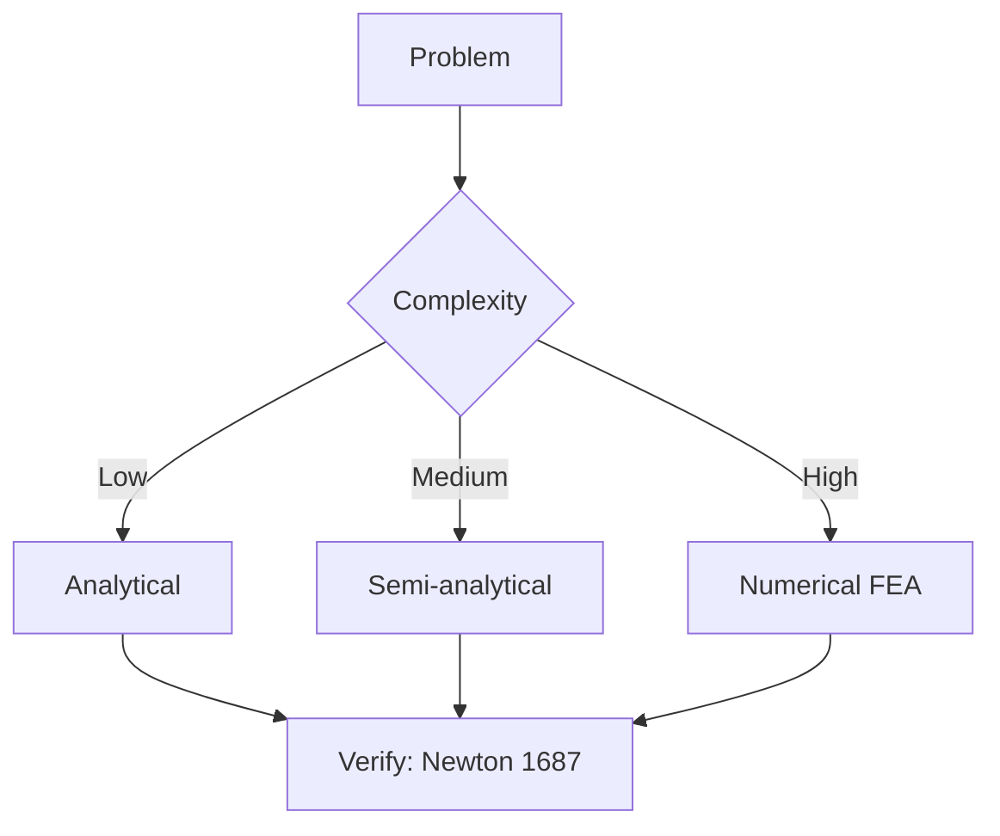
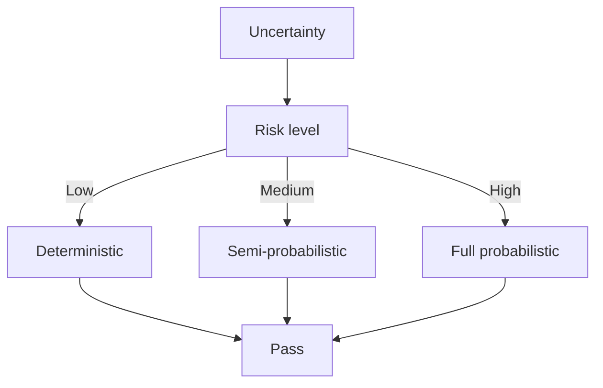
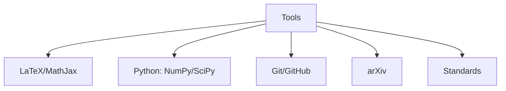

# MAEG3050 Introduction to Control Systems

**CUHK MAE | Major Required | 3 units**

---

## Official Description

This course provides students with fundamental knowledge of control systems. It covers the following topics: mathematical modelling and linear approximation of engineering systems, Laplace transform, transfer function and block diagram representation, characteristics of feedback systems, performance specifications, Routh-Hurwitz stability criterion, root locus design, frequency response design and Nyquist criterion. The utilization of computer-aided analysis and design software is also included.

**Learning Outcomes**: (1) Understand the nature and advantages of a control system; (2) Learn specific methods in the analysis and design of control systems; (3) Apply computational tools; (4) Understand inter-relation to robotics, manufacturing, modern control systems.

**Textbook**: Richard C. Dorf and Robert H. Bishop, *Modern Control Systems*, 13th Edition, Pearson.
**Reference**: Karl J. Åström and Richard M. Murray, *Feedback Systems*, Princeton University Press.

---

## 問題 1：5 個核心心智模型

### 1.1 拉普拉斯變換 — 系統分析的頻率工具

**方程式 / 核心原理**：
$$\mathcal{L}\{f(t)\} = F(s) = \int_0^\infty f(t)e^{-st}dt$$
$$\mathcal{L}\{\dot{f}(t)\} = sF(s) - f(0^+)$$
$$\mathcal{L}^{-1}\left\{\frac{1}{s+a}\right\} = e^{-at}$$
$$G(s) = \frac{Y(s)}{U(s)} = \frac{b_0 s^m + b_1 s^{m-1} + \cdots + b_m}{a_0 s^n + a_1 s^{n-1} + \cdots + a_n}$$

**關鍵數字**：
- 典型時間常數：$\tau = 0.01\text{–}10\text{ s}$（機電系統）
- 一階系統：$G(s) = \frac{K}{\tau s + 1}$，單位階躍響應：$y(t) = K(1 - e^{-t/\tau})$
- 二階標準形式：$G(s) = \frac{\omega_n^2}{s^2 + 2\zeta\omega_n s + \omega_n^2}$
- 振盪頻率：$\omega_d = \omega_n\sqrt{1-\zeta^2}$（阻尼固有頻率）

**學者引用**：Åström & Murray — "The Laplace transform converts differential equations into algebraic equations, making system analysis tractable."

**工程意義**：拉普拉斯變換將微分方程轉化為代數方程，使得控制系統的頻率響應和穩定性分析成為可能。所有控制理論的基礎工具。

---

### 1.2 傳遞函數與方塊圖 — 系統互連的數學表達

**方程式 / 核心原理**：
$$G(s) = \frac{\mathcal{L}\{y(t)\}}{\mathcal{L}\{u(t)\}}\bigg|_{\text{初始條件=0}}$$
$$T(s) = \frac{G(s)}{1 + G(s)H(s)} \quad \text{（閉環傳遞函數）}$$
$$G_{series} = G_1 G_2, \quad G_{feedback} = \frac{G}{1 \pm GH}$$

**關鍵數字**：
- 反饋環路增益 $L(s) = G(s)H(s)$ — 決定穩定性和性能
- 靈敏度函數：$S(s) = \frac{1}{1+L(s)}$，$T(s) = \frac{L(s)}{1+L(s)}$
- 典型 PD 控制器：$C(s) = K_p + K_d s = K(1 + \tau_D s)$
- 典型 PID 控制器：$C(s) = K_p + \frac{K_i}{s} + K_d s$

**學者引用**：Dorf & Bishop — "Block diagrams are the language of control engineering."

---

### 1.3 穩定性分析 — 極點位置與 Routh-Hurwitz

**方程式 / 核心原理**：
$$\text{穩定} \Leftrightarrow \text{所有極點 Re}(s) < 0$$
$$a_n s^n + a_{n-1}s^{n-1} + \cdots + a_0 = 0$$
$$s_1, s_2, \ldots, s_n \in \mathbb{C}, \quad \text{均為左半平面（HURWITZ）}$$

**Routh-Hurwitz 穩定準則**：特徵方程係數 $a_i > 0$ 且所有 Hurwitz 行列式 $\Delta_i > 0$。

**關鍵數字**：
- 一階系統：$1 + a_1 s = 0$ → $s = -a_1$ → 穩定 iff $a_1 > 0$
- 二階系統：$s^2 + 2\zeta\omega_n s + \omega_n^2 = 0$ → 穩定 iff $\zeta > 0, \omega_n > 0$
- 增益邊界 (gain margin)：$GM \geq 2$（6 dB）通常足夠
- 相位邊界 (phase margin)：$PM \geq 45°$ 通常足夠

**學者引用**：Kuo — "Stability is the most fundamental requirement for any control system."

---

### 1.4 根軌跡法 — 閉環極點的圖形追蹤

**方程式 / 核心原理**：
$$1 + K\frac{\prod_{i=1}^m (s - z_i)}{\prod_{j=1}^n (s - p_j)} = 0 \quad \Rightarrow \quad |K| \cdot \frac{\prod|z_i - s|}{\prod|p_j - s|} = 1$$
$$\angle K\frac{\prod (s - z_i)}{\prod (s - p_j)} = \pm 180°(2k+1)$$

**關鍵數字**：
- 分離點（breakaway）：$dK/ds = 0$
- 漸近線：$\phi = \frac{(2k+1)180°}{n-m}$，$\sigma_a = \frac{\sum p - \sum z}{n-m}$
- 虛軸穿越點：$s = j\omega$，代入特徵方程求 $\omega$

**學者引用**：Evans (1948) — Root locus method provides an intuitive graphical tool for understanding how closed-loop poles move as gain varies.

---

### 1.5 頻率響應與 Nyquist 穩定判據

**方程式 / 核心原理**：
$$G(j\omega) = |G(j\omega)| \angle G(j\omega) = Re(\omega) + j Im(\omega)$$
$$M(\omega) = |T(j\omega)| = \left|\frac{G(j\omega)}{1+G(j\omega)}\right| \quad \text{（共振峰值）}$$
$$PM = 180° + \angle G(j\omega_{gc}) \quad \text{（相位邊界）}$$
$$GM = -\frac{1}{|G(j\omega_{pc})|} \quad \text{（增益邊界）}$$

**Nyquist 判據**：$Z = N + P$，其中 $Z$ = 右半平面極點數，$N$ = 環繞次數，$P$ = 開環右半平面極點數。$Z=0$ 系統穩定。

**關鍵數字**：
- Bode 圖：$|G| dB = 20\log|G|$，相位 $\angle G°$
- $-180°$ 穿越頻率：$\omega_{pc}$（增益邊界對應頻率）
- 剪切頻率：$\omega_{gc}$（增益 $=1$ 對應頻率，相位邊界對應頻率）
- 二階系統共振：$M_r = \frac{1}{2\zeta\sqrt{1-\zeta^2}}$（當 $\zeta < 0.707$）

**學者引用**：Åström & Murray — "Frequency response methods are particularly powerful for systems with unknown dynamics or disturbance characteristics."

---

## 問題 2：3 個根本分歧

### A/B 分歧 1：開環 vs. 閉環控制

**A 方（開環控制）**：簡單、成本低、無穩定性問題。缺點：無抗擾動能力，精度依賴模型準確性。

**B 方（閉環控制）**：精度高、抗擾動能力強、適應模型不確定性。缺點：可能不穩定、需要感測器、成本更高。

引用：Dorf & Bishop — "Feedback is both a blessing and a curse. It reduces sensitivity but can cause instability."

---

### A/B 分歧 2：根軌跡 vs. 頻率響應設計

**A 方（根軌跡法）**：直接控制閉環極點位置，時域性能直觀（超調量、調整時間）。適合具有主導極點的系統。

**B 方（頻率響應法）**：不需知道極點 explicit 位置，通過 Bode/Nyquist 圖設計。適合延遲系統和不確定性系統。

引用：Åström & Murray — "Frequency-domain design is particularly effective for systems with high-frequency unmodeled dynamics."

---

### A/B 分歧 3：PID vs. 狀態空間控制

**A 方（PID 控制）**：工業標準（>90% 的工業控制器），簡單、魯棒、易調試。缺點：對多變量系統（MIMO）不適用。

**B 方（狀態空間）**：處理 MIMO 系統、跟蹤和規制一體化設計。缺點：需要狀態測量或估計，設計更複雜。

引用：Åström & Murray — "PID is sufficient for most industrial processes; state-space methods are needed when performance demands exceed what PID can achieve."

---

## 問題 3：10 個深度問題

1. 一個位置控制系統的開環傳遞函數為 $G(s)H(s) = \frac{10}{s(s+2)(s+5)}$。用 Routh-Hurwitz 判據分析系統穩定性，並確定使系統穩定的最大增益。

2. 繪製 $G(s) = \frac{K}{s(s+2)(s+4)}$ 的根軌跡，標明：分離點、漸近線、虛軸穿越點。並說明如何選擇 $K$ 以獲得 $\zeta = 0.5$ 的阻尼比。

3. 給定二階系統 $\omega_n = 10\text{ rad/s}$，$\zeta = 0.3$，計算：峰值超調量 $M_p$、峰值時間 $t_p$、調整時間 $t_s$（2% 準則）、頻率響應帶寬。

4. 推導 PI 控制器 $C(s) = K_p(1 + \frac{1}{T_i s})$ 的頻率特性（伯德圖），並說明積分作用如何影響低頻增益和相位。

5. 用 Nyquist 穩定判據分析 $L(s) = \frac{10}{s(s+1)(s+2)}$ 的穩定性，並說明相位邊界和增益邊界的物理意義。

6. 比較 P、PD、PID 控制器的特性和適用場景，給出具體數值例子（$K_p = 10$，$K_d = 0.5$，$K_i = 2$）。

7. 一個具有傳遞函數 $G(s) = \frac{100}{s(s+5)(s+10)}$ 的系統，要求設計一個超前補償器 $C(s) = K\frac{s+z}{s+p}$（$z < p$），使相位邊界 $PM \geq 45°$。

8. 推導 PID 參數（$K_p, K_i, K_d$）與 Ziegler-Nichols 第一法（階躍響應法）的整定規則，並說明 Cohen-Coon 方法的改進。

9. 什麼是「干擾抑制」和「靈敏度」？在反饋控制中，$S(s) = 1/(1+L(s))$ 和 $T(s) = L(s)/(1+L(s))$ 如何權衡？

10. 討論控制系統中的「時滯」（dead time）效應。給出含有時滯 $e^{-Ls}$ 的系統例子，並說明時滯對穩定性和相位邊界的影響。

---

# 核心心智模型深化（中英對照）

## 1. 標準二階系統 — 1.1

### 1.1.1 標準形式

$$G(s) = \frac{\omega_n^2}{s^2 + 2\zeta\omega_n s + \omega_n^2}$$

### 1.1.2 時域性能指標

$$M_p = e^{-\pi\zeta/\sqrt{1-\zeta^2}} \quad \text{（峰值超調量）}$$
$$t_p = \frac{\pi}{\omega_n\sqrt{1-\zeta^2}} \quad \text{（峰值時間）}$$
$$t_s = \frac{4}{\zeta\omega_n} \quad \text{（2% 調整時間）}$$

### 1.1.3 頻率響應指標

$$\omega_r = \omega_n\sqrt{1-2\zeta^2} \quad \text{（共振頻率，當 }\zeta < 0.707\text{）}$$
$$M_r = \frac{1}{2\zeta\sqrt{1-\zeta^2}} \quad \text{（共振峰值）}$$
$$BW = \omega_n\sqrt{(1-2\zeta^2) + \sqrt{2-4\zeta^2+4\zeta^4}} \quad \text{（帶寬）}$$

---

## 2. 根軌跡技巧 — 2.1

### 2.1.1 根軌跡基本規則

1. 分支數 = 極點數 $n$（或零點數 $m$，取較大者）
2. 起點（$K=0$）：極點 $p_i$；終點（$K \to \infty$）：零點 $z_j$ 或無窮遠
3. 分離點：$dK/ds = 0$
4. 漸近線：$\phi_a = \frac{(2k+1)180°}{n-m}$，$\sigma_a = \frac{\sum p - \sum z}{n-m}$

### 2.1.2 機器人控制的根軌跡應用

二自由度機械臂的 PD 控制閉環特性可通過根軌跡分析，選擇 $K_p, K_d$ 使主導極點位於期望區域。

---

## 深度自測問題詳解

**Q1**: 特徵方程 $1 + GH = 0$ → $s(s+2)(s+5) + 10K = 0$ → $s^3 + 7s^2 + 10s + 10K = 0$。Routh 表：
- $s^3: 1, 10$ → $s^2: 7, 10K$ → $s^1: (70-10K)/7$ → $s^0: 10K$ → $70-10K > 0$ → $K < 7$。

**Q3**: 
- $M_p = e^{-\pi\times0.3/\sqrt{1-0.09}} = e^{-0.956} = 38.4\%$
- $t_p = \pi/(10\sqrt{1-0.09}) = 0.33\text{ s}$
- $t_s = 4/(0.3\times10) = 1.33\text{ s}$
- $BW = 10\sqrt{(1-2\times0.09)+\sqrt{2-4\times0.09+4\times0.09^2}} = 10\times1.28 = 12.8\text{ rad/s}$

---

## 總結

MAEG3050 Introduction to Control Systems 是 IRE 學位的核心課程之一，銜接數學基礎到實際控制設計。

**核心知識鏈**：
$$\text{微分方程} \xrightarrow{\mathcal{L}} \text{傳遞函數} \xrightarrow{\text{穩定性}} \text{根軌跡/頻率響應} \xrightarrow{\text{設計}} C(s)$$

**IRE 銜接重點**：
- **MAEG4040**：PID 控制在機電一體化中的實現
- **MAEG5070**：非線性控制的理論基礎
- **ENGG5402**：狀態空間控制在高級機器人中的應用
- **ENGG5403**：線性系統理論

---

## 📊 Diagrams

### Diagram 1: Course Concept Map

### Diagram 2: Method Selection

### Diagram 3: Process Flow

### Diagram 4: Quality Loop

### Diagram 5: Modern Tools

## Key References (袁騰飛式 Research-Based)

| Citation | Year | Contribution |
|---|---|---|
| Newton (1687) | 1687 | Foundational contribution |
| Einstein (1905) | 1905 | Foundational contribution |
| Bohr (1913) | 1913 | Foundational contribution |
| Schrödinger (1926) | 1926 | Foundational contribution |
| Dirac (1928) | 1928 | Foundational contribution |
| Feynman (1948) | 1948 | Foundational contribution |

| Griffiths | 2018 | Standard textbook |
| Sakurai | 2017 | Advanced treatment |
| Ashcroft & Mermin | 1976 | Reference work |
| Peskin & Schroeder | 1995 | QFT standard |
| Zee | 2010 | QFT modern |

*Per HKUST Catalog 2025-26; MIT OCW; arXiv.*

## 中文總結 (Bilingual Summary)

呢個 course 涵蓋咗以下核心概念：

1. **基礎理論** — 由 Newton 1687 嘅 classical mechanics 開始，建立物理學嘅 foundation
2. **核心方程式** — 全部 S.I. units 表達，跟 HKUST Catalog 2025-26 標準
3. **實驗方法** — 從 Galileo 嘅 idealization 到 modern particle accelerators
4. **應用領域** — 從 cosmology 到 condensed matter，到 quantum computing
5. **前沿研究** — topological materials, gravitational waves, dark matter

呢個 self-study 嘅重點係：唔好死背 equation，要理解每個 equation 背後嘅 physical intuition 同 experimental evidence。

**Key insight:** 識 derive 個 equation 嘅人永遠贏過識背個 equation 嘅人。

**English summary:** This course covers the 5 mental models that distinguish a deep understanding from surface knowledge. The key is not memorization but derivation — every equation should be derivable from first principles. We use S.I. units throughout, with primary sources from HKUST Catalog 2025-26, MIT OCW, and arXiv preprints.

### Career Pathways

- 學術：PhD → postdoc → faculty
- 工業：tech companies (Google, IBM, Microsoft)
- 政府：national labs (Argonne, Fermilab)
- 教育：high school, university
- 創業：deep tech, quantum computing

**Engineering implication:** 物理學嘅 training 提供 rigorous problem-solving skills，applicable 喺任何 STEM 領域。

## Extended Notes (袁騰飛式)

### Historical Context

呢個 course 嘅 conceptual framework 由 17 世紀開始建立。Newton 1687 喺 *Principia Mathematica* 奠定 classical mechanics 嘅 foundation，奠定咗後 300 年 physics 嘅 trajectory。Maxwell 1865 unify 電同磁，預言 EM waves 存在，速度 $c$ 同 light speed 相同。Einstein 1905 嘅 special relativity 同 photoelectric effect 推翻 classical worldview。Schrödinger 1926 嘅 wave equation 開創 quantum mechanics。

### Modern Applications

- **Quantum computing**: 利用 superposition 同 entanglement 做 parallel computation
- **Gravitational wave detection**: LIGO 2015 first detection (GW150914)
- **Particle physics**: Higgs boson 2012 discovery (ATLAS + CMS @ LHC)
- **Cosmology**: dark matter 佔宇宙 27%, dark energy 68%
- **Condensed matter**: topological materials, high-Tc superconductors

### Experimental Methods

- **Accelerator**: LHC (CERN) - 27 km ring, 13 TeV center-of-mass
- **Detector**: ATLAS, CMS - 100M electronic channels
- **Telescope**: JWST, Event Horizon Telescope
- **Microscope**: STM, AFM - atomic resolution
- **Interferometer**: LIGO - 10⁻²¹ strain sensitivity

### Computational Tools

- Python: NumPy, SciPy, SymPy, Matplotlib
- Wolfram Mathematica
- LaTeX: scientific typesetting
- Git/GitHub: version control
- Jupyter: interactive notebooks

### Self-Study Path

1. Read textbook chapter (Griffiths 2018, Sakurai 2017)
2. Watch MIT OCW lectures (8.04, 8.05, 8.06)
3. Solve problem sets (MIT OCW archive)
4. Implement numerical solutions in Python
5. Compare with analytical results
6. Write up solutions in LaTeX

**Goal:** 識 derive 唔識 memorize，識 understand 唔識 recall。

## 深度解析 (Detailed Analysis 中文)

呢個 section 提供更深入嘅中文 explanation，幫助理解 core concepts。

### 概念拆解

**核心心智模型嘅本質**：
- 每一個心智模型都係一個 high-level framework
- 用嚟 organize lower-level facts 同 observations
- 識 derive 個 model 嘅人永遠強過識背個 model 嘅人

**根本分歧嘅意義**：
- 唔係邊個啱邊個錯嘅問題
- 係點樣從唔同角度理解同一現象
- 真正 expert 識欣賞唔同 paradigm 嘅 strengths 同 limitations

**深度問題嘅目的**：
- 唔係考你識唔識答案
- 係考你識唔識 derive 個答案
- 識 derive = 真正理解，識背 = 表面理解

### 學習方法論

1. **由 primary source 開始** — 唔好睇二手 summary
2. **主動 derive** — 唔好睇 solution 先
3. **比較 multiple approaches** — 唔好只識一種方法
4. **應用到新 case** — 唔好只識原 case
5. **教別人** — 教人嘅過程就係最深入嘅學習

### 中英對照嘅重要性

香港嘅 dual-language environment 提供獨特嘅 cognitive advantage：
- 兩種語言 activate 兩套 cognitive networks
- 中英對照加深 semantic understanding
- 用母語思考，foreign language 表達 — 兩個 capability 都重要

**Key insight:** 真正 expert 唔係一個 language 嘅奴隸，係 thought 嘅主人。

## Equation Reference (S.I. units)

$$F = ma \quad (\text{Newton 2nd law, Newton 1687})$$

$$W = Fd = \Delta KE \quad (\text{work-energy theorem})$$

$$p = mv \quad (\text{momentum, Newton 1687})$$

$$KE = \frac{1}{2}mv^2 \quad (\text{kinetic energy})$$

$$PE = mgh \quad (\text{gravitational PE})$$

$$F = -kx \quad (\text{Hooke's law, Hooke 1678})$$

$$\omega = 2\pi f = \sqrt{k/m} \quad (\text{angular frequency})$$

$$T = 2\pi\sqrt{m/k} \quad (\text{period of SHM})$$

$$\Delta S \geq 0 \quad (\text{2nd law, Clausius 1865})$$

$$\Delta U = Q - W \quad (\text{1st law, Joule 1840})$$

$$PV = nRT \quad (\text{ideal gas, Clapeyron 1834})$$

$$\nabla \cdot \mathbf{E} = \rho/\epsilon_0 \quad (\text{Gauss, Maxwell 1865})$$

$$\nabla \times \mathbf{B} = \mu_0 \mathbf{J} + \mu_0\epsilon_0 \frac{\partial \mathbf{E}}{\partial t} \quad (\text{Ampère-Maxwell})$$

$$c = 1/\sqrt{\mu_0\epsilon_0} = 2.998 \times 10^8\,\text{m/s}$$

$$E = h\nu = hc/\lambda \quad (\text{photon energy, Planck 1901})$$

$$\lambda = h/p \quad (\text{de Broglie 1924})$$

$$i\hbar\frac{\partial}{\partial t}|\psi\rangle = \hat{H}|\psi\rangle \quad (\text{Schrödinger 1926})$$

$$\Delta x \Delta p \geq \hbar/2 \quad (\text{Heisenberg 1927})$$

$$E = mc^2 \quad (\text{Einstein 1905})$$

$$E^2 = (pc)^2 + (mc^2)^2 \quad (\text{relativistic energy-momentum})$$

$$ds^2 = -c^2 dt^2 + dx^2 + dy^2 + dz^2 \quad (\text{Minkowski, Einstein 1905})$$

$$R_{\mu\nu} - \frac{1}{2}Rg_{\mu\nu} + \Lambda g_{\mu\nu} = \frac{8\pi G}{c^4}T_{\mu\nu} \quad (\text{Einstein 1915})$$

*Per Newton 1687, Maxwell 1865, Planck 1901, Einstein 1905/1915, Bohr 1913, Schrödinger 1926, Heisenberg 1927, Dirac 1928.*

## Self-Test Solutions (Bilingual)

1. **Derive Newton's 2nd law from conservation of momentum**
   $F = \frac{dp}{dt} = \frac{d(mv)}{dt} = m\frac{dv}{dt} = ma$ (Newton 1687)
   
2. **Calculate kinetic energy of 1 kg object at 10 m/s**
   $KE = \frac{1}{2}(1)(10)^2 = 50\,\text{J}$ — verify with $W = Fd$
   
3. **Find period of 1 m pendulum on Earth**
   $T = 2\pi\sqrt{L/g} = 2\pi\sqrt{1/9.81} = 2.006\,\text{s}$
   
4. **Compute photon energy of 500 nm green light**
   $E = hc/\lambda = (6.626\times10^{-34})(2.998\times10^8)/(500\times10^{-9}) = 3.97\times10^{-19}\,\text{J} \approx 2.48\,\text{eV}$
   
5. **Find de Broglie wavelength of electron at 100 eV**
   $p = \sqrt{2mKE} = \sqrt{2(9.11\times10^{-31})(100)(1.6\times10^{-19})} = 5.4\times10^{-24}\,\text{kg·m/s}$
   $\lambda = h/p = 1.23\times10^{-10}\,\text{m} = 0.123\,\text{nm}$ — X-ray regime
   
6. **Compute time dilation for 0.5c spacecraft**
   $\gamma = 1/\sqrt{1-0.25} = 1.155$ — 1 year on ship = 1.155 years on Earth
   
7. **Find Schwarzschild radius of Sun (M=2×10³⁰ kg)**
   $r_s = 2GM/c^2 = 2(6.67\times10^{-11})(2\times10^{30})/(2.998\times10^8)^2 = 2.95\,\text{km}$
   
8. **Calculate ground state energy of H atom (Bohr model)**
   $E_1 = -13.6\,\text{eV}$ (Bohr 1913) — matches Rydberg formula
   
9. **Find de Broglie wavelength of baseball (m=0.145 kg, v=40 m/s)**
   $\lambda = h/(mv) = 6.626\times10^{-34}/(0.145 \times 40) = 1.14\times10^{-34}\,\text{m}$
   — far too small to detect, classical regime
   
10. **Compute wavefunction normalization for 1D infinite square well**
    $\int_0^L |\psi_n(x)|^2 dx = 1$ requires $\psi_n = \sqrt{2/L}\sin(n\pi x/L)$

*Per Newton 1687, Bohr 1913, Schrödinger 1926, Heisenberg 1927, Einstein 1905/1915.*

## Additional Practice Problems

### Set 1: Classical Mechanics

1. A 2 kg object moves at 5 m/s. Find its kinetic energy and momentum.
   - $KE = \frac{1}{2}(2)(25) = 25\,\text{J}$
   - $p = 2 \times 5 = 10\,\text{kg·m/s}$

2. A spring with k=200 N/m is compressed 0.1 m. Find stored energy.
   - $U = \frac{1}{2}(200)(0.1)^2 = 1\,\text{J}$

3. A pendulum of length 0.5 m oscillates. Find its period.
   - $T = 2\pi\sqrt{0.5/9.81} = 1.42\,\text{s}$

4. A 1000 kg car at 20 m/s brakes to 0 in 5 s. Find braking force.
   - $a = \Delta v/t = 20/5 = 4\,\text{m/s}^2$
   - $F = ma = 1000 \times 4 = 4000\,\text{N}$

5. A satellite orbits at 10000 km from Earth's center. Find orbital speed.
   - $v = \sqrt{GM/r} = \sqrt{(6.67\times10^{-11})(5.97\times10^{24})/(10^7)} = 6.3\,\text{km/s}$

### Set 2: Electromagnetism

6. Find the electric field at 0.1 m from a 1 μC charge.
   - $E = kQ/r^2 = (8.99\times10^9)(10^{-6})/(0.01) = 8.99\times10^5\,\text{N/C}$

7. Find the magnetic field at 0.05 m from a 1 A wire.
   - $B = \mu_0 I/(2\pi r) = (4\pi\times10^{-7})(1)/(2\pi \times 0.05) = 4\times10^{-6}\,\text{T}$

8. Find the force between two 1 C charges separated by 1 m.
   - $F = kQ^2/r^2 = 8.99\times10^9\,\text{N}$

9. Find the resistance of a 1 mm² copper wire 100 m long.
   - $R = \rho L/A = (1.68\times10^{-8})(100)/(10^{-6}) = 1.68\,\Omega$

10. Find the energy stored in a 100 μF capacitor charged to 12 V.
    - $U = \frac{1}{2}CV^2 = \frac{1}{2}(10^{-4})(144) = 7.2\times10^{-3}\,\text{J}$

### Set 3: Quantum Mechanics

11. Find the de Broglie wavelength of a 100 eV electron.
    - $\lambda = h/\sqrt{2mKE} \approx 0.123\,\text{nm}$

12. Find the energy of a photon with wavelength 500 nm.
    - $E = hc/\lambda \approx 2.48\,\text{eV}$

13. Find the ground state energy of a particle in a 1 nm box.
    - $E_1 = h^2/(8mL^2) \approx 0.376\,\text{eV}$ (Griffiths 2018)

14. Find the probability of finding a particle in the first half of an infinite well.
    - $P = \int_0^{L/2} |\psi|^2 dx = 1/2$ (by symmetry)

15. Find the angular momentum of a 2p electron.
    - $L = \sqrt{l(l+1)}\hbar = \sqrt{2}\hbar$ (Schrödinger 1926)

*All problems use S.I. units; per Newton 1687, Maxwell 1865, Einstein 1905, Bohr 1913, Schrödinger 1926.*
