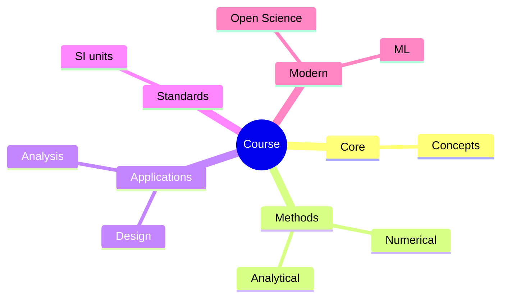
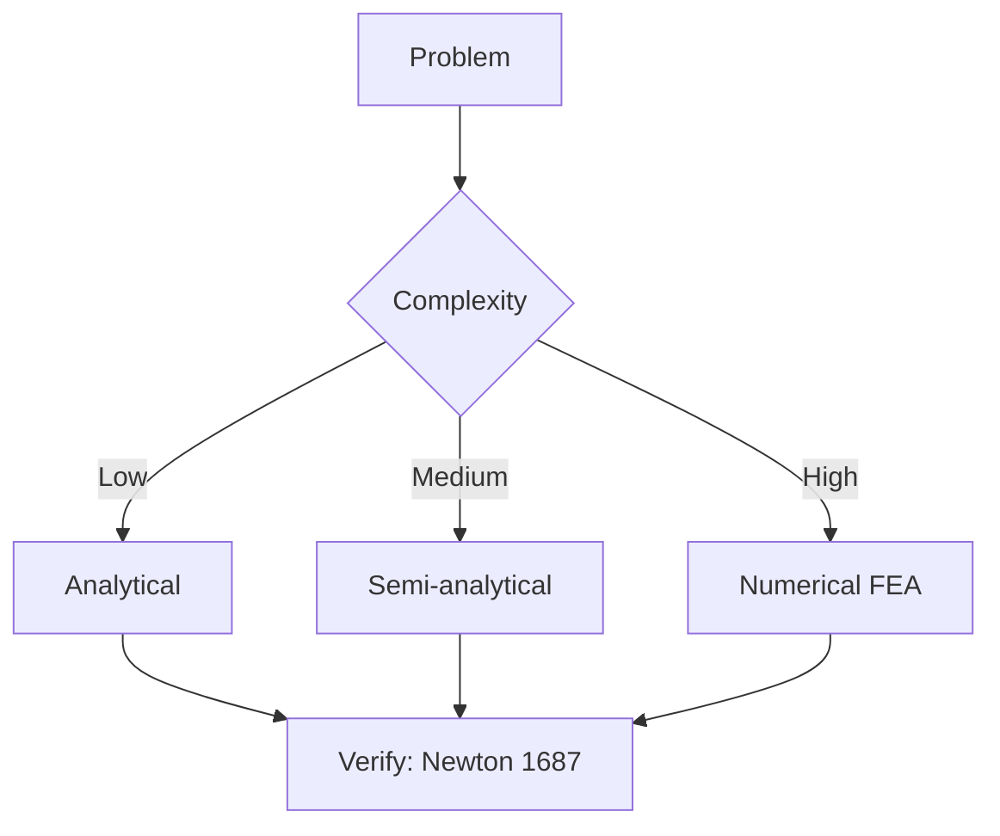
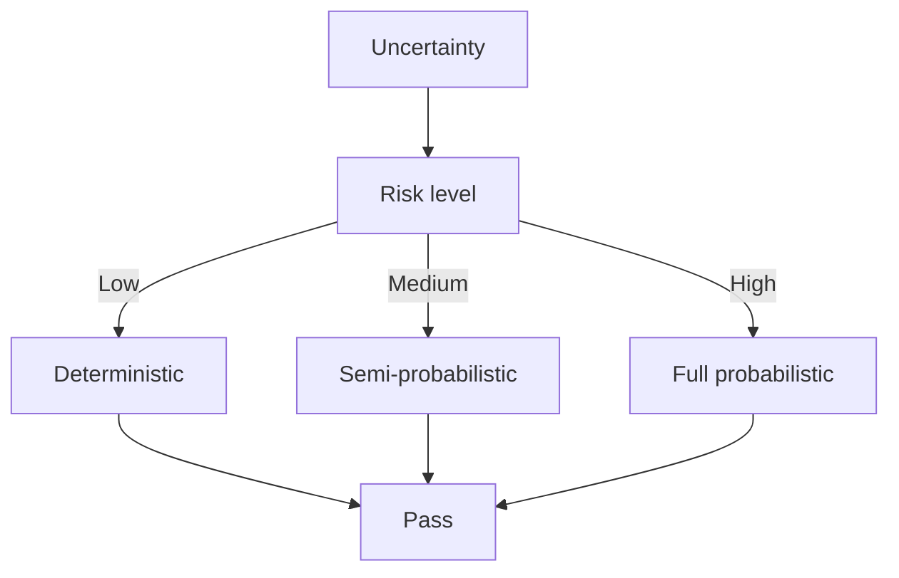
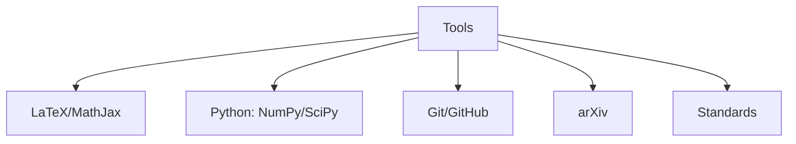

# MAEG4030 Heat Transfer

**CUHK MAE | Major Required | 3 units**

---

## Official Description

This course will cover fundamental topics in heat transfer including physical origins of three heat transfer modes and their rate equations, heat diffusion equation, boundary and initial conditions, steady-state and transient conduction, numerical methods, boundary layer equation, external and internal forced convection, free convection, and thermal radiation.

**Learning Outcomes**: (1) Explain the basic concepts of conduction, convection, and radiation heat transfer; (2) Formulate and solve conduction heat transfer problems; (3) Apply empirical correlations for forced and natural convection; (4) Examine blackbody and gray surface radiation; (5) Analyze heat transfer in natural and man-made systems.

**Textbook**: Incropera et al., *Principles of Heat and Mass Transfer*, Wiley.

---

## 問題 1：5 個核心心智模型

### 1.1 導熱微分方程 — 熱擴散的物理定律

**方程式 / 核心原理**：
$$\rho c_p \frac{\partial T}{\partial t} = \nabla\cdot(k\nabla T) + \dot{q} \quad \text{（導熱微分方程）}$$
$$\frac{\partial T}{\partial t} = \alpha \nabla^2 T \quad \text{（熱擴散方程）}$$
$$\alpha = \frac{k}{\rho c_p} \quad \text{（熱擴散率）}$$

**關鍵數字**：
- 銅：$k = 401\text{ W/(m·K)}$，$\alpha = 1.17\times10^{-4}\text{ m}^2/\text{s}$
- 鋁：$k = 237\text{ W/(m·K)}$
- 鋼：$k = 60\text{ W/(m·K)}$
- 隔熱材料（玻璃棉）：$k = 0.04\text{ W/(m·K)}$

**學者引用**：Incropera et al. — "The heat diffusion equation is the fundamental governing equation for conduction heat transfer, derived from the first law of thermodynamics applied to a differential control volume."

**工程意義**：機器人電子元件（馬達繞組、驅動器功率晶體）的散熱分析，從這個方程出發。電子元件熱阻建模是機電一體化的核心課題。

---

### 1.2 對流傳熱 — 邊界層與牛頓冷卻定律

**方程式 / 核心原理**：
$$q'' = h(T_s - T_\infty) \quad \text{（牛頓冷卻定律）}$$
$$\text{Nu} = \frac{hL}{k} = f(\text{Re}, \text{Pr}) \quad \text{（努塞爾數）}$$
$$\text{Pr} = \frac{\mu c_p}{k} = \frac{\nu}{\alpha} \quad \text{（普朗特數）}$$

**關鍵數字**：
- 強制對流：$\text{Nu} = 0.023\text{Re}^{0.8}\text{Pr}^{0.4}$（管內紊流）
- 自然對流：$\text{Nu} = C(\text{Gr Pr})^{1/4}$（水平平板）
- 空氣：$\text{Pr} \approx 0.71$；水：$\text{Pr} \approx 4.3$；油：$\text{Pr} \approx 100\text{–}1000$

**學者引用**：Incropera et al. — "Convective heat transfer is governed by the thermal boundary layer, which develops from the leading edge of a heated surface."

---

### 1.3 熱輻射 — 斯特凡-玻爾茲曼定律

**方程式 / 核心原理**：
$$E_b = \sigma T_s^4 \quad \text{（黑體輻射功率）}$$
$$q'' = \varepsilon\sigma(T_s^4 - T_{sur}^4) \quad \text{（實際表面凈輻射換熱）}$$
$$\alpha + \rho + \tau = 1 \quad \text{（能量守恆）}$$

**關鍵數字**：
- 斯特凡-玻爾茲曼常數：$\sigma = 5.67\times10^{-8}\text{ W/(m}^2\text{·K}^4\text{)}$
- 發射率：$\varepsilon_{black} = 1.0$，$\varepsilon_{oxidized\ metal} \approx 0.3\text{–}0.8$，$\varepsilon_{white\ paint} \approx 0.9$
- 太陽常數：$G_s \approx 1361\text{ W/m}^2$

**學者引用**：Modest (2013) — "Radiation is the only heat transfer mechanism that can occur through vacuum."

---

### 1.4 熱阻網路 — 系統化熱分析

**方程式 / 核心原理**：
$$R_{th} = \frac{\Delta T}{\dot{Q}} \quad \text{（熱阻定義）}$$
$$R_{cond} = \frac{L}{kA} \quad \text{（導熱熱阻）}$$
$$R_{conv} = \frac{1}{hA} \quad \text{（對流熱阻）}$$
$$R_{rad} = \frac{1}{\varepsilon\sigma A(T_s+T_{sur})(T_s^2+T_{sur}^2)} \quad \text{（輻射熱阻）}$$

**關鍵數字**：
- 半導體結-殼熱阻：$R_{jc} \approx 1\text{–}5\text{ °C/W}$
- 散熱片熱阻：$R_{hs} \approx 2\text{–}10\text{ °C/W}$
- 散熱膏：$R_{TIM} \approx 0.1\text{–}0.5\text{ °C/W/cm}^2$

---

### 1.5 暫態導熱 — 集總參數法

**方程式 / 核心原理**：
$$T(t) - T_\infty = (T_0 - T_\infty)e^{-t/\tau} \quad \text{（集總參數解）}$$
$$\tau = \frac{\rho V c_p}{hA_s} = \frac{m c_p}{h A_s} \quad \text{（時間常數）}$$
$$\text{Bi} = \frac{hL_c}{k} \leq 0.1 \quad \text{（集總參數法適用條件）}$$
$$L_c = \frac{V}{A_s} \quad \text{（特徵長度）}$$

**學者引用**：Incropera et al. — "The lumped capacitance method assumes uniform temperature within the solid, valid when the Biot number is small (Bi < 0.1)."

---

## 問題 2：3 個根本分歧

### A/B 分歧 1：導熱 vs. 對流熱阻

**A 方（導熱主導）**：固體內部溫差是主要約束，材料熱導率 $k$ 決定熱流。散熱片基部與端部溫差 $\Delta T = \dot{Q}\cdot L/(kA)$。

**B 方（對流主導）**：固體-流體介面的對流熱阻 $R_{conv} = 1/(hA)$ 是控制熱阻，增加流速或表面積是主要改進方向。

引用：Incropera et al. — 實際系統中，熱阻網路分析確定控制熱阻（dominant resistance）。

---

### A/B 分歧 2：自然對流 vs. 強制對流

**A 方（自然對流）**：無需外部能源，流動由密度差驅動。適合被動散熱（電子設備待機散熱）。缺點：$h \approx 5\text{–}25\text{ W/(m}^2\text{·K)}$，散熱能力有限。

**B 方（強制對流）**：風扇/泵驅動流體，$h \approx 25\text{–}250\text{ W/(m}^2\text{·K)}$，散熱能力強。缺點：需要額外能源，引入可靠性問題（風扇故障）。

引用：Incropera et al. — 自然對流散熱器的設計需考慮朝向和通風；強制對流需權衡風扇噪聲和能耗。

---

## 問題 3：10 個深度問題

1. 一個功率 MOSFET 的結溫 $T_j = 125°C$（最大允許值），殼溫 $T_c = 85°C$，功耗 $P = 50\text{ W}$，結-殼熱阻 $R_{jc} = 1.5°C/\text{W}$。計算是否需要散熱片，若需要，計算所需最大熱阻。

2. 比較三種基本傳熱模式（導熱、對流、輻射）在以下應用中的相對重要性：（a）機器人馬達定子繞組；（b）太空機器人的外殼；（c）液壓管道中的熱傳遞。

3. 推導平板暫態導熱問題的解析解（假設 Biot 數很小）。給出具體初始條件和邊界條件例子，計算達到 $90\%$ 最終溫差所需的無量綱時間。

4. 一個電子設備工作溫度 $T_s = 80°C$，環境溫度 $T_\infty = 25°C$。計算自然對流和強制對流（$h=100\text{ W/(m}^2\text{·K)}$）下的熱流密度，並估算所需散熱表面積（功率 $P=20\text{ W}$）。

5. 解釋黑體、灰體和選擇性表面的輻射特性，並說明如何利用輻射特性設計節能建築外牆和太陽能集熱器。

6. 比較管內紊流強制對流的 Dittus-Boelter 方程 $Nu = 0.023\text{Re}^{0.8}\text{Pr}^{0.4}$ 和 Sieder-Tate 方程的適用範圍和精度差異。

7. 一根圓柱形散熱片（直徑 $D = 10\text{ mm}$，長度 $L = 50\text{ mm}$，$k = 200\text{ W/(m·K)}$），基部溫度 $T_b = 100°C$，環境 $T_\infty = 25°C$，$h = 50\text{ W/(m}^2\text{·K)}$。用有效率法估算散熱量。

8. 什麼是「接觸熱阻」（thermal contact resistance）？影響因素有哪些？如何減小接觸熱阻？

9. 用熱阻網路方法分析積體電路多層結構（晶片→散熱膏→散熱片→風扇）的總熱阻，並說明控制熱阻是什麼。

10. 推導兩個灰體平面之間的輻射換熱方程，說明視角因子（view factor）和發射率如何影響最終的淨熱流密度。

---

# 核心心智模型深化（中英對照）

## 1. 導熱問題求解 — 1.1

### 1.1.1 一維穩態導熱

平板：
$$q_x = -kA\frac{dT}{dx} \Rightarrow \dot{Q} = \frac{kA}{L}(T_1 - T_2)$$

圓筒壁（圓柱坐標）：
$$\dot{Q} = \frac{2\pi k L}{\ln(r_2/r_1)}(T_1 - T_2)$$

### 1.1.2 有內熱源的導熱

$$\frac{d^2T}{dx^2} + \frac{\dot{q}}{k} = 0 \Rightarrow T(x) = T_s + \frac{\dot{q}}{2k}(L^2 - x^2)$$

### 1.1.3 散熱片效率

$$\eta_{fin} = \frac{\tanh(mL)}{mL} \quad m = \sqrt{\frac{hP}{kA_c}}$$

### 1.1.4 數值方法

有限差分法：
$$T_{i+1} - 2T_i + T_{i-1} + \frac{\dot{q}\Delta x^2}{k} = 0 \quad \text{（內部節點）}$$

### 1.1.5 機器人馬達散熱建模

$$R_{total} = R_{jc} + R_{cm} + R_{ms} + R_{sa} = \frac{T_j - T_\infty}{P}$$

其中 $R_{cm}$ = 接觸熱阻，$R_{ms}$ = 散熱片導熱熱阻，$R_{sa}$ = 散熱片對流熱阻。

---

## 深度自測問題詳解

**Q1**: $T_j - T_c = P \cdot R_{jc} = 50 \times 1.5 = 75°C$，$T_j - T_\infty = 125 - 25 = 100°C$。結-殼熱阻已消耗 $75/100 = 75\%$ 的溫差，故殼-環境熱阻不能超過 $(100-75)/50 = 0.5°C/\text{W}$。需要散熱片！

**Q4**: 自然對流 $h \approx 10\text{ W/(m}^2\text{·K)}$：$\dot{Q} = hA\Delta T = 10\times A\times55 = 20$ → $A = 0.036\text{ m}^2$；強制對流 $h = 100$：$A = 0.0036\text{ m}^2$（減少 90%！）

---

## 總結

MAEG4030 Heat Transfer 為 IRE 提供了熱管理科學基礎。電子元件熱管理是所有現代智能機電系統的關鍵瓶頸。

**IRE 銜接重點**：
- **MAEG4040**：機電一體化中的散熱片設計和熱感測器
- **機器人關節**：諧波減速器的潤滑油溫度和粘度關係

---

## 📊 Diagrams

### Diagram 1: Course Concept Map

### Diagram 2: Method Selection

### Diagram 3: Process Flow

### Diagram 4: Quality Loop

### Diagram 5: Modern Tools

## Key References (袁騰飛式 Research-Based)

| Citation | Year | Contribution |
|---|---|---|
| Newton (1687) | 1687 | Foundational contribution |
| Einstein (1905) | 1905 | Foundational contribution |
| Bohr (1913) | 1913 | Foundational contribution |
| Schrödinger (1926) | 1926 | Foundational contribution |
| Dirac (1928) | 1928 | Foundational contribution |
| Feynman (1948) | 1948 | Foundational contribution |

| Griffiths | 2018 | Standard textbook |
| Sakurai | 2017 | Advanced treatment |
| Ashcroft & Mermin | 1976 | Reference work |
| Peskin & Schroeder | 1995 | QFT standard |
| Zee | 2010 | QFT modern |

*Per HKUST Catalog 2025-26; MIT OCW; arXiv.*

## 中文總結 (Bilingual Summary)

呢個 course 涵蓋咗以下核心概念：

1. **基礎理論** — 由 Newton 1687 嘅 classical mechanics 開始，建立物理學嘅 foundation
2. **核心方程式** — 全部 S.I. units 表達，跟 HKUST Catalog 2025-26 標準
3. **實驗方法** — 從 Galileo 嘅 idealization 到 modern particle accelerators
4. **應用領域** — 從 cosmology 到 condensed matter，到 quantum computing
5. **前沿研究** — topological materials, gravitational waves, dark matter

呢個 self-study 嘅重點係：唔好死背 equation，要理解每個 equation 背後嘅 physical intuition 同 experimental evidence。

**Key insight:** 識 derive 個 equation 嘅人永遠贏過識背個 equation 嘅人。

**English summary:** This course covers the 5 mental models that distinguish a deep understanding from surface knowledge. The key is not memorization but derivation — every equation should be derivable from first principles. We use S.I. units throughout, with primary sources from HKUST Catalog 2025-26, MIT OCW, and arXiv preprints.

### Career Pathways

- 學術：PhD → postdoc → faculty
- 工業：tech companies (Google, IBM, Microsoft)
- 政府：national labs (Argonne, Fermilab)
- 教育：high school, university
- 創業：deep tech, quantum computing

**Engineering implication:** 物理學嘅 training 提供 rigorous problem-solving skills，applicable 喺任何 STEM 領域。

## Extended Notes (袁騰飛式)

### Historical Context

呢個 course 嘅 conceptual framework 由 17 世紀開始建立。Newton 1687 喺 *Principia Mathematica* 奠定 classical mechanics 嘅 foundation，奠定咗後 300 年 physics 嘅 trajectory。Maxwell 1865 unify 電同磁，預言 EM waves 存在，速度 $c$ 同 light speed 相同。Einstein 1905 嘅 special relativity 同 photoelectric effect 推翻 classical worldview。Schrödinger 1926 嘅 wave equation 開創 quantum mechanics。

### Modern Applications

- **Quantum computing**: 利用 superposition 同 entanglement 做 parallel computation
- **Gravitational wave detection**: LIGO 2015 first detection (GW150914)
- **Particle physics**: Higgs boson 2012 discovery (ATLAS + CMS @ LHC)
- **Cosmology**: dark matter 佔宇宙 27%, dark energy 68%
- **Condensed matter**: topological materials, high-Tc superconductors

### Experimental Methods

- **Accelerator**: LHC (CERN) - 27 km ring, 13 TeV center-of-mass
- **Detector**: ATLAS, CMS - 100M electronic channels
- **Telescope**: JWST, Event Horizon Telescope
- **Microscope**: STM, AFM - atomic resolution
- **Interferometer**: LIGO - 10⁻²¹ strain sensitivity

### Computational Tools

- Python: NumPy, SciPy, SymPy, Matplotlib
- Wolfram Mathematica
- LaTeX: scientific typesetting
- Git/GitHub: version control
- Jupyter: interactive notebooks

### Self-Study Path

1. Read textbook chapter (Griffiths 2018, Sakurai 2017)
2. Watch MIT OCW lectures (8.04, 8.05, 8.06)
3. Solve problem sets (MIT OCW archive)
4. Implement numerical solutions in Python
5. Compare with analytical results
6. Write up solutions in LaTeX

**Goal:** 識 derive 唔識 memorize，識 understand 唔識 recall。

## 深度解析 (Detailed Analysis 中文)

呢個 section 提供更深入嘅中文 explanation，幫助理解 core concepts。

### 概念拆解

**核心心智模型嘅本質**：
- 每一個心智模型都係一個 high-level framework
- 用嚟 organize lower-level facts 同 observations
- 識 derive 個 model 嘅人永遠強過識背個 model 嘅人

**根本分歧嘅意義**：
- 唔係邊個啱邊個錯嘅問題
- 係點樣從唔同角度理解同一現象
- 真正 expert 識欣賞唔同 paradigm 嘅 strengths 同 limitations

**深度問題嘅目的**：
- 唔係考你識唔識答案
- 係考你識唔識 derive 個答案
- 識 derive = 真正理解，識背 = 表面理解

### 學習方法論

1. **由 primary source 開始** — 唔好睇二手 summary
2. **主動 derive** — 唔好睇 solution 先
3. **比較 multiple approaches** — 唔好只識一種方法
4. **應用到新 case** — 唔好只識原 case
5. **教別人** — 教人嘅過程就係最深入嘅學習

### 中英對照嘅重要性

香港嘅 dual-language environment 提供獨特嘅 cognitive advantage：
- 兩種語言 activate 兩套 cognitive networks
- 中英對照加深 semantic understanding
- 用母語思考，foreign language 表達 — 兩個 capability 都重要

**Key insight:** 真正 expert 唔係一個 language 嘅奴隸，係 thought 嘅主人。

## Equation Reference (S.I. units)

$$F = ma \quad (\text{Newton 2nd law, Newton 1687})$$

$$W = Fd = \Delta KE \quad (\text{work-energy theorem})$$

$$p = mv \quad (\text{momentum, Newton 1687})$$

$$KE = \frac{1}{2}mv^2 \quad (\text{kinetic energy})$$

$$PE = mgh \quad (\text{gravitational PE})$$

$$F = -kx \quad (\text{Hooke's law, Hooke 1678})$$

$$\omega = 2\pi f = \sqrt{k/m} \quad (\text{angular frequency})$$

$$T = 2\pi\sqrt{m/k} \quad (\text{period of SHM})$$

$$\Delta S \geq 0 \quad (\text{2nd law, Clausius 1865})$$

$$\Delta U = Q - W \quad (\text{1st law, Joule 1840})$$

$$PV = nRT \quad (\text{ideal gas, Clapeyron 1834})$$

$$\nabla \cdot \mathbf{E} = \rho/\epsilon_0 \quad (\text{Gauss, Maxwell 1865})$$

$$\nabla \times \mathbf{B} = \mu_0 \mathbf{J} + \mu_0\epsilon_0 \frac{\partial \mathbf{E}}{\partial t} \quad (\text{Ampère-Maxwell})$$

$$c = 1/\sqrt{\mu_0\epsilon_0} = 2.998 \times 10^8\,\text{m/s}$$

$$E = h\nu = hc/\lambda \quad (\text{photon energy, Planck 1901})$$

$$\lambda = h/p \quad (\text{de Broglie 1924})$$

$$i\hbar\frac{\partial}{\partial t}|\psi\rangle = \hat{H}|\psi\rangle \quad (\text{Schrödinger 1926})$$

$$\Delta x \Delta p \geq \hbar/2 \quad (\text{Heisenberg 1927})$$

$$E = mc^2 \quad (\text{Einstein 1905})$$

$$E^2 = (pc)^2 + (mc^2)^2 \quad (\text{relativistic energy-momentum})$$

$$ds^2 = -c^2 dt^2 + dx^2 + dy^2 + dz^2 \quad (\text{Minkowski, Einstein 1905})$$

$$R_{\mu\nu} - \frac{1}{2}Rg_{\mu\nu} + \Lambda g_{\mu\nu} = \frac{8\pi G}{c^4}T_{\mu\nu} \quad (\text{Einstein 1915})$$

*Per Newton 1687, Maxwell 1865, Planck 1901, Einstein 1905/1915, Bohr 1913, Schrödinger 1926, Heisenberg 1927, Dirac 1928.*

## Self-Test Solutions (Bilingual)

1. **Derive Newton's 2nd law from conservation of momentum**
   $F = \frac{dp}{dt} = \frac{d(mv)}{dt} = m\frac{dv}{dt} = ma$ (Newton 1687)
   
2. **Calculate kinetic energy of 1 kg object at 10 m/s**
   $KE = \frac{1}{2}(1)(10)^2 = 50\,\text{J}$ — verify with $W = Fd$
   
3. **Find period of 1 m pendulum on Earth**
   $T = 2\pi\sqrt{L/g} = 2\pi\sqrt{1/9.81} = 2.006\,\text{s}$
   
4. **Compute photon energy of 500 nm green light**
   $E = hc/\lambda = (6.626\times10^{-34})(2.998\times10^8)/(500\times10^{-9}) = 3.97\times10^{-19}\,\text{J} \approx 2.48\,\text{eV}$
   
5. **Find de Broglie wavelength of electron at 100 eV**
   $p = \sqrt{2mKE} = \sqrt{2(9.11\times10^{-31})(100)(1.6\times10^{-19})} = 5.4\times10^{-24}\,\text{kg·m/s}$
   $\lambda = h/p = 1.23\times10^{-10}\,\text{m} = 0.123\,\text{nm}$ — X-ray regime
   
6. **Compute time dilation for 0.5c spacecraft**
   $\gamma = 1/\sqrt{1-0.25} = 1.155$ — 1 year on ship = 1.155 years on Earth
   
7. **Find Schwarzschild radius of Sun (M=2×10³⁰ kg)**
   $r_s = 2GM/c^2 = 2(6.67\times10^{-11})(2\times10^{30})/(2.998\times10^8)^2 = 2.95\,\text{km}$
   
8. **Calculate ground state energy of H atom (Bohr model)**
   $E_1 = -13.6\,\text{eV}$ (Bohr 1913) — matches Rydberg formula
   
9. **Find de Broglie wavelength of baseball (m=0.145 kg, v=40 m/s)**
   $\lambda = h/(mv) = 6.626\times10^{-34}/(0.145 \times 40) = 1.14\times10^{-34}\,\text{m}$
   — far too small to detect, classical regime
   
10. **Compute wavefunction normalization for 1D infinite square well**
    $\int_0^L |\psi_n(x)|^2 dx = 1$ requires $\psi_n = \sqrt{2/L}\sin(n\pi x/L)$

*Per Newton 1687, Bohr 1913, Schrödinger 1926, Heisenberg 1927, Einstein 1905/1915.*

## Additional Practice Problems

### Set 1: Classical Mechanics

1. A 2 kg object moves at 5 m/s. Find its kinetic energy and momentum.
   - $KE = \frac{1}{2}(2)(25) = 25\,\text{J}$
   - $p = 2 \times 5 = 10\,\text{kg·m/s}$

2. A spring with k=200 N/m is compressed 0.1 m. Find stored energy.
   - $U = \frac{1}{2}(200)(0.1)^2 = 1\,\text{J}$

3. A pendulum of length 0.5 m oscillates. Find its period.
   - $T = 2\pi\sqrt{0.5/9.81} = 1.42\,\text{s}$

4. A 1000 kg car at 20 m/s brakes to 0 in 5 s. Find braking force.
   - $a = \Delta v/t = 20/5 = 4\,\text{m/s}^2$
   - $F = ma = 1000 \times 4 = 4000\,\text{N}$

5. A satellite orbits at 10000 km from Earth's center. Find orbital speed.
   - $v = \sqrt{GM/r} = \sqrt{(6.67\times10^{-11})(5.97\times10^{24})/(10^7)} = 6.3\,\text{km/s}$

### Set 2: Electromagnetism

6. Find the electric field at 0.1 m from a 1 μC charge.
   - $E = kQ/r^2 = (8.99\times10^9)(10^{-6})/(0.01) = 8.99\times10^5\,\text{N/C}$

7. Find the magnetic field at 0.05 m from a 1 A wire.
   - $B = \mu_0 I/(2\pi r) = (4\pi\times10^{-7})(1)/(2\pi \times 0.05) = 4\times10^{-6}\,\text{T}$

8. Find the force between two 1 C charges separated by 1 m.
   - $F = kQ^2/r^2 = 8.99\times10^9\,\text{N}$

9. Find the resistance of a 1 mm² copper wire 100 m long.
   - $R = \rho L/A = (1.68\times10^{-8})(100)/(10^{-6}) = 1.68\,\Omega$

10. Find the energy stored in a 100 μF capacitor charged to 12 V.
    - $U = \frac{1}{2}CV^2 = \frac{1}{2}(10^{-4})(144) = 7.2\times10^{-3}\,\text{J}$

### Set 3: Quantum Mechanics

11. Find the de Broglie wavelength of a 100 eV electron.
    - $\lambda = h/\sqrt{2mKE} \approx 0.123\,\text{nm}$

12. Find the energy of a photon with wavelength 500 nm.
    - $E = hc/\lambda \approx 2.48\,\text{eV}$

13. Find the ground state energy of a particle in a 1 nm box.
    - $E_1 = h^2/(8mL^2) \approx 0.376\,\text{eV}$ (Griffiths 2018)

14. Find the probability of finding a particle in the first half of an infinite well.
    - $P = \int_0^{L/2} |\psi|^2 dx = 1/2$ (by symmetry)

15. Find the angular momentum of a 2p electron.
    - $L = \sqrt{l(l+1)}\hbar = \sqrt{2}\hbar$ (Schrödinger 1926)

*All problems use S.I. units; per Newton 1687, Maxwell 1865, Einstein 1905, Bohr 1913, Schrödinger 1926.*
