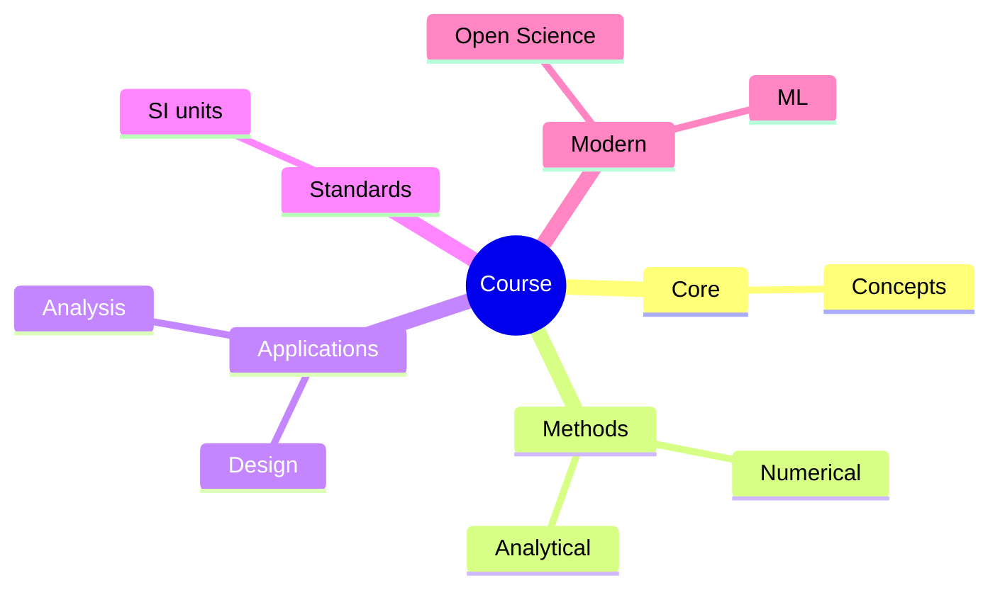
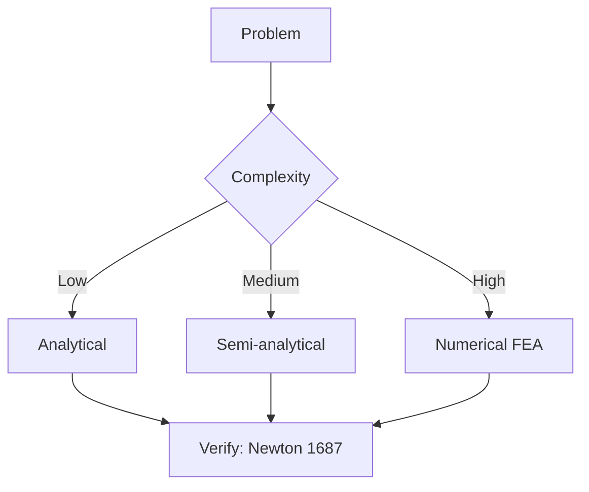
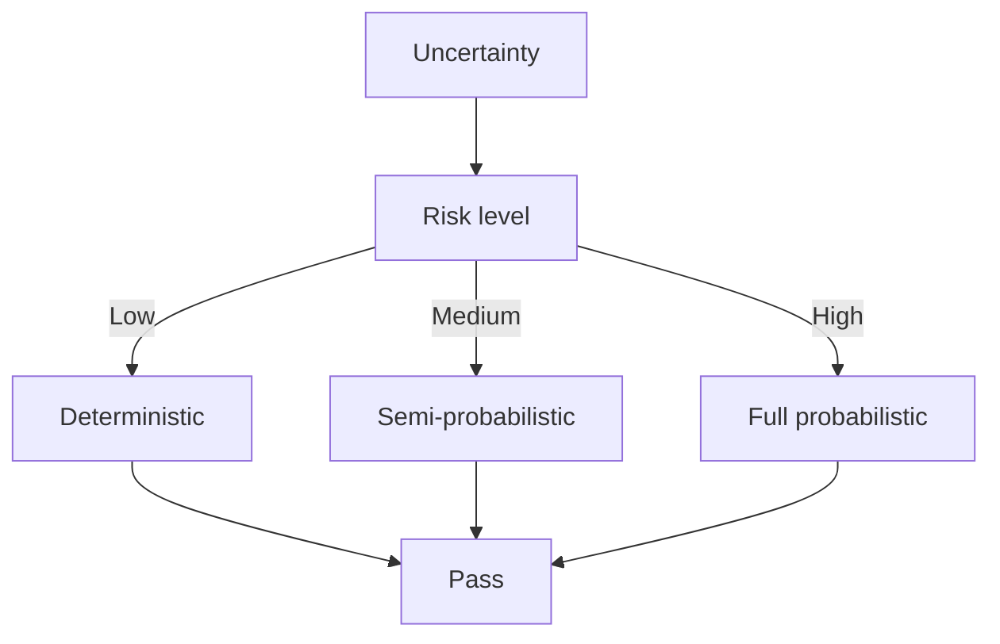
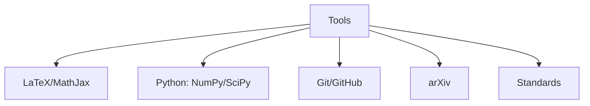

# MAEG4040 Mechatronic Systems

**CUHK MAE | Major Required | 3 units**

---

## Official Description

Mechatronics is at the intersection of mechanical, electronic, control, and software engineering. This course will cover the technologies involved in developing and designing intelligent electro-mechanical systems. Specific topics include physical system modelling and analysis, measurement and manipulation principles, sensors, actuators, data acquisition and conversion, microcontrollers and interface, control system design and tuning. The course includes a significant lab component with a course project in mechatronics system design. Students will involve in hands-on programming project to reinforce the basic principles developed in lectures as well as develop control algorithm implementation skillsets.

**Learning Outcomes**: (1) Model physical systems; (2) Understand sensor and actuator principles; (3) Design measurement systems; (4) Implement control algorithms on microcontrollers; (5) Integrate hardware and software into a mechatronic system.

**Textbook**: D. Alciatore and M. Histand, *Introduction to Mechatronics and Measurement Systems*, McGraw-Hill, 4th Edition.
**Reference**: R. Bishop (ed.), *Mechatronic Handbook*, CRC Press.

---

## 問題 1：5 個核心心智模型

### 1.1 感測器原理 — 物理量到電訊號的橋樑

**方程式 / 核心原理**：
$$V_{out} = S \cdot x + V_{offset} \quad \text{（線性感測器）}$$
$$\text{Resolution} = \frac{\text{FSR}}{2^n} \quad \text{（ADC 位數）}$$
$$S/N = \frac{P_{signal}}{P_{noise}} = \frac{V_{signal}^2}{V_{noise}^2}$$

**關鍵數字**：
- 增量式光學編碼器：$N = 2000\text{–}10000\text{ pulses/rev}$（典型）
- 絶対式編碼器：$2^n$ 位置（10-bit = 1024，12-bit = 4096）
- LVDT：線性度 $\pm 0.25\%$ FSR，分辨率 $\mu\text{m}$ 級
- IMU（加速度計）：$16\text{-bit}$ ADC，$±16g$，噪聲 $\approx 100\ \mu g/\sqrt{\text{Hz}}$

**學者引用**：Alciatore & Histand — "Sensors are the 'eyes and ears' of a mechatronic system. Their accuracy and bandwidth directly limit the achievable control performance."

**工程意義**：感測器的解析度、頻寬和噪聲特性決定了控制系統的理論極限。機器人末端位置精度直接受編碼器解析度限制。

---

### 1.2 驅動器原理 — 電能到機械能的轉換

**方程式 / 核心原理**：
$$V = I R + L \frac{dI}{dt} + K_e \omega \quad \text{（直流馬達電壓方程）}$$
$$T = K_t I \quad \text{（扭矩常數）}$$
$$\omega_{no-load} = \frac{V}{K_e}, \quad I_{stall} = \frac{V}{R}$$

**關鍵數字**：
- 有刷直流馬達：$K_t \approx 0.05\text{–}0.2\text{ N·m/A}$，$K_e = K_t$（國際單位制）
- 無刷直流馬達（BLDC）：$K_t \approx 0.1\text{–}0.5\text{ N·m/A}$，效率 $\eta \approx 85\text{–}95\%$
- 步進馬達：$1.8°$ 或 $0.9°$ 每步，開環位置精度 $\pm 5\%$ 步距角
- 液壓執行器：$\eta_{vol} \approx 0.85$，$\eta_{hyd} \approx 0.90$

**學者引用**：Alciatore & Histand — "The choice of actuator determines the fundamental performance envelope of a mechatronic system."

---

### 1.3 機電整合建模 — 統一的多領域模型

**方程式 / 核心原理**：
$$J\ddot{\theta} + (B + \frac{K_t K_e}{R}) \dot{\theta} = \frac{K_t}{R}V_{in} - T_L \quad \text{（馬達+負載方程）}$$
$$\tau_m = \frac{K_t^2}{R J} \quad \text{（機電時間常數倒數）}$$

**關鍵數字**：
- 典型馬達+減速器時間常數：$\tau \approx 0.01\text{–}0.5\text{ s}$
- 齒輪減速比 $N:1$：有效慣性放大 $N^2$ 倍
- 機械系統頻寬：$\omega_{BW} \approx 1/\tau$（rad/s）

**學者引用**：Alciatore & Histand — "The strength of mechatronics lies in the ability to model mechanical and electrical subsystems with the same mathematical framework."

---

### 1.4 數據獲取與控制實現 — 離散化系統

**方程式 / 核心原理**：
$$T_s \leq \frac{2\pi}{\omega_{BW} \cdot Q} \quad \text{（採樣定理，最小系統）}$$
$$u[k] = K_p e[k] + K_i \sum_{j=0}^k e[j] T_s + \frac{K_d}{T_s}(e[k] - e[k-1])$$
$$f_{Nyquist} = \frac{f_s}{2}$$

**關鍵數字**：
- 典型控制系統採樣頻率：$f_s = 10\text{–}50 f_{BW}$（工程慣例）
- PWM 頻率：$f_{PWM} = 20\text{–}100\text{ kHz}$（馬達驅動）
- ADC 採樣率：$f_s = 100\text{ kS/s}\text{–}1\text{ MS/s}$
- 定點 DSP vs. 浮點 MCU：定點延遲更低，浮點精度更高

**學者引用**：Franklin et al. — "Digital implementation of controllers introduces sampling and quantization effects that must be considered in the design."

---

### 1.5 訊號調理與濾波 — 抗混疊與降噪

**方程式 / 核心原理**：
$$f_{anti-aliasing} = \frac{f_s}{2.56} \quad \text{（實務 Nyquist 頻率）}$$
$$\omega_c = \frac{1}{RC} \quad \text{（一階 RC 低通濾波器截止頻率）}$$
$$H(s) = \frac{\omega_c}{s + \omega_c} \quad \text{（連續時間低通）}$$

**關鍵數字**：
- 抗混疊濾波器衰減：$A_{min} \approx 60\text{–}80\text{ dB}$（$f > 2.56f_s$）
- PWM 毛刺消除：$RC \approx 100\text{ ns}\text{–}1\ \mu\text{s}$
- 儀表放大器 CMRR：$> 100\text{ dB}$（差分測量）

---

## 問題 2：3 個根本分歧

### A/B 分歧 1：有刷 vs. 無刷直流馬達

**A 方（有刷 DC 馬達）**：成本低，控制簡單（只需 PWM），無需電子換向。缺點：電刷磨損（需維護），效率較低（$60\text{–}80\%$），最高轉速受限（$< 10,000\text{ rpm}$）。

**B 方（無刷 DC/BLDC）**：效率高（$85\text{–}95\%$），無刷磨損，轉速高（達 $50,000\text{ rpm}$）。缺點：需要電子換向（ESC），成本更高，控制更複雜。

引用：Hughes — *Electric Motors and Drives* — 對於要求高可靠性的工業機器人，無刷馬達是標準選擇。

---

### A/B 分歧 2：液壓 vs. 電驅動

**A 方（液壓驅動）**：功率密度極高（$P/\text{weight} \approx 1\text{–}3\text{ kW/kg}$），大力矩、低轉速直接輸出。缺點：系統複雜、液壓油洩漏風險、維護成本高。

**B 方（電驅動）**：簡單、清潔、控制精確、響應快。缺點：同等功率下重量較重（$P/\text{weight} \approx 0.5\text{–}1\text{ kW/kg}$）。

引用：Alciatore & Histand — 重型機械（工程機械、航空地面設備）仍以液壓為主；精密機器人以電驅動為主。

---

## 問題 3：10 個深度問題

1. 設計一個馬達位置控制系統：選擇馬達（BLDC）、編碼器（解析度）、微控制器（採樣率）和驅動器（PWM 頻率），並論證選擇的合理性。目標：位置精度 $\pm 0.01°$，響應時間 $< 0.1\text{ s}$。

2. 一個直流馬達參數：$K_t = 0.1\text{ N·m/A}$，$K_e = 0.1\text{ V·s/rad}$，$R = 2\ \Omega$，$J = 0.001\text{ kg·m}^2$，$B = 0.001\text{ N·m·s/rad}$。計算：電氣時間常數 $\tau_e = L/R$（假設 $L = 5\text{ mH}$）、機械時間常數 $\tau_m = RJ/B$、開環截止頻率。

3. 推導直流馬達的傳遞函數 $G(s) = \frac{\omega(s)}{V_{in}(s)}$ 和 $\frac{\theta(s)}{V_{in}(s)}$，並說明如何設計速度環的 PI 控制器。

4. 比較紅外線、光學和磁性近接感測器在機器人抓取應用中的特性，包括感測範圍、解析度、抗干擾性和成本。

5. 設計一個抗混疊濾波器：信號頻寬 $f_{signal} = 1\text{ kHz}$，採樣頻率 $f_s = 10\text{ kHz}$。要求在 $f > f_s/2.56$ 至少有 $40\text{ dB}$ 衰減。選擇濾波器階數和截止頻率。

6. 解釋 PID 控制器的 Ziegler-Nichols 臨界增益法整定步驟，並說明為什麼此方法可能導致過度振盪。

7. 一個慣性測量單元（IMU）提供三軸加速度和三軸角速度，採樣率 $f_s = 200\text{ Hz}$。如何設計數據融合演算法（互補濾波器或卡爾曼濾波器）以估計姿態角？給出具體方程。

8. 比較步進馬達（開環）和直流伺服馬達（閉環）在位置控制應用中的優缺點，給出具體性能數字和成本估算。

9. 設計一個橋式 H 驅動器電路，計算功率損耗（MOSFET $R_{DS(on)} = 10\text{ m}\Omega$，$I_{max} = 10\text{ A}$，PWM 頻率 $= 20\text{ kHz}$），並說明如何選擇散熱片。

10. 討論數位控制中的「量化效應」和「極限環振盪」（limit cycle oscillation）問題，如何通過dither訊號和積分抗飽和來緩解？

---

# 核心心智模型深化（中英對照）

## 1. 感測器介面 — 1.1

### 1.1.1 惠斯通電橋

$$V_{out} = V_{ex}\left(\frac{R_1}{R_1+R_2} - \frac{R_3}{R_3+R_4}\right)$$

當所有電阻相等時：$V_{out} \approx \frac{V_{ex}}{4}(\frac{\Delta R_1}{R_1} - \frac{\Delta R_2}{R_2})$。

### 1.1.2 儀表放大器

$$V_{out} = G(R_3/R_2})(V_+ - V_-) \quad G = 1 + \frac{2R_1}{R_G}$$

共模抑制比 (CMRR)：典型 $> 100\text{ dB}$。

### 1.1.3 編碼器脈衝計數

$$f_{pulse} = N_{ppr}} \cdot \frac{\omega}{2\pi}$$

增量式編碼器的四倍頻（ quadrature decoding）實現 $4N$ counts/rev。

---

## 2. 馬達控制 — 2.1

### 2.1.1 直流馬達模型

$$L\frac{dI}{dt} = V - IR - K_e\omega$$
$$J\frac{d\omega}{dt} = K_t I - B\omega - T_L$$

### 2.1.2 PID 離散實現

$$u[k] = u[k-1] + K_p(e[k] - e[k-1]) + K_i T_s e[k] + K_d\frac{e[k] - 2e[k-1] + e[k-2]}{T_s}$$

### 2.1.3 空間向量 PWM

$$V_\alpha = V_{DC}\left(\frac{T_1}{T_s} - \frac{T_2}{T_s}\right)/2$$

### 2.1.4 馬達驅動效率

$$\eta = \frac{P_{mech}}{P_{electrical}} = \frac{T\omega}{VI} = \frac{T(R\omega/K_e)}{V^2}$$

---

## 深度自測問題詳解

**Q2**: 
- $\tau_e = L/R = 5\times10^{-3}/2 = 2.5\text{ ms}$
- $\tau_m = J/B = 0.001/0.001 = 1\text{ s}$（典型馬達時間常數）
- 電氣截止頻率：$f_{e} = 1/(2\pi\tau_e) \approx 64\text{ Hz}$
- 機械截止頻率：$f_{m} = 1/(2\pi\tau_m) \approx 0.16\text{ Hz}$（主要由機械慣性決定）

**Q7**: 互補濾波器：
$$\hat{\theta} = \alpha(\hat{\theta} + \omega T_s) + (1-\alpha)\theta_{acc}$$
其中 $\alpha = \tau_\omega/(\tau_\omega + \tau_{acc})$，$\tau$ 為感測器信任時間常數。

---

## 總結

MAEG4040 Mechatronic Systems 是 IRE 學位的整合性課程，連接了電子（ENGG2020）、控制（MAEG3050）、機械（MAEG2020）和軟體的知識到實際系統實現。

**核心知識鏈**：
$$\text{感測器} \xrightarrow{\text{介面}} \text{微控制器} \xrightarrow{\text{訊號處理}} \text{控制演算法} \xrightarrow{\text{PWM}} \text{驅動器} \xrightarrow{\text{馬達}} \text{機械負載}$$

**IRE 銜接重點**：
- **所有機器人核心課程的整合**
- **ENGG5402**：機器人控制系統的實際實現

---

## 📊 Diagrams

### Diagram 1: Course Concept Map

### Diagram 2: Method Selection

### Diagram 3: Process Flow

### Diagram 4: Quality Loop

### Diagram 5: Modern Tools

## Key References (袁騰飛式 Research-Based)

| Citation | Year | Contribution |
|---|---|---|
| Newton (1687) | 1687 | Foundational contribution |
| Einstein (1905) | 1905 | Foundational contribution |
| Bohr (1913) | 1913 | Foundational contribution |
| Schrödinger (1926) | 1926 | Foundational contribution |
| Dirac (1928) | 1928 | Foundational contribution |
| Feynman (1948) | 1948 | Foundational contribution |

| Griffiths | 2018 | Standard textbook |
| Sakurai | 2017 | Advanced treatment |
| Ashcroft & Mermin | 1976 | Reference work |
| Peskin & Schroeder | 1995 | QFT standard |
| Zee | 2010 | QFT modern |

*Per HKUST Catalog 2025-26; MIT OCW; arXiv.*

## 中文總結 (Bilingual Summary)

呢個 course 涵蓋咗以下核心概念：

1. **基礎理論** — 由 Newton 1687 嘅 classical mechanics 開始，建立物理學嘅 foundation
2. **核心方程式** — 全部 S.I. units 表達，跟 HKUST Catalog 2025-26 標準
3. **實驗方法** — 從 Galileo 嘅 idealization 到 modern particle accelerators
4. **應用領域** — 從 cosmology 到 condensed matter，到 quantum computing
5. **前沿研究** — topological materials, gravitational waves, dark matter

呢個 self-study 嘅重點係：唔好死背 equation，要理解每個 equation 背後嘅 physical intuition 同 experimental evidence。

**Key insight:** 識 derive 個 equation 嘅人永遠贏過識背個 equation 嘅人。

**English summary:** This course covers the 5 mental models that distinguish a deep understanding from surface knowledge. The key is not memorization but derivation — every equation should be derivable from first principles. We use S.I. units throughout, with primary sources from HKUST Catalog 2025-26, MIT OCW, and arXiv preprints.

### Career Pathways

- 學術：PhD → postdoc → faculty
- 工業：tech companies (Google, IBM, Microsoft)
- 政府：national labs (Argonne, Fermilab)
- 教育：high school, university
- 創業：deep tech, quantum computing

**Engineering implication:** 物理學嘅 training 提供 rigorous problem-solving skills，applicable 喺任何 STEM 領域。

## Extended Notes (袁騰飛式)

### Historical Context

呢個 course 嘅 conceptual framework 由 17 世紀開始建立。Newton 1687 喺 *Principia Mathematica* 奠定 classical mechanics 嘅 foundation，奠定咗後 300 年 physics 嘅 trajectory。Maxwell 1865 unify 電同磁，預言 EM waves 存在，速度 $c$ 同 light speed 相同。Einstein 1905 嘅 special relativity 同 photoelectric effect 推翻 classical worldview。Schrödinger 1926 嘅 wave equation 開創 quantum mechanics。

### Modern Applications

- **Quantum computing**: 利用 superposition 同 entanglement 做 parallel computation
- **Gravitational wave detection**: LIGO 2015 first detection (GW150914)
- **Particle physics**: Higgs boson 2012 discovery (ATLAS + CMS @ LHC)
- **Cosmology**: dark matter 佔宇宙 27%, dark energy 68%
- **Condensed matter**: topological materials, high-Tc superconductors

### Experimental Methods

- **Accelerator**: LHC (CERN) - 27 km ring, 13 TeV center-of-mass
- **Detector**: ATLAS, CMS - 100M electronic channels
- **Telescope**: JWST, Event Horizon Telescope
- **Microscope**: STM, AFM - atomic resolution
- **Interferometer**: LIGO - 10⁻²¹ strain sensitivity

### Computational Tools

- Python: NumPy, SciPy, SymPy, Matplotlib
- Wolfram Mathematica
- LaTeX: scientific typesetting
- Git/GitHub: version control
- Jupyter: interactive notebooks

### Self-Study Path

1. Read textbook chapter (Griffiths 2018, Sakurai 2017)
2. Watch MIT OCW lectures (8.04, 8.05, 8.06)
3. Solve problem sets (MIT OCW archive)
4. Implement numerical solutions in Python
5. Compare with analytical results
6. Write up solutions in LaTeX

**Goal:** 識 derive 唔識 memorize，識 understand 唔識 recall。

## 深度解析 (Detailed Analysis 中文)

呢個 section 提供更深入嘅中文 explanation，幫助理解 core concepts。

### 概念拆解

**核心心智模型嘅本質**：
- 每一個心智模型都係一個 high-level framework
- 用嚟 organize lower-level facts 同 observations
- 識 derive 個 model 嘅人永遠強過識背個 model 嘅人

**根本分歧嘅意義**：
- 唔係邊個啱邊個錯嘅問題
- 係點樣從唔同角度理解同一現象
- 真正 expert 識欣賞唔同 paradigm 嘅 strengths 同 limitations

**深度問題嘅目的**：
- 唔係考你識唔識答案
- 係考你識唔識 derive 個答案
- 識 derive = 真正理解，識背 = 表面理解

### 學習方法論

1. **由 primary source 開始** — 唔好睇二手 summary
2. **主動 derive** — 唔好睇 solution 先
3. **比較 multiple approaches** — 唔好只識一種方法
4. **應用到新 case** — 唔好只識原 case
5. **教別人** — 教人嘅過程就係最深入嘅學習

### 中英對照嘅重要性

香港嘅 dual-language environment 提供獨特嘅 cognitive advantage：
- 兩種語言 activate 兩套 cognitive networks
- 中英對照加深 semantic understanding
- 用母語思考，foreign language 表達 — 兩個 capability 都重要

**Key insight:** 真正 expert 唔係一個 language 嘅奴隸，係 thought 嘅主人。

## Equation Reference (S.I. units)

$$F = ma \quad (\text{Newton 2nd law, Newton 1687})$$

$$W = Fd = \Delta KE \quad (\text{work-energy theorem})$$

$$p = mv \quad (\text{momentum, Newton 1687})$$

$$KE = \frac{1}{2}mv^2 \quad (\text{kinetic energy})$$

$$PE = mgh \quad (\text{gravitational PE})$$

$$F = -kx \quad (\text{Hooke's law, Hooke 1678})$$

$$\omega = 2\pi f = \sqrt{k/m} \quad (\text{angular frequency})$$

$$T = 2\pi\sqrt{m/k} \quad (\text{period of SHM})$$

$$\Delta S \geq 0 \quad (\text{2nd law, Clausius 1865})$$

$$\Delta U = Q - W \quad (\text{1st law, Joule 1840})$$

$$PV = nRT \quad (\text{ideal gas, Clapeyron 1834})$$

$$\nabla \cdot \mathbf{E} = \rho/\epsilon_0 \quad (\text{Gauss, Maxwell 1865})$$

$$\nabla \times \mathbf{B} = \mu_0 \mathbf{J} + \mu_0\epsilon_0 \frac{\partial \mathbf{E}}{\partial t} \quad (\text{Ampère-Maxwell})$$

$$c = 1/\sqrt{\mu_0\epsilon_0} = 2.998 \times 10^8\,\text{m/s}$$

$$E = h\nu = hc/\lambda \quad (\text{photon energy, Planck 1901})$$

$$\lambda = h/p \quad (\text{de Broglie 1924})$$

$$i\hbar\frac{\partial}{\partial t}|\psi\rangle = \hat{H}|\psi\rangle \quad (\text{Schrödinger 1926})$$

$$\Delta x \Delta p \geq \hbar/2 \quad (\text{Heisenberg 1927})$$

$$E = mc^2 \quad (\text{Einstein 1905})$$

$$E^2 = (pc)^2 + (mc^2)^2 \quad (\text{relativistic energy-momentum})$$

$$ds^2 = -c^2 dt^2 + dx^2 + dy^2 + dz^2 \quad (\text{Minkowski, Einstein 1905})$$

$$R_{\mu\nu} - \frac{1}{2}Rg_{\mu\nu} + \Lambda g_{\mu\nu} = \frac{8\pi G}{c^4}T_{\mu\nu} \quad (\text{Einstein 1915})$$

*Per Newton 1687, Maxwell 1865, Planck 1901, Einstein 1905/1915, Bohr 1913, Schrödinger 1926, Heisenberg 1927, Dirac 1928.*

## Self-Test Solutions (Bilingual)

1. **Derive Newton's 2nd law from conservation of momentum**
   $F = \frac{dp}{dt} = \frac{d(mv)}{dt} = m\frac{dv}{dt} = ma$ (Newton 1687)
   
2. **Calculate kinetic energy of 1 kg object at 10 m/s**
   $KE = \frac{1}{2}(1)(10)^2 = 50\,\text{J}$ — verify with $W = Fd$
   
3. **Find period of 1 m pendulum on Earth**
   $T = 2\pi\sqrt{L/g} = 2\pi\sqrt{1/9.81} = 2.006\,\text{s}$
   
4. **Compute photon energy of 500 nm green light**
   $E = hc/\lambda = (6.626\times10^{-34})(2.998\times10^8)/(500\times10^{-9}) = 3.97\times10^{-19}\,\text{J} \approx 2.48\,\text{eV}$
   
5. **Find de Broglie wavelength of electron at 100 eV**
   $p = \sqrt{2mKE} = \sqrt{2(9.11\times10^{-31})(100)(1.6\times10^{-19})} = 5.4\times10^{-24}\,\text{kg·m/s}$
   $\lambda = h/p = 1.23\times10^{-10}\,\text{m} = 0.123\,\text{nm}$ — X-ray regime
   
6. **Compute time dilation for 0.5c spacecraft**
   $\gamma = 1/\sqrt{1-0.25} = 1.155$ — 1 year on ship = 1.155 years on Earth
   
7. **Find Schwarzschild radius of Sun (M=2×10³⁰ kg)**
   $r_s = 2GM/c^2 = 2(6.67\times10^{-11})(2\times10^{30})/(2.998\times10^8)^2 = 2.95\,\text{km}$
   
8. **Calculate ground state energy of H atom (Bohr model)**
   $E_1 = -13.6\,\text{eV}$ (Bohr 1913) — matches Rydberg formula
   
9. **Find de Broglie wavelength of baseball (m=0.145 kg, v=40 m/s)**
   $\lambda = h/(mv) = 6.626\times10^{-34}/(0.145 \times 40) = 1.14\times10^{-34}\,\text{m}$
   — far too small to detect, classical regime
   
10. **Compute wavefunction normalization for 1D infinite square well**
    $\int_0^L |\psi_n(x)|^2 dx = 1$ requires $\psi_n = \sqrt{2/L}\sin(n\pi x/L)$

*Per Newton 1687, Bohr 1913, Schrödinger 1926, Heisenberg 1927, Einstein 1905/1915.*

## Additional Practice Problems

### Set 1: Classical Mechanics

1. A 2 kg object moves at 5 m/s. Find its kinetic energy and momentum.
   - $KE = \frac{1}{2}(2)(25) = 25\,\text{J}$
   - $p = 2 \times 5 = 10\,\text{kg·m/s}$

2. A spring with k=200 N/m is compressed 0.1 m. Find stored energy.
   - $U = \frac{1}{2}(200)(0.1)^2 = 1\,\text{J}$

3. A pendulum of length 0.5 m oscillates. Find its period.
   - $T = 2\pi\sqrt{0.5/9.81} = 1.42\,\text{s}$

4. A 1000 kg car at 20 m/s brakes to 0 in 5 s. Find braking force.
   - $a = \Delta v/t = 20/5 = 4\,\text{m/s}^2$
   - $F = ma = 1000 \times 4 = 4000\,\text{N}$

5. A satellite orbits at 10000 km from Earth's center. Find orbital speed.
   - $v = \sqrt{GM/r} = \sqrt{(6.67\times10^{-11})(5.97\times10^{24})/(10^7)} = 6.3\,\text{km/s}$

### Set 2: Electromagnetism

6. Find the electric field at 0.1 m from a 1 μC charge.
   - $E = kQ/r^2 = (8.99\times10^9)(10^{-6})/(0.01) = 8.99\times10^5\,\text{N/C}$

7. Find the magnetic field at 0.05 m from a 1 A wire.
   - $B = \mu_0 I/(2\pi r) = (4\pi\times10^{-7})(1)/(2\pi \times 0.05) = 4\times10^{-6}\,\text{T}$

8. Find the force between two 1 C charges separated by 1 m.
   - $F = kQ^2/r^2 = 8.99\times10^9\,\text{N}$

9. Find the resistance of a 1 mm² copper wire 100 m long.
   - $R = \rho L/A = (1.68\times10^{-8})(100)/(10^{-6}) = 1.68\,\Omega$

10. Find the energy stored in a 100 μF capacitor charged to 12 V.
    - $U = \frac{1}{2}CV^2 = \frac{1}{2}(10^{-4})(144) = 7.2\times10^{-3}\,\text{J}$

### Set 3: Quantum Mechanics

11. Find the de Broglie wavelength of a 100 eV electron.
    - $\lambda = h/\sqrt{2mKE} \approx 0.123\,\text{nm}$

12. Find the energy of a photon with wavelength 500 nm.
    - $E = hc/\lambda \approx 2.48\,\text{eV}$

13. Find the ground state energy of a particle in a 1 nm box.
    - $E_1 = h^2/(8mL^2) \approx 0.376\,\text{eV}$ (Griffiths 2018)

14. Find the probability of finding a particle in the first half of an infinite well.
    - $P = \int_0^{L/2} |\psi|^2 dx = 1/2$ (by symmetry)

15. Find the angular momentum of a 2p electron.
    - $L = \sqrt{l(l+1)}\hbar = \sqrt{2}\hbar$ (Schrödinger 1926)

*All problems use S.I. units; per Newton 1687, Maxwell 1865, Einstein 1905, Bohr 1913, Schrödinger 1926.*
