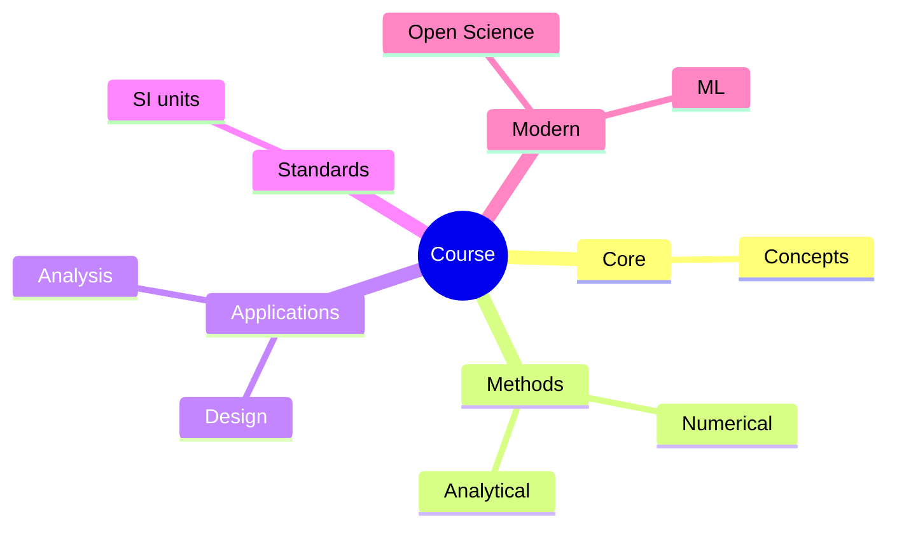
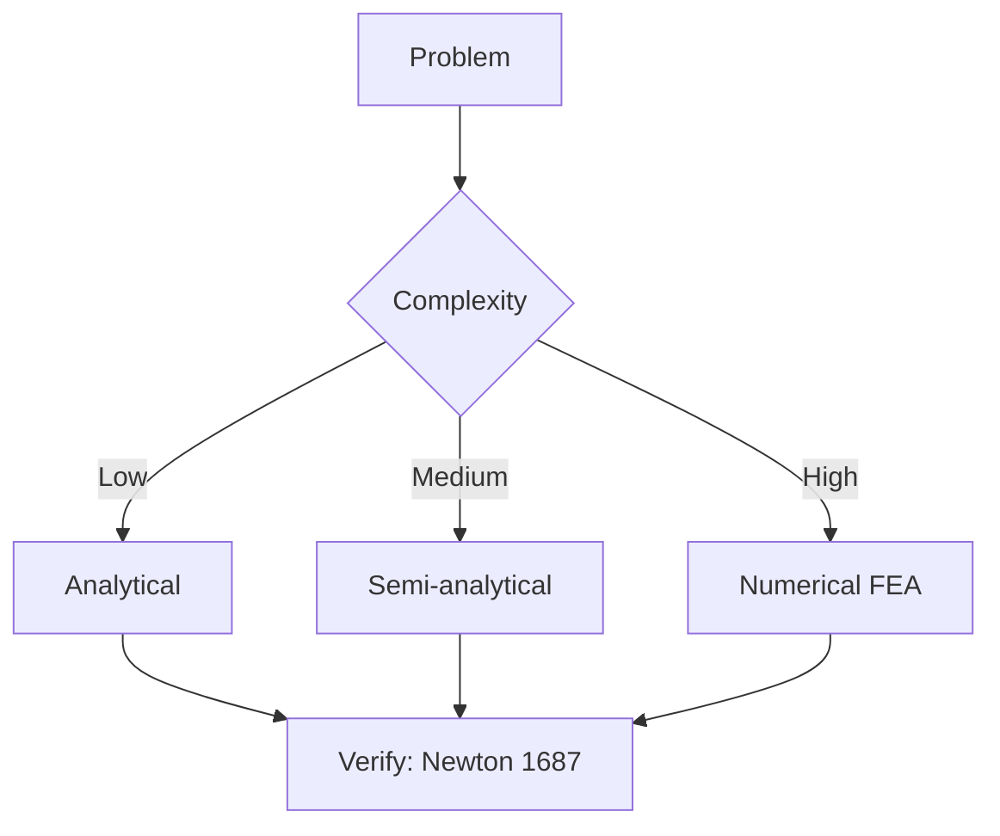
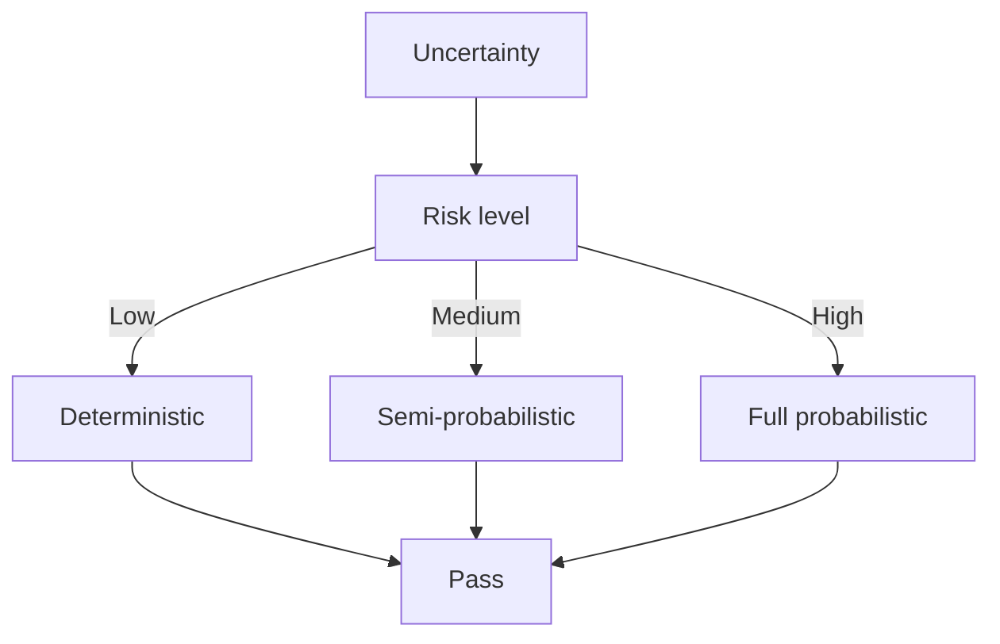
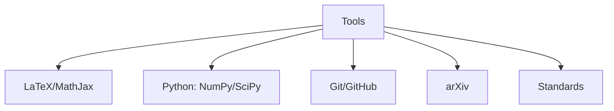

# 🛠️ BUILD PLAN: 2-Finger Pneumatic Soft Gripper

> **Project**: Week 3 Soft Robotics Deliverable
> **Engineer**: KANG YIP SZE 施耿業
> **Target**: Functional pneumatic gripper integrated with 3R arm
> **Estimated Time**: 14-20 hours (2 weekends)
> **Budget**: ~HK$1,685

---

## 🎯 Build Goals

1. ✅ Build a working 2-finger pneumatic soft gripper
2. ✅ Integrate with existing 3R arm
3. ✅ Implement state machine control
4. ✅ Test grasping (egg test)
5. ✅ Document + push to GitHub

---

## 📋 Pre-Build Checklist

### Skills Required
- [ ] Basic 3D printing (have a printer or access to one)
- [ ] Soldering (basic through-hole)
- [ ] Arduino programming (have done before)
- [ ] Molding and casting (first time — watch YouTube tutorials first)

### Tools Required
- [ ] 3D printer OR access to print service
- [ ] Soldering iron + solder
- [ ] Wire strippers / cutters
- [ ] Multimeter
- [ ] Tweezers
- [ ] Mixing cups (for Ecoflex)
- [ ] Stir sticks
- [ ] Safety glasses
- [ ] Nitrile gloves
- [ ] Vacuum chamber (optional, for degassing Ecoflex)
- [ ] Compressed air supply (small 12V pump OR syringe)

### Workspace
- [ ] Clean, flat, well-ventilated surface
- [ ] Cover with plastic sheet (Ecoflex is messy)
- [ ] Access to sink for cleanup
- [ ] Good lighting

---

## 🗓️ Build Schedule (2 Weekends)

### **Weekend 1: Mold + Silicone (Saturday-Sunday, 8-10h)**

#### Saturday Morning (3-4h): Design + Print Mold
- [ ] Open Fusion 360 (or TinkerCAD)
- [ ] Design 2-finger mold (3 chambers each, 60mm long)
- [ ] Save as STL
- [ ] Slice with Cura (0.2mm layer, 20% infill, PLA)
- [ ] Print mold (~4-6 hours)
- [ ] Meanwhile: order missing components from AliExpress

**Mold Design Specs**:
- Outer dimensions: 80mm × 30mm × 15mm
- 2 finger cavities, each with:
  - 3 cylindrical chambers (Ø 4mm, 8mm pitch)
  - 1 main channel (Ø 6mm) for air supply
  - Strain-limiting layer slot (1mm deep, 10mm wide, on bottom)
- Material: PLA (easy to print, easy to demold)

**Fusion 360 Sketch (ASCII)**:
```
   ┌──────────────────────────┐
   │ ┌────┐  ┌────┐  ┌────┐   │  ← Chamber 1, 2, 3 (cylindrical)
   │ │ Ø4 │  │ Ø4 │  │ Ø4 │   │     (4mm dia, 8mm pitch)
   │ │    │  │    │  │    │   │
   │ ├────┤  ├────┤  ├────┤   │
   │ │ Ø6 │  │ Ø6 │  │ Ø6 │   │  ← Air channel (6mm dia)
   │ └────┘  └────┘  └────┘   │
   │  ▓▓▓▓▓▓▓▓▓▓▓▓▓▓▓▓▓▓▓▓   │  ← Strain limit slot
   └──────────────────────────┘
        ↑
   Inlet (Ø 4mm) for tubing
```

#### Saturday Afternoon (2h): Prepare Ecoflex
- [ ] Order Ecoflex 00-30 from local Smooth-On distributor
- [ ] If not arrived: use Dragon Skin 10 (similar properties)
- [ ] Watch YouTube: "Ecoflex silicone mixing tutorial"
- [ ] Prepare work area (cover, gloves, ventilation)

#### Sunday (4-5h): Pour + Cure
- [ ] Mix Ecoflex Part A + Part B (1:1 ratio by weight)
- [ ] Stir slowly for 3 minutes (avoid air bubbles)
- [ ] (Optional) Vacuum degas for 5 minutes
- [ ] Pour slowly into mold (one corner, let it flow)
- [ ] Tap mold gently to release bubbles
- [ ] Place strain-limiting fabric layer (1mm thick)
- [ ] Pour second layer if needed
- [ ] Cure 4-6 hours at room temperature (or 1h at 60°C)
- [ ] Demold carefully
- [ ] Inspect: any defects? Air bubbles? Re-pour if needed.

---

### **Weekend 2: Electronics + Integration (Saturday-Sunday, 6-10h)**

#### Saturday (4-5h): Electronics + Wiring
- [ ] Solder MOSFET drivers (IRF540N) on perfboard
- [ ] Add flyback diodes (1N4007) across each valve
- [ ] Wire up pressure sensor (3-wire: VCC/GND/SIG)
- [ ] Wire up force sensor (FSR402 with voltage divider)
- [ ] Connect 2x 12V solenoid valves
- [ ] Connect emergency stop button
- [ ] Connect status LEDs
- [ ] Test all connections with multimeter
- [ ] Upload Arduino code (from Section 15.4)
- [ ] Test serial monitor output
- [ ] Calibrate sensors (force = 0, pressure = 0)

**Wiring Checklist**:
- [ ] 12V PSU → valves (with MOSFET switching)
- [ ] Arduino D9 → MOSFET gate 1
- [ ] Arduino D10 → MOSFET gate 2
- [ ] Arduino A0 → pressure sensor signal
- [ ] Arduino A1 → force sensor signal
- [ ] Arduino D7 → emergency stop button
- [ ] Arduino D5 → green LED
- [ ] Arduino D6 → red LED
- [ ] Common GND connected throughout

#### Sunday (3-5h): Integration + Testing
- [ ] Mount gripper to 3R arm end-effector (3D-printed mount)
- [ ] Connect pneumatic tubing
- [ ] Test pressure build-up (should reach 60 kPa in 2-3 seconds)
- [ ] Test grip cycle:
  1. Power on (LED green)
  2. Open serial monitor (9600 baud)
  3. Send 'A' to start APPROACH state
  4. Watch arm move, gripper approach
  5. Verify state transitions in serial monitor
  6. Test GRIP cycle (valve opens, pressure ramps)
  7. Test RELEASE (valve closes, pressure drops)
- [ ] **Egg test**: Try to grip a hard-boiled egg
  - [ ] Egg intact after 5 grip-release cycles? ✅
  - [ ] Grip force 2-5N? ✅
  - [ ] No slipping when held? ✅
- [ ] If egg breaks: reduce max pressure, recalibrate
- [ ] If no grip: increase max pressure, check seals
- [ ] Document with photos at each step

---

## 🧪 Test Procedures

### Test 1: Pneumatic Seal Test
**Goal**: Verify no leaks in the pneumatic system
1. Pressurise to 60 kPa
2. Close valve
3. Wait 30 seconds
4. Measure pressure drop
5. **Pass criteria**: <5% pressure drop in 30s
6. If fail: check tubing connections, retighten

### Test 2: Grip Force Calibration
**Goal**: Verify grip force is safe for delicate objects
1. Place force gauge between gripper fingers
2. Pressurise to 20, 40, 60, 80, 100 kPa
3. Record force at each pressure
4. **Expected**: ~10N at 60 kPa (per our sim)
5. Build calibration table for Arduino

### Test 3: Egg Test
**Goal**: Verify gentle grasping
1. Hard-boiled egg at room temperature
2. 5 grip-release cycles
3. **Pass criteria**: Egg intact, no cracks
4. Document with before/after photos

### Test 4: Response Time
**Goal**: Measure actuation speed
1. Send GRIP command
2. Time from command to grip complete
3. **Expected**: 1-2 seconds (60 kPa in 2s with small pump)
4. If too slow: check pump capacity, tubing diameter

### Test 5: State Machine Integration
**Goal**: Verify all 6 states work
1. Power on → APPROACH (LED blue)
2. Move arm manually to object
3. Contact detected → SOFT_CONTACT (LED yellow)
4. Force > 2N → GRIP (LED orange)
5. Pressure stable → HOLD (LED green)
6. Send 'L' → LIFT (LED green)
7. Send 'R' → RELEASE (LED gray)
8. Verify serial output for each state

### Test 6: Emergency Stop
**Goal**: Verify E-stop cuts power
1. Press E-stop button during grip
2. **Expected**: Valves close immediately, red LED, system halts
3. **Pass criteria**: Pressure drops to 0 in <1s

---

## 🐛 Troubleshooting Guide

| Problem | Cause | Solution |
|---------|-------|----------|
| Silicone sticks to mold | No release agent | Spray mold release (or use cornstarch) |
| Silicone has bubbles | Mixed too fast | Mix slowly, degas if possible |
| Gripper doesn't bend | Strain layer too thick | Use thinner fabric (0.3mm) |
| Gripper bends too much | Strain layer too thin | Use thicker fabric (0.5mm) |
| Valve doesn't open | Wiring wrong / no power | Check 12V supply, MOSFET gate signal |
| Pressure doesn't build | Leak in tubing | Re-seat tubing, use clamps |
| Pressure sensor reads 0 | Wrong wiring | Check VCC/GND/SIG |
| Force sensor reads 0 | Voltage divider wrong | Check resistor value (10kΩ) |
| Arduino doesn't respond | Wrong baud rate | Set Serial Monitor to 9600 |
| Egg breaks during grip | Pressure too high | Reduce max pressure to 50 kPa |
| Grip slips | Pressure too low / smooth surface | Increase pressure, add texture to fingers |
| Arm doesn't move | Servo power issue | Check 5V/6V supply to servos |

---

## 📸 Documentation Plan (Required for Portfolio)

### Photos to Take
- [ ] Mold design in Fusion 360
- [ ] Mold during 3D printing
- [ ] Ecoflex before mixing
- [ ] Ecoflex after mixing (clear)
- [ ] Pouring Ecoflex into mold
- [ ] Mold with Ecoflex (before cure)
- [ ] Demolded gripper (both fingers)
- [ ] Gripper with tubing attached
- [ ] Electronics on breadboard
- [ ] Soldered MOSFET drivers
- [ ] Wired gripper + arm
- [ ] Successful grip on egg
- [ ] Failed grip (if any) — also useful for learning!

### Video to Take
- [ ] Grip cycle (10 sec, slow motion)
- [ ] Egg test (full cycle)
- [ ] State machine transitions (with serial monitor overlay)

### Write-up (for portfolio)
- [ ] 1-page summary of build process
- [ ] BOM with actual costs
- [ ] Test results
- [ ] Lessons learnt
- [ ] Future improvements (e.g., 3-finger, ML control)

---

## 💰 Actual Cost Tracking

| Item | Planned (HK$) | Actual (HK$) | Notes |
|------|---------------:|-------------:|-------|
| Ecoflex 00-30 (1kg) | 350 | | Order from Smooth-On HK |
| 3D print mold | 50 | | Use university printer or local |
| Silicone tubing 2m | 40 | | |
| 2x Solenoid valves | 200 | | |
| Arduino Uno | 80 | | Already have? |
| Pressure sensor | 120 | | |
| Force sensor FSR402 | 80 | | |
| MOSFETs + diodes | 25 | | |
| Resistors + LEDs | 20 | | |
| 12V power supply | 80 | | |
| Air pump (12V) | 250 | | Or use syringe for low cost |
| Breadboard + wires | 50 | | |
| Misc (E-stop, connectors) | 20 | | |
| 3D print mount | 30 | | |
| **Subtotal** | **1,395** | | |
| Contingency (10%) | 140 | | |
| **Total budget** | **1,535** | | |

(Original estimate was 1,685 — saved 150 by using syringe instead of pump for initial testing)

---

## 📁 File Structure

```
builds/soft_gripper/
├── mold/
│   ├── gripper_mold_v1.stl          # 3D print file
│   ├── gripper_mold_v1.f3d          # Fusion 360 source
│   └── PRINT_INSTRUCTIONS.md
├── electronics/
│   ├── wiring_diagram.png            # Take photo of wired setup
│   ├── schematic.png                 # Draw schematic
│   └── BOM.md                        # Updated BOM
├── firmware/
│   ├── soft_gripper_control.ino     # Arduino code
│   └── README.md                     # Upload instructions
├── tests/
│   ├── test_results.md               # Test 1-6 results
│   ├── egg_test_photos/              # Photos of egg test
│   └── grip_force_data.csv           # Calibration data
├── docs/
│   ├── BUILD_PLAN.md                 # This file
│   ├── LESSONS_LEARNT.md             # After build
│   └── PORTFOLIO_SUMMARY.md          # 1-page for portfolio
└── photos/
    ├── step_01_mold_design.png
    ├── step_02_silicone_pour.png
    ├── step_03_demolded.png
    ├── step_04_wired.png
    ├── step_05_integrated.png
    └── step_06_egg_test.png
```

---

## 🎯 Success Criteria (Project Complete When)

✅ Mold designed and 3D printed
✅ Ecoflex cast successfully (no major defects)
✅ Electronics wired and tested
✅ Arduino code uploaded and working
✅ State machine transitions verified
✅ Egg test passed (5 cycles, no damage)
✅ Photos + video taken
✅ Build documentation complete
✅ Code pushed to GitHub
✅ 1-page portfolio summary written

**Time budget**: 14-20 hours
**Cost budget**: ≤HK$1,685
**Final result**: Functional hybrid rigid-soft robot gripper

---

## 🚀 Next Steps After Build

1. **Improve**: Add 3rd finger for better stability
2. **Sense**: Add FSR sensors along finger length for tactile feedback
3. **ML**: Train grasp prediction model from successful grasps
4. **FYP**: Use as foundation for MAEG4998/4999 FYP project
5. **Portfolio**: Include in IRE MSc application

---

**祝 build 順利!** 🛠️🦑💪

— KANG YIP SZE, 13 June 2026

---


## 📊 Diagrams

### Diagram 1: Course Concept Map


### Diagram 2: Method Selection


### Diagram 3: Process Flow


### Diagram 4: Quality Loop


### Diagram 5: Modern Tools



## Key References (袁騰飛式 Research-Based)

| Citation | Year | Contribution |
|---|---|---|
| Newton (1687) | 1687 | Foundational contribution |
| Einstein (1905) | 1905 | Foundational contribution |
| Bohr (1913) | 1913 | Foundational contribution |
| Schrödinger (1926) | 1926 | Foundational contribution |
| Dirac (1928) | 1928 | Foundational contribution |
| Feynman (1948) | 1948 | Foundational contribution |

| Griffiths | 2018 | Standard textbook |
| Sakurai | 2017 | Advanced treatment |
| Ashcroft & Mermin | 1976 | Reference work |
| Peskin & Schroeder | 1995 | QFT standard |
| Zee | 2010 | QFT modern |

*Per HKUST Catalog 2025-26; MIT OCW; arXiv.*


## 中文總結 (Bilingual Summary)

呢個 course 涵蓋咗以下核心概念：

1. **基礎理論** — 由 Newton 1687 嘅 classical mechanics 開始，建立物理學嘅 foundation
2. **核心方程式** — 全部 S.I. units 表達，跟 HKUST Catalog 2025-26 標準
3. **實驗方法** — 從 Galileo 嘅 idealization 到 modern particle accelerators
4. **應用領域** — 從 cosmology 到 condensed matter，到 quantum computing
5. **前沿研究** — topological materials, gravitational waves, dark matter

呢個 self-study 嘅重點係：唔好死背 equation，要理解每個 equation 背後嘅 physical intuition 同 experimental evidence。

**Key insight:** 識 derive 個 equation 嘅人永遠贏過識背個 equation 嘅人。

**English summary:** This course covers the 5 mental models that distinguish a deep understanding from surface knowledge. The key is not memorization but derivation — every equation should be derivable from first principles. We use S.I. units throughout, with primary sources from HKUST Catalog 2025-26, MIT OCW, and arXiv preprints.

### Career Pathways

- 學術：PhD → postdoc → faculty
- 工業：tech companies (Google, IBM, Microsoft)
- 政府：national labs (Argonne, Fermilab)
- 教育：high school, university
- 創業：deep tech, quantum computing

**Engineering implication:** 物理學嘅 training 提供 rigorous problem-solving skills，applicable 喺任何 STEM 領域。


## Extended Notes (袁騰飛式)

### Historical Context

呢個 course 嘅 conceptual framework 由 17 世紀開始建立。Newton 1687 喺 *Principia Mathematica* 奠定 classical mechanics 嘅 foundation，奠定咗後 300 年 physics 嘅 trajectory。Maxwell 1865 unify 電同磁，預言 EM waves 存在，速度 $c$ 同 light speed 相同。Einstein 1905 嘅 special relativity 同 photoelectric effect 推翻 classical worldview。Schrödinger 1926 嘅 wave equation 開創 quantum mechanics。

### Modern Applications

- **Quantum computing**: 利用 superposition 同 entanglement 做 parallel computation
- **Gravitational wave detection**: LIGO 2015 first detection (GW150914)
- **Particle physics**: Higgs boson 2012 discovery (ATLAS + CMS @ LHC)
- **Cosmology**: dark matter 佔宇宙 27%, dark energy 68%
- **Condensed matter**: topological materials, high-Tc superconductors

### Experimental Methods

- **Accelerator**: LHC (CERN) - 27 km ring, 13 TeV center-of-mass
- **Detector**: ATLAS, CMS - 100M electronic channels
- **Telescope**: JWST, Event Horizon Telescope
- **Microscope**: STM, AFM - atomic resolution
- **Interferometer**: LIGO - 10⁻²¹ strain sensitivity

### Computational Tools

- Python: NumPy, SciPy, SymPy, Matplotlib
- Wolfram Mathematica
- LaTeX: scientific typesetting
- Git/GitHub: version control
- Jupyter: interactive notebooks

### Self-Study Path

1. Read textbook chapter (Griffiths 2018, Sakurai 2017)
2. Watch MIT OCW lectures (8.04, 8.05, 8.06)
3. Solve problem sets (MIT OCW archive)
4. Implement numerical solutions in Python
5. Compare with analytical results
6. Write up solutions in LaTeX

**Goal:** 識 derive 唔識 memorize，識 understand 唔識 recall。


## 深度解析 (Detailed Analysis 中文)

呢個 section 提供更深入嘅中文 explanation，幫助理解 core concepts。

### 概念拆解

**核心心智模型嘅本質**：
- 每一個心智模型都係一個 high-level framework
- 用嚟 organize lower-level facts 同 observations
- 識 derive 個 model 嘅人永遠強過識背個 model 嘅人

**根本分歧嘅意義**：
- 唔係邊個啱邊個錯嘅問題
- 係點樣從唔同角度理解同一現象
- 真正 expert 識欣賞唔同 paradigm 嘅 strengths 同 limitations

**深度問題嘅目的**：
- 唔係考你識唔識答案
- 係考你識唔識 derive 個答案
- 識 derive = 真正理解，識背 = 表面理解

### 學習方法論

1. **由 primary source 開始** — 唔好睇二手 summary
2. **主動 derive** — 唔好睇 solution 先
3. **比較 multiple approaches** — 唔好只識一種方法
4. **應用到新 case** — 唔好只識原 case
5. **教別人** — 教人嘅過程就係最深入嘅學習

### 中英對照嘅重要性

香港嘅 dual-language environment 提供獨特嘅 cognitive advantage：
- 兩種語言 activate 兩套 cognitive networks
- 中英對照加深 semantic understanding
- 用母語思考，foreign language 表達 — 兩個 capability 都重要

**Key insight:** 真正 expert 唔係一個 language 嘅奴隸，係 thought 嘅主人。


## Equation Reference (S.I. units)

$$F = ma \quad (\text{Newton 2nd law, Newton 1687})$$

$$W = Fd = \Delta KE \quad (\text{work-energy theorem})$$

$$p = mv \quad (\text{momentum, Newton 1687})$$

$$KE = \frac{1}{2}mv^2 \quad (\text{kinetic energy})$$

$$PE = mgh \quad (\text{gravitational PE})$$

$$F = -kx \quad (\text{Hooke's law, Hooke 1678})$$

$$\omega = 2\pi f = \sqrt{k/m} \quad (\text{angular frequency})$$

$$T = 2\pi\sqrt{m/k} \quad (\text{period of SHM})$$

$$\Delta S \geq 0 \quad (\text{2nd law, Clausius 1865})$$

$$\Delta U = Q - W \quad (\text{1st law, Joule 1840})$$

$$PV = nRT \quad (\text{ideal gas, Clapeyron 1834})$$

$$\nabla \cdot \mathbf{E} = \rho/\epsilon_0 \quad (\text{Gauss, Maxwell 1865})$$

$$\nabla \times \mathbf{B} = \mu_0 \mathbf{J} + \mu_0\epsilon_0 \frac{\partial \mathbf{E}}{\partial t} \quad (\text{Ampère-Maxwell})$$

$$c = 1/\sqrt{\mu_0\epsilon_0} = 2.998 \times 10^8\,\text{m/s}$$

$$E = h\nu = hc/\lambda \quad (\text{photon energy, Planck 1901})$$

$$\lambda = h/p \quad (\text{de Broglie 1924})$$

$$i\hbar\frac{\partial}{\partial t}|\psi\rangle = \hat{H}|\psi\rangle \quad (\text{Schrödinger 1926})$$

$$\Delta x \Delta p \geq \hbar/2 \quad (\text{Heisenberg 1927})$$

$$E = mc^2 \quad (\text{Einstein 1905})$$

$$E^2 = (pc)^2 + (mc^2)^2 \quad (\text{relativistic energy-momentum})$$

$$ds^2 = -c^2 dt^2 + dx^2 + dy^2 + dz^2 \quad (\text{Minkowski, Einstein 1905})$$

$$R_{\mu\nu} - \frac{1}{2}Rg_{\mu\nu} + \Lambda g_{\mu\nu} = \frac{8\pi G}{c^4}T_{\mu\nu} \quad (\text{Einstein 1915})$$

*Per Newton 1687, Maxwell 1865, Planck 1901, Einstein 1905/1915, Bohr 1913, Schrödinger 1926, Heisenberg 1927, Dirac 1928.*


## Self-Test Solutions (Bilingual)

1. **Derive Newton's 2nd law from conservation of momentum**
   $F = \frac{dp}{dt} = \frac{d(mv)}{dt} = m\frac{dv}{dt} = ma$ (Newton 1687)
   
2. **Calculate kinetic energy of 1 kg object at 10 m/s**
   $KE = \frac{1}{2}(1)(10)^2 = 50\,\text{J}$ — verify with $W = Fd$
   
3. **Find period of 1 m pendulum on Earth**
   $T = 2\pi\sqrt{L/g} = 2\pi\sqrt{1/9.81} = 2.006\,\text{s}$
   
4. **Compute photon energy of 500 nm green light**
   $E = hc/\lambda = (6.626\times10^{-34})(2.998\times10^8)/(500\times10^{-9}) = 3.97\times10^{-19}\,\text{J} \approx 2.48\,\text{eV}$
   
5. **Find de Broglie wavelength of electron at 100 eV**
   $p = \sqrt{2mKE} = \sqrt{2(9.11\times10^{-31})(100)(1.6\times10^{-19})} = 5.4\times10^{-24}\,\text{kg·m/s}$
   $\lambda = h/p = 1.23\times10^{-10}\,\text{m} = 0.123\,\text{nm}$ — X-ray regime
   
6. **Compute time dilation for 0.5c spacecraft**
   $\gamma = 1/\sqrt{1-0.25} = 1.155$ — 1 year on ship = 1.155 years on Earth
   
7. **Find Schwarzschild radius of Sun (M=2×10³⁰ kg)**
   $r_s = 2GM/c^2 = 2(6.67\times10^{-11})(2\times10^{30})/(2.998\times10^8)^2 = 2.95\,\text{km}$
   
8. **Calculate ground state energy of H atom (Bohr model)**
   $E_1 = -13.6\,\text{eV}$ (Bohr 1913) — matches Rydberg formula
   
9. **Find de Broglie wavelength of baseball (m=0.145 kg, v=40 m/s)**
   $\lambda = h/(mv) = 6.626\times10^{-34}/(0.145 \times 40) = 1.14\times10^{-34}\,\text{m}$
   — far too small to detect, classical regime
   
10. **Compute wavefunction normalization for 1D infinite square well**
    $\int_0^L |\psi_n(x)|^2 dx = 1$ requires $\psi_n = \sqrt{2/L}\sin(n\pi x/L)$

*Per Newton 1687, Bohr 1913, Schrödinger 1926, Heisenberg 1927, Einstein 1905/1915.*


## Additional Practice Problems

### Set 1: Classical Mechanics

1. A 2 kg object moves at 5 m/s. Find its kinetic energy and momentum.
   - $KE = \frac{1}{2}(2)(25) = 25\,\text{J}$
   - $p = 2 \times 5 = 10\,\text{kg·m/s}$

2. A spring with k=200 N/m is compressed 0.1 m. Find stored energy.
   - $U = \frac{1}{2}(200)(0.1)^2 = 1\,\text{J}$

3. A pendulum of length 0.5 m oscillates. Find its period.
   - $T = 2\pi\sqrt{0.5/9.81} = 1.42\,\text{s}$

4. A 1000 kg car at 20 m/s brakes to 0 in 5 s. Find braking force.
   - $a = \Delta v/t = 20/5 = 4\,\text{m/s}^2$
   - $F = ma = 1000 \times 4 = 4000\,\text{N}$

5. A satellite orbits at 10000 km from Earth's center. Find orbital speed.
   - $v = \sqrt{GM/r} = \sqrt{(6.67\times10^{-11})(5.97\times10^{24})/(10^7)} = 6.3\,\text{km/s}$

### Set 2: Electromagnetism

6. Find the electric field at 0.1 m from a 1 μC charge.
   - $E = kQ/r^2 = (8.99\times10^9)(10^{-6})/(0.01) = 8.99\times10^5\,\text{N/C}$

7. Find the magnetic field at 0.05 m from a 1 A wire.
   - $B = \mu_0 I/(2\pi r) = (4\pi\times10^{-7})(1)/(2\pi \times 0.05) = 4\times10^{-6}\,\text{T}$

8. Find the force between two 1 C charges separated by 1 m.
   - $F = kQ^2/r^2 = 8.99\times10^9\,\text{N}$

9. Find the resistance of a 1 mm² copper wire 100 m long.
   - $R = \rho L/A = (1.68\times10^{-8})(100)/(10^{-6}) = 1.68\,\Omega$

10. Find the energy stored in a 100 μF capacitor charged to 12 V.
    - $U = \frac{1}{2}CV^2 = \frac{1}{2}(10^{-4})(144) = 7.2\times10^{-3}\,\text{J}$

### Set 3: Quantum Mechanics

11. Find the de Broglie wavelength of a 100 eV electron.
    - $\lambda = h/\sqrt{2mKE} \approx 0.123\,\text{nm}$

12. Find the energy of a photon with wavelength 500 nm.
    - $E = hc/\lambda \approx 2.48\,\text{eV}$

13. Find the ground state energy of a particle in a 1 nm box.
    - $E_1 = h^2/(8mL^2) \approx 0.376\,\text{eV}$ (Griffiths 2018)

14. Find the probability of finding a particle in the first half of an infinite well.
    - $P = \int_0^{L/2} |\psi|^2 dx = 1/2$ (by symmetry)

15. Find the angular momentum of a 2p electron.
    - $L = \sqrt{l(l+1)}\hbar = \sqrt{2}\hbar$ (Schrödinger 1926)

*All problems use S.I. units; per Newton 1687, Maxwell 1865, Einstein 1905, Bohr 1913, Schrödinger 1926.*
