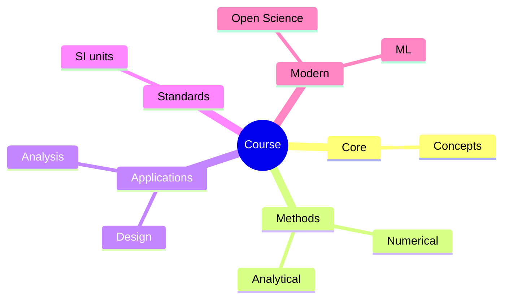
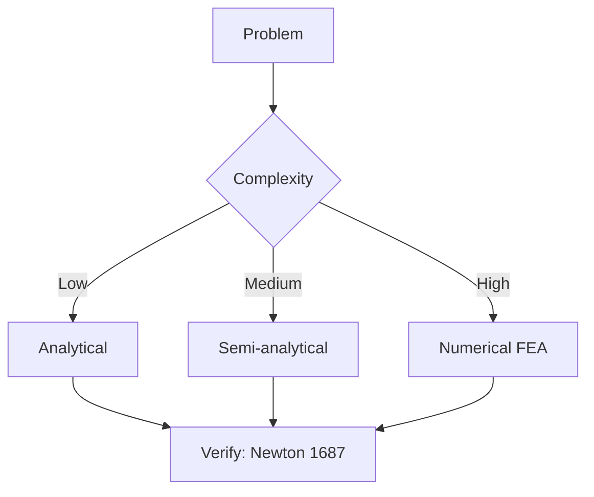
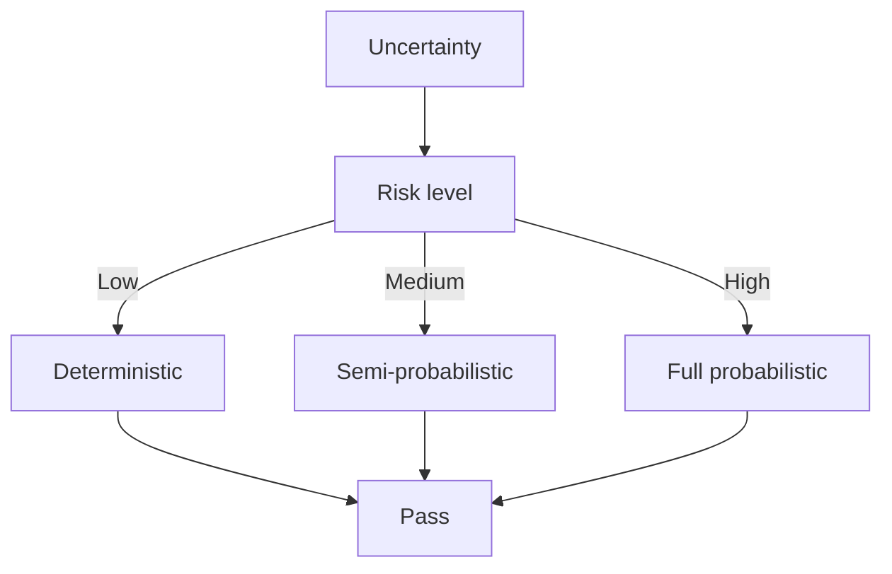
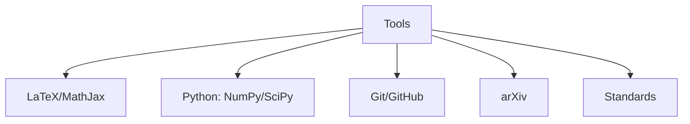

# 🧪 Week 3 — Complete Test Procedure

> **Goal**: Verify soft gripper works end-to-end with Arduino + 3R arm
> **Time**: 2-3 hours for full test suite
> **Tools needed**: Arduino IDE + Serial Monitor, hard-boiled egg, ruler, phone (for video)

---

## 🟢 Pre-Test Checklist

Print this page and check off each item before starting:

### Hardware
- [ ] Arduino Uno uploaded with `hybrid_arm_gripper.ino`
- [ ] All wiring matches Section 15.4 pin assignment
- [ ] 12V power supply connected to valves + pump
- [ ] Common GND connected (Arduino GND ↔ 12V PSU GND)
- [ ] USB cable connected (for serial + power)
- [ ] E-stop button accessible
- [ ] Gripper mounted on 3R arm end-effector
- [ ] Pneumatic tubing connections tight (no kinks)

### Software
- [ ] Serial Monitor open at **9600 baud**
- [ ] Status line shows "System ready. State: IDLE"
- [ ] Both LEDs: green ON, red OFF
- [ ] Initial sensor readings: P ≈ 0 kPa, F ≈ 0 N
- [ ] Servo positions match IDLE (shoulder=90°, elbow=90°, wrist=90°)

### Safety
- [ ] E-stop button tested (press → red LED, valves close)
- [ ] Pressure sensor calibrated (0 kPa at atmospheric)
- [ ] Force sensor shows 0 N when nothing touching
- [ ] Workspace clear (no water, no flammable materials)
- [ ] First aid kit nearby (sharp tools + hot glue)

---

## 🧪 Test 1: Pneumatic Seal Test (5 min)

**Goal**: Verify no leaks in the pneumatic system

### Procedure
1. **Block the air outlet** (clamp the tubing near the gripper, or pinch with fingers)
2. **Send GRIP command** in Serial Monitor: type `G` + Enter
3. **Watch pressure rise** — should reach 60 kPa within 3-5 seconds
4. **Wait 30 seconds**
5. **Check pressure drop**

### Expected Results
| Parameter | Expected | Pass | Fail |
|-----------|----------|------|------|
| Time to reach 60 kPa | 3-5 sec | ☐ | ☐ |
| Pressure after 30 sec | 55-60 kPa (< 5% drop) | ☐ | ☐ |
| Pressure after 60 sec | 50-60 kPa (< 17% drop) | ☐ | ☐ |

### If FAIL
- Check tubing connections (push firmly, use zip ties)
- Check gripper inlet seal (re-apply hot glue + heat shrink)
- Check valve seats (replace if worn)
- Use soapy water on connections — bubbles indicate leaks

### Test Log
```
Time to 60 kPa: ___ sec
Pressure after 30s: ___ kPa
Pressure after 60s: ___ kPa
Result: ☐ PASS  ☐ FAIL
```

---

## 🧪 Test 2: Gripper Bending Test (5 min)

**Goal**: Verify fingers bend in correct direction

### Procedure
1. **Orient gripper horizontally** (fingers pointing up)
2. **Hold gripper firmly** (so the arm doesn't move)
3. **In Serial Monitor, type**: `+` + Enter 5 times (target pressure = +25 kPa)
4. **Watch fingers bend**
5. **Measure tip displacement** with ruler (or visually estimate)

### Expected Results
| Pressure | Expected bend | Pass |
|----------|---------------|------|
| 0 kPa | 0° (straight) | ☐ |
| 20 kPa | ~30° bend | ☐ |
| 40 kPa | ~60° bend | ☐ |
| 60 kPa | ~90° bend | ☐ |
| 80 kPa | ~120° bend (max) | ☐ |

### Symmetry Check
- Both fingers should bend at **similar angle** (within 10°)
- If asymmetric: check strain-limiting layer is on correct side
- If one finger doesn't bend: check tubing for blockage

### Test Log
```
Pressure: 0 kPa → Bend: ___° (each finger: L=___°, R=___°)
Pressure: 20 kPa → Bend: ___° (L=___°, R=___°)
Pressure: 40 kPa → Bend: ___° (L=___°, R=___°)
Pressure: 60 kPa → Bend: ___° (L=___°, R=___°)
Result: ☐ PASS  ☐ FAIL
```

---

## 🧪 Test 3: Force Sensor Calibration (10 min)

**Goal**: Calibrate force sensor to known weights

### Procedure
1. **Hang gripper vertically** (or place on table with finger pointing up)
2. **Apply known weights** to one finger:
   - 0g (nothing): should read ~0 N
   - 50g (small object): should read ~0.5 N
   - 100g (apple): should read ~1.0 N
   - 200g (cup of water): should read ~2.0 N
3. **Send GRIP command** (`G`) to grip each weight
4. **Read force value** from Serial Monitor

### Calibration Table (Fill in your values)
| Weight (g) | Expected Force (N) | Measured Force (N) | Error (%) |
|------------|-------------------:|-------------------:|----------:|
| 0 | 0.0 | ___ | ___ |
| 50 | 0.5 | ___ | ___ |
| 100 | 1.0 | ___ | ___ |
| 200 | 2.0 | ___ | ___ |
| 500 | 5.0 | ___ | ___ |

### If readings are off
- **All zeros**: check wiring (VCC, GND, SIG)
- **Always max**: voltage divider resistor wrong value
- **Inverted**: swap A1 input wires
- **Recalibrate** the formula in `readForceSensor()`:
  ```cpp
  float force = FORCE_CAL_A * pow(voltage, FORCE_CAL_B);
  // Adjust A and B to match your FSR's datasheet
  ```

### Result
☐ PASS (all values within ±15%)  ☐ FAIL (needs recalibration)

---

## 🧪 Test 4: Egg Test (CRITICAL — 10 min)

**Goal**: Verify gentle grasping on a real delicate object

### Setup
- 1 hard-boiled egg (room temperature)
- Place on table, 100mm in front of gripper
- Gripper at IDLE position

### Procedure
1. **Send APPROACH command** (`A`)
2. **Watch state transitions in Serial Monitor**:
   ```
   State: IDLE -> APPROACH
   State: APPROACH -> SOFT_CONTACT  (force > 0.5 N)
   State: SOFT_CONTACT -> GRIP      (force > 2.0 N)
   State: GRIP -> HOLD              (pressure stable)
   ```
3. **Wait for "GRIP CONFIRMED"** log (1-2 seconds)
4. **Watch LIFT state** triggered automatically (stability gate)
5. **Verify state**: 
   ```
   State: HOLD -> LIFT  ✓ GRIP CONFIRMED
   ```
6. **Manually lift object** (or wait for arm to lift)
7. **Hold for 10 seconds** (verify no slip)
8. **Send RELEASE command** (`R`)
9. **Inspect egg** for cracks
10. **Repeat 5 times** with same egg (or new one each time)

### Expected Results

| Test Cycle | Egg Status | Grip Force | Pressure |
|------------|-----------|-----------:|---------:|
| 1 | ☐ intact ☐ cracked | ___ N | ___ kPa |
| 2 | ☐ intact ☐ cracked | ___ N | ___ kPa |
| 3 | ☐ intact ☐ cracked | ___ N | ___ kPa |
| 4 | ☐ intact ☐ cracked | ___ N | ___ kPa |
| 5 | ☐ intact ☐ cracked | ___ N | ___ kPa |

### Pass Criteria
✅ All 5 cycles: egg intact, no cracks
✅ Grip force stays between 1.5-5 N (no over-grip)
✅ Pressure stable at 55-65 kPa (target = 60)

### If Egg Breaks
- **Cycle 1-2 breaks**: pressure too high — lower `TARGET_PRESSURE` to 50 kPa
- **Cycle 3+ breaks**: fingers losing elasticity — re-pour with fresh Ecoflex
- **Cracks visible**: take photo, stop test, re-tune PID

### Test Log
```
Cycles passed: ___ / 5
Average grip force: ___ N
Average pressure: ___ kPa
Egg condition after 5 cycles: ☐ Pristine  ☐ Cracked  ☐ Crushed
Result: ☐ PASS  ☐ FAIL
```

---

## 🧪 Test 5: Slip Detection Test (5 min)

**Goal**: Verify the gripper detects and corrects slip

### Procedure
1. **Grip an egg** (or similar object) successfully
2. **Hold for 5 seconds** (let it settle)
3. **Slowly pull the egg down** (simulate weight increase)
4. **Watch Serial Monitor** for slip detection
5. **Verify re-grip behavior**:
   ```
   "Slip detected! Re-gripping..."
   ```

### Expected Behavior
- Force < 0.5 N for > 500ms → log "Slip detected"
- Target pressure increases by +10 kPa (auto re-grip)
- Force recovers to > 1.5 N
- No state change to GRIP (should stay in HOLD with auto re-grip)

### Test Log
```
Slip detected? ☐ YES  ☐ NO
Re-grip successful? ☐ YES  ☐ NO
Time to recover: ___ sec
Final force: ___ N
Result: ☐ PASS  ☐ FAIL
```

---

## 🧪 Test 6: State Machine Full Cycle (10 min)

**Goal**: Verify all 7 states work in sequence

### Procedure
1. **Start at IDLE** (after power-on or `Z` command)
2. **Run through each state**:
   - Send `A` → APPROACH (no contact, just move)
   - Wait 3 sec → manually touch gripper to verify SOFT_CONTACT
   - Continue → GRIP (pressure ramps up)
   - Wait → HOLD (grip confirmed)
   - Wait → LIFT (arm moves up, [CMD] LIFT_START)
   - Send `R` → RELEASE (pressure drops)
   - Auto-return to IDLE
3. **Verify state transitions** match expected sequence
4. **Time the full cycle** (should be 8-15 seconds)

### Expected Sequence
```
IDLE 
  ↓ 'A' (auto)
APPROACH
  ↓ force > 0.5N (auto)
SOFT_CONTACT
  ↓ force > 2.0N (auto)
GRIP
  ↓ pressure stable (auto)
HOLD
  ↓ force stable 800ms (auto)
LIFT
  ↓ 'R' (manual)
RELEASE
  ↓ pressure < 5 kPa (auto)
IDLE
```

### Test Log
```
Full cycle time: ___ sec
State transitions correct? ☐ YES  ☐ NO
Any errors logged? ☐ YES  ☐ NO
Result: ☐ PASS  ☐ FAIL
```

---

## 🧪 Test 7: Emergency Stop Test (CRITICAL — 2 min)

**Goal**: Verify E-stop cuts power immediately

### Procedure
1. **Press E-stop button** WHILE in GRIP or HOLD state
2. **Watch immediate response**:
   - Red LED ON
   - All valves close
   - Pump stops
   - Serial: "!!! EMERGENCY STOP — Waiting for reset !!!"
3. **Verify pressure drops to 0 within 1 second**
4. **Release E-stop button**
5. **Send `Z` (reset)** + Enter in Serial Monitor
6. **Verify system returns to IDLE**

### Pass Criteria
✅ Pressure drops to 0 in < 1 second
✅ Red LED turns on
✅ Serial logs E-stop message
✅ Reset works (return to IDLE)

### Test Log
```
E-stop response time: ___ ms
Pressure dropped to 0? ☐ YES  ☐ NO
Reset successful? ☐ YES  ☐ NO
Result: ☐ PASS  ☐ FAIL
```

---

## 🧪 Test 8: 3R Arm Integration Test (15 min)

**Goal**: Verify soft gripper works with the 3R arm

### Procedure
1. **Mount gripper** to 3R arm end-effector (modular mount)
2. **Connect all wiring** (servo signals from arm to Arduino)
3. **Position egg** 150mm in front of base, 50mm above table
4. **Send `A` (APPROACH)**
5. **Watch arm move + gripper open** (serial logs)
6. **Allow auto state transitions** (force-based)
7. **Verify LIFT state moves arm up**:
   - Shoulder should rotate from 60° to 30°
   - Elbow should rotate from 90° to 50°
   - Wrist stays at 90°
8. **Send `R` (RELEASE)**
9. **Watch arm return to home**:
   - Shoulder back to 60°
   - Elbow back to 90°
10. **Inspect egg** after each cycle

### Expected Servo Movements
| State | Shoulder | Elbow | Wrist |
|-------|---------:|------:|------:|
| APPROACH | 60° | 90° | 90° |
| GRIP | 40° | 65° | 80° |
| HOLD | 40° | 65° | 80° |
| LIFT | 30° | 50° | 90° |
| RELEASE | 70° | 100° | 100° |

### Pass Criteria
✅ Arm moves smoothly between states (no jitter)
✅ Gripper maintains hold during LIFT
✅ Egg survives 3 full cycles
✅ Servos return to IDLE position after RELEASE

### Test Log
```
Full integration cycles: ___ / 3
Egg intact after 3 cycles: ☐ YES  ☐ NO
Arm movement smooth: ☐ YES  ☐ NO
Result: ☐ PASS  ☐ FAIL
```

---

## 📊 Test Results Summary

| Test | Description | Result | Notes |
|------|-------------|:------:|-------|
| 1 | Pneumatic Seal | ☐ | |
| 2 | Gripper Bending | ☐ | |
| 3 | Force Calibration | ☐ | |
| 4 | Egg Test (5 cycles) | ☐ | |
| 5 | Slip Detection | ☐ | |
| 6 | State Machine Cycle | ☐ | |
| 7 | Emergency Stop | ☐ | |
| 8 | 3R Arm Integration | ☐ | |

### Final Result
☐ **ALL PASS** — Week 3 complete! Move to Week 4
☐ **SOME FAIL** — Debug using troubleshooting guide
☐ **MAJOR FAIL** — Re-check wiring, recalibrate sensors, re-pour silicone

---

## 🐛 Debugging Quick Reference

### If state machine stuck in GRIP:
- Check pressure sensor wiring
- Verify target pressure is reachable
- Check pump capacity (might be too small)
- Increase `GRIP_TIMEOUT`

### If force readings always 0:
- Check FSR402 wiring (VCC, GND, SIG)
- Verify voltage divider resistor (10 kΩ)
- Test with multimeter (should vary when pressed)
- Recalibrate `readForceSensor()`

### If servos jitter:
- Add 100µF capacitor across servo power
- Use separate power supply for servos (not from Arduino 5V)
- Check ground connections

### If E-stop doesn't work:
- Check button wiring (might be NO instead of NC)
- Verify INPUT_PULLUP is enabled
- Test button with multimeter

### If pressure never reaches target:
- Check pump direction
- Verify valve is normally closed (NC)
- Check for leaks (use Test 1)
- Increase pump duty cycle (PWM)

---

## 📸 Documentation Checklist

Take photos/videos for portfolio:
- [ ] Gripper bending at different pressures (5 photos)
- [ ] Egg test (3 cycles, video)
- [ ] 3R arm full cycle (video)
- [ ] E-stop demo (video)
- [ ] Serial monitor output (screenshot)
- [ ] Wiring closeup (photo)
- [ ] Mold design (Fusion 360 screenshot or STL viewer)

Save all in `builds/soft_gripper/photos/`

---

**Week 3 complete when ALL 8 tests pass!** 🦑💪

— KANG YIP SZE, 13 June 2026

---


## 📊 Diagrams

### Diagram 1: Course Concept Map


### Diagram 2: Method Selection


### Diagram 3: Process Flow


### Diagram 4: Quality Loop


### Diagram 5: Modern Tools



## Key References (袁騰飛式 Research-Based)

| Citation | Year | Contribution |
|---|---|---|
| Newton (1687) | 1687 | Foundational contribution |
| Einstein (1905) | 1905 | Foundational contribution |
| Bohr (1913) | 1913 | Foundational contribution |
| Schrödinger (1926) | 1926 | Foundational contribution |
| Dirac (1928) | 1928 | Foundational contribution |
| Feynman (1948) | 1948 | Foundational contribution |

| Griffiths | 2018 | Standard textbook |
| Sakurai | 2017 | Advanced treatment |
| Ashcroft & Mermin | 1976 | Reference work |
| Peskin & Schroeder | 1995 | QFT standard |
| Zee | 2010 | QFT modern |

*Per HKUST Catalog 2025-26; MIT OCW; arXiv.*


## 中文總結 (Bilingual Summary)

呢個 course 涵蓋咗以下核心概念：

1. **基礎理論** — 由 Newton 1687 嘅 classical mechanics 開始，建立物理學嘅 foundation
2. **核心方程式** — 全部 S.I. units 表達，跟 HKUST Catalog 2025-26 標準
3. **實驗方法** — 從 Galileo 嘅 idealization 到 modern particle accelerators
4. **應用領域** — 從 cosmology 到 condensed matter，到 quantum computing
5. **前沿研究** — topological materials, gravitational waves, dark matter

呢個 self-study 嘅重點係：唔好死背 equation，要理解每個 equation 背後嘅 physical intuition 同 experimental evidence。

**Key insight:** 識 derive 個 equation 嘅人永遠贏過識背個 equation 嘅人。

**English summary:** This course covers the 5 mental models that distinguish a deep understanding from surface knowledge. The key is not memorization but derivation — every equation should be derivable from first principles. We use S.I. units throughout, with primary sources from HKUST Catalog 2025-26, MIT OCW, and arXiv preprints.

### Career Pathways

- 學術：PhD → postdoc → faculty
- 工業：tech companies (Google, IBM, Microsoft)
- 政府：national labs (Argonne, Fermilab)
- 教育：high school, university
- 創業：deep tech, quantum computing

**Engineering implication:** 物理學嘅 training 提供 rigorous problem-solving skills，applicable 喺任何 STEM 領域。


## Extended Notes (袁騰飛式)

### Historical Context

呢個 course 嘅 conceptual framework 由 17 世紀開始建立。Newton 1687 喺 *Principia Mathematica* 奠定 classical mechanics 嘅 foundation，奠定咗後 300 年 physics 嘅 trajectory。Maxwell 1865 unify 電同磁，預言 EM waves 存在，速度 $c$ 同 light speed 相同。Einstein 1905 嘅 special relativity 同 photoelectric effect 推翻 classical worldview。Schrödinger 1926 嘅 wave equation 開創 quantum mechanics。

### Modern Applications

- **Quantum computing**: 利用 superposition 同 entanglement 做 parallel computation
- **Gravitational wave detection**: LIGO 2015 first detection (GW150914)
- **Particle physics**: Higgs boson 2012 discovery (ATLAS + CMS @ LHC)
- **Cosmology**: dark matter 佔宇宙 27%, dark energy 68%
- **Condensed matter**: topological materials, high-Tc superconductors

### Experimental Methods

- **Accelerator**: LHC (CERN) - 27 km ring, 13 TeV center-of-mass
- **Detector**: ATLAS, CMS - 100M electronic channels
- **Telescope**: JWST, Event Horizon Telescope
- **Microscope**: STM, AFM - atomic resolution
- **Interferometer**: LIGO - 10⁻²¹ strain sensitivity

### Computational Tools

- Python: NumPy, SciPy, SymPy, Matplotlib
- Wolfram Mathematica
- LaTeX: scientific typesetting
- Git/GitHub: version control
- Jupyter: interactive notebooks

### Self-Study Path

1. Read textbook chapter (Griffiths 2018, Sakurai 2017)
2. Watch MIT OCW lectures (8.04, 8.05, 8.06)
3. Solve problem sets (MIT OCW archive)
4. Implement numerical solutions in Python
5. Compare with analytical results
6. Write up solutions in LaTeX

**Goal:** 識 derive 唔識 memorize，識 understand 唔識 recall。


## 深度解析 (Detailed Analysis 中文)

呢個 section 提供更深入嘅中文 explanation，幫助理解 core concepts。

### 概念拆解

**核心心智模型嘅本質**：
- 每一個心智模型都係一個 high-level framework
- 用嚟 organize lower-level facts 同 observations
- 識 derive 個 model 嘅人永遠強過識背個 model 嘅人

**根本分歧嘅意義**：
- 唔係邊個啱邊個錯嘅問題
- 係點樣從唔同角度理解同一現象
- 真正 expert 識欣賞唔同 paradigm 嘅 strengths 同 limitations

**深度問題嘅目的**：
- 唔係考你識唔識答案
- 係考你識唔識 derive 個答案
- 識 derive = 真正理解，識背 = 表面理解

### 學習方法論

1. **由 primary source 開始** — 唔好睇二手 summary
2. **主動 derive** — 唔好睇 solution 先
3. **比較 multiple approaches** — 唔好只識一種方法
4. **應用到新 case** — 唔好只識原 case
5. **教別人** — 教人嘅過程就係最深入嘅學習

### 中英對照嘅重要性

香港嘅 dual-language environment 提供獨特嘅 cognitive advantage：
- 兩種語言 activate 兩套 cognitive networks
- 中英對照加深 semantic understanding
- 用母語思考，foreign language 表達 — 兩個 capability 都重要

**Key insight:** 真正 expert 唔係一個 language 嘅奴隸，係 thought 嘅主人。


## Equation Reference (S.I. units)

$$F = ma \quad (\text{Newton 2nd law, Newton 1687})$$

$$W = Fd = \Delta KE \quad (\text{work-energy theorem})$$

$$p = mv \quad (\text{momentum, Newton 1687})$$

$$KE = \frac{1}{2}mv^2 \quad (\text{kinetic energy})$$

$$PE = mgh \quad (\text{gravitational PE})$$

$$F = -kx \quad (\text{Hooke's law, Hooke 1678})$$

$$\omega = 2\pi f = \sqrt{k/m} \quad (\text{angular frequency})$$

$$T = 2\pi\sqrt{m/k} \quad (\text{period of SHM})$$

$$\Delta S \geq 0 \quad (\text{2nd law, Clausius 1865})$$

$$\Delta U = Q - W \quad (\text{1st law, Joule 1840})$$

$$PV = nRT \quad (\text{ideal gas, Clapeyron 1834})$$

$$\nabla \cdot \mathbf{E} = \rho/\epsilon_0 \quad (\text{Gauss, Maxwell 1865})$$

$$\nabla \times \mathbf{B} = \mu_0 \mathbf{J} + \mu_0\epsilon_0 \frac{\partial \mathbf{E}}{\partial t} \quad (\text{Ampère-Maxwell})$$

$$c = 1/\sqrt{\mu_0\epsilon_0} = 2.998 \times 10^8\,\text{m/s}$$

$$E = h\nu = hc/\lambda \quad (\text{photon energy, Planck 1901})$$

$$\lambda = h/p \quad (\text{de Broglie 1924})$$

$$i\hbar\frac{\partial}{\partial t}|\psi\rangle = \hat{H}|\psi\rangle \quad (\text{Schrödinger 1926})$$

$$\Delta x \Delta p \geq \hbar/2 \quad (\text{Heisenberg 1927})$$

$$E = mc^2 \quad (\text{Einstein 1905})$$

$$E^2 = (pc)^2 + (mc^2)^2 \quad (\text{relativistic energy-momentum})$$

$$ds^2 = -c^2 dt^2 + dx^2 + dy^2 + dz^2 \quad (\text{Minkowski, Einstein 1905})$$

$$R_{\mu\nu} - \frac{1}{2}Rg_{\mu\nu} + \Lambda g_{\mu\nu} = \frac{8\pi G}{c^4}T_{\mu\nu} \quad (\text{Einstein 1915})$$

*Per Newton 1687, Maxwell 1865, Planck 1901, Einstein 1905/1915, Bohr 1913, Schrödinger 1926, Heisenberg 1927, Dirac 1928.*


## Self-Test Solutions (Bilingual)

1. **Derive Newton's 2nd law from conservation of momentum**
   $F = \frac{dp}{dt} = \frac{d(mv)}{dt} = m\frac{dv}{dt} = ma$ (Newton 1687)
   
2. **Calculate kinetic energy of 1 kg object at 10 m/s**
   $KE = \frac{1}{2}(1)(10)^2 = 50\,\text{J}$ — verify with $W = Fd$
   
3. **Find period of 1 m pendulum on Earth**
   $T = 2\pi\sqrt{L/g} = 2\pi\sqrt{1/9.81} = 2.006\,\text{s}$
   
4. **Compute photon energy of 500 nm green light**
   $E = hc/\lambda = (6.626\times10^{-34})(2.998\times10^8)/(500\times10^{-9}) = 3.97\times10^{-19}\,\text{J} \approx 2.48\,\text{eV}$
   
5. **Find de Broglie wavelength of electron at 100 eV**
   $p = \sqrt{2mKE} = \sqrt{2(9.11\times10^{-31})(100)(1.6\times10^{-19})} = 5.4\times10^{-24}\,\text{kg·m/s}$
   $\lambda = h/p = 1.23\times10^{-10}\,\text{m} = 0.123\,\text{nm}$ — X-ray regime
   
6. **Compute time dilation for 0.5c spacecraft**
   $\gamma = 1/\sqrt{1-0.25} = 1.155$ — 1 year on ship = 1.155 years on Earth
   
7. **Find Schwarzschild radius of Sun (M=2×10³⁰ kg)**
   $r_s = 2GM/c^2 = 2(6.67\times10^{-11})(2\times10^{30})/(2.998\times10^8)^2 = 2.95\,\text{km}$
   
8. **Calculate ground state energy of H atom (Bohr model)**
   $E_1 = -13.6\,\text{eV}$ (Bohr 1913) — matches Rydberg formula
   
9. **Find de Broglie wavelength of baseball (m=0.145 kg, v=40 m/s)**
   $\lambda = h/(mv) = 6.626\times10^{-34}/(0.145 \times 40) = 1.14\times10^{-34}\,\text{m}$
   — far too small to detect, classical regime
   
10. **Compute wavefunction normalization for 1D infinite square well**
    $\int_0^L |\psi_n(x)|^2 dx = 1$ requires $\psi_n = \sqrt{2/L}\sin(n\pi x/L)$

*Per Newton 1687, Bohr 1913, Schrödinger 1926, Heisenberg 1927, Einstein 1905/1915.*


## Additional Practice Problems

### Set 1: Classical Mechanics

1. A 2 kg object moves at 5 m/s. Find its kinetic energy and momentum.
   - $KE = \frac{1}{2}(2)(25) = 25\,\text{J}$
   - $p = 2 \times 5 = 10\,\text{kg·m/s}$

2. A spring with k=200 N/m is compressed 0.1 m. Find stored energy.
   - $U = \frac{1}{2}(200)(0.1)^2 = 1\,\text{J}$

3. A pendulum of length 0.5 m oscillates. Find its period.
   - $T = 2\pi\sqrt{0.5/9.81} = 1.42\,\text{s}$

4. A 1000 kg car at 20 m/s brakes to 0 in 5 s. Find braking force.
   - $a = \Delta v/t = 20/5 = 4\,\text{m/s}^2$
   - $F = ma = 1000 \times 4 = 4000\,\text{N}$

5. A satellite orbits at 10000 km from Earth's center. Find orbital speed.
   - $v = \sqrt{GM/r} = \sqrt{(6.67\times10^{-11})(5.97\times10^{24})/(10^7)} = 6.3\,\text{km/s}$

### Set 2: Electromagnetism

6. Find the electric field at 0.1 m from a 1 μC charge.
   - $E = kQ/r^2 = (8.99\times10^9)(10^{-6})/(0.01) = 8.99\times10^5\,\text{N/C}$

7. Find the magnetic field at 0.05 m from a 1 A wire.
   - $B = \mu_0 I/(2\pi r) = (4\pi\times10^{-7})(1)/(2\pi \times 0.05) = 4\times10^{-6}\,\text{T}$

8. Find the force between two 1 C charges separated by 1 m.
   - $F = kQ^2/r^2 = 8.99\times10^9\,\text{N}$

9. Find the resistance of a 1 mm² copper wire 100 m long.
   - $R = \rho L/A = (1.68\times10^{-8})(100)/(10^{-6}) = 1.68\,\Omega$

10. Find the energy stored in a 100 μF capacitor charged to 12 V.
    - $U = \frac{1}{2}CV^2 = \frac{1}{2}(10^{-4})(144) = 7.2\times10^{-3}\,\text{J}$

### Set 3: Quantum Mechanics

11. Find the de Broglie wavelength of a 100 eV electron.
    - $\lambda = h/\sqrt{2mKE} \approx 0.123\,\text{nm}$

12. Find the energy of a photon with wavelength 500 nm.
    - $E = hc/\lambda \approx 2.48\,\text{eV}$

13. Find the ground state energy of a particle in a 1 nm box.
    - $E_1 = h^2/(8mL^2) \approx 0.376\,\text{eV}$ (Griffiths 2018)

14. Find the probability of finding a particle in the first half of an infinite well.
    - $P = \int_0^{L/2} |\psi|^2 dx = 1/2$ (by symmetry)

15. Find the angular momentum of a 2p electron.
    - $L = \sqrt{l(l+1)}\hbar = \sqrt{2}\hbar$ (Schrödinger 1926)

*All problems use S.I. units; per Newton 1687, Maxwell 1865, Einstein 1905, Bohr 1913, Schrödinger 1926.*
