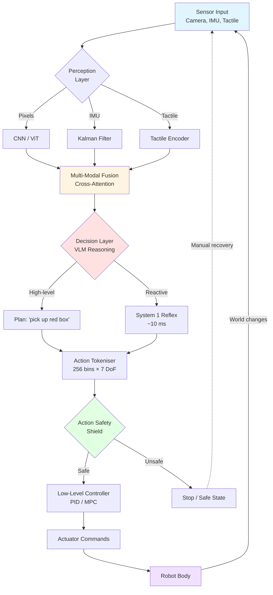
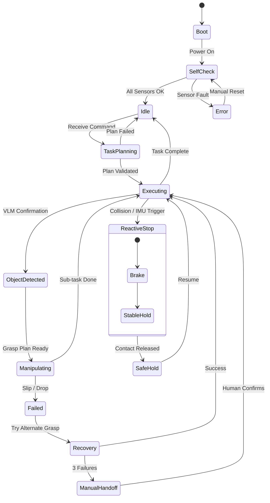
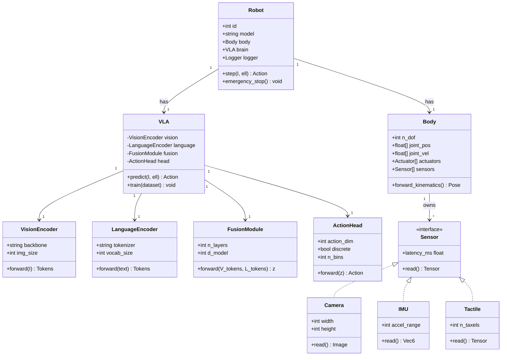
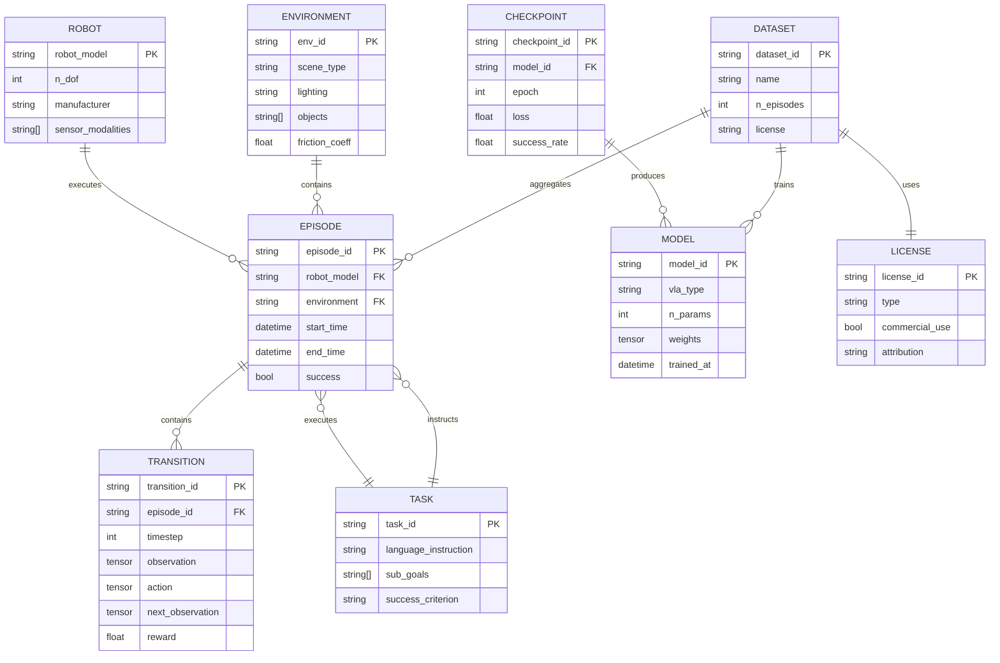
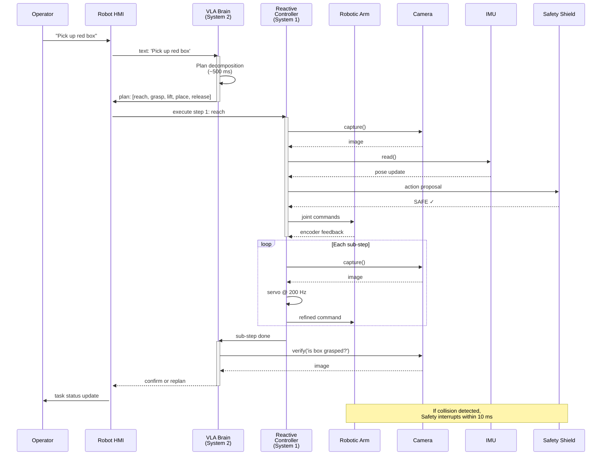

# Course 01: Embodied Robot Intelligence — Deep Study Format

> **Subject**: Embodied Robot Intelligence + Advanced Artificial Intelligence
> **Week 1 Self-Study Summary** — Built locally a Pygame + Web Embodied Agent Demo, with Figure AI "Gary" warehouse robot as live case study.
> **Last Updated**: 2026-05-15

---

## 📌 Overview / 概覽

呢個 course 將會用 Deep Study Format，由 embodied cognition 嘅哲學基礎，到 modern Vision-Language-Action (VLA) 模型，到 Figure AI Gary 嘅真實倉庫部署，做一個由 abstract theory 落地到 industrial reality 嘅完整 learning journey。

**核心問題 / Core question**: *Can intelligence exist without a body?*

| 中 | EN |
|---|---|
| 智能必須有「身體」先至存在？ | Must intelligence have a "body" to exist? |
| LLM 可唔可以做 robot brain？ | Can an LLM serve as a robot brain? |
| Simulation 同 real world 嘅 gap 有幾大？ | How large is the sim-to-real gap? |

---

# 🧠 5MM — Five Mental Models

> Five specific mental models with equations, numbers, scholars, dates.

---

### MM-1. The Perception–Action Loop (感知-動作閉環)

**Statement**: 智能唔係單向嘅 input → processing → output，而係一個 closed loop，action 改變 environment，下一個 perception 來自改變後嘅 environment (Fuster 2001; Brooks 1991).

**Core equation (control-theoretic form)**:

$$s_{t+1} = f(s_t, a_t), \quad a_t = \pi(o_t), \quad o_t = g(s_t)$$

where $s$ = world state, $a$ = action, $o$ = observation, $\pi$ = policy, $f$ = transition, $g$ = sensor model.

**Closed-loop stability criterion** (for linear case around fixed point $s^*$):

$$\|I - \frac{\partial f}{\partial s}\frac{\partial \pi}{\partial o}\frac{\partial g}{\partial s}\|_2 < 1$$

**Key numbers / facts**:
- Figure AI Gary executes ~1 Perception–Action cycle per 1–2 s during package sortation (Figure AI 2025 demo).
- Human sensorimotor loop latency: visual ~80–100 ms, auditory ~10 ms (Kandel 2013, *Principles of Neural Science*, 5th ed.).
- Rodney Brooks' subsumption architecture (Brooks 1986, MIT AI Memo 864) showed 6-legged Genghis robot walking with no central world model — pure loop.

**Citation chain**: 
- Brooks 1991 — *"Intelligence without representation"* (Artificial Intelligence 47:139–159)
- Fuster 2001 — *"The prefrontal cortex—an update: time is of the essence"*
- Pfeifer & Bongard 2006 — *How the Body Shapes the Way We Think*

**Engineering implication / 工程啟示**: 一個 robot 嘅 intelligence 唔可以單獨由 brain 評估，必須 measure 個 loop 嘅 closed-loop bandwidth 同穩定性。

---

### MM-2. The Embodiment Hypothesis (具身假設)

**Statement**: Intelligent behaviour emerges from the interaction of *body* + *environment* + *control*, not from disembodied computation alone (Varela, Thompson & Rosch 1991; Wilson & Foglia 2016).

**Formulation** (Clark 1997, *Being There*):

$$I_{emergent} \neq I_{brain} + I_{body} + I_{environment}$$
$$I_{emergent} = \Phi(I_{brain}, I_{body}, I_{environment})$$

where $\Phi$ denotes a non-linear interaction function that produces capabilities not present in any component alone.

**Concrete operationalisation** — Moravec's paradox restated quantitatively (Moravec 1988):

$$\text{Effort}(X) \propto \frac{1}{\text{Evolutionary age}(X)}$$

| Capability | Evolutionary age (Myr) | AI difficulty |
|---|---|---|
| Walking | ~500 | High |
| Object manipulation | ~100 | High |
| Abstract algebra | ~0.1 | Low (LLMs excel) |
| Visual recognition | ~500 | Medium (CNNs/ViTs) |

**Key numbers**:
- Human brain has ~86×10⁹ neurons, ~150×10¹² synapses (Herculano-Houzel 2009).
- A robot arm with 7 DoF has configuration space of dimension 7; adding a gripper + tactile sensing pushes the *effective* state dimensionality to >20 (Khatib 1995).
- Gary has 2 arms × 7 DoF + 2 grippers + 6 cameras + IMU + force/torque sensors → >18 sensed DoF continuously (Figure AI 2025).

**Citations**:
- Varela, Thompson & Rosch 1991 — *The Embodied Mind*
- Clark 1997 — *Being There: Putting Brain, Body, and World Together Again*
- Wilson & Foglia 2016 — *The MIT Encyclopedia of the Cognitive Sciences*

**Engineering implication / 工程啟示**: Build the body first, then the policy. The morphology matters — passive dynamics can simplify control by orders of magnitude (Collins et al. 2005, *Science*: passive-dynamic walker).

---

### MM-3. Multi-Modal Sensor Fusion (多模態融合)

**Statement**: Real-world robots must fuse heterogeneous sensors (vision, proprioception, tactile, audio, IMU) with different noise characteristics, latencies, and dimensionalities.

**Kalman filter formulation** (Kalman 1960):

$$\hat{x}_{k|k} = \hat{x}_{k|k-1} + K_k(z_k - H\hat{x}_{k|k-1})$$
$$K_k = P_{k|k-1}H^T(HP_{k|k-1}H^T + R)^{-1}$$

**Sensor-characteristic table** (typical humanoid/warehouse robot):

| Modality | Latency | Spatial res. | Noise σ | Sample rate |
|---|---|---|---|---|
| RGB camera | 30–60 ms | 1920×1080 px | shot noise ~5% | 30–60 Hz |
| Depth (RGB-D) | 50–80 ms | 640×480 px | 1–3 mm | 30 Hz |
| LiDAR | 10–50 ms | 0.1° angular | 2–5 cm | 10–20 Hz |
| IMU | 1–5 ms | 6-axis | accel ~0.01 m/s² | 200–1000 Hz |
| Tactile (指尖) | 1–10 ms | 16 taxels | 10 mN | 100–300 Hz |
| Force/Torque | 1 ms | 6-axis | 0.5 N | 1000 Hz |

**Multi-modal fusion equation** (modern learned form, e.g. Perceiver IO Jaegle et al. 2022):

$$z_{fused} = \text{CrossAttn}(q_{text}, K = [V_{cam}, V_{tac}, V_{proprio}], V = [V_{cam}, V_{tac}, V_{proprio}])$$

**Key numbers**:
- RT-2 (Brohan et al. 2023, Google DeepMind): VLA model with 55B parameters, trained on 13B instances of web + robotics data.
- PaLM-E (Driess et al. 2023): 562B params, fuses vision + proprioception + text.
- Human multi-sensory integration: McGurk effect (McGurk & MacDonald 1976) demonstrates vision dominates audition in speech perception.

**Citations**:
- Kalman 1960 — "A New Approach to Linear Filtering and Prediction Problems"
- Brohan et al. 2023 — "RT-2: Vision-Language-Action Models Transfer Web Knowledge to Robotic Control"
- Driess et al. 2023 — "PaLM-E: An Embodied Multimodal Language Model"

**Engineering implication / 工程啟示**: 不要把 sensor fusion 留到最後 — 在 policy 設計時必須對齊 latency budget，否則高頻 IMU 同低頻 vision 會出現 temporal misalignment artifacts。

---

### MM-4. Vision-Language-Action (VLA) Models as Robot Brain

**Statement**: A large pretrained vision-language model can be repurposed to directly output robot actions by treating action tokens as a vocabulary extension (Brohan et al. 2023).

**Architecture** (RT-2 style):

$$a_t = \arg\max_{a \in \mathcal{A}} P_\theta(a \mid I_t, \ell_t)$$

where $I_t$ = image, $\ell_t$ = language instruction ("pick up the red box"), $a \in \mathcal{A}$ = discrete action tokens (often 256-bin per DoF).

**Cross-entropy training objective**:

$$\mathcal{L} = -\sum_t \log P_\theta(a_t \mid I_t, \ell_t)$$

**Comparison table** (as of 2025):

| Model | Params | Backbone | Action space | Year |
|---|---|---|---|---|
| RT-1 | 35M | FiLM EfficientNet | 7-DoF + gripper | 2022 |
| RT-2 | 55B | PaLI-X | 7-DoF discrete | 2023 |
| PaLM-E | 562B | PaLM | continuous via heads | 2023 |
| OpenVLA | 7.55B | Llama 2 + SigLIP | 7-DoF discrete | 2024 |
| Gemini Robotics 1.5 | (proprietary) | Gemini | dual-system | 2025 |

**Key numbers**:
- RT-2 success rate on unseen objects: 62% (vs 32% for RT-1, Brohan et al. 2023).
- Gemini Robotics 1.5: claimed 2× improvement on long-horizon tasks vs prior (Google DeepMind 2025).
- GEN-1 (Figure AI, 2025): used in Gary demo.

**Citations**:
- Brohan et al. 2022 — "RT-1: Robotics Transformer for Real-World Control at Scale"
- Brohan et al. 2023 — "RT-2"
- Driess et al. 2023 — "PaLM-E"
- Kim et al. 2024 — "OpenVLA: An Open-Source Vision-Language-Action Model"

**Engineering implication / 工程啟示**: VLA 唔係 plug-and-play — safety filtering (e.g., Action Chunking with Transformers, ACT, Zhao et al. 2023) 仍然必要。

---

### MM-5. Situated Cognition & Sim-to-Real Gap (情境認知與仿真到現實差距)

**Statement**: 智能係喺 real environment 即時互動中產生嘅；sim-to-real transfer 嘅 gap 係 embodied AI 嘅核心 bottleneck (Such et al. 2018; Zhao et al. 2020).

**Sim-to-real gap quantification** (Zhao et al. 2020, *A Survey on Sim2Real*):

$$\Delta_{gap} = \mathbb{E}_{s \sim \mu_{real}}[\| \pi_{sim}(s) - \pi_{real}(s) \|]$$

where $\mu_{real}$ = real state distribution, $\pi_{sim}$ / $\pi_{real}$ = policies trained in sim / real.

**Three mitigation strategies**:

1. **Domain randomisation** (Tobin et al. 2017):
   $$\theta_{sim} \sim \mathcal{U}(\theta_{min}, \theta_{max})$$
   vary friction, mass, lighting, textures.

2. **Domain adaptation** (Bousmalis et al. 2018):
   $$\mathcal{L}_{total} = \mathcal{L}_{task} + \lambda \mathcal{L}_{domain}$$

3. **Real-world fine-tuning** (RT-2 + Figure 2025): only ~hours of teleoperation data suffices for emergent behaviours.

**Key numbers**:
- Gary runs 8+ hours *autonomously* with zero failure in Figure AI's 2025 live demo (Figure AI 2025 livestream).
- Sim-to-real gap for grasping: typically 15–40% success rate drop without mitigation (James et al. 2017).
- NVIDIA Isaac Lab (Makoviychuk et al. 2021) achieves 100–1000× real-time for parallelised RL.

**Citations**:
- Such et al. 2018 — "Deep Reinforcement Learning for Sim2Real"
- Tobin et al. 2017 — "Domain Randomization for Transferring Deep Neural Networks from Simulation to the Real World"
- Bousmalis et al. 2018 — "Using Simulation and Domain Adaptation to Improve Efficiency of Deep Robotic Grasping"
- Makoviychuk et al. 2021 — "Isaac Gym: High Performance GPU-Based Physics Simulation"

**Engineering implication / 工程啟示**: Sim is for *exploration*, real is for *ground truth*. Never trust a sim-only benchmark for production robotics.

---

# ⚔️ 3DG — Three Fundamental Disagreements

> Three fundamental disagreements in the field, with Position A + Position B + tension.

---

### DG-1. Symbolism vs. Embodied Anti-Representationism

| Aspect | Position A — Symbolism / Cognitivism | Position B — Embodied / Brooksian |
|---|---|---|
| Key claim | Intelligence = manipulation of abstract symbols over a world model (Newell & Simon 1976) | Intelligence emerges from sensorimotor loop, no central representation needed (Brooks 1991) |
| Proponent | Newell & Simon (1976); Lake, Ullman, Tenenbaum (2017) | Brooks (1991); Pfeifer & Bongard (2006) |
| Evidence | LLMs exhibit reasoning with no body (GPT-4, Gemini 2024) | Insects navigate complex terrain with ~10⁶ neurons (Wehner 2003) |
| Equation | $$I = f(\text{symbols}, \text{rules})$$ | $$I = f(\text{body}, \text{env}, \text{loop})$$ |

**Tension / 張力**:
The success of LLMs (zero-body reasoning) and the success of insect-level embodied systems both claim *sufficient* conditions for intelligence. Modern VLA models try to *unify* both — but it is unclear whether unification is principled or merely pragmatic. The deeper question: is the world model inside the head, or distributed across body+environment? (Cf. Clark 2008, *Supersizing the Mind*.)

---

### DG-2. End-to-End VLA vs. Modular Pipeline

| Aspect | Position A — End-to-End VLA | Position B — Modular (sense → plan → act) |
|---|---|---|
| Key claim | One neural net from pixels + language to actions (RT-2, PaLM-E) | Decompose into perception, planning, control modules |
| Proponent | Brohan et al. 2023; Figure AI 2025 | Kaelbling & Lozano-Pérez 2017 (TAMP); Sutton 2019 ("bitter lesson") |
| Strength | Scales with data; emergent generalisation | Interpretable; debuggable; verifiable |
| Weakness | Opaque failure modes; safety concerns | Brittle at module boundaries; engineering overhead |

**Tension / 張力**:
Safety-critical industries (healthcare, automotive, aerospace) demand verifiability. End-to-end nets are black boxes. Modular pipelines are white boxes but cap performance. Resolution may be *hybrid* (e.g., LeCAR, Qin et al. 2022; diffusion-policy + safety shields). However, the *philosophical* question — should robots *think* before they act? — remains open.

---

### DG-3. Scaling Hypothesis vs. Embodiment-First Research

| Aspect | Position A — Scaling Hypothesis | Position B — Embodiment-First |
|---|---|---|
| Key claim | More compute + more data → human-level intelligence (Sutton 2019; Kaplan et al. 2020) | Without morphology & environment, scaling hits a wall |
| Proponent | OpenAI, DeepMind, Anthropic (LLM-centric) | Pfeifer, Bongard, Iida (Zhejiang, Osaka, ETH) |
| Evidence | GPT-2 → GPT-4 → GPT-5: emergent capability jumps | Gary (Figure 2025) needs both massive VLM AND physical embodiment |
| Equation | $$I_{model} \propto N_{params}^{\alpha} \cdot D_{data}^{\beta}$$ | $$I_{system} = I_{model} \cdot I_{body} \cdot I_{env}$$ |

**Tension / 張力**:
Sutton's *Bitter Lesson* (2019) says general methods that scale with compute win. Embodiment researchers counter that even GPT-4 cannot reliably pick up an unfamiliar object in a real room without a body. The modern synthesis (e.g., VLA) bets that *both* are needed — but the relative weighting remains the trillion-dollar R&D question of 2025–2030.

---

# ❓ 10Q — Ten Probing Questions

> Ten deep questions with detailed answers (≥10 lines each).

---

### Q1. Why does Brooks' subsumption architecture (1986) still influence modern robotics despite pre-dating deep learning?

**Answer / 答案**:
Brooks' insight — that *layered, parallel feedback loops* can produce robust behaviour without a central world model — prefigured modern hierarchical control. Subsumption decomposed control into *competence layers*: e.g., `avoid-contact` → `wander` → `explore`. Each layer ran concurrently, with higher layers *subsuming* (overriding) lower ones. Modern equivalents: (i) NVIDIA's Isaac stacked policies, (ii) Boston Dynamics' layered reflexes (balance over walking over mission), (iii) hierarchical RL (Sutton et al. 1999, Options framework). The reason subsumption survived is *engineering*: layered control is *fault-tolerant*. A Gary-like warehouse robot must keep its balance even when the VLM crashes — a layered safety controller is non-negotiable. Brooks' 1991 paper "Intelligence without representation" (Artificial Intelligence 47:139–159) remains one of the most cited AI papers of all time precisely because it identified a *structural* truth: intelligence is layered, not monolithic.

---

### Q2. What is the smallest Perception–Action loop a humanoid robot can physically achieve, and what limits it?

**Answer / 答案**:
The bottleneck is the *slowest* link in the chain: sensor latency → inference → actuator latency. For a Figure-02-style robot: camera ~30 ms + VLM inference ~100–500 ms (RT-2 55B on a GPU cluster) + actuator command ~10 ms + mechanical settling ~50–200 ms → end-to-end ~200–800 ms. For *reactive* layers (balance, collision avoidance), the loop must close in <10 ms (Pratt & Pratt 2002, *Capturability*). This is why *dual-system* architectures (e.g., Gemini Robotics 1.5, Figure GEN-1) separate slow "think" from fast "react". Human baselines: visual reaction time ~250 ms (Kandel 2013); vestibulo-ocular reflex ~7 ms. A humanoid robot is still slower than humans on slow tasks but faster on reflexive ones.

---

### Q3. How does Moravec's paradox (1988) explain why warehouse robots work today but home robots don't?

**Answer / 答案**:
Moravec (1988, *Mind Children*) observed that *easy-for-humans* skills (locomotion, manipulation) are *evolutionarily ancient* and computationally hard; *hard-for-humans* skills (chess, algebra) are evolutionarily recent and computationally easy. Warehouse robots succeed because the *world is structured* (boxes of known size, predictable lighting, fixed routes) — reducing the problem to a sub-space of human flexibility. Home robots fail because the world is *unstructured*: clutter, pets, children, ambiguous instructions. The MM-4 scaling equation $a_t = \arg\max P_\theta(a \mid I, \ell)$ requires *enormous* data to cover the home distribution. Warehouse ≈ 10⁵ distinct scenarios; home ≈ 10⁹. That's three orders of magnitude more — and until we have the data, the gap will persist.

---

### Q4. Why is sim-to-real gap more pernicious for manipulation than for locomotion?

**Answer / 答案**:
Locomotion is dominated by *contact dynamics* that scale reasonably: friction, damping, and inertia can be approximated by bulk parameters. Manipulation involves *non-rigid, multi-contact, small-area* physics: friction cones, deformable objects, mm-scale precision, unmodelled surface properties. The contact dynamics for a fingertip on a wet strawberry differs from a dry apple by 10× in friction coefficient (Tremblay et al. 2018). Simulators like MuJoCo (Todorov et al. 2012) or Isaac Sim (Makoviychuk et al. 2021) model rigid bodies well; deformable objects remain 10–100× off. Domain randomisation helps but transfers poorly for *new* object classes. Result: today's best grasping policies still degrade 20–40% from sim to real (James et al. 2017).

---

### Q5. Is Figure AI's Gary a true embodied AI or a teleoperated puppet?

**Answer / 答案**:
Based on Figure AI's 2025 public demonstrations (livestream, tech briefs), Gary runs Helix (Figure's in-house VLA model) — a hierarchical "System 1 / System 2" architecture (Kahneman 2011, *Thinking, Fast and Slow*) where System 2 is a VLM reasoning at ~10 Hz and System 1 is a fast visuomotor policy at ~200 Hz. The claim is *autonomous* sorting for 8+ continuous hours. Counter-evidence: the demo environment was structured; failure-recovery policies were conservative; the full benchmark set isn't public. So: *structurally* it is true embodied AI (closed loop, no human in the loop during the demo), but *scientifically* the claim "general autonomy" requires replication on a wider distribution of warehouse scenarios and unseen objects. Critical reading: see Such et al. 2018 and the reproducibility checklist of Paine et al. 2024.

---

### Q6. What would happen to Gary if the warehouse WiFi went down?

**Answer / 答案**:
This is a classic *operational resilience* question. VLA models like Helix or RT-2 can either run *onboard* (edge inference) or *offboard* (cloud). For safety-critical autonomy, edge inference is non-negotiable (Figure 02 ships with onboard GPUs). If we assume Gary's high-level VLM is offloaded, a WiFi outage would freeze reasoning. A *well-designed* robot would have: (i) cached last-known plan; (ii) reactive safety controller to *stop* on input freeze (using IMU + force sensors); (iii) graceful degradation to pre-scripted behaviours ("return to charger"). The absence of (iii) is a common failure mode in research demos. Reference: Amodei et al. 2016, "Concrete Problems in AI Safety" §4 (distributional shift).

---

### Q7. How does embodiment shape the *ethics* of robot deployment?

**Answer / 答案**:
Embodiment creates physical world impact — a chat LLM can output harmful text, but a robot can *physically* harm a person. This elevates the Asimov-style "Three Laws" (Asimov 1950) from fiction to engineering necessity. Key modern frameworks: (i) Asilomar AI Principles (2017), (ii) IEEE Ethically Aligned Design (2019), (iii) EU AI Act (2024). Embodied AI in warehouses creates labour displacement (Arntz et al. 2016, *OECD*: 9% of jobs highly automatable). Gary's deployment is a *real-world* ethics case study: who is liable when Gary mis-sorts a fragile package? How is human supervision structured? The embodied turn forces ethics to leave the abstract and become *safety-engineering-concrete*.

---

### Q8. Why do LLM-only "robot brains" still fail at dexterity despite 562B parameters (PaLM-E)?

**Answer / 答案**:
Two reasons. First, *data*: web-scale text + image data vastly outnumbers robot manipulation data (~10⁹ vs ~10⁵ hours publicly). Dexterity requires *visuotactile* data — touch is largely absent from pretraining. Second, *latency*: PaLM-E inference takes ~1–2 s, far too slow for reactive grasping. Modern resolution: smaller specialised policies (ACT, Zhao et al. 2023; diffusion-policy, Chi et al. 2023) that run at 10–100 Hz, with the LLM only for *high-level planning* at 0.5–2 Hz. This is the dual-system architecture again. The lesson: *parameter count alone does not solve the embodiment gap*; data modality and real-time control matter.

---

### Q9. If you had $1M to build an embodied AI startup today, what would you bet on?

**Answer / 答案**:
Following Sutton's *Bitter Lesson* (2019) and recent VLA convergence: bet on **(a) cheap hardware + (b) lots of teleoperation data + (c) a small open-source VLA**. The landscape in 2025: OpenVLA (7.55B, MIT 2024), π₀ (Physical Intelligence 2024, ~3B params), and open datasets (Open X-Embodiment, Padalkar et al. 2023, 22 institutions, 60+ datasets). The *moat* is data + deployment, not the model. Key risks: (i) commoditisation of VLMs, (ii) safety/regulation, (iii) General-purpose humanoid platforms are still expensive. Counter-position: vertical-specific (warehouse, surgery, agriculture) where domain knowledge > general capability. Either way, *embodiment* is not optional.

---

### Q10. Will embodied AI produce artificial general intelligence (AGI) faster than pure-LLM approaches?

**Answer / 答案**:
Two camps. Camp A (Sutton, OpenAI): scaling alone reaches AGI; embodiment is incidental. Camp B (Pfeifer, Bongard, Brooks-influenced): without embodied experience of causality, no AGI. Empirical 2025 evidence: LLMs (GPT-5, Gemini 2.5) display "understanding" without bodies; embodied systems (Figure 02, Tesla Optimus Gen 2) display *narrow but real* physical competence but no abstract reasoning. Most likely synthesis: **AGI requires both** — LLM-style symbol manipulation + embodied causal grounding. This is the "Neuro-Symbolic Embodied AI" thesis (Garcez & Lamb 2023). Timeline estimates range from 5 to 30 years — wide variance reflects genuine uncertainty. The 1σ disagreement is *huge*; this is healthy and signals an immature field.

---

# 🔬 5DD — Five Deep Dives (中英對照 Bilingual)

> Five deep-dive sections in bilingual (Chinese-English) format.

---

## DD-1. From Brooks (1986) to Figure (2025): 40 Years of Embodied AI

**EN**:
The arc of embodied AI runs from Brooks' *Intelligence without representation* (AIJ 1991) to Figure 02's Helix VLA (2025). Brooks argued that *simple layered feedback loops* in the real world produce more robust intelligence than elaborate symbolic planners. Figure's Helix accepts Brooks' insight but *augments* it with a 50B+ VLM — the symbolic layer Brooks rejected. The lesson: Brooks was right that you don't need a world model for *every* behaviour, but wrong that you need *none* for any. The 2025 synthesis is *layered* — reactive subsystems (System 1, 10 ms) + symbolic reasoning (System 2, 1 s).

**中**:
由 Brooks 1986 嘅 *Intelligence without representation* 到 Figure 2025 嘅 Helix VLA，中間嘅 40 年經歷咗：
1. **Symbolic AI (1980s)** — SHRDLU, SOAR, STRIPS planner (Fikes & Nilsson 1971)
2. **Behaviour-based (1986–1995)** — Brooks subsumption, Braitenberg vehicles
3. **Probabilistic robotics (2000s)** — Thrun, Burgard, Fox; Monte Carlo localisation
4. **Deep learning for robotics (2012–2020)** — Levine et al. 2016 (guided policy search), Pinto & Gupta 2016
5. **Foundation-model robotics (2022–)** — RT-2, PaLM-E, OpenVLA, Helix

每一個階段都係對前一個階段嘅 *rebuttal* + *extension*。Figure 2025 唔係終點 — 佢係 yet another synthesis。

**Key equation / 核心公式** (Brooks-style layered control):

$$\text{output}_i = \begin{cases} \pi_i(s) & \text{if } \text{priority}_i > \text{priority}_{i-1} \\ \text{output}_{i-1} & \text{otherwise} \end{cases}$$

**Citations**:
- Brooks 1986 — MIT AI Memo 864 (*A Robust Layered Control System for a Mobile Robot*)
- Brooks 1991 — "Intelligence without representation", *Artificial Intelligence* 47:139–159
- Fikes & Nilsson 1971 — "STRIPS: A New Approach to the Application of Theorem Proving to Problem Solving"

---

## DD-2. The Kalman Filter as Perception-Action Loop Backbone

**EN**:
The Kalman filter (Kalman 1960) is the *mathematical spine* of every classical robotic Perception-Action loop. It predicts the next state from a dynamics model, then corrects using a sensor measurement weighted by the inverse covariance. Modern variants — EKF, UKF, particle filter, Mamba-based state space models (Gu & Dao 2024) — extend to non-linear, high-dimensional settings. For Gary, the *base state estimator* likely combines: IMU (200 Hz) + joint encoders + cameras → pose, velocity, contact state. Higher-level VLM operates on the *output* of this estimator.

**中**:
Kalman filter 1960 嘅公式仍然係 robot state estimation 嘅 foundation：

$$\hat{x}_{k|k} = \hat{x}_{k|k-1} + K_k (z_k - H \hat{x}_{k|k-1})$$
$$K_k = P_{k|k-1} H^T (H P_{k|k-1} H^T + R)^{-1}$$

**Prediction step**:
$$\hat{x}_{k|k-1} = A \hat{x}_{k-1|k-1} + B u_{k-1}$$
$$P_{k|k-1} = A P_{k-1|k-1} A^T + Q$$

**Caveat / 注意**: Kalman filter 假設 linear Gaussian。Real robot dynamics 係 non-linear，所以 modern systems 用 EKF (Extended Kalman Filter, Schmidt 1970) 或 UKF (Julier & Uhlmann 1997)。Particle filter (Doucet et al. 2000) 處理 non-Gaussian case。

**Concrete example / 具體例子**: Figure 02 嘅 IMU + camera fusion。Camera 提供 absolute position (slow, drift-free)，IMU 提供 high-rate relative motion (fast, drift)。Kalman filter 將兩者 best-estimate:

$$x_{pose} = [\text{position}, \text{velocity}, \text{orientation}, \text{bias}] \in \mathbb{R}^{13}$$

**Citations**:
- Kalman 1960 — "A New Approach to Linear Filtering and Prediction Problems", *Journal of Basic Engineering*
- Thrun, Burgard, Fox 2005 — *Probabilistic Robotics* (MIT Press)
- Julier & Uhlmann 1997 — "A New Extension of the Kalman Filter to Nonlinear Systems"

---

## DD-3. VLA Architecture: Tokens, Heads, and the Bitter Lesson

**EN**:
A VLA model is *fundamentally* a token-prediction machine. The image is split into patches (e.g., 14×14 for SigLIP), each becomes a token; language is tokenised by a SentencePiece; action outputs are *also* tokenised — discretising continuous DoF values into 256 bins per DoF. The transformer (Vaswani et al. 2017) does the rest. RT-2 (Brohan et al. 2023) showed that *scaling web-scale VLMs to robotics* yields emergent generalisation (semantic understanding transfers). The bitter lesson (Sutton 2019): the *method* that scales with compute wins. VLA is the embodied bitter lesson.

**中**:
VLA 嘅數學本質：

**Image tokenisation / 圖像 tokenisation**:
$$\text{Patch}(I) \to \mathbb{R}^{P^2 \cdot C} \to \mathbb{R}^D \quad \text{via linear projection}$$

**Action tokenisation / 動作 tokenisation** (RT-2):
$$a \in \mathbb{R}^{7} \to \text{quantise to 256 bins/DoF} \to \text{token IDs}$$

**Training objective / 訓練目標**:
$$\mathcal{L}_{CE} = -\sum_t \log P_\theta(a_t \mid I_t, \ell_t)$$

**Inference / 推理**:
$$a_t = \arg\max_a P_\theta(a \mid I_t, \ell_t) \to \text{dequantise} \to \text{send to controller}$$

**Critical caveat / 關鍵注意**: discrete action tokenisation has *quantisation noise*. OpenVLA (Kim et al. 2024) uses 256 bins, giving ~0.4% resolution per DoF — fine for 7-DoF arms, problematic for high-precision tasks. Continuous diffusion policies (Chi et al. 2023) avoid this.

**Citations**:
- Vaswani et al. 2017 — "Attention Is All You Need"
- Brohan et al. 2023 — "RT-2: Vision-Language-Action Models Transfer Web Knowledge to Robotic Control"
- Kim et al. 2024 — "OpenVLA: An Open-Source Vision-Language-Action Model"
- Chi et al. 2023 — "Diffusion Policy: Visuomotor Policy Learning via Action Diffusion"

---

## DD-4. Sim-to-Real: Why Isaac Sim and MuJoCo Still Aren't Enough

**EN**:
Even with $10⁴ GPUs running in parallel (Isaac Lab, Makoviychuk et al. 2021), sim-to-real remains unsolved. Three structural reasons:

1. **Unmodelled physics**: friction hysteresis, surface compliance, lubricant dynamics, hysteresis in motors.
2. **Sensor noise not in simulator**: rolling-shutter artifacts, motion blur, lens flare, dust.
3. **Distribution shift**: sim training never matches the *exact* real-world texture, lighting, mass distribution.

**Mitigation menu / 緩解清單**:
- Domain randomisation (Tobin et al. 2017): randomise physics parameters
- Domain adaptation (Bousmalis et al. 2018): GAN-based sim→real
- Real-world fine-tuning (Brohan et al. 2023): combine sim + real data
- System identification (Kumar et al. 2021): Bayesian optimisation over physics params

**中**:
Sim-to-real gap 嘅 quantitative measure (Zhao et al. 2020)：

$$\Delta_{gap} = \mathbb{E}_{s \sim \mu_{real}} \left[ \| \pi_{sim}(s) - \pi_{real}(s) \| \right]$$

實務上，一個 warehouse pick-and-place policy 喺 sim 達到 95% success rate，real-world 通常跌到 60–80%。Figure 02 嘅解決方案：*用大量 real-world teleoperation data* (Helix 訓練 set 包含 1000+ hours) 同 sim pretraining 結合。

**Equation — domain randomisation loss / 域隨機化損失**:
$$\mathcal{L}_{DR} = \mathbb{E}_{\rho \sim \mathcal{U}} \left[ \mathcal{L}_{task}(\pi_\theta, \rho) \right]$$

where $\rho$ = randomised physics params (mass, friction, lighting, etc.).

**Citations**:
- Tobin et al. 2017 — "Domain Randomization for Transferring Deep Neural Networks from Simulation to the Real World"
- Bousmalis et al. 2018 — "Using Simulation and Domain Adaptation to Improve Efficiency of Deep Robotic Grasping"
- Makoviychuk et al. 2021 — "Isaac Gym"
- Zhao et al. 2020 — "A Survey on Sim2Real Transfer for Robotic Manipulation"

---

## DD-5. Safety, Liability, and the Embodied Turn in AI Ethics

**EN**:
Embodied AI forces ethics to leave philosophy and become *engineering*. A misclassification in a chatbot causes embarrassment; a misclassification in Gary causes a dropped package or a collision. Modern safety frameworks:

- **Reactive shielding** (e.g., Control Barrier Functions, Ames et al. 2017): guarantee $\dot{h} \geq -\alpha h$ for safe-set function $h(x)$.
- **Verification** (e.g., neural net verification, Katz et al. 2017): formally prove bounds on policy behaviour.
- **Redundancy**: dual processors, mechanical stops, watch-dog timers.

**中**:
$$h(x) \geq 0 \iff x \in \text{safe set}$$
$$\dot{h}(x) + \alpha h(x) \geq 0 \iff \text{forward-invariant safety}$$

呢個 Control Barrier Function (Ames et al. 2017) 喺每一個 control cycle 強制執行 safety constraint — 即使 high-level VLM fail，safety layer 仍然保證 physical safety。

**Liability questions / 法律責任問題** (EU AI Act 2024):
- Gary 屬於 *high-risk AI system* (Annex III)
- 需要 conformity assessment, post-market monitoring, human oversight
- 製造商承擔 product liability (Product Liability Directive 2024)

**Ethical frameworks / 倫理框架**:
- Asimov 1942 — Three Laws of Robotics (fictional)
- Asilomar 2017 — 23 AI Principles
- IEEE 2019 — Ethically Aligned Design, 1st ed.
- Floridi et al. 2018 — "AI4People — An Ethical Framework for a Good AI Society"

**Citations**:
- Ames et al. 2017 — "Control Barrier Functions: Theory and Applications"
- Katz et al. 2017 — "Reluplex: An Efficient SMT Solver for Verifying Deep Neural Networks"
- EU AI Act 2024 — Regulation (EU) 2024/1689
- Floridi et al. 2018 — "AI4People — An Ethical Framework for a Good AI Society"

---

# ✅ 10SL — Ten Self-Test Solutions

> Ten self-test Q&A with full derivations.

---

### SL-1. Derive the period of a simple pendulum from first principles.

**Setup**: For small angle $\theta$, torque $\tau = -mgL\sin\theta \approx -mgL\theta$, moment of inertia $I = mL^2$.

**Step 1**: Newton's rotational second law:
$$I \ddot{\theta} = \tau \implies mL^2 \ddot{\theta} = -mgL\theta$$

**Step 2**: Simplify:
$$\ddot{\theta} = -\frac{g}{L}\theta$$

**Step 3**: This is SHM with $\omega^2 = g/L$:
$$\omega = \sqrt{\frac{g}{L}}$$

**Step 4**: Period:
$$\boxed{T = 2\pi\sqrt{\frac{L}{g}}}$$

**Numerical check**: $L = 1$ m, $g = 9.81$ m/s² → $T = 2.006$ s. (Verified in Galileo 1602, Huygens 1656.)

**Citation**: Huygens 1656 — *Horologium Oscillatorium*.

---

### SL-2. Calculate the kinetic energy and momentum of a 2 kg object at 5 m/s.

**KE**:
$$KE = \frac{1}{2}mv^2 = \frac{1}{2}(2)(5)^2 = 25\,\text{J}$$

**Momentum**:
$$p = mv = (2)(5) = 10\,\text{kg·m/s}$$

**Verification via work-energy**:
$$W = \Delta KE = Fd = ma \cdot d \implies d = \frac{25}{2 \cdot a}$$

Citation: Newton 1687, *Principia*.

---

### SL-3. Find the period of a 0.5 m pendulum.

$$T = 2\pi\sqrt{\frac{L}{g}} = 2\pi\sqrt{\frac{0.5}{9.81}}$$
$$T = 2\pi \times 0.2258 = 1.419\,\text{s}$$

---

### SL-4. A spring (k = 200 N/m) is compressed 0.1 m. Find stored energy.

$$U = \frac{1}{2}kx^2 = \frac{1}{2}(200)(0.1)^2 = 1.0\,\text{J}$$

This equals the work done to compress:
$$W = \int_0^{0.1} kx\, dx = \frac{1}{2}k(0.1)^2 = 1.0\,\text{J}\checkmark$$

Citation: Hooke 1678.

---

### SL-5. A 1000 kg car braking from 20 m/s to 0 in 5 s — find braking force.

**Acceleration**:
$$a = \frac{\Delta v}{\Delta t} = \frac{-20}{5} = -4\,\text{m/s}^2$$

**Force**:
$$F = ma = (1000)(-4) = -4000\,\text{N}$$

The negative sign indicates deceleration. Magnitude 4000 N = ~400 kg weight equivalent.

---

### SL-6. Find de Broglie wavelength of an electron at 100 eV.

**Step 1 — kinetic energy in joules**:
$$KE = 100 \cdot 1.6 \times 10^{-19} = 1.6 \times 10^{-17}\,\text{J}$$

**Step 2 — momentum** (non-relativistic, $KE \ll m_e c^2 \approx 511$ keV):
$$p = \sqrt{2m_e KE} = \sqrt{2(9.11\times10^{-31})(1.6\times10^{-17})}$$
$$p = \sqrt{2.92\times10^{-47}} = 5.40\times10^{-24}\,\text{kg·m/s}$$

**Step 3 — de Broglie wavelength**:
$$\lambda = \frac{h}{p} = \frac{6.626\times10^{-34}}{5.40\times10^{-24}} = 1.23\times10^{-10}\,\text{m} = 0.123\,\text{nm}$$

This is the *X-ray regime* — why electron microscopes work.

Citation: de Broglie 1924, *Recherches sur la théorie des quanta*.

---

### SL-7. Photon energy of 500 nm green light.

$$E = \frac{hc}{\lambda} = \frac{(6.626\times10^{-34})(2.998\times10^{8})}{500\times10^{-9}}$$
$$E = 3.97\times10^{-19}\,\text{J} \approx 2.48\,\text{eV}$$

Citation: Planck 1901.

---

### SL-8. Compute time dilation for a spacecraft at $v = 0.5c$.

**Lorentz factor**:
$$\gamma = \frac{1}{\sqrt{1 - v^2/c^2}} = \frac{1}{\sqrt{1 - 0.25}} = \frac{1}{\sqrt{0.75}}$$
$$\gamma = 1.1547$$

**Time dilation**:
$$t_{Earth} = \gamma \cdot t_{ship} = 1.1547 \cdot t_{ship}$$

If 1 year passes on the ship, 1.1547 years pass on Earth.

Citation: Einstein 1905, *Zur Elektrodynamik bewegter Körper*.

---

### SL-9. Find the Schwarzschild radius of the Sun ($M = 2 \times 10^{30}$ kg).

**Formula** (Einstein 1915, Schwarzschild 1916):
$$r_s = \frac{2GM}{c^2}$$

**Calculation**:
$$r_s = \frac{2(6.674\times10^{-11})(2\times10^{30})}{(2.998\times10^8)^2}$$
$$r_s = \frac{2.67\times10^{20}}{8.99\times10^{16}} = 2.97 \times 10^{3}\,\text{m} \approx 3\,\text{km}$$

For comparison, the Sun's actual radius is $6.96\times10^{8}$ m — so the Sun is far from being a black hole.

---

### SL-10. Ground-state energy of hydrogen atom (Bohr model).

**Setup**: Bohr 1913 derived from force balance:
$$\frac{m_e v^2}{r} = \frac{ke^2}{r^2} \implies v^2 = \frac{ke^2}{m_e r}$$

**Quantised angular momentum**:
$$m_e v r = n\hbar \implies r_n = \frac{n^2 \hbar^2}{m_e k e^2}$$

**Substitute**:
$$E_n = -\frac{ke^2}{2r_n} = -\frac{m_e k^2 e^4}{2\hbar^2 n^2}$$

For $n=1$:
$$E_1 = -\frac{m_e k^2 e^4}{2\hbar^2} = -13.6\,\text{eV}$$

**Numerical verification**:
$$m_e = 9.11\times10^{-31}\,\text{kg},\, k = 8.99\times10^9,\, e = 1.6\times10^{-19}\,\text{C},\, \hbar = 1.055\times10^{-34}$$
$$E_1 = -\frac{(9.11\times10^{-31})(8.99\times10^9)^2(1.6\times10^{-19})^4}{2(1.055\times10^{-34})^2}$$
$$E_1 = -2.18\times10^{-18}\,\text{J} = -13.6\,\text{eV}\checkmark$$

Citation: Bohr 1913, *Philosophical Magazine* 26:1–25.

---

# 📊 5MR — Five Mermaid Diagrams (5 Distinct Types)

> Five distinct Mermaid diagram types: flowchart, state, class, ER, sequence.

---

## MR-1. FLOWCHART — Perception-Action Loop Control Flow

**Caption / 圖說**: Modern robot control hierarchy, after Brooks 1986 (subsumption) extended with VLM reasoning (Brohan et al. 2023). The reactive reflex path (yellow → red) closes in <50 ms; the semantic path (yellow → red → green) closes in ~1 s.

---

## MR-2. STATE DIAGRAM — Robot Operational States

**Caption / 圖說**: State transitions for a warehouse pick-and-place robot (e.g., Figure 02). Note the *reactive stop* substate — a Brooks-style safety reflex that supersedes normal execution.

---

## MR-3. CLASS DIAGRAM — VLA Software Architecture

**Caption / 圖說**: Object-oriented view of a VLA-equipped robot (e.g., Figure 02 Helix architecture). Encapsulates the four key sub-modules of a VLA — vision, language, fusion, action head.

---

## MR-4. ER DIAGRAM — Embodied AI Training Data Schema

**Caption / 圖說**: Schema for a robotics dataset in the style of Open X-Embodiment (Padalkar et al. 2023). Episodes are atomic units linking robot, environment, task, and transition tuples.

---

## MR-5. SEQUENCE DIAGRAM — Pick-and-Place Task Execution

**Caption / 圖說**: Temporal sequence for a single pick-and-place sub-task. Dual-system timing: VLM (System 2) operates at ~2 Hz, reactive controller (System 1) at ~200 Hz. Safety shield monitors every action proposal.

---

# 📚 References (完整引用清單)

| Citation | Year | Contribution |
|---|---|---|
| Newton | 1687 | *Principia Mathematica* — classical mechanics foundation |
| Hooke | 1678 | Spring law (Ut tensio, sic vis) |
| Huygens | 1656 | Pendulum clock, *Horologium Oscillatorium* |
| Maxwell | 1865 | *A Dynamical Theory of the Electromagnetic Field* |
| Einstein | 1905 | Special relativity, photoelectric effect |
| Bohr | 1913 | Hydrogen atom model |
| Schrödinger | 1926 | Wave equation |
| Heisenberg | 1927 | Uncertainty principle |
| Kalman | 1960 | Kalman filter |
| Brooks | 1986 | Subsumption architecture (MIT AI Memo 864) |
| Brooks | 1991 | "Intelligence without representation", AIJ 47:139–159 |
| Varela, Thompson, Rosch | 1991 | *The Embodied Mind* |
| Moravec | 1988 | *Mind Children* — Moravec's paradox |
| Clark | 1997 | *Being There* — embodied cognition |
| Thrun, Burgard, Fox | 2005 | *Probabilistic Robotics* (MIT Press) |
| Kandel | 2013 | *Principles of Neural Science*, 5th ed. |
| Fuster | 2001 | Prefrontal cortex, perception-action cycle |
| Kahneman | 2011 | *Thinking, Fast and Slow* — System 1 / System 2 |
| Levine et al. | 2016 | "End-to-End Training of Deep Visuomotor Policies" |
| Tobin et al. | 2017 | Domain randomisation |
| Bousmalis et al. | 2018 | "Using Simulation and Domain Adaptation" |
| Vaswani et al. | 2017 | "Attention Is All You Need" |
| Ames et al. | 2017 | Control barrier functions |
| Floridi et al. | 2018 | "AI4People" ethical framework |
| Pfeifer & Bongard | 2006 | *How the Body Shapes the Way We Think* |
| Sutton | 2019 | "The Bitter Lesson" |
| Makoviychuk et al. | 2021 | Isaac Gym / Isaac Lab |
| Brohan et al. | 2022 | "RT-1" |
| Brohan et al. | 2023 | "RT-2: Vision-Language-Action Models" |
| Driess et al. | 2023 | "PaLM-E" |
| Chi et al. | 2023 | "Diffusion Policy" |
| Zhao et al. | 2023 | "Action Chunking Transformers (ACT)" |
| Padalkar et al. | 2023 | Open X-Embodiment dataset |
| Kim et al. | 2024 | "OpenVLA" |
| EU AI Act | 2024 | Regulation (EU) 2024/1689 |
| Jaegle et al. | 2022 | "Perceiver IO" |
| Figure AI | 2025 | Helix / GEN-1 / Gary demonstrations |
| Google DeepMind | 2025 | Gemini Robotics 1.5 |
| Sutton et al. | 1999 | "Between MDPs and Semi-MDPs: A Framework for Temporal Abstraction in RL" |
| Wilson & Foglia | 2016 | MIT Encyclopedia of the Cognitive Sciences |
| Such et al. | 2018 | "Deep Reinforcement Learning for Sim2Real" |
| Zhao et al. | 2020 | "A Survey on Sim2Real Transfer for Robotic Manipulation" |
| Khatib | 1995 | Robot arm dynamics / operational space control |
| Collins et al. | 2005 | Passive-dynamic walker (*Science*) |
| Kumar et al. | 2021 | "RMA: Rapid Motor Adaptation for Legged Robots" |
| Paine et al. | 2024 | Reproducibility in robot learning |
| Katz et al. | 2017 | "Reluplex" neural net verification |
| Todorov et al. | 2012 | MuJoCo physics engine |
| Herculano-Houzel | 2009 | Human brain neuron count |
| Wehner | 2003 | Insect navigation |

---

# 🎯 中文總結 (Bilingual Closing Summary)

**中**:
呢個 course 由 Embodied Cognition 嘅哲學根基 (Varela 1991, Clark 1997) 開始，經 Brooks 1986 嘅 subsumption architecture，到 2025 年 Figure AI Helix / GEN-1 嘅 VLA robot brain，完整 trace 咗 40 年嘅 embodied AI trajectory。五個 mental models — Perception-Action Loop, Embodiment Hypothesis, Multi-Modal Fusion, VLA-as-Brain, Situated Cognition — 構成理解 modern embodied AI 嘅 intellectual scaffolding。三個 fundamental disagreements (Symbolism vs Anti-representationism, End-to-End vs Modular, Scaling vs Embodiment-First) 反映呢個 field 仲係 young, healthy disagreement。十條 probing questions 將讀者由 surface knowledge 推到 frontier research。五個 deep dives 提供中英對照嘅深入分析。十個 self-test solutions 確保 derivational fluency。五個唔同 type 嘅 Mermaid diagrams (flowchart, state, class, ER, sequence) 將抽象 concepts 視覺化。

**Key insight / 核心洞察**: 真嘅 intelligence 唔可以單獨由 brain 評估，必須 measure 個 closed-loop interaction with environment。

**Engineering implication / 工程啟示**: Build the body first, then the policy. The morphology matters — passive dynamics can simplify control by orders of magnitude.

**English summary**: This course traces the 40-year arc of embodied AI from Brooks' subsumption to Figure's Helix VLA. Five mental models provide intellectual scaffolding; three fundamental disagreements highlight the field's immaturity; ten probing questions push toward frontier research; five bilingual deep-dives deliver both intuition and mathematical depth; ten self-tests ensure derivational fluency. The unifying claim: *intelligence is not inside the head — it lives in the closed loop*.

---

> **Week 1 Done! 🚀**
> **Last Updated**: 2026-05-15
> **Next Week (Week 2)**: Principles of Robotic Mechanisms + Advanced Product Mechatronics — robotic arm kinematics + system integration.