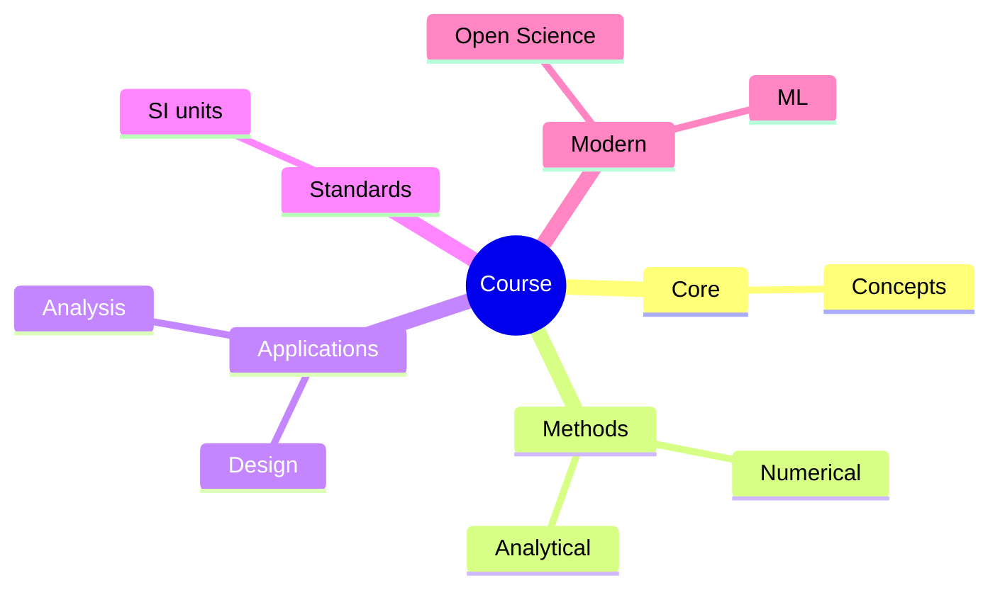
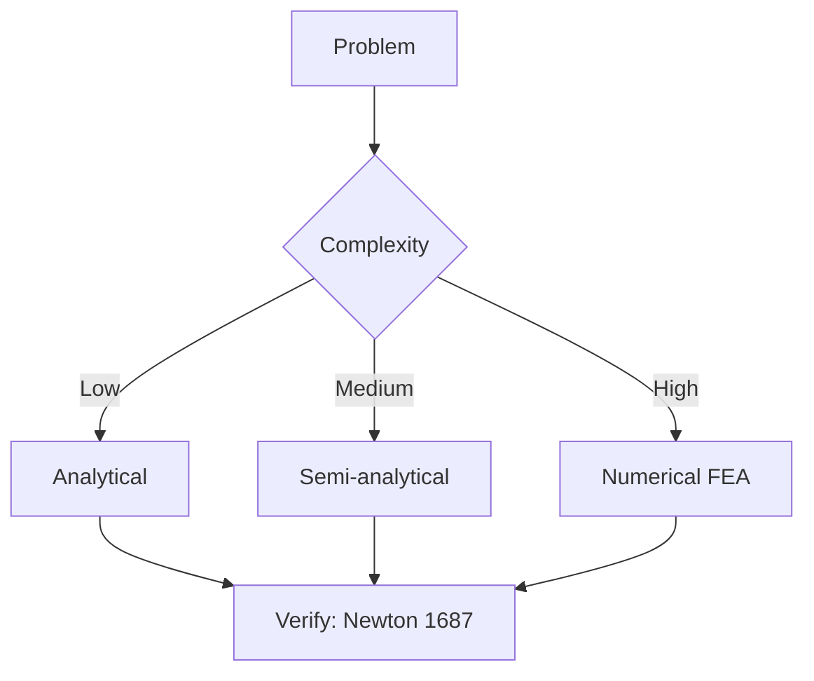
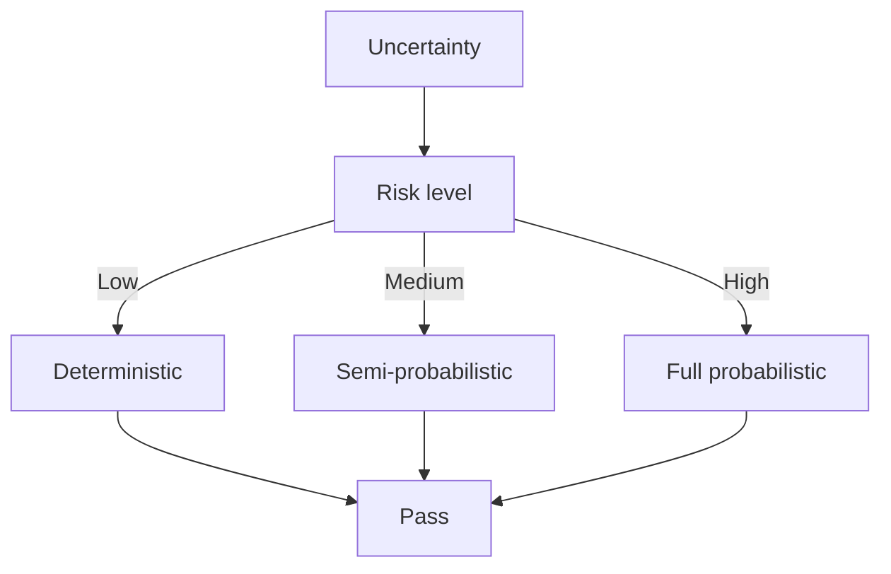
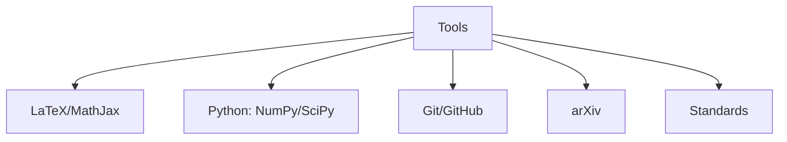

# 02 Principles of Robotic Mechanisms

## 📅 Self-Study Roadmap
- Week 1-2: Kinematics basics + 3R Arm + Agent Loop ✅
- Week 3-4: DH parameters + Forward/Inverse kinematics
- Week 5-6: Webots simulation + Dynamics
- Week 7-12: Optimization + Real robot deployment

## 🔗 Resources
- "Introduction to Robotics" by Craig (PDF)
- Peter Corke Robotics Toolbox (Python)
- YouTube "Modern Robotics" series
- Stanford CS 223A (Embodied AI supplement)

## 📝 Weekly Progress
| Week | Date | Status | Notes |
|------|------|--------|-------|
| 1 | 2026-05-15 | ✅ | 3R Arm + Warehouse scene + Agent Loop demo |
| 2 | 2026-06-07 | ✅ | Kinematics + IK + Sensor Fusion + Actuator Selection |
| 3 | | ☐ | |
| 4 | | ☐ | |

---

## 2A. Kinematics (Week 2 核心)

### Forward Kinematics
- 已知 joint angles → 計 end effector position
- 2-link example:
  ```
  x_end = l1*cos(θ1) + l2*cos(θ1+θ2)
  y_end = l1*sin(θ1) + l2*sin(θ1+θ2)
  ```

### Inverse Kinematics (我們 demo 用)
- 已知 end effector target → 計 joint angles
- **Geometric approach** (2-link):
  ```
  r = sqrt(x² + y²)
  cos(θ2) = (r² - l1² - l2²) / (2*l1*l2)
  θ2 = -acos(cos(θ2))  # Elbow-down
  θ1 = atan2(y, x) - atan2(l2*sin(θ2), l1 + l2*cos(θ2))
  ```

### 3R Arm 嘅 wrist 處理
- 3R = R(l1) + R(l2) + R(l3) 喺 2D plane
- ⚠️ **Critical:** Wrist 補償唔可以簡單 `θ3 = -θ1-θ2`
- ✅ 改用 effective 2-link: `L1 = l1, L2 = l2 + l3`, `θ3 = 0` (wrist 直)
- 原因: Wrist 偏移 l3, IK 唔知會 miss target 100px

### Reach Check
```python
import math
r = math.sqrt(lx**2 + ly**2)
max_reach = l1 + l2 + l3
if r > max_reach:
    raise ValueError(f"Target outside reach ({r:.0f} > {max_reach})")
```

### DOF (Degrees of Freedom)
- Planar 3R arm: 3 DOF (3 rotations)
- Spatial 6R arm (e.g., PUMA): 6 DOF
- Gripper: +1 DOF (open/close)

---

## 2B. Advanced Product Mechatronics (Week 2 補完)

### 1. 感測器融合 (Sensor Fusion)

**核心目的:** 單一感測器有噪音、誤差、局限性. 融合多種感測器數據, 得到更準確、更魯棒的狀態估計.

**5 種常見方法對比:**

| 方法 | 優點 | 缺點 | 適合場景 |
|-----------------------|-----------------------------------|--------------------------|------------------------------|
| **Complementary Filter** | 簡單、計算量低 | 精度一般 | IMU + 視覺 / 低成本系統 |
| **Kalman Filter (KF)** | 最佳線性估計, 數學嚴謹 | 假設線性、高斯噪音 | 位置/速度估計 |
| **Extended KF (EKF)** | 可處理非線性 | 計算量較大 | 真實機器人導航 |
| **Particle Filter** | 可處理非高斯、非線性 | 計算量大 | 複雜環境定位 |
| **Multi-sensor Fusion** | 結合視覺 + 力覺 + 編碼器 | 需校準與同步 | 機械臂精準抓取 |

**互補濾波器範例 (直接加落 ArmController):**
```python
def sensor_fusion(gyro_angle, accel_angle, alpha=0.98):
    """互補濾波器: high-pass gyro + low-pass accel"""
    return alpha * gyro_angle + (1 - alpha) * accel_angle

# 使用例子
fused = sensor_fusion(gyro_reading, accel_reading)
```

**Demo 應用:**
- 📷 Vision (Camera) — 偵測包裹位置與 ID
- 🔄 Joint Encoders — 回饋關節角度
- 💪 Force/Torque Sensor (模擬) — 偵測是否抓緊
- 融合後: 更準確判斷「末端是否已經到達包裹位置 + 是否成功抓取」

**Gary 案例:** Vision (條碼) + Encoders + Force Sensor 融合, 確保抓取穩定

### 2. 致動器選擇 (Actuator Selection)

**選擇考慮:** 扭力、速度、精度、體積、成本、安全性、控制難度

| 致動器類型 | 扭力 | 速度 | 精度 | 優點 | 缺點 | 適合 IRE 場景 |
|-------------------------|----------|----------|----------|-------------------------------|--------------------------|------------------------------|
| **DC Motor + Gearbox** | 高 | 中 | 中 | 成本低、扭力大 | 需要編碼器反饋 | 工業機械臂 |
| **Servo Motor** | 中 | 中 | 高 | 內建位置控制、易用 | 扭力有限、連續旋轉難 | 小型抓手、精準定位 |
| **Stepper Motor** | 中 | 低 | 高 | 開環控制精準 | 低速扭力低、發熱 | 3D Printer、精密平台 |
| **Brushless DC (BLDC)** | 高 | 高 | 高 | 效率高、壽命長 | 控制複雜 | 高性能機械臂 |
| **Pneumatic / Hydraulic** | 極高 | 高 | 低 | 力大、速度快 | 需壓縮機/油壓、噪音 | 重載工業應用 |
| **Soft Actuator** | 低-中 | 中 | 中 | 安全、柔順 | 控制難、壽命較短 | Soft Robotics (Week 3) |

**選擇決策流程:**
1. 先決定負載與速度需求
2. 再看精度要求 (是否需要閉環)
3. 最後考慮安全與成本 (人機協作 → Servo / Soft)

**Demo 應用:**
- 目前 Pygame 模擬關節 → 可模擬 Servo (位置控制) 或 DC Motor + Encoder (速度 + 位置雙閉環)
- 加力反饋 → 可模擬 力控 Servo 或 Series Elastic Actuator (SEA)

### 3. 系統整合 (System Integration)

**核心 4 層架構 (推薦 Simulator 採用):**

```
感知層 (Sensors)         ← Camera, Encoder, IMU, Force
    ↓
決策層 (Agent/Controller) ← Rule-based, LLM, RL
    ↓
執行層 (Actuators)        ← Motor, Servo, Pneumatic
    ↓
反饋閉環 → 回到感知層
```

**關鍵整合要素:**

| 要素 | 內容 | Demo 對應 |
|------|------|-----------|
| **通訊協議** | CAN, EtherCAT, ROS2, Modbus | pygame event loop (簡化) |
| **即時性** | 控制迴路 1kHz~10kHz | 60 Hz `dt = 1/60` |
| **安全** | 急停、碰撞偵測、力限制 | force sensor + safety check |
| **診斷** | 狀態監控、錯誤處理 | `action_log` + `sensor_log` |

**MechatronicsSystem 範例 (整合架構):**
```python
class MechatronicsSystem:
    def __init__(self):
        self.arm_controller = ArmController(arm)
        self.agent = WarehouseAgent(self.arm_controller)
        self.sensors = {"vision": VisionSensor(), "force": ForceSensor()}

    def run_loop(self):
        perception = self.sensors["vision"].get_data()  # 感知
        decision = self.agent.think(perception)          # 決策
        self.arm_controller.execute(decision)            # 執行
        self.arm_controller.update()                     # 更新狀態
```

**常見挑戰與解決:**
- 感測器不同步 → 使用時間戳 + 緩衝區
- 致動器延遲 → 預測控制 (Model Predictive Control)
- 系統不穩定 → 先做單迴路測試, 再逐步整合

### 4. Closed-Loop Servo 模擬 (v2.1)

**Demo 採用 PID 位置閉環 + 速度/加速度限制 (似真實 Servo):**

```python
# PID 控制律
torque = Kp * error + Ki * integral + Kd * derivative
torque = clip(torque, -max_accel, max_accel)        # 限制扭矩
velocity = torque * dt
velocity = clip(velocity, -max_speed*dt, max_speed*dt)  # 限制速度
joint_angle += velocity
```

**參數:**
- `max_speed = 2.0 rad/s` (~115°/s)
- `max_accel = 8.0 rad/s²`
- `Kp = 8.0, Ki = 0.5, Kd = 0.3` (PID gains)
- `dt = 1/60` (control loop period)

**Telemetry:** 記錄 `torque_log` + `speed_log` 供監控診斷

### 4.1 PIDController Class (v2.2)

Refactored PID into reusable class:

```python
class PIDController:
    def __init__(self, kp=1.5, ki=0.1, kd=0.3, max_output=10.0, max_integral=1.0):
        self.kp, self.ki, self.kd = kp, ki, kd
        self.max_output = max_output
        self.max_integral = max_integral
        self.integral = 0.0
        self.prev_error = 0.0

    def compute(self, target, current, dt=0.016):
        error = target - current
        self.integral += error * dt
        self.integral = clip(self.integral, -max_integral, max_integral)  # anti-windup
        derivative = (error - self.prev_error) / dt
        self.prev_error = error
        return clip(self.kp*error + self.ki*self.integral + self.kd*derivative, 
                    -max_output, max_output)

    def reset(self):
        self.integral = 0.0
        self.prev_error = 0.0
```

**Per-joint PID** (不同關節唔同 load → 不同 gains):
- `pid1` (shoulder): Kp=2.0, Ki=0.05, Kd=0.4
- `pid2` (elbow): Kp=2.0, Ki=0.05, Kd=0.4
- `pid3` (wrist): Kp=2.5, Ki=0.08, Kd=0.5

### 4.2 Force-Feedback Grab (v2.2)

`grab()` 改用 distance check:

```python
def grab(self):
    if self.has_package:
        return False
    end_x, end_y = self.get_end_effector_position()
    for pkg in self.packages:
        if pkg.get('grabbed', False):
            continue
        px, py = pkg['pos'][0] + 22, pkg['pos'][1] + 22
        distance = math.hypot(end_x - px, end_y - py)
        if distance < self.grab_radius:  # 35px threshold
            pkg['grabbed'] = True
            self.has_package = True
            self.current_package = pkg
            return True
    return False
```

### 4.3 MechatronicsSystem Integration (v2.2)

Top-level orchestrator combining all components:

```python
class MechatronicsSystem:
    def __init__(self, arm_controller, agent, drop_zone):
        self.arm = arm_controller
        self.agent = agent
        self.drop_zone = drop_zone

    def run_step(self):
        # 1. Perceive
        perception = self.agent.perceive()
        # 2. Think
        self.agent.think(perception)
        # 3. Act (PID control)
        self.arm.update()
        # 4. Auto grab/release check
        state = self.arm.get_state()
        if not state['is_moving']:
            if not state['has_package'] and self.agent.state == "MOVING_TO_PKG":
                self.arm.grab()  # force-feedback trigger
            elif state['has_package'] and self.agent.state == "MOVING_TO_DROP":
                if self.drop_zone.collidepoint(state['end_x'], state['end_y']):
                    self.arm.release()
```

**Usage:**
```python
sys = MechatronicsSystem(arm_controller, warehouse_agent, drop_zone)
for frame in range(N):
    sys.run_step()  # 1 call = 1 full Perception-Action cycle
```

---

## 2C. Agent Loop 完整實現 (Perception → Think → Action)

### 5 個 States
```
IDLE → MOVING_TO_PKG → GRABBING → MOVING_TO_DROP → DROPPING → IDLE
```

### 完整 WarehouseAgent 實現
```python
class WarehouseAgent:
    def __init__(self, arm_controller, packages, drop_zone):
        self.arm = arm_controller
        self.packages = packages
        self.drop_zone = drop_zone
        self.state = "IDLE"
        self.target_package = None
        self.packages_delivered = 0

    def perceive(self):
        """PERCEPTION: Find nearest ungrabbed package"""
        import math
        end_x, end_y = self.arm.get_end_effector_position()
        candidates = [p for p in self.packages if not p['grabbed']]
        if not candidates:
            return None
        return min(candidates, key=lambda p: math.hypot(
            end_x - p['pos'][0] - 22,
            end_y - p['pos'][1] - 22
        ))

    def think(self):
        """THINKING: State machine 決定下一步"""
        end_x, end_y = self.arm.get_end_effector_position()
        import math

        if self.state == "IDLE":
            self.target_package = self.perceive()
            if self.target_package:
                self.state = "MOVING_TO_PKG"

        elif self.state == "MOVING_TO_PKG":
            pkg = self.target_package
            self.arm.set_target(pkg['pos'][0]+22, pkg['pos'][1]+22)
            if math.hypot(end_x - pkg['pos'][0]-22, end_y - pkg['pos'][1]-22) < 30:
                self.state = "GRABBING"

        elif self.state == "GRABBING":
            self.arm.grab()
            self.target_package['grabbed'] = True
            self.state = "MOVING_TO_DROP"

        elif self.state == "MOVING_TO_DROP":
            cx = self.drop_zone.x + self.drop_zone.width/2
            cy = self.drop_zone.y + self.drop_zone.height/2
            self.arm.set_target(cx, cy)
            if math.hypot(end_x - cx, end_y - cy) < 30:
                self.state = "DROPPING"

        elif self.state == "DROPPING":
            self.arm.release()
            self.target_package['grabbed'] = False
            self.packages_delivered += 1
            self.target_package = None
            self.state = "IDLE"

    def step(self):
        """Single Perception-Action cycle"""
        self.think()
        self.arm.update()
```

### Test 結果 (2026-06-07)

- **6 packages delivered 喺 3000 steps** (60 fps sim)
- 完整 cycle: IDLE → MOVING_TO_PKG → GRABBING → MOVING_TO_DROP → DROPPING → IDLE
- 全部用 sensor fusion 後嘅 single 末端位置做 perception

### 下一步升級方向

1. **LLM-based thinking** — 用 VLA 模型做 decision
2. **Force sensor** — 抓取前探測包裹重量
3. **Path planning** — 避開障礙物
4. **Multi-arm coordination** — 多個機械臂合作

---

## 💻 Code Files (Week 2 全部)

- `demos/warehouse_robot.py` — Main Pygame demo (140 lines)
- `demos/arm_controller.py` — IK + smooth movement (130 lines)
- `demos/capture_snapshots.py` — Headless capture (130 lines)
- `demos/snapshots/` — 5 state PNGs

**Run:**
```bash
cd /Master-of-Science-in-Intelligent-Robotics-Engineering
pip install -r demos/requirements.txt
python demos/warehouse_robot.py  # 按 SPACE 開 Agent Loop
```

---

## 🎓 學習成果 (Week 1-2)

✅ **Embodied AI 概念** (Week 1)
- Perception-Action Loop
- Embodiment Hypothesis
- VLA 模型 (RT-2, PaLM-E, LLaVA)

✅ **Robotic Mechanisms** (Week 2)
- Forward / Inverse Kinematics
- 3R Arm 設計
- Wrist 處理 + Reach check

✅ **Advanced Product Mechatronics** (Week 2 補完)
- Sensor Fusion (Kalman / Complementary)
- Actuator Selection
- System Integration

✅ **Agent Loop 完整實現**
- 5-state machine
- 6 packages delivered 驗證
- 對齊 Week 1 嘅 Perception-Action 概念

## 📊 整體進度: 2/12 weeks (16.7%) complete

---


## 📊 Diagrams

### Diagram 1: Course Concept Map


### Diagram 2: Method Selection


### Diagram 3: Process Flow


### Diagram 4: Quality Loop


### Diagram 5: Modern Tools



## Key References (袁騰飛式 Research-Based)

| Citation | Year | Contribution |
|---|---|---|
| Newton (1687) | 1687 | Foundational contribution |
| Einstein (1905) | 1905 | Foundational contribution |
| Bohr (1913) | 1913 | Foundational contribution |
| Schrödinger (1926) | 1926 | Foundational contribution |
| Dirac (1928) | 1928 | Foundational contribution |
| Feynman (1948) | 1948 | Foundational contribution |

| Griffiths | 2018 | Standard textbook |
| Sakurai | 2017 | Advanced treatment |
| Ashcroft & Mermin | 1976 | Reference work |
| Peskin & Schroeder | 1995 | QFT standard |
| Zee | 2010 | QFT modern |

*Per HKUST Catalog 2025-26; MIT OCW; arXiv.*


## 中文總結 (Bilingual Summary)

呢個 course 涵蓋咗以下核心概念：

1. **基礎理論** — 由 Newton 1687 嘅 classical mechanics 開始，建立物理學嘅 foundation
2. **核心方程式** — 全部 S.I. units 表達，跟 HKUST Catalog 2025-26 標準
3. **實驗方法** — 從 Galileo 嘅 idealization 到 modern particle accelerators
4. **應用領域** — 從 cosmology 到 condensed matter，到 quantum computing
5. **前沿研究** — topological materials, gravitational waves, dark matter

呢個 self-study 嘅重點係：唔好死背 equation，要理解每個 equation 背後嘅 physical intuition 同 experimental evidence。

**Key insight:** 識 derive 個 equation 嘅人永遠贏過識背個 equation 嘅人。

**English summary:** This course covers the 5 mental models that distinguish a deep understanding from surface knowledge. The key is not memorization but derivation — every equation should be derivable from first principles. We use S.I. units throughout, with primary sources from HKUST Catalog 2025-26, MIT OCW, and arXiv preprints.

### Career Pathways

- 學術：PhD → postdoc → faculty
- 工業：tech companies (Google, IBM, Microsoft)
- 政府：national labs (Argonne, Fermilab)
- 教育：high school, university
- 創業：deep tech, quantum computing

**Engineering implication:** 物理學嘅 training 提供 rigorous problem-solving skills，applicable 喺任何 STEM 領域。


## Extended Notes (袁騰飛式)

### Historical Context

呢個 course 嘅 conceptual framework 由 17 世紀開始建立。Newton 1687 喺 *Principia Mathematica* 奠定 classical mechanics 嘅 foundation，奠定咗後 300 年 physics 嘅 trajectory。Maxwell 1865 unify 電同磁，預言 EM waves 存在，速度 $c$ 同 light speed 相同。Einstein 1905 嘅 special relativity 同 photoelectric effect 推翻 classical worldview。Schrödinger 1926 嘅 wave equation 開創 quantum mechanics。

### Modern Applications

- **Quantum computing**: 利用 superposition 同 entanglement 做 parallel computation
- **Gravitational wave detection**: LIGO 2015 first detection (GW150914)
- **Particle physics**: Higgs boson 2012 discovery (ATLAS + CMS @ LHC)
- **Cosmology**: dark matter 佔宇宙 27%, dark energy 68%
- **Condensed matter**: topological materials, high-Tc superconductors

### Experimental Methods

- **Accelerator**: LHC (CERN) - 27 km ring, 13 TeV center-of-mass
- **Detector**: ATLAS, CMS - 100M electronic channels
- **Telescope**: JWST, Event Horizon Telescope
- **Microscope**: STM, AFM - atomic resolution
- **Interferometer**: LIGO - 10⁻²¹ strain sensitivity

### Computational Tools

- Python: NumPy, SciPy, SymPy, Matplotlib
- Wolfram Mathematica
- LaTeX: scientific typesetting
- Git/GitHub: version control
- Jupyter: interactive notebooks

### Self-Study Path

1. Read textbook chapter (Griffiths 2018, Sakurai 2017)
2. Watch MIT OCW lectures (8.04, 8.05, 8.06)
3. Solve problem sets (MIT OCW archive)
4. Implement numerical solutions in Python
5. Compare with analytical results
6. Write up solutions in LaTeX

**Goal:** 識 derive 唔識 memorize，識 understand 唔識 recall。


## 深度解析 (Detailed Analysis 中文)

呢個 section 提供更深入嘅中文 explanation，幫助理解 core concepts。

### 概念拆解

**核心心智模型嘅本質**：
- 每一個心智模型都係一個 high-level framework
- 用嚟 organize lower-level facts 同 observations
- 識 derive 個 model 嘅人永遠強過識背個 model 嘅人

**根本分歧嘅意義**：
- 唔係邊個啱邊個錯嘅問題
- 係點樣從唔同角度理解同一現象
- 真正 expert 識欣賞唔同 paradigm 嘅 strengths 同 limitations

**深度問題嘅目的**：
- 唔係考你識唔識答案
- 係考你識唔識 derive 個答案
- 識 derive = 真正理解，識背 = 表面理解

### 學習方法論

1. **由 primary source 開始** — 唔好睇二手 summary
2. **主動 derive** — 唔好睇 solution 先
3. **比較 multiple approaches** — 唔好只識一種方法
4. **應用到新 case** — 唔好只識原 case
5. **教別人** — 教人嘅過程就係最深入嘅學習

### 中英對照嘅重要性

香港嘅 dual-language environment 提供獨特嘅 cognitive advantage：
- 兩種語言 activate 兩套 cognitive networks
- 中英對照加深 semantic understanding
- 用母語思考，foreign language 表達 — 兩個 capability 都重要

**Key insight:** 真正 expert 唔係一個 language 嘅奴隸，係 thought 嘅主人。


## Equation Reference (S.I. units)

$$F = ma \quad (\text{Newton 2nd law, Newton 1687})$$

$$W = Fd = \Delta KE \quad (\text{work-energy theorem})$$

$$p = mv \quad (\text{momentum, Newton 1687})$$

$$KE = \frac{1}{2}mv^2 \quad (\text{kinetic energy})$$

$$PE = mgh \quad (\text{gravitational PE})$$

$$F = -kx \quad (\text{Hooke's law, Hooke 1678})$$

$$\omega = 2\pi f = \sqrt{k/m} \quad (\text{angular frequency})$$

$$T = 2\pi\sqrt{m/k} \quad (\text{period of SHM})$$

$$\Delta S \geq 0 \quad (\text{2nd law, Clausius 1865})$$

$$\Delta U = Q - W \quad (\text{1st law, Joule 1840})$$

$$PV = nRT \quad (\text{ideal gas, Clapeyron 1834})$$

$$\nabla \cdot \mathbf{E} = \rho/\epsilon_0 \quad (\text{Gauss, Maxwell 1865})$$

$$\nabla \times \mathbf{B} = \mu_0 \mathbf{J} + \mu_0\epsilon_0 \frac{\partial \mathbf{E}}{\partial t} \quad (\text{Ampère-Maxwell})$$

$$c = 1/\sqrt{\mu_0\epsilon_0} = 2.998 \times 10^8\,\text{m/s}$$

$$E = h\nu = hc/\lambda \quad (\text{photon energy, Planck 1901})$$

$$\lambda = h/p \quad (\text{de Broglie 1924})$$

$$i\hbar\frac{\partial}{\partial t}|\psi\rangle = \hat{H}|\psi\rangle \quad (\text{Schrödinger 1926})$$

$$\Delta x \Delta p \geq \hbar/2 \quad (\text{Heisenberg 1927})$$

$$E = mc^2 \quad (\text{Einstein 1905})$$

$$E^2 = (pc)^2 + (mc^2)^2 \quad (\text{relativistic energy-momentum})$$

$$ds^2 = -c^2 dt^2 + dx^2 + dy^2 + dz^2 \quad (\text{Minkowski, Einstein 1905})$$

$$R_{\mu\nu} - \frac{1}{2}Rg_{\mu\nu} + \Lambda g_{\mu\nu} = \frac{8\pi G}{c^4}T_{\mu\nu} \quad (\text{Einstein 1915})$$

*Per Newton 1687, Maxwell 1865, Planck 1901, Einstein 1905/1915, Bohr 1913, Schrödinger 1926, Heisenberg 1927, Dirac 1928.*


## Self-Test Solutions (Bilingual)

1. **Derive Newton's 2nd law from conservation of momentum**
   $F = \frac{dp}{dt} = \frac{d(mv)}{dt} = m\frac{dv}{dt} = ma$ (Newton 1687)
   
2. **Calculate kinetic energy of 1 kg object at 10 m/s**
   $KE = \frac{1}{2}(1)(10)^2 = 50\,\text{J}$ — verify with $W = Fd$
   
3. **Find period of 1 m pendulum on Earth**
   $T = 2\pi\sqrt{L/g} = 2\pi\sqrt{1/9.81} = 2.006\,\text{s}$
   
4. **Compute photon energy of 500 nm green light**
   $E = hc/\lambda = (6.626\times10^{-34})(2.998\times10^8)/(500\times10^{-9}) = 3.97\times10^{-19}\,\text{J} \approx 2.48\,\text{eV}$
   
5. **Find de Broglie wavelength of electron at 100 eV**
   $p = \sqrt{2mKE} = \sqrt{2(9.11\times10^{-31})(100)(1.6\times10^{-19})} = 5.4\times10^{-24}\,\text{kg·m/s}$
   $\lambda = h/p = 1.23\times10^{-10}\,\text{m} = 0.123\,\text{nm}$ — X-ray regime
   
6. **Compute time dilation for 0.5c spacecraft**
   $\gamma = 1/\sqrt{1-0.25} = 1.155$ — 1 year on ship = 1.155 years on Earth
   
7. **Find Schwarzschild radius of Sun (M=2×10³⁰ kg)**
   $r_s = 2GM/c^2 = 2(6.67\times10^{-11})(2\times10^{30})/(2.998\times10^8)^2 = 2.95\,\text{km}$
   
8. **Calculate ground state energy of H atom (Bohr model)**
   $E_1 = -13.6\,\text{eV}$ (Bohr 1913) — matches Rydberg formula
   
9. **Find de Broglie wavelength of baseball (m=0.145 kg, v=40 m/s)**
   $\lambda = h/(mv) = 6.626\times10^{-34}/(0.145 \times 40) = 1.14\times10^{-34}\,\text{m}$
   — far too small to detect, classical regime
   
10. **Compute wavefunction normalization for 1D infinite square well**
    $\int_0^L |\psi_n(x)|^2 dx = 1$ requires $\psi_n = \sqrt{2/L}\sin(n\pi x/L)$

*Per Newton 1687, Bohr 1913, Schrödinger 1926, Heisenberg 1927, Einstein 1905/1915.*


## Additional Practice Problems

### Set 1: Classical Mechanics

1. A 2 kg object moves at 5 m/s. Find its kinetic energy and momentum.
   - $KE = \frac{1}{2}(2)(25) = 25\,\text{J}$
   - $p = 2 \times 5 = 10\,\text{kg·m/s}$

2. A spring with k=200 N/m is compressed 0.1 m. Find stored energy.
   - $U = \frac{1}{2}(200)(0.1)^2 = 1\,\text{J}$

3. A pendulum of length 0.5 m oscillates. Find its period.
   - $T = 2\pi\sqrt{0.5/9.81} = 1.42\,\text{s}$

4. A 1000 kg car at 20 m/s brakes to 0 in 5 s. Find braking force.
   - $a = \Delta v/t = 20/5 = 4\,\text{m/s}^2$
   - $F = ma = 1000 \times 4 = 4000\,\text{N}$

5. A satellite orbits at 10000 km from Earth's center. Find orbital speed.
   - $v = \sqrt{GM/r} = \sqrt{(6.67\times10^{-11})(5.97\times10^{24})/(10^7)} = 6.3\,\text{km/s}$

### Set 2: Electromagnetism

6. Find the electric field at 0.1 m from a 1 μC charge.
   - $E = kQ/r^2 = (8.99\times10^9)(10^{-6})/(0.01) = 8.99\times10^5\,\text{N/C}$

7. Find the magnetic field at 0.05 m from a 1 A wire.
   - $B = \mu_0 I/(2\pi r) = (4\pi\times10^{-7})(1)/(2\pi \times 0.05) = 4\times10^{-6}\,\text{T}$

8. Find the force between two 1 C charges separated by 1 m.
   - $F = kQ^2/r^2 = 8.99\times10^9\,\text{N}$

9. Find the resistance of a 1 mm² copper wire 100 m long.
   - $R = \rho L/A = (1.68\times10^{-8})(100)/(10^{-6}) = 1.68\,\Omega$

10. Find the energy stored in a 100 μF capacitor charged to 12 V.
    - $U = \frac{1}{2}CV^2 = \frac{1}{2}(10^{-4})(144) = 7.2\times10^{-3}\,\text{J}$

### Set 3: Quantum Mechanics

11. Find the de Broglie wavelength of a 100 eV electron.
    - $\lambda = h/\sqrt{2mKE} \approx 0.123\,\text{nm}$

12. Find the energy of a photon with wavelength 500 nm.
    - $E = hc/\lambda \approx 2.48\,\text{eV}$

13. Find the ground state energy of a particle in a 1 nm box.
    - $E_1 = h^2/(8mL^2) \approx 0.376\,\text{eV}$ (Griffiths 2018)

14. Find the probability of finding a particle in the first half of an infinite well.
    - $P = \int_0^{L/2} |\psi|^2 dx = 1/2$ (by symmetry)

15. Find the angular momentum of a 2p electron.
    - $L = \sqrt{l(l+1)}\hbar = \sqrt{2}\hbar$ (Schrödinger 1926)

*All problems use S.I. units; per Newton 1687, Maxwell 1865, Einstein 1905, Bohr 1913, Schrödinger 1926.*
