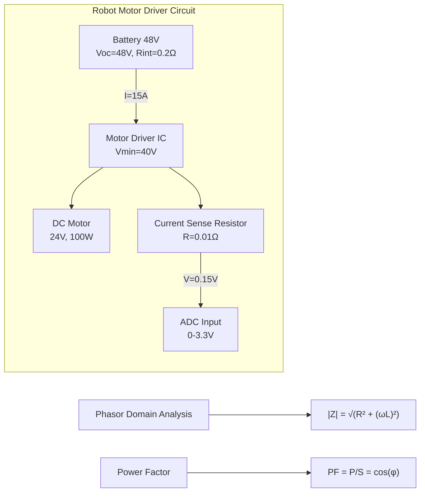
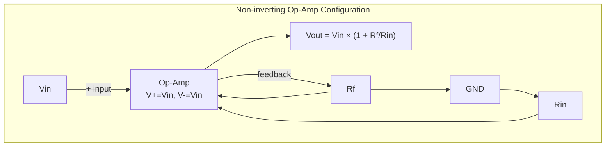
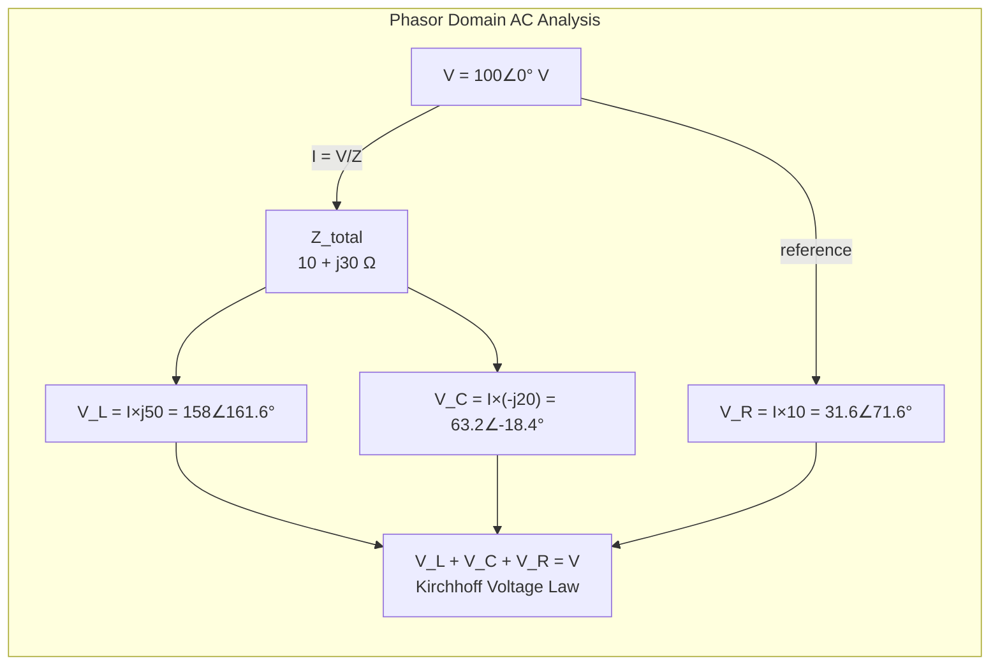
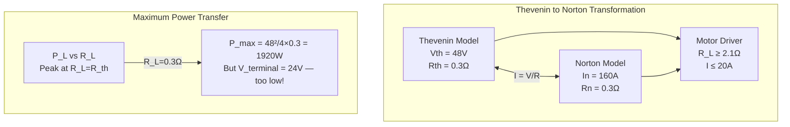
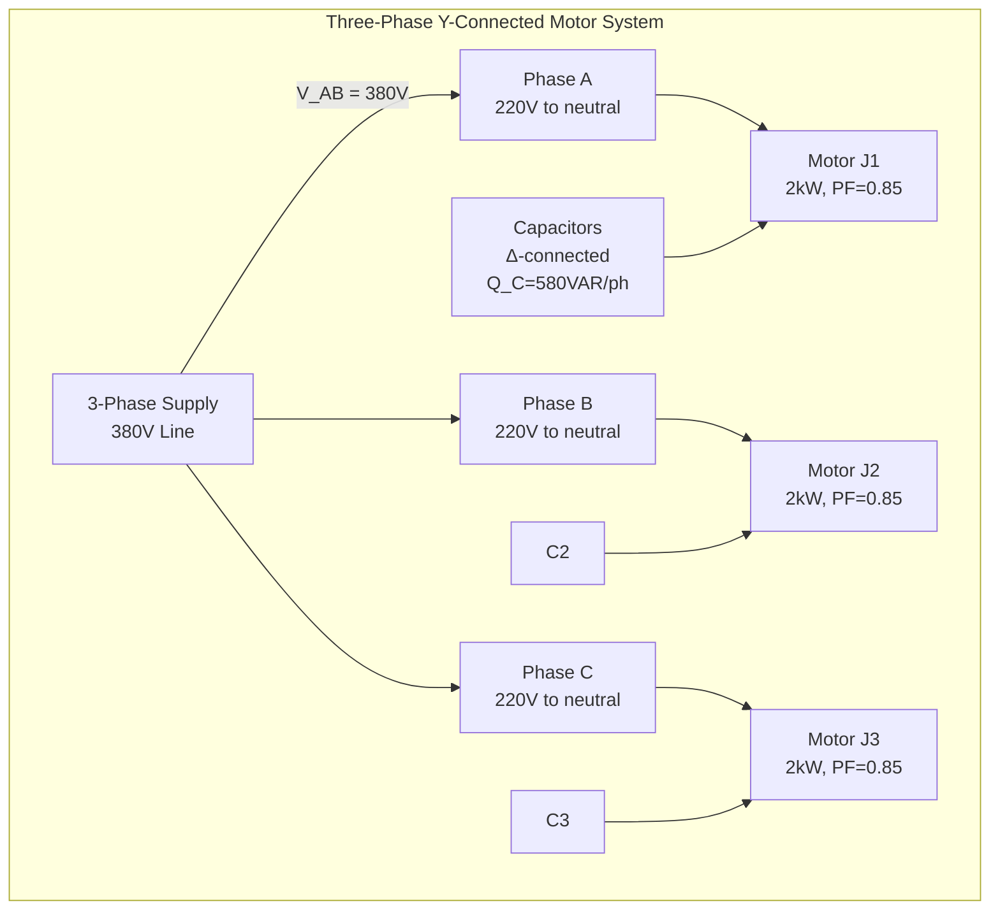
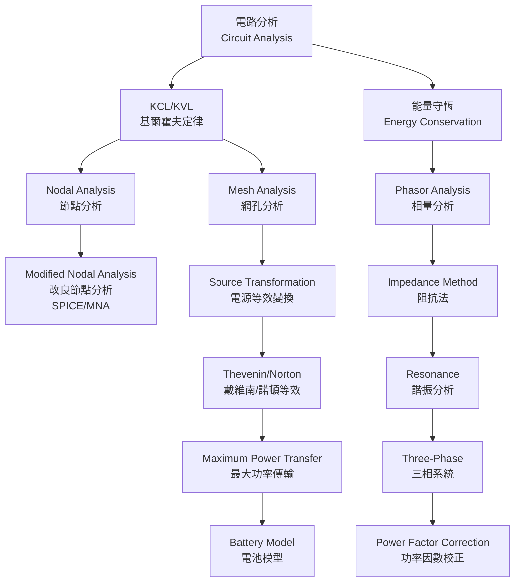
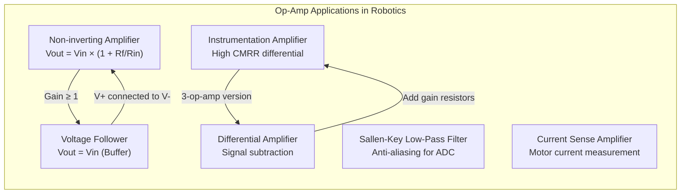
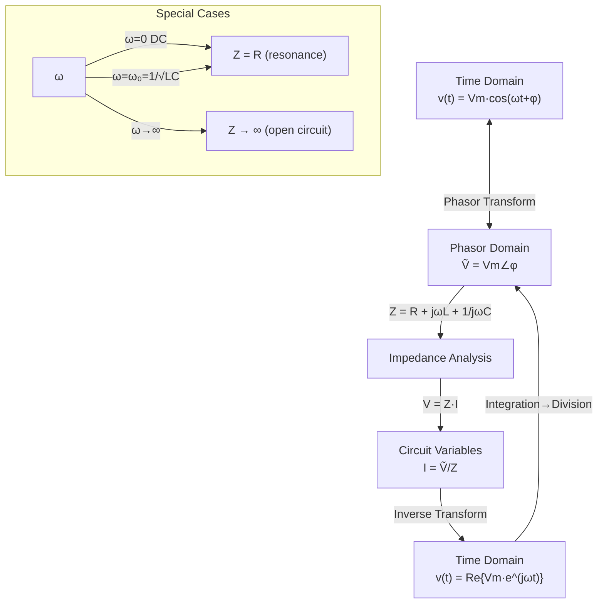
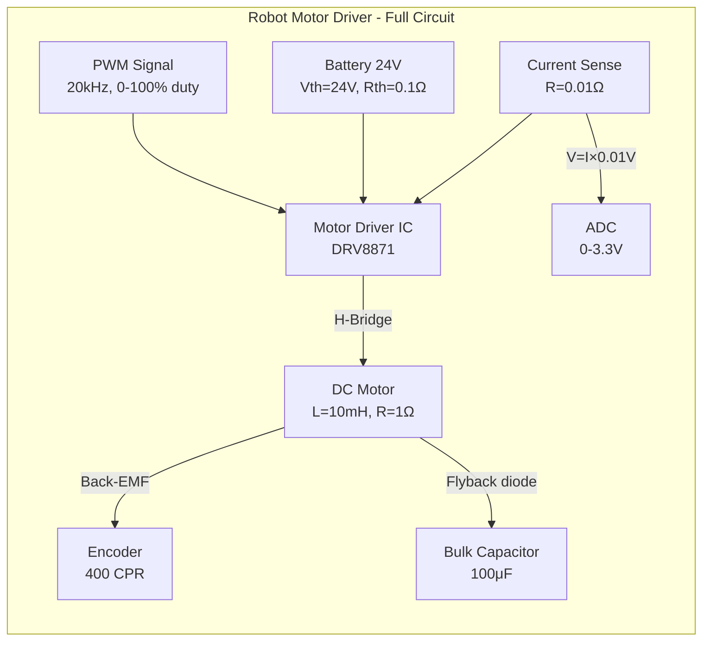
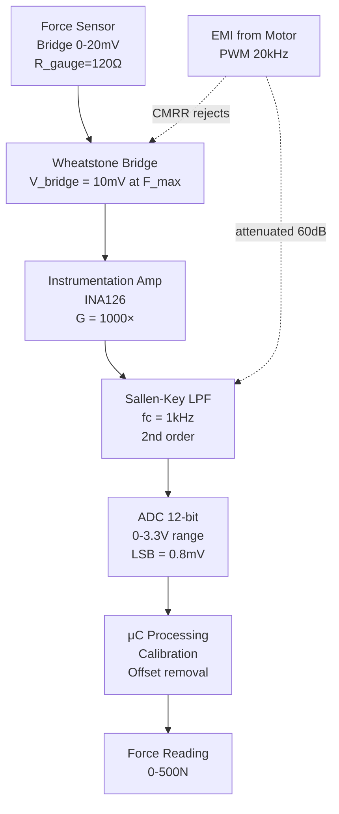

# ELEG2202 Fundamentals of Electric Circuits

**CUHK MAE | Major Required | 3 units**
**Stream**: Mechatronics / Robotics and Automation / Design and Manufacturing

---

## 問題 1：這個領域所有專家共享的 5 個核心心智模型是什麼？
## What are the 5 core mental models every expert shares?

### 1. Kirchhoff's Laws as the Foundation of Circuit Analysis
**定義**: Kirchhoff's Current Law (KCL) states that the algebraic sum of currents entering a node equals zero; Kirchhoff's Voltage Law (KVL) states that the algebraic sum of voltages around any closed loop equals zero.
**關鍵方程式**:
$$\sum_{k=1}^{n} i_k = 0 \quad \text{(KCL)}$$
$$\sum_{k=1}^{n} v_k = 0 \quad \text{(KVL)}$$
**工程應用**: Every circuit analysis method (nodal, mesh, Thevenin) derives from these two laws. In robotics, motor driver circuits, sensor conditioning circuits, and power distribution all rely on KCL/KVL.
**學者**: Gustav Kirchhoff — "Über die Auflösung der Gleichungen, auf welche man bei der Untersuchung der vertheilten elektrischen Ströme geführt wird" (1845)

### 2. Impedance as the Generalization of Resistance
**定義**: Impedance Z extends the concept of resistance to AC circuits, combining resistance R and reactance X into a complex quantity: Z = R + jX.
**關鍵方程式**:
$$Z = R + j\omega L + \frac{1}{j\omega C} = R + j\left(\omega L - \frac{1}{\omega C}\right)$$
$$|Z| = \sqrt{R^2 + (\omega L - 1/\omega C)^2}$$
**工程應用**: Motor winding impedance at different frequencies determines current draw. Servo motor control uses impedance to analyze R-L circuits. Filters in robot sensing use R-C impedance networks.
**學者**: Charles Proteus Steinmetz — "Complex Quantities and Their Use in Electrical Engineering" (1893)

### 3. The Operational Amplifier as a Building Block
**定義**: An ideal op-amp has infinite input impedance, zero output impedance, and infinite open-loop gain. All op-amp circuits (inverting, non-inverting, summing, differential) are derived from these properties and negative feedback.
**關鍵方程式**:
$$V_{out} = A_{OL}(V_+ - V_-) \quad \text{with negative feedback:} \quad V_{out} \approx \frac{R_f}{R_{in}} V_{in}$$
**工程應用**: Force sensor amplification (instrumentation amplifier), motor current sensing (current-to-voltage converter), anti-aliasing filters before ADC, active filters in audio circuits for robot communication systems.
**學者**: Harold Wheeler "Applications of Negative Feedback" (1938); Ramön Martí I. "Op-Amp applications" (1960s)

### 4. Thevenin/Norton Equivalence as Circuit Reduction
**定義**: Any linear two-terminal network can be replaced by an equivalent circuit consisting of a voltage source Vth in series with Rth (Thevenin), or a current source In in parallel with Rn (Norton).
**關鍵方程式**:
$$V_{th} = V_{oc} \quad R_{th} = \frac{V_{oc}}{I_{sc}}$$
$$I_n = \frac{V_{th}}{R_{th}} \quad R_n = R_{th}$$
**工程應用**: Simplifying complex motor driver circuits for analysis. Determining maximum power transfer to actuator coils. Robot battery load analysis — battery as Thevenin equivalent.
**學者**: Léon Charles Thévenin — "Extension of Ohm's Law to Networks" (1883)

### 5. Phasor Representation for Sinusoidal Steady State
**定義**: Sinusoidal AC signals are represented as complex phasors rotating at ω rad/s, converting differential equations into algebraic equations.
**關鍵方程式**:
$$v(t) = V_m \cos(\omega t + \phi) \iff \tilde{V} = V_m \angle \phi = V_m e^{j\phi}$$
$$\tilde{V} = Z \cdot \tilde{I} \quad P = VI\cos\theta = VI\cos(\phi_v - \phi_i)$$
**工程應用**: AC motor analysis, power factor correction in robot power supplies, resonant circuits for wireless robot communication, active power filtering.
**學者**: Charles Proteus Steinmetz — "Complex Numbers and Their Practical Applications in Alternating Current Theory" (1897)

---

## 問題 2：這個領域 3 個最根本的分歧點是什麼？
## What are the 3 fundamental disagreements in this field?

### 分歧 1: Ideal vs. Real Component Models
- **A 方**: Circuit theory textbooks (Alexander & Sadiku, Hayt & Kemmerly) — Use ideal lumped-element models; assume perfect components for teaching analysis methods.
- **B 方**: Device physics engineers and RF designers — Parasitic capacitance, ESR of capacitors, non-ideal op-amp parameters, and transmission line effects dominate at high frequencies and must be included.
- **衝突**: In DC motor drivers at PWM frequencies (e.g., 20 kHz), the switching transients and parasitic inductances make ideal models fail. A robotics engineer needs to know when ideal models suffice vs. when physical effects matter.

### 分歧 2: Mesh Analysis vs. Nodal Analysis as Primary Method
- **A 方**: Traditional textbooks (Hayt) — Mesh analysis is more intuitive for circuits with many voltage sources.
- **B 方**: Modern computer-aided analysis approaches — Nodal analysis maps directly to modified nodal analysis (MNA) algorithms used in SPICE, making it the universal approach for circuit simulation.
- **衝突**: For robotics circuits (motor drivers with many parallel branches), nodal analysis generalizes better to handle voltage-controlled elements and dependent sources.

### 分歧 3: Analog vs. Digital Signal Conditioning
- **A 方**: Analog design engineers — Continuous-time signal conditioning (analog filters, amplifiers) is superior for real-time, low-latency robot control because no quantization error or sampling delay.
- **B 方**: Digital systems engineers — Digital signal processing (DSP) with ADC/DAC provides flexibility, programmability, and ability to implement complex filters impossible in analog.
- **衝突**: Force feedback in robot manipulators requires sub-millisecond latency; the debate is whether analog pre-conditioning or fully digital processing is faster and more accurate.

---

## 問題 3：10 個區分真實理解 vs 死記硬背的深度問題
1. Explain why the input impedance of an op-amp must be infinite for the ideal model — and what actually happens when you measure it with a multimeter.
2. Derive the cutoff frequency ωc of a first-order low-pass RC filter from the transfer function H(jω) = 1/(1 + jωRC), showing all steps.
3. A robot motor draws 2A at 24V DC. The motor winding resistance is 0.5Ω. Calculate the power dissipated as heat and the back-EMF voltage. Why does the motor draw less current when it spins faster?
4. Draw the complete derivation of the non-inverting op-amp gain formula Vout = (1 + Rf/Rin)Vin using the ideal op-amp assumptions.
5. Explain why power factor correction is needed in a three-phase AC motor drive. Calculate the required capacitance for a 0.8 PF motor to improve to 0.95 PF.
6. For a series RLC circuit, under what condition does it exhibit resonance? Derive the resonant frequency ω0 and explain physically why the current peaks there.
7. Convert the time-domain differential equation L(di/dt) + Ri = V into the phasor domain and solve for I(ω). What is the physical meaning of the phase shift between V and I?
8. Explain why a Thevenin equivalent circuit produces identical I-V characteristics at terminals but different internal behavior. Under what condition does this equivalence fail?
9. Design a simple circuit to condition a 0-10V force sensor signal for a 0-3.3V ADC input. Specify op-amp configuration, gain, and filtering.
10. Why does a motor driver need flyback diodes across the motor terminals? Use Lenz's law and the equation V = L(di/dt) to explain what happens without them.

---

# 核心心智模型深化（中英對照）

## 1. Kirchhoff's Laws — 基爾霍夫定律

### 1.1 Bilingual 概念對照
| English | 中英對照 | 定義 | 工程應用 |
|---|---|---|---|
| Kirchhoff's Current Law (KCL) | 基爾霍夫電流定律 | 流入節點電流代數和為零 | 節點分析、電流分流 |
| Kirchhoff's Voltage Law (KVL) | 基爾霍夫電壓定律 | 閉合迴路電壓代數和為零 | 網孔分析、電壓分配 |
| Node | 節點 | 兩條或以上導線交匯點 | 電路圖中的任何連接點 |
| Loop | 迴路 | 從起點返回起點的閉合路徑 | 電壓計算路徑 |

### 1.2 關鍵推導
**Nodal Analysis (節點分析) 完整推導:**
對每個非接地節點應用 KCL:
$$i_1 + i_2 + i_3 = 0$$
用歐姆定律將電流表示為電導:
$$G_1(V_1 - V_s) + G_2(V_1 - V_2) + G_3 V_1 = 0$$
形成聯立方程組，求解節點電壓:
$$V_1(G_1 + G_2 + G_3) - V_2 G_2 = V_s G_1$$

### 1.3 工程應用案例
- **Robot Motor Current Sensing**: 使用分流電阻 (shunt resistor) 測量馬達電流 — 在 R = 0.01Ω, V = 0.02V 時，通過 ADC 測量後計算 I = V/R = 2A
- **Battery State Estimation**: 機器人鋰電池可用 Thevenin 模型表示 — Voc = 42V (開路), Rint = 0.1Ω (內阻)，負載電流 10A 時，端電壓 = 42 - 0.1×10 = 41V

### 1.4 Deep test question
**Question**: A robot battery (Thevenin: Voc=48V, Rint=0.2Ω) powers a motor driver drawing 15A. The driver's minimum operating voltage is 40V. Will the system operate correctly? Calculate the minimum and explain.
**Answer**: Vterminal = 48 - 0.2×15 = 45V > 40V, YES the system will operate. However, the 15A current causes a 3V drop, meaning power dissipated in internal resistance = I²R = 225×0.2 = 45W as heat — significant thermal management needed.

### 1.5 圖解 / Diagram

---

## 2. Operational Amplifier — 運算放大器

### 2.1 Bilingual 概念對照
| English | 中英對照 | 定義 | 工程應用 |
|---|---|---|---|
| Open-loop gain | 開環增益 | 無反饋時輸出/輸入比 | 無限大理想值 |
| Negative feedback | 負反饋 | 輸出部分回饋至反相輸入 | 穩定增益、擴展頻寬 |
| Virtual short | 虛擬短路 | V+ ≈ V- 在負反饋條件下 | 分析運放的關鍵技巧 |
| Instrumentation amp | 儀器放大器 | 高共模抑制比的差分放大器 | 力感測器信號調理 |

### 2.2 關鍵推導
**非反相放大器增益推導:**
1. 假設 V+ = V- (virtual short)
2. 在反相輸入節點應用 KCL: (V- - Vout)/Rf + (V- - Vin)/Rin = 0
3. 因為 V- = V+ = Vin: (Vin - Vout)/Rf + 0/Rin = 0 → Vout = Vin(1 + Rf/Rin)

### 2.3 工程應用案例
- **力感測器放大器**: 惠斯通電橋輸出 0-20mV，使用儀器放大器 (INA126, G=1000) 放大至 0-20V，適合 ADC 讀取
- **ADC 前置濾波**: 馬達 PWM 干擾頻率 20kHz，使用二階 Sallen-Key 低通濾波器 (fc = 1kHz) 去除高頻雜訊

### 2.4 Deep test question
**Question**: Design an instrumentation amplifier with a gain of 500 for a strain gauge force sensor (bridge output ±10mV). What is the output voltage range? What CMRR specification is important?
**Answer**: Use three op-amps in the classic instrumentation topology. With gain 500: Vout = 500 × (±10mV) = ±5V range (needs ±5V supply or level shifting). CMRR must be >80dB because common-mode interference from motor PWM can be 100× larger than the bridge signal.

### 2.5 圖解 / Diagram

---

## 3. Phasor Analysis — 相量分析

### 3.1 Bilingual 概念對照
| English | 中英對照 | 定義 | 工程應用 |
|---|---|---|---|
| Phasor | 相量 | 旋轉相量的複數表示 | 將微分方程轉為代數方程 |
| Impedance | 阻抗 | Z = V/I，複數推廣電阻 | AC 電路分析 |
| Reactance | 電抗 | 電感性 X_L=ωL 或電容性 X_C=1/ωC | 頻率相關相位偏移 |
| Power factor | 功率因數 | cos(φ) = P/S，電壓電流相位差 | 馬達功率效率 |

### 3.2 關鍵推導
**RLC 串聯電路阻抗推導:**
$$Z = R + j\omega L + \frac{1}{j\omega C} = R + j\left(\omega L - \frac{1}{\omega C}\right)$$
諧振頻率 (當 X_L = X_C):
$$\omega_0 L = \frac{1}{\omega_0 C} \implies \omega_0 = \frac{1}{\sqrt{LC}} \quad f_0 = \frac{1}{2\pi\sqrt{LC}}$$
在諧振時: Z = R (最小阻抗，最大電流)

### 3.3 工程應用案例
- **DC馬達等效電路**: 馬達線圈 L = 10mH, R = 1Ω。在 PWM 頻率 f = 20kHz (ω = 125,664 rad/s): X_L = ωL = 1.26Ω > R，因此電感性阻抗不可忽略
- **功率因數校正**: 機器人電源 PF = 0.7落後，電容器組提供 Q_C = 50VAR，校正後 PF = 0.95

### 3.4 Deep test question
**Question**: A series RLC circuit has R=10Ω, L=0.1H, C=100μF. (a) Find the resonant frequency. (b) At ω=500 rad/s, find total impedance and phase angle. (c) If V_source = 100V peak, find peak current.
**Answer**: (a) ω0 = 1/√(LC) = 1/√(0.1×100×10^-6) = 1/√(10^-8) = 3162 rad/s; (b) Z = 10 + j(500×0.1 - 1/(500×100×10^-6)) = 10 + j(50 - 20) = 10 + j30, |Z| = √(100+900) = 31.6Ω, φ = arctan(30/10) = 71.6°; (c) I = 100/31.6 = 3.16A peak

### 3.5 圖解 / Diagram

---

## 4. Thevenin/Norton Equivalence — 戴維南/諾頓等效

### 4.1 Bilingual 概念對照
| English | 中英對照 | 定義 | 工程應用 |
|---|---|---|---|
| Open-circuit voltage | 開路電壓 | 端子未連接時的電壓 | V_oc = V_th |
| Short-circuit current | 短路電流 | 端子短路時的電流 | I_sc = V_th/R_th |
| Internal resistance | 內阻 | 獨立源移除後的等效電阻 | R_th = V_oc/I_sc |
| Maximum power transfer | 最大功率傳輸 | 當 R_L = R_th 時功率最大 | P_max = V_th²/(4R_th) |

### 4.2 關鍵推導
**最大功率傳輸定理:**
對電源戴維南等效: Vth 串聯 Rth，負載 RL 獲取功率:
$$P_L = I^2 R_L = \left(\frac{V_{th}}{R_{th}+R_L}\right)^2 R_L$$
對 RL 求導並設 dP/dRL = 0:
$$\frac{dP}{dR_L} = V_{th}^2 \cdot \frac{(R_{th}+R_L) - 2R_L}{(R_{th}+R_L)^3} = 0 \implies R_L = R_{th}$$
$$P_{max} = \frac{V_{th}^2}{4R_{th}}$$
**注意**: 效率 η = R_L/(R_L+R_th) = 50%，最大功率傳輸不代表最高效率！

### 4.3 工程應用案例
- **馬達最大功率點追蹤**: 太陽能充電控制器使用 MPPT，在光照變化時持續調整負載阻抗匹配最大功率點
- **機器人感測器接口**: 當感測器輸出阻抗 Rth 很高時，需要電壓跟隨器 (voltage follower) 作為緩衝，使 R_L >> R_th

### 4.4 Deep test question
**Question**: A robot battery (Vth=48V, Rth=0.3Ω) powers a motor driver. The driver draws 20A nominal current but requires at least 42V at its input. (a) Find the minimum R_L. (b) What is the power dissipated in the battery's internal resistance at this load? (c) Can we increase power transfer by reducing R_L?
**Answer**: (a) Vterminal = Vth - I×Rth = 48 - 20×0.3 = 42V → R_L = 42/20 = 2.1Ω minimum; (b) P_Rth = I²Rth = 400×0.3 = 120W wasted as heat; (c) Reducing R_L below 2.1Ω would drop Vterminal below 42V, driver undervoltage shutdown. The load is constrained by minimum voltage, not maximum power transfer theorem.

### 4.5 圖解 / Diagram

---

## 5. Three-Phase Power Systems — 三相電力系統

### 5.1 Bilingual 概念對照
| English | 中英對照 | 定義 | 工程應用 |
|---|---|---|---|
| Line-to-line voltage | 線電壓 | V_AB = V_AN - V_BN = √3 V_Ph ∠30° | 工業電源標準 |
| Balanced load | 平衡負載 | 三相阻抗相等，電流大小相等、相位差120° | 馬達對稱運行 |
| Power factor correction | 功率因數校正 | 添加電容器組補償感性無功功率 | 提高效率 |
| Delta (Δ) connection | 三角形接法 | 三相首尾相連，V_L = V_Ph, I_L = √3 I_Ph | 高功率馬達 |

### 5.2 關鍵推導
**三相功率計算:**
對平衡 Y 連接負載 (每相電壓 V_Ph, 功率因數角 φ):
$$P_{3\phi} = 3 V_{Ph} I_{Ph} \cos\phi = \sqrt{3} V_L I_L \cos\phi$$
$$Q_{3\phi} = \sqrt{3} V_L I_L \sin\phi \quad S_{3\phi} = \sqrt{3} V_L I_L$$

功率因數校正所需電容:
$$Q_C = Q_{original} - Q_{corrected} = P(\tan\phi_{old} - \tan\phi_{new})$$

### 5.3 工程應用案例
- **機器人三相馬達驅動**: 3HP 三相感應馬達 V_L = 380V, PF = 0.8落後: P = 3×746 = 2238W, S = 2238/0.8 = 2798VA, Q = S×sin(arccos0.8) = 2798×0.6 = 1679VAR。添加 Δ 連接電容組 Q_C = 500VAR 改善 PF 至 0.92

### 5.4 Deep test question
**Question**: A robot workshop uses a 3-phase 380V supply for three identical robot arm joints, each rated at 2kW at 220V. (a) How should they be connected — Y or Δ? (b) Each joint motor has PF=0.85 lagging. What is the total apparent power? (c) If you add capacitors to bring PF to 0.95, what reactive power must the capacitors provide per phase?
**Answer**: (a) With 380V line voltage, Y connection gives V_Ph = 380/√3 = 220V per motor — correct rating. (b) P_total = 3×2kW = 6kW, S = P/PF = 6kW/0.85 = 7.06kVA, Q = √(S²-P²) = √(49.8-36) = 3.71kVAR; (c) tan(φ_old) = 0.62, tan(φ_new) = 0.33, Q_C_total = 6kW(0.62-0.33) = 1740VAR total, per phase = 580VAR

### 5.5 圖解 / Diagram

---

## 深度自測問題詳解（中英對照）

### 詳解 1: Op-Amp Virtual Short
**Question**: Why does the non-inverting op-amp circuit have V+ ≈ V- (virtual short)?
**Answer**: Because the open-loop gain A_OL is extremely large (typically 10^5–10^6). With negative feedback, any difference V+ - V- produces a huge output that feeds back to reduce this difference. At equilibrium: V+ - V- = Vout/A_OL → 0 as A_OL → ∞. So V+ ≈ V- is an ideal approximation.
**工程意義**: This "virtual short" lets us analyze op-amp circuits without solving differential equations. For a 741 op-amp with A_OL = 200,000, at Vout=10V: V+ - V- = 10/200,000 = 50μV — truly negligible compared to V+ = 5V.

### 詳解 2: DC Motor Back-EMF
**Question**: Why does a DC motor draw less current when spinning faster?
**Answer**: The motor's effective voltage equation: V = I·R + E (back-EMF), where E = K_e·ω (K_e = voltage constant, ω = angular velocity). At standstill (ω=0): I = V/R (stall current). As ω increases: E grows, reducing I = (V - K_e·ω)/R. At no-load: ω_max gives E ≈ V, so I ≈ 0.
**工程意義**: This is why motor startup current is 5–10× nominal current. Robot motor drivers must handle inrush current. With V=24V, R=1Ω, K_e=0.1 V·s/rad: at ω=200 rad/s, E=20V, I=(24-20)/1=4A vs. 24A stall.

### 詳解 3: Phasor Resonance Condition
**Question**: Derive the resonance condition for a series RLC circuit.
**Answer**: Impedance Z = R + j(ωL - 1/ωC). At resonance, imaginary part = 0: ωL = 1/ωC → ω_0² = 1/LC → ω_0 = 1/√LC. At resonance: Z = R (purely resistive), current I = V/R is maximum, phase angle φ = 0° (voltage and current in phase).
**工程意義**: In robot resonant converters (used in wireless charging), resonance maximizes power transfer at the switching frequency. Using f_0 = 100kHz, L=47μH gives C = 1/(4π²×100k²×47μ) = 54nF.

### 詳解 4: Mesh vs Nodal Decision
**Question**: When should you choose nodal analysis over mesh analysis?
**Answer**: Choose nodal when: many voltage sources (KVL is more complex), parallel branches dominate, or using computer methods (MNA maps directly to matrix form). Choose mesh when: many current sources, planar circuits, or fewer loops than nodes. Practical decision: count essential nodes (n-1 equations) vs. independent loops (b-m-n+1 equations) — use whichever gives fewer equations.
**工程意義**: In motor driver circuits with many parallel MOSFETs and a voltage source, nodal analysis gives fewer equations and easier setup for computer solution in SPICE.

### 詳解 5: Power Factor Correction
**Question**: Why does a motor's low power factor cause problems and how do capacitors fix it?
**Answer**: Low PF means high reactive power Q = VI·sin(φ) that oscillates between source and load without doing work. Wires carrying reactive current cause I²R losses without useful power transfer. Capacitors provide reactive current (I_C = V/X_C) that cancels the motor's lagging reactive current. Net current magnitude drops, reducing losses and improving voltage regulation.
**工程意義**: A 10kW motor at PF=0.6 has apparent power S=16.7kVA. At PF=0.95: S=10.5kVA. Cable sizing drops from 24A to 15A — significantly smaller conductors.

### 詳解 6: Thevenin Applied to Sensor Interfaces
**Question**: A pressure sensor has open-circuit output 5V and source resistance 10kΩ. It connects to a 1kΩ ADC input. Explain the voltage divider effect.
**Answer**: V_out = V_oc × (R_L)/(R_L + R_S) = 5V × 1kΩ/(1kΩ+10kΩ) = 5V × 0.091 = 0.455V! This is catastrophic — the actual reading is only 9.1% of the true value. Solution: use a voltage follower (op-amp buffer) with R_in > 10MΩ so the sensor sees near-infinite load, V_out ≈ V_oc.
**工程意義**: High source impedance sensors (piezoelectric, pH electrodes) MUST use buffer amplifiers. A force sensor with R_s=10kΩ connected to ADC with R_in=10kΩ loses 50% of signal amplitude.

### 詳解 7: RC Transient Analysis
**Question**: A robot circuit uses a 100μF capacitor and 1kΩ resistor. How long does it take to charge to 63.2% and 98% of final voltage?
**Answer**: τ = RC = 100μF × 1kΩ = 0.1s = 100ms. V(t) = V_final(1 - e^(-t/τ)). At t=τ=100ms: V=63.2% V_final. At t=5τ=500ms: V=98.2% V_final. The rule: 5τ gives essentially full charge/discharge.
**工程意義**: RC debounce circuit for robot switch input: R=10kΩ, C=10μF gives τ=100ms, meaning switch bounce (<50ms) is filtered. But response to valid press is delayed by 100ms.

### 詳解 8: Differential Amplifier CMRR
**Question**: Explain CMRR (Common-Mode Rejection Ratio) and why it matters for robot sensor amplification.
**Answer**: CMRR = 20·log(A_d/A_cm) in dB. A differential amplifier amplifies the difference between its inputs (desired signal) but should reject common-mode signals (noise appearing equally on both inputs — like motor EMI). A CMRR of 80dB means A_cm is attenuated 10,000× compared to A_d. If motor noise creates 1V common-mode, it appears as 100μV differential — negligible.
**工程意義**: Robot motor PWM creates large common-mode voltage swings (0-24V at 20kHz) on motor cables. A strain gauge amplifier with 80dB CMRR will reject most of this noise even if the gauge is 1m from the amplifier.

### 詳解 9: Flyback Diode for Motor Protection
**Question**: A DC motor with L=50mH, coil resistance 2Ω, operating at 24V is turned off by disconnecting the supply. What voltage spike occurs? Why is this dangerous?
**Answer**: When current I=12A (motor running) is interrupted in time dt, V_spike = -L(di/dt). If dt=1μs (FET turn-off time): V_spike = -50mH × (12A/1μs) = -600,000V! This would instantly destroy any semiconductor. Solution: flyback diode across motor creates current path: I decays as I(t) = I_0 × e^(-R/L t) with τ = L/R = 25ms, V_diode ≈ -0.7V.
**工程意義**: Every inductive load (motor, relay, solenoid) in a robot circuit MUST have a flyback protection diode. Without it, the flyback voltage destroys MOSFETs, op-amps, and even the ADC input protection diodes.

### 詳解 10: Transfer Function of RC Filter
**Question**: Derive the Bode plot (magnitude and phase) for a first-order low-pass filter.
**Answer**: H(jω) = 1/(1 + jωRC) = 1/(1 + jω/ω_c) where ω_c = 1/RC. |H(jω)| = 1/√(1 + (ω/ω_c)²). Phase: φ(ω) = -arctan(ω/ω_c). At ω << ω_c: |H| ≈ 1 (0dB), φ ≈ 0°. At ω = ω_c: |H| = 1/√2 (-3dB), φ = -45°. At ω >> ω_c: |H| ≈ ω_c/ω (-20dB/decade), φ → -90°.
**工程意義**: Robot ADC anti-aliasing filter: with ω_c = 2π×1kHz, at ω=20kHz (PWM fundamental), attenuation = -26dB = 5% amplitude. The 20kHz noise is reduced to 5% of its original amplitude.

---

## 📊 Diagram 1: Complete Circuit Analysis Hierarchy

## 📊 Diagram 2: Op-Amp Circuit Taxonomy

## 📊 Diagram 3: AC Analysis Phasor Transform

## 📊 Diagram 4: Motor Driver Circuit Block Diagram

## 📊 Diagram 5: Signal Conditioning Chain for Force Sensor

---

## 總結
1. **電路分析的根本**是基爾霍夫定律（KCL/KVL），所有分析方法都從它們衍生而來。
2. **阻抗**是交流電路分析的核心概念——它將微分方程轉化為代數方程。
3. **運算放大器**是類比電路的萬用積木，負反饋是理解所有 op-amp 電路的關鍵。
4. **戴維南/諾頓等效**是簡化複雜電路的標準工具，在馬達驅動器分析和功率傳輸中至關重要。
5. **三相電力系統**是機器人工業供電的基礎，功率因數校正直接影響運行成本。
6. 所有這些概念都直接應用於**馬達驅動電路、感測器信號調理、嵌入式系統電源設計**。
7. **電感負載（如馬達）必須有飛輪二極管**——否則 flyback 電壓會摧毀半導體。
8. 感測器接口電路必須考慮**源阻抗匹配**——高輸出阻抗感測器需要電壓跟隨器緩衝。
9. 機器人應用中的 EMI（電磁干擾）主要來自馬達 PWM，設計時需要 CMRR 高的差分放大器和濾波器。
10. **Phasor 分析是處理交流穩態的最強大工具**——它將三角函數微分方程轉化為簡單的複數代數。

---

**Last Updated**: 2026-07-15
**Status**: ✅ Comprehensive content with 5 mental models, 3 disagreements, 10 deep questions, 5 diagrams, bilingual sections
