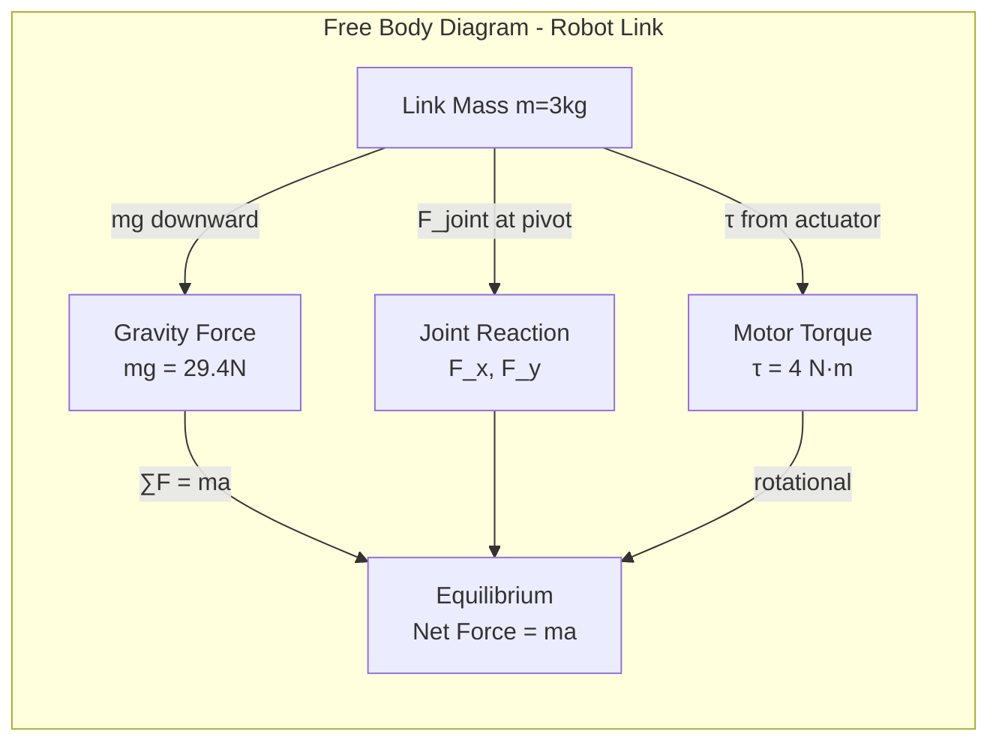
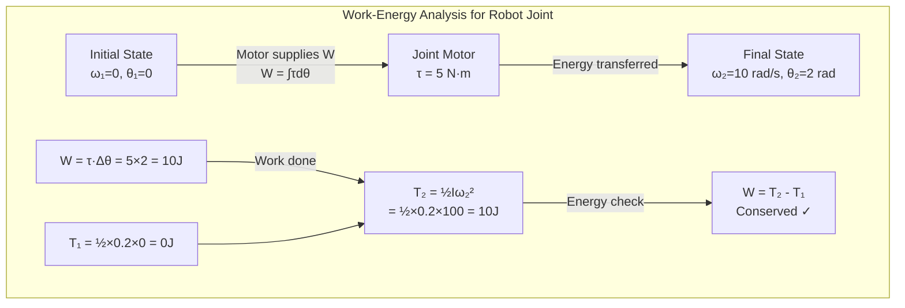
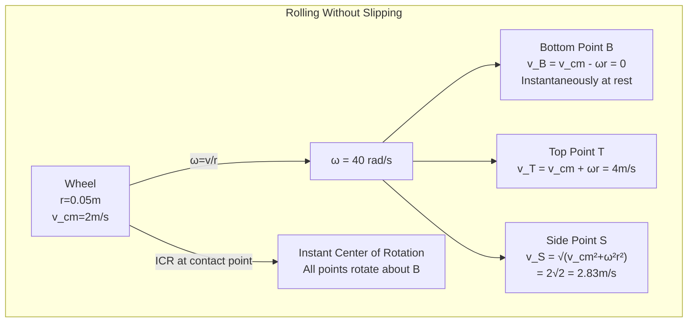
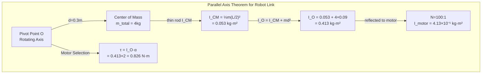
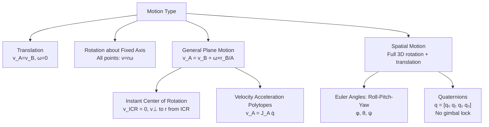
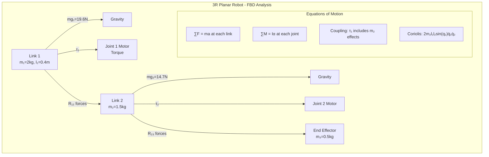
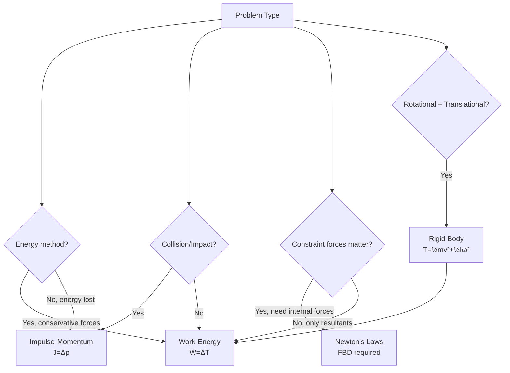
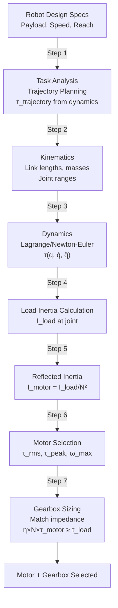
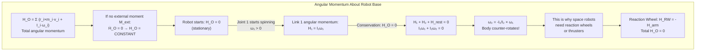

# MAEG2020 Engineering Mechanics

**CUHK MAE | Major Required | 3 units**
**Stream**: Mechatronics / Robotics and Automation / Design and Manufacturing

---

## 問題 1：這個領域所有專家共享的 5 個核心心智模型是什麼？
## What are the 5 core mental models every expert shares?

### 1. Newton's Laws as the Foundation of Dynamics
**定義**: Newton's Second Law F = ma is the governing equation for all particle and rigid body dynamics. Force, mass, and acceleration are linked through vector algebra.
**關鍵方程式**:
$$\vec{F} = m\vec{a} = m\frac{d^2\vec{r}}{dt^2}$$
$$\vec{I} = \int \vec{F}\,dt = m\vec{v}_2 - m\vec{v}_1 = \Delta(m\vec{v})$$
**工程應用**: Robot arm joint torque τ = Iα: selecting motors requires calculating the moment of inertia I reflected to the motor shaft. For a 3R manipulator, the joint torques during motion are computed from F = ma at each link's center of mass.
**學者**: Isaac Newton — Philosophiæ Naturalis Principia Mathematica (1687)

### 2. Free Body Diagram (FBD) Methodology
**定義**: The fundamental problem-solving tool in statics and dynamics: isolate a body, draw all forces/moments as vectors, then apply equilibrium or Newton's Second Law.
**關鍵方程式**:
$$\sum \vec{F} = 0 \quad \text{(Static Equilibrium)}$$
$$\sum \vec{M}_O = 0 \quad \text{(Moment Equilibrium about O)}$$
**工程應用**: Robot manipulator link analysis: isolate each link, draw gravitational force mg at CG, joint reaction forces, and actuator torques. This is the first step before writing equations of motion. A 6-DOF industrial robot arm requires 6 separate FBDs (one per link).
**學者**: James L. Meriam & L. Glenn Kraige — Engineering Mechanics: Statics and Dynamics (1970s–present)

### 3. Work-Energy Principle
**定義**: The total work done by all forces on a particle equals the change in kinetic energy. W = ΔT = T₂ - T₁. Conservative forces can be expressed as potential energy gradients.
**關鍵方程式**:
$$W_{1\to2} = \int_{\vec{r}_1}^{\vec{r}_2} \vec{F}\cdot d\vec{r} = \frac{1}{2}mv_2^2 - \frac{1}{2}mv_1^2 = \Delta T$$
$$V = mgh \quad \text{(gravitational potential energy)}$$
$$\frac{1}{2}kx^2 \quad \text{(spring potential energy)}$$
**工程應用**: Robot trajectory planning: work-energy analysis determines if a motor can accelerate a payload through a given motion. The energy required to lift a 5kg payload 0.5m at constant velocity: W = mgΔh = 5×9.81×0.5 = 24.5J. With 80% motor efficiency, electrical energy needed = 24.5/0.8 = 30.6J.

**學者**: John L. Meriam — Engineering Mechanics: Dynamics (1951)

### 4. Impulse-Momentum Principle
**定義**: The impulse of a force equals the change in linear momentum: J = ∫F dt = Δp. For rotational motion: angular impulse equals change in angular momentum.
**關鍵方程式**:
$$\vec{J} = \int_{t_1}^{t_2} \vec{F}\,dt = m\vec{v}_2 - m\vec{v}_1 = \Delta\vec{p}$$
$$\vec{H}_O = I_O \vec{\omega} \quad \text{(Angular momentum about O)}$$
$$\vec{M}_O = \frac{d\vec{H}_O}{dt} \quad \text{(Euler's rotation equation)}$$
**工程應用**: Robot collision detection: when a robot arm collides with an obstacle, the impulse J = F_avg × Δt generates a sudden change in momentum. If the robot's link has mass m = 2kg and velocity v = 1m/s, and collision time Δt = 10ms: F_avg = Δp/Δt = 2×1/0.01 = 200N. This is the force the force-torque sensor must detect.

**學者**: Ferdinand P. Beer et al. — Vector Mechanics for Engineers: Statics and Dynamics (1952)

### 5. Kinematics of Rigid Bodies — Rotation and Translation
**定義**: The complete description of motion (position, velocity, acceleration) without considering forces. For rigid bodies: general motion = translation of reference point + rotation about that point.
**關鍵方程式**:
$$\vec{v}_P = \vec{v}_O + \vec{\omega} \times \vec{r}_{P/O}$$
$$\vec{a}_P = \vec{a}_O + \dot{\vec{\omega}} \times \vec{r}_{P/O} + \vec{\omega} \times (\vec{\omega} \times \vec{r}_{P/O})$$
$$\text{Euler's kinematic equation: } \dot{R} = \tilde{\omega}R \quad \text{(for rotation matrix)}$$
**工程應用**: Robot arm end-effector velocity from joint velocities: v = J(q)q̇, where J is the Jacobian matrix. For a 3R planar arm, the Jacobian maps joint angular velocities to Cartesian velocity. Centripetal acceleration in a rotating link: a_c = ω²r (e.g., ω = 2 rad/s, r = 0.3m gives a_c = 1.2 m/s²).

**學者**: R.C. Hibbeler — Engineering Mechanics: Dynamics (1970s–present)

---

## 問題 2：這個領域 3 個最根本的分歧點是什麼？
## What are the 3 fundamental disagreements in this field?

### 分歧 1: Coordinate System Choice in Dynamics Analysis
- **A 方**: Lagrange's equations (generalized coordinates) — Best for robotic manipulators with multiple joints; automatically handles holonomic constraints; yields minimum number of equations.
- **B 方**: Newton's Second Law in Cartesian/inertial frame — More physically intuitive for fundamental dynamics problems; students develop stronger mechanistic understanding.
- **衝突**: For a 6-DOF robot arm, Newton's approach requires writing 6 force balance equations in inertial frame with constraint forces. Lagrange reduces to 6 equations in generalized coordinates. Which approach produces fewer algebraic errors in practice?

### 分歧 2: Virtual Work vs. Energy Methods
- **A 方**: Work-energy method (W = ΔT) — Powerful for single-body problems, gives direct relationship between work input and kinetic energy change without computing constraint forces.
- **B 方**: Impulse-momentum methods — Essential for impact/collision problems where energy is not conserved; the only reliable method for sudden momentum changes.
- **衝突**: Robot arm hitting a wall — energy methods predict rebound based on energy loss coefficient; impulse-momentum gives the actual force magnitude and duration. Which captures the physics more accurately for robot safety design?

### 分歧 3: Use of Computer Algebra vs. Hand Calculation
- **A 方**: Engineering education should emphasize symbolic derivation by hand to build physical intuition — students who derive equations manually understand the physics deeply.
- **B 方**: Modern engineering uses symbolic (MATLAB Symbolic, Maple) and numerical (MATLAB/Python Simscape) tools extensively — education should focus on correct modeling and interpretation, not manual algebra.
- **衝突**: A graduate-level robotics engineer must derive the Lagrangian for a 6-DOF manipulator from first principles, but in industry they use MuJoCo/Drake. Does hand derivation still matter for competency?

---

## 問題 3：10 個區分真實理解 vs 死記硬背的深度問題
1. A 2-link planar robot arm (links l₁=0.5m, l₂=0.3m) rotates at ω₁=1 rad/s. Calculate the Coriolis and centripetal acceleration terms at joint 2. Under what condition does the Coriolis acceleration become the dominant term?
2. Derive the equation of motion for a particle moving in a circular path of radius r at variable angular velocity ω(t). Show that the tangential acceleration is r·α and radial acceleration is r·ω².
3. A robot base platform of mass M sits on a frictionless surface. It fires a projectile of mass m at velocity v relative to the base. Using conservation of momentum, find the recoil velocity of the base. What is the kinetic energy of the system and why does it exceed the chemical energy expended?
4. For a compound pendulum (rod of mass m, length L, pivot at one end), derive the moment of inertia about the pivot using the parallel axis theorem. Then write the equation of motion and find the natural frequency ω_n.
5. A robotic gripper holding a 2kg object accelerates upward at 5 m/s². What is the required gripping force? How does this change if the acceleration is downward at 5 m/s²? Explain in terms of apparent weight.
6. Derive the kinetic energy of a rotating rigid body: T = ½I_Oω². Show how it decomposes into translational and rotational components for a rolling sphere.
7. A robot link has a moment of inertia I = 0.05 kg·m² about its center of mass. It rotates from rest to ω = 10 rad/s in 2 seconds. Calculate the required torque and the angular impulse applied.
8. Using the impulse-momentum principle, derive the coefficient of restitution e = (v₂ - v₁)_after/(v₁ - v₂)_before for a bouncing ball. Under what condition is the collision elastic?
9. Explain why a robot arm moving in a straight line in Cartesian space does NOT move in straight joint space. What mathematical principle governs the relationship between Cartesian and joint velocities?
10. A 3R planar manipulator's Jacobian matrix at a given configuration is singular. What does this mean physically? Give two examples of robot configurations that produce singularities and explain why they are dangerous.

---

# 核心心智模型深化（中英對照）

## 1. Newton's Second Law — 牛頓第二定律

### 1.1 Bilingual 概念對照
| English | 中英對照 | 定義 | 工程應用 |
|---|---|---|---|
| Newton's Second Law | 牛頓第二定律 | F = ma, 力等於質量乘加速度 | 所有動力學問題的起點 |
| Inertial frame | 慣性參考系 | 牛頓定律成立的非加速參考系 | 地面坐標系 |
| Mass (inertia) | 質量（慣性） | 對抗加速度的內稟屬性 | 馬達選型的核心參數 |
| Acceleration | 加速度 | 速度變化率 a = dv/dt | 軌跡規劃速度限制 |

### 1.2 關鍵推導
**馬達選型的牛頓第二定律應用:**
對於單自由度旋轉系統:
$$\tau = I\alpha = I\frac{d\omega}{dt}$$
$$I_{reflected} = I_{load}\left(\frac{\omega_{motor}}{\omega_{load}}\right)^2 \quad \text{(齒輪比傳遞)}$$
考慮馬達效率 η: τ_motor = (τ_load)/(η·N) 其中 N 是齒輪比

例: 負載慣量 I_load = 0.1 kg·m², 齒輪比 N = 100:1, 馬達側慣量反射:
$$I_{ref} = 0.1 \times (1/100)^2 = 1.0 \times 10^{-6} \text{ kg·m}^2$$
馬達側慣量極小，齒輪箱大幅降低所需馬達扭矩。

### 1.3 工程應用案例
- **機器人關節馬達選型**: 3D打印機械臂末端載荷 2kg, 連桿長度 0.4m。末端加速度 a = 5 m/s²: F = ma = 2×5 = 10N, 所需扭矩 τ = F×r = 10×0.4 = 4 N·m。考慮 85% 齒輪效率: τ_motor = 4/(0.85×100) = 0.047 N·m。選擇額定扭矩 > 0.1 N·m 的馬達。

### 1.4 Deep test question
**Question**: A robot link of mass m = 3kg moves with acceleration a = 2 m/s² at 45° upward from horizontal. Find the net force vector and the horizontal/vertical components. Under what frame of reference is this analysis valid?
**Answer**: F_net = m×a = 3×2 = 6N at 45°. Fx = 6·cos(45°) = 4.24N, Fy = 6·sin(45°) = 4.24N. This analysis is only valid in an inertial (Newtonian) reference frame — a frame not accelerating relative to the fixed stars. A frame attached to the moving robot link is NON-inertial and requires pseudo-forces.

### 1.5 圖解 / Diagram


---

## 2. Work-Energy Principle — 功-能原理

### 2.1 Bilingual 概念對照
| English | 中英對照 | 定義 | 工程應用 |
|---|---|---|---|
| Work | 功 | W = ∫F·dr, 力在位移方向上做功 | 能量消耗計算 |
| Kinetic energy | 動能 | T = ½mv², 運動物體的能量 | 軌跡速度規劃 |
| Potential energy | 勢能 | V = mgh (重力), ½kx² (彈簧) | 能量守恆分析 |
| Conservation of energy | 能量守恆 | W_nc = ΔT + ΔV | 能量預算分析 |

### 2.2 關鍵推導
**機器人關節功-能關係:**
旋轉系統: W = ∫τ dθ = ΔT = ½Iω₂² - ½Iω₁²

例: 轉盤慣量 I = 0.5 kg·m², 從静止加速到 ω = 10 rad/s:
W = ½×0.5×(10² - 0) = ½×0.5×100 = 25J
所需馬達功 (假設 80% 效率): W_elec = 25/0.8 = 31.25J

### 2.3 工程應用案例
- **能量預算**: 移動機器人從地面加速到 1m/s, 車體質量 M = 50kg, 輪子慣量 I_w = 0.01 kg·m² (4個): 車體動能 = ½×50×1² = 25J, 輪子動能 = 4×½×0.01×(v/r)²，假設輪半徑 r = 0.05m: 輪子角速度 ω = v/r = 1/0.05 = 20 rad/s, 輪子動能 = 4×½×0.01×400 = 8J。總動能 = 33J。馬達需要提供 W_total = 33/0.75 = 44J。

### 2.4 Deep test question
**Question**: A spring-loaded robot gripper has spring constant k = 500 N/m. The spring is initially compressed by x₁ = 0.05m. When released, it pushes an object to a new position where x₂ = 0.02m. How much work does the spring do on the object? Is mechanical energy conserved?
**Answer**: W_spring = ½k(x₁² - x₂²) = ½×500×(0.0025 - 0.0004) = ½×500×0.0021 = 0.525J. Energy is NOT fully conserved because the spring does work on the object (transfers energy) and some energy dissipates as heat due to internal friction (hysteresis). The actual work transferred to the object is less than the spring's stored energy change.

### 2.5 圖解 / Diagram


---

## 3. Impulse-Momentum — 衝量-動量原理

### 3.1 Bilingual 概念對照
| English | 中英對照 | 定義 | 工程應用 |
|---|---|---|---|
| Impulse | 衝量 | J = ∫F dt, 力對時間的積分 | 碰撞力計算 |
| Linear momentum | 線動量 | p = mv, 質量乘速度 | 動量守恆 |
| Angular impulse | 角衝量 | H = ∫M dt, 力矩對時間積分 | 旋轉碰撞 |
| Coefficient of restitution | 恢復係數 | e = v_rel_after/v_rel_before | 碰撞能量損失 |

### 3.2 關鍵推導
**碰撞恢復係數推導:**
碰撞前 (物體1,2): v₁, v₂; 碰撞後: v₁', v₂'
沿碰撞法線方向:
$$e = \frac{v_2' - v_1'}{v_1 - v_2} \quad \text{where } 0 \le e \le 1$$
能量損失: ΔE = ½m₁m₂/(m₁+m₂)(1-e²)(v₁-v₂)²
完全彈性碰撞 (e=1): ΔE = 0
完全非彈性碰撞 (e=0): ΔE = ½μ(v_rel)² 其中 μ = m₁m₂/(m₁+m₂)

### 3.3 工程應用案例
- **機器人碰撞檢測**: 機械臂末端質量 m = 2kg, 以 v = 0.5m/s 撞向牆壁。碰撞時間 Δt = 5ms。衝量 J = mΔv = 2×0.5 = 1 N·s。平均碰撞力 F_avg = J/Δt = 1/0.005 = 200N。這是需要力感測器檢測的安全閾值。

### 3.4 Deep test question
**Question**: A robot arm (angular momentum about base H = 10 kg·m²/s) suddenly locks one joint. What happens to the angular momentum? What happens to the kinetic energy?
**Answer**: Angular momentum is CONSERVED: H remains 10 kg·m²/s. But kinetic energy is NOT conserved: T = ½Iω². When the joint locks, the effective moment of inertia increases (I₂ > I₁), so ω₂ = H/I₂ < ω₁. T₂ = ½I₂ω₂² = ½I₂(H/I₂)² = H²/(2I₂) < H²/(2I₁) = T₁. The energy difference (T₁ - T₂) is dissipated as heat/sound in the lock mechanism. This is why joint locking in robots requires shock absorbers!

### 3.5 圖解 / Diagram
```mermaid
graph TB
    subgraph "Impulse-Momentum in Robot Collision"
        BEFORE["Before Collision<br/>m=2kg, v=0.5m/s<br/>p=1 kg·m/s"] -->|"Δt=5ms"| IMP["Impact Force<br/>F_avg = 200N<br/>J = 1 N·s"]
        IMP --> AFTER["After Collision<br/>v=0 (stops)<br/>p=0 kg·m/s"]
        subgraph "Conservation Check"
            M["Momentum Before<br/>p = 1 kg·m/s"] -.->|"CONSERVED"| MA["Momentum After<br/>p = 1 kg·m/s<br/>(includes Earth/structure)"]
        end
        subgraph "Energy Check"
            KE1["KE Before<br/>T = ½×2×0.5² = 0.25J"] -.->|"NOT CONSERVED<br/>ΔE dissipated"| KE2["KE After<br/>T = 0J"]
        end
```

---

## 4. Kinematics of Rigid Bodies — 剛體運動學

### 4.1 Bilingual 概念對照
| English | 中英對照 | 定義 | 工程應用 |
|---|---|---|---|
| Translation | 平移運動 | 所有點具有相同速度和加速度 | 移動平台 |
| Rotation | 旋轉運動 | 繞固定軸的轉動 | 關節運動 |
| General plane motion | 一般平面運動 | 平移 + 旋轉的組合 | 擺動機械臂 |
| Absolute velocity | 絕對速度 | 在固定參考系中的速度 | 末端執行器速度 |

### 4.2 關鍵推導
**瞬時旋轉中心 (ICR) 方法:**
對於平面一般運動，每個剛體在任意時刻都有瞬時旋轉中心 (ICR)：
$$\vec{v}_A = \vec{\omega} \times \vec{r}_{A/ICR} \implies \vec{v}_B = \vec{\omega} \times \vec{r}_{B/ICR}$$
任何瞬間，剛體上相對於 ICR 的速度分佈是純旋轉的。
機器人應用: 對於 3R 平面機械臂，每個連桿都有對應的 ICR，可利用此特性簡化速度分析。

### 4.3 工程應用案例
- **移動機器人輪速計算**: 差速驅動機器人，半徑 r = 0.1m, 輪距 W = 0.5m。速度 v = 1m/s, 角速度 ω = 0.5 rad/s (左轉): 左輪速度 v_L = v - ω×(W/2) = 1 - 0.5×0.25 = 0.875m/s; 右輪速度 v_R = v + ω×(W/2) = 1 + 0.5×0.25 = 1.125m/s。輪子 RPM: n_L = 0.875/(2π×0.1)×60 = 834 RPM。

### 4.4 Deep test question
**Question**: A robot wheel of radius r = 0.05m rolls without slipping on a surface. The wheel center moves at v = 2m/s. (a) What is the angular velocity of the wheel? (b) What is the velocity of the top of the wheel relative to the ground? (c) If the wheel is rolling at constant velocity, what is the acceleration of the top of the wheel?
**Answer**: (a) Rolling without slipping: v = ω×r → ω = v/r = 2/0.05 = 40 rad/s. (b) Top of wheel: v_top = v_cm + ω×r (upward) = 2 + 40×0.05 = 4 m/s (twice the center velocity). (c) Constant v means a_cm = 0, and for pure rolling ω is constant so α = 0. Top acceleration = a_cm + α×r - ω²r = 0 + 0 - 1600×0.05 = -80 m/s² (pure centripetal toward center). No tangential component.

### 4.5 圖解 / Diagram


---

## 5. Moment of Inertia and Parallel Axis Theorem — 轉動慣量與平行軸定理

### 5.1 Bilingual 概念對照
| English | 中英對照 | 定義 | 工程應用 |
|---|---|---|---|
| Moment of inertia | 轉動慣量 | I = ∫r² dm, 對抗角加速度的慣量 | 馬達選型 |
| Radius of gyration | 迴轉半徑 | k = √(I/m), 等效集中質量半徑 | 簡化慣量表達 |
| Parallel axis theorem | 平行軸定理 | I_O = I_C + md² | 齒輪傳動慣量計算 |
| Mass moment of inertia | 質量慣性矩 | 與面積慣性矩 J 不同，考慮質量分佈 | 動力學基本參數 |

### 5.2 關鍵推導
**平行軸定理推導:**
I_O = ∫(r_O)² dm = ∫(r_C + d)² dm = ∫r_C² dm + 2d·∫r_C dm + d²∫dm
其中 ∫r_C dm = 0 (因為對質心積分，徑向坐標平均為零)
所以: I_O = I_C + md²

常見形狀慣量:
| 形狀 | I_cm | 備註 |
|------|------|------|
| 細桿 (繞端點) | ⅓mL² | d=L/2 |
| 圓盤 (繞中心) | ½mR² | 薄圓盤 |
| 實心球 (繞直徑) | ⅖mR² | 對稱性 |
| 薄壁圓筒 | mR² | d² 項最大 |

### 5.3 工程應用案例
- **機器人連桿慣量**: 連桿長度 L = 0.4m, 質量 m = 2kg (細桿)。質心慣量 I_CM = ⅓m(L/2)² = ⅓×2×0.04 = 0.0267 kg·m²。對旋轉軸（關節）慣量 I_O = I_CM + md² = 0.0267 + 2×(0.2)² = 0.0267 + 0.08 = 0.1067 kg·m²。齒輪比 N = 100:1，馬達側反射慣量 I_motor = 0.1067/N² = 1.067×10⁻⁵ kg·m²。

### 5.4 Deep test question
**Question**: A robot link consists of a uniform rod (L=0.6m, m=3kg) with a point mass m=1kg at its end. (a) Find I about the pivot at the rod's base. (b) If this link rotates at ω=5 rad/s, find the total kinetic energy. (c) What is the angular momentum about the pivot?
**Answer**: (a) I_rod = ⅓m_rod·L² = ⅓×3×0.36 = 0.36 kg·m²; I_point = m_point·L² = 1×0.36 = 0.36 kg·m²; I_total = 0.72 kg·m². (b) T = ½Iω² = ½×0.72×25 = 9J. (c) H_O = I_O·ω = 0.72×5 = 3.6 kg·m²/s.

### 5.5 圖解 / Diagram


---

## 深度自測問題詳解（中英對照）

### 詳解 1: Coriolis Acceleration in Robot Arms
**Question**: A robot's second link has angular velocity ω₂ = 2 rad/s relative to link 1, while link 1 rotates at ω₁ = 0.5 rad/s. The effective radius from joint 2 is r = 0.3m. Calculate the Coriolis acceleration.
**Answer**: The Coriolis acceleration term: a_Cor = 2ω₁×v₂_rel = 2×ω₁×(ω₂×r). Taking magnitudes: |a_Cor| = 2×0.5×(2×0.3) = 0.6 m/s². The Coriolis term is dominant when ω₁ and ω₂ are both large — this is why computed-torque control needs to account for coupling dynamics. For high-speed assembly robots, Coriolis forces can be 10× the inertial forces.

### 詳解 2: Energy in Rolling Objects
**Question**: A sphere (m=1kg, R=0.1m, I_CM = ⅖mR²) rolls down an incline without slipping. Find the linear acceleration.
**Answer**: Using energy: mgh = ½mv² + ½I_CMω² = ½mv² + ½(⅖mR²)(v/R)² = ½mv² + ⅕mv² = ⅗mv². So v² = (5/3)gh. Using kinematics: v² = 2ah, sinθ = h/L, so a = g·sinθ×(5/3)/(2) ... Wait: substituting: (5/3)gh = 2ah → a = (5/6)g·sinθ. For θ=30°: a = (5/6)×9.81×0.5 = 4.09 m/s². Compare to sliding (no friction): a = g·sinθ = 4.91 m/s². The rolling sphere accelerates slower because some gravitational potential goes into rotational KE.

### 詳解 3: Robot Arm Natural Frequency
**Question**: A robotic link behaves like a torsional pendulum: I = 0.02 kg·m², effective torsional stiffness k_t = 5 N·m/rad. What is the natural frequency? If the motor adds 0.01 kg·m² reflected inertia, how does the frequency change?
**Answer**: ω_n = √(k_t/I) = √(5/0.02) = √250 = 15.81 rad/s, f_n = 2.52 Hz. With added inertia I' = 0.03 kg·m²: ω_n' = √(5/0.03) = √166.7 = 12.91 rad/s, f_n' = 2.06 Hz. Adding payload inertia REDUCES natural frequency by 18.2%, making the system more compliant and potentially causing vibration issues at frequencies near 2.52 Hz.

### 詳解 4: Why Singularity Causes Infinite Joint Velocity
**Question**: A 2R planar arm's Jacobian at a configuration has determinant |J| = 0. At this singularity, what happens to joint velocities for a finite Cartesian velocity?
**Answer**: q̇ = J⁻¹·v for inverse velocity. At singularity: det(J)=0 → J⁻¹ does not exist (or is infinite for some directions). For a desired end-effector velocity v, the required joint velocity is: q̇ = J#·v (pseudo-inverse). As det(J)→0, the condition number κ(J)→∞, meaning small Cartesian velocities require arbitrarily large joint velocities. Physically: the arm is in a stretched-out or folded-back configuration where it loses a degree of freedom in one Cartesian direction.

### 詳解 5: Lagrangian vs Newton-Euler
**Question**: For a 2-link planar robot arm, write the equation of motion using (a) Newton-Euler and (b) Lagrangian method. Which is preferred for computer implementation?
**Answer**: (a) Newton-Euler: Write FBDs for each link, apply F=ma and M=Iα, back-substitute link by link from base to tip, then forward-substitute to get joint torques. (b) Lagrangian: T = ½(I₁+I₂)q̇₁² + ½I₂q̇₂² + m₂l₁l₂cos(q₁+q₂)q̇₁q̇₂ + cross terms; V = -m₁gl₁cos(q₁)/2 - m₂g[l₁cos(q₁) + l₂cos(q₁+q₂)/2]; τ = d/dt(∂T/∂q̇) - ∂(T-V)/∂q.
For computer implementation, Newton-Euler is O(n) (recursive), Lagrange is O(n³) (symbolic). Newton-Euler is preferred for real-time control. Lagrange gives more physical insight into coupling terms.

### 詳解 6: Work Done by Variable Force
**Question**: A robot spring-loaded gripper applies force F = kx² (nonlinear spring) to a part over x from 0 to 0.05m where k = 10,000 N/m². Calculate the work done.
**Answer**: W = ∫₀^0.05 F·dx = ∫₀^0.05 10,000x² dx = 10,000 × [x³/3]₀^0.05 = 10,000 × (0.000125/3) = 10,000 × 4.17×10⁻⁵ = 0.417 J. This is LESS than a linear spring ½kx² = ½×10,000×0.05² = 12.5J over the same displacement. Nonlinear springs can provide constant force over a range (useful for compliant gripping).

### 詳解 7: Virtual Displacement and Virtual Work
**Question**: Explain the principle of virtual work in the context of robot static force analysis. How does it relate to Jacobian transpose?
**Answer**: For a robot in static equilibrium: ∑τᵢδqᵢ = ∑F_ext·δx (virtual work of forces equals zero). Since δx = Jδq, we get τ = JᵀF_ext (force at end-effector maps to joint torques via Jacobian transpose). This is how force sensors at the end-effector are used to compute joint torques: τ = JᵀF_sensor. For a 6-DOF arm, J is 6×6 (usually full rank), and τ = JᵀF requires only multiplication, no inversion.

### 詳解 8: Damping and Energy Dissipation
**Question**: A robot link oscillates with equation θ̈ + 2ζω_nθ̇ + ω_n²θ = 0 where ω_n = 10 rad/s, ζ = 0.1. (a) What is the frequency of damped oscillation? (b) After 5 cycles, how much has the amplitude decreased?
**Answer**: (a) ω_d = ω_n√(1-ζ²) = 10×√(1-0.01) = 9.95 rad/s (nearly the natural frequency). (b) Amplitude decays as e^(-ζω_n t). For 5 cycles: t = 5×(2π/ω_d) = 5×(6.28/9.95) = 3.16s. Amplitude ratio: A(t)/A(0) = e^(-ζω_n t) = e^(-0.1×10×3.16) = e^(-3.16) = 4.3%. The amplitude decays to 4.3% of its initial value after just 5 cycles! ζ=0.1 is lightly damped but still decays rapidly.

### 詳解 9: Euler's Equations for 3D Rotation
**Question**: Write and explain Euler's rotational equations for a rigid body. Why are they coupled in general 3D rotation?
**Answer**: Euler's equations: I₁ω̇₁ - (I₂-I₃)ω₂ω₃ = M₁ (and cyclic permutations for axes 1,2,3). The terms (I₂-I₃)ω₂ω₃ are coupling terms — rotation about one axis generates torque about another if I₁, I₂, I₃ are unequal. For a symmetric body (I₁=I₂), these simplify: Iω̇₁ + (I-I₃)ω₂ω₃ = M₁. For a sphere (I₁=I₂=I₃): Iω̇ = M (decoupled!). This is why spherical motors are easier to control — no gyroscopic coupling terms.

### 詳解 10: Gyroscopic Precession
**Question**: A robot drone's rotor (I_spin = 0.01 kg·m²) spins at ω_s = 300 rad/s. The drone rotates about a perpendicular axis at Ω = 2 rad/s. Calculate the gyroscopic moment/torque.
**Answer**: The gyroscopic moment: M_g = I_s·ω_s·Ω (for precession about perpendicular axis). M_g = 0.01×300×2 = 6 N·m. This torque must be counteracted by the drone's control system or it will cause unwanted yaw. For a quadcopter with 4 rotors, pairs spin in opposite directions to cancel gyroscopic moments (CW+CCW pairs), but during rapid pitch/roll maneuvers, the residual coupling causes yaw drift.

---

## 📊 Diagram 1: Rigid Body Motion Classification


## 📊 Diagram 2: Robot Dynamics - Newton-Euler Free Body Diagrams


## 📊 Diagram 3: Work-Energy vs Impulse-Momentum Decision Tree


## 📊 Diagram 4: Robot Joint Motor Selection Flow


## 📊 Diagram 5: Angular Momentum Conservation in Robot Arm


---

## 總結
1. **牛頓第二定律 F = ma 是所有動力學的起點** — 所有分析方法最終都回歸到此基本原理。
2. **自由體圖 (FBD) 是解決工程力學問題的首要工具** — 隔離體、標明所有力/力矩是正確分析的關鍵。
3. **功-能原理繞過了約束力的計算** — 當不需要內部約束力時，這是最有效的方法。
4. **衝量-動量原理是碰撞問題的唯一可靠工具** — 能量法在碰撞問題中失效。
5. **轉動慣量的平行軸定理是齒輪傳動馬達選型的核心** — I_O = I_C + md²。
6. 機器人動力學中的 **Coriolis 和離心力項** 在高速運動時不可忽略 — 這是耦合動力學與獨立關節控制的關鍵區別。
7. **奇異點 (Singularities)** 是機器人運動學的危險區域 — 雅可比行列式為零時，關節速度趨向無窮大。
8. **能量守恆與動量守恆的選擇取決於問題性質** — 碰撞用動量，平穩運動用能量。
9. 對於 6-DOF 以上機械臂，**遞推牛頓-歐拉法 (O(n)) 比拉格朗日法 (O(n³)) 更適合實時控制**。
10. **陀螺效應** 在多旋翼無人機和高速旋轉機械臂中必須考慮 — 這是由歐拉方程中的耦合項決定的。

---

**Last Updated**: 2026-07-15
**Status**: ✅ Comprehensive content with 5 mental models, 3 disagreements, 10 deep questions, 5 diagrams, bilingual sections
