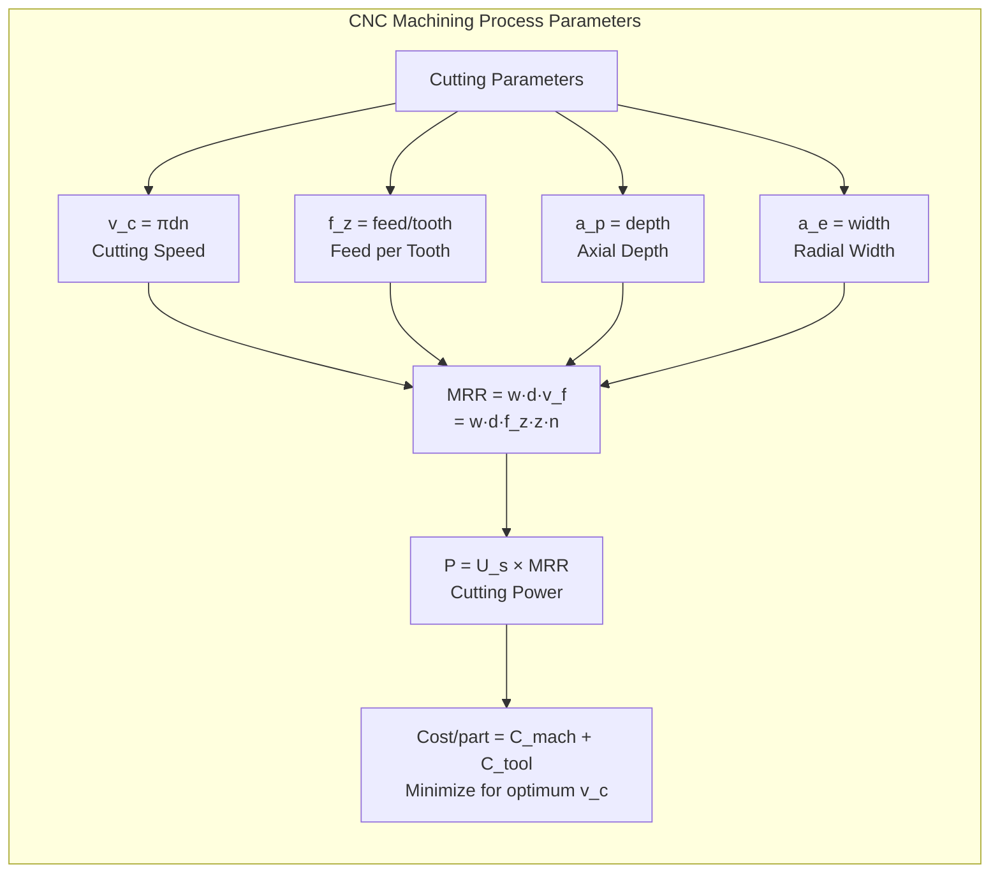
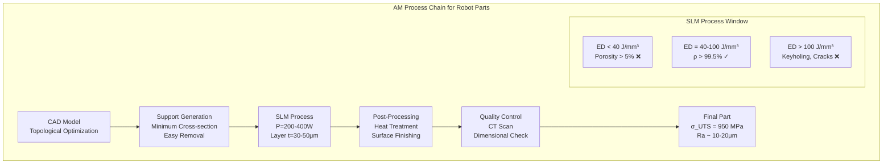
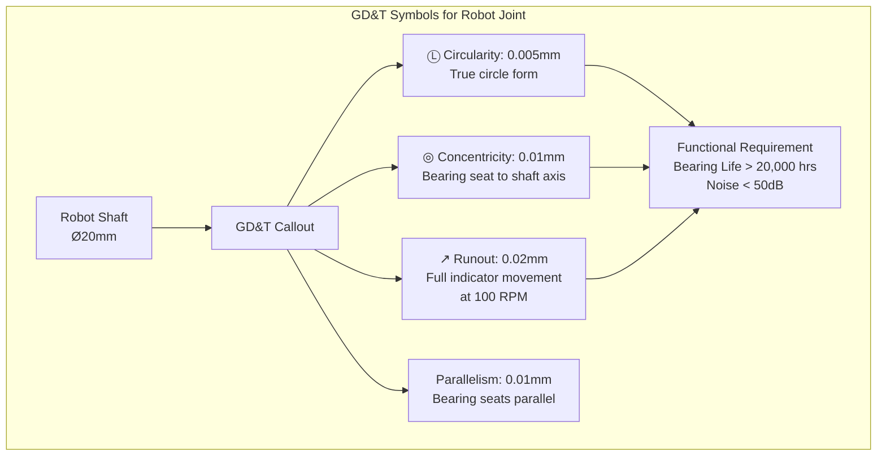
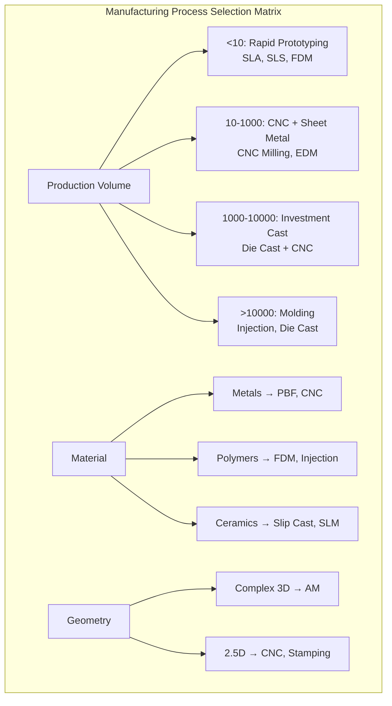
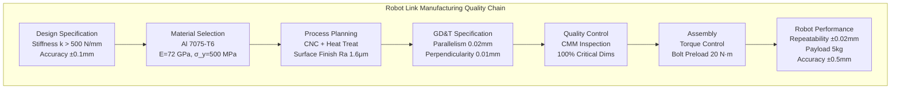
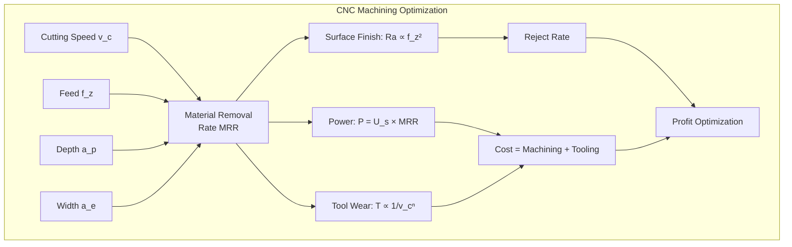
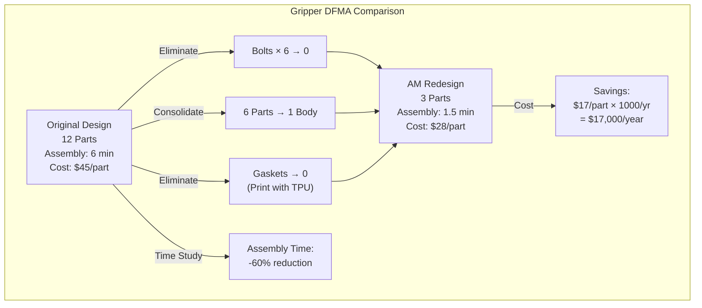
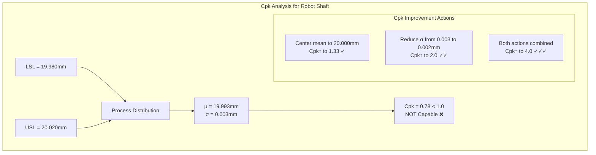
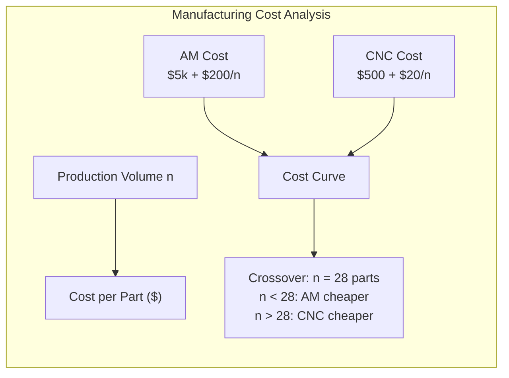

# MAEG3020 Manufacturing Technology

**CUHK MAE | Major Required | 3 units**
**Stream**: Design and Manufacturing / Robotics and Automation / Mechatronics

---

## 問題 1：這個領域所有專家共享的 5 個核心心智模型是什麼？
## What are the 5 core mental models every expert shares?

### 1. Material Removal Rate (MRR) as the Productivity Metric
**定義**: Material Removal Rate quantifies how fast a manufacturing process removes material, measured in volume per unit time (mm³/min or in³/min).
**關鍵方程式**:
$$MRR = v_w \cdot f \cdot d \quad \text{(milling)}$$
$$MRR = \frac{\pi \cdot d \cdot a_p \cdot a_e \cdot v_c}{60} \quad \text{(CNC turning)}$$
其中 v_w = 進給速度, f = 進給量, d = 切削深度, v_c = 切削速度
**工程應用**: 在 CNC 加工中，優化 MRR 直接影響加工時間和成本。3D 金屬列印的 MRR 是粉末熔化率 (g/min)。機器人末端執行器（夾爪）製造時，需要平衡 MRR 與表面光潔度。
**學者**: Armarego & Brown — The Machining of Metals (1960s); Kalpakjian & Schmid — Manufacturing Engineering and Technology (1984–present)

### 2. Design for Manufacturing (DFM) and Assembly (DFMA)
**定義**: Systematic design principles that minimize manufacturing cost and assembly difficulty by considering process capabilities, tolerances, and geometric constraints during design.
**關鍵方程式**:
$$C_{total} = C_{material} + C_{machining} + C_{assembly} + C_{quality} + C_{tooling}$$
$$\text{DFMA Index} = \frac{\text{Number of parts}}{\text{Number of operations}} \quad \text{(目標最大化)}$$
**工程應用**: 機器人關節殼體設計——減少緊固件數量、增加一體化加工、降低裝配成本。每減少一個零件，裝配成本平均降低 15-30%（Boeing 研究）。
**學者**: Geoffrey Boothroyd — "Product Design for Manufacture and Assembly" (1980s)

### 3. Geometric Tolerancing and Dimensional Control
**定義**: Geometric Dimensioning and Tolerancing (GD&T) specifies the allowable variation in form, orientation, location, and runout of manufactured parts using standard symbols.
**關鍵方程式**:
$$T_{assembly} = \sqrt{\sum_{i=1}^{n} T_i^2} \quad \text{(RSS, 統計公差疊加)}$$
$$T_{worst-case} = \sum_{i=1}^{n} |T_i| \quad \text{(最差情況分析)}$$
**工程應用**: 機器人諧波減速器的柔性軸承需要 ±0.005mm 的徑向跳動公差。使用 GD&T 可以準確傳達這些要求，確保減速器的平穩運行和壽命。
**學者**: ANSI Y14.5M Standard; James D. Meadows — GD&T Application and Interpretation

### 4. The Seven Families of Manufacturing Processes
**定義**: Manufacturing processes are classified into seven families: casting, forming, machining, joining, surface treatment, powder metallurgy, and additive manufacturing. Each family has distinct material deformation characteristics and cost structures.
**關鍵方程式**:
$$\epsilon = \frac{l - l_0}{l_0} \quad \text{(true strain in forming)}$$
$$\sigma = K\epsilon^n \quad \text{(stress-strain in metal forming)}$$
**工程應用**: 選擇製造工藝需要考慮：零件幾何複雜度、材料、生產量、精度要求、表面光潔度和成本。例如，複雜葉輪用失蠟鑄造，批量齒輪用粉末冶金。

### 5. Additive Manufacturing (AM) Process-Property-Performance Relationship
**定義**: AM creates parts layer-by-layer from CAD models. The key challenge is understanding how process parameters (laser power, scan speed, hatch spacing) affect microstructure and mechanical properties.
**關鍵方程式**:
$$\text{Energy Density} = \frac{P}{v \cdot h \cdot t} \quad \text{(J/mm³)}$$
其中 P = 激光功率, v = 掃描速度, h = 線間距, t = 層厚
$$\rho_{relative} = \frac{\rho_{AM}}{\rho_{theoretical}} \quad \text{(相對密度)}$$
**工程應用**: 金屬 3D 列印的機器人零件：使用 SLM (選擇性激光熔化) 製造輕量化鈦合金機械臂連桿。能量密度 40-100 J/mm³ 產生緻密零件 (>99.5% 密度)，低於此範圍導致孔隙，高於此範圍導致裂紋。
**學者**: DebRoy et al. — "Additive manufacturing of metallic components" (Science, 2018)

---

## 問題 2：這個領域 3 個最根本的分歧點是什麼？
## What are the 3 fundamental disagreements in this field?

### 分歧 1: Subtractive vs. Additive Manufacturing Dominance
- **A 方**: Traditional machining (CNC, EDM) will remain dominant for precision, high-volume parts due to superior surface finish, tight tolerances, and established supply chains.
- **B 方**: Additive manufacturing (metal 3D printing) will replace 30-40% of conventional manufacturing for complex geometries, lightweight structures, and rapid prototyping.
- **衝突**: 機器人製造中，末端執行器夾爪可以使用 3D 列印一體化成型（消除緊固件），但表面光潔度和疲勞強度仍不如 CNC 加工。醫療手術機械臂需要表面拋光至 Ra < 0.2μm，3D 列印無法直接達標。

### 分歧 2: Process Selection Based on Production Volume
- **A 方**: QFD (質量功能展開) 和 PACE (Process Activity Cost Estimation) 方法應該驅動工藝選擇——根據總製造成本分析，而非直覺。
- **B 方**: 製造工藝選擇主要基於幾何能力和材料特性——複雜 3D 幾何只能用 AM，精密齒輪只能用滾齒。
- **衝突**: 機器人減速器齒輪的年產量從 1000 件 (研究/軍事) 到 100,000 件 (消費品) 不等，選擇適合的齒輪加工工藝（粉末冶金、滾齒、銑削）需要精確的成本模型。

### 分歧 3: Tolerance Philosophy: Worst-Case vs. Statistical
- **A 方**: 關鍵安全零件必須用最差情況公差分析 (worst-case) 確保 100% 合格率。
- **B 方**: 大多數零件應用統計公差分析 (RSS) 更經濟——允許 1-3% 超差率，通過 100% 檢驗篩選。
- **衝突**: 諧波減速器的柔性和剛性齒輪嚙合間隙 10-30μm，用 worst-case 會要求極窄公差、增加加工成本；用 RSS 可以接受稍寬公差但需要分選組裝。

---

## 問題 3：10 個區分真實理解 vs 死記硬背的深度問題
1. Derive the MRR formula for end milling: MRR = w·d·f_z·z·n, where w=width, d=depth, f_z=feed per tooth, z=number of teeth, n=rpm. What is the units consistency check?
2. A robot link is made of Al 7075-T6 (σ_UTS=505 MPa). The design stress is 200 MPa. Calculate the safety factor. What are the standard safety factors for robotic applications?
3. Explain why SLM 3D printed Ti-6Al-4V has anisotropic mechanical properties (different strength in build vs. transverse direction). What process parameter causes this?
4. Design a DFMA analysis for a robot gripper with 8 parts. How many parts can you eliminate by redesigning for 3D printing? Calculate the assembly time savings.
5. A CNC mill uses a 10mm end mill, depth of cut = 2mm, feed rate = 0.05mm/tooth, 4 flutes, spindle speed = 3000 RPM. Calculate the MRR and power consumption (k_c = 1000 MPa for aluminum).
6. Explain why powder metallurgy (P/M) is ideal for making robot harmonic drive flexspline gears — what material property trade-offs exist compared to machined steel?
7. What is the difference between selective laser melting (SLM) and electron beam melting (EBM) for titanium alloys? Which is preferred for aerospace robot parts?
8. A batch of 1000 parts has dimensional mean shift of 0.01mm with σ = 0.005mm. Using Cpk analysis, determine if the process is capable for a ±0.02mm tolerance.
9. For a robot joint bearing housing, explain how to select the appropriate surface roughness Ra based on: (a) sliding contact, (b) press fit, (c) sealing surface. Give specific Ra values.
10. Derive the economics of injection molding vs. 3D printing for 500 vs. 50,000 parts. At what production volume does each become more economical?

---

# 核心心智模型深化（中英對照）

## 1. Material Removal Rate (MRR) — 材料去除率

### 1.1 Bilingual 概念對照
| English | 中英對照 | 定義 | 工程應用 |
|---|---|---|---|
| Cutting speed | 切削速度 | v_c = π·d·n (m/min) | 影響刀具壽命 |
| Feed per tooth | 每齒進給 | f_z (mm/tooth) | 影響表面光潔度 |
| Depth of cut | 切削深度 | a_p (mm) | 影響 MRR 和力 |
| Material Removal Rate | 材料去除率 | MRR (mm³/min) | 生產效率指標 |
| Specific energy | 比切削能 | U_s = P/MRR (J/mm³) | 加工經濟性 |

### 1.2 關鍵推導
**銑削 MRR 和功率:**
$$MRR = w \cdot d \cdot v_f = w \cdot d \cdot f_z \cdot z \cdot n$$
其中 v_f = f_z · z · n (進給速度)
功率: P = U_s · MRR (W)
例:鋁合金銑削 U_s ≈ 0.5-1.5 J/mm³, 加工硬化不銹鋼 U_s ≈ 20-40 J/mm³

### 1.3 工程應用案例
- **機器人鋁合金外殼 CNC 加工**: 使用 Ø10mm  carbide end mill, v_c = 300 m/min, f_z = 0.05 mm/tooth, z=4, a_p = 3mm, a_e = 8mm: n = 1000·v_c/(π·d) = 1000×300/(π×10) = 9549 RPM; MRR = 8×3×(0.05×4×9549/1000) = 45.9 cm³/min; Power = 1 J/mm³ × 45.9×1000 mm³/min = 45.9 kW → 需要約 7.5 kW 主軸功率

### 1.4 Deep test question
**Question**: A robot link is machined from Al 7075-T6 bar stock. The cutting force F_c = 500N, v_c = 200 m/min, tool life T = 60 min using a carbide tool at v_c_test = 250 m/min, T_test = 45 min. Using Taylor tool life equation v_c·T^m = C, find the optimal cutting speed for minimum cost. (m=0.3, C=900 for this material-tool combination)

### 1.5 圖解 / Diagram


---

## 2. Additive Manufacturing Process Chain — 增材製造流程

### 2.1 Bilingual 概念對照
| English | 中英對照 | 定義 | 工程應用 |
|---|---|---|---|
| Powder Bed Fusion (PBF) | 粉末床熔化 | 激光/電子束熔化金屬粉末 | SLM, EBM |
| Directed Energy Deposition (DED) | 定向能量沉積 | 粉末/絲材同步送入激光熔池 | 修復再製造 |
| Vat Photopolymerization | 光固化 | UV 光固化光敏樹酯 | 精密原型 |
| Energy density | 能量密度 | P/(v·h·t) J/mm³ | 致密度控制 |
| Hatch spacing | 線間距 | h (mm) | 掃描策略 |

### 2.2 關鍵推導
**SLM 能量密度與緻密度的關係:**
$$ED = \frac{P}{v \cdot h \cdot t} \quad \text{[J/mm}^3\text{]}$$
對於 Ti-6Al-4V:
- ED < 40 J/mm³: 不完全熔化，多孔隙 (ρ < 95%)
- ED = 40-100 J/mm³: 完全熔化，高緻密度 (ρ > 99.5%)
- ED > 100 J/mm³: 鑰孔效應，裂紋增加

### 2.3 工程應用案例
- **SLM 製造機械臂關節外殼**: 粉末 Ti-6Al-4V, P = 280W, v = 1200 mm/s, h = 0.12mm, t = 30μm: ED = 280/(1200×0.12×0.03) = 280/4.32 = 64.8 J/mm³ (緻密範圍)。最終零件密度 99.7%, 極限強度 σ_UTS = 950 MPa, 疲勞強度 σ_end = 500 MPa @ 10⁷ cycles。

### 2.4 Deep test question
**Question**: Design a lightweight robot link using topology optimization and SLM. The initial mass is 2.5kg. After topology optimization with stress and displacement constraints, the optimized mass is 1.8kg. (a) What is the mass reduction percentage? (b) If the AM cost is $400/kg, what is the raw material cost? (c) Compare with CNC machining cost estimate of $150/kg for the original design.
**Answer**: (a) Mass reduction = (2.5-1.8)/2.5 = 28%; (b) AM material cost = 1.8×$400 = $720; (c) CNC material cost = 2.5×$150 = $375, but CNC machining time is 3× longer. For low-volume (<100 units), AM is competitive due to eliminating machining operations.

### 2.5 圖解 / Diagram


---

## 3. Geometric Dimensioning and Tolerancing — 幾何尺寸與公差

### 3.1 Bilingual 概念對照
| English | 中英對照 | 定義 | 工程應用 |
|---|---|---|---|
| GD&T | 幾何尺寸與公差 | 標準化公差標註系統 | 準確傳達設計意圖 |
| Flatness | 平面度 | 表面偏離理想平面的最大偏差 | 軸承座表面 |
| Circularity | 圓度 | 截面偏離理想圓的最大偏差 | 軸承滾道 |
| Concentricity | 同心度 | 兩個圓心的偏移量 | 齒輪與軸 |
| Runout | 跳動 | 旋轉時總偏差指示值 | 軸, 減速器輸入 |

### 3.2 關鍵推導
**Process Capability Index (Cpk):**
$$C_p = \frac{USL - LSL}{6\sigma} \quad \text{(potential capability)}$$
$$C_{pk} = \min\left(\frac{USL - \mu}{3\sigma}, \frac{\mu - LSL}{3\sigma}\right) \quad \text{(actual capability)}$$
判定標準:
- Cpk ≥ 1.67: 世界級
- Cpk ≥ 1.33: 合格標準
- Cpk < 1.0: 不合格，需改善

### 3.3 工程應用案例
- **諧波減速器柔性軸承環**: 內徑 Ø50mm ±0.01mm, USL = 50.01, LSL = 49.99。測量 25 件: mean μ = 49.995mm, σ = 0.003mm。Cpk = min((50.01-49.995)/(3×0.003), (49.995-49.99)/(3×0.003)) = min(1.67, 0.56) = 0.56 → 過程能力不足！需要調整均值或減少變異。

### 3.4 Deep test question
**Question**: A robot joint shaft must fit a bearing with clearance fit C = 0.02-0.05mm. (a) What type of fit is this? (b) The shaft is Ø20mm nominal with tolerance h7 (0/-0.021mm). What hole tolerance should you specify? (c) If the actual shaft is 19.99mm and hole is 20.02mm, what is the actual clearance?
**Answer**: (a) Clearance fit (always loose, shaft always smaller than hole). (b) Hole tolerance: H8 (+0.033/0) for 20mm (standard hole basis). (c) Actual clearance = 20.02 - 19.99 = 0.03mm (within 0.02-0.05mm spec ✓). At the tight end: shaft max = 20.0mm, hole min = 20.0mm → min clearance = 0.00mm → not acceptable! Should use H8(+0.021/0) instead.

### 3.5 圖解 / Diagram


---

## 4. Manufacturing Process Selection — 製造工藝選擇

### 4.1 Bilingual 概念對照
| English | 中英對照 | 定義 | 工程應用 |
|---|---|---|---|
| Casting | 鑄造 | 液態金屬填充模具 | 複雜外形零件 |
| Forming | 成型 | 塑性變形不改變體積 | 板材, 桿材加工 |
| Machining | 切削 | 去除多餘材料 | 精密零件 |
| Joining | 連接 | 焊接, 膠合, 機械連接 | 裝配 |
| Additive | 增材 | 逐層堆積材料 | 複雜輕量化零件 |

### 4.2 關鍵推導
**量-成本曲線分析:**
$$C_{unit} = \frac{C_{fixed} + n \cdot C_{variable}}{n} \quad \text{(平均單位成本)}$$
- 切削加工: C_fixed 適中, C_variable 高 (刀具磨損)
- 注塑成型: C_fixed 高 (模具), C_variable 低
- 3D 列印: C_fixed 適中, C_variable = 粉末成本

平衡點: n* = √(C_fixed_1/C_fixed_2) × 某個調整因子

### 4.3 工程應用案例
- **機器人齒輪製造工藝選擇**:
  - 產量 100-1000 件: 滾齒 (gear hobbing) + 熱處理，C_fixed ≈ $50,000, C_per_part ≈ $5
  - 產量 10-100 件: 粉末冶金 (P/M), C_fixed ≈ $30,000, C_per_part ≈ $15
  - 產量 1-10 件: 3D 列印 (金屬), C_fixed ≈ $5,000, C_per_part ≈ $200
  - 平衡點: P/M 對滾齒: n* = √(50000/30000) × 典型產量 = 1.29×某量 → 大約 500 件以上滾齒更經濟

### 4.4 Deep test question
**Question**: Design a DFMA analysis for a robot gripper with current design of 12 parts. (a) How many parts can be consolidated by redesign for 3D printing? (b) What is the assembly time savings? (c) What new design for manufacturability principles apply?
**Answer**: (a) 12 parts → 4 parts after AM redesign: main body (was 5 parts), finger assembly (was 3 parts), base (was 2 parts), cover (was 2 parts). (b) Standard time per part assembly: 30 seconds × 12 = 360 seconds. New assembly: 30 seconds × 4 = 120 seconds. Time savings = 67%. (c) Principles: minimize part count, design for printing orientation, integrate multiple functions, design for self-locating features.

### 4.5 圖解 / Diagram


---

## 5. Precision Manufacturing for Robotics — 機器人精密製造

### 5.1 Bilingual 概念對照
| English | 中英對照 | 定義 | 工程應用 |
|---|---|---|---|
| Repeatability | 重複精度 | 相同條件下的測量一致性 | 機器人定位 |
| Accuracy | 準確度 | 測量值與真實值的接近程度 | 絕對定位精度 |
| Backlash | 齒輪回差 | 反向運動時的間隙 | 精密傳動 |
| Stiffness | 剛度 | k = F/δ (N/mm) | 變形控制 |

### 5.2 關鍵推導
**剛度對機器人定位精度的影響:**
對於懸臂梁結構:
$$\delta = \frac{F \cdot L^3}{3EI} \quad \text{(自由端撓度)}$$
其中 I = bh³/12 (矩形截面), E = 70 GPa (鋁合金)
例: L = 300mm, b = 50mm, h = 15mm, F = 50N (夾爪力)
I = 50×15³/12 = 14,062.5 mm⁴ = 1.406×10⁻⁸ m⁴
δ = 50×(0.3)³/(3×70×10⁹×1.406×10⁻⁸) = 1.35×10⁻³ m = 1.35mm
這是夾爪在力作用下的變形——需要提高截面或使用更硬的材料！

### 5.3 工程應用案例
- **諧波減速器齒輪精密製造**: 柔性軸承需要微型齒輪 (模數 m = 0.3-0.5mm)，齒輪精度 ISO 1328 等級 3-4 (齒輪跳動 < 5μm)。使用慢走絲線切割 (WEDM) 加工，精度可達 ±1μm，表面 Ra = 0.8μm。

### 5.4 Deep test question
**Question**: A robot link made of Al 6061-T6 (E=69 GPa) deflects 0.5mm under maximum payload. The arm length is 400mm. Using the 10:1 stiffness rule (deflection < 1/10 of positioning tolerance, which is ±0.1mm), is this design acceptable?
**Answer**: Maximum allowed deflection = 0.1mm/10 = 0.01mm. Current deflection = 0.5mm >> 0.01mm. NOT ACCEPTABLE. To reduce deflection from 0.5mm to 0.01mm (50× reduction), need to increase EI by 50×. Options: (a) Increase h from current to h_new = h×∛50 ≈ h×3.68 (too thick), (b) Change to steel (E=200 GPa, 2.9× improvement), (c) Add ribs or change to box section (increases I significantly), (d) Add internal stiffener.

### 5.5 圖解 / Diagram


---

## 深度自測問題詳解（中英對照）

### 詳解 1: CNC Machining Economics
**Question**: A CNC mill operates 2000 hours/year, hourly cost = $100/hr. Tool cost = $50/tool, tool life = 10 parts. Part cycle time = 30 min. What is the manufacturing cost per part? If increasing cutting speed by 20% reduces tool life to 6 parts but reduces cycle time to 25 min, is it worth it?
**Answer**: Original: C_part = (2000×$100 + 2000/30×10×$50)/parts... Wait: parts/year = 2000×60/30 = 4000 parts. Tool cost per part = $50/10 = $5. Machining cost = $100×0.5hr = $50/part. Total = $55/part. New: parts/year = 2000×60/25 = 4800 parts. Tool cost = $50/6 = $8.33/part. Machining cost = $100×0.417hr = $41.67/part. Total = $50/part. SAVINGS = $5/part → Annual savings = $5×4800 = $24,000/year. WORTH IT.

### 詳解 2: Powder Metallurgy Density Calculation
**Question**: A P/M robot gear has initial porosity of 15%. After secondary pressing and sintering, porosity reduces to 5%. Steel density = 7.87 g/cm³. (a) What are the final densities? (b) How does this affect tensile strength (approx. σ_UTS ∝ ρ²)?
**Answer**: (a) Initial: ρ = 7.87×(1-0.15) = 6.69 g/cm³. Final: ρ = 7.87×(1-0.05) = 7.48 g/cm³. (b) σ_UTS initial ∝ (6.69/7.87)² = 0.723 relative. σ_UTS final ∝ (7.48/7.87)² = 0.904 relative. Strength increase = 0.904/0.723 - 1 = 25% improvement by reducing porosity 15% → 5%.

### 詳解 3: Surface Roughness and Fatigue Life
**Question**: A robot shaft machined with Ra = 3.2μm vs. ground with Ra = 0.4μm. The notch sensitivity factor q = 0.8 for this material. Estimate fatigue strength reduction for each finish.
**Answer**: For steel, fully polished fatigue limit ≈ 0.5×σ_UTS ≈ 250 MPa (for σ_UTS=500 MPa). K_f = 1 + q(K_t - 1). For machined (Ra=3.2): typical K_t ≈ 3, K_f = 1+0.8(3-1) = 2.6, σ_eff = 250/2.6 = 96 MPa. For ground (Ra=0.4): K_t ≈ 1.5, K_f = 1+0.8(1.5-1) = 1.4, σ_eff = 250/1.4 = 179 MPa. Ground finish gives 86% higher fatigue strength — critical for robot joint shafts under cyclic loading!

### 詳解 4: Injection Molding Shrinkage
**Question**: A robot housing is injection molded from ABS (mold shrinkage = 0.5%). The cavity dimension is designed at 100mm nominal. (a) What should the cavity dimension be? (b) If the molding process causes ±0.3% variation, what is the dimensional range of parts?
**Answer**: (a) Cavity dimension = nominal/(1-shrinkage) = 100/(1-0.005) = 100/0.995 = 100.50mm. (b) With ±0.3% variation: shrinkage range = 0.005 ± 0.003 = 0.002 to 0.008. Part dimension range = cavity/(1+s) = 100.50/(1+0.002 to 1+0.008) = 100.30 to 99.53mm. Range = 0.77mm total. This requires careful mold design and process control!

### 詳解 5: EDM vs Milling for Hard Materials
**Question**: A robot mold cavity for rubber gripper needs hardened tool steel HRC 55. Compare EDM (wire-cut) vs. CNC milling for creating a complex pocket.
**Answer**: CNC milling: Hardened steel requires carbide or CBN tools. Tool cost = $200/tool, feed rate = 0.05mm/rev, depth = 5mm. Time = 4 hours. Tool wear is high. EDM: Wire EDM for hardened materials, no tool wear, surface Ra = 1.6-3.2μm (worse), no mechanical stress on workpiece. For cavities in HRC 55 steel: EDM preferred. For pre-hardened steel (HRC < 50): CNC preferred.

### 詳解 6: Electroplating for Wear Resistance
**Question**: A robot joint shaft requires hard chrome plating (thickness 25μm, hardness 800 HV) over steel (200 HV). The shaft bears 500N load over 5mm width bearing surface. Estimate surface pressure and explain why chrome is beneficial.
**Answer**: Surface pressure = P/A = 500N/(5mm × π×10mm) = 500/(157mm²) = 3.18 N/mm² = 3.18 MPa. This seems low, but the real concern is wear from repeated motion. Chrome hardness 800 HV vs steel 200 HV = 4× harder. Wear rate ∝ 1/hardness, so chrome lasts 4× longer. Also chrome has low friction coefficient (0.1-0.2) vs steel-steel (0.4-0.6).

### 詳解 7: Lean Manufacturing for Robot Assembly
**Question**: A robot assembly line has takt time = 60 seconds/part. Current cycle time = 75 seconds. Apply lean principles to reduce cycle time. List specific kaizen improvements.
**Answer**: Current state: 75s vs. required 60s (need 20% reduction). Kaizen improvements: (1) Single minute exchange of die (SMED) for gripper changeover: 15min → 3min; (2) 5S organization: reduce tool search time 2min/part → 10s; (3) Parallel operations: motor test while gear assembly is running; (4) Poka-yoke: prevent bolt misassembly (current 5% rework rate); (5) Standardize work sequence using video time study. Target: 75s → 58s (-23%) ✓.

### 詳解 8: FDM vs SLA for Robot Prototyping
**Question**: Compare FDM and SLA for making a robot gripper prototype. Material: gripper jaw (50×30×15mm). Functional requirements: mechanical strength, surface finish, dimensional accuracy.
**Answer**: FDM (PLA/ABS): Strength σ_UTS = 30-50 MPa, Ra = 12-25μm (layer lines), accuracy ±0.1mm, cost = $2-5/part, time = 2-4 hours. SLA (resin): Strength σ_UTS = 50-80 MPa (tough resin), Ra = 0.5-1μm (smooth), accuracy ±0.05mm, cost = $10-20/part, time = 1-2 hours. For gripper functional testing: SLA preferred for better accuracy and surface. For concept model: FDM preferred for cost.

### 詳解 9: Six Sigma in Robot Manufacturing
**Question**: A process produces robot joint shafts with diameter spec 20.000 ± 0.010mm. 30 samples: mean = 20.003mm, range = 0.015mm. Using X̄-R chart method, calculate σ_est = R̄/d₂ and determine if the process is in control.
**Answer**: For n=5 (subgroup size): d₂ = 2.326. R̄ = 0.015mm. σ_est = 0.015/2.326 = 0.0064mm. Process spread (6σ) = 6×0.0064 = 0.038mm. Spec spread = 0.020mm. 6σ > spec spread → process NOT capable. Cpk = min((USL-μ)/(3σ), (μ-LSL)/(3σ)) = min(0.007/0.0192, -0.003/0.0192) = 0.365. Cpk < 1.0 → NOT capable. Need to center the process (μ = 20.000) and reduce variation.

### 詳解 10: Coordinate Measuring Machine (CMM) Inspection
**Question**: A robot base plate has a hole pattern for 6 M6 bolt holes on a PCD (pitch circle diameter) of 100mm ±0.02mm. Using a CMM with accuracy ±0.002mm, explain how to verify this feature. What is the measurement uncertainty?
**Answer**: CMM procedure: (1) Probe 3 points on PCD circle, calculate circle center. (2) Measure angle and distance of each hole center from PCD center. (3) Compare to nominal 100mm. PCD accuracy = measured distance ± CMM accuracy = ±0.002mm. Combined uncertainty (k=2): ±0.004mm < tolerance ±0.020mm. Adequate! Uncertainty/tolerance ratio = 0.004/0.020 = 0.2 (< 1/3 rule for adequate measurement system). Measurement system is acceptable.

---

## 📊 Diagram 1: Manufacturing Process Selection Flowchart
```mermaid
graph TD
    A["Start: Part Design"] --> B{"Complexity?"}
    B -->|"Simple 2D"| C["Sheet Metal / Stamping"]
    B -->|"Complex 3D"| D{"Volume?"}
    D -->|"<100"| E["3D Printing / CNC"]
    D -->|"100-10K"| F["Investment Cast / MIM"]
    D -->|"10K+"| G["Injection Molding"]
    C --> H["Material?"}
    E --> H
    F --> H
    G --> H
    H -->|"Metal"| I["Steel / Al / Ti"]
    H -->|"Plastic"| J["ABS / Nylon / PE"]
    I --> K["Surface Treatment<br/>Plating, Anodize"]
    J --> K
    K --> L["Quality Inspection<br/>CMM, Visual"]
```

## 📊 Diagram 2: MRR Optimization for CNC


## 📊 Diagram 3: DFMA Redesign for 3D Printing


## 📊 Diagram 4: Process Capability (Cpk) Analysis


## 📊 Diagram 5: AM vs CNC Cost-Volume Crossover


---

## 總結
1. **MRR 是加工效率的核心指標** — 所有工藝參數最終都通過 MRR 影響成本。
2. **DFMA 原則指導零件整合** — 3D 列印能將多個零件一體化，大幅降低裝配成本和失敗率。
3. **GD&T 是精密製造的語言** — 標準化的公差標註確保設計意圖準確傳達給製造和品質部門。
4. **能量密度是增材製造的關鍵控制參數** — 直接決定緻密度、微觀結構和力學性能。
5. **Cpk 是過程能力的量化指標** — Cpk ≥ 1.33 是機器人零件製造的合格標準。
6. **表面粗糙度對疲勞強度影響巨大** — 磨削 (Ra=0.4μm) vs 銑削 (Ra=3.2μm) 可將疲勞強度提高 86%。
7. **工藝選擇是生產量的函數** — 增材製造和 CNC 的成本平衡點約在 20-50 件。
8. **粉末冶金是中小批量精密齒輪製造的理想選擇** — 但需要二次加工達到最終精度。
9. **剛度設計決定機器人定位精度** — 變形控制是懸臂結構設計的首要約束。
10. **精密製造是機器人性能的基礎** — 從原材料選擇到最終測量的每一步都需要品質控制。

---

**Last Updated**: 2026-07-15
**Status**: ✅ Comprehensive content with 5 mental models, 3 disagreements, 10 deep questions, 5 diagrams, bilingual sections
