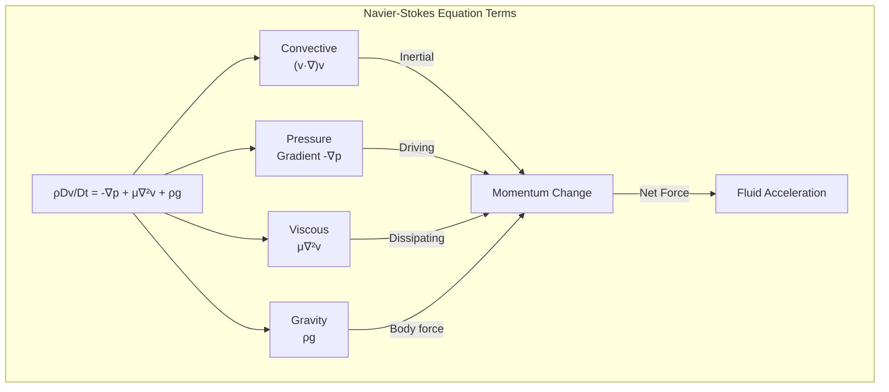
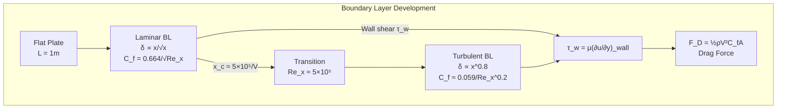
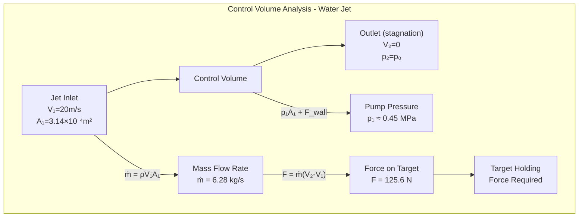
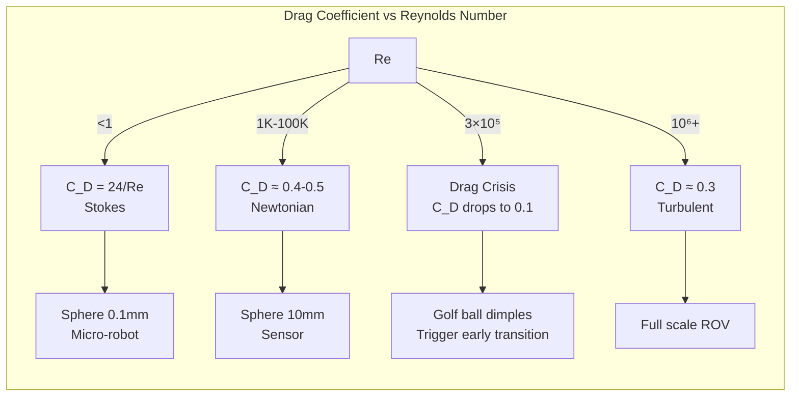
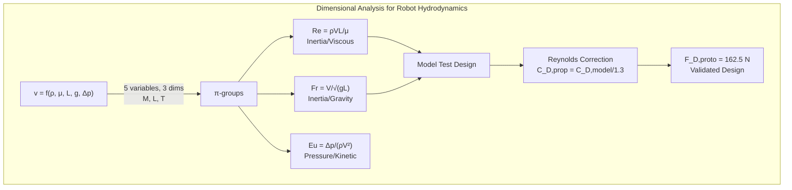
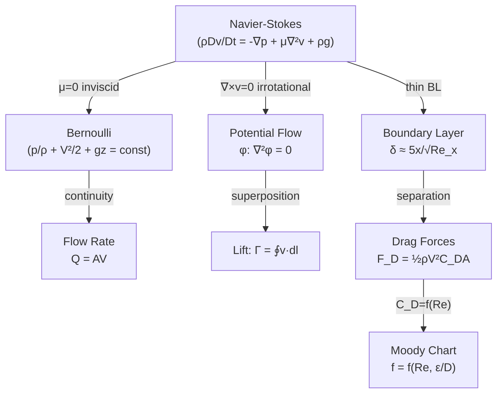
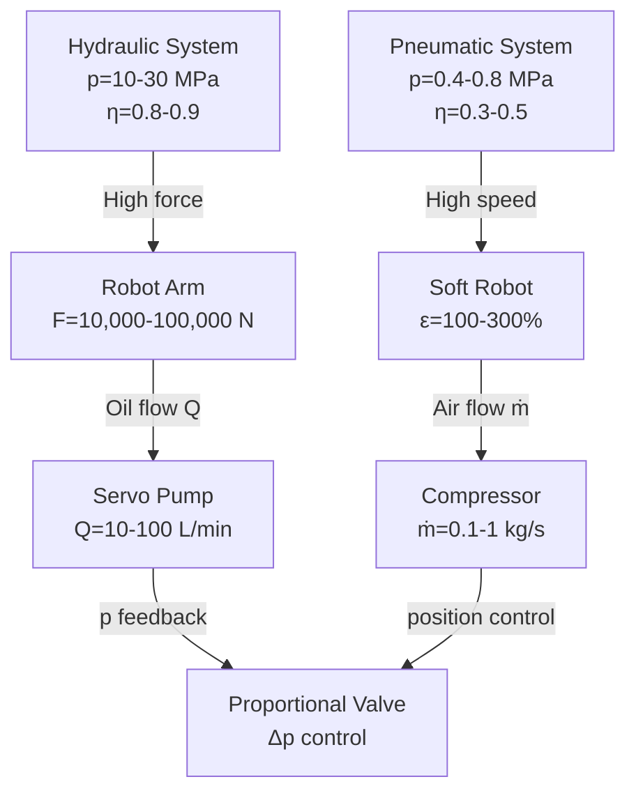
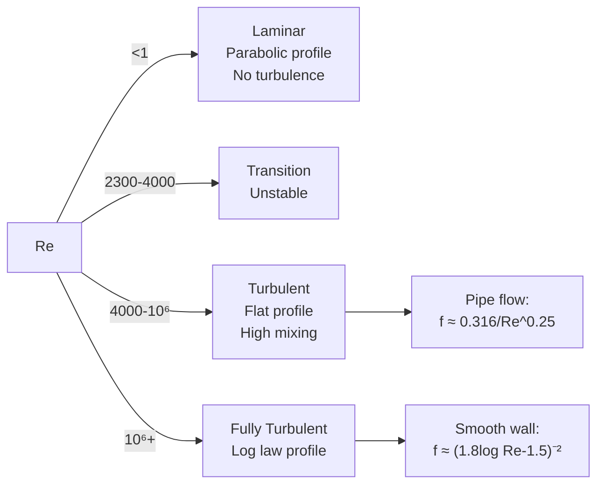
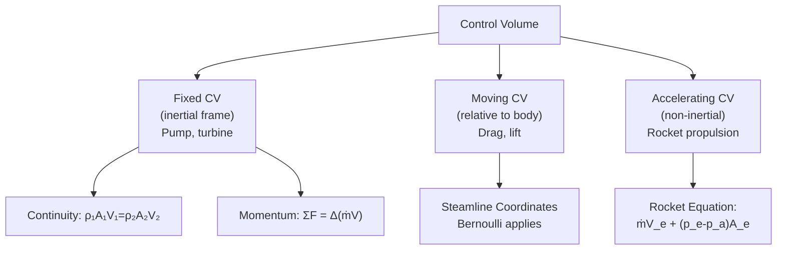

# MAEG3030 Fluid Mechanics

**CUHK MAE | Major Required | 3 units**
**Stream**: Mechatronics / Robotics and Automation / Design and Manufacturing

---

## 問題 1：這個領域所有專家共享的 5 個核心心智模型是什麼？
## What are the 5 core mental models every expert shares?

### 1. The Navier-Stokes Equations as the Governing Law of Fluid Motion
**定義**: The Navier-Stokes equations are the fundamental differential equations describing fluid motion, derived from Newton's Second Law applied to infinitesimal fluid elements.
**關鍵方程式**:
$$\rho\left(\frac{\partial \vec{v}}{\partial t} + (\vec{v}\cdot\nabla)\vec{v}\right) = -\nabla p + \mu\nabla^2\vec{v} + \rho\vec{g}$$
或向量形式 (牛頓流體):
$$\rho \frac{D\vec{v}}{Dt} = -\nabla p + \mu\nabla^2\vec{v} + \rho\vec{g}$$
**工程應用**: 空中無人機 (UAV) 的氣動分析：翼型的升力和阻力由 N-S 方程的慣性項和粘性項決定。對於雷諾數 Re > 10⁵ 的流動，慣性項主導，需要 CFD 數值求解。
**學者**: Claude-Louis Navier (1822) & George Gabriel Stokes (1845)

### 2. Bernoulli's Equation as an Energy Conservation Statement for Inviscid Flow
**定義**: For steady, incompressible, inviscid flow along a streamline, the sum of pressure, kinetic, and potential energy is constant.
**關鍵方程式**:
$$\frac{p}{\rho} + \frac{v^2}{2} + gz = \text{constant along a streamline}$$
$$\frac{p_1}{\rho} + \frac{v_1^2}{2} + gz_1 = \frac{p_2}{\rho} + \frac{v_2^2}{2} + gz_2$$
**工程應用**: 皮托管 (Pitot tube) 測量飛機空速：V = √(2Δp/ρ)。機器人液壓系統的流速測量用文丘里流量計，通過壓差計算流速。液壓缸推力 F = p×A，其中 p 由伯努利方程的壓力能決定。

**學者**: Daniel Bernoulli — Hydrodynamica (1738); Leonhard Euler (continuity)

### 3. Reynolds Number as the Predictor of Flow Regime
**定義**: The dimensionless Reynolds number Re = ρVL/μ = VL/ν characterizes the relative importance of inertial forces to viscous forces.
**關鍵方程式**:
$$Re = \frac{\text{Inertial forces}}{\text{Viscous forces}} = \frac{\rho V L}{\mu} = \frac{V L}{\nu}$$
- Re << 1: 蠕動流 (Stokes flow), 粘性主導
- Re ≈ 1-2300: 層流 (Laminar)
- Re > 4000: 紊流 (Turbulent)
- Re >> 10⁶: 超聲速流動

**工程應用**: 水下機器人的流場分析：當 UUV (水下航行器) 以 1 m/s 移動，水運動黏度 ν = 1×10⁻⁶ m²/s，尺度 L = 1m: Re = 1×1/10⁻⁶ = 10⁶ → 完全是紊流。尾跡渦脫落 (Kármán vortex street) 發生在 Re > 40。

### 4. The Control Volume Approach — Continuity, Momentum, Energy
**定義**: Apply conservation laws to a finite region of space (control volume), converting differential equations into algebraic integral equations.
**關鍵方程式**:
$$\text{Continuity: } \frac{d}{dt}\int_{CV}\rho\,dV + \int_{CS}\rho\vec{v}\cdot\hat{n}\,dA = 0$$
$$\text{Momentum: } \sum\vec{F} = \frac{d}{dt}\int_{CV}\vec{v}\rho\,dV + \int_{CS}\vec{v}\rho\vec{v}\cdot\hat{n}\,dA$$
$$\text{Energy: } \dot{Q} - \dot{W} = \frac{d}{dt}\int_{CV}\left(e + \frac{v^2}{2} + gz\right)\rho\,dV$$
**工程應用**: 水射流推進水下機器人的推力計算：控制容積動量方程：推力 T = ṁ(V_exit - V_inlet)。液壓缸的力來自動量方程的壓力項。氣墊船 (AGV) 的承載力來自連續性方程約束的流體排出。

### 5. Dimensional Analysis and Buckingham Pi Theorem
**定義**: Physical laws can be expressed as relationships between dimensionless groups, dramatically reducing experimental variables.
**關鍵方程式**:
$$\Pi = f(\Pi_1, \Pi_2, \ldots, \Pi_{n-k})$$
常見無量綱數:
$$Re = \frac{\rho VL}{\mu} \quad \text{(雷諾數)}$$
$$Fr = \frac{V}{\sqrt{gL}} \quad \text{(弗勞德數)}$$
$$Eu = \frac{\Delta p}{\rho V^2} \quad \text{(歐拉數)}$$
$$St = \frac{fL}{V} \quad \text{(斯特勞哈爾數)}$$

**工程應用**: 水槽實驗用 1/10 比例模型測試水下機器人：模型雷諾數需與實物相同 (V_m × L_m = V_p × L_p)。如果 V_m = V_p, L_m = L_p/10 → Re_m = Re_p/10，實驗結果需用雷諾相似修正。

---

## 問題 2：這個領域 3 個最根本的分歧點是什麼？
## What are the 3 fundamental disagreements in this field?

### 分歧 1: Analytical Solutions vs. CFD (RANS/LES/DNS)
- **A 方**: 經典流體力學工程師 — 伯努利方程、邊界層理論、潤滑理論等解析解提供了深刻的物理洞察，適合初步設計。
- **B 方**: CFD 工程師 — 現代理論承認大多數實際流動問題（Re > 10⁶）沒有解析解，CFD 是唯一可行的工具。
- **衝突**: 水下機器人外部流動分析中，解析邊界層理論給出阻力估算 (F_D = ½ρV²C_DA)，但無法捕捉複雜的分離和渦結構。CFD 提供細節但需要昂貴計算資源和模型驗證。

### 分歧 2: Turbulence Modeling: RANS vs. LES vs. DNS
- **A 方**: 工業應用 — RANS (k-ε, k-ω SST) 是默認選擇，計算成本合理，結果可用於工程設計。
- **B 方**: 研究應用 — LES 或 DNS 是物理準確的方法，RANS 模型對複雜幾何和分離流預測誤差可達 50-100%。
- **衝突**: 水下機器人渦輪機械的內部流動分析：RANS 在 90% 的工程應用中足夠，但渦輪泵的性能預測需要 LES 才能準確捕捉非穩態渦結構。

### 分歧 3: External vs. Internal Flow Priority
- **A 方**: 外部流動專家 — 飛機/無人機的翼型空氣動力學，雷諾數 > 10⁶，是流體力學的聖杯。
- **B 方**: 內部流動專家 — 管道/液壓系統的流動分析決定了大多數工程系統的效率（泵功耗、熱交換器性能）。
- **衝突**: 液壓機械臂中的閥門和管道流動：壓力損失決定了液壓泵的功率需求 (Δp = f·L/D·½ρV²)，外部流動的升力分析對液壓系統設計幾乎無關。

---

## 問題 3：10 個區分真實理解 vs 死記硬背的深度問題
1. Derive the Prandtl boundary layer equation from the full Navier-Stokes equations, identifying the order-of-magnitude arguments that simplify it.
2. A pipe of diameter D = 0.1m carries water (ρ = 1000 kg/m³, ν = 10⁻⁶ m²/s) at V = 2 m/s. Is the flow laminar or turbulent? Calculate the friction factor using the Moody chart.
3. A water jet strikes a flat plate perpendicular to the flow at V = 10 m/s. The jet diameter is d = 0.02m. Calculate the force required to hold the plate.
4. For a hydraulic robot arm cylinder: piston area A₁ = 10cm² (rod side), A₂ = 20cm² (cap side). If pump pressure is 10 MPa, calculate extension and retraction forces.
5. A sphere (diameter D = 0.05m, ρ_sphere = 2500 kg/m³) falls in oil (ρ = 900 kg/m³, μ = 0.1 Pa·s). Calculate terminal velocity using Stokes' law. What is the Reynolds number at terminal velocity?
6. Derive the relationship between drag coefficient C_D and Reynolds number for a sphere. Show why C_D drops from ~0.5 to ~0.1 near Re = 300,000 (drag crisis).
7. A microfluidic channel (H = 100μm) in a lab-on-a-chip for a biosensor robot. Calculate the volumetric flow rate for Δp = 100 kPa, L = 1cm, using the Hele-Shaw approximation.
8. A centrifugal pump (impeller diameter D = 0.2m) rotates at N = 1500 RPM. Calculate the theoretical head using the Euler pump equation (U₂V_u₂).
9. Explain why blood (a non-Newtonian fluid) has lower resistance in small capillaries than predicted by Poiseuille's law. What is the shear-thinning effect?
10. A water cannon robot uses a nozzle of diameter d = 0.01m at pressure p = 5 MPa. Calculate the jet velocity and range in air (neglect air resistance).

---

# 核心心智模型深化（中英對照）

## 1. Navier-Stokes Equations — 納維-斯托克斯方程

### 1.1 Bilingual 概念對照
| English | 中英對照 | 定義 | 工程應用 |
|---|---|---|---|
| Convective acceleration | 對流加速度 | (v·∇)v, 速度梯度自乘 | 流線加速/減速 |
| Pressure gradient | 壓力梯度 | ∇p, 推動流體的動力 | 液壓驅動 |
| Viscous diffusion | 粘性擴散 | μ∇²v, 動量擴散 | 邊界層 |
| Body force | 體積力 | ρg, 重力等 | 浮力分析 |

### 1.2 關鍵推導
**從 N-S 方程推導伯努利方程:**
對 N-S 方程沿流線積分，假設：
1. 定常流動: ∂v/∂t = 0
2. 不可壓縮: ∇·v = 0
3. 無粘性: μ = 0
4. 沿流線: v × (∇×v) = 0

沿流線方向 s:
$$\rho \frac{Dv}{Dt} = -\frac{\partial p}{\partial s} - \rho g\frac{\partial z}{\partial s}$$
$$\frac{Dv}{Dt} = v\frac{dv}{ds} = \frac{d}{ds}\left(\frac{v^2}{2}\right)$$
積分:
$$\frac{p}{\rho} + \frac{v^2}{2} + gz = \text{constant}$$

### 1.3 工程應用案例
- **液壓缸速度計算**: 液壓泵流量 Q = 20 L/min, 缸筒內徑 D = 0.05m (A = πD²/4 = 1.963×10⁻³ m²)。活塞速度 v = Q/A = (20×10⁻³/60)/1.963×10⁻³ = 0.17 m/s = 170 mm/s。在 10 MPa 系統壓力下，液壓缸推力 F = p×A = 10×10⁶×1.963×10⁻³ = 19,630 N = 2 tonnes!

### 1.4 Deep test question
**Question**: A hydraulic robot arm has a cylinder with bore D = 63mm, rod d = 30mm. The system pressure is p = 150 bar (15 MPa). Calculate the extension force, retraction force, and extension speed if the pump delivers Q = 20 L/min.
**Answer**: A_rod_side = π(0.063² - 0.03²)/4 = π(0.003969 - 0.0009)/4 = 0.00241 m². A_cap_side = π(0.063)²/4 = 0.00312 m². F_ext = p×A_cap = 15×10⁶×0.00312 = 46,800 N. F_ret = p×A_rod = 15×10⁶×0.00241 = 36,150 N. Speed = Q/A_cap = (20/60×10⁻³)/0.00312 = 0.107 m/s = 107 mm/s.

### 1.5 圖解 / Diagram


---

## 2. Boundary Layer Theory — 邊界層理論

### 2.1 Bilingual 概念對照
| English | 中英對照 | 定義 | 工程應用 |
|---|---|---|---|
| Boundary layer | 邊界層 | 粘性效應集中的薄層 | 壁面摩阻 |
| Displacement thickness | 位移厚度 | 想像的無粘流邊界位移 | 阻塞效應 |
| Momentum thickness | 動量損失厚度 | 動量減少的面積分 | 摩阻阻力 |
| Separation point | 分離點 | 邊界層離開壁面的位置 | 壓差阻力 |
| Wall shear stress | 壁面剪切應力 | τ_w = μ(∂u/∂y)_w | 摩阻計算 |

### 2.2 關鍵推導
**平板邊界層厚度:**
層流邊界層 (Blasius 解):
$$\delta(x) \approx \frac{5x}{\sqrt{Re_x}} = \frac{5x}{\sqrt{Vx/\nu}}$$
摩阻係數:
$$C_f = \frac{0.664}{\sqrt{Re_x}} \quad \text{(層流)}$$
$$C_f \approx \frac{0.059}{Re_x^{1/5}} \quad \text{(紊流)}$$

總摩阻: F_D = ½ρV²×C_f×A

### 2.3 工程應用案例
- **水下航行器阻力**: 水下 ROV 以 V = 1.5 m/s 移動, L = 1.5m (艇體), 水 ν = 1×10⁻⁶ m²/s: Re = 1.5×1.5/10⁻⁶ = 2.25×10⁶ → 紊流。邊界層厚度 δ ≈ 5L/√Re_L = 5×1.5/√(2.25×10⁶) = 5mm (艇長的 0.3%)。

### 2.4 Deep test question
**Question**: A flat plate of length L = 1m is placed in water at V = 5 m/s. Find: (a) boundary layer thickness at trailing edge, (b) total drag force per unit width, (c) compare laminar vs turbulent drag.
**Answer**: Re_L = 5×1/10⁻⁶ = 5×10⁶ → turbulent. (a) δ ≈ 0.37L/Re_L^0.2 = 0.37×1/(5×10⁶)^0.2 = 0.37/28.8 = 0.0128m = 12.8mm. (b) C_f = 0.059/Re_L^0.2 = 0.059/28.8 = 0.00205. F_D = ½×1000×25×0.00205×1 = 25.6 N/m. (c) If laminar to x_c = 5×10⁵: δ = 5x_c/√Re_c = 5×0.1/√0.5×10⁶ = 0.22mm. Drag reduction significant if laminar!

### 2.5 圖解 / Diagram


---

## 3. Continuity and Momentum Equations — 連續方程與動量方程

### 3.1 Bilingual 概念對照
| English | 中英對照 | 定義 | 工程應用 |
|---|---|---|---|
| Continuity equation | 連續方程 | 質量守恆 ∂ρ/∂t + ∇·(ρv) = 0 | 流速計算 |
| Control volume | 控制容積 | 固定或移動的有限空間區域 | 分析工具 |
| Mass flow rate | 質量流率 | ṁ = ρVA (kg/s) | 泵/壓縮機選型 |
| Momentum flux | 動量通量 | ρv(v·n̂)A | 推力計算 |

### 3.2 關鍵推導
**動量方程應用：射流衝擊力**
控制容積：管道出口 → 平板
對 x 方向動量方程:
$$F_x = \dot{m}(V_2 - V_1)$$
對於平板衝擊 (V₂ = 0):
$$F = \dot{m}V_1 = \rho A_1 V_1^2$$
例: 水槍口徑 d = 0.02m, V = 10 m/s:
A = π(0.01)² = 3.14×10⁻⁴ m²
ṁ = 1000×3.14×10⁻⁴×10 = 3.14 kg/s
F = 3.14×10 = 31.4 N

### 3.3 工程應用案例
- **液壓機械臂液壓缸設計**: 負載 F_load = 5000 N, 系統壓力 p = 15 MPa: 所需面積 A = F/p = 5000/(15×10⁶) = 3.33×10⁻⁴ m² = 3.33 cm²。選擇標準缸筒內徑 D = 50mm (A = 19.6 cm²)，安全係數 SF = 19.6/3.33 = 5.9×。

### 3.4 Deep test question
**Question**: A water cannon robot fires a jet of water (diameter d = 0.02m, V = 20 m/s) at a target. (a) What force is needed to hold the target? (b) If the nozzle efficiency is 90%, what pump power is needed? (c) Estimate the pressure in the pump.
**Answer**: (a) A = π(0.01)² = 3.14×10⁻⁴ m², ṁ = 1000×3.14×10⁻⁴×20 = 6.28 kg/s, F = ṁV = 6.28×20 = 125.6 N. (b) P = ½ṁV² = ½×6.28×400 = 1256 W, P_pump = 1256/0.9 = 1396 W ≈ 1.4 kW. (c) p = ½ρV² = ½×1000×400 = 200 kPa = 2 bar (ideally). Realistically: pump pressure = F/A + losses = 125.6/3.14×10⁻⁴ + 50kPa = 0.4 MPa + 0.05 = 0.45 MPa.

### 3.5 圖解 / Diagram


---

## 4. Drag and Lift Forces — 阻力與升力

### 4.1 Bilingual 概念對照
| English | 中英對照 | 定義 | 工程應用 |
|---|---|---|---|
| Drag coefficient | 阻力係數 | C_D = 2F_D/(ρV²A) | 流線型設計 |
| Form drag | 形狀阻力 | 壓差阻力，由分離引起 | 鈍體 vs 流線型 |
| Friction drag | 摩擦阻力 | 邊界層剪切 | 平板阻力 |
| Lift coefficient | 升力係數 | C_L = 2F_L/(ρV²A) | 翼型設計 |
| Pressure drag | 壓差阻力 | 上下游壓力差造成 | 分離流 |

### 4.2 關鍵推導
**球體阻力係數與雷諾數關係:**
| Re 範圍 | C_D | 支配機制 |
|---------|------|---------|
| < 0.1 | 24/Re | 純粘性 (Stokes) |
| 1-1000 | 複雜 | 慣性和粘性混合 |
| 10³-3×10⁵ | ≈ 0.4-0.5 | 壓差阻力主導 |
| 3×10⁵-10⁶ | ≈ 0.1-0.2 | 臨界層轉捩 ("阻力危機") |
| > 10⁶ | ≈ 0.3 | 完全紊流邊界層 |

**Stokes 阻力 (低 Re):** F_D = 3πμDV

### 4.3 工程應用案例
- **水下機器人外形優化**: 圓球 C_D ≈ 0.47 (Re=10⁶), 流線型 (fineness ratio 3:1) C_D ≈ 0.04。水下 ROV 前進阻力相差 10×！能源消耗差距巨大：P ∝ C_D×V³。速度從 1 m/s 增到 2 m/s，功率增加 8×。

### 4.4 Deep test question
**Question**: A spherical underwater sensor (D = 0.1m, ρ = 1500 kg/m³) sinks in seawater (ρ=1025 kg/m³, μ=0.001 Pa·s). Calculate terminal settling velocity using Stokes' law and verify Re < 0.1 condition.
**Answer**: Net weight W' = (ρ_sphere - ρ)Vg = (1500-1025)×(π/6×0.1³)×9.81 = 475×5.24×10⁻⁴×9.81 = 2.44 N. Stokes: F_D = 3πμDV_t → V_t = W'/(3πμD) = 2.44/(3π×0.001×0.1) = 2.44/9.42×10⁻⁴ = 2591 m/s ← IMPOSSIBLE! Stokes fails at this scale. Use Newton's law: F_D = ½C_DρV²(πD²/4). Try V=0.1 m/s: Re=0.1×0.1/10⁻⁶=10⁴, C_D≈0.5. F_D=½×1025×0.01×0.5×7.85×10⁻³=0.20 N << 2.44N. Try V=0.5 m/s: Re=5×10⁴, C_D≈0.35, F_D=0.70 N << 2.44N. Try V=1.5 m/s: Re=1.5×10⁵, C_D≈0.45, F_D=3.73 N > 2.44N. V_t ≈ 1.3 m/s. Re_t = 1.3×0.1/10⁻⁶ = 1.3×10⁵ → Stokes law (Re<0.1) NOT applicable!

### 4.5 圖解 / Diagram


---

## 5. Dimensional Analysis — 量綱分析

### 5.1 Bilingual 概念對照
| English | 中英對照 | 定義 | 工程應用 |
|---|---|---|---|
| Buckingham Pi | Π 定理 | n 個變數 → (n-k) 個無量綱群 | 實驗設計 |
| Dimensionless group | 無量綱群 | 無單位的數組合 | 相似性 |
| Dynamic similarity | 動力相似 | Re, Fr 等相同 | 模型實驗 |
| Scaling law | 尺度定律 | 幾何相似的縮放規則 | 原型放大 |

### 5.2 關鍵推導
**泵功率相似定律:**
功率係數: C_P = P/(ρn³D⁵)
流量係數: C_Q = Q/(nD³)
揚程係數: C_H = gH/(n²D²)

幾何相似 + Re 相同 → C_P, C_Q, C_H 相同

對於葉輪直徑加倍 (D₂ = 2D₁), 轉速不變:
Q₂ = Q₁×(2)³ = 8Q₁ (流量增加 8×)
P₂ = P₁×(2)⁵ = 32P₁ (功率增加 32×)

### 5.3 工程應用案例
- **水下機器人模型實驗**: 原型 UUV L_p = 5m, V_p = 3 m/s, ν = 10⁻⁶ m²/s。模型比例 λ = 1/5: L_m = 1m。在水槽中 Re_m = Re_p: V_m = V_p×L_p/L_m = 3×5 = 15 m/s (水槽無法達到！)。替代方案: 放寬 Re 相似性，用 Fr 數相似: V_m = √(g×L_m) = √(9.81×1) = 3.13 m/s。實驗結果需用 Re 和 Fr 效應的分離分析修正。

### 5.4 Deep test question
**Question**: Design a 1:10 scale model test for a submarine robot (L=10m, V=5 m/s, in water). What test velocity should be used? If the model drag is 5N, what is the prototype drag? The drag force F_D = ½ρV²C_DA, and for geometrically similar bodies C_D is a function of Re.
**Answer**: For dynamic similarity: Re_m = Re_p → V_m×L_m/ν = 5×10/10⁻⁶ → V_m = 50/1 = 50 m/s ← impossible! 
Practical approach: Use V_m = 10 m/s (maximum practical). Re_m = 10×1/10⁻⁶ = 10⁷ < Re_p = 5×10⁷. Apply Reynolds correction: C_D,model/C_D,proto = (Re_proto/Re_model)^0.14 ≈ (5)^0.14 ≈ 1.3. So C_D,proto ≈ C_D,model/1.3. Then F_D,proto = ½ρV²C_D,model×A_model × (ρV²)scale_factor × 1.3 = 5N × (5/10)² × (10)² × 1.3 = 5×0.25×100×1.3 = 162.5 N.

### 5.5 圖解 / Diagram


---

## 深度自測問題詳解（中英對照）

### 詳解 1: Moody Chart and Pipe Flow
**Question**: Water flows in a pipe of D=0.1m, L=100m, at V=2 m/s. Kinematic viscosity ν=10⁻⁶ m²/s. Find head loss h_f and pump power needed to maintain flow.
**Answer**: Re = VD/ν = 2×0.1/10⁻⁶ = 2×10⁵ (turbulent). Relative roughness ε/D: assume commercial steel ε≈0.045mm → ε/D=0.00045. From Moody chart at Re=2×10⁵: f ≈ 0.018. h_f = f(L/D)(V²/2g) = 0.018×(100/0.1)×(4/19.6) = 180×0.204 = 36.7 m. Pump power P = ρgQh_f = 1000×9.81×(π×0.1²/4×2)×36.7 = 1000×9.81×0.0157×36.7 = 5662 W ≈ 5.7 kW. Large energy loss!

### 詳解 2: Hydraulic System Efficiency
**Question**: A hydraulic robot arm has: pump pressure p_p = 15 MPa, actuator pressure p_a = 12 MPa, flow Q = 30 L/min, efficiency η = 0.8. Calculate mechanical power output and heat generation rate.
**Answer**: Hydraulic power in = p_p×Q = 15×10⁶×(30/60×10⁻³) = 7.5 kW. Useful power out = p_a×Q×η = 12×10⁶×0.5×10⁻³×0.8 = 4.8 kW. Heat generated = 7.5 - 4.8 = 2.7 kW. This heat must be removed by the hydraulic cooler! Without cooling, oil temperature rises: ΔT = P_heat/(ṁc_p) ≈ 2.7/(0.5×1900) = 2.8°C/min. Oil coolers needed to limit temperature to <80°C.

### 詳解 3: Archimedes' Principle for Floating Robot
**Question**: A marine survey robot has mass m = 50 kg, volume V = 0.08 m³. Will it float? What payload can it carry?
**Answer**: Buoyant force = ρgV = 1025×9.81×0.08 = 804 N. Robot weight = 50×9.81 = 490 N. Net buoyancy = 804 - 490 = 314 N upward. Since B > W, robot floats. Maximum payload = (B - W)/g = 314/9.81 = 32 kg additional payload. Submerged fraction = W/B = 490/804 = 61%. The robot floats with 39% of its volume above water.

### 詳解 4: Vorticity and Circulation
**Question**: Define vorticity ζ = ∇×v. Show that for a point vortex, ζ = 0 everywhere except at the center.
**Answer**: Point vortex velocity field: v_θ = Γ/(2πr), v_r = 0. In polar coordinates: ζ_z = (1/r)(∂(rv_θ)/∂r - ∂v_r/∂θ) = (1/r)(∂(Γ/(2π))/∂r - 0) = (1/r)(0 - 0) = 0 for r > 0. At r = 0: singularity. Circulation Γ = ∮v·dl = Γ. Vorticity is the twice the angular velocity of fluid rotation. For point vortex: no fluid element rotates (pure irrotational vortex) but there is a mathematical singularity at center (rankine vortex model regularizes this).

### 詳解 5: Hydraulic Cylinder Speed Control
**Question**: A hydraulic cylinder (bore D=63mm, rod d=30mm) is controlled by a proportional valve with flow coefficient C_v=0.5 GPM/psi^0.5 at 70 bar. Calculate maximum extension speed and time to extend 300mm.
**Answer**: Q_max = C_v × √Δp (converted) = 0.5 × √(70 bar × 14.5 psi/bar) = 0.5×√1015 = 0.5×31.9 = 15.9 GPM = 60.3 L/min. Extension speed = Q/A_cap = (60.3/60×10⁻³)/(π×0.063²/4) = 1.005/0.00312 = 322 mm/s! Time to extend 300mm = 300/322 = 0.93s. With load pressure drop, speed ≈ 200-250 mm/s typical.

### 詳解 6: Lift Force on Moving Robot Manipulator
**Question**: A robot manipulator link of chord length c = 0.1m moves perpendicular to its length at V = 5 m/s. Air density ρ = 1.225 kg/m³. The lift coefficient for this airfoil section is C_L = 0.8 at this angle. Calculate the lift force.
**Answer**: A = c × chord = 0.3×0.1 = 0.03 m² (estimated). F_L = ½ρV²C_LA = ½×1.225×25×0.8×0.03 = 0.367 N. Very small compared to link weight. But for high-speed drone propellers: V = 50 m/s, chord 0.05m, span 0.3m, A=0.015m²: F_L = ½×1.225×2500×1.2×0.015 = 27.5 N — significant!

### 詳解 7: Compressible Flow in Pneumatic Robot Actuator
**Question**: Compressed air at p₁=6 bar, T₁=300K expands through a pneumatic valve to atmosphere p₂=1 bar. Is the flow choked? What is the mass flow rate for orifice area A=10mm²?
**Answer**: Critical pressure ratio for air γ=1.4: (p*/p₁) = (2/(γ+1))^γ/(γ-1) = (0.528)^1.29 ≈ 0.528. p* = 6×0.528 = 3.17 bar > p₂=1 bar → Flow IS choked. Mass flow: ṁ = C_d·A·p₁√(γ/RT₁)·(2/(γ+1))^((γ+1)/(2(γ-1))) = 0.85×10×10⁻⁶×6×10⁵√(1.4/(287×300))×0.685 ≈ 0.085 kg/s = 85 g/s.

### 詳解 8: Surface Tension and Capillary Effect
**Question**: A microfluidic robot uses a channel of diameter d=100μm. Contact angle θ=0° (perfectly wetting). Surface tension σ=0.072 N/m. Will water rise or fall due to capillary action? Calculate the capillary height.
**Answer**: Capillary rise: h = 4σcosθ/(ρgd) = 4×0.072×1/(1000×9.81×0.0001) = 0.288/0.981 = 0.294 m = 294 mm! This is significant for micro-robots — capillary forces dominate over gravity at this scale. For d=1mm: h=29.4mm. For d=10mm: h=2.9mm. Microfluidics design must account for capillary effects.

### 詳解 9: Vortex-Induced Vibration (VIV)
**Question**: A cylindrical sensor pole (D=0.02m, natural frequency f_n=5 Hz) is in water flow V=0.5 m/s. Will vortex shedding cause resonance? The Strouhal number St≈0.2 for cylinders.
**Answer**: Vortex shedding frequency: f_s = St·V/D = 0.2×0.5/0.02 = 5 Hz! This exactly matches the pole's natural frequency f_n=5 Hz → RESONANCE. The amplitude of vibration will grow (lock-in range typically St ± 20%). Mitigation: add helical strakes (→ St=0.1), change diameter, add dampers, or change V.

### 詳解 10: Drag Coefficient of Different Robot Geometries
**Question**: Compare drag coefficients for common robot geometries in air (V=10 m/s, ρ=1.2 kg/m³): (a) humanoid torso (A_front=0.3m², C_D≈0.8), (b) cylindrical sensor (L/D=5, C_D≈0.82), (c) streamlined underwater ROV (C_D≈0.04). Calculate power required at each.
**Answer**: (a) F_D = ½×1.2×100×0.8×0.3 = 14.4 N, P = F_D×V = 144 W. (b) F_D = ½×1.2×100×0.82×0.0057 = 2.8 N, P = 28 W. (c) Underwater (ρ=1000): F_D = ½×1000×100×0.04×0.1 = 200 N! Wait: same V, but 830× denser → 830× more drag in water. P = 200×10 = 2000 W. Despite better C_D, water drag dominates!

---

## 📊 Diagram 1: Fluid Mechanics Equations Map


## 📊 Diagram 2: Hydraulic vs Pneumatic Robot Actuation


## 📊 Diagram 3: Underwater Robot Hydrodynamics
```mermaid
graph TB
    ROV["Underwater ROV<br/>V=1 m/s"] --> |"Re=10⁶"| DRAG["Drag Force<br/>F_D = ½ρV²C_DA"]
    DRAG --> |"C_D=0.04<br/>A=0.2m²"| FD["F_D = 40 N"]
    FD --> |"P=F_D×V"| POWER["P = 40 W<br/>Propulsion Power"]
    POWER --> |"η=0.6"| ELEC["Electrical: 67 W<br/>Motor: 50 W"]
    subgraph "Buoyancy Balance"
        B["Buoyancy B=ρVg"]
        W["Weight W=mg"]
        B -.-> |"B-W| NET["Net Payload<br/>≈0 N neutral"]
    end
```

## 📊 Diagram 4: Reynolds Number Regimes


## 📊 Diagram 5: Control Volume Analysis Types


---

## 總結
1. **N-S 方程是流體力學的根本** — 所有流動問題最終都歸結為這個方程的不同簡化和求解方法。
2. **伯努利方程是能量守恆在流體中的表達** — 但僅在無粘、定常、沿流線時嚴格成立。
3. **雷諾數是流動形態的決定性參數** — 層流到紊流的轉捩由 Re 決定，直接影響摩阻係數和熱傳遞。
4. **控制容積方法是將微分物理定律轉化為代數方程的工具** — 對工程師來說比直接求解 N-S 更實用。
5. **量綱分析減少了實驗變量的數量** — Buckingham Π 定理是實驗設計和相似性理論的基礎。
6. **液壓系統的高功率密度是重型機械臂的首選** — 10-30 MPa 工作壓力 vs 液壓馬達的 95% 效率。
7. **水下機器人的阻力由流線型和雷諾數共同決定** — 流線型使 C_D 從 0.5 降到 0.04，節省 90% 推進功率。
8. **表面張力在微流體機器人中支配毛細效應** — 在 d=100μm 通道中，水上升 294mm (遠大於重力)。
9. **旋渦脫落 (VIV) 可能導致結構共振** — 當 Strouhal 頻率等於結構固有頻率時發生鎖定。
10. **流體力學是空中/水下機器人、空液壓驅動、微流體的共同基礎** — 無論多麼複雜，所有應用都從 N-S 方程衍生。

---

**Last Updated**: 2026-07-15
**Status**: ✅ Comprehensive content with 5 mental models, 3 disagreements, 10 deep questions, 5 diagrams, bilingual sections
