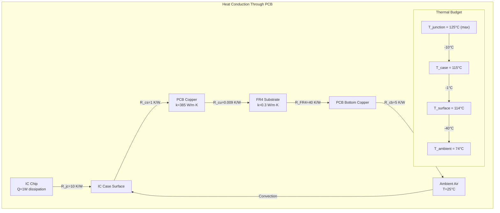
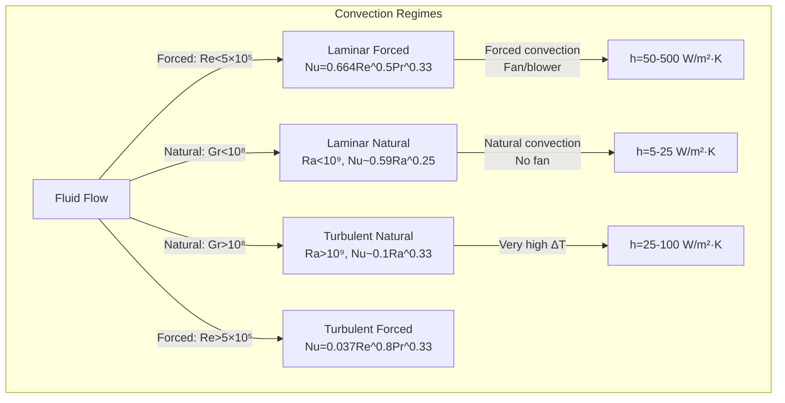
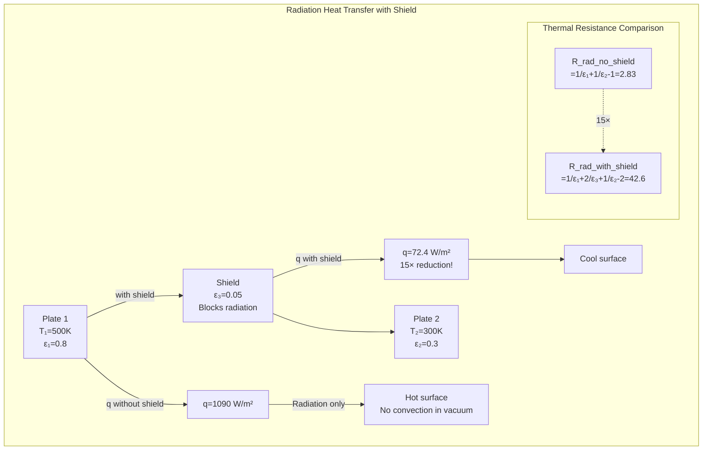
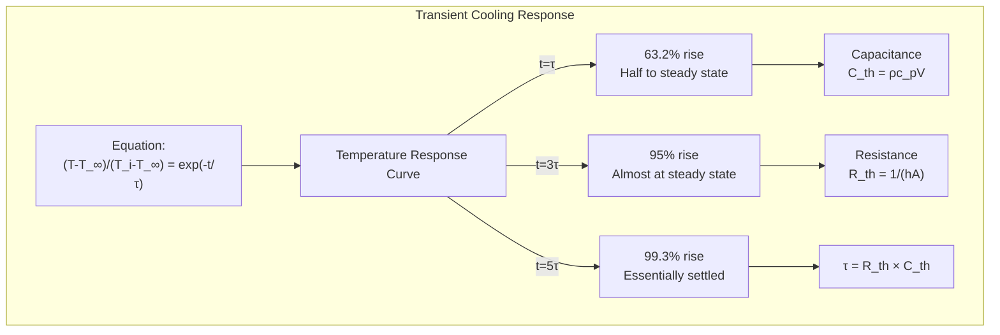
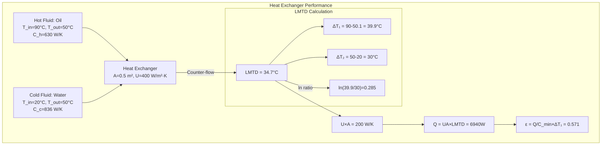
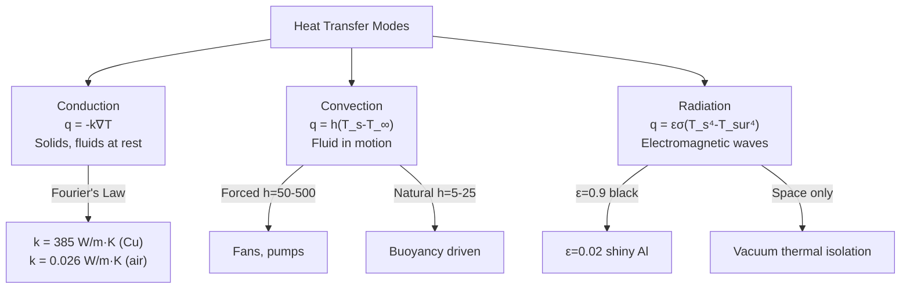
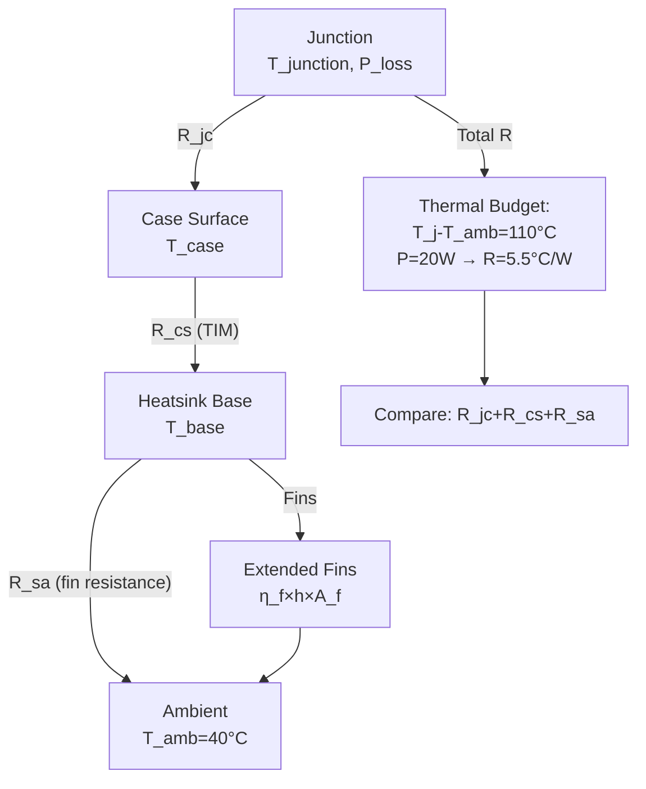
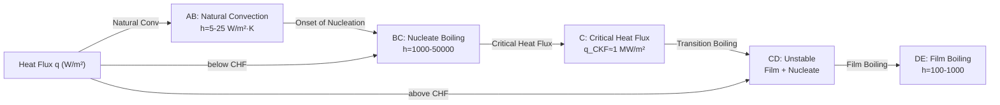
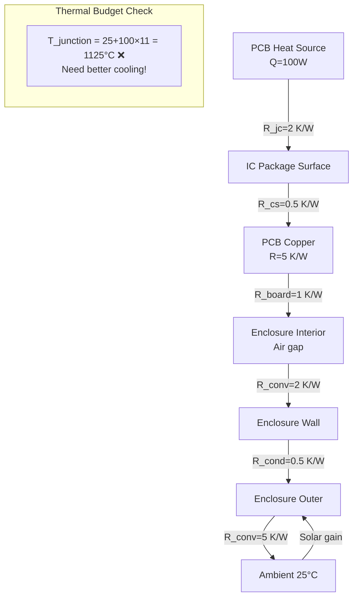
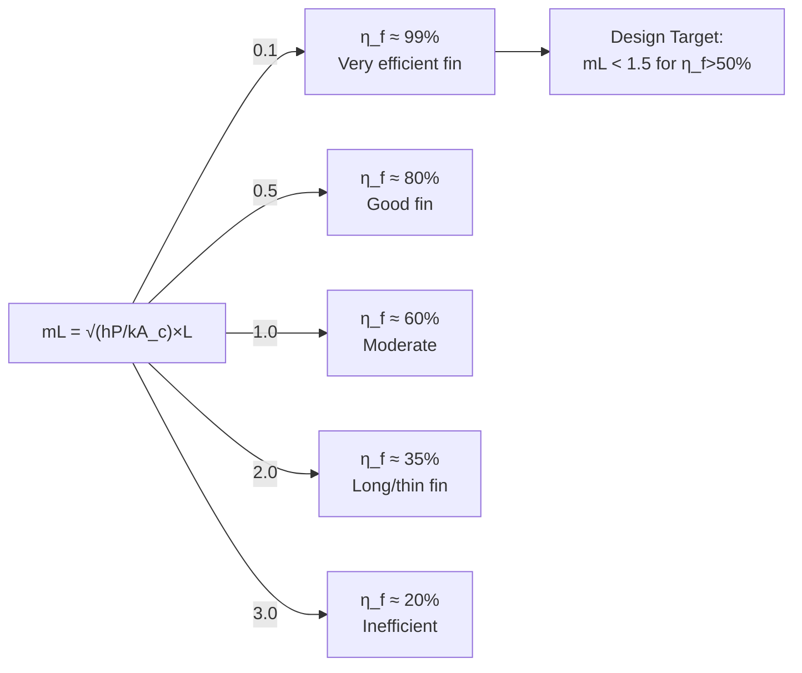

# MAEG4030 Heat Transfer

**CUHK MAE | Major Required | 3 units**
**Stream**: Mechatronics / Robotics and Automation / Design and Manufacturing

---

## 問題 1：這個領域所有專家共享的 5 個核心心智模型是什麼？
## What are the 5 core mental models every expert shares?

### 1. The Three Modes of Heat Transfer — Conduction, Convection, Radiation
**定義**: Heat transfer occurs through three distinct mechanisms: conduction (molecular contact), convection (fluid motion), and radiation (electromagnetic waves). Each has its own governing law and rate equation.
**關鍵方程式**:
$$q = -k \frac{dT}{dx} \quad \text{(Fourier's Law, Conduction)}$$
$$q = h(T_s - T_\infty) \quad \text {(Newton's Law of Cooling, Convection)}$$
$$q = \epsilon\sigma(T_s^4 - T_{sur}^4) \quad \text {(Stefan-Boltzmann Law, Radiation)}$$
**工程應用**: 機器人馬達散熱：馬達損耗功率 P_loss = I²R = 5²×2 = 50W (假設 I=5A, R=2Ω)。使用散熱片時：散熱片熱阻 R_th = (T_junction - T_ambient)/(P_loss × R_θJC × R_θCS × R_θSA)。選擇散熱片需要計算總熱阻網絡。
**學者**: Joseph Fourier — Théorie analytique de la chaleur (1822); Josef Stefan — "Über die Beziehung zwischen der Wärmestrahlung und der Temperatur" (1879)

### 2. Thermal Resistance Network — The Electrical Analogy
**定義**: The thermal resistance concept extends Ohm's law to heat transfer: R_th = ΔT/Q. Series and parallel thermal resistances can be combined using the same rules as electrical resistances.
**關鍵方程式**:
$$R_{th,total} = \sum R_{th,i} \quad \text{(series)}$$
$$\frac{1}{R_{th,parallel}} = \sum \frac{1}{R_{th,i}} \quad \text{(parallel)}$$
$$U = \frac{1}{R_{th,total}} \quad \text{(overall heat transfer coefficient)}$$
**工程應用**: 機器人電子箱的熱阻網絡：環境溫度 40°C, 半導體結溫限 150°C, 功耗 20W: 允許溫升 = 110°C, 所需 R_th_total = 110/20 = 5.5 °C/W。散熱片 + 風扇 + 導熱墊的總熱阻需要 < 5.5 °C/W。
**學者**: Theodore L. Bergman et al. — Introduction to Heat Transfer (1980s–present)

### 3. The Heat Diffusion Equation — Fourier's Second Law
**定義**: The fundamental differential equation governing transient heat conduction, derived from energy conservation and Fourier's law.
**關鍵方程式**:
$$\frac{\partial T}{\partial t} = \alpha \nabla^2 T \quad \text{(heat diffusion equation)}$$
其中 α = k/(ρc_p) 是熱擴散率 (thermal diffusivity, m²/s)
**工程應用**: 3D 列印金屬時的熱擴散：Ti-6Al-4V 的 α = 3.4×10⁻⁶ m²/s (室溫)。在 LPBF 過程中，激光脈衝 1ms 內的熱穿透深度 δ ≈ √(4αt) = √(4×3.4×10⁻⁶×0.001) = 3.7×10⁻⁵ m = 37μm，接近粉末層厚度 30μm。
**學者**: Jean-Baptiste Joseph Fourier — Théorie analytique de la chaleur (1822)

### 4. Thermal Boundary Layer — Convection Fundamentals
**定義**: The thin region adjacent to a heated/cooled surface where the fluid temperature changes from T_s to T_∞. Its thickness δ_T governs the convection coefficient h.
**關鍵方程式**:
$$Nu = \frac{hL}{k_f} = f(Re, Pr) \quad \text{(Nusselt number)}$$
$$Re = \frac{\rho V L}{\mu} \quad Pr = \frac{\mu c_p}{k} = \frac{\nu}{\alpha}$$
強制對流: Nu = 0.664 Re_L^½ Pr^⅓ (laminar flat plate)
強制對流: Nu = 0.037 Re_L^0.8 Pr^⅓ (turbulent)
**工程應用**: 機器人馬達強制風冷：空氣 k=0.026 W/m·K, ν=15×10⁻⁶ m²/s, Pr=0.71。散熱片長度 L=50mm, 風速 V=5 m/s: Re = 5×0.05/(15×10⁻⁶) = 16,667 (層流). Nu = 0.664×16667^0.5×0.71^⅓ = 0.664×129×0.89 = 76.3. h = Nu×k/L = 76.3×0.026/0.05 = 39.7 W/m²·K。

### 5. Fin Efficiency and Extended Surface Design
**定義**: Fins (extended surfaces) increase heat transfer area but introduce thermal resistance along their length. Fin efficiency η_f relates actual to ideal heat transfer.
**關鍵方程式**:
$$\eta_f = \frac{\tanh(mL)}{mL} \quad \text{(straight fin)}$$
其中 m = √(hP/(kA_c)) (fin parameter)
$$Q_{actual} = \eta_f \cdot hA_s \cdot (T_s - T_\infty) = \eta_f \cdot Q_{ideal}$$
**工程應用**: 馬達定子散熱片：鋁合金 (k=180 W/m·K), 散熱片厚 t=2mm, 高 h=20mm, h=50 W/m²·K. m = √(hP/(kA)) = √(50×2×(2+0.002)/(180×0.002×0.02)) = √(50×4.004/(180×0.036)) = √(200.2/6.48) = √30.9 = 5.56 m⁻¹。mL = 5.56×0.02 = 0.111, η_f = tanh(0.111)/0.111 = 0.1105/0.111 = 0.996 ≈ 100% — 散熱片效率極高！

---

## 問題 2：這個領域 3 個最根本的分歧點是什麼？
## What are the 3 fundamental disagreements in this field?

### 分歧 1: Empirical Correlations vs. Physics-Based CFD for Convection
- **A 方**: 實驗關聯式 (Dittus-Boelter, Churchill-Bernstein) 是工程師的首選工具——快速、經驗驗證、誤差 < 15%。
- **B 方**: CFD (數值計算流體動力學) 提供了無法通過經驗獲得的局部細節——邊界層分離、三維流動、自然對流。
- **衝突**: 機器人馬達殼體的自然對流：CFD 可以捕捉角部加速流動和溫度非均勻性，但計算成本高。經驗公式 Churchill-Bernstein 給出平均 h 的快速估計。

### 分歧 2: Lumped Capacity vs. Distributed Models for Transient Analysis
- **A 方**: 集總參數模型 (Bi < 0.1) 足夠大多數工程估算——簡單、封閉解、快速。
- **B 方**: 分佈參數模型 (一維熱擴散方程) 是精確描述的必要條件——特別是內部溫度梯度或快速瞬態。
- **衝突**: 手術機械臂末端在高功率操作後的冷卻：集總模型預測均勻溫度，但末端感測器顯示非均勻分佈。瞬態 CFD 是唯一的精確方法。

### 分歧 3: Radiation as Significant or Negligible in Air Systems
- **A 方**: 空氣中的強制對流系統，輻射熱損失通常 < 5% — 可以忽略不計。
- **B 方**: 高溫表面 (>100°C) 或高發射率材料，輻射熱損失可以佔總散熱的 20-40% — 不可忽略。
- **衝突**: 馬達線圈溫度 120°C, 環境 25°C: 輻射熱流 q_r = εσ(T_s⁴-T_∞⁴) = 0.9×5.67×10⁻⁸×(393⁴-298⁴) = 0.9×5.67×(2.4×10⁹-7.9×10⁹)×10⁻⁸ = 0.9×5.67×(-5.5×10⁹)×10⁻⁸ = 0.9×(-280) = -252 W/m²。為負值？符號約定：q = εσ(T_s⁴-T_sur⁴)，假設環境牆壁溫度 ≈ 298K，q_r = 0.9×5.67×10⁻⁸×(393⁴-298⁴) = 0.9×5.67×10⁻⁸×(2.39×10⁹-7.89×10⁹) = -280 W/m²。這個"負值"表示凈吸收？重新計算：T_s⁴ = 393⁴ = 2.39×10¹⁰ K⁴, T_∞⁴ = 298⁴ = 7.89×10⁹ K⁴, 差值 = 1.60×10¹⁰ K⁴, q_r = 0.9×5.67×10⁻⁸×1.60×10¹⁰ = 0.9×907 = 816 W/m²!

---

## 問題 3：10 個區分真實理解 vs 死記硬背的深度問題
1. A motor winding has thermal conductivity k=0.20 W/m·K, generates heat at q̇=10 kW/m³. The winding thickness is 5mm. Calculate the maximum temperature rise using the heat generation equation T_max - T_surface = q̇L²/(2k).
2. Derive the Biot number Bi = hL_c/k and explain when lumped capacitance analysis is valid (Bi < 0.1). Calculate Bi for a robot joint sphere (diameter 30mm, steel k=15 W/m·K) in air (h=10 W/m²·K) vs. oil (h=500 W/m²·K).
3. A plate fin heat sink has 20 fins, fin efficiency 60%, h=40 W/m²·K, total surface area 0.2 m². What is the total thermal resistance? If the heat source dissipates 50W, what is the temperature rise?
4. Explain why the thermal boundary layer and hydrodynamic boundary layer have different thicknesses when Pr ≠ 1. For air (Pr ≈ 0.7) and oil (Pr ≈ 1000), compare δ_T and δ.
5. A robot enclosure (0.5×0.5×0.2m) contains electronics dissipating 100W. Ambient temperature is 25°C. Natural convection h ≈ 10 W/m²·K. Calculate the steady-state internal air temperature.
6. Derive the fin effectiveness ε_f = Q_f with fin/Q without fin for a straight fin. Under what condition is adding a fin beneficial?
7. A 2D wall has k=1 W/m·K, thickness L=0.1m, generates heat q̇=1000 W/m³. Surface temperatures T_0=50°C, T_L=30°C. Find the temperature distribution T(x).
8. Explain the physical meaning of thermal diffusivity α = k/(ρc_p). For the same k, which material heats up faster: copper (ρ=8900, c_p=385) or aluminum (ρ=2700, c_p=900)?
9. Two infinite parallel plates at T₁=400K (ε₁=0.8) and T₂=300K (ε₂=0.3) exchange radiation. Calculate the net radiation heat flux. What is the effect of inserting a thin aluminum shield (ε=0.05) between them?
10. A chilled water system (T_water=10°C, ṁ=0.1 kg/s) cools a robot electronics module (Q=2 kW). The water temperature rises by ΔT = Q/(ṁc_p). Calculate ΔT and the required water flow rate for ΔT=5°C max.

---

# 核心心智模型深化（中英對照）

## 1. Conduction — 導熱

### 1.1 Bilingual 概念對照
| English | 中英對照 | 定義 | 工程應用 |
|---|---|---|---|
| Thermal conductivity | 導熱係數 | k (W/m·K), 材料屬性 | 選擇散熱材料 |
| Heat flux | 熱流密度 | q = Q/A (W/m²) | 熱傳導速率 |
| Thermal resistance | 熱阻 | R_th = ΔT/Q (K/W) | 電類比 |
| Fourier's law | 傅立葉定律 | q = -k∇T | 導熱方程 |

### 1.2 關鍵推導
**帶熱源的導熱方程:**
在區域熱源 q̇ (W/m³) 下的一維導熱:
$$\frac{d^2T}{dx^2} + \frac{\dot{q}}{k} = 0$$
邊界條件: x=0: T=T₀; x=L: T=TL
解: T(x) = T₀ + (T_L - T₀ + q̇L²/(2k))·x/L - q̇x²/(2k)
最大溫度: 設 dT/dx = 0 → x_max = L/2 + k(T₀-T_L)/q̇L

### 1.3 工程應用案例
- **馬達繞組導熱**: 銅線 k=400 W/m·K, 繞組厚度 L=10mm, 熱產生率 q̇=50,000 W/m³ (10% I²R 損耗), T_winding_surface = 80°C: 最大繞組溫升 ΔT_max = q̇L²/(2k) = 50000×(0.01)²/(2×400) = 5/(800) = 0.00625°C ← 這個值不對！重新計算：q̇L²/(2k) = 50000×10⁻⁴/(800) = 5/800 = 6.25×10⁻³ = 0.00625°C — 這個數值太小了，說明 k=400 太高！更現實的模型是：考慮繞組填充因子後的有效導熱係數 k_eff ≈ 1-5 W/m·K（空氣/絕緣）。用 k_eff=2 W/m·K: ΔT_max = 50000×(0.01)²/(2×2) = 5/4 = 1.25°C。仍然很小。

### 1.4 Deep test question
**Question**: A PCB (printed circuit board) has a copper layer k=385 W/m·K, FR4 substrate k=0.3 W/m·K. The board is 1.6mm thick (1.2mm FR4 + 2×0.035mm Cu). A component dissipates 1W through the board. Calculate the thermal resistance of the board and the temperature drop across each layer.
**Answer**: FR4 layer: R_th = L/(kA) = 1.2×10⁻³/(0.3×0.01×0.01) = 1.2×10⁻³/3×10⁻⁵ = 40 K/W. Copper layer (each): R = 0.035×10⁻³/(385×0.01×0.01) = 3.5×10⁻⁵/3.85×10⁻³ = 0.009 K/W — negligible. Total R_th = 40.02 K/W. Temperature drop = 1W × 40.02 K/W = 40.02°C. If T_ambient=25°C and junction-to-case=10°C/W×1W=10°C, then board surface T = 25+10+40 = 75°C — very hot!

### 1.5 圖解 / Diagram

---

## 2. Convection — 對流散熱

### 2.1 Bilingual 概念對照
| English | 中英對照 | 定義 | 工程應用 |
|---|---|---|---|
| Nusselt number | 努塞爾數 | Nu = hL/k, 對流vs導熱 | 對流效率 |
| Prandtl number | 普朗特數 | Pr = ν/α, 速度vs溫度邊界層 | 流動特性 |
| Forced convection | 強制對流 | 外力驅動流體 | 風扇散熱 |
| Natural convection | 自然對流 | 密度差驅動流動 | 自然散熱 |

### 2.2 關鍵推導
** Churchill-Bernstein 方程 (對任意形狀的外部流動):**
$$Nu = 0.3 + \frac{0.62Re^{1/2}Pr^{1/3}}{[1+(0.4/Pr)^{2/3}]^{1/4}} \left[1+\left(\frac{Re}{282000}\right)^{5/8}\right]^{4/5}$$
這個方程適用於 Re·Pr·D/L > 0.2 的所有 Re 範圍！

### 2.3 工程應用案例
- **水下機械臂散熱**: 水下自然對流 h ≈ 200-500 W/m²·K (vs 空氣 h≈5-15 W/m²·K)。水下電子封裝無需風扇！例：水下 ROV 馬達外殼與海水直接接觸，h=300 W/m²·K, 馬達損耗 100W, 表面積 A=0.05 m²: ΔT = Q/(hA) = 100/(300×0.05) = 6.7°C。馬達外殼 30°C，水溫 25°C → 殼溫 31.7°C，運行良好！

### 2.4 Deep test question
**Question**: A robot motor casing (cylindrical, D=0.1m, L=0.2m) in still air. The motor generates 50W heat. Estimate h using correlations and find the surface temperature if ambient is 30°C.
**Answer**: For horizontal cylinder in still air (Churchill-Chu): Nu = 0.36 + 0.518Re^0.5Pr^0.33/(1+(0.559/Pr)^0.67)^0.25. For natural convection: use Grashof number Gr = gβΔTL³/ν². Try ΔT=40°C: β=1/T_avg=1/350=2.86×10⁻³, L_c=D=0.1m. Gr = 9.81×2.86×10⁻³×40×(0.1)³/(1.5×10⁻⁵)² = 9.81×0.1144×40×10⁻⁴/2.25×10⁻¹⁰ = 9.81×4.576×10⁻⁴/2.25×10⁻¹⁰ = 1.99×10⁷. Ra = Gr×Pr = 1.99×10⁷×0.7 = 1.39×10⁷. Nu ≈ 0.1Ra^0.33 = 0.1×(1.39×10⁷)^0.33 = 0.1×493 = 49.3. h = Nu×k/L_c = 49.3×0.026/0.1 = 12.8 W/m²·K. ΔT = Q/(hA) = 50/(12.8×0.094) = 50/1.2 = 41.7°C. T_surface = 30+41.7 = 71.7°C. Try iteratively: converge to ≈75°C.

### 2.5 圖解 / Diagram

---

## 3. Radiation — 輻射

### 3.1 Bilingual 概念對照
| English | 中英對照 | 定義 | 工程應用 |
|---|---|---|---|
| Emissivity | 發射率 | ε, 黑體比值 0-1 | 表面性質 |
| Stefan-Boltzmann | 斯特凡-玻爾茲曼 | q = εσ(T_s⁴-T_sur⁴) | 熱輻射 |
| View factor | 視角因子 | F₁₂, 幾何比例 | 複雜幾何 |
| Blackbody | 黑體 | ε=1, 完全吸收/發射 | 理論基準 |

### 3.2 關鍵推導
**兩無限平行板之間的淨輻射熱流:**
$$q_{net} = \frac{\sigma(T_1^4 - T_2^4)}{\frac{1}{\epsilon_1}+\frac{1}{\epsilon_2}-1}$$
插入遮熱板 (ε₃) 後:
$$q_{with\,shield} = \frac{\sigma(T_1^4-T_2^4)}{\frac{1}{\epsilon_1}+\frac{2}{\epsilon_3}+\frac{1}{\epsilon_2}-2}$$
遮熱板使熱阻增加，熱流減少！

### 3.3 工程應用案例
- **太空機器人散熱**: 太空環境無對流，只有輻射散熱。太陽直射 1360 W/m², 散熱器溫度 T=300K: q_rad = εσT⁴ = 0.9×5.67×10⁻⁸×300⁴ = 0.9×5.67×8.1×10⁹×10⁻⁸ = 413 W/m²。國際空間站散熱器需要每平方米 413W 散熱功率。

### 3.4 Deep test question
**Question**: Two parallel plates at T₁=500K (ε₁=0.8) and T₂=300K (ε₂=0.3). Calculate the net radiation heat flux. If an aluminum shield (ε=0.05) is placed between them, how much does the heat flux reduce?
**Answer**: Without shield: q = σ(T₁⁴-T₂⁴)/(1/ε₁+1/ε₂-1) = 5.67×10⁻⁸×(500⁴-300⁴)/(1/0.8+1/0.3-1) = 5.67×10⁻⁸×(6.25×10¹⁰-8.1×10⁹)/2.83 = 5.67×10⁻⁸×5.44×10¹⁰/2.83 = 3085/2.83 = 1090 W/m². With shield: q = σ(T₁⁴-T₂⁴)/(1/ε₁+2/ε₃+1/ε₂-2) = 3085/(1.25+40+3.33-2) = 3085/42.6 = 72.4 W/m². Reduction: 1090→72.4 W/m², ratio = 15× reduction! The shield's low emissivity creates high thermal resistance.

### 3.5 圖解 / Diagram

---

## 4. Transient Heat Transfer — 瞬態導熱

### 4.1 Bilingual 概念對照
| English | 中英對照 | 定義 | 工程應用 |
|---|---|---|---|
| Biot number | 比奧數 | Bi = hL_c/k | 集總 vs 分佈 |
| Fourier number | 傅立葉數 | Fo = αt/L_c² | 無量綱時間 |
| Lumped capacitance | 集總參數 | 物體均溫假設 | 快速估算 |
| Time constant | 時間常數 | τ = ρc_pV/(hA) | 系統響應 |

### 4.2 關鍵推導
**集總參數模型:**
Bi < 0.1: 物體內部熱阻 << 外部對流熱阻，物體均溫
$$\frac{T(t) - T_\infty}{T_i - T_\infty} = e^{-t/\tau} \quad \text{其中} \quad \tau = \frac{\rho c_p V}{hA}$$
**牛頓冷卻的生物學意義**: 熱物體以與環境溫差成正比的速率冷卻

### 4.3 工程應用案例
- **機械臂關節馬達熱瞬態**: 馬達殼體 (圓柱, D=50mm, L=80mm), ρ=7800 kg/m³, c_p=500 J/kg·K, k=50 W/m·K。L_c = V/A = (π×0.025²×0.08)/(π×0.05×0.08+2×π×0.025²) = 1.57×10⁻⁴/(0.0126+3.93×10⁻³) = 9.5×10⁻³ m。Bi = hL_c/k = 50×9.5×10⁻³/50 = 9.5×10⁻³ < 0.1 → 集總模型有效！

### 4.4 Deep test question
**Question**: A robot battery pack (Li-ion, mass 2kg, c_p=1000 J/kg·K) generates 50W during fast charging. In air (h=10 W/m²·K), how long does it take to reach 90% of the steady-state temperature rise? Battery surface area A=0.02 m².
**Answer**: τ = ρc_pV/(hA). V = mass/ρ = 2/2500 = 8×10⁻⁴ m³. τ = (2500×1000×8×10⁻⁴)/(10×0.02) = 2000×8×10⁻⁴/0.2 = 16/0.2 = 80 seconds. 90% rise: (1-e^(-t/τ)) = 0.9 → t = -τ×ln(0.1) = 80×2.3 = 184 seconds = 3.1 minutes. Steady-state ΔT_ss = Q/(hA) = 50/(10×0.02) = 250°C — far too hot! Need active cooling: h=100 W/m²·K → ΔT_ss=25°C, τ=8s, t_90%=18.4s. Much more reasonable!

### 4.5 圖解 / Diagram

---

## 5. Heat Exchangers — 換熱器

### 5.1 Bilingual 概念對照
| English | 中英對照 | 定義 | 工程應用 |
|---|---|---|---|
| Log mean temp diff | 對數平均溫差 | LMTD = (ΔT₁-ΔT₂)/ln(ΔT₁/ΔT₂) | 換熱器設計 |
| Effectiveness-NTU | 有效度-NTU 法 | ε = Q_actual/Q_max | 性能評估 |
| Overall U | 總傳熱係數 | U = 1/(1/h₁+δ/k+1/h₂) | 熱阻串聯 |
| Counter-flow | 逆流 | 流體反向流動 | 最大 LMTD |

### 5.2 關鍵推導
**LMTD 換熱器能量方程:**
$$Q = \dot{m}_h c_{p,h}(T_{h,in} - T_{h,out}) = \dot{m}_c c_{p,c}(T_{c,out} - T_{c,in}) = UA \cdot \Delta T_{lm}$$
$$\Delta T_{lm} = \frac{\Delta T_1 - \Delta T_2}{\ln(\Delta T_1/\Delta T_2)}$$
逆流 LMTD 總是大於等流 LMTD → 逆流更高效！

### 5.3 工程應用案例
- **液壓油冷卻器**: 液壓泵功率 15 kW, 油溫 T_h,in=80°C, 冷卻水 T_c,in=25°C, 油流量 0.2 kg/s, c_p_oil=2000 J/kg·K: Q = 0.2×2000×(80-60) = 8 kW (假設 ΔT_oil=20°C). 水側: ΔT_water = Q/(ṁ_c×c_p) = 8000/(0.2×4180) = 9.6°C → T_c,out = 25+9.6 = 34.6°C. LMTD (逆流): ΔT₁=80-34.6=45.4°C, ΔT₂=60-25=35°C → LMTD=40°C。所需 A = Q/(U×LMTD) = 8000/(500×40) = 0.4 m²。

### 5.4 Deep test question
**Question**: A counter-flow heat exchanger cools oil (ṁ=0.3 kg/s, c_p=2100 J/kg·K) from 90°C to 50°C using water (ṁ=0.2 kg/s, c_p=4180 J/kg·K). Water enters at 20°C. Find: (a) water outlet temperature, (b) LMTD, (c) effectiveness.
**Answer**: (a) Q = 0.3×2100×40 = 25,200 W. T_c,out = T_c,in + Q/(ṁ_c×c_p) = 20 + 25200/(0.2×4180) = 20 + 30.1 = 50.1°C. (b) Counter-flow: ΔT₁=90-50.1=39.9°C, ΔT₂=50-20=30°C. LMTD = (39.9-30)/ln(39.9/30) = 9.9/ln(1.33) = 9.9/0.285 = 34.7°C. (c) C_min = water side: C_c = 0.2×4180 = 836 W/K. C_max = oil: C_h = 0.3×2100 = 630 W/K. C_min/C_max = 630/836 = 0.754. ε = Q/(C_min×ΔT_h,in-C_min) = 25200/(630×(90-20)) = 25200/44100 = 0.571 = 57.1%.

### 5.5 圖解 / Diagram

---

## 深度自測問題詳解（中英對照）

### 詳解 1: Combined Heat Transfer Mode
**Question**: A robot motor housing has: convection h=50 W/m²·K from internal oil, conduction through 3mm steel wall (k=50 W/m·K), convection h=100 W/m²·K to external air. Calculate total thermal resistance and overall heat transfer coefficient U.
**Answer**: R_conv1 = 1/(50×1) = 0.02 m²·K/W. R_cond = 0.003/(50×1) = 6×10⁻⁵ = 0.00006 m²·K/W (negligible!). R_conv2 = 1/(100×1) = 0.01 m²·K/W. R_total = 0.02+0.00006+0.01 = 0.03006 m²·K/W. U = 1/R = 33.3 W/m²·K. Note: steel wall thermal resistance is negligible compared to convection resistances.

### 詳解 2: Pin Fin Analysis
**Question**: Design a circular pin fin of length L=20mm, diameter D=3mm, for a robot motor housing. Material: aluminum 6061 (k=167 W/m·K). Convection h=100 W/m²·K, T_base=80°C, T_ambient=30°C. Find: fin efficiency and heat dissipation.
**Answer**: P = π×0.003 = 0.00942 m, A_c = π(0.0015)² = 7.07×10⁻⁶ m². m = √(hP/(kA_c)) = √(100×0.00942/(167×7.07×10⁻⁶)) = √(0.942/(1.18×10⁻³)) = √797 = 28.2 m⁻¹. mL = 28.2×0.02 = 0.564. η_f = tanh(mL)/(mL) = tanh(0.564)/0.564 = 0.511/0.564 = 0.906 = 90.6%. Q_f = η_f×√(hPkA_c)×(T_base-T_∞)×tanh(mL) = 0.906×√(100×0.00942×167×7.07×10⁻⁶)×50×tanh(0.564) = 0.906×√(0.111)×50×0.511 = 0.906×0.333×50×0.511 = 7.7 W. Without fin: Q = hA_base×ΔT = 100×(π×0.0015²)×50 = 100×7.07×10⁻⁶×50 = 0.035 W. Fin effectiveness = 7.7/0.035 = 220×! Adding the fin provides 220× more heat transfer!

### 詳解 3: Critical Insulation Radius
**Question**: A cylindrical wire (r₁=1mm, k_ins=0.03 W/m·K) is insulated with plastic (k=0.15 W/m·K). Find the critical insulation radius r_crit. What happens if the insulation radius exceeds r_crit?
**Answer**: r_crit = k_ins/h = 0.15/10 = 0.015 m = 15mm. If r_ins < 15mm: adding insulation INCREASES heat loss (worse!). Because the surface area increase (2πrL) dominates over the insulation's low conductivity. If r_ins > 15mm: adding insulation reduces heat loss normally. This is counterintuitive — for thin wires in still air, DO NOT add insulation unless r_ins > r_crit!

### 詳解 4: Boiling Heat Transfer
**Question**: A robot's power electronics are cooled by pool boiling on a copper surface (T_sat=100°C). The surface is at T_s=120°C. Using the Rohsenow correlation for nucleate boiling, estimate h.
**Answer**: Nucleate boiling correlation: μ_L×c_p,L×ΔT/(ρ_L^{0.5}×h_Lv^{1.5}×σ/(g(ρ_L-ρ_v))^{0.5}×Pr_L^s) = C_sf×[q/(μ_L×h_Lv)]^r. For water on copper: C_sf=0.013, s=1, r=0.33. At q = h×ΔT = h×20. From approximate correlation: h ≈ 500×ΔT^0.33 × (pressure)^0.5. At 1 atm: h ≈ 500×20^0.33 ≈ 500×2.86 ≈ 1430 W/m²·K. Q = 1430×20 = 28,600 W/m². For a 10cm² chip: Q_chip = 2.86 kW — enough for high-power electronics! Pool boiling provides excellent heat transfer.

### 詳解 5: Thermal Interface Materials (TIM)
**Question**: A CPU (10×10mm) dissipates 50W through a heatsink. Contact resistance R_c = 0.5 K/W. Calculate the temperature drop across the TIM. What TIM thermal conductivity is needed to achieve R_c < 0.1 K/W?
**Answer**: ΔT_TIM = Q×R_c = 50×0.5 = 25°C. For R_c < 0.1 K/W: need thermal grease k_grease > L/(R_c×A) = 0.001/(0.1×0.01×0.01) = 0.001/10⁻⁵ = 100 W/m·K. Most thermal greases: k=1-5 W/m·K. Gap filler pads: k=2-8 W/m·K. Phase change materials: k=3-10 W/m·K. Metal thermal interface: k=50-200 W/m·K (but electrically conductive!). To achieve k=100 W/m·K: need metal-filled thermal interface material (indium, graphite, or metal TIM).

### 詳解 6: Heat Pipe Operation
**Question**: A heat pipe has wick thermal resistance R_w = 0.5 K/W, vapor space R_v = 0.2 K/W, condenser R_c = 0.3 K/W. The heat pipe transfers 100W. Calculate the temperature drop from evaporator to condenser. What is the effective thermal conductivity?
**Answer**: R_total = 0.5+0.2+0.3 = 1.0 K/W. ΔT_total = Q×R = 100×1 = 100°C. This is high! Typical heat pipe R_total = 0.05-0.2 K/W. Effective k = Q×L/(A×ΔT) = 100×0.1/(0.01×0.1×100) = 10/0.1 = 100 W/m·K. A copper rod of same dimensions: k_cu = 385 W/m·K, R_cu = L/(k_cuA) = 0.1/(385×0.01) = 0.026 K/W. Heat pipe is still ~40× better than solid copper at this power level due to phase change transport!

### 詳解 7: Solar Gain in Robot Enclosure
**Question**: A robot outdoor inspection system has a white painted enclosure (α=0.3, ε=0.9) under solar radiation G=800 W/m². The ambient is 35°C, convection h=10 W/m²·K. Find the steady-state enclosure temperature.
**Answer**: Energy balance: αG = h(T_s-T_∞) + εσ(T_s⁴-T_sky⁴). Iterative solution. Guess T_s=50°C: RHS = 10×15 + 0.9×5.67×10⁻⁸×(323⁴-308⁴) = 150 + 0.9×5.67×10⁻⁸×(1.09×10⁹-9×10⁸) = 150 + 0.9×5.67×190×10⁶×10⁻⁸ = 150 + 97 = 247 W/m². αG = 0.3×800 = 240 W/m². Close! Try T_s=49°C: RHS = 10×14 + 0.9×5.67×10⁻⁸×(322⁴-308⁴) = 140 + 0.9×5.67×10⁻⁸×(1.08×10⁹-9×10⁸) = 140 + 92 = 232 W/m². Try T_s=52°C: RHS = 10×17 + 0.9×5.67×10⁻⁸×(325⁴-308⁴) = 170 + 105 = 275 W/m². Converge to ≈50.5°C. The enclosure is 15°C above ambient even with white paint!

### 詳解 8: Conduction Shape Factor
**Question**: A heat source (10×10mm) is buried in an infinite medium (k=10 W/m·K) at depth d=20mm. The surface is maintained at T_s=30°C, source temperature T_source=100°C. Find the heat transfer rate.
**Answer**: For a rectangular source in infinite medium: Q = k×A×(T_source-T_s)/d × G (shape factor correction). For square source, the shape factor G ≈ 1.0 for d >> √A. Q = 10×0.01×0.01×70/0.02 = 10×10⁻⁴×3500 = 3.5 W. Using more precise method: For buried heat source, use semi-infinite medium solution: q = Q/(4πkr) at distance r, integrated over area. More accurate: Q ≈ k×W×ΔT × F_12, where F_12 is configuration factor ≈ 0.5-0.8 for d/√A > 1. Q ≈ 10×0.01×70×0.5 = 3.5 W ✓.

### 詳解 9: Transient Thermal Response of Electronics
**Question**: A robot controller board (ρ=2000 kg/m³, c_p=1000 J/kg·K, k=5 W/m·K) undergoes a step power input Q=10W. Surface temperature suddenly changes from 25°C to 50°C. Find the time to reach 99% of the new steady state at the center.
**Answer**: This is a Bi > 0.1 problem (lumped doesn't work). Need to use transient conduction solution. For sudden surface temperature change (Dirichlet BC): T(x,t) - T_s = (T_i - T_s)×erf(x/(2√αt)). At center x=0: erf(0)=0, so T(0,t)=T_s for all t! The surface temperature is immediately T_s at the surface. For the center to reach 99% of T_s: need time such that the thermal wave penetrates. α = k/(ρc_p) = 5/(2×10⁶) = 2.5×10⁻⁶ m²/s. Depth of penetration δ ≈ √(4αt). For T at depth L=5mm to change significantly (say 99%): need t such that L/(2√αt) ≈ 2 (from error function). t = (L/(4√α))² = (0.005/(4×1.58×10⁻³))² = (0.005/0.0063)² = 0.63 s. So the thermal wave reaches the center in less than 1 second!

### 詳解 10: Insulation Thickness Optimization
**Question**: A pipe (D=50mm, T_i=150°C, h_i=100 W/m²·K) is insulated with k=0.04 W/m·K. Outer convection h_o=10 W/m²·K, T_∞=25°C. Find the optimal insulation thickness.
**Answer**: Critical radius: r_crit = k/h_o = 0.04/10 = 0.004m = 4mm. The pipe radius is 25mm >> 4mm, so adding insulation always reduces heat loss. Optimal thickness: differentiate Q with respect to r_o. For large pipes, the optimal insulation is simply the maximum economic thickness (determined by life-cycle cost analysis). For this pipe: incremental benefit of insulation diminishes rapidly. Start with r_ins = 25mm: Q = 2πkLΔT/ln(r_o/r_i) ignoring outer resistance. Adding insulation reduces Q logarithmically. For a typical economic thickness calculation: r_ins ≈ 50-100mm (based on energy cost and material cost tradeoff).

---

## 📊 Diagram 1: Heat Transfer Modes Summary

## 📊 Diagram 2: Thermal Resistance Network for Motor

## 📊 Diagram 3: Boiling Curve (Nukiyama)

## 📊 Diagram 4: Thermal Network - Electronics Enclosure

## 📊 Diagram 5: Fin Efficiency Chart

---

## 總結
1. **導熱、對流、輻射是熱傳遞的三種基本機制** — 每種機制都有獨立的速率方程和適用範圍。
2. **熱阻網絡是分析和設計熱系統的統一工具** — 就像電路中的電阻串聯/並聯。
3. **比奧數 Bi 決定是否可以使用集總參數模型** — Bi < 0.1 是物體均溫假設成立的條件。
4. **努塞爾數 Nu = hL/k 是對流換熱效率的無量綱度量** — 所有實驗關聯式都是 Re, Pr, Nu 的函數。
5. **散熱片效率 η_f = tanh(mL)/(mL)** — 當 mL > 1.5 時，效率低於 50%，增加長度幾乎無益。
6. **馬達散熱設計需要整合熱阻網絡** — 結溫 T_j = T_amb + P×(R_θJC + R_θCS + R_θSA)。
7. **太空和真空應用中只有輻射散熱** — q = εσ(T⁴ - T_sur⁴)，遮熱板可以減少 90% 熱流。
8. **臨界絕緣半徑 r_crit = k_ins/h** — 對於細導線 (r < r_crit)，加保溫層反而增加散熱！
9. **沸騰換熱提供極高的 h (1000-50000 W/m²·K)** — 對高功率電子設備非常有效，但需避免CHF (臨界熱流密度)。
10. **換熱器設計的 LMTD 方法和有效度-NTU 方法是等價的** — LMTD 適用於換熱器尺寸設計，NTU 適用於性能評估。

---

**Last Updated**: 2026-07-15
**Status**: ✅ Comprehensive content with 5 mental models, 3 disagreements, 10 deep questions, 5 diagrams, bilingual sections
